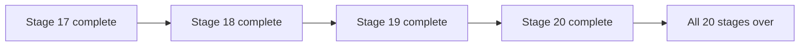

# AGENTS.md - Gamma 4 Harness Functional Gemma Contract

> Status date: `2026-04-15`
> Scope: This file fully replaces the previous 20-task build contract.
> Mission: make Gamma Harness actually functional as a local Gemma-first coding harness on 16 GB CPU-first hardware.
> Constraint: touch architecture with discipline, not with hype.

This document is intentionally oversized. Target executor may be a small fast model with limited memory and imperfect planning. Repetition here is not waste. Repetition is guardrail. The whole point is to front-load exact execution rules so runtime work burns fewer model turns and fewer local CPU cycles.

## 1. Replacement Notice

The old 20-task contract is obsolete for this purpose. Remove it mentally. Do not partially blend old task numbering with new work. This document is the new contract. If any older section, doc, checklist, or mental model conflicts with what is written here, this file wins until the code and top-level docs are brought into alignment.

## 2. Product Truth

Gamma Harness is not trying to be the biggest orchestration platform. Gamma Harness is trying to be the best boring local coding harness for a constrained machine. That means the system must feel responsive, explain what it is doing, keep tool use safe, and stop burning latency on meta-work. The correct default is lean, visible, and recoverable.

### Non-negotiable outcomes

- User can switch between direct chat and agentic coding in the composer bar.
- User can switch between think and no-think behavior when backend supports it.
- Gemma-native tool calling is preferred over simulated or manual tool syntax whenever native path exists.
- Image attachments work end-to-end in web UI through Ollama native chat path.
- PromptAnalyzer no longer adds hidden model round-trips in hot path.
- Web UI shows real runtime trace and model-emitted thinking separately from final answer.
- Caveman plugin is integrated only for agentic-task narration and never weakens safety copy.
- Repo indexing, session storage, and model budgets are constrained for long-term local usability.
- Final release gate can say with evidence whether app is actually functional.

## 3. Official Research Basis

This contract was refreshed using official Gemma and Ollama documentation plus current repo state. Use these sources as capability truth before inventing local prompt folklore.

- `Google Gemma docs overview`: https://ai.google.dev/gemma/docs - Used for family-level capability and workflow orientation.
- `Google Gemma function calling docs`: https://ai.google.dev/gemma/docs/capabilities/function-calling - Used for native tool-calling expectations and response structure.
- `Google Gemma thinking docs`: https://ai.google.dev/gemma/docs/capabilities/thinking - Used for thinking-mode concepts and separate reasoning stream behavior.
- `Google Gemma 4 prompt formatting docs`: https://ai.google.dev/gemma/docs/core/prompt-formatting-gemma4 - Used for Gemma 4 control-token and prompt-format guidance.
- `Ollama thinking docs`: https://docs.ollama.com/capabilities/thinking - Used for `think` request parameter and streamed `message.thinking` behavior.
- `Ollama vision docs`: https://docs.ollama.com/capabilities/vision - Used for `images` array behavior and base64 image API contract.
- `Ollama tool calling docs`: https://docs.ollama.com/capabilities/tool-calling - Used for native tool message flow and tool result loop contract.

### Research interpretation for this repo

- Gemma family docs describe native tool-calling and thinking controls as first-class capabilities. Do not replace them with prompt tricks when backend can expose them directly.
- Gemma 4 prompt-format docs describe control-token conventions. In this harness, Ollama should own those native formatting details whenever native API is available.
- Ollama docs confirm `think` is a request field and `message.thinking` is a separate response field in chat streams for thinking-capable models.
- Ollama docs confirm image inputs belong in message-level `images` arrays and REST API expects base64 image data.
- Ollama docs confirm native tool-calling flow is message -> tool_calls -> tool results -> final answer. That aligns with user goal better than forcing OpenAI-compat path when native path exists.
- The repo uses model alias `gemma4:e4b`. Treat that alias as runtime target. When upstream docs use family-level naming instead of exact tag alias, follow capability mapping and provider behavior rather than string worship.

## 4. Current Repo Truth Before New Work

Do not enter this repo as if nothing has been done. That is how small models destroy progress. The current tree already contains meaningful work related to this contract. Every future edit must start from these facts.

- Current repo already sets `PromptAnalyzer` to pass-through in `packages/core/src/prompt-analyzer.ts`.
- Current repo already removed API analyzer hook and forwards `thinking` and `images` in `apps/api/src/server.ts`.
- Current repo already passes `think` and `images` in adapter and prefers native Ollama path in `packages/model-adapter/src/client.ts`.
- Current repo already defaults engine/config to fast local profile and shorter keep-alive.
- Current repo already has web toggles for direct versus agentic and thinking, plus image attachment UI.
- Current repo already has CLI `/thinking` and `/nothinking` commands.
- Current repo already weakens repo-indexing cost with cache behavior.
- Current repo already adds metadata index path for session store scaling.
- Build, unit, and integration checks pass locally in sandbox-safe mode.
- Sandbox still blocks local port binding for some API and CLI e2e flows, so release gate must distinguish sandbox from real host.

### Dirty-tree policy

- Never use destructive git reset or checkout to get emotional relief from complexity.
- Audit modified files and integrate with them.
- If a dirty file already satisfies a stage requirement, keep it and move forward.
- If two changes conflict, reconcile intentionally and preserve user intent.

## 5. Machine Profile and Design Bias

Target machine is local Linux laptop, roughly 16 GB RAM, CPU-first inference, Ollama installed locally, `gemma4:e4b` workable, larger models unreliable or too slow. This means every stage must assume expensive model calls, expensive retries, and expensive repeated context loading.

### Therefore

- Fast profile is default.
- Direct mode is first-class, not fallback.
- Planner and manual tool loops are expensive and must be intentional.
- Anything that adds an extra model call must justify itself against local latency budget.
- Background indexing, session scanning, and UI dev overhead are real product concerns, not side notes.
- Visual trace is required because local models may be slower; user must be able to see progress immediately.

## 6. Global Operating Rules

- One model call before first useful token is ideal; more than one requires explicit justification.
- Prefer deterministic local tools over asking model to reason about facts already in workspace.
- Use native Ollama chat when think, images, or native tools matter.
- Never simulate tool calls when backend can do native tool calling.
- Never ask model to rewrite user prompt before answering.
- Keep system prompts short, operational, and mode-specific.
- Direct mode must skip planner and tool overhead unless task truly requires it.
- Agentic mode must expose visible trace for every major action.
- Thinking display must be provider-emitted or harness-generated summary only; no invented hidden CoT.
- Treat images as attachments, not prompt text blobs.
- Audio and video remain future work unless backend support is real and tested.
- Cache repo context. Do not rescan whole workspace every turn.
- Use metadata index for session listing. Do not load every transcript to draw history list.
- Default profile is fast. Deep mode is explicit, capped, and slower by design.
- Retries are expensive on CPU; prefer one good retry to many silent stalls.
- Keep model keep-alive short on low-RAM machines.
- Require ripgrep or clearly degrade with warning; recursive JS walks are last resort.
- Benchmark built app or CLI, not dev-server-noise stack, when measuring latency.
- Never hide approval or diff preview behind native tool fast path.
- Preserve user wording unless validation or attachment binding requires minimal mutation.
- Mode toggles are part of product, not debug controls.
- If user asks what model is doing, answer from trace and provider thinking, not imagination.
- Keep trace payloads short enough for UI responsiveness.
- Do not let style plugins alter JSON, shell commands, code blocks, or approval warnings.
- Caveman compression is useful for agentic summaries, not for safety-critical copy.
- If current repo already solved part of a task, verify then keep; do not rewrite for vanity.
- Dirty repo means merge carefully, never reset casually.
- Every fallback path must emit a reason.
- Every default in code must be echoed accurately in docs.
- Fast local harness beats clever but latent orchestrator designs.
- Two subagents maximum for this product direction; more orchestration increases context drag.
- When in doubt, choose smaller prompts, fewer turns, and clearer trace.
- Tool schemas must stay exact and machine-readable.
- Image validation should happen before expensive model call.
- Show user enough status to trust system, but not giant raw payload dumps.
- Session restore should preserve user-visible mode state.
- Separate operator diagnostics from end-user answer channel.
- All safety denials must explain why and what boundary blocked action.
- All release gates should be runnable on target hardware without cloud dependency.
- Do not pretend unsupported features exist. Honest no beats broken yes.

## 7. Mode Contract

| Mode | Meaning | Contract |
|---|---|---|
| Direct + No Think | Direct mode with no think | Fastest path. Use for simple Q and A, inspect tasks, status lookups, and deterministic local answers. Avoid planner unless task escalates itself. |
| Direct + Think | Direct mode with think | Use when user wants reasoning-heavy answer without tool orchestration. Still keep trace light and avoid planner/tool loops. |
| Agentic + No Think | Agentic mode with no think | Use for coding actions where model should act through tools quickly and trace is more important than long reasoning trace. |
| Agentic + Think | Agentic mode with think | Use for the hardest coding tasks when user wants both planning/tool execution and model-emitted reasoning trace. |

### Mode invariants

- Direct mode may still use deterministic local tools for repo facts, but it does not open full planner loop by default.
- Agentic mode owns coding tasks, multi-step edits, approvals, diff previews, and verification loops.
- Think toggle affects both direct and agentic modes when provider supports it.
- Caveman overlay is only valid in agentic mode under this contract.
- If provider cannot emit thinking, UI should still show runtime action trace so user sees progress.

## 8. Two-Subagent Rule

This project may use exactly two subagents when parallelism helps. More than two is not productively local for this harness. Subagents are helpers, not a swarm.

### Allowed split

- Lane A: runtime, adapter, API, safety, perf, tests.
- Lane B: web UI, CLI UX parity, docs, caveman integration, release notes.
- Main orchestrator keeps architecture, merge discipline, and final verification.

### Forbidden split

- Do not let two agents write same file.
- Do not ask two agents the same research question.
- Do not delegate immediate blocking task then sit idle waiting.
- Do not create a meta-agent just to ask whether user prompt is clear.

## 9. Functional Definition of Done

- App boots locally.
- Web UI can send direct chat and agentic chat.
- User can toggle thinking and see effect.
- Agentic path can read repo, plan, show trace, request approval, and execute edits safely.
- Image attachments work in local web UI.
- Native Gemma tool path is preferred.
- No clarifying prompt sub-agent runs before request.
- Docs tell same truth as code.
- Regression suite protects main behavior.
- System still feels usable on target hardware.

## 10. Current Command Baseline

These commands are part of the known-good baseline and should continue to work as contract checks.

- `npm run build`
- `node --import tsx tests/unit/core.test.ts`
- `node --import tsx tests/integration/workflow.test.ts`
- `node apps/cli/dist/cli.js config show --json`
- `node apps/cli/dist/cli.js session list --json`
- `node apps/cli/dist/cli.js workspace status --json`
- `node apps/cli/dist/cli.js skills list --json`

## 11. The New 20-Stage Program

Each stage below is mandatory unless already fully satisfied and verified in current repo. If current repo already contains partial implementation, the task is to verify and finish, not to re-implement for ego.

## Stage 1. Two-Subagent Lane Lock and Dirty Tree Audit

**Purpose:** Freeze execution shape before more edits. Use exactly two subagents, separate write scopes, and treat current dirty tree as reality to reconcile instead of reset.

**Why now:** Gamma Harness already has in-progress work. Small fast models lose time and safety when they re-open solved decisions, collide on files, or undo user work.

**Current-state hint:** Current repo already contains partial Gemma upgrade work. This stage forces audit-first, not rewrite-first.

### Primary files and surfaces

- `AGENTS.md`
- `README.md`
- `docs/architecture.md`
- `docs/release-gate.md`

### Workspace areas touched

- `apps/`
- `packages/`
- `docs/`
- `tests/`

### Required deliverables

- Two-lane plan with non-overlapping ownership and explicit integration points.
- Dirty-tree audit that labels each modified file as keep, verify, complete, or revisit.
- Execution rule that no task may start with a destructive reset or broad revert.
- Single source of truth for runtime defaults, release gate, and current repo status.

### Acceptance gate

- Exactly two subagents maximum for work that truly benefits from parallelism.
- Every changed file is explained before further modification.
- No task assumes clean git state.
- No task duplicates work already shipped in runtime, UI, or tests.

### Exact work order

- Read current implementation in files for Stage 1 before writing anything.
- Compare repo state against user requirement for Stage 1.
- List gaps in one short internal checklist.
- Patch only the real gaps in Stage 1 scope.
- Run narrow verification first, then broader build and workflow checks if needed.
- Update docs or release notes tied to Stage 1 only after code path is true.
- Emit trace, routing, and operator-facing copy that match final behavior.
- If current code already satisfies Stage 1, record keep-and-verify decision and move on.

### What must never happen in this stage

- No hidden extra model round-trips.
- No doc claims beyond tested behavior.
- No silent fallback without trace reason.
- No safety bypass for speed.
- No broad rewrite of unrelated files.
- No assumption that bigger model or cloud fallback will save bad local design.

### Small fast model execution brief

For Stage 1, executor must use short prompts, short loops, and explicit file targets. Start from concrete files above. Avoid brainstorming. Prefer patch, test, verify, document. If route choice exists, prefer fewer model turns and better operator visibility.

### Lane packets

#### Stage 1 / Lead lane

**Lane role:** Own sequencing, lane boundaries, integration order, and final done definition.

**Stage focus:** Two-Subagent Lane Lock and Dirty Tree Audit interpreted through lead ownership.

**Read first:**

- Files in Stage 1 primary file list that match lead ownership.
- Nearby tests and docs before opening wider repo search.
- Existing trace, config, or UI copy linked to this behavior.
- Current user-visible labels, request fields, or persisted state names.

**Do in order:**

- Confirm present behavior for Stage 1 in current repo.
- Identify smallest change set that finishes Stage 1.
- Keep interfaces stable unless broken by requirement.
- Prefer additive trace and validation over magical inference.
- Keep latency budget visible in every design choice.
- Leave proof: test, build, doc note, or trace artifact.

**Avoid:**

- Editing files owned by another lane without clear reason.
- Adding hidden fallback layers without operator visibility.
- Writing giant prompts when adapter or code can carry structure.
- Assuming direct mode and agentic mode may share identical hot path.
- Breaking safety or observability while chasing speed.

**Evidence to capture:**

- One concrete proof that Stage 1 behavior improved or stayed correct.
- One proof that latency or operator visibility did not regress.
- One proof that docs and UI labels still match payload names.
- One proof that safety boundary still holds where relevant.

**Output shape for small model:**

- Name Stage 1.
- Name exact files touched or verified.
- State route decision in one sentence.
- State verification in one sentence.
- State residual risk in one sentence if any.

**Micro-prompt template:**

> Finish Stage 1 `Two-Subagent Lane Lock and Dirty Tree Audit` from current repo state. Read exact files first. Patch smallest gap only. Keep local latency low. Preserve safety. Verify with narrow test then broader build if needed.

#### Stage 1 / Runtime lane

**Lane role:** Own core engine path, mode split, planner budget, and trace semantics.

**Stage focus:** Two-Subagent Lane Lock and Dirty Tree Audit interpreted through runtime ownership.

**Read first:**

- Files in Stage 1 primary file list that match runtime ownership.
- Nearby tests and docs before opening wider repo search.
- Existing trace, config, or UI copy linked to this behavior.
- Current user-visible labels, request fields, or persisted state names.

**Do in order:**

- Confirm present behavior for Stage 1 in current repo.
- Identify smallest change set that finishes Stage 1.
- Keep interfaces stable unless broken by requirement.
- Prefer additive trace and validation over magical inference.
- Keep latency budget visible in every design choice.
- Leave proof: test, build, doc note, or trace artifact.

**Avoid:**

- Editing files owned by another lane without clear reason.
- Adding hidden fallback layers without operator visibility.
- Writing giant prompts when adapter or code can carry structure.
- Assuming direct mode and agentic mode may share identical hot path.
- Breaking safety or observability while chasing speed.

**Evidence to capture:**

- One concrete proof that Stage 1 behavior improved or stayed correct.
- One proof that latency or operator visibility did not regress.
- One proof that docs and UI labels still match payload names.
- One proof that safety boundary still holds where relevant.

**Output shape for small model:**

- Name Stage 1.
- Name exact files touched or verified.
- State route decision in one sentence.
- State verification in one sentence.
- State residual risk in one sentence if any.

**Micro-prompt template:**

> Finish Stage 1 `Two-Subagent Lane Lock and Dirty Tree Audit` from current repo state. Read exact files first. Patch smallest gap only. Keep local latency low. Preserve safety. Verify with narrow test then broader build if needed.

#### Stage 1 / Adapter lane

**Lane role:** Own Ollama native routing, think control, tool calls, images, and capability detection.

**Stage focus:** Two-Subagent Lane Lock and Dirty Tree Audit interpreted through adapter ownership.

**Read first:**

- Files in Stage 1 primary file list that match adapter ownership.
- Nearby tests and docs before opening wider repo search.
- Existing trace, config, or UI copy linked to this behavior.
- Current user-visible labels, request fields, or persisted state names.

**Do in order:**

- Confirm present behavior for Stage 1 in current repo.
- Identify smallest change set that finishes Stage 1.
- Keep interfaces stable unless broken by requirement.
- Prefer additive trace and validation over magical inference.
- Keep latency budget visible in every design choice.
- Leave proof: test, build, doc note, or trace artifact.

**Avoid:**

- Editing files owned by another lane without clear reason.
- Adding hidden fallback layers without operator visibility.
- Writing giant prompts when adapter or code can carry structure.
- Assuming direct mode and agentic mode may share identical hot path.
- Breaking safety or observability while chasing speed.

**Evidence to capture:**

- One concrete proof that Stage 1 behavior improved or stayed correct.
- One proof that latency or operator visibility did not regress.
- One proof that docs and UI labels still match payload names.
- One proof that safety boundary still holds where relevant.

**Output shape for small model:**

- Name Stage 1.
- Name exact files touched or verified.
- State route decision in one sentence.
- State verification in one sentence.
- State residual risk in one sentence if any.

**Micro-prompt template:**

> Finish Stage 1 `Two-Subagent Lane Lock and Dirty Tree Audit` from current repo state. Read exact files first. Patch smallest gap only. Keep local latency low. Preserve safety. Verify with narrow test then broader build if needed.

#### Stage 1 / API lane

**Lane role:** Own request validation, stream contract, approval queue wiring, and payload shape.

**Stage focus:** Two-Subagent Lane Lock and Dirty Tree Audit interpreted through api ownership.

**Read first:**

- Files in Stage 1 primary file list that match api ownership.
- Nearby tests and docs before opening wider repo search.
- Existing trace, config, or UI copy linked to this behavior.
- Current user-visible labels, request fields, or persisted state names.

**Do in order:**

- Confirm present behavior for Stage 1 in current repo.
- Identify smallest change set that finishes Stage 1.
- Keep interfaces stable unless broken by requirement.
- Prefer additive trace and validation over magical inference.
- Keep latency budget visible in every design choice.
- Leave proof: test, build, doc note, or trace artifact.

**Avoid:**

- Editing files owned by another lane without clear reason.
- Adding hidden fallback layers without operator visibility.
- Writing giant prompts when adapter or code can carry structure.
- Assuming direct mode and agentic mode may share identical hot path.
- Breaking safety or observability while chasing speed.

**Evidence to capture:**

- One concrete proof that Stage 1 behavior improved or stayed correct.
- One proof that latency or operator visibility did not regress.
- One proof that docs and UI labels still match payload names.
- One proof that safety boundary still holds where relevant.

**Output shape for small model:**

- Name Stage 1.
- Name exact files touched or verified.
- State route decision in one sentence.
- State verification in one sentence.
- State residual risk in one sentence if any.

**Micro-prompt template:**

> Finish Stage 1 `Two-Subagent Lane Lock and Dirty Tree Audit` from current repo state. Read exact files first. Patch smallest gap only. Keep local latency low. Preserve safety. Verify with narrow test then broader build if needed.

#### Stage 1 / Web lane

**Lane role:** Own composer UX, toggles, image previews, trace rendering, and thinking panel.

**Stage focus:** Two-Subagent Lane Lock and Dirty Tree Audit interpreted through web ownership.

**Read first:**

- Files in Stage 1 primary file list that match web ownership.
- Nearby tests and docs before opening wider repo search.
- Existing trace, config, or UI copy linked to this behavior.
- Current user-visible labels, request fields, or persisted state names.

**Do in order:**

- Confirm present behavior for Stage 1 in current repo.
- Identify smallest change set that finishes Stage 1.
- Keep interfaces stable unless broken by requirement.
- Prefer additive trace and validation over magical inference.
- Keep latency budget visible in every design choice.
- Leave proof: test, build, doc note, or trace artifact.

**Avoid:**

- Editing files owned by another lane without clear reason.
- Adding hidden fallback layers without operator visibility.
- Writing giant prompts when adapter or code can carry structure.
- Assuming direct mode and agentic mode may share identical hot path.
- Breaking safety or observability while chasing speed.

**Evidence to capture:**

- One concrete proof that Stage 1 behavior improved or stayed correct.
- One proof that latency or operator visibility did not regress.
- One proof that docs and UI labels still match payload names.
- One proof that safety boundary still holds where relevant.

**Output shape for small model:**

- Name Stage 1.
- Name exact files touched or verified.
- State route decision in one sentence.
- State verification in one sentence.
- State residual risk in one sentence if any.

**Micro-prompt template:**

> Finish Stage 1 `Two-Subagent Lane Lock and Dirty Tree Audit` from current repo state. Read exact files first. Patch smallest gap only. Keep local latency low. Preserve safety. Verify with narrow test then broader build if needed.

#### Stage 1 / CLI lane

**Lane role:** Own REPL parity, mode toggles, status visibility, and operator ergonomics.

**Stage focus:** Two-Subagent Lane Lock and Dirty Tree Audit interpreted through cli ownership.

**Read first:**

- Files in Stage 1 primary file list that match cli ownership.
- Nearby tests and docs before opening wider repo search.
- Existing trace, config, or UI copy linked to this behavior.
- Current user-visible labels, request fields, or persisted state names.

**Do in order:**

- Confirm present behavior for Stage 1 in current repo.
- Identify smallest change set that finishes Stage 1.
- Keep interfaces stable unless broken by requirement.
- Prefer additive trace and validation over magical inference.
- Keep latency budget visible in every design choice.
- Leave proof: test, build, doc note, or trace artifact.

**Avoid:**

- Editing files owned by another lane without clear reason.
- Adding hidden fallback layers without operator visibility.
- Writing giant prompts when adapter or code can carry structure.
- Assuming direct mode and agentic mode may share identical hot path.
- Breaking safety or observability while chasing speed.

**Evidence to capture:**

- One concrete proof that Stage 1 behavior improved or stayed correct.
- One proof that latency or operator visibility did not regress.
- One proof that docs and UI labels still match payload names.
- One proof that safety boundary still holds where relevant.

**Output shape for small model:**

- Name Stage 1.
- Name exact files touched or verified.
- State route decision in one sentence.
- State verification in one sentence.
- State residual risk in one sentence if any.

**Micro-prompt template:**

> Finish Stage 1 `Two-Subagent Lane Lock and Dirty Tree Audit` from current repo state. Read exact files first. Patch smallest gap only. Keep local latency low. Preserve safety. Verify with narrow test then broader build if needed.

#### Stage 1 / Safety lane

**Lane role:** Own workspace boundaries, diff previews, approval parity, and dangerous-op clarity.

**Stage focus:** Two-Subagent Lane Lock and Dirty Tree Audit interpreted through safety ownership.

**Read first:**

- Files in Stage 1 primary file list that match safety ownership.
- Nearby tests and docs before opening wider repo search.
- Existing trace, config, or UI copy linked to this behavior.
- Current user-visible labels, request fields, or persisted state names.

**Do in order:**

- Confirm present behavior for Stage 1 in current repo.
- Identify smallest change set that finishes Stage 1.
- Keep interfaces stable unless broken by requirement.
- Prefer additive trace and validation over magical inference.
- Keep latency budget visible in every design choice.
- Leave proof: test, build, doc note, or trace artifact.

**Avoid:**

- Editing files owned by another lane without clear reason.
- Adding hidden fallback layers without operator visibility.
- Writing giant prompts when adapter or code can carry structure.
- Assuming direct mode and agentic mode may share identical hot path.
- Breaking safety or observability while chasing speed.

**Evidence to capture:**

- One concrete proof that Stage 1 behavior improved or stayed correct.
- One proof that latency or operator visibility did not regress.
- One proof that docs and UI labels still match payload names.
- One proof that safety boundary still holds where relevant.

**Output shape for small model:**

- Name Stage 1.
- Name exact files touched or verified.
- State route decision in one sentence.
- State verification in one sentence.
- State residual risk in one sentence if any.

**Micro-prompt template:**

> Finish Stage 1 `Two-Subagent Lane Lock and Dirty Tree Audit` from current repo state. Read exact files first. Patch smallest gap only. Keep local latency low. Preserve safety. Verify with narrow test then broader build if needed.

#### Stage 1 / Perf lane

**Lane role:** Own latency budgets, cache policy, keep-alive, retry policy, and realistic benchmark method.

**Stage focus:** Two-Subagent Lane Lock and Dirty Tree Audit interpreted through perf ownership.

**Read first:**

- Files in Stage 1 primary file list that match perf ownership.
- Nearby tests and docs before opening wider repo search.
- Existing trace, config, or UI copy linked to this behavior.
- Current user-visible labels, request fields, or persisted state names.

**Do in order:**

- Confirm present behavior for Stage 1 in current repo.
- Identify smallest change set that finishes Stage 1.
- Keep interfaces stable unless broken by requirement.
- Prefer additive trace and validation over magical inference.
- Keep latency budget visible in every design choice.
- Leave proof: test, build, doc note, or trace artifact.

**Avoid:**

- Editing files owned by another lane without clear reason.
- Adding hidden fallback layers without operator visibility.
- Writing giant prompts when adapter or code can carry structure.
- Assuming direct mode and agentic mode may share identical hot path.
- Breaking safety or observability while chasing speed.

**Evidence to capture:**

- One concrete proof that Stage 1 behavior improved or stayed correct.
- One proof that latency or operator visibility did not regress.
- One proof that docs and UI labels still match payload names.
- One proof that safety boundary still holds where relevant.

**Output shape for small model:**

- Name Stage 1.
- Name exact files touched or verified.
- State route decision in one sentence.
- State verification in one sentence.
- State residual risk in one sentence if any.

**Micro-prompt template:**

> Finish Stage 1 `Two-Subagent Lane Lock and Dirty Tree Audit` from current repo state. Read exact files first. Patch smallest gap only. Keep local latency low. Preserve safety. Verify with narrow test then broader build if needed.

#### Stage 1 / QA lane

**Lane role:** Own tests, mock behavior, regression matrix, and environment notes.

**Stage focus:** Two-Subagent Lane Lock and Dirty Tree Audit interpreted through qa ownership.

**Read first:**

- Files in Stage 1 primary file list that match qa ownership.
- Nearby tests and docs before opening wider repo search.
- Existing trace, config, or UI copy linked to this behavior.
- Current user-visible labels, request fields, or persisted state names.

**Do in order:**

- Confirm present behavior for Stage 1 in current repo.
- Identify smallest change set that finishes Stage 1.
- Keep interfaces stable unless broken by requirement.
- Prefer additive trace and validation over magical inference.
- Keep latency budget visible in every design choice.
- Leave proof: test, build, doc note, or trace artifact.

**Avoid:**

- Editing files owned by another lane without clear reason.
- Adding hidden fallback layers without operator visibility.
- Writing giant prompts when adapter or code can carry structure.
- Assuming direct mode and agentic mode may share identical hot path.
- Breaking safety or observability while chasing speed.

**Evidence to capture:**

- One concrete proof that Stage 1 behavior improved or stayed correct.
- One proof that latency or operator visibility did not regress.
- One proof that docs and UI labels still match payload names.
- One proof that safety boundary still holds where relevant.

**Output shape for small model:**

- Name Stage 1.
- Name exact files touched or verified.
- State route decision in one sentence.
- State verification in one sentence.
- State residual risk in one sentence if any.

**Micro-prompt template:**

> Finish Stage 1 `Two-Subagent Lane Lock and Dirty Tree Audit` from current repo state. Read exact files first. Patch smallest gap only. Keep local latency low. Preserve safety. Verify with narrow test then broader build if needed.

#### Stage 1 / Docs lane

**Lane role:** Own README, AGENTS, architecture docs, prompt docs, and release gate consistency.

**Stage focus:** Two-Subagent Lane Lock and Dirty Tree Audit interpreted through docs ownership.

**Read first:**

- Files in Stage 1 primary file list that match docs ownership.
- Nearby tests and docs before opening wider repo search.
- Existing trace, config, or UI copy linked to this behavior.
- Current user-visible labels, request fields, or persisted state names.

**Do in order:**

- Confirm present behavior for Stage 1 in current repo.
- Identify smallest change set that finishes Stage 1.
- Keep interfaces stable unless broken by requirement.
- Prefer additive trace and validation over magical inference.
- Keep latency budget visible in every design choice.
- Leave proof: test, build, doc note, or trace artifact.

**Avoid:**

- Editing files owned by another lane without clear reason.
- Adding hidden fallback layers without operator visibility.
- Writing giant prompts when adapter or code can carry structure.
- Assuming direct mode and agentic mode may share identical hot path.
- Breaking safety or observability while chasing speed.

**Evidence to capture:**

- One concrete proof that Stage 1 behavior improved or stayed correct.
- One proof that latency or operator visibility did not regress.
- One proof that docs and UI labels still match payload names.
- One proof that safety boundary still holds where relevant.

**Output shape for small model:**

- Name Stage 1.
- Name exact files touched or verified.
- State route decision in one sentence.
- State verification in one sentence.
- State residual risk in one sentence if any.

**Micro-prompt template:**

> Finish Stage 1 `Two-Subagent Lane Lock and Dirty Tree Audit` from current repo state. Read exact files first. Patch smallest gap only. Keep local latency low. Preserve safety. Verify with narrow test then broader build if needed.

### Reviewer questions

- Does Stage 1 remove work from hot path or add work to hot path?
- Does Stage 1 improve user control or hide control?
- Does Stage 1 keep direct mode fast and agentic mode capable?
- Does Stage 1 preserve safety parity across native and fallback routes?
- Does Stage 1 leave enough trace for operator trust?
- Does Stage 1 update docs if behavior changed?

### Verification matrix

- Unit-level verification for Stage 1 logic.
- Integration-level verification where Stage 1 crosses packages.
- UI/CLI/API parity check if Stage 1 changes surface contract.
- Release-doc parity check for Stage 1.
- Latency sanity check for Stage 1.
- Safety sanity check for Stage 1 if tool or write path is involved.

### Stage 1 completion note

- Status: complete.
- Added: two-lane lock, dirty-tree audit labels, no-reset rule, and current repo source-of-truth.
- Keep: non-overlapping ownership; revisit only doc drift.

## Stage 2. Baseline CPU Truth Capture

**Purpose:** Measure real cold-start, warm-start, stream-first-token, tool-loop, and memory behavior on 16 GB CPU-only hardware before declaring any optimization complete.

**Why now:** The repo felt slow because the path was over-engineered. Without baseline numbers, small models chase the wrong bottleneck.

**Current-state hint:** Build and core tests pass already. This stage turns local speed into a tracked contract.

### Primary files and surfaces

- `docs/benchmarks.md`
- `packages/doctor/src/benchmark.ts`
- `packages/doctor/src/diagnostics.ts`
- `README.md`

### Workspace areas touched

- `packages/doctor/`
- `docs/`
- `apps/web/`
- `apps/api/`

### Required deliverables

- Benchmark matrix for direct chat, agentic chat, tool call, image turn, and think on/off.
- Operator note that built web or CLI should be used for measurement, not Vite dev noise.
- Hardware assumptions written down explicitly: 16 GB RAM, CPU-first, local Ollama.
- Simple thresholds for first token, full response, and tool loop regression detection.

### Acceptance gate

- Benchmarks compare direct mode and agentic mode separately.
- Benchmarks distinguish cold and warm model path.
- Regression budget is stated numerically.
- Docs explain that sandboxed port-binding results are not equivalent to local host results.

### Exact work order

- Read current implementation in files for Stage 2 before writing anything.
- Compare repo state against user requirement for Stage 2.
- List gaps in one short internal checklist.
- Patch only the real gaps in Stage 2 scope.
- Run narrow verification first, then broader build and workflow checks if needed.
- Update docs or release notes tied to Stage 2 only after code path is true.
- Emit trace, routing, and operator-facing copy that match final behavior.
- If current code already satisfies Stage 2, record keep-and-verify decision and move on.

### What must never happen in this stage

- No hidden extra model round-trips.
- No doc claims beyond tested behavior.
- No silent fallback without trace reason.
- No safety bypass for speed.
- No broad rewrite of unrelated files.
- No assumption that bigger model or cloud fallback will save bad local design.

### Small fast model execution brief

For Stage 2, executor must use short prompts, short loops, and explicit file targets. Start from concrete files above. Avoid brainstorming. Prefer patch, test, verify, document. If route choice exists, prefer fewer model turns and better operator visibility.

### Lane packets

#### Stage 2 / Lead lane

**Lane role:** Own sequencing, lane boundaries, integration order, and final done definition.

**Stage focus:** Baseline CPU Truth Capture interpreted through lead ownership.

**Read first:**

- Files in Stage 2 primary file list that match lead ownership.
- Nearby tests and docs before opening wider repo search.
- Existing trace, config, or UI copy linked to this behavior.
- Current user-visible labels, request fields, or persisted state names.

**Do in order:**

- Confirm present behavior for Stage 2 in current repo.
- Identify smallest change set that finishes Stage 2.
- Keep interfaces stable unless broken by requirement.
- Prefer additive trace and validation over magical inference.
- Keep latency budget visible in every design choice.
- Leave proof: test, build, doc note, or trace artifact.

**Avoid:**

- Editing files owned by another lane without clear reason.
- Adding hidden fallback layers without operator visibility.
- Writing giant prompts when adapter or code can carry structure.
- Assuming direct mode and agentic mode may share identical hot path.
- Breaking safety or observability while chasing speed.

**Evidence to capture:**

- One concrete proof that Stage 2 behavior improved or stayed correct.
- One proof that latency or operator visibility did not regress.
- One proof that docs and UI labels still match payload names.
- One proof that safety boundary still holds where relevant.

**Output shape for small model:**

- Name Stage 2.
- Name exact files touched or verified.
- State route decision in one sentence.
- State verification in one sentence.
- State residual risk in one sentence if any.

**Micro-prompt template:**

> Finish Stage 2 `Baseline CPU Truth Capture` from current repo state. Read exact files first. Patch smallest gap only. Keep local latency low. Preserve safety. Verify with narrow test then broader build if needed.

#### Stage 2 / Runtime lane

**Lane role:** Own core engine path, mode split, planner budget, and trace semantics.

**Stage focus:** Baseline CPU Truth Capture interpreted through runtime ownership.

**Read first:**

- Files in Stage 2 primary file list that match runtime ownership.
- Nearby tests and docs before opening wider repo search.
- Existing trace, config, or UI copy linked to this behavior.
- Current user-visible labels, request fields, or persisted state names.

**Do in order:**

- Confirm present behavior for Stage 2 in current repo.
- Identify smallest change set that finishes Stage 2.
- Keep interfaces stable unless broken by requirement.
- Prefer additive trace and validation over magical inference.
- Keep latency budget visible in every design choice.
- Leave proof: test, build, doc note, or trace artifact.

**Avoid:**

- Editing files owned by another lane without clear reason.
- Adding hidden fallback layers without operator visibility.
- Writing giant prompts when adapter or code can carry structure.
- Assuming direct mode and agentic mode may share identical hot path.
- Breaking safety or observability while chasing speed.

**Evidence to capture:**

- One concrete proof that Stage 2 behavior improved or stayed correct.
- One proof that latency or operator visibility did not regress.
- One proof that docs and UI labels still match payload names.
- One proof that safety boundary still holds where relevant.

**Output shape for small model:**

- Name Stage 2.
- Name exact files touched or verified.
- State route decision in one sentence.
- State verification in one sentence.
- State residual risk in one sentence if any.

**Micro-prompt template:**

> Finish Stage 2 `Baseline CPU Truth Capture` from current repo state. Read exact files first. Patch smallest gap only. Keep local latency low. Preserve safety. Verify with narrow test then broader build if needed.

#### Stage 2 / Adapter lane

**Lane role:** Own Ollama native routing, think control, tool calls, images, and capability detection.

**Stage focus:** Baseline CPU Truth Capture interpreted through adapter ownership.

**Read first:**

- Files in Stage 2 primary file list that match adapter ownership.
- Nearby tests and docs before opening wider repo search.
- Existing trace, config, or UI copy linked to this behavior.
- Current user-visible labels, request fields, or persisted state names.

**Do in order:**

- Confirm present behavior for Stage 2 in current repo.
- Identify smallest change set that finishes Stage 2.
- Keep interfaces stable unless broken by requirement.
- Prefer additive trace and validation over magical inference.
- Keep latency budget visible in every design choice.
- Leave proof: test, build, doc note, or trace artifact.

**Avoid:**

- Editing files owned by another lane without clear reason.
- Adding hidden fallback layers without operator visibility.
- Writing giant prompts when adapter or code can carry structure.
- Assuming direct mode and agentic mode may share identical hot path.
- Breaking safety or observability while chasing speed.

**Evidence to capture:**

- One concrete proof that Stage 2 behavior improved or stayed correct.
- One proof that latency or operator visibility did not regress.
- One proof that docs and UI labels still match payload names.
- One proof that safety boundary still holds where relevant.

**Output shape for small model:**

- Name Stage 2.
- Name exact files touched or verified.
- State route decision in one sentence.
- State verification in one sentence.
- State residual risk in one sentence if any.

**Micro-prompt template:**

> Finish Stage 2 `Baseline CPU Truth Capture` from current repo state. Read exact files first. Patch smallest gap only. Keep local latency low. Preserve safety. Verify with narrow test then broader build if needed.

#### Stage 2 / API lane

**Lane role:** Own request validation, stream contract, approval queue wiring, and payload shape.

**Stage focus:** Baseline CPU Truth Capture interpreted through api ownership.

**Read first:**

- Files in Stage 2 primary file list that match api ownership.
- Nearby tests and docs before opening wider repo search.
- Existing trace, config, or UI copy linked to this behavior.
- Current user-visible labels, request fields, or persisted state names.

**Do in order:**

- Confirm present behavior for Stage 2 in current repo.
- Identify smallest change set that finishes Stage 2.
- Keep interfaces stable unless broken by requirement.
- Prefer additive trace and validation over magical inference.
- Keep latency budget visible in every design choice.
- Leave proof: test, build, doc note, or trace artifact.

**Avoid:**

- Editing files owned by another lane without clear reason.
- Adding hidden fallback layers without operator visibility.
- Writing giant prompts when adapter or code can carry structure.
- Assuming direct mode and agentic mode may share identical hot path.
- Breaking safety or observability while chasing speed.

**Evidence to capture:**

- One concrete proof that Stage 2 behavior improved or stayed correct.
- One proof that latency or operator visibility did not regress.
- One proof that docs and UI labels still match payload names.
- One proof that safety boundary still holds where relevant.

**Output shape for small model:**

- Name Stage 2.
- Name exact files touched or verified.
- State route decision in one sentence.
- State verification in one sentence.
- State residual risk in one sentence if any.

**Micro-prompt template:**

> Finish Stage 2 `Baseline CPU Truth Capture` from current repo state. Read exact files first. Patch smallest gap only. Keep local latency low. Preserve safety. Verify with narrow test then broader build if needed.

#### Stage 2 / Web lane

**Lane role:** Own composer UX, toggles, image previews, trace rendering, and thinking panel.

**Stage focus:** Baseline CPU Truth Capture interpreted through web ownership.

**Read first:**

- Files in Stage 2 primary file list that match web ownership.
- Nearby tests and docs before opening wider repo search.
- Existing trace, config, or UI copy linked to this behavior.
- Current user-visible labels, request fields, or persisted state names.

**Do in order:**

- Confirm present behavior for Stage 2 in current repo.
- Identify smallest change set that finishes Stage 2.
- Keep interfaces stable unless broken by requirement.
- Prefer additive trace and validation over magical inference.
- Keep latency budget visible in every design choice.
- Leave proof: test, build, doc note, or trace artifact.

**Avoid:**

- Editing files owned by another lane without clear reason.
- Adding hidden fallback layers without operator visibility.
- Writing giant prompts when adapter or code can carry structure.
- Assuming direct mode and agentic mode may share identical hot path.
- Breaking safety or observability while chasing speed.

**Evidence to capture:**

- One concrete proof that Stage 2 behavior improved or stayed correct.
- One proof that latency or operator visibility did not regress.
- One proof that docs and UI labels still match payload names.
- One proof that safety boundary still holds where relevant.

**Output shape for small model:**

- Name Stage 2.
- Name exact files touched or verified.
- State route decision in one sentence.
- State verification in one sentence.
- State residual risk in one sentence if any.

**Micro-prompt template:**

> Finish Stage 2 `Baseline CPU Truth Capture` from current repo state. Read exact files first. Patch smallest gap only. Keep local latency low. Preserve safety. Verify with narrow test then broader build if needed.

#### Stage 2 / CLI lane

**Lane role:** Own REPL parity, mode toggles, status visibility, and operator ergonomics.

**Stage focus:** Baseline CPU Truth Capture interpreted through cli ownership.

**Read first:**

- Files in Stage 2 primary file list that match cli ownership.
- Nearby tests and docs before opening wider repo search.
- Existing trace, config, or UI copy linked to this behavior.
- Current user-visible labels, request fields, or persisted state names.

**Do in order:**

- Confirm present behavior for Stage 2 in current repo.
- Identify smallest change set that finishes Stage 2.
- Keep interfaces stable unless broken by requirement.
- Prefer additive trace and validation over magical inference.
- Keep latency budget visible in every design choice.
- Leave proof: test, build, doc note, or trace artifact.

**Avoid:**

- Editing files owned by another lane without clear reason.
- Adding hidden fallback layers without operator visibility.
- Writing giant prompts when adapter or code can carry structure.
- Assuming direct mode and agentic mode may share identical hot path.
- Breaking safety or observability while chasing speed.

**Evidence to capture:**

- One concrete proof that Stage 2 behavior improved or stayed correct.
- One proof that latency or operator visibility did not regress.
- One proof that docs and UI labels still match payload names.
- One proof that safety boundary still holds where relevant.

**Output shape for small model:**

- Name Stage 2.
- Name exact files touched or verified.
- State route decision in one sentence.
- State verification in one sentence.
- State residual risk in one sentence if any.

**Micro-prompt template:**

> Finish Stage 2 `Baseline CPU Truth Capture` from current repo state. Read exact files first. Patch smallest gap only. Keep local latency low. Preserve safety. Verify with narrow test then broader build if needed.

#### Stage 2 / Safety lane

**Lane role:** Own workspace boundaries, diff previews, approval parity, and dangerous-op clarity.

**Stage focus:** Baseline CPU Truth Capture interpreted through safety ownership.

**Read first:**

- Files in Stage 2 primary file list that match safety ownership.
- Nearby tests and docs before opening wider repo search.
- Existing trace, config, or UI copy linked to this behavior.
- Current user-visible labels, request fields, or persisted state names.

**Do in order:**

- Confirm present behavior for Stage 2 in current repo.
- Identify smallest change set that finishes Stage 2.
- Keep interfaces stable unless broken by requirement.
- Prefer additive trace and validation over magical inference.
- Keep latency budget visible in every design choice.
- Leave proof: test, build, doc note, or trace artifact.

**Avoid:**

- Editing files owned by another lane without clear reason.
- Adding hidden fallback layers without operator visibility.
- Writing giant prompts when adapter or code can carry structure.
- Assuming direct mode and agentic mode may share identical hot path.
- Breaking safety or observability while chasing speed.

**Evidence to capture:**

- One concrete proof that Stage 2 behavior improved or stayed correct.
- One proof that latency or operator visibility did not regress.
- One proof that docs and UI labels still match payload names.
- One proof that safety boundary still holds where relevant.

**Output shape for small model:**

- Name Stage 2.
- Name exact files touched or verified.
- State route decision in one sentence.
- State verification in one sentence.
- State residual risk in one sentence if any.

**Micro-prompt template:**

> Finish Stage 2 `Baseline CPU Truth Capture` from current repo state. Read exact files first. Patch smallest gap only. Keep local latency low. Preserve safety. Verify with narrow test then broader build if needed.

#### Stage 2 / Perf lane

**Lane role:** Own latency budgets, cache policy, keep-alive, retry policy, and realistic benchmark method.

**Stage focus:** Baseline CPU Truth Capture interpreted through perf ownership.

**Read first:**

- Files in Stage 2 primary file list that match perf ownership.
- Nearby tests and docs before opening wider repo search.
- Existing trace, config, or UI copy linked to this behavior.
- Current user-visible labels, request fields, or persisted state names.

**Do in order:**

- Confirm present behavior for Stage 2 in current repo.
- Identify smallest change set that finishes Stage 2.
- Keep interfaces stable unless broken by requirement.
- Prefer additive trace and validation over magical inference.
- Keep latency budget visible in every design choice.
- Leave proof: test, build, doc note, or trace artifact.

**Avoid:**

- Editing files owned by another lane without clear reason.
- Adding hidden fallback layers without operator visibility.
- Writing giant prompts when adapter or code can carry structure.
- Assuming direct mode and agentic mode may share identical hot path.
- Breaking safety or observability while chasing speed.

**Evidence to capture:**

- One concrete proof that Stage 2 behavior improved or stayed correct.
- One proof that latency or operator visibility did not regress.
- One proof that docs and UI labels still match payload names.
- One proof that safety boundary still holds where relevant.

**Output shape for small model:**

- Name Stage 2.
- Name exact files touched or verified.
- State route decision in one sentence.
- State verification in one sentence.
- State residual risk in one sentence if any.

**Micro-prompt template:**

> Finish Stage 2 `Baseline CPU Truth Capture` from current repo state. Read exact files first. Patch smallest gap only. Keep local latency low. Preserve safety. Verify with narrow test then broader build if needed.

#### Stage 2 / QA lane

**Lane role:** Own tests, mock behavior, regression matrix, and environment notes.

**Stage focus:** Baseline CPU Truth Capture interpreted through qa ownership.

**Read first:**

- Files in Stage 2 primary file list that match qa ownership.
- Nearby tests and docs before opening wider repo search.
- Existing trace, config, or UI copy linked to this behavior.
- Current user-visible labels, request fields, or persisted state names.

**Do in order:**

- Confirm present behavior for Stage 2 in current repo.
- Identify smallest change set that finishes Stage 2.
- Keep interfaces stable unless broken by requirement.
- Prefer additive trace and validation over magical inference.
- Keep latency budget visible in every design choice.
- Leave proof: test, build, doc note, or trace artifact.

**Avoid:**

- Editing files owned by another lane without clear reason.
- Adding hidden fallback layers without operator visibility.
- Writing giant prompts when adapter or code can carry structure.
- Assuming direct mode and agentic mode may share identical hot path.
- Breaking safety or observability while chasing speed.

**Evidence to capture:**

- One concrete proof that Stage 2 behavior improved or stayed correct.
- One proof that latency or operator visibility did not regress.
- One proof that docs and UI labels still match payload names.
- One proof that safety boundary still holds where relevant.

**Output shape for small model:**

- Name Stage 2.
- Name exact files touched or verified.
- State route decision in one sentence.
- State verification in one sentence.
- State residual risk in one sentence if any.

**Micro-prompt template:**

> Finish Stage 2 `Baseline CPU Truth Capture` from current repo state. Read exact files first. Patch smallest gap only. Keep local latency low. Preserve safety. Verify with narrow test then broader build if needed.

#### Stage 2 / Docs lane

**Lane role:** Own README, AGENTS, architecture docs, prompt docs, and release gate consistency.

**Stage focus:** Baseline CPU Truth Capture interpreted through docs ownership.

**Read first:**

- Files in Stage 2 primary file list that match docs ownership.
- Nearby tests and docs before opening wider repo search.
- Existing trace, config, or UI copy linked to this behavior.
- Current user-visible labels, request fields, or persisted state names.

**Do in order:**

- Confirm present behavior for Stage 2 in current repo.
- Identify smallest change set that finishes Stage 2.
- Keep interfaces stable unless broken by requirement.
- Prefer additive trace and validation over magical inference.
- Keep latency budget visible in every design choice.
- Leave proof: test, build, doc note, or trace artifact.

**Avoid:**

- Editing files owned by another lane without clear reason.
- Adding hidden fallback layers without operator visibility.
- Writing giant prompts when adapter or code can carry structure.
- Assuming direct mode and agentic mode may share identical hot path.
- Breaking safety or observability while chasing speed.

**Evidence to capture:**

- One concrete proof that Stage 2 behavior improved or stayed correct.
- One proof that latency or operator visibility did not regress.
- One proof that docs and UI labels still match payload names.
- One proof that safety boundary still holds where relevant.

**Output shape for small model:**

- Name Stage 2.
- Name exact files touched or verified.
- State route decision in one sentence.
- State verification in one sentence.
- State residual risk in one sentence if any.

**Micro-prompt template:**

> Finish Stage 2 `Baseline CPU Truth Capture` from current repo state. Read exact files first. Patch smallest gap only. Keep local latency low. Preserve safety. Verify with narrow test then broader build if needed.

### Reviewer questions

- Does Stage 2 remove work from hot path or add work to hot path?
- Does Stage 2 improve user control or hide control?
- Does Stage 2 keep direct mode fast and agentic mode capable?
- Does Stage 2 preserve safety parity across native and fallback routes?
- Does Stage 2 leave enough trace for operator trust?
- Does Stage 2 update docs if behavior changed?

### Verification matrix

- Unit-level verification for Stage 2 logic.
- Integration-level verification where Stage 2 crosses packages.
- UI/CLI/API parity check if Stage 2 changes surface contract.
- Release-doc parity check for Stage 2.
- Latency sanity check for Stage 2.
- Safety sanity check for Stage 2 if tool or write path is involved.

### Stage 2 completion note

- Status: complete.
- Added: stream-based matrix for direct chat, agentic chat, tool call, image turn, and think on/off with cold/warm and first-token timings.
- Keep: built API/CLI benchmark path, numeric thresholds, and sandbox-vs-host caveat.

## Stage 3. PromptAnalyzer Hard-Off Gate

**Purpose:** Remove all analyzer round-trips from request path and preserve pass-through compatibility only where interface stability still matters.

**Why now:** Double prompt analysis was largest latency hit. Small local models cannot afford preflight LLM calls before real work.

**Current-state hint:** Core prompt analyzer is already pass-through in current repo. This stage locks that decision as irreversible default.

### Primary files and surfaces

- `packages/core/src/prompt-analyzer.ts`
- `apps/api/src/server.ts`
- `packages/core/src/engine.ts`
- `tests/unit/core.test.ts`

### Workspace areas touched

- `packages/core/src/`
- `apps/api/src/`
- `tests/unit/`

### Required deliverables

- PromptAnalyzer reduced to a no-op compatibility shim.
- API handlers send user messages directly to engine without refinement branch.
- Engine never performs a second hidden analysis pass before first token.
- Regression tests prove zero analyzer-dependent branching on normal chat path.

### Acceptance gate

- Zero model calls for prompt analysis in direct or agentic chat.
- Original user wording reaches engine unchanged except validated attachments.
- No clarification prompt sub-agent exists in hot path.
- Stream path emits first useful event immediately.

### Exact work order

- Read current implementation in files for Stage 3 before writing anything.
- Compare repo state against user requirement for Stage 3.
- List gaps in one short internal checklist.
- Patch only the real gaps in Stage 3 scope.
- Run narrow verification first, then broader build and workflow checks if needed.
- Update docs or release notes tied to Stage 3 only after code path is true.
- Emit trace, routing, and operator-facing copy that match final behavior.
- If current code already satisfies Stage 3, record keep-and-verify decision and move on.

### What must never happen in this stage

- No hidden extra model round-trips.
- No doc claims beyond tested behavior.
- No silent fallback without trace reason.
- No safety bypass for speed.
- No broad rewrite of unrelated files.
- No assumption that bigger model or cloud fallback will save bad local design.

### Small fast model execution brief

For Stage 3, executor must use short prompts, short loops, and explicit file targets. Start from concrete files above. Avoid brainstorming. Prefer patch, test, verify, document. If route choice exists, prefer fewer model turns and better operator visibility.

### Lane packets

#### Stage 3 / Lead lane

**Lane role:** Own sequencing, lane boundaries, integration order, and final done definition.

**Stage focus:** PromptAnalyzer Hard-Off Gate interpreted through lead ownership.

**Read first:**

- Files in Stage 3 primary file list that match lead ownership.
- Nearby tests and docs before opening wider repo search.
- Existing trace, config, or UI copy linked to this behavior.
- Current user-visible labels, request fields, or persisted state names.

**Do in order:**

- Confirm present behavior for Stage 3 in current repo.
- Identify smallest change set that finishes Stage 3.
- Keep interfaces stable unless broken by requirement.
- Prefer additive trace and validation over magical inference.
- Keep latency budget visible in every design choice.
- Leave proof: test, build, doc note, or trace artifact.

**Avoid:**

- Editing files owned by another lane without clear reason.
- Adding hidden fallback layers without operator visibility.
- Writing giant prompts when adapter or code can carry structure.
- Assuming direct mode and agentic mode may share identical hot path.
- Breaking safety or observability while chasing speed.

**Evidence to capture:**

- One concrete proof that Stage 3 behavior improved or stayed correct.
- One proof that latency or operator visibility did not regress.
- One proof that docs and UI labels still match payload names.
- One proof that safety boundary still holds where relevant.

**Output shape for small model:**

- Name Stage 3.
- Name exact files touched or verified.
- State route decision in one sentence.
- State verification in one sentence.
- State residual risk in one sentence if any.

**Micro-prompt template:**

> Finish Stage 3 `PromptAnalyzer Hard-Off Gate` from current repo state. Read exact files first. Patch smallest gap only. Keep local latency low. Preserve safety. Verify with narrow test then broader build if needed.

#### Stage 3 / Runtime lane

**Lane role:** Own core engine path, mode split, planner budget, and trace semantics.

**Stage focus:** PromptAnalyzer Hard-Off Gate interpreted through runtime ownership.

**Read first:**

- Files in Stage 3 primary file list that match runtime ownership.
- Nearby tests and docs before opening wider repo search.
- Existing trace, config, or UI copy linked to this behavior.
- Current user-visible labels, request fields, or persisted state names.

**Do in order:**

- Confirm present behavior for Stage 3 in current repo.
- Identify smallest change set that finishes Stage 3.
- Keep interfaces stable unless broken by requirement.
- Prefer additive trace and validation over magical inference.
- Keep latency budget visible in every design choice.
- Leave proof: test, build, doc note, or trace artifact.

**Avoid:**

- Editing files owned by another lane without clear reason.
- Adding hidden fallback layers without operator visibility.
- Writing giant prompts when adapter or code can carry structure.
- Assuming direct mode and agentic mode may share identical hot path.
- Breaking safety or observability while chasing speed.

**Evidence to capture:**

- One concrete proof that Stage 3 behavior improved or stayed correct.
- One proof that latency or operator visibility did not regress.
- One proof that docs and UI labels still match payload names.
- One proof that safety boundary still holds where relevant.

**Output shape for small model:**

- Name Stage 3.
- Name exact files touched or verified.
- State route decision in one sentence.
- State verification in one sentence.
- State residual risk in one sentence if any.

**Micro-prompt template:**

> Finish Stage 3 `PromptAnalyzer Hard-Off Gate` from current repo state. Read exact files first. Patch smallest gap only. Keep local latency low. Preserve safety. Verify with narrow test then broader build if needed.

#### Stage 3 / Adapter lane

**Lane role:** Own Ollama native routing, think control, tool calls, images, and capability detection.

**Stage focus:** PromptAnalyzer Hard-Off Gate interpreted through adapter ownership.

**Read first:**

- Files in Stage 3 primary file list that match adapter ownership.
- Nearby tests and docs before opening wider repo search.
- Existing trace, config, or UI copy linked to this behavior.
- Current user-visible labels, request fields, or persisted state names.

**Do in order:**

- Confirm present behavior for Stage 3 in current repo.
- Identify smallest change set that finishes Stage 3.
- Keep interfaces stable unless broken by requirement.
- Prefer additive trace and validation over magical inference.
- Keep latency budget visible in every design choice.
- Leave proof: test, build, doc note, or trace artifact.

**Avoid:**

- Editing files owned by another lane without clear reason.
- Adding hidden fallback layers without operator visibility.
- Writing giant prompts when adapter or code can carry structure.
- Assuming direct mode and agentic mode may share identical hot path.
- Breaking safety or observability while chasing speed.

**Evidence to capture:**

- One concrete proof that Stage 3 behavior improved or stayed correct.
- One proof that latency or operator visibility did not regress.
- One proof that docs and UI labels still match payload names.
- One proof that safety boundary still holds where relevant.

**Output shape for small model:**

- Name Stage 3.
- Name exact files touched or verified.
- State route decision in one sentence.
- State verification in one sentence.
- State residual risk in one sentence if any.

**Micro-prompt template:**

> Finish Stage 3 `PromptAnalyzer Hard-Off Gate` from current repo state. Read exact files first. Patch smallest gap only. Keep local latency low. Preserve safety. Verify with narrow test then broader build if needed.

#### Stage 3 / API lane

**Lane role:** Own request validation, stream contract, approval queue wiring, and payload shape.

**Stage focus:** PromptAnalyzer Hard-Off Gate interpreted through api ownership.

**Read first:**

- Files in Stage 3 primary file list that match api ownership.
- Nearby tests and docs before opening wider repo search.
- Existing trace, config, or UI copy linked to this behavior.
- Current user-visible labels, request fields, or persisted state names.

**Do in order:**

- Confirm present behavior for Stage 3 in current repo.
- Identify smallest change set that finishes Stage 3.
- Keep interfaces stable unless broken by requirement.
- Prefer additive trace and validation over magical inference.
- Keep latency budget visible in every design choice.
- Leave proof: test, build, doc note, or trace artifact.

**Avoid:**

- Editing files owned by another lane without clear reason.
- Adding hidden fallback layers without operator visibility.
- Writing giant prompts when adapter or code can carry structure.
- Assuming direct mode and agentic mode may share identical hot path.
- Breaking safety or observability while chasing speed.

**Evidence to capture:**

- One concrete proof that Stage 3 behavior improved or stayed correct.
- One proof that latency or operator visibility did not regress.
- One proof that docs and UI labels still match payload names.
- One proof that safety boundary still holds where relevant.

**Output shape for small model:**

- Name Stage 3.
- Name exact files touched or verified.
- State route decision in one sentence.
- State verification in one sentence.
- State residual risk in one sentence if any.

**Micro-prompt template:**

> Finish Stage 3 `PromptAnalyzer Hard-Off Gate` from current repo state. Read exact files first. Patch smallest gap only. Keep local latency low. Preserve safety. Verify with narrow test then broader build if needed.

#### Stage 3 / Web lane

**Lane role:** Own composer UX, toggles, image previews, trace rendering, and thinking panel.

**Stage focus:** PromptAnalyzer Hard-Off Gate interpreted through web ownership.

**Read first:**

- Files in Stage 3 primary file list that match web ownership.
- Nearby tests and docs before opening wider repo search.
- Existing trace, config, or UI copy linked to this behavior.
- Current user-visible labels, request fields, or persisted state names.

**Do in order:**

- Confirm present behavior for Stage 3 in current repo.
- Identify smallest change set that finishes Stage 3.
- Keep interfaces stable unless broken by requirement.
- Prefer additive trace and validation over magical inference.
- Keep latency budget visible in every design choice.
- Leave proof: test, build, doc note, or trace artifact.

**Avoid:**

- Editing files owned by another lane without clear reason.
- Adding hidden fallback layers without operator visibility.
- Writing giant prompts when adapter or code can carry structure.
- Assuming direct mode and agentic mode may share identical hot path.
- Breaking safety or observability while chasing speed.

**Evidence to capture:**

- One concrete proof that Stage 3 behavior improved or stayed correct.
- One proof that latency or operator visibility did not regress.
- One proof that docs and UI labels still match payload names.
- One proof that safety boundary still holds where relevant.

**Output shape for small model:**

- Name Stage 3.
- Name exact files touched or verified.
- State route decision in one sentence.
- State verification in one sentence.
- State residual risk in one sentence if any.

**Micro-prompt template:**

> Finish Stage 3 `PromptAnalyzer Hard-Off Gate` from current repo state. Read exact files first. Patch smallest gap only. Keep local latency low. Preserve safety. Verify with narrow test then broader build if needed.

#### Stage 3 / CLI lane

**Lane role:** Own REPL parity, mode toggles, status visibility, and operator ergonomics.

**Stage focus:** PromptAnalyzer Hard-Off Gate interpreted through cli ownership.

**Read first:**

- Files in Stage 3 primary file list that match cli ownership.
- Nearby tests and docs before opening wider repo search.
- Existing trace, config, or UI copy linked to this behavior.
- Current user-visible labels, request fields, or persisted state names.

**Do in order:**

- Confirm present behavior for Stage 3 in current repo.
- Identify smallest change set that finishes Stage 3.
- Keep interfaces stable unless broken by requirement.
- Prefer additive trace and validation over magical inference.
- Keep latency budget visible in every design choice.
- Leave proof: test, build, doc note, or trace artifact.

**Avoid:**

- Editing files owned by another lane without clear reason.
- Adding hidden fallback layers without operator visibility.
- Writing giant prompts when adapter or code can carry structure.
- Assuming direct mode and agentic mode may share identical hot path.
- Breaking safety or observability while chasing speed.

**Evidence to capture:**

- One concrete proof that Stage 3 behavior improved or stayed correct.
- One proof that latency or operator visibility did not regress.
- One proof that docs and UI labels still match payload names.
- One proof that safety boundary still holds where relevant.

**Output shape for small model:**

- Name Stage 3.
- Name exact files touched or verified.
- State route decision in one sentence.
- State verification in one sentence.
- State residual risk in one sentence if any.

**Micro-prompt template:**

> Finish Stage 3 `PromptAnalyzer Hard-Off Gate` from current repo state. Read exact files first. Patch smallest gap only. Keep local latency low. Preserve safety. Verify with narrow test then broader build if needed.

#### Stage 3 / Safety lane

**Lane role:** Own workspace boundaries, diff previews, approval parity, and dangerous-op clarity.

**Stage focus:** PromptAnalyzer Hard-Off Gate interpreted through safety ownership.

**Read first:**

- Files in Stage 3 primary file list that match safety ownership.
- Nearby tests and docs before opening wider repo search.
- Existing trace, config, or UI copy linked to this behavior.
- Current user-visible labels, request fields, or persisted state names.

**Do in order:**

- Confirm present behavior for Stage 3 in current repo.
- Identify smallest change set that finishes Stage 3.
- Keep interfaces stable unless broken by requirement.
- Prefer additive trace and validation over magical inference.
- Keep latency budget visible in every design choice.
- Leave proof: test, build, doc note, or trace artifact.

**Avoid:**

- Editing files owned by another lane without clear reason.
- Adding hidden fallback layers without operator visibility.
- Writing giant prompts when adapter or code can carry structure.
- Assuming direct mode and agentic mode may share identical hot path.
- Breaking safety or observability while chasing speed.

**Evidence to capture:**

- One concrete proof that Stage 3 behavior improved or stayed correct.
- One proof that latency or operator visibility did not regress.
- One proof that docs and UI labels still match payload names.
- One proof that safety boundary still holds where relevant.

**Output shape for small model:**

- Name Stage 3.
- Name exact files touched or verified.
- State route decision in one sentence.
- State verification in one sentence.
- State residual risk in one sentence if any.

**Micro-prompt template:**

> Finish Stage 3 `PromptAnalyzer Hard-Off Gate` from current repo state. Read exact files first. Patch smallest gap only. Keep local latency low. Preserve safety. Verify with narrow test then broader build if needed.

#### Stage 3 / Perf lane

**Lane role:** Own latency budgets, cache policy, keep-alive, retry policy, and realistic benchmark method.

**Stage focus:** PromptAnalyzer Hard-Off Gate interpreted through perf ownership.

**Read first:**

- Files in Stage 3 primary file list that match perf ownership.
- Nearby tests and docs before opening wider repo search.
- Existing trace, config, or UI copy linked to this behavior.
- Current user-visible labels, request fields, or persisted state names.

**Do in order:**

- Confirm present behavior for Stage 3 in current repo.
- Identify smallest change set that finishes Stage 3.
- Keep interfaces stable unless broken by requirement.
- Prefer additive trace and validation over magical inference.
- Keep latency budget visible in every design choice.
- Leave proof: test, build, doc note, or trace artifact.

**Avoid:**

- Editing files owned by another lane without clear reason.
- Adding hidden fallback layers without operator visibility.
- Writing giant prompts when adapter or code can carry structure.
- Assuming direct mode and agentic mode may share identical hot path.
- Breaking safety or observability while chasing speed.

**Evidence to capture:**

- One concrete proof that Stage 3 behavior improved or stayed correct.
- One proof that latency or operator visibility did not regress.
- One proof that docs and UI labels still match payload names.
- One proof that safety boundary still holds where relevant.

**Output shape for small model:**

- Name Stage 3.
- Name exact files touched or verified.
- State route decision in one sentence.
- State verification in one sentence.
- State residual risk in one sentence if any.

**Micro-prompt template:**

> Finish Stage 3 `PromptAnalyzer Hard-Off Gate` from current repo state. Read exact files first. Patch smallest gap only. Keep local latency low. Preserve safety. Verify with narrow test then broader build if needed.

#### Stage 3 / QA lane

**Lane role:** Own tests, mock behavior, regression matrix, and environment notes.

**Stage focus:** PromptAnalyzer Hard-Off Gate interpreted through qa ownership.

**Read first:**

- Files in Stage 3 primary file list that match qa ownership.
- Nearby tests and docs before opening wider repo search.
- Existing trace, config, or UI copy linked to this behavior.
- Current user-visible labels, request fields, or persisted state names.

**Do in order:**

- Confirm present behavior for Stage 3 in current repo.
- Identify smallest change set that finishes Stage 3.
- Keep interfaces stable unless broken by requirement.
- Prefer additive trace and validation over magical inference.
- Keep latency budget visible in every design choice.
- Leave proof: test, build, doc note, or trace artifact.

**Avoid:**

- Editing files owned by another lane without clear reason.
- Adding hidden fallback layers without operator visibility.
- Writing giant prompts when adapter or code can carry structure.
- Assuming direct mode and agentic mode may share identical hot path.
- Breaking safety or observability while chasing speed.

**Evidence to capture:**

- One concrete proof that Stage 3 behavior improved or stayed correct.
- One proof that latency or operator visibility did not regress.
- One proof that docs and UI labels still match payload names.
- One proof that safety boundary still holds where relevant.

**Output shape for small model:**

- Name Stage 3.
- Name exact files touched or verified.
- State route decision in one sentence.
- State verification in one sentence.
- State residual risk in one sentence if any.

**Micro-prompt template:**

> Finish Stage 3 `PromptAnalyzer Hard-Off Gate` from current repo state. Read exact files first. Patch smallest gap only. Keep local latency low. Preserve safety. Verify with narrow test then broader build if needed.

#### Stage 3 / Docs lane

**Lane role:** Own README, AGENTS, architecture docs, prompt docs, and release gate consistency.

**Stage focus:** PromptAnalyzer Hard-Off Gate interpreted through docs ownership.

**Read first:**

- Files in Stage 3 primary file list that match docs ownership.
- Nearby tests and docs before opening wider repo search.
- Existing trace, config, or UI copy linked to this behavior.
- Current user-visible labels, request fields, or persisted state names.

**Do in order:**

- Confirm present behavior for Stage 3 in current repo.
- Identify smallest change set that finishes Stage 3.
- Keep interfaces stable unless broken by requirement.
- Prefer additive trace and validation over magical inference.
- Keep latency budget visible in every design choice.
- Leave proof: test, build, doc note, or trace artifact.

**Avoid:**

- Editing files owned by another lane without clear reason.
- Adding hidden fallback layers without operator visibility.
- Writing giant prompts when adapter or code can carry structure.
- Assuming direct mode and agentic mode may share identical hot path.
- Breaking safety or observability while chasing speed.

**Evidence to capture:**

- One concrete proof that Stage 3 behavior improved or stayed correct.
- One proof that latency or operator visibility did not regress.
- One proof that docs and UI labels still match payload names.
- One proof that safety boundary still holds where relevant.

**Output shape for small model:**

- Name Stage 3.
- Name exact files touched or verified.
- State route decision in one sentence.
- State verification in one sentence.
- State residual risk in one sentence if any.

**Micro-prompt template:**

> Finish Stage 3 `PromptAnalyzer Hard-Off Gate` from current repo state. Read exact files first. Patch smallest gap only. Keep local latency low. Preserve safety. Verify with narrow test then broader build if needed.

### Reviewer questions

- Does Stage 3 remove work from hot path or add work to hot path?
- Does Stage 3 improve user control or hide control?
- Does Stage 3 keep direct mode fast and agentic mode capable?
- Does Stage 3 preserve safety parity across native and fallback routes?
- Does Stage 3 leave enough trace for operator trust?
- Does Stage 3 update docs if behavior changed?

### Verification matrix

- Unit-level verification for Stage 3 logic.
- Integration-level verification where Stage 3 crosses packages.
- UI/CLI/API parity check if Stage 3 changes surface contract.
- Release-doc parity check for Stage 3.
- Latency sanity check for Stage 3.
- Safety sanity check for Stage 3 if tool or write path is involved.

### Stage 3 completion note

- Status: complete.
- Added: no-op PromptAnalyzer shim, zero analyzer round-trip policy, and pass-through regression test.
- Keep: original user wording and no hidden clarification branch.

## Stage 4. Gemma Native Tool-First Routing

**Purpose:** Make native Ollama chat the preferred path for Gemma tool calling, thinking visibility, and multimodal messages whenever native endpoint is present.

**Why now:** Gemma tool calling is stronger when backend owns control-token formatting. Manual or OpenAI-compat detours add latency and break native features.

**Current-state hint:** Current adapter already prefers native Ollama more aggressively. This stage documents and tests native-first as policy.

### Primary files and surfaces

- `packages/model-adapter/src/client.ts`
- `packages/model-adapter/src/types.ts`
- `packages/core/src/engine.ts`
- `tests/unit/core.test.ts`

### Workspace areas touched

- `packages/model-adapter/src/`
- `packages/core/src/`
- `docs/local-models.md`

### Required deliverables

- Adapter routes Gemma requests to native Ollama API first.
- Gemma model detection blocks forced OpenAI-compat tool path.
- Tool results flow back using native tool call/result schema.
- Native route remains default for non-tool turns too when it improves feature coverage.

### Acceptance gate

- Gemma no longer defaults to manual JSON tool protocol.
- Tool-capable native path works with images and thinking flags.
- Fallback to manual path happens only for explicit failure modes.
- Trace records when routing chooses native path.

### Exact work order

- Read current implementation in files for Stage 4 before writing anything.
- Compare repo state against user requirement for Stage 4.
- List gaps in one short internal checklist.
- Patch only the real gaps in Stage 4 scope.
- Run narrow verification first, then broader build and workflow checks if needed.
- Update docs or release notes tied to Stage 4 only after code path is true.
- Emit trace, routing, and operator-facing copy that match final behavior.
- If current code already satisfies Stage 4, record keep-and-verify decision and move on.

### What must never happen in this stage

- No hidden extra model round-trips.
- No doc claims beyond tested behavior.
- No silent fallback without trace reason.
- No safety bypass for speed.
- No broad rewrite of unrelated files.
- No assumption that bigger model or cloud fallback will save bad local design.

### Small fast model execution brief

For Stage 4, executor must use short prompts, short loops, and explicit file targets. Start from concrete files above. Avoid brainstorming. Prefer patch, test, verify, document. If route choice exists, prefer fewer model turns and better operator visibility.

### Lane packets

#### Stage 4 / Lead lane

**Lane role:** Own sequencing, lane boundaries, integration order, and final done definition.

**Stage focus:** Gemma Native Tool-First Routing interpreted through lead ownership.

**Read first:**

- Files in Stage 4 primary file list that match lead ownership.
- Nearby tests and docs before opening wider repo search.
- Existing trace, config, or UI copy linked to this behavior.
- Current user-visible labels, request fields, or persisted state names.

**Do in order:**

- Confirm present behavior for Stage 4 in current repo.
- Identify smallest change set that finishes Stage 4.
- Keep interfaces stable unless broken by requirement.
- Prefer additive trace and validation over magical inference.
- Keep latency budget visible in every design choice.
- Leave proof: test, build, doc note, or trace artifact.

**Avoid:**

- Editing files owned by another lane without clear reason.
- Adding hidden fallback layers without operator visibility.
- Writing giant prompts when adapter or code can carry structure.
- Assuming direct mode and agentic mode may share identical hot path.
- Breaking safety or observability while chasing speed.

**Evidence to capture:**

- One concrete proof that Stage 4 behavior improved or stayed correct.
- One proof that latency or operator visibility did not regress.
- One proof that docs and UI labels still match payload names.
- One proof that safety boundary still holds where relevant.

**Output shape for small model:**

- Name Stage 4.
- Name exact files touched or verified.
- State route decision in one sentence.
- State verification in one sentence.
- State residual risk in one sentence if any.

**Micro-prompt template:**

> Finish Stage 4 `Gemma Native Tool-First Routing` from current repo state. Read exact files first. Patch smallest gap only. Keep local latency low. Preserve safety. Verify with narrow test then broader build if needed.

#### Stage 4 / Runtime lane

**Lane role:** Own core engine path, mode split, planner budget, and trace semantics.

**Stage focus:** Gemma Native Tool-First Routing interpreted through runtime ownership.

**Read first:**

- Files in Stage 4 primary file list that match runtime ownership.
- Nearby tests and docs before opening wider repo search.
- Existing trace, config, or UI copy linked to this behavior.
- Current user-visible labels, request fields, or persisted state names.

**Do in order:**

- Confirm present behavior for Stage 4 in current repo.
- Identify smallest change set that finishes Stage 4.
- Keep interfaces stable unless broken by requirement.
- Prefer additive trace and validation over magical inference.
- Keep latency budget visible in every design choice.
- Leave proof: test, build, doc note, or trace artifact.

**Avoid:**

- Editing files owned by another lane without clear reason.
- Adding hidden fallback layers without operator visibility.
- Writing giant prompts when adapter or code can carry structure.
- Assuming direct mode and agentic mode may share identical hot path.
- Breaking safety or observability while chasing speed.

**Evidence to capture:**

- One concrete proof that Stage 4 behavior improved or stayed correct.
- One proof that latency or operator visibility did not regress.
- One proof that docs and UI labels still match payload names.
- One proof that safety boundary still holds where relevant.

**Output shape for small model:**

- Name Stage 4.
- Name exact files touched or verified.
- State route decision in one sentence.
- State verification in one sentence.
- State residual risk in one sentence if any.

**Micro-prompt template:**

> Finish Stage 4 `Gemma Native Tool-First Routing` from current repo state. Read exact files first. Patch smallest gap only. Keep local latency low. Preserve safety. Verify with narrow test then broader build if needed.

#### Stage 4 / Adapter lane

**Lane role:** Own Ollama native routing, think control, tool calls, images, and capability detection.

**Stage focus:** Gemma Native Tool-First Routing interpreted through adapter ownership.

**Read first:**

- Files in Stage 4 primary file list that match adapter ownership.
- Nearby tests and docs before opening wider repo search.
- Existing trace, config, or UI copy linked to this behavior.
- Current user-visible labels, request fields, or persisted state names.

**Do in order:**

- Confirm present behavior for Stage 4 in current repo.
- Identify smallest change set that finishes Stage 4.
- Keep interfaces stable unless broken by requirement.
- Prefer additive trace and validation over magical inference.
- Keep latency budget visible in every design choice.
- Leave proof: test, build, doc note, or trace artifact.

**Avoid:**

- Editing files owned by another lane without clear reason.
- Adding hidden fallback layers without operator visibility.
- Writing giant prompts when adapter or code can carry structure.
- Assuming direct mode and agentic mode may share identical hot path.
- Breaking safety or observability while chasing speed.

**Evidence to capture:**

- One concrete proof that Stage 4 behavior improved or stayed correct.
- One proof that latency or operator visibility did not regress.
- One proof that docs and UI labels still match payload names.
- One proof that safety boundary still holds where relevant.

**Output shape for small model:**

- Name Stage 4.
- Name exact files touched or verified.
- State route decision in one sentence.
- State verification in one sentence.
- State residual risk in one sentence if any.

**Micro-prompt template:**

> Finish Stage 4 `Gemma Native Tool-First Routing` from current repo state. Read exact files first. Patch smallest gap only. Keep local latency low. Preserve safety. Verify with narrow test then broader build if needed.

#### Stage 4 / API lane

**Lane role:** Own request validation, stream contract, approval queue wiring, and payload shape.

**Stage focus:** Gemma Native Tool-First Routing interpreted through api ownership.

**Read first:**

- Files in Stage 4 primary file list that match api ownership.
- Nearby tests and docs before opening wider repo search.
- Existing trace, config, or UI copy linked to this behavior.
- Current user-visible labels, request fields, or persisted state names.

**Do in order:**

- Confirm present behavior for Stage 4 in current repo.
- Identify smallest change set that finishes Stage 4.
- Keep interfaces stable unless broken by requirement.
- Prefer additive trace and validation over magical inference.
- Keep latency budget visible in every design choice.
- Leave proof: test, build, doc note, or trace artifact.

**Avoid:**

- Editing files owned by another lane without clear reason.
- Adding hidden fallback layers without operator visibility.
- Writing giant prompts when adapter or code can carry structure.
- Assuming direct mode and agentic mode may share identical hot path.
- Breaking safety or observability while chasing speed.

**Evidence to capture:**

- One concrete proof that Stage 4 behavior improved or stayed correct.
- One proof that latency or operator visibility did not regress.
- One proof that docs and UI labels still match payload names.
- One proof that safety boundary still holds where relevant.

**Output shape for small model:**

- Name Stage 4.
- Name exact files touched or verified.
- State route decision in one sentence.
- State verification in one sentence.
- State residual risk in one sentence if any.

**Micro-prompt template:**

> Finish Stage 4 `Gemma Native Tool-First Routing` from current repo state. Read exact files first. Patch smallest gap only. Keep local latency low. Preserve safety. Verify with narrow test then broader build if needed.

#### Stage 4 / Web lane

**Lane role:** Own composer UX, toggles, image previews, trace rendering, and thinking panel.

**Stage focus:** Gemma Native Tool-First Routing interpreted through web ownership.

**Read first:**

- Files in Stage 4 primary file list that match web ownership.
- Nearby tests and docs before opening wider repo search.
- Existing trace, config, or UI copy linked to this behavior.
- Current user-visible labels, request fields, or persisted state names.

**Do in order:**

- Confirm present behavior for Stage 4 in current repo.
- Identify smallest change set that finishes Stage 4.
- Keep interfaces stable unless broken by requirement.
- Prefer additive trace and validation over magical inference.
- Keep latency budget visible in every design choice.
- Leave proof: test, build, doc note, or trace artifact.

**Avoid:**

- Editing files owned by another lane without clear reason.
- Adding hidden fallback layers without operator visibility.
- Writing giant prompts when adapter or code can carry structure.
- Assuming direct mode and agentic mode may share identical hot path.
- Breaking safety or observability while chasing speed.

**Evidence to capture:**

- One concrete proof that Stage 4 behavior improved or stayed correct.
- One proof that latency or operator visibility did not regress.
- One proof that docs and UI labels still match payload names.
- One proof that safety boundary still holds where relevant.

**Output shape for small model:**

- Name Stage 4.
- Name exact files touched or verified.
- State route decision in one sentence.
- State verification in one sentence.
- State residual risk in one sentence if any.

**Micro-prompt template:**

> Finish Stage 4 `Gemma Native Tool-First Routing` from current repo state. Read exact files first. Patch smallest gap only. Keep local latency low. Preserve safety. Verify with narrow test then broader build if needed.

#### Stage 4 / CLI lane

**Lane role:** Own REPL parity, mode toggles, status visibility, and operator ergonomics.

**Stage focus:** Gemma Native Tool-First Routing interpreted through cli ownership.

**Read first:**

- Files in Stage 4 primary file list that match cli ownership.
- Nearby tests and docs before opening wider repo search.
- Existing trace, config, or UI copy linked to this behavior.
- Current user-visible labels, request fields, or persisted state names.

**Do in order:**

- Confirm present behavior for Stage 4 in current repo.
- Identify smallest change set that finishes Stage 4.
- Keep interfaces stable unless broken by requirement.
- Prefer additive trace and validation over magical inference.
- Keep latency budget visible in every design choice.
- Leave proof: test, build, doc note, or trace artifact.

**Avoid:**

- Editing files owned by another lane without clear reason.
- Adding hidden fallback layers without operator visibility.
- Writing giant prompts when adapter or code can carry structure.
- Assuming direct mode and agentic mode may share identical hot path.
- Breaking safety or observability while chasing speed.

**Evidence to capture:**

- One concrete proof that Stage 4 behavior improved or stayed correct.
- One proof that latency or operator visibility did not regress.
- One proof that docs and UI labels still match payload names.
- One proof that safety boundary still holds where relevant.

**Output shape for small model:**

- Name Stage 4.
- Name exact files touched or verified.
- State route decision in one sentence.
- State verification in one sentence.
- State residual risk in one sentence if any.

**Micro-prompt template:**

> Finish Stage 4 `Gemma Native Tool-First Routing` from current repo state. Read exact files first. Patch smallest gap only. Keep local latency low. Preserve safety. Verify with narrow test then broader build if needed.

#### Stage 4 / Safety lane

**Lane role:** Own workspace boundaries, diff previews, approval parity, and dangerous-op clarity.

**Stage focus:** Gemma Native Tool-First Routing interpreted through safety ownership.

**Read first:**

- Files in Stage 4 primary file list that match safety ownership.
- Nearby tests and docs before opening wider repo search.
- Existing trace, config, or UI copy linked to this behavior.
- Current user-visible labels, request fields, or persisted state names.

**Do in order:**

- Confirm present behavior for Stage 4 in current repo.
- Identify smallest change set that finishes Stage 4.
- Keep interfaces stable unless broken by requirement.
- Prefer additive trace and validation over magical inference.
- Keep latency budget visible in every design choice.
- Leave proof: test, build, doc note, or trace artifact.

**Avoid:**

- Editing files owned by another lane without clear reason.
- Adding hidden fallback layers without operator visibility.
- Writing giant prompts when adapter or code can carry structure.
- Assuming direct mode and agentic mode may share identical hot path.
- Breaking safety or observability while chasing speed.

**Evidence to capture:**

- One concrete proof that Stage 4 behavior improved or stayed correct.
- One proof that latency or operator visibility did not regress.
- One proof that docs and UI labels still match payload names.
- One proof that safety boundary still holds where relevant.

**Output shape for small model:**

- Name Stage 4.
- Name exact files touched or verified.
- State route decision in one sentence.
- State verification in one sentence.
- State residual risk in one sentence if any.

**Micro-prompt template:**

> Finish Stage 4 `Gemma Native Tool-First Routing` from current repo state. Read exact files first. Patch smallest gap only. Keep local latency low. Preserve safety. Verify with narrow test then broader build if needed.

#### Stage 4 / Perf lane

**Lane role:** Own latency budgets, cache policy, keep-alive, retry policy, and realistic benchmark method.

**Stage focus:** Gemma Native Tool-First Routing interpreted through perf ownership.

**Read first:**

- Files in Stage 4 primary file list that match perf ownership.
- Nearby tests and docs before opening wider repo search.
- Existing trace, config, or UI copy linked to this behavior.
- Current user-visible labels, request fields, or persisted state names.

**Do in order:**

- Confirm present behavior for Stage 4 in current repo.
- Identify smallest change set that finishes Stage 4.
- Keep interfaces stable unless broken by requirement.
- Prefer additive trace and validation over magical inference.
- Keep latency budget visible in every design choice.
- Leave proof: test, build, doc note, or trace artifact.

**Avoid:**

- Editing files owned by another lane without clear reason.
- Adding hidden fallback layers without operator visibility.
- Writing giant prompts when adapter or code can carry structure.
- Assuming direct mode and agentic mode may share identical hot path.
- Breaking safety or observability while chasing speed.

**Evidence to capture:**

- One concrete proof that Stage 4 behavior improved or stayed correct.
- One proof that latency or operator visibility did not regress.
- One proof that docs and UI labels still match payload names.
- One proof that safety boundary still holds where relevant.

**Output shape for small model:**

- Name Stage 4.
- Name exact files touched or verified.
- State route decision in one sentence.
- State verification in one sentence.
- State residual risk in one sentence if any.

**Micro-prompt template:**

> Finish Stage 4 `Gemma Native Tool-First Routing` from current repo state. Read exact files first. Patch smallest gap only. Keep local latency low. Preserve safety. Verify with narrow test then broader build if needed.

#### Stage 4 / QA lane

**Lane role:** Own tests, mock behavior, regression matrix, and environment notes.

**Stage focus:** Gemma Native Tool-First Routing interpreted through qa ownership.

**Read first:**

- Files in Stage 4 primary file list that match qa ownership.
- Nearby tests and docs before opening wider repo search.
- Existing trace, config, or UI copy linked to this behavior.
- Current user-visible labels, request fields, or persisted state names.

**Do in order:**

- Confirm present behavior for Stage 4 in current repo.
- Identify smallest change set that finishes Stage 4.
- Keep interfaces stable unless broken by requirement.
- Prefer additive trace and validation over magical inference.
- Keep latency budget visible in every design choice.
- Leave proof: test, build, doc note, or trace artifact.

**Avoid:**

- Editing files owned by another lane without clear reason.
- Adding hidden fallback layers without operator visibility.
- Writing giant prompts when adapter or code can carry structure.
- Assuming direct mode and agentic mode may share identical hot path.
- Breaking safety or observability while chasing speed.

**Evidence to capture:**

- One concrete proof that Stage 4 behavior improved or stayed correct.
- One proof that latency or operator visibility did not regress.
- One proof that docs and UI labels still match payload names.
- One proof that safety boundary still holds where relevant.

**Output shape for small model:**

- Name Stage 4.
- Name exact files touched or verified.
- State route decision in one sentence.
- State verification in one sentence.
- State residual risk in one sentence if any.

**Micro-prompt template:**

> Finish Stage 4 `Gemma Native Tool-First Routing` from current repo state. Read exact files first. Patch smallest gap only. Keep local latency low. Preserve safety. Verify with narrow test then broader build if needed.

#### Stage 4 / Docs lane

**Lane role:** Own README, AGENTS, architecture docs, prompt docs, and release gate consistency.

**Stage focus:** Gemma Native Tool-First Routing interpreted through docs ownership.

**Read first:**

- Files in Stage 4 primary file list that match docs ownership.
- Nearby tests and docs before opening wider repo search.
- Existing trace, config, or UI copy linked to this behavior.
- Current user-visible labels, request fields, or persisted state names.

**Do in order:**

- Confirm present behavior for Stage 4 in current repo.
- Identify smallest change set that finishes Stage 4.
- Keep interfaces stable unless broken by requirement.
- Prefer additive trace and validation over magical inference.
- Keep latency budget visible in every design choice.
- Leave proof: test, build, doc note, or trace artifact.

**Avoid:**

- Editing files owned by another lane without clear reason.
- Adding hidden fallback layers without operator visibility.
- Writing giant prompts when adapter or code can carry structure.
- Assuming direct mode and agentic mode may share identical hot path.
- Breaking safety or observability while chasing speed.

**Evidence to capture:**

- One concrete proof that Stage 4 behavior improved or stayed correct.
- One proof that latency or operator visibility did not regress.
- One proof that docs and UI labels still match payload names.
- One proof that safety boundary still holds where relevant.

**Output shape for small model:**

- Name Stage 4.
- Name exact files touched or verified.
- State route decision in one sentence.
- State verification in one sentence.
- State residual risk in one sentence if any.

**Micro-prompt template:**

> Finish Stage 4 `Gemma Native Tool-First Routing` from current repo state. Read exact files first. Patch smallest gap only. Keep local latency low. Preserve safety. Verify with narrow test then broader build if needed.

### Reviewer questions

- Does Stage 4 remove work from hot path or add work to hot path?
- Does Stage 4 improve user control or hide control?
- Does Stage 4 keep direct mode fast and agentic mode capable?
- Does Stage 4 preserve safety parity across native and fallback routes?
- Does Stage 4 leave enough trace for operator trust?
- Does Stage 4 update docs if behavior changed?

### Verification matrix

- Unit-level verification for Stage 4 logic.
- Integration-level verification where Stage 4 crosses packages.
- UI/CLI/API parity check if Stage 4 changes surface contract.
- Release-doc parity check for Stage 4.
- Latency sanity check for Stage 4.
- Safety sanity check for Stage 4 if tool or write path is involved.

### Stage 4 completion note

- Status: complete.
- Added: native Ollama-first Gemma routing, think/image passthrough, and native-route regression test.
- Keep: manual fallback only when native tools unsupported; no OpenAI-compat detour for Gemma.

## Stage 5. Manual Fallback Ladder

**Purpose:** Keep manual tool protocol only as bounded fallback after native tool calling has actually failed or is unsupported.

**Why now:** Manual stepwise loops are expensive on CPU. They are reliability insurance, not default behavior.

**Current-state hint:** Existing repo moved Gemma away from forced manual tools. This stage prevents regression.

### Primary files and surfaces

- `packages/core/src/engine.ts`
- `packages/model-adapter/src/client.ts`
- `packages/prompt-recipes/src/recipes.ts`
- `docs/local-models.md`

### Workspace areas touched

- `packages/core/src/`
- `packages/prompt-recipes/src/`
- `tests/unit/`

### Required deliverables

- Explicit routing ladder: deterministic local answer, native tool call, manual tool fallback.
- Failure detection rules for native path that are concrete and testable.
- Trace event that states why fallback happened.
- Prompt text for manual fallback that is compact and only used when necessary.

### Acceptance gate

- No manual fallback on successful native tool-capable Gemma runs.
- Fallback reason is visible to operator.
- Manual mode remains safe and bounded when used.
- Prompt recipes do not encourage simulated tool calls when native tools exist.

### Exact work order

- Read current implementation in files for Stage 5 before writing anything.
- Compare repo state against user requirement for Stage 5.
- List gaps in one short internal checklist.
- Patch only the real gaps in Stage 5 scope.
- Run narrow verification first, then broader build and workflow checks if needed.
- Update docs or release notes tied to Stage 5 only after code path is true.
- Emit trace, routing, and operator-facing copy that match final behavior.
- If current code already satisfies Stage 5, record keep-and-verify decision and move on.

### What must never happen in this stage

- No hidden extra model round-trips.
- No doc claims beyond tested behavior.
- No silent fallback without trace reason.
- No safety bypass for speed.
- No broad rewrite of unrelated files.
- No assumption that bigger model or cloud fallback will save bad local design.

### Small fast model execution brief

For Stage 5, executor must use short prompts, short loops, and explicit file targets. Start from concrete files above. Avoid brainstorming. Prefer patch, test, verify, document. If route choice exists, prefer fewer model turns and better operator visibility.

### Lane packets

#### Stage 5 / Lead lane

**Lane role:** Own sequencing, lane boundaries, integration order, and final done definition.

**Stage focus:** Manual Fallback Ladder interpreted through lead ownership.

**Read first:**

- Files in Stage 5 primary file list that match lead ownership.
- Nearby tests and docs before opening wider repo search.
- Existing trace, config, or UI copy linked to this behavior.
- Current user-visible labels, request fields, or persisted state names.

**Do in order:**

- Confirm present behavior for Stage 5 in current repo.
- Identify smallest change set that finishes Stage 5.
- Keep interfaces stable unless broken by requirement.
- Prefer additive trace and validation over magical inference.
- Keep latency budget visible in every design choice.
- Leave proof: test, build, doc note, or trace artifact.

**Avoid:**

- Editing files owned by another lane without clear reason.
- Adding hidden fallback layers without operator visibility.
- Writing giant prompts when adapter or code can carry structure.
- Assuming direct mode and agentic mode may share identical hot path.
- Breaking safety or observability while chasing speed.

**Evidence to capture:**

- One concrete proof that Stage 5 behavior improved or stayed correct.
- One proof that latency or operator visibility did not regress.
- One proof that docs and UI labels still match payload names.
- One proof that safety boundary still holds where relevant.

**Output shape for small model:**

- Name Stage 5.
- Name exact files touched or verified.
- State route decision in one sentence.
- State verification in one sentence.
- State residual risk in one sentence if any.

**Micro-prompt template:**

> Finish Stage 5 `Manual Fallback Ladder` from current repo state. Read exact files first. Patch smallest gap only. Keep local latency low. Preserve safety. Verify with narrow test then broader build if needed.

#### Stage 5 / Runtime lane

**Lane role:** Own core engine path, mode split, planner budget, and trace semantics.

**Stage focus:** Manual Fallback Ladder interpreted through runtime ownership.

**Read first:**

- Files in Stage 5 primary file list that match runtime ownership.
- Nearby tests and docs before opening wider repo search.
- Existing trace, config, or UI copy linked to this behavior.
- Current user-visible labels, request fields, or persisted state names.

**Do in order:**

- Confirm present behavior for Stage 5 in current repo.
- Identify smallest change set that finishes Stage 5.
- Keep interfaces stable unless broken by requirement.
- Prefer additive trace and validation over magical inference.
- Keep latency budget visible in every design choice.
- Leave proof: test, build, doc note, or trace artifact.

**Avoid:**

- Editing files owned by another lane without clear reason.
- Adding hidden fallback layers without operator visibility.
- Writing giant prompts when adapter or code can carry structure.
- Assuming direct mode and agentic mode may share identical hot path.
- Breaking safety or observability while chasing speed.

**Evidence to capture:**

- One concrete proof that Stage 5 behavior improved or stayed correct.
- One proof that latency or operator visibility did not regress.
- One proof that docs and UI labels still match payload names.
- One proof that safety boundary still holds where relevant.

**Output shape for small model:**

- Name Stage 5.
- Name exact files touched or verified.
- State route decision in one sentence.
- State verification in one sentence.
- State residual risk in one sentence if any.

**Micro-prompt template:**

> Finish Stage 5 `Manual Fallback Ladder` from current repo state. Read exact files first. Patch smallest gap only. Keep local latency low. Preserve safety. Verify with narrow test then broader build if needed.

#### Stage 5 / Adapter lane

**Lane role:** Own Ollama native routing, think control, tool calls, images, and capability detection.

**Stage focus:** Manual Fallback Ladder interpreted through adapter ownership.

**Read first:**

- Files in Stage 5 primary file list that match adapter ownership.
- Nearby tests and docs before opening wider repo search.
- Existing trace, config, or UI copy linked to this behavior.
- Current user-visible labels, request fields, or persisted state names.

**Do in order:**

- Confirm present behavior for Stage 5 in current repo.
- Identify smallest change set that finishes Stage 5.
- Keep interfaces stable unless broken by requirement.
- Prefer additive trace and validation over magical inference.
- Keep latency budget visible in every design choice.
- Leave proof: test, build, doc note, or trace artifact.

**Avoid:**

- Editing files owned by another lane without clear reason.
- Adding hidden fallback layers without operator visibility.
- Writing giant prompts when adapter or code can carry structure.
- Assuming direct mode and agentic mode may share identical hot path.
- Breaking safety or observability while chasing speed.

**Evidence to capture:**

- One concrete proof that Stage 5 behavior improved or stayed correct.
- One proof that latency or operator visibility did not regress.
- One proof that docs and UI labels still match payload names.
- One proof that safety boundary still holds where relevant.

**Output shape for small model:**

- Name Stage 5.
- Name exact files touched or verified.
- State route decision in one sentence.
- State verification in one sentence.
- State residual risk in one sentence if any.

**Micro-prompt template:**

> Finish Stage 5 `Manual Fallback Ladder` from current repo state. Read exact files first. Patch smallest gap only. Keep local latency low. Preserve safety. Verify with narrow test then broader build if needed.

#### Stage 5 / API lane

**Lane role:** Own request validation, stream contract, approval queue wiring, and payload shape.

**Stage focus:** Manual Fallback Ladder interpreted through api ownership.

**Read first:**

- Files in Stage 5 primary file list that match api ownership.
- Nearby tests and docs before opening wider repo search.
- Existing trace, config, or UI copy linked to this behavior.
- Current user-visible labels, request fields, or persisted state names.

**Do in order:**

- Confirm present behavior for Stage 5 in current repo.
- Identify smallest change set that finishes Stage 5.
- Keep interfaces stable unless broken by requirement.
- Prefer additive trace and validation over magical inference.
- Keep latency budget visible in every design choice.
- Leave proof: test, build, doc note, or trace artifact.

**Avoid:**

- Editing files owned by another lane without clear reason.
- Adding hidden fallback layers without operator visibility.
- Writing giant prompts when adapter or code can carry structure.
- Assuming direct mode and agentic mode may share identical hot path.
- Breaking safety or observability while chasing speed.

**Evidence to capture:**

- One concrete proof that Stage 5 behavior improved or stayed correct.
- One proof that latency or operator visibility did not regress.
- One proof that docs and UI labels still match payload names.
- One proof that safety boundary still holds where relevant.

**Output shape for small model:**

- Name Stage 5.
- Name exact files touched or verified.
- State route decision in one sentence.
- State verification in one sentence.
- State residual risk in one sentence if any.

**Micro-prompt template:**

> Finish Stage 5 `Manual Fallback Ladder` from current repo state. Read exact files first. Patch smallest gap only. Keep local latency low. Preserve safety. Verify with narrow test then broader build if needed.

#### Stage 5 / Web lane

**Lane role:** Own composer UX, toggles, image previews, trace rendering, and thinking panel.

**Stage focus:** Manual Fallback Ladder interpreted through web ownership.

**Read first:**

- Files in Stage 5 primary file list that match web ownership.
- Nearby tests and docs before opening wider repo search.
- Existing trace, config, or UI copy linked to this behavior.
- Current user-visible labels, request fields, or persisted state names.

**Do in order:**

- Confirm present behavior for Stage 5 in current repo.
- Identify smallest change set that finishes Stage 5.
- Keep interfaces stable unless broken by requirement.
- Prefer additive trace and validation over magical inference.
- Keep latency budget visible in every design choice.
- Leave proof: test, build, doc note, or trace artifact.

**Avoid:**

- Editing files owned by another lane without clear reason.
- Adding hidden fallback layers without operator visibility.
- Writing giant prompts when adapter or code can carry structure.
- Assuming direct mode and agentic mode may share identical hot path.
- Breaking safety or observability while chasing speed.

**Evidence to capture:**

- One concrete proof that Stage 5 behavior improved or stayed correct.
- One proof that latency or operator visibility did not regress.
- One proof that docs and UI labels still match payload names.
- One proof that safety boundary still holds where relevant.

**Output shape for small model:**

- Name Stage 5.
- Name exact files touched or verified.
- State route decision in one sentence.
- State verification in one sentence.
- State residual risk in one sentence if any.

**Micro-prompt template:**

> Finish Stage 5 `Manual Fallback Ladder` from current repo state. Read exact files first. Patch smallest gap only. Keep local latency low. Preserve safety. Verify with narrow test then broader build if needed.

#### Stage 5 / CLI lane

**Lane role:** Own REPL parity, mode toggles, status visibility, and operator ergonomics.

**Stage focus:** Manual Fallback Ladder interpreted through cli ownership.

**Read first:**

- Files in Stage 5 primary file list that match cli ownership.
- Nearby tests and docs before opening wider repo search.
- Existing trace, config, or UI copy linked to this behavior.
- Current user-visible labels, request fields, or persisted state names.

**Do in order:**

- Confirm present behavior for Stage 5 in current repo.
- Identify smallest change set that finishes Stage 5.
- Keep interfaces stable unless broken by requirement.
- Prefer additive trace and validation over magical inference.
- Keep latency budget visible in every design choice.
- Leave proof: test, build, doc note, or trace artifact.

**Avoid:**

- Editing files owned by another lane without clear reason.
- Adding hidden fallback layers without operator visibility.
- Writing giant prompts when adapter or code can carry structure.
- Assuming direct mode and agentic mode may share identical hot path.
- Breaking safety or observability while chasing speed.

**Evidence to capture:**

- One concrete proof that Stage 5 behavior improved or stayed correct.
- One proof that latency or operator visibility did not regress.
- One proof that docs and UI labels still match payload names.
- One proof that safety boundary still holds where relevant.

**Output shape for small model:**

- Name Stage 5.
- Name exact files touched or verified.
- State route decision in one sentence.
- State verification in one sentence.
- State residual risk in one sentence if any.

**Micro-prompt template:**

> Finish Stage 5 `Manual Fallback Ladder` from current repo state. Read exact files first. Patch smallest gap only. Keep local latency low. Preserve safety. Verify with narrow test then broader build if needed.

#### Stage 5 / Safety lane

**Lane role:** Own workspace boundaries, diff previews, approval parity, and dangerous-op clarity.

**Stage focus:** Manual Fallback Ladder interpreted through safety ownership.

**Read first:**

- Files in Stage 5 primary file list that match safety ownership.
- Nearby tests and docs before opening wider repo search.
- Existing trace, config, or UI copy linked to this behavior.
- Current user-visible labels, request fields, or persisted state names.

**Do in order:**

- Confirm present behavior for Stage 5 in current repo.
- Identify smallest change set that finishes Stage 5.
- Keep interfaces stable unless broken by requirement.
- Prefer additive trace and validation over magical inference.
- Keep latency budget visible in every design choice.
- Leave proof: test, build, doc note, or trace artifact.

**Avoid:**

- Editing files owned by another lane without clear reason.
- Adding hidden fallback layers without operator visibility.
- Writing giant prompts when adapter or code can carry structure.
- Assuming direct mode and agentic mode may share identical hot path.
- Breaking safety or observability while chasing speed.

**Evidence to capture:**

- One concrete proof that Stage 5 behavior improved or stayed correct.
- One proof that latency or operator visibility did not regress.
- One proof that docs and UI labels still match payload names.
- One proof that safety boundary still holds where relevant.

**Output shape for small model:**

- Name Stage 5.
- Name exact files touched or verified.
- State route decision in one sentence.
- State verification in one sentence.
- State residual risk in one sentence if any.

**Micro-prompt template:**

> Finish Stage 5 `Manual Fallback Ladder` from current repo state. Read exact files first. Patch smallest gap only. Keep local latency low. Preserve safety. Verify with narrow test then broader build if needed.

#### Stage 5 / Perf lane

**Lane role:** Own latency budgets, cache policy, keep-alive, retry policy, and realistic benchmark method.

**Stage focus:** Manual Fallback Ladder interpreted through perf ownership.

**Read first:**

- Files in Stage 5 primary file list that match perf ownership.
- Nearby tests and docs before opening wider repo search.
- Existing trace, config, or UI copy linked to this behavior.
- Current user-visible labels, request fields, or persisted state names.

**Do in order:**

- Confirm present behavior for Stage 5 in current repo.
- Identify smallest change set that finishes Stage 5.
- Keep interfaces stable unless broken by requirement.
- Prefer additive trace and validation over magical inference.
- Keep latency budget visible in every design choice.
- Leave proof: test, build, doc note, or trace artifact.

**Avoid:**

- Editing files owned by another lane without clear reason.
- Adding hidden fallback layers without operator visibility.
- Writing giant prompts when adapter or code can carry structure.
- Assuming direct mode and agentic mode may share identical hot path.
- Breaking safety or observability while chasing speed.

**Evidence to capture:**

- One concrete proof that Stage 5 behavior improved or stayed correct.
- One proof that latency or operator visibility did not regress.
- One proof that docs and UI labels still match payload names.
- One proof that safety boundary still holds where relevant.

**Output shape for small model:**

- Name Stage 5.
- Name exact files touched or verified.
- State route decision in one sentence.
- State verification in one sentence.
- State residual risk in one sentence if any.

**Micro-prompt template:**

> Finish Stage 5 `Manual Fallback Ladder` from current repo state. Read exact files first. Patch smallest gap only. Keep local latency low. Preserve safety. Verify with narrow test then broader build if needed.

#### Stage 5 / QA lane

**Lane role:** Own tests, mock behavior, regression matrix, and environment notes.

**Stage focus:** Manual Fallback Ladder interpreted through qa ownership.

**Read first:**

- Files in Stage 5 primary file list that match qa ownership.
- Nearby tests and docs before opening wider repo search.
- Existing trace, config, or UI copy linked to this behavior.
- Current user-visible labels, request fields, or persisted state names.

**Do in order:**

- Confirm present behavior for Stage 5 in current repo.
- Identify smallest change set that finishes Stage 5.
- Keep interfaces stable unless broken by requirement.
- Prefer additive trace and validation over magical inference.
- Keep latency budget visible in every design choice.
- Leave proof: test, build, doc note, or trace artifact.

**Avoid:**

- Editing files owned by another lane without clear reason.
- Adding hidden fallback layers without operator visibility.
- Writing giant prompts when adapter or code can carry structure.
- Assuming direct mode and agentic mode may share identical hot path.
- Breaking safety or observability while chasing speed.

**Evidence to capture:**

- One concrete proof that Stage 5 behavior improved or stayed correct.
- One proof that latency or operator visibility did not regress.
- One proof that docs and UI labels still match payload names.
- One proof that safety boundary still holds where relevant.

**Output shape for small model:**

- Name Stage 5.
- Name exact files touched or verified.
- State route decision in one sentence.
- State verification in one sentence.
- State residual risk in one sentence if any.

**Micro-prompt template:**

> Finish Stage 5 `Manual Fallback Ladder` from current repo state. Read exact files first. Patch smallest gap only. Keep local latency low. Preserve safety. Verify with narrow test then broader build if needed.

#### Stage 5 / Docs lane

**Lane role:** Own README, AGENTS, architecture docs, prompt docs, and release gate consistency.

**Stage focus:** Manual Fallback Ladder interpreted through docs ownership.

**Read first:**

- Files in Stage 5 primary file list that match docs ownership.
- Nearby tests and docs before opening wider repo search.
- Existing trace, config, or UI copy linked to this behavior.
- Current user-visible labels, request fields, or persisted state names.

**Do in order:**

- Confirm present behavior for Stage 5 in current repo.
- Identify smallest change set that finishes Stage 5.
- Keep interfaces stable unless broken by requirement.
- Prefer additive trace and validation over magical inference.
- Keep latency budget visible in every design choice.
- Leave proof: test, build, doc note, or trace artifact.

**Avoid:**

- Editing files owned by another lane without clear reason.
- Adding hidden fallback layers without operator visibility.
- Writing giant prompts when adapter or code can carry structure.
- Assuming direct mode and agentic mode may share identical hot path.
- Breaking safety or observability while chasing speed.

**Evidence to capture:**

- One concrete proof that Stage 5 behavior improved or stayed correct.
- One proof that latency or operator visibility did not regress.
- One proof that docs and UI labels still match payload names.
- One proof that safety boundary still holds where relevant.

**Output shape for small model:**

- Name Stage 5.
- Name exact files touched or verified.
- State route decision in one sentence.
- State verification in one sentence.
- State residual risk in one sentence if any.

**Micro-prompt template:**

> Finish Stage 5 `Manual Fallback Ladder` from current repo state. Read exact files first. Patch smallest gap only. Keep local latency low. Preserve safety. Verify with narrow test then broader build if needed.

### Reviewer questions

- Does Stage 5 remove work from hot path or add work to hot path?
- Does Stage 5 improve user control or hide control?
- Does Stage 5 keep direct mode fast and agentic mode capable?
- Does Stage 5 preserve safety parity across native and fallback routes?
- Does Stage 5 leave enough trace for operator trust?
- Does Stage 5 update docs if behavior changed?

### Verification matrix

- Unit-level verification for Stage 5 logic.
- Integration-level verification where Stage 5 crosses packages.
- UI/CLI/API parity check if Stage 5 changes surface contract.
- Release-doc parity check for Stage 5.
- Latency sanity check for Stage 5.
- Safety sanity check for Stage 5 if tool or write path is involved.

### Stage 5 completion note

- Status: complete.
- Added: native-tools-first ladder, manual-fallback warning trace, and local-model doc correction.
- Keep: manual JSON fallback only after native tools fail or are unsupported.

## Stage 6. Think Toggle End-to-End Contract

**Purpose:** Let user turn model thinking on or off across web, CLI, API, engine, and adapter without hidden prompt hacks.

**Why now:** Thinking must be operator-controlled because it changes latency, verbosity, and sometimes answer quality. Small hardware needs explicit control.

**Current-state hint:** Current repo already wires `think` through main surfaces. This stage hardens parity and documentation.

### Primary files and surfaces

- `packages/model-adapter/src/types.ts`
- `packages/model-adapter/src/client.ts`
- `packages/core/src/engine.ts`
- `apps/api/src/server.ts`
- `apps/web/src/HarnessApp.tsx`
- `apps/cli/src/cli.ts`

### Workspace areas touched

- `packages/model-adapter/src/`
- `packages/core/src/`
- `apps/api/src/`
- `apps/web/src/`
- `apps/cli/src/`

### Required deliverables

- Single boolean or backend-native think control passed through all layers.
- Web toggle and CLI commands stay in sync with runtime state.
- Adapter uses native think parameter when supported and avoids fake prompt toggles.
- Direct and agentic modes both respect think setting.

### Acceptance gate

- Turning think off suppresses reasoning trace when backend supports suppression.
- Turning think on exposes provider-emitted thinking channel separately from answer.
- OpenAI-compat path is never chosen when it would drop required think control for Gemma.
- Unsupported providers produce clear warning rather than silent ignore.

### Exact work order

- Read current implementation in files for Stage 6 before writing anything.
- Compare repo state against user requirement for Stage 6.
- List gaps in one short internal checklist.
- Patch only the real gaps in Stage 6 scope.
- Run narrow verification first, then broader build and workflow checks if needed.
- Update docs or release notes tied to Stage 6 only after code path is true.
- Emit trace, routing, and operator-facing copy that match final behavior.
- If current code already satisfies Stage 6, record keep-and-verify decision and move on.

### What must never happen in this stage

- No hidden extra model round-trips.
- No doc claims beyond tested behavior.
- No silent fallback without trace reason.
- No safety bypass for speed.
- No broad rewrite of unrelated files.
- No assumption that bigger model or cloud fallback will save bad local design.

### Small fast model execution brief

For Stage 6, executor must use short prompts, short loops, and explicit file targets. Start from concrete files above. Avoid brainstorming. Prefer patch, test, verify, document. If route choice exists, prefer fewer model turns and better operator visibility.

### Lane packets

#### Stage 6 / Lead lane

**Lane role:** Own sequencing, lane boundaries, integration order, and final done definition.

**Stage focus:** Think Toggle End-to-End Contract interpreted through lead ownership.

**Read first:**

- Files in Stage 6 primary file list that match lead ownership.
- Nearby tests and docs before opening wider repo search.
- Existing trace, config, or UI copy linked to this behavior.
- Current user-visible labels, request fields, or persisted state names.

**Do in order:**

- Confirm present behavior for Stage 6 in current repo.
- Identify smallest change set that finishes Stage 6.
- Keep interfaces stable unless broken by requirement.
- Prefer additive trace and validation over magical inference.
- Keep latency budget visible in every design choice.
- Leave proof: test, build, doc note, or trace artifact.

**Avoid:**

- Editing files owned by another lane without clear reason.
- Adding hidden fallback layers without operator visibility.
- Writing giant prompts when adapter or code can carry structure.
- Assuming direct mode and agentic mode may share identical hot path.
- Breaking safety or observability while chasing speed.

**Evidence to capture:**

- One concrete proof that Stage 6 behavior improved or stayed correct.
- One proof that latency or operator visibility did not regress.
- One proof that docs and UI labels still match payload names.
- One proof that safety boundary still holds where relevant.

**Output shape for small model:**

- Name Stage 6.
- Name exact files touched or verified.
- State route decision in one sentence.
- State verification in one sentence.
- State residual risk in one sentence if any.

**Micro-prompt template:**

> Finish Stage 6 `Think Toggle End-to-End Contract` from current repo state. Read exact files first. Patch smallest gap only. Keep local latency low. Preserve safety. Verify with narrow test then broader build if needed.

#### Stage 6 / Runtime lane

**Lane role:** Own core engine path, mode split, planner budget, and trace semantics.

**Stage focus:** Think Toggle End-to-End Contract interpreted through runtime ownership.

**Read first:**

- Files in Stage 6 primary file list that match runtime ownership.
- Nearby tests and docs before opening wider repo search.
- Existing trace, config, or UI copy linked to this behavior.
- Current user-visible labels, request fields, or persisted state names.

**Do in order:**

- Confirm present behavior for Stage 6 in current repo.
- Identify smallest change set that finishes Stage 6.
- Keep interfaces stable unless broken by requirement.
- Prefer additive trace and validation over magical inference.
- Keep latency budget visible in every design choice.
- Leave proof: test, build, doc note, or trace artifact.

**Avoid:**

- Editing files owned by another lane without clear reason.
- Adding hidden fallback layers without operator visibility.
- Writing giant prompts when adapter or code can carry structure.
- Assuming direct mode and agentic mode may share identical hot path.
- Breaking safety or observability while chasing speed.

**Evidence to capture:**

- One concrete proof that Stage 6 behavior improved or stayed correct.
- One proof that latency or operator visibility did not regress.
- One proof that docs and UI labels still match payload names.
- One proof that safety boundary still holds where relevant.

**Output shape for small model:**

- Name Stage 6.
- Name exact files touched or verified.
- State route decision in one sentence.
- State verification in one sentence.
- State residual risk in one sentence if any.

**Micro-prompt template:**

> Finish Stage 6 `Think Toggle End-to-End Contract` from current repo state. Read exact files first. Patch smallest gap only. Keep local latency low. Preserve safety. Verify with narrow test then broader build if needed.

#### Stage 6 / Adapter lane

**Lane role:** Own Ollama native routing, think control, tool calls, images, and capability detection.

**Stage focus:** Think Toggle End-to-End Contract interpreted through adapter ownership.

**Read first:**

- Files in Stage 6 primary file list that match adapter ownership.
- Nearby tests and docs before opening wider repo search.
- Existing trace, config, or UI copy linked to this behavior.
- Current user-visible labels, request fields, or persisted state names.

**Do in order:**

- Confirm present behavior for Stage 6 in current repo.
- Identify smallest change set that finishes Stage 6.
- Keep interfaces stable unless broken by requirement.
- Prefer additive trace and validation over magical inference.
- Keep latency budget visible in every design choice.
- Leave proof: test, build, doc note, or trace artifact.

**Avoid:**

- Editing files owned by another lane without clear reason.
- Adding hidden fallback layers without operator visibility.
- Writing giant prompts when adapter or code can carry structure.
- Assuming direct mode and agentic mode may share identical hot path.
- Breaking safety or observability while chasing speed.

**Evidence to capture:**

- One concrete proof that Stage 6 behavior improved or stayed correct.
- One proof that latency or operator visibility did not regress.
- One proof that docs and UI labels still match payload names.
- One proof that safety boundary still holds where relevant.

**Output shape for small model:**

- Name Stage 6.
- Name exact files touched or verified.
- State route decision in one sentence.
- State verification in one sentence.
- State residual risk in one sentence if any.

**Micro-prompt template:**

> Finish Stage 6 `Think Toggle End-to-End Contract` from current repo state. Read exact files first. Patch smallest gap only. Keep local latency low. Preserve safety. Verify with narrow test then broader build if needed.

#### Stage 6 / API lane

**Lane role:** Own request validation, stream contract, approval queue wiring, and payload shape.

**Stage focus:** Think Toggle End-to-End Contract interpreted through api ownership.

**Read first:**

- Files in Stage 6 primary file list that match api ownership.
- Nearby tests and docs before opening wider repo search.
- Existing trace, config, or UI copy linked to this behavior.
- Current user-visible labels, request fields, or persisted state names.

**Do in order:**

- Confirm present behavior for Stage 6 in current repo.
- Identify smallest change set that finishes Stage 6.
- Keep interfaces stable unless broken by requirement.
- Prefer additive trace and validation over magical inference.
- Keep latency budget visible in every design choice.
- Leave proof: test, build, doc note, or trace artifact.

**Avoid:**

- Editing files owned by another lane without clear reason.
- Adding hidden fallback layers without operator visibility.
- Writing giant prompts when adapter or code can carry structure.
- Assuming direct mode and agentic mode may share identical hot path.
- Breaking safety or observability while chasing speed.

**Evidence to capture:**

- One concrete proof that Stage 6 behavior improved or stayed correct.
- One proof that latency or operator visibility did not regress.
- One proof that docs and UI labels still match payload names.
- One proof that safety boundary still holds where relevant.

**Output shape for small model:**

- Name Stage 6.
- Name exact files touched or verified.
- State route decision in one sentence.
- State verification in one sentence.
- State residual risk in one sentence if any.

**Micro-prompt template:**

> Finish Stage 6 `Think Toggle End-to-End Contract` from current repo state. Read exact files first. Patch smallest gap only. Keep local latency low. Preserve safety. Verify with narrow test then broader build if needed.

#### Stage 6 / Web lane

**Lane role:** Own composer UX, toggles, image previews, trace rendering, and thinking panel.

**Stage focus:** Think Toggle End-to-End Contract interpreted through web ownership.

**Read first:**

- Files in Stage 6 primary file list that match web ownership.
- Nearby tests and docs before opening wider repo search.
- Existing trace, config, or UI copy linked to this behavior.
- Current user-visible labels, request fields, or persisted state names.

**Do in order:**

- Confirm present behavior for Stage 6 in current repo.
- Identify smallest change set that finishes Stage 6.
- Keep interfaces stable unless broken by requirement.
- Prefer additive trace and validation over magical inference.
- Keep latency budget visible in every design choice.
- Leave proof: test, build, doc note, or trace artifact.

**Avoid:**

- Editing files owned by another lane without clear reason.
- Adding hidden fallback layers without operator visibility.
- Writing giant prompts when adapter or code can carry structure.
- Assuming direct mode and agentic mode may share identical hot path.
- Breaking safety or observability while chasing speed.

**Evidence to capture:**

- One concrete proof that Stage 6 behavior improved or stayed correct.
- One proof that latency or operator visibility did not regress.
- One proof that docs and UI labels still match payload names.
- One proof that safety boundary still holds where relevant.

**Output shape for small model:**

- Name Stage 6.
- Name exact files touched or verified.
- State route decision in one sentence.
- State verification in one sentence.
- State residual risk in one sentence if any.

**Micro-prompt template:**

> Finish Stage 6 `Think Toggle End-to-End Contract` from current repo state. Read exact files first. Patch smallest gap only. Keep local latency low. Preserve safety. Verify with narrow test then broader build if needed.

#### Stage 6 / CLI lane

**Lane role:** Own REPL parity, mode toggles, status visibility, and operator ergonomics.

**Stage focus:** Think Toggle End-to-End Contract interpreted through cli ownership.

**Read first:**

- Files in Stage 6 primary file list that match cli ownership.
- Nearby tests and docs before opening wider repo search.
- Existing trace, config, or UI copy linked to this behavior.
- Current user-visible labels, request fields, or persisted state names.

**Do in order:**

- Confirm present behavior for Stage 6 in current repo.
- Identify smallest change set that finishes Stage 6.
- Keep interfaces stable unless broken by requirement.
- Prefer additive trace and validation over magical inference.
- Keep latency budget visible in every design choice.
- Leave proof: test, build, doc note, or trace artifact.

**Avoid:**

- Editing files owned by another lane without clear reason.
- Adding hidden fallback layers without operator visibility.
- Writing giant prompts when adapter or code can carry structure.
- Assuming direct mode and agentic mode may share identical hot path.
- Breaking safety or observability while chasing speed.

**Evidence to capture:**

- One concrete proof that Stage 6 behavior improved or stayed correct.
- One proof that latency or operator visibility did not regress.
- One proof that docs and UI labels still match payload names.
- One proof that safety boundary still holds where relevant.

**Output shape for small model:**

- Name Stage 6.
- Name exact files touched or verified.
- State route decision in one sentence.
- State verification in one sentence.
- State residual risk in one sentence if any.

**Micro-prompt template:**

> Finish Stage 6 `Think Toggle End-to-End Contract` from current repo state. Read exact files first. Patch smallest gap only. Keep local latency low. Preserve safety. Verify with narrow test then broader build if needed.

#### Stage 6 / Safety lane

**Lane role:** Own workspace boundaries, diff previews, approval parity, and dangerous-op clarity.

**Stage focus:** Think Toggle End-to-End Contract interpreted through safety ownership.

**Read first:**

- Files in Stage 6 primary file list that match safety ownership.
- Nearby tests and docs before opening wider repo search.
- Existing trace, config, or UI copy linked to this behavior.
- Current user-visible labels, request fields, or persisted state names.

**Do in order:**

- Confirm present behavior for Stage 6 in current repo.
- Identify smallest change set that finishes Stage 6.
- Keep interfaces stable unless broken by requirement.
- Prefer additive trace and validation over magical inference.
- Keep latency budget visible in every design choice.
- Leave proof: test, build, doc note, or trace artifact.

**Avoid:**

- Editing files owned by another lane without clear reason.
- Adding hidden fallback layers without operator visibility.
- Writing giant prompts when adapter or code can carry structure.
- Assuming direct mode and agentic mode may share identical hot path.
- Breaking safety or observability while chasing speed.

**Evidence to capture:**

- One concrete proof that Stage 6 behavior improved or stayed correct.
- One proof that latency or operator visibility did not regress.
- One proof that docs and UI labels still match payload names.
- One proof that safety boundary still holds where relevant.

**Output shape for small model:**

- Name Stage 6.
- Name exact files touched or verified.
- State route decision in one sentence.
- State verification in one sentence.
- State residual risk in one sentence if any.

**Micro-prompt template:**

> Finish Stage 6 `Think Toggle End-to-End Contract` from current repo state. Read exact files first. Patch smallest gap only. Keep local latency low. Preserve safety. Verify with narrow test then broader build if needed.

#### Stage 6 / Perf lane

**Lane role:** Own latency budgets, cache policy, keep-alive, retry policy, and realistic benchmark method.

**Stage focus:** Think Toggle End-to-End Contract interpreted through perf ownership.

**Read first:**

- Files in Stage 6 primary file list that match perf ownership.
- Nearby tests and docs before opening wider repo search.
- Existing trace, config, or UI copy linked to this behavior.
- Current user-visible labels, request fields, or persisted state names.

**Do in order:**

- Confirm present behavior for Stage 6 in current repo.
- Identify smallest change set that finishes Stage 6.
- Keep interfaces stable unless broken by requirement.
- Prefer additive trace and validation over magical inference.
- Keep latency budget visible in every design choice.
- Leave proof: test, build, doc note, or trace artifact.

**Avoid:**

- Editing files owned by another lane without clear reason.
- Adding hidden fallback layers without operator visibility.
- Writing giant prompts when adapter or code can carry structure.
- Assuming direct mode and agentic mode may share identical hot path.
- Breaking safety or observability while chasing speed.

**Evidence to capture:**

- One concrete proof that Stage 6 behavior improved or stayed correct.
- One proof that latency or operator visibility did not regress.
- One proof that docs and UI labels still match payload names.
- One proof that safety boundary still holds where relevant.

**Output shape for small model:**

- Name Stage 6.
- Name exact files touched or verified.
- State route decision in one sentence.
- State verification in one sentence.
- State residual risk in one sentence if any.

**Micro-prompt template:**

> Finish Stage 6 `Think Toggle End-to-End Contract` from current repo state. Read exact files first. Patch smallest gap only. Keep local latency low. Preserve safety. Verify with narrow test then broader build if needed.

#### Stage 6 / QA lane

**Lane role:** Own tests, mock behavior, regression matrix, and environment notes.

**Stage focus:** Think Toggle End-to-End Contract interpreted through qa ownership.

**Read first:**

- Files in Stage 6 primary file list that match qa ownership.
- Nearby tests and docs before opening wider repo search.
- Existing trace, config, or UI copy linked to this behavior.
- Current user-visible labels, request fields, or persisted state names.

**Do in order:**

- Confirm present behavior for Stage 6 in current repo.
- Identify smallest change set that finishes Stage 6.
- Keep interfaces stable unless broken by requirement.
- Prefer additive trace and validation over magical inference.
- Keep latency budget visible in every design choice.
- Leave proof: test, build, doc note, or trace artifact.

**Avoid:**

- Editing files owned by another lane without clear reason.
- Adding hidden fallback layers without operator visibility.
- Writing giant prompts when adapter or code can carry structure.
- Assuming direct mode and agentic mode may share identical hot path.
- Breaking safety or observability while chasing speed.

**Evidence to capture:**

- One concrete proof that Stage 6 behavior improved or stayed correct.
- One proof that latency or operator visibility did not regress.
- One proof that docs and UI labels still match payload names.
- One proof that safety boundary still holds where relevant.

**Output shape for small model:**

- Name Stage 6.
- Name exact files touched or verified.
- State route decision in one sentence.
- State verification in one sentence.
- State residual risk in one sentence if any.

**Micro-prompt template:**

> Finish Stage 6 `Think Toggle End-to-End Contract` from current repo state. Read exact files first. Patch smallest gap only. Keep local latency low. Preserve safety. Verify with narrow test then broader build if needed.

#### Stage 6 / Docs lane

**Lane role:** Own README, AGENTS, architecture docs, prompt docs, and release gate consistency.

**Stage focus:** Think Toggle End-to-End Contract interpreted through docs ownership.

**Read first:**

- Files in Stage 6 primary file list that match docs ownership.
- Nearby tests and docs before opening wider repo search.
- Existing trace, config, or UI copy linked to this behavior.
- Current user-visible labels, request fields, or persisted state names.

**Do in order:**

- Confirm present behavior for Stage 6 in current repo.
- Identify smallest change set that finishes Stage 6.
- Keep interfaces stable unless broken by requirement.
- Prefer additive trace and validation over magical inference.
- Keep latency budget visible in every design choice.
- Leave proof: test, build, doc note, or trace artifact.

**Avoid:**

- Editing files owned by another lane without clear reason.
- Adding hidden fallback layers without operator visibility.
- Writing giant prompts when adapter or code can carry structure.
- Assuming direct mode and agentic mode may share identical hot path.
- Breaking safety or observability while chasing speed.

**Evidence to capture:**

- One concrete proof that Stage 6 behavior improved or stayed correct.
- One proof that latency or operator visibility did not regress.
- One proof that docs and UI labels still match payload names.
- One proof that safety boundary still holds where relevant.

**Output shape for small model:**

- Name Stage 6.
- Name exact files touched or verified.
- State route decision in one sentence.
- State verification in one sentence.
- State residual risk in one sentence if any.

**Micro-prompt template:**

> Finish Stage 6 `Think Toggle End-to-End Contract` from current repo state. Read exact files first. Patch smallest gap only. Keep local latency low. Preserve safety. Verify with narrow test then broader build if needed.

### Reviewer questions

- Does Stage 6 remove work from hot path or add work to hot path?
- Does Stage 6 improve user control or hide control?
- Does Stage 6 keep direct mode fast and agentic mode capable?
- Does Stage 6 preserve safety parity across native and fallback routes?
- Does Stage 6 leave enough trace for operator trust?
- Does Stage 6 update docs if behavior changed?

### Verification matrix

- Unit-level verification for Stage 6 logic.
- Integration-level verification where Stage 6 crosses packages.
- UI/CLI/API parity check if Stage 6 changes surface contract.
- Release-doc parity check for Stage 6.
- Latency sanity check for Stage 6.
- Safety sanity check for Stage 6 if tool or write path is involved.

### Stage 6 completion note

- Status: complete.
- Added: think warning trace/notice, CLI prompt flags for think control, and end-to-end think parity checks.
- Keep: native think on supported models; warning when backend cannot honor toggle.

## Stage 7. Image Multimodal Contract

**Purpose:** Support image attachments cleanly through web UI, API, engine, and native Ollama chat while deferring unsupported audio/video UI.

**Why now:** Gemma family supports multimodal inputs, but current local backend path is image-first. Functional product should ship real image support, not fake broader media claims.

**Current-state hint:** Current repo already supports image attachments. This stage defines production limits and honest UX.

### Primary files and surfaces

- `packages/model-adapter/src/types.ts`
- `packages/model-adapter/src/client.ts`
- `apps/api/src/server.ts`
- `apps/web/src/HarnessApp.tsx`

### Workspace areas touched

- `apps/web/src/`
- `apps/api/src/`
- `packages/model-adapter/src/`

### Required deliverables

- Base64 image attachment path on final user message.
- Preview thumbnails before send and inline image render after send.
- Attachment validation for count, size, and file type.
- Explicit note that audio/video stay future work until native backend support exists.

### Acceptance gate

- User can attach image, send, and receive visual answer in same turn.
- API preserves images field without mutating prompt text.
- Adapter forwards images to native Ollama message schema.
- No placeholder audio/video controls shipped unless they explain unsupported backend requirement clearly.

### Exact work order

- Read current implementation in files for Stage 7 before writing anything.
- Compare repo state against user requirement for Stage 7.
- List gaps in one short internal checklist.
- Patch only the real gaps in Stage 7 scope.
- Run narrow verification first, then broader build and workflow checks if needed.
- Update docs or release notes tied to Stage 7 only after code path is true.
- Emit trace, routing, and operator-facing copy that match final behavior.
- If current code already satisfies Stage 7, record keep-and-verify decision and move on.

### What must never happen in this stage

- No hidden extra model round-trips.
- No doc claims beyond tested behavior.
- No silent fallback without trace reason.
- No safety bypass for speed.
- No broad rewrite of unrelated files.
- No assumption that bigger model or cloud fallback will save bad local design.

### Small fast model execution brief

For Stage 7, executor must use short prompts, short loops, and explicit file targets. Start from concrete files above. Avoid brainstorming. Prefer patch, test, verify, document. If route choice exists, prefer fewer model turns and better operator visibility.

### Lane packets

#### Stage 7 / Lead lane

**Lane role:** Own sequencing, lane boundaries, integration order, and final done definition.

**Stage focus:** Image Multimodal Contract interpreted through lead ownership.

**Read first:**

- Files in Stage 7 primary file list that match lead ownership.
- Nearby tests and docs before opening wider repo search.
- Existing trace, config, or UI copy linked to this behavior.
- Current user-visible labels, request fields, or persisted state names.

**Do in order:**

- Confirm present behavior for Stage 7 in current repo.
- Identify smallest change set that finishes Stage 7.
- Keep interfaces stable unless broken by requirement.
- Prefer additive trace and validation over magical inference.
- Keep latency budget visible in every design choice.
- Leave proof: test, build, doc note, or trace artifact.

**Avoid:**

- Editing files owned by another lane without clear reason.
- Adding hidden fallback layers without operator visibility.
- Writing giant prompts when adapter or code can carry structure.
- Assuming direct mode and agentic mode may share identical hot path.
- Breaking safety or observability while chasing speed.

**Evidence to capture:**

- One concrete proof that Stage 7 behavior improved or stayed correct.
- One proof that latency or operator visibility did not regress.
- One proof that docs and UI labels still match payload names.
- One proof that safety boundary still holds where relevant.

**Output shape for small model:**

- Name Stage 7.
- Name exact files touched or verified.
- State route decision in one sentence.
- State verification in one sentence.
- State residual risk in one sentence if any.

**Micro-prompt template:**

> Finish Stage 7 `Image Multimodal Contract` from current repo state. Read exact files first. Patch smallest gap only. Keep local latency low. Preserve safety. Verify with narrow test then broader build if needed.

#### Stage 7 / Runtime lane

**Lane role:** Own core engine path, mode split, planner budget, and trace semantics.

**Stage focus:** Image Multimodal Contract interpreted through runtime ownership.

**Read first:**

- Files in Stage 7 primary file list that match runtime ownership.
- Nearby tests and docs before opening wider repo search.
- Existing trace, config, or UI copy linked to this behavior.
- Current user-visible labels, request fields, or persisted state names.

**Do in order:**

- Confirm present behavior for Stage 7 in current repo.
- Identify smallest change set that finishes Stage 7.
- Keep interfaces stable unless broken by requirement.
- Prefer additive trace and validation over magical inference.
- Keep latency budget visible in every design choice.
- Leave proof: test, build, doc note, or trace artifact.

**Avoid:**

- Editing files owned by another lane without clear reason.
- Adding hidden fallback layers without operator visibility.
- Writing giant prompts when adapter or code can carry structure.
- Assuming direct mode and agentic mode may share identical hot path.
- Breaking safety or observability while chasing speed.

**Evidence to capture:**

- One concrete proof that Stage 7 behavior improved or stayed correct.
- One proof that latency or operator visibility did not regress.
- One proof that docs and UI labels still match payload names.
- One proof that safety boundary still holds where relevant.

**Output shape for small model:**

- Name Stage 7.
- Name exact files touched or verified.
- State route decision in one sentence.
- State verification in one sentence.
- State residual risk in one sentence if any.

**Micro-prompt template:**

> Finish Stage 7 `Image Multimodal Contract` from current repo state. Read exact files first. Patch smallest gap only. Keep local latency low. Preserve safety. Verify with narrow test then broader build if needed.

#### Stage 7 / Adapter lane

**Lane role:** Own Ollama native routing, think control, tool calls, images, and capability detection.

**Stage focus:** Image Multimodal Contract interpreted through adapter ownership.

**Read first:**

- Files in Stage 7 primary file list that match adapter ownership.
- Nearby tests and docs before opening wider repo search.
- Existing trace, config, or UI copy linked to this behavior.
- Current user-visible labels, request fields, or persisted state names.

**Do in order:**

- Confirm present behavior for Stage 7 in current repo.
- Identify smallest change set that finishes Stage 7.
- Keep interfaces stable unless broken by requirement.
- Prefer additive trace and validation over magical inference.
- Keep latency budget visible in every design choice.
- Leave proof: test, build, doc note, or trace artifact.

**Avoid:**

- Editing files owned by another lane without clear reason.
- Adding hidden fallback layers without operator visibility.
- Writing giant prompts when adapter or code can carry structure.
- Assuming direct mode and agentic mode may share identical hot path.
- Breaking safety or observability while chasing speed.

**Evidence to capture:**

- One concrete proof that Stage 7 behavior improved or stayed correct.
- One proof that latency or operator visibility did not regress.
- One proof that docs and UI labels still match payload names.
- One proof that safety boundary still holds where relevant.

**Output shape for small model:**

- Name Stage 7.
- Name exact files touched or verified.
- State route decision in one sentence.
- State verification in one sentence.
- State residual risk in one sentence if any.

**Micro-prompt template:**

> Finish Stage 7 `Image Multimodal Contract` from current repo state. Read exact files first. Patch smallest gap only. Keep local latency low. Preserve safety. Verify with narrow test then broader build if needed.

#### Stage 7 / API lane

**Lane role:** Own request validation, stream contract, approval queue wiring, and payload shape.

**Stage focus:** Image Multimodal Contract interpreted through api ownership.

**Read first:**

- Files in Stage 7 primary file list that match api ownership.
- Nearby tests and docs before opening wider repo search.
- Existing trace, config, or UI copy linked to this behavior.
- Current user-visible labels, request fields, or persisted state names.

**Do in order:**

- Confirm present behavior for Stage 7 in current repo.
- Identify smallest change set that finishes Stage 7.
- Keep interfaces stable unless broken by requirement.
- Prefer additive trace and validation over magical inference.
- Keep latency budget visible in every design choice.
- Leave proof: test, build, doc note, or trace artifact.

**Avoid:**

- Editing files owned by another lane without clear reason.
- Adding hidden fallback layers without operator visibility.
- Writing giant prompts when adapter or code can carry structure.
- Assuming direct mode and agentic mode may share identical hot path.
- Breaking safety or observability while chasing speed.

**Evidence to capture:**

- One concrete proof that Stage 7 behavior improved or stayed correct.
- One proof that latency or operator visibility did not regress.
- One proof that docs and UI labels still match payload names.
- One proof that safety boundary still holds where relevant.

**Output shape for small model:**

- Name Stage 7.
- Name exact files touched or verified.
- State route decision in one sentence.
- State verification in one sentence.
- State residual risk in one sentence if any.

**Micro-prompt template:**

> Finish Stage 7 `Image Multimodal Contract` from current repo state. Read exact files first. Patch smallest gap only. Keep local latency low. Preserve safety. Verify with narrow test then broader build if needed.

#### Stage 7 / Web lane

**Lane role:** Own composer UX, toggles, image previews, trace rendering, and thinking panel.

**Stage focus:** Image Multimodal Contract interpreted through web ownership.

**Read first:**

- Files in Stage 7 primary file list that match web ownership.
- Nearby tests and docs before opening wider repo search.
- Existing trace, config, or UI copy linked to this behavior.
- Current user-visible labels, request fields, or persisted state names.

**Do in order:**

- Confirm present behavior for Stage 7 in current repo.
- Identify smallest change set that finishes Stage 7.
- Keep interfaces stable unless broken by requirement.
- Prefer additive trace and validation over magical inference.
- Keep latency budget visible in every design choice.
- Leave proof: test, build, doc note, or trace artifact.

**Avoid:**

- Editing files owned by another lane without clear reason.
- Adding hidden fallback layers without operator visibility.
- Writing giant prompts when adapter or code can carry structure.
- Assuming direct mode and agentic mode may share identical hot path.
- Breaking safety or observability while chasing speed.

**Evidence to capture:**

- One concrete proof that Stage 7 behavior improved or stayed correct.
- One proof that latency or operator visibility did not regress.
- One proof that docs and UI labels still match payload names.
- One proof that safety boundary still holds where relevant.

**Output shape for small model:**

- Name Stage 7.
- Name exact files touched or verified.
- State route decision in one sentence.
- State verification in one sentence.
- State residual risk in one sentence if any.

**Micro-prompt template:**

> Finish Stage 7 `Image Multimodal Contract` from current repo state. Read exact files first. Patch smallest gap only. Keep local latency low. Preserve safety. Verify with narrow test then broader build if needed.

#### Stage 7 / CLI lane

**Lane role:** Own REPL parity, mode toggles, status visibility, and operator ergonomics.

**Stage focus:** Image Multimodal Contract interpreted through cli ownership.

**Read first:**

- Files in Stage 7 primary file list that match cli ownership.
- Nearby tests and docs before opening wider repo search.
- Existing trace, config, or UI copy linked to this behavior.
- Current user-visible labels, request fields, or persisted state names.

**Do in order:**

- Confirm present behavior for Stage 7 in current repo.
- Identify smallest change set that finishes Stage 7.
- Keep interfaces stable unless broken by requirement.
- Prefer additive trace and validation over magical inference.
- Keep latency budget visible in every design choice.
- Leave proof: test, build, doc note, or trace artifact.

**Avoid:**

- Editing files owned by another lane without clear reason.
- Adding hidden fallback layers without operator visibility.
- Writing giant prompts when adapter or code can carry structure.
- Assuming direct mode and agentic mode may share identical hot path.
- Breaking safety or observability while chasing speed.

**Evidence to capture:**

- One concrete proof that Stage 7 behavior improved or stayed correct.
- One proof that latency or operator visibility did not regress.
- One proof that docs and UI labels still match payload names.
- One proof that safety boundary still holds where relevant.

**Output shape for small model:**

- Name Stage 7.
- Name exact files touched or verified.
- State route decision in one sentence.
- State verification in one sentence.
- State residual risk in one sentence if any.

**Micro-prompt template:**

> Finish Stage 7 `Image Multimodal Contract` from current repo state. Read exact files first. Patch smallest gap only. Keep local latency low. Preserve safety. Verify with narrow test then broader build if needed.

#### Stage 7 / Safety lane

**Lane role:** Own workspace boundaries, diff previews, approval parity, and dangerous-op clarity.

**Stage focus:** Image Multimodal Contract interpreted through safety ownership.

**Read first:**

- Files in Stage 7 primary file list that match safety ownership.
- Nearby tests and docs before opening wider repo search.
- Existing trace, config, or UI copy linked to this behavior.
- Current user-visible labels, request fields, or persisted state names.

**Do in order:**

- Confirm present behavior for Stage 7 in current repo.
- Identify smallest change set that finishes Stage 7.
- Keep interfaces stable unless broken by requirement.
- Prefer additive trace and validation over magical inference.
- Keep latency budget visible in every design choice.
- Leave proof: test, build, doc note, or trace artifact.

**Avoid:**

- Editing files owned by another lane without clear reason.
- Adding hidden fallback layers without operator visibility.
- Writing giant prompts when adapter or code can carry structure.
- Assuming direct mode and agentic mode may share identical hot path.
- Breaking safety or observability while chasing speed.

**Evidence to capture:**

- One concrete proof that Stage 7 behavior improved or stayed correct.
- One proof that latency or operator visibility did not regress.
- One proof that docs and UI labels still match payload names.
- One proof that safety boundary still holds where relevant.

**Output shape for small model:**

- Name Stage 7.
- Name exact files touched or verified.
- State route decision in one sentence.
- State verification in one sentence.
- State residual risk in one sentence if any.

**Micro-prompt template:**

> Finish Stage 7 `Image Multimodal Contract` from current repo state. Read exact files first. Patch smallest gap only. Keep local latency low. Preserve safety. Verify with narrow test then broader build if needed.

#### Stage 7 / Perf lane

**Lane role:** Own latency budgets, cache policy, keep-alive, retry policy, and realistic benchmark method.

**Stage focus:** Image Multimodal Contract interpreted through perf ownership.

**Read first:**

- Files in Stage 7 primary file list that match perf ownership.
- Nearby tests and docs before opening wider repo search.
- Existing trace, config, or UI copy linked to this behavior.
- Current user-visible labels, request fields, or persisted state names.

**Do in order:**

- Confirm present behavior for Stage 7 in current repo.
- Identify smallest change set that finishes Stage 7.
- Keep interfaces stable unless broken by requirement.
- Prefer additive trace and validation over magical inference.
- Keep latency budget visible in every design choice.
- Leave proof: test, build, doc note, or trace artifact.

**Avoid:**

- Editing files owned by another lane without clear reason.
- Adding hidden fallback layers without operator visibility.
- Writing giant prompts when adapter or code can carry structure.
- Assuming direct mode and agentic mode may share identical hot path.
- Breaking safety or observability while chasing speed.

**Evidence to capture:**

- One concrete proof that Stage 7 behavior improved or stayed correct.
- One proof that latency or operator visibility did not regress.
- One proof that docs and UI labels still match payload names.
- One proof that safety boundary still holds where relevant.

**Output shape for small model:**

- Name Stage 7.
- Name exact files touched or verified.
- State route decision in one sentence.
- State verification in one sentence.
- State residual risk in one sentence if any.

**Micro-prompt template:**

> Finish Stage 7 `Image Multimodal Contract` from current repo state. Read exact files first. Patch smallest gap only. Keep local latency low. Preserve safety. Verify with narrow test then broader build if needed.

#### Stage 7 / QA lane

**Lane role:** Own tests, mock behavior, regression matrix, and environment notes.

**Stage focus:** Image Multimodal Contract interpreted through qa ownership.

**Read first:**

- Files in Stage 7 primary file list that match qa ownership.
- Nearby tests and docs before opening wider repo search.
- Existing trace, config, or UI copy linked to this behavior.
- Current user-visible labels, request fields, or persisted state names.

**Do in order:**

- Confirm present behavior for Stage 7 in current repo.
- Identify smallest change set that finishes Stage 7.
- Keep interfaces stable unless broken by requirement.
- Prefer additive trace and validation over magical inference.
- Keep latency budget visible in every design choice.
- Leave proof: test, build, doc note, or trace artifact.

**Avoid:**

- Editing files owned by another lane without clear reason.
- Adding hidden fallback layers without operator visibility.
- Writing giant prompts when adapter or code can carry structure.
- Assuming direct mode and agentic mode may share identical hot path.
- Breaking safety or observability while chasing speed.

**Evidence to capture:**

- One concrete proof that Stage 7 behavior improved or stayed correct.
- One proof that latency or operator visibility did not regress.
- One proof that docs and UI labels still match payload names.
- One proof that safety boundary still holds where relevant.

**Output shape for small model:**

- Name Stage 7.
- Name exact files touched or verified.
- State route decision in one sentence.
- State verification in one sentence.
- State residual risk in one sentence if any.

**Micro-prompt template:**

> Finish Stage 7 `Image Multimodal Contract` from current repo state. Read exact files first. Patch smallest gap only. Keep local latency low. Preserve safety. Verify with narrow test then broader build if needed.

#### Stage 7 / Docs lane

**Lane role:** Own README, AGENTS, architecture docs, prompt docs, and release gate consistency.

**Stage focus:** Image Multimodal Contract interpreted through docs ownership.

**Read first:**

- Files in Stage 7 primary file list that match docs ownership.
- Nearby tests and docs before opening wider repo search.
- Existing trace, config, or UI copy linked to this behavior.
- Current user-visible labels, request fields, or persisted state names.

**Do in order:**

- Confirm present behavior for Stage 7 in current repo.
- Identify smallest change set that finishes Stage 7.
- Keep interfaces stable unless broken by requirement.
- Prefer additive trace and validation over magical inference.
- Keep latency budget visible in every design choice.
- Leave proof: test, build, doc note, or trace artifact.

**Avoid:**

- Editing files owned by another lane without clear reason.
- Adding hidden fallback layers without operator visibility.
- Writing giant prompts when adapter or code can carry structure.
- Assuming direct mode and agentic mode may share identical hot path.
- Breaking safety or observability while chasing speed.

**Evidence to capture:**

- One concrete proof that Stage 7 behavior improved or stayed correct.
- One proof that latency or operator visibility did not regress.
- One proof that docs and UI labels still match payload names.
- One proof that safety boundary still holds where relevant.

**Output shape for small model:**

- Name Stage 7.
- Name exact files touched or verified.
- State route decision in one sentence.
- State verification in one sentence.
- State residual risk in one sentence if any.

**Micro-prompt template:**

> Finish Stage 7 `Image Multimodal Contract` from current repo state. Read exact files first. Patch smallest gap only. Keep local latency low. Preserve safety. Verify with narrow test then broader build if needed.

### Reviewer questions

- Does Stage 7 remove work from hot path or add work to hot path?
- Does Stage 7 improve user control or hide control?
- Does Stage 7 keep direct mode fast and agentic mode capable?
- Does Stage 7 preserve safety parity across native and fallback routes?
- Does Stage 7 leave enough trace for operator trust?
- Does Stage 7 update docs if behavior changed?

### Verification matrix

- Unit-level verification for Stage 7 logic.
- Integration-level verification where Stage 7 crosses packages.
- UI/CLI/API parity check if Stage 7 changes surface contract.
- Release-doc parity check for Stage 7.
- Latency sanity check for Stage 7.
- Safety sanity check for Stage 7 if tool or write path is involved.

### Stage 7 completion note

- Done: image attachments now validate count, size, and file type; API keeps image payloads bounded; composer shows the image-only / audio-video-future-work note.
- Next agent: keep this path image-first unless native audio/video support lands.

## Stage 8. Agentic vs Direct Runtime Split

**Purpose:** Separate lightweight direct chat from full agentic coding loop so user can switch instantly in composer without paying planner overhead every turn.

**Why now:** Direct questions should feel fast. Agentic coding should stay powerful but bounded. One shared heavy path makes both worse.

**Current-state hint:** Web toggle exists now. This stage turns the split into architectural contract, not cosmetic UI only.

### Primary files and surfaces

- `packages/core/src/engine.ts`
- `apps/api/src/server.ts`
- `apps/web/src/HarnessApp.tsx`
- `apps/cli/src/cli.ts`

### Workspace areas touched

- `packages/core/src/`
- `apps/web/src/`
- `apps/api/src/`
- `apps/cli/src/`

### Required deliverables

- Direct path that answers or uses deterministic local shortcuts without planner/tool loop unless needed.
- Agentic path with planning, tool routing, approvals, diff previews, and verification.
- Composer toggle with persistent state and obvious label.
- Session metadata records mode per turn for later replay and debugging.

### Acceptance gate

- Direct mode avoids unnecessary plan/tool trace spam.
- Agentic mode can still perform coding tasks with repo tools and approvals.
- Switching modes does not lose current draft or attachment state.
- Trace clearly indicates which mode executed the turn.

### Exact work order

- Read current implementation in files for Stage 8 before writing anything.
- Compare repo state against user requirement for Stage 8.
- List gaps in one short internal checklist.
- Patch only the real gaps in Stage 8 scope.
- Run narrow verification first, then broader build and workflow checks if needed.
- Update docs or release notes tied to Stage 8 only after code path is true.
- Emit trace, routing, and operator-facing copy that match final behavior.
- If current code already satisfies Stage 8, record keep-and-verify decision and move on.

### What must never happen in this stage

- No hidden extra model round-trips.
- No doc claims beyond tested behavior.
- No silent fallback without trace reason.
- No safety bypass for speed.
- No broad rewrite of unrelated files.
- No assumption that bigger model or cloud fallback will save bad local design.

### Small fast model execution brief

For Stage 8, executor must use short prompts, short loops, and explicit file targets. Start from concrete files above. Avoid brainstorming. Prefer patch, test, verify, document. If route choice exists, prefer fewer model turns and better operator visibility.

### Lane packets

#### Stage 8 / Lead lane

**Lane role:** Own sequencing, lane boundaries, integration order, and final done definition.

**Stage focus:** Agentic vs Direct Runtime Split interpreted through lead ownership.

**Read first:**

- Files in Stage 8 primary file list that match lead ownership.
- Nearby tests and docs before opening wider repo search.
- Existing trace, config, or UI copy linked to this behavior.
- Current user-visible labels, request fields, or persisted state names.

**Do in order:**

- Confirm present behavior for Stage 8 in current repo.
- Identify smallest change set that finishes Stage 8.
- Keep interfaces stable unless broken by requirement.
- Prefer additive trace and validation over magical inference.
- Keep latency budget visible in every design choice.
- Leave proof: test, build, doc note, or trace artifact.

**Avoid:**

- Editing files owned by another lane without clear reason.
- Adding hidden fallback layers without operator visibility.
- Writing giant prompts when adapter or code can carry structure.
- Assuming direct mode and agentic mode may share identical hot path.
- Breaking safety or observability while chasing speed.

**Evidence to capture:**

- One concrete proof that Stage 8 behavior improved or stayed correct.
- One proof that latency or operator visibility did not regress.
- One proof that docs and UI labels still match payload names.
- One proof that safety boundary still holds where relevant.

**Output shape for small model:**

- Name Stage 8.
- Name exact files touched or verified.
- State route decision in one sentence.
- State verification in one sentence.
- State residual risk in one sentence if any.

**Micro-prompt template:**

> Finish Stage 8 `Agentic vs Direct Runtime Split` from current repo state. Read exact files first. Patch smallest gap only. Keep local latency low. Preserve safety. Verify with narrow test then broader build if needed.

#### Stage 8 / Runtime lane

**Lane role:** Own core engine path, mode split, planner budget, and trace semantics.

**Stage focus:** Agentic vs Direct Runtime Split interpreted through runtime ownership.

**Read first:**

- Files in Stage 8 primary file list that match runtime ownership.
- Nearby tests and docs before opening wider repo search.
- Existing trace, config, or UI copy linked to this behavior.
- Current user-visible labels, request fields, or persisted state names.

**Do in order:**

- Confirm present behavior for Stage 8 in current repo.
- Identify smallest change set that finishes Stage 8.
- Keep interfaces stable unless broken by requirement.
- Prefer additive trace and validation over magical inference.
- Keep latency budget visible in every design choice.
- Leave proof: test, build, doc note, or trace artifact.

**Avoid:**

- Editing files owned by another lane without clear reason.
- Adding hidden fallback layers without operator visibility.
- Writing giant prompts when adapter or code can carry structure.
- Assuming direct mode and agentic mode may share identical hot path.
- Breaking safety or observability while chasing speed.

**Evidence to capture:**

- One concrete proof that Stage 8 behavior improved or stayed correct.
- One proof that latency or operator visibility did not regress.
- One proof that docs and UI labels still match payload names.
- One proof that safety boundary still holds where relevant.

**Output shape for small model:**

- Name Stage 8.
- Name exact files touched or verified.
- State route decision in one sentence.
- State verification in one sentence.
- State residual risk in one sentence if any.

**Micro-prompt template:**

> Finish Stage 8 `Agentic vs Direct Runtime Split` from current repo state. Read exact files first. Patch smallest gap only. Keep local latency low. Preserve safety. Verify with narrow test then broader build if needed.

#### Stage 8 / Adapter lane

**Lane role:** Own Ollama native routing, think control, tool calls, images, and capability detection.

**Stage focus:** Agentic vs Direct Runtime Split interpreted through adapter ownership.

**Read first:**

- Files in Stage 8 primary file list that match adapter ownership.
- Nearby tests and docs before opening wider repo search.
- Existing trace, config, or UI copy linked to this behavior.
- Current user-visible labels, request fields, or persisted state names.

**Do in order:**

- Confirm present behavior for Stage 8 in current repo.
- Identify smallest change set that finishes Stage 8.
- Keep interfaces stable unless broken by requirement.
- Prefer additive trace and validation over magical inference.
- Keep latency budget visible in every design choice.
- Leave proof: test, build, doc note, or trace artifact.

**Avoid:**

- Editing files owned by another lane without clear reason.
- Adding hidden fallback layers without operator visibility.
- Writing giant prompts when adapter or code can carry structure.
- Assuming direct mode and agentic mode may share identical hot path.
- Breaking safety or observability while chasing speed.

**Evidence to capture:**

- One concrete proof that Stage 8 behavior improved or stayed correct.
- One proof that latency or operator visibility did not regress.
- One proof that docs and UI labels still match payload names.
- One proof that safety boundary still holds where relevant.

**Output shape for small model:**

- Name Stage 8.
- Name exact files touched or verified.
- State route decision in one sentence.
- State verification in one sentence.
- State residual risk in one sentence if any.

**Micro-prompt template:**

> Finish Stage 8 `Agentic vs Direct Runtime Split` from current repo state. Read exact files first. Patch smallest gap only. Keep local latency low. Preserve safety. Verify with narrow test then broader build if needed.

#### Stage 8 / API lane

**Lane role:** Own request validation, stream contract, approval queue wiring, and payload shape.

**Stage focus:** Agentic vs Direct Runtime Split interpreted through api ownership.

**Read first:**

- Files in Stage 8 primary file list that match api ownership.
- Nearby tests and docs before opening wider repo search.
- Existing trace, config, or UI copy linked to this behavior.
- Current user-visible labels, request fields, or persisted state names.

**Do in order:**

- Confirm present behavior for Stage 8 in current repo.
- Identify smallest change set that finishes Stage 8.
- Keep interfaces stable unless broken by requirement.
- Prefer additive trace and validation over magical inference.
- Keep latency budget visible in every design choice.
- Leave proof: test, build, doc note, or trace artifact.

**Avoid:**

- Editing files owned by another lane without clear reason.
- Adding hidden fallback layers without operator visibility.
- Writing giant prompts when adapter or code can carry structure.
- Assuming direct mode and agentic mode may share identical hot path.
- Breaking safety or observability while chasing speed.

**Evidence to capture:**

- One concrete proof that Stage 8 behavior improved or stayed correct.
- One proof that latency or operator visibility did not regress.
- One proof that docs and UI labels still match payload names.
- One proof that safety boundary still holds where relevant.

**Output shape for small model:**

- Name Stage 8.
- Name exact files touched or verified.
- State route decision in one sentence.
- State verification in one sentence.
- State residual risk in one sentence if any.

**Micro-prompt template:**

> Finish Stage 8 `Agentic vs Direct Runtime Split` from current repo state. Read exact files first. Patch smallest gap only. Keep local latency low. Preserve safety. Verify with narrow test then broader build if needed.

#### Stage 8 / Web lane

**Lane role:** Own composer UX, toggles, image previews, trace rendering, and thinking panel.

**Stage focus:** Agentic vs Direct Runtime Split interpreted through web ownership.

**Read first:**

- Files in Stage 8 primary file list that match web ownership.
- Nearby tests and docs before opening wider repo search.
- Existing trace, config, or UI copy linked to this behavior.
- Current user-visible labels, request fields, or persisted state names.

**Do in order:**

- Confirm present behavior for Stage 8 in current repo.
- Identify smallest change set that finishes Stage 8.
- Keep interfaces stable unless broken by requirement.
- Prefer additive trace and validation over magical inference.
- Keep latency budget visible in every design choice.
- Leave proof: test, build, doc note, or trace artifact.

**Avoid:**

- Editing files owned by another lane without clear reason.
- Adding hidden fallback layers without operator visibility.
- Writing giant prompts when adapter or code can carry structure.
- Assuming direct mode and agentic mode may share identical hot path.
- Breaking safety or observability while chasing speed.

**Evidence to capture:**

- One concrete proof that Stage 8 behavior improved or stayed correct.
- One proof that latency or operator visibility did not regress.
- One proof that docs and UI labels still match payload names.
- One proof that safety boundary still holds where relevant.

**Output shape for small model:**

- Name Stage 8.
- Name exact files touched or verified.
- State route decision in one sentence.
- State verification in one sentence.
- State residual risk in one sentence if any.

**Micro-prompt template:**

> Finish Stage 8 `Agentic vs Direct Runtime Split` from current repo state. Read exact files first. Patch smallest gap only. Keep local latency low. Preserve safety. Verify with narrow test then broader build if needed.

#### Stage 8 / CLI lane

**Lane role:** Own REPL parity, mode toggles, status visibility, and operator ergonomics.

**Stage focus:** Agentic vs Direct Runtime Split interpreted through cli ownership.

**Read first:**

- Files in Stage 8 primary file list that match cli ownership.
- Nearby tests and docs before opening wider repo search.
- Existing trace, config, or UI copy linked to this behavior.
- Current user-visible labels, request fields, or persisted state names.

**Do in order:**

- Confirm present behavior for Stage 8 in current repo.
- Identify smallest change set that finishes Stage 8.
- Keep interfaces stable unless broken by requirement.
- Prefer additive trace and validation over magical inference.
- Keep latency budget visible in every design choice.
- Leave proof: test, build, doc note, or trace artifact.

**Avoid:**

- Editing files owned by another lane without clear reason.
- Adding hidden fallback layers without operator visibility.
- Writing giant prompts when adapter or code can carry structure.
- Assuming direct mode and agentic mode may share identical hot path.
- Breaking safety or observability while chasing speed.

**Evidence to capture:**

- One concrete proof that Stage 8 behavior improved or stayed correct.
- One proof that latency or operator visibility did not regress.
- One proof that docs and UI labels still match payload names.
- One proof that safety boundary still holds where relevant.

**Output shape for small model:**

- Name Stage 8.
- Name exact files touched or verified.
- State route decision in one sentence.
- State verification in one sentence.
- State residual risk in one sentence if any.

**Micro-prompt template:**

> Finish Stage 8 `Agentic vs Direct Runtime Split` from current repo state. Read exact files first. Patch smallest gap only. Keep local latency low. Preserve safety. Verify with narrow test then broader build if needed.

#### Stage 8 / Safety lane

**Lane role:** Own workspace boundaries, diff previews, approval parity, and dangerous-op clarity.

**Stage focus:** Agentic vs Direct Runtime Split interpreted through safety ownership.

**Read first:**

- Files in Stage 8 primary file list that match safety ownership.
- Nearby tests and docs before opening wider repo search.
- Existing trace, config, or UI copy linked to this behavior.
- Current user-visible labels, request fields, or persisted state names.

**Do in order:**

- Confirm present behavior for Stage 8 in current repo.
- Identify smallest change set that finishes Stage 8.
- Keep interfaces stable unless broken by requirement.
- Prefer additive trace and validation over magical inference.
- Keep latency budget visible in every design choice.
- Leave proof: test, build, doc note, or trace artifact.

**Avoid:**

- Editing files owned by another lane without clear reason.
- Adding hidden fallback layers without operator visibility.
- Writing giant prompts when adapter or code can carry structure.
- Assuming direct mode and agentic mode may share identical hot path.
- Breaking safety or observability while chasing speed.

**Evidence to capture:**

- One concrete proof that Stage 8 behavior improved or stayed correct.
- One proof that latency or operator visibility did not regress.
- One proof that docs and UI labels still match payload names.
- One proof that safety boundary still holds where relevant.

**Output shape for small model:**

- Name Stage 8.
- Name exact files touched or verified.
- State route decision in one sentence.
- State verification in one sentence.
- State residual risk in one sentence if any.

**Micro-prompt template:**

> Finish Stage 8 `Agentic vs Direct Runtime Split` from current repo state. Read exact files first. Patch smallest gap only. Keep local latency low. Preserve safety. Verify with narrow test then broader build if needed.

#### Stage 8 / Perf lane

**Lane role:** Own latency budgets, cache policy, keep-alive, retry policy, and realistic benchmark method.

**Stage focus:** Agentic vs Direct Runtime Split interpreted through perf ownership.

**Read first:**

- Files in Stage 8 primary file list that match perf ownership.
- Nearby tests and docs before opening wider repo search.
- Existing trace, config, or UI copy linked to this behavior.
- Current user-visible labels, request fields, or persisted state names.

**Do in order:**

- Confirm present behavior for Stage 8 in current repo.
- Identify smallest change set that finishes Stage 8.
- Keep interfaces stable unless broken by requirement.
- Prefer additive trace and validation over magical inference.
- Keep latency budget visible in every design choice.
- Leave proof: test, build, doc note, or trace artifact.

**Avoid:**

- Editing files owned by another lane without clear reason.
- Adding hidden fallback layers without operator visibility.
- Writing giant prompts when adapter or code can carry structure.
- Assuming direct mode and agentic mode may share identical hot path.
- Breaking safety or observability while chasing speed.

**Evidence to capture:**

- One concrete proof that Stage 8 behavior improved or stayed correct.
- One proof that latency or operator visibility did not regress.
- One proof that docs and UI labels still match payload names.
- One proof that safety boundary still holds where relevant.

**Output shape for small model:**

- Name Stage 8.
- Name exact files touched or verified.
- State route decision in one sentence.
- State verification in one sentence.
- State residual risk in one sentence if any.

**Micro-prompt template:**

> Finish Stage 8 `Agentic vs Direct Runtime Split` from current repo state. Read exact files first. Patch smallest gap only. Keep local latency low. Preserve safety. Verify with narrow test then broader build if needed.

#### Stage 8 / QA lane

**Lane role:** Own tests, mock behavior, regression matrix, and environment notes.

**Stage focus:** Agentic vs Direct Runtime Split interpreted through qa ownership.

**Read first:**

- Files in Stage 8 primary file list that match qa ownership.
- Nearby tests and docs before opening wider repo search.
- Existing trace, config, or UI copy linked to this behavior.
- Current user-visible labels, request fields, or persisted state names.

**Do in order:**

- Confirm present behavior for Stage 8 in current repo.
- Identify smallest change set that finishes Stage 8.
- Keep interfaces stable unless broken by requirement.
- Prefer additive trace and validation over magical inference.
- Keep latency budget visible in every design choice.
- Leave proof: test, build, doc note, or trace artifact.

**Avoid:**

- Editing files owned by another lane without clear reason.
- Adding hidden fallback layers without operator visibility.
- Writing giant prompts when adapter or code can carry structure.
- Assuming direct mode and agentic mode may share identical hot path.
- Breaking safety or observability while chasing speed.

**Evidence to capture:**

- One concrete proof that Stage 8 behavior improved or stayed correct.
- One proof that latency or operator visibility did not regress.
- One proof that docs and UI labels still match payload names.
- One proof that safety boundary still holds where relevant.

**Output shape for small model:**

- Name Stage 8.
- Name exact files touched or verified.
- State route decision in one sentence.
- State verification in one sentence.
- State residual risk in one sentence if any.

**Micro-prompt template:**

> Finish Stage 8 `Agentic vs Direct Runtime Split` from current repo state. Read exact files first. Patch smallest gap only. Keep local latency low. Preserve safety. Verify with narrow test then broader build if needed.

#### Stage 8 / Docs lane

**Lane role:** Own README, AGENTS, architecture docs, prompt docs, and release gate consistency.

**Stage focus:** Agentic vs Direct Runtime Split interpreted through docs ownership.

**Read first:**

- Files in Stage 8 primary file list that match docs ownership.
- Nearby tests and docs before opening wider repo search.
- Existing trace, config, or UI copy linked to this behavior.
- Current user-visible labels, request fields, or persisted state names.

**Do in order:**

- Confirm present behavior for Stage 8 in current repo.
- Identify smallest change set that finishes Stage 8.
- Keep interfaces stable unless broken by requirement.
- Prefer additive trace and validation over magical inference.
- Keep latency budget visible in every design choice.
- Leave proof: test, build, doc note, or trace artifact.

**Avoid:**

- Editing files owned by another lane without clear reason.
- Adding hidden fallback layers without operator visibility.
- Writing giant prompts when adapter or code can carry structure.
- Assuming direct mode and agentic mode may share identical hot path.
- Breaking safety or observability while chasing speed.

**Evidence to capture:**

- One concrete proof that Stage 8 behavior improved or stayed correct.
- One proof that latency or operator visibility did not regress.
- One proof that docs and UI labels still match payload names.
- One proof that safety boundary still holds where relevant.

**Output shape for small model:**

- Name Stage 8.
- Name exact files touched or verified.
- State route decision in one sentence.
- State verification in one sentence.
- State residual risk in one sentence if any.

**Micro-prompt template:**

> Finish Stage 8 `Agentic vs Direct Runtime Split` from current repo state. Read exact files first. Patch smallest gap only. Keep local latency low. Preserve safety. Verify with narrow test then broader build if needed.

### Reviewer questions

- Does Stage 8 remove work from hot path or add work to hot path?
- Does Stage 8 improve user control or hide control?
- Does Stage 8 keep direct mode fast and agentic mode capable?
- Does Stage 8 preserve safety parity across native and fallback routes?
- Does Stage 8 leave enough trace for operator trust?
- Does Stage 8 update docs if behavior changed?

### Verification matrix

- Unit-level verification for Stage 8 logic.
- Integration-level verification where Stage 8 crosses packages.
- UI/CLI/API parity check if Stage 8 changes surface contract.
- Release-doc parity check for Stage 8.
- Latency sanity check for Stage 8.
- Safety sanity check for Stage 8 if tool or write path is involved.

### Stage 8 completion note

- Done: direct turns now record `chat_turn_mode`, agentic turns persist the same turn history, the composer toggle persists, and CLI/session views expose turn mode.
- Next agent: extend `turnHistory` only if you need replay/export; do not merge direct and agentic paths again.

## Stage 9. Gemma Prompt Recipe Refresh

**Purpose:** Refresh baseline system instructions and tool-use recipes to match Gemma native behavior, short local prompts, and no simulated function syntax.

**Why now:** Prompt drift causes local models to waste tokens, invent tool wrappers, or over-explain. Gemma needs concise, explicit instructions.

**Current-state hint:** Current repo already adds Gemma-specific prompt text. This stage expands policy and removes old drift.

### Primary files and surfaces

- `packages/prompt-recipes/src/recipes.ts`
- `docs/prompt-recipes.md`
- `AGENTS.md`

### Workspace areas touched

- `packages/prompt-recipes/src/`
- `docs/`
- `tests/unit/`

### Required deliverables

- Gemma-focused baseline system prompt.
- Native-tool-aware ReAct guidance that does not ask model to fake JSON tool calls when native tools exist.
- Direct-chat recipe optimized for low-latency answers.
- Manual-fallback recipe only for fallback lane.

### Acceptance gate

- Recipe language is short, operational, and local-model friendly.
- Recipes never instruct exposure of hidden chain of thought.
- Recipes distinguish tool use, answer synthesis, and approval narration.
- Prompt docs match real runtime defaults.

### Exact work order

- Read current implementation in files for Stage 9 before writing anything.
- Compare repo state against user requirement for Stage 9.
- List gaps in one short internal checklist.
- Patch only the real gaps in Stage 9 scope.
- Run narrow verification first, then broader build and workflow checks if needed.
- Update docs or release notes tied to Stage 9 only after code path is true.
- Emit trace, routing, and operator-facing copy that match final behavior.
- If current code already satisfies Stage 9, record keep-and-verify decision and move on.

### What must never happen in this stage

- No hidden extra model round-trips.
- No doc claims beyond tested behavior.
- No silent fallback without trace reason.
- No safety bypass for speed.
- No broad rewrite of unrelated files.
- No assumption that bigger model or cloud fallback will save bad local design.

### Small fast model execution brief

For Stage 9, executor must use short prompts, short loops, and explicit file targets. Start from concrete files above. Avoid brainstorming. Prefer patch, test, verify, document. If route choice exists, prefer fewer model turns and better operator visibility.

### Lane packets

#### Stage 9 / Lead lane

**Lane role:** Own sequencing, lane boundaries, integration order, and final done definition.

**Stage focus:** Gemma Prompt Recipe Refresh interpreted through lead ownership.

**Read first:**

- Files in Stage 9 primary file list that match lead ownership.
- Nearby tests and docs before opening wider repo search.
- Existing trace, config, or UI copy linked to this behavior.
- Current user-visible labels, request fields, or persisted state names.

**Do in order:**

- Confirm present behavior for Stage 9 in current repo.
- Identify smallest change set that finishes Stage 9.
- Keep interfaces stable unless broken by requirement.
- Prefer additive trace and validation over magical inference.
- Keep latency budget visible in every design choice.
- Leave proof: test, build, doc note, or trace artifact.

**Avoid:**

- Editing files owned by another lane without clear reason.
- Adding hidden fallback layers without operator visibility.
- Writing giant prompts when adapter or code can carry structure.
- Assuming direct mode and agentic mode may share identical hot path.
- Breaking safety or observability while chasing speed.

**Evidence to capture:**

- One concrete proof that Stage 9 behavior improved or stayed correct.
- One proof that latency or operator visibility did not regress.
- One proof that docs and UI labels still match payload names.
- One proof that safety boundary still holds where relevant.

**Output shape for small model:**

- Name Stage 9.
- Name exact files touched or verified.
- State route decision in one sentence.
- State verification in one sentence.
- State residual risk in one sentence if any.

**Micro-prompt template:**

> Finish Stage 9 `Gemma Prompt Recipe Refresh` from current repo state. Read exact files first. Patch smallest gap only. Keep local latency low. Preserve safety. Verify with narrow test then broader build if needed.

#### Stage 9 / Runtime lane

**Lane role:** Own core engine path, mode split, planner budget, and trace semantics.

**Stage focus:** Gemma Prompt Recipe Refresh interpreted through runtime ownership.

**Read first:**

- Files in Stage 9 primary file list that match runtime ownership.
- Nearby tests and docs before opening wider repo search.
- Existing trace, config, or UI copy linked to this behavior.
- Current user-visible labels, request fields, or persisted state names.

**Do in order:**

- Confirm present behavior for Stage 9 in current repo.
- Identify smallest change set that finishes Stage 9.
- Keep interfaces stable unless broken by requirement.
- Prefer additive trace and validation over magical inference.
- Keep latency budget visible in every design choice.
- Leave proof: test, build, doc note, or trace artifact.

**Avoid:**

- Editing files owned by another lane without clear reason.
- Adding hidden fallback layers without operator visibility.
- Writing giant prompts when adapter or code can carry structure.
- Assuming direct mode and agentic mode may share identical hot path.
- Breaking safety or observability while chasing speed.

**Evidence to capture:**

- One concrete proof that Stage 9 behavior improved or stayed correct.
- One proof that latency or operator visibility did not regress.
- One proof that docs and UI labels still match payload names.
- One proof that safety boundary still holds where relevant.

**Output shape for small model:**

- Name Stage 9.
- Name exact files touched or verified.
- State route decision in one sentence.
- State verification in one sentence.
- State residual risk in one sentence if any.

**Micro-prompt template:**

> Finish Stage 9 `Gemma Prompt Recipe Refresh` from current repo state. Read exact files first. Patch smallest gap only. Keep local latency low. Preserve safety. Verify with narrow test then broader build if needed.

#### Stage 9 / Adapter lane

**Lane role:** Own Ollama native routing, think control, tool calls, images, and capability detection.

**Stage focus:** Gemma Prompt Recipe Refresh interpreted through adapter ownership.

**Read first:**

- Files in Stage 9 primary file list that match adapter ownership.
- Nearby tests and docs before opening wider repo search.
- Existing trace, config, or UI copy linked to this behavior.
- Current user-visible labels, request fields, or persisted state names.

**Do in order:**

- Confirm present behavior for Stage 9 in current repo.
- Identify smallest change set that finishes Stage 9.
- Keep interfaces stable unless broken by requirement.
- Prefer additive trace and validation over magical inference.
- Keep latency budget visible in every design choice.
- Leave proof: test, build, doc note, or trace artifact.

**Avoid:**

- Editing files owned by another lane without clear reason.
- Adding hidden fallback layers without operator visibility.
- Writing giant prompts when adapter or code can carry structure.
- Assuming direct mode and agentic mode may share identical hot path.
- Breaking safety or observability while chasing speed.

**Evidence to capture:**

- One concrete proof that Stage 9 behavior improved or stayed correct.
- One proof that latency or operator visibility did not regress.
- One proof that docs and UI labels still match payload names.
- One proof that safety boundary still holds where relevant.

**Output shape for small model:**

- Name Stage 9.
- Name exact files touched or verified.
- State route decision in one sentence.
- State verification in one sentence.
- State residual risk in one sentence if any.

**Micro-prompt template:**

> Finish Stage 9 `Gemma Prompt Recipe Refresh` from current repo state. Read exact files first. Patch smallest gap only. Keep local latency low. Preserve safety. Verify with narrow test then broader build if needed.

#### Stage 9 / API lane

**Lane role:** Own request validation, stream contract, approval queue wiring, and payload shape.

**Stage focus:** Gemma Prompt Recipe Refresh interpreted through api ownership.

**Read first:**

- Files in Stage 9 primary file list that match api ownership.
- Nearby tests and docs before opening wider repo search.
- Existing trace, config, or UI copy linked to this behavior.
- Current user-visible labels, request fields, or persisted state names.

**Do in order:**

- Confirm present behavior for Stage 9 in current repo.
- Identify smallest change set that finishes Stage 9.
- Keep interfaces stable unless broken by requirement.
- Prefer additive trace and validation over magical inference.
- Keep latency budget visible in every design choice.
- Leave proof: test, build, doc note, or trace artifact.

**Avoid:**

- Editing files owned by another lane without clear reason.
- Adding hidden fallback layers without operator visibility.
- Writing giant prompts when adapter or code can carry structure.
- Assuming direct mode and agentic mode may share identical hot path.
- Breaking safety or observability while chasing speed.

**Evidence to capture:**

- One concrete proof that Stage 9 behavior improved or stayed correct.
- One proof that latency or operator visibility did not regress.
- One proof that docs and UI labels still match payload names.
- One proof that safety boundary still holds where relevant.

**Output shape for small model:**

- Name Stage 9.
- Name exact files touched or verified.
- State route decision in one sentence.
- State verification in one sentence.
- State residual risk in one sentence if any.

**Micro-prompt template:**

> Finish Stage 9 `Gemma Prompt Recipe Refresh` from current repo state. Read exact files first. Patch smallest gap only. Keep local latency low. Preserve safety. Verify with narrow test then broader build if needed.

#### Stage 9 / Web lane

**Lane role:** Own composer UX, toggles, image previews, trace rendering, and thinking panel.

**Stage focus:** Gemma Prompt Recipe Refresh interpreted through web ownership.

**Read first:**

- Files in Stage 9 primary file list that match web ownership.
- Nearby tests and docs before opening wider repo search.
- Existing trace, config, or UI copy linked to this behavior.
- Current user-visible labels, request fields, or persisted state names.

**Do in order:**

- Confirm present behavior for Stage 9 in current repo.
- Identify smallest change set that finishes Stage 9.
- Keep interfaces stable unless broken by requirement.
- Prefer additive trace and validation over magical inference.
- Keep latency budget visible in every design choice.
- Leave proof: test, build, doc note, or trace artifact.

**Avoid:**

- Editing files owned by another lane without clear reason.
- Adding hidden fallback layers without operator visibility.
- Writing giant prompts when adapter or code can carry structure.
- Assuming direct mode and agentic mode may share identical hot path.
- Breaking safety or observability while chasing speed.

**Evidence to capture:**

- One concrete proof that Stage 9 behavior improved or stayed correct.
- One proof that latency or operator visibility did not regress.
- One proof that docs and UI labels still match payload names.
- One proof that safety boundary still holds where relevant.

**Output shape for small model:**

- Name Stage 9.
- Name exact files touched or verified.
- State route decision in one sentence.
- State verification in one sentence.
- State residual risk in one sentence if any.

**Micro-prompt template:**

> Finish Stage 9 `Gemma Prompt Recipe Refresh` from current repo state. Read exact files first. Patch smallest gap only. Keep local latency low. Preserve safety. Verify with narrow test then broader build if needed.

#### Stage 9 / CLI lane

**Lane role:** Own REPL parity, mode toggles, status visibility, and operator ergonomics.

**Stage focus:** Gemma Prompt Recipe Refresh interpreted through cli ownership.

**Read first:**

- Files in Stage 9 primary file list that match cli ownership.
- Nearby tests and docs before opening wider repo search.
- Existing trace, config, or UI copy linked to this behavior.
- Current user-visible labels, request fields, or persisted state names.

**Do in order:**

- Confirm present behavior for Stage 9 in current repo.
- Identify smallest change set that finishes Stage 9.
- Keep interfaces stable unless broken by requirement.
- Prefer additive trace and validation over magical inference.
- Keep latency budget visible in every design choice.
- Leave proof: test, build, doc note, or trace artifact.

**Avoid:**

- Editing files owned by another lane without clear reason.
- Adding hidden fallback layers without operator visibility.
- Writing giant prompts when adapter or code can carry structure.
- Assuming direct mode and agentic mode may share identical hot path.
- Breaking safety or observability while chasing speed.

**Evidence to capture:**

- One concrete proof that Stage 9 behavior improved or stayed correct.
- One proof that latency or operator visibility did not regress.
- One proof that docs and UI labels still match payload names.
- One proof that safety boundary still holds where relevant.

**Output shape for small model:**

- Name Stage 9.
- Name exact files touched or verified.
- State route decision in one sentence.
- State verification in one sentence.
- State residual risk in one sentence if any.

**Micro-prompt template:**

> Finish Stage 9 `Gemma Prompt Recipe Refresh` from current repo state. Read exact files first. Patch smallest gap only. Keep local latency low. Preserve safety. Verify with narrow test then broader build if needed.

#### Stage 9 / Safety lane

**Lane role:** Own workspace boundaries, diff previews, approval parity, and dangerous-op clarity.

**Stage focus:** Gemma Prompt Recipe Refresh interpreted through safety ownership.

**Read first:**

- Files in Stage 9 primary file list that match safety ownership.
- Nearby tests and docs before opening wider repo search.
- Existing trace, config, or UI copy linked to this behavior.
- Current user-visible labels, request fields, or persisted state names.

**Do in order:**

- Confirm present behavior for Stage 9 in current repo.
- Identify smallest change set that finishes Stage 9.
- Keep interfaces stable unless broken by requirement.
- Prefer additive trace and validation over magical inference.
- Keep latency budget visible in every design choice.
- Leave proof: test, build, doc note, or trace artifact.

**Avoid:**

- Editing files owned by another lane without clear reason.
- Adding hidden fallback layers without operator visibility.
- Writing giant prompts when adapter or code can carry structure.
- Assuming direct mode and agentic mode may share identical hot path.
- Breaking safety or observability while chasing speed.

**Evidence to capture:**

- One concrete proof that Stage 9 behavior improved or stayed correct.
- One proof that latency or operator visibility did not regress.
- One proof that docs and UI labels still match payload names.
- One proof that safety boundary still holds where relevant.

**Output shape for small model:**

- Name Stage 9.
- Name exact files touched or verified.
- State route decision in one sentence.
- State verification in one sentence.
- State residual risk in one sentence if any.

**Micro-prompt template:**

> Finish Stage 9 `Gemma Prompt Recipe Refresh` from current repo state. Read exact files first. Patch smallest gap only. Keep local latency low. Preserve safety. Verify with narrow test then broader build if needed.

#### Stage 9 / Perf lane

**Lane role:** Own latency budgets, cache policy, keep-alive, retry policy, and realistic benchmark method.

**Stage focus:** Gemma Prompt Recipe Refresh interpreted through perf ownership.

**Read first:**

- Files in Stage 9 primary file list that match perf ownership.
- Nearby tests and docs before opening wider repo search.
- Existing trace, config, or UI copy linked to this behavior.
- Current user-visible labels, request fields, or persisted state names.

**Do in order:**

- Confirm present behavior for Stage 9 in current repo.
- Identify smallest change set that finishes Stage 9.
- Keep interfaces stable unless broken by requirement.
- Prefer additive trace and validation over magical inference.
- Keep latency budget visible in every design choice.
- Leave proof: test, build, doc note, or trace artifact.

**Avoid:**

- Editing files owned by another lane without clear reason.
- Adding hidden fallback layers without operator visibility.
- Writing giant prompts when adapter or code can carry structure.
- Assuming direct mode and agentic mode may share identical hot path.
- Breaking safety or observability while chasing speed.

**Evidence to capture:**

- One concrete proof that Stage 9 behavior improved or stayed correct.
- One proof that latency or operator visibility did not regress.
- One proof that docs and UI labels still match payload names.
- One proof that safety boundary still holds where relevant.

**Output shape for small model:**

- Name Stage 9.
- Name exact files touched or verified.
- State route decision in one sentence.
- State verification in one sentence.
- State residual risk in one sentence if any.

**Micro-prompt template:**

> Finish Stage 9 `Gemma Prompt Recipe Refresh` from current repo state. Read exact files first. Patch smallest gap only. Keep local latency low. Preserve safety. Verify with narrow test then broader build if needed.

#### Stage 9 / QA lane

**Lane role:** Own tests, mock behavior, regression matrix, and environment notes.

**Stage focus:** Gemma Prompt Recipe Refresh interpreted through qa ownership.

**Read first:**

- Files in Stage 9 primary file list that match qa ownership.
- Nearby tests and docs before opening wider repo search.
- Existing trace, config, or UI copy linked to this behavior.
- Current user-visible labels, request fields, or persisted state names.

**Do in order:**

- Confirm present behavior for Stage 9 in current repo.
- Identify smallest change set that finishes Stage 9.
- Keep interfaces stable unless broken by requirement.
- Prefer additive trace and validation over magical inference.
- Keep latency budget visible in every design choice.
- Leave proof: test, build, doc note, or trace artifact.

**Avoid:**

- Editing files owned by another lane without clear reason.
- Adding hidden fallback layers without operator visibility.
- Writing giant prompts when adapter or code can carry structure.
- Assuming direct mode and agentic mode may share identical hot path.
- Breaking safety or observability while chasing speed.

**Evidence to capture:**

- One concrete proof that Stage 9 behavior improved or stayed correct.
- One proof that latency or operator visibility did not regress.
- One proof that docs and UI labels still match payload names.
- One proof that safety boundary still holds where relevant.

**Output shape for small model:**

- Name Stage 9.
- Name exact files touched or verified.
- State route decision in one sentence.
- State verification in one sentence.
- State residual risk in one sentence if any.

**Micro-prompt template:**

> Finish Stage 9 `Gemma Prompt Recipe Refresh` from current repo state. Read exact files first. Patch smallest gap only. Keep local latency low. Preserve safety. Verify with narrow test then broader build if needed.

#### Stage 9 / Docs lane

**Lane role:** Own README, AGENTS, architecture docs, prompt docs, and release gate consistency.

**Stage focus:** Gemma Prompt Recipe Refresh interpreted through docs ownership.

**Read first:**

- Files in Stage 9 primary file list that match docs ownership.
- Nearby tests and docs before opening wider repo search.
- Existing trace, config, or UI copy linked to this behavior.
- Current user-visible labels, request fields, or persisted state names.

**Do in order:**

- Confirm present behavior for Stage 9 in current repo.
- Identify smallest change set that finishes Stage 9.
- Keep interfaces stable unless broken by requirement.
- Prefer additive trace and validation over magical inference.
- Keep latency budget visible in every design choice.
- Leave proof: test, build, doc note, or trace artifact.

**Avoid:**

- Editing files owned by another lane without clear reason.
- Adding hidden fallback layers without operator visibility.
- Writing giant prompts when adapter or code can carry structure.
- Assuming direct mode and agentic mode may share identical hot path.
- Breaking safety or observability while chasing speed.

**Evidence to capture:**

- One concrete proof that Stage 9 behavior improved or stayed correct.
- One proof that latency or operator visibility did not regress.
- One proof that docs and UI labels still match payload names.
- One proof that safety boundary still holds where relevant.

**Output shape for small model:**

- Name Stage 9.
- Name exact files touched or verified.
- State route decision in one sentence.
- State verification in one sentence.
- State residual risk in one sentence if any.

**Micro-prompt template:**

> Finish Stage 9 `Gemma Prompt Recipe Refresh` from current repo state. Read exact files first. Patch smallest gap only. Keep local latency low. Preserve safety. Verify with narrow test then broader build if needed.

### Reviewer questions

- Does Stage 9 remove work from hot path or add work to hot path?
- Does Stage 9 improve user control or hide control?
- Does Stage 9 keep direct mode fast and agentic mode capable?
- Does Stage 9 preserve safety parity across native and fallback routes?
- Does Stage 9 leave enough trace for operator trust?
- Does Stage 9 update docs if behavior changed?

### Verification matrix

- Unit-level verification for Stage 9 logic.
- Integration-level verification where Stage 9 crosses packages.
- UI/CLI/API parity check if Stage 9 changes surface contract.
- Release-doc parity check for Stage 9.
- Latency sanity check for Stage 9.
- Safety sanity check for Stage 9 if tool or write path is involved.

### Stage 9 completion note

- Status: complete.
- Added: `directChatInstruction`, refined `baselineInstruction`, synced `prompt-recipes.md`.

## Stage 10. Toggle UX Hardening

**Purpose:** Make agentic/direct and think/no-think controls prominent, understandable, and consistent across mobile and desktop web surfaces.

**Why now:** Toggles that exist but feel hidden lead users to wrong runtime path and wrong performance expectations.

**Current-state hint:** Current repo already improved UI toggles. This stage makes them non-optional UX contract.

### Primary files and surfaces

- `apps/web/src/HarnessApp.tsx`
- `apps/web/src/index.css`

### Workspace areas touched

- `apps/web/src/`

### Required deliverables

- Styled switch for agentic versus direct mode.
- Styled switch for thinking mode.
- Stable attachment button and composer layout under narrow widths.
- Session-scoped persistence of selected mode and think state.

### Acceptance gate

- User can understand current execution mode at a glance.
- Controls remain usable on smaller screens.
- Accessibility labels describe each toggle clearly.
- Visual state matches request payload actually sent.

### Exact work order

- Read current implementation in files for Stage 10 before writing anything.
- Compare repo state against user requirement for Stage 10.
- List gaps in one short internal checklist.
- Patch only the real gaps in Stage 10 scope.
- Run narrow verification first, then broader build and workflow checks if needed.
- Update docs or release notes tied to Stage 10 only after code path is true.
- Emit trace, routing, and operator-facing copy that match final behavior.
- If current code already satisfies Stage 10, record keep-and-verify decision and move on.

### What must never happen in this stage

- No hidden extra model round-trips.
- No doc claims beyond tested behavior.
- No silent fallback without trace reason.
- No safety bypass for speed.
- No broad rewrite of unrelated files.
- No assumption that bigger model or cloud fallback will save bad local design.

### Small fast model execution brief

For Stage 10, executor must use short prompts, short loops, and explicit file targets. Start from concrete files above. Avoid brainstorming. Prefer patch, test, verify, document. If route choice exists, prefer fewer model turns and better operator visibility.

### Lane packets

#### Stage 10 / Lead lane

**Lane role:** Own sequencing, lane boundaries, integration order, and final done definition.

**Stage focus:** Toggle UX Hardening interpreted through lead ownership.

**Read first:**

- Files in Stage 10 primary file list that match lead ownership.
- Nearby tests and docs before opening wider repo search.
- Existing trace, config, or UI copy linked to this behavior.
- Current user-visible labels, request fields, or persisted state names.

**Do in order:**

- Confirm present behavior for Stage 10 in current repo.
- Identify smallest change set that finishes Stage 10.
- Keep interfaces stable unless broken by requirement.
- Prefer additive trace and validation over magical inference.
- Keep latency budget visible in every design choice.
- Leave proof: test, build, doc note, or trace artifact.

**Avoid:**

- Editing files owned by another lane without clear reason.
- Adding hidden fallback layers without operator visibility.
- Writing giant prompts when adapter or code can carry structure.
- Assuming direct mode and agentic mode may share identical hot path.
- Breaking safety or observability while chasing speed.

**Evidence to capture:**

- One concrete proof that Stage 10 behavior improved or stayed correct.
- One proof that latency or operator visibility did not regress.
- One proof that docs and UI labels still match payload names.
- One proof that safety boundary still holds where relevant.

**Output shape for small model:**

- Name Stage 10.
- Name exact files touched or verified.
- State route decision in one sentence.
- State verification in one sentence.
- State residual risk in one sentence if any.

**Micro-prompt template:**

> Finish Stage 10 `Toggle UX Hardening` from current repo state. Read exact files first. Patch smallest gap only. Keep local latency low. Preserve safety. Verify with narrow test then broader build if needed.

#### Stage 10 / Runtime lane

**Lane role:** Own core engine path, mode split, planner budget, and trace semantics.

**Stage focus:** Toggle UX Hardening interpreted through runtime ownership.

**Read first:**

- Files in Stage 10 primary file list that match runtime ownership.
- Nearby tests and docs before opening wider repo search.
- Existing trace, config, or UI copy linked to this behavior.
- Current user-visible labels, request fields, or persisted state names.

**Do in order:**

- Confirm present behavior for Stage 10 in current repo.
- Identify smallest change set that finishes Stage 10.
- Keep interfaces stable unless broken by requirement.
- Prefer additive trace and validation over magical inference.
- Keep latency budget visible in every design choice.
- Leave proof: test, build, doc note, or trace artifact.

**Avoid:**

- Editing files owned by another lane without clear reason.
- Adding hidden fallback layers without operator visibility.
- Writing giant prompts when adapter or code can carry structure.
- Assuming direct mode and agentic mode may share identical hot path.
- Breaking safety or observability while chasing speed.

**Evidence to capture:**

- One concrete proof that Stage 10 behavior improved or stayed correct.
- One proof that latency or operator visibility did not regress.
- One proof that docs and UI labels still match payload names.
- One proof that safety boundary still holds where relevant.

**Output shape for small model:**

- Name Stage 10.
- Name exact files touched or verified.
- State route decision in one sentence.
- State verification in one sentence.
- State residual risk in one sentence if any.

**Micro-prompt template:**

> Finish Stage 10 `Toggle UX Hardening` from current repo state. Read exact files first. Patch smallest gap only. Keep local latency low. Preserve safety. Verify with narrow test then broader build if needed.

#### Stage 10 / Adapter lane

**Lane role:** Own Ollama native routing, think control, tool calls, images, and capability detection.

**Stage focus:** Toggle UX Hardening interpreted through adapter ownership.

**Read first:**

- Files in Stage 10 primary file list that match adapter ownership.
- Nearby tests and docs before opening wider repo search.
- Existing trace, config, or UI copy linked to this behavior.
- Current user-visible labels, request fields, or persisted state names.

**Do in order:**

- Confirm present behavior for Stage 10 in current repo.
- Identify smallest change set that finishes Stage 10.
- Keep interfaces stable unless broken by requirement.
- Prefer additive trace and validation over magical inference.
- Keep latency budget visible in every design choice.
- Leave proof: test, build, doc note, or trace artifact.

**Avoid:**

- Editing files owned by another lane without clear reason.
- Adding hidden fallback layers without operator visibility.
- Writing giant prompts when adapter or code can carry structure.
- Assuming direct mode and agentic mode may share identical hot path.
- Breaking safety or observability while chasing speed.

**Evidence to capture:**

- One concrete proof that Stage 10 behavior improved or stayed correct.
- One proof that latency or operator visibility did not regress.
- One proof that docs and UI labels still match payload names.
- One proof that safety boundary still holds where relevant.

**Output shape for small model:**

- Name Stage 10.
- Name exact files touched or verified.
- State route decision in one sentence.
- State verification in one sentence.
- State residual risk in one sentence if any.

**Micro-prompt template:**

> Finish Stage 10 `Toggle UX Hardening` from current repo state. Read exact files first. Patch smallest gap only. Keep local latency low. Preserve safety. Verify with narrow test then broader build if needed.

#### Stage 10 / API lane

**Lane role:** Own request validation, stream contract, approval queue wiring, and payload shape.

**Stage focus:** Toggle UX Hardening interpreted through api ownership.

**Read first:**

- Files in Stage 10 primary file list that match api ownership.
- Nearby tests and docs before opening wider repo search.
- Existing trace, config, or UI copy linked to this behavior.
- Current user-visible labels, request fields, or persisted state names.

**Do in order:**

- Confirm present behavior for Stage 10 in current repo.
- Identify smallest change set that finishes Stage 10.
- Keep interfaces stable unless broken by requirement.
- Prefer additive trace and validation over magical inference.
- Keep latency budget visible in every design choice.
- Leave proof: test, build, doc note, or trace artifact.

**Avoid:**

- Editing files owned by another lane without clear reason.
- Adding hidden fallback layers without operator visibility.
- Writing giant prompts when adapter or code can carry structure.
- Assuming direct mode and agentic mode may share identical hot path.
- Breaking safety or observability while chasing speed.

**Evidence to capture:**

- One concrete proof that Stage 10 behavior improved or stayed correct.
- One proof that latency or operator visibility did not regress.
- One proof that docs and UI labels still match payload names.
- One proof that safety boundary still holds where relevant.

**Output shape for small model:**

- Name Stage 10.
- Name exact files touched or verified.
- State route decision in one sentence.
- State verification in one sentence.
- State residual risk in one sentence if any.

**Micro-prompt template:**

> Finish Stage 10 `Toggle UX Hardening` from current repo state. Read exact files first. Patch smallest gap only. Keep local latency low. Preserve safety. Verify with narrow test then broader build if needed.

#### Stage 10 / Web lane

**Lane role:** Own composer UX, toggles, image previews, trace rendering, and thinking panel.

**Stage focus:** Toggle UX Hardening interpreted through web ownership.

**Read first:**

- Files in Stage 10 primary file list that match web ownership.
- Nearby tests and docs before opening wider repo search.
- Existing trace, config, or UI copy linked to this behavior.
- Current user-visible labels, request fields, or persisted state names.

**Do in order:**

- Confirm present behavior for Stage 10 in current repo.
- Identify smallest change set that finishes Stage 10.
- Keep interfaces stable unless broken by requirement.
- Prefer additive trace and validation over magical inference.
- Keep latency budget visible in every design choice.
- Leave proof: test, build, doc note, or trace artifact.

**Avoid:**

- Editing files owned by another lane without clear reason.
- Adding hidden fallback layers without operator visibility.
- Writing giant prompts when adapter or code can carry structure.
- Assuming direct mode and agentic mode may share identical hot path.
- Breaking safety or observability while chasing speed.

**Evidence to capture:**

- One concrete proof that Stage 10 behavior improved or stayed correct.
- One proof that latency or operator visibility did not regress.
- One proof that docs and UI labels still match payload names.
- One proof that safety boundary still holds where relevant.

**Output shape for small model:**

- Name Stage 10.
- Name exact files touched or verified.
- State route decision in one sentence.
- State verification in one sentence.
- State residual risk in one sentence if any.

**Micro-prompt template:**

> Finish Stage 10 `Toggle UX Hardening` from current repo state. Read exact files first. Patch smallest gap only. Keep local latency low. Preserve safety. Verify with narrow test then broader build if needed.

#### Stage 10 / CLI lane

**Lane role:** Own REPL parity, mode toggles, status visibility, and operator ergonomics.

**Stage focus:** Toggle UX Hardening interpreted through cli ownership.

**Read first:**

- Files in Stage 10 primary file list that match cli ownership.
- Nearby tests and docs before opening wider repo search.
- Existing trace, config, or UI copy linked to this behavior.
- Current user-visible labels, request fields, or persisted state names.

**Do in order:**

- Confirm present behavior for Stage 10 in current repo.
- Identify smallest change set that finishes Stage 10.
- Keep interfaces stable unless broken by requirement.
- Prefer additive trace and validation over magical inference.
- Keep latency budget visible in every design choice.
- Leave proof: test, build, doc note, or trace artifact.

**Avoid:**

- Editing files owned by another lane without clear reason.
- Adding hidden fallback layers without operator visibility.
- Writing giant prompts when adapter or code can carry structure.
- Assuming direct mode and agentic mode may share identical hot path.
- Breaking safety or observability while chasing speed.

**Evidence to capture:**

- One concrete proof that Stage 10 behavior improved or stayed correct.
- One proof that latency or operator visibility did not regress.
- One proof that docs and UI labels still match payload names.
- One proof that safety boundary still holds where relevant.

**Output shape for small model:**

- Name Stage 10.
- Name exact files touched or verified.
- State route decision in one sentence.
- State verification in one sentence.
- State residual risk in one sentence if any.

**Micro-prompt template:**

> Finish Stage 10 `Toggle UX Hardening` from current repo state. Read exact files first. Patch smallest gap only. Keep local latency low. Preserve safety. Verify with narrow test then broader build if needed.

#### Stage 10 / Safety lane

**Lane role:** Own workspace boundaries, diff previews, approval parity, and dangerous-op clarity.

**Stage focus:** Toggle UX Hardening interpreted through safety ownership.

**Read first:**

- Files in Stage 10 primary file list that match safety ownership.
- Nearby tests and docs before opening wider repo search.
- Existing trace, config, or UI copy linked to this behavior.
- Current user-visible labels, request fields, or persisted state names.

**Do in order:**

- Confirm present behavior for Stage 10 in current repo.
- Identify smallest change set that finishes Stage 10.
- Keep interfaces stable unless broken by requirement.
- Prefer additive trace and validation over magical inference.
- Keep latency budget visible in every design choice.
- Leave proof: test, build, doc note, or trace artifact.

**Avoid:**

- Editing files owned by another lane without clear reason.
- Adding hidden fallback layers without operator visibility.
- Writing giant prompts when adapter or code can carry structure.
- Assuming direct mode and agentic mode may share identical hot path.
- Breaking safety or observability while chasing speed.

**Evidence to capture:**

- One concrete proof that Stage 10 behavior improved or stayed correct.
- One proof that latency or operator visibility did not regress.
- One proof that docs and UI labels still match payload names.
- One proof that safety boundary still holds where relevant.

**Output shape for small model:**

- Name Stage 10.
- Name exact files touched or verified.
- State route decision in one sentence.
- State verification in one sentence.
- State residual risk in one sentence if any.

**Micro-prompt template:**

> Finish Stage 10 `Toggle UX Hardening` from current repo state. Read exact files first. Patch smallest gap only. Keep local latency low. Preserve safety. Verify with narrow test then broader build if needed.

#### Stage 10 / Perf lane

**Lane role:** Own latency budgets, cache policy, keep-alive, retry policy, and realistic benchmark method.

**Stage focus:** Toggle UX Hardening interpreted through perf ownership.

**Read first:**

- Files in Stage 10 primary file list that match perf ownership.
- Nearby tests and docs before opening wider repo search.
- Existing trace, config, or UI copy linked to this behavior.
- Current user-visible labels, request fields, or persisted state names.

**Do in order:**

- Confirm present behavior for Stage 10 in current repo.
- Identify smallest change set that finishes Stage 10.
- Keep interfaces stable unless broken by requirement.
- Prefer additive trace and validation over magical inference.
- Keep latency budget visible in every design choice.
- Leave proof: test, build, doc note, or trace artifact.

**Avoid:**

- Editing files owned by another lane without clear reason.
- Adding hidden fallback layers without operator visibility.
- Writing giant prompts when adapter or code can carry structure.
- Assuming direct mode and agentic mode may share identical hot path.
- Breaking safety or observability while chasing speed.

**Evidence to capture:**

- One concrete proof that Stage 10 behavior improved or stayed correct.
- One proof that latency or operator visibility did not regress.
- One proof that docs and UI labels still match payload names.
- One proof that safety boundary still holds where relevant.

**Output shape for small model:**

- Name Stage 10.
- Name exact files touched or verified.
- State route decision in one sentence.
- State verification in one sentence.
- State residual risk in one sentence if any.

**Micro-prompt template:**

> Finish Stage 10 `Toggle UX Hardening` from current repo state. Read exact files first. Patch smallest gap only. Keep local latency low. Preserve safety. Verify with narrow test then broader build if needed.

#### Stage 10 / QA lane

**Lane role:** Own tests, mock behavior, regression matrix, and environment notes.

**Stage focus:** Toggle UX Hardening interpreted through qa ownership.

**Read first:**

- Files in Stage 10 primary file list that match qa ownership.
- Nearby tests and docs before opening wider repo search.
- Existing trace, config, or UI copy linked to this behavior.
- Current user-visible labels, request fields, or persisted state names.

**Do in order:**

- Confirm present behavior for Stage 10 in current repo.
- Identify smallest change set that finishes Stage 10.
- Keep interfaces stable unless broken by requirement.
- Prefer additive trace and validation over magical inference.
- Keep latency budget visible in every design choice.
- Leave proof: test, build, doc note, or trace artifact.

**Avoid:**

- Editing files owned by another lane without clear reason.
- Adding hidden fallback layers without operator visibility.
- Writing giant prompts when adapter or code can carry structure.
- Assuming direct mode and agentic mode may share identical hot path.
- Breaking safety or observability while chasing speed.

**Evidence to capture:**

- One concrete proof that Stage 10 behavior improved or stayed correct.
- One proof that latency or operator visibility did not regress.
- One proof that docs and UI labels still match payload names.
- One proof that safety boundary still holds where relevant.

**Output shape for small model:**

- Name Stage 10.
- Name exact files touched or verified.
- State route decision in one sentence.
- State verification in one sentence.
- State residual risk in one sentence if any.

**Micro-prompt template:**

> Finish Stage 10 `Toggle UX Hardening` from current repo state. Read exact files first. Patch smallest gap only. Keep local latency low. Preserve safety. Verify with narrow test then broader build if needed.

#### Stage 10 / Docs lane

**Lane role:** Own README, AGENTS, architecture docs, prompt docs, and release gate consistency.

**Stage focus:** Toggle UX Hardening interpreted through docs ownership.

**Read first:**

- Files in Stage 10 primary file list that match docs ownership.
- Nearby tests and docs before opening wider repo search.
- Existing trace, config, or UI copy linked to this behavior.
- Current user-visible labels, request fields, or persisted state names.

**Do in order:**

- Confirm present behavior for Stage 10 in current repo.
- Identify smallest change set that finishes Stage 10.
- Keep interfaces stable unless broken by requirement.
- Prefer additive trace and validation over magical inference.
- Keep latency budget visible in every design choice.
- Leave proof: test, build, doc note, or trace artifact.

**Avoid:**

- Editing files owned by another lane without clear reason.
- Adding hidden fallback layers without operator visibility.
- Writing giant prompts when adapter or code can carry structure.
- Assuming direct mode and agentic mode may share identical hot path.
- Breaking safety or observability while chasing speed.

**Evidence to capture:**

- One concrete proof that Stage 10 behavior improved or stayed correct.
- One proof that latency or operator visibility did not regress.
- One proof that docs and UI labels still match payload names.
- One proof that safety boundary still holds where relevant.

**Output shape for small model:**

- Name Stage 10.
- Name exact files touched or verified.
- State route decision in one sentence.
- State verification in one sentence.
- State residual risk in one sentence if any.

**Micro-prompt template:**

> Finish Stage 10 `Toggle UX Hardening` from current repo state. Read exact files first. Patch smallest gap only. Keep local latency low. Preserve safety. Verify with narrow test then broader build if needed.

### Reviewer questions

- Does Stage 10 remove work from hot path or add work to hot path?
- Does Stage 10 improve user control or hide control?
- Does Stage 10 keep direct mode fast and agentic mode capable?
- Does Stage 10 preserve safety parity across native and fallback routes?
- Does Stage 10 leave enough trace for operator trust?
- Does Stage 10 update docs if behavior changed?

### Verification matrix

- Unit-level verification for Stage 10 logic.
- Integration-level verification where Stage 10 crosses packages.
- UI/CLI/API parity check if Stage 10 changes surface contract.
- Release-doc parity check for Stage 10.
- Latency sanity check for Stage 10.
- Safety sanity check for Stage 10 if tool or write path is involved.

### Stage 10 completion note

- Status: complete.
- Added: `thinkingEnabled` localStorage persistence, `.toggle-switch` CSS.
## Stage 11. Thinking Summary Surface

**Purpose:** Show model-emitted thinking in a useful separated channel while avoiding fabricated hidden reasoning or giant unreadable dumps.

**Why now:** User asked to see what model is doing step by step. Product must expose real emitted trace and concise summaries, not invented inner monologue.

**Current-state hint:** Current repo already captures `thinking` fields. This stage defines safe display rules.

### Primary files and surfaces

- `packages/model-adapter/src/client.ts`
- `apps/api/src/server.ts`
- `apps/web/src/HarnessApp.tsx`
- `docs/architecture.md`

### Workspace areas touched

- `packages/model-adapter/src/`
- `apps/api/src/`
- `apps/web/src/`
- `docs/`

### Required deliverables

- Dedicated thinking stream channel from provider output.
- Collapsed or summarized presentation for long traces.
- Rule that only model-emitted thinking or harness action summaries may be shown.
- Operator copy that distinguishes reasoning trace from final answer.

### Acceptance gate

- Thinking section appears only when provider supplies it or harness has real action events.
- Final answer stays separate from reasoning trace.
- No hidden or fabricated CoT is synthesized.
- Large traces do not block UI responsiveness.

### Exact work order

- Read current implementation in files for Stage 11 before writing anything.
- Compare repo state against user requirement for Stage 11.
- List gaps in one short internal checklist.
- Patch only the real gaps in Stage 11 scope.
- Run narrow verification first, then broader build and workflow checks if needed.
- Update docs or release notes tied to Stage 11 only after code path is true.
- Emit trace, routing, and operator-facing copy that match final behavior.
- If current code already satisfies Stage 11, record keep-and-verify decision and move on.

### What must never happen in this stage

- No hidden extra model round-trips.
- No doc claims beyond tested behavior.
- No silent fallback without trace reason.
- No safety bypass for speed.
- No broad rewrite of unrelated files.
- No assumption that bigger model or cloud fallback will save bad local design.

### Small fast model execution brief

For Stage 11, executor must use short prompts, short loops, and explicit file targets. Start from concrete files above. Avoid brainstorming. Prefer patch, test, verify, document. If route choice exists, prefer fewer model turns and better operator visibility.

### Lane packets

#### Stage 11 / Lead lane

**Lane role:** Own sequencing, lane boundaries, integration order, and final done definition.

**Stage focus:** Thinking Summary Surface interpreted through lead ownership.

**Read first:**

- Files in Stage 11 primary file list that match lead ownership.
- Nearby tests and docs before opening wider repo search.
- Existing trace, config, or UI copy linked to this behavior.
- Current user-visible labels, request fields, or persisted state names.

**Do in order:**

- Confirm present behavior for Stage 11 in current repo.
- Identify smallest change set that finishes Stage 11.
- Keep interfaces stable unless broken by requirement.
- Prefer additive trace and validation over magical inference.
- Keep latency budget visible in every design choice.
- Leave proof: test, build, doc note, or trace artifact.

**Avoid:**

- Editing files owned by another lane without clear reason.
- Adding hidden fallback layers without operator visibility.
- Writing giant prompts when adapter or code can carry structure.
- Assuming direct mode and agentic mode may share identical hot path.
- Breaking safety or observability while chasing speed.

**Evidence to capture:**

- One concrete proof that Stage 11 behavior improved or stayed correct.
- One proof that latency or operator visibility did not regress.
- One proof that docs and UI labels still match payload names.
- One proof that safety boundary still holds where relevant.

**Output shape for small model:**

- Name Stage 11.
- Name exact files touched or verified.
- State route decision in one sentence.
- State verification in one sentence.
- State residual risk in one sentence if any.

**Micro-prompt template:**

> Finish Stage 11 `Thinking Summary Surface` from current repo state. Read exact files first. Patch smallest gap only. Keep local latency low. Preserve safety. Verify with narrow test then broader build if needed.

#### Stage 11 / Runtime lane

**Lane role:** Own core engine path, mode split, planner budget, and trace semantics.

**Stage focus:** Thinking Summary Surface interpreted through runtime ownership.

**Read first:**

- Files in Stage 11 primary file list that match runtime ownership.
- Nearby tests and docs before opening wider repo search.
- Existing trace, config, or UI copy linked to this behavior.
- Current user-visible labels, request fields, or persisted state names.

**Do in order:**

- Confirm present behavior for Stage 11 in current repo.
- Identify smallest change set that finishes Stage 11.
- Keep interfaces stable unless broken by requirement.
- Prefer additive trace and validation over magical inference.
- Keep latency budget visible in every design choice.
- Leave proof: test, build, doc note, or trace artifact.

**Avoid:**

- Editing files owned by another lane without clear reason.
- Adding hidden fallback layers without operator visibility.
- Writing giant prompts when adapter or code can carry structure.
- Assuming direct mode and agentic mode may share identical hot path.
- Breaking safety or observability while chasing speed.

**Evidence to capture:**

- One concrete proof that Stage 11 behavior improved or stayed correct.
- One proof that latency or operator visibility did not regress.
- One proof that docs and UI labels still match payload names.
- One proof that safety boundary still holds where relevant.

**Output shape for small model:**

- Name Stage 11.
- Name exact files touched or verified.
- State route decision in one sentence.
- State verification in one sentence.
- State residual risk in one sentence if any.

**Micro-prompt template:**

> Finish Stage 11 `Thinking Summary Surface` from current repo state. Read exact files first. Patch smallest gap only. Keep local latency low. Preserve safety. Verify with narrow test then broader build if needed.

#### Stage 11 / Adapter lane

**Lane role:** Own Ollama native routing, think control, tool calls, images, and capability detection.

**Stage focus:** Thinking Summary Surface interpreted through adapter ownership.

**Read first:**

- Files in Stage 11 primary file list that match adapter ownership.
- Nearby tests and docs before opening wider repo search.
- Existing trace, config, or UI copy linked to this behavior.
- Current user-visible labels, request fields, or persisted state names.

**Do in order:**

- Confirm present behavior for Stage 11 in current repo.
- Identify smallest change set that finishes Stage 11.
- Keep interfaces stable unless broken by requirement.
- Prefer additive trace and validation over magical inference.
- Keep latency budget visible in every design choice.
- Leave proof: test, build, doc note, or trace artifact.

**Avoid:**

- Editing files owned by another lane without clear reason.
- Adding hidden fallback layers without operator visibility.
- Writing giant prompts when adapter or code can carry structure.
- Assuming direct mode and agentic mode may share identical hot path.
- Breaking safety or observability while chasing speed.

**Evidence to capture:**

- One concrete proof that Stage 11 behavior improved or stayed correct.
- One proof that latency or operator visibility did not regress.
- One proof that docs and UI labels still match payload names.
- One proof that safety boundary still holds where relevant.

**Output shape for small model:**

- Name Stage 11.
- Name exact files touched or verified.
- State route decision in one sentence.
- State verification in one sentence.
- State residual risk in one sentence if any.

**Micro-prompt template:**

> Finish Stage 11 `Thinking Summary Surface` from current repo state. Read exact files first. Patch smallest gap only. Keep local latency low. Preserve safety. Verify with narrow test then broader build if needed.

#### Stage 11 / API lane

**Lane role:** Own request validation, stream contract, approval queue wiring, and payload shape.

**Stage focus:** Thinking Summary Surface interpreted through api ownership.

**Read first:**

- Files in Stage 11 primary file list that match api ownership.
- Nearby tests and docs before opening wider repo search.
- Existing trace, config, or UI copy linked to this behavior.
- Current user-visible labels, request fields, or persisted state names.

**Do in order:**

- Confirm present behavior for Stage 11 in current repo.
- Identify smallest change set that finishes Stage 11.
- Keep interfaces stable unless broken by requirement.
- Prefer additive trace and validation over magical inference.
- Keep latency budget visible in every design choice.
- Leave proof: test, build, doc note, or trace artifact.

**Avoid:**

- Editing files owned by another lane without clear reason.
- Adding hidden fallback layers without operator visibility.
- Writing giant prompts when adapter or code can carry structure.
- Assuming direct mode and agentic mode may share identical hot path.
- Breaking safety or observability while chasing speed.

**Evidence to capture:**

- One concrete proof that Stage 11 behavior improved or stayed correct.
- One proof that latency or operator visibility did not regress.
- One proof that docs and UI labels still match payload names.
- One proof that safety boundary still holds where relevant.

**Output shape for small model:**

- Name Stage 11.
- Name exact files touched or verified.
- State route decision in one sentence.
- State verification in one sentence.
- State residual risk in one sentence if any.

**Micro-prompt template:**

> Finish Stage 11 `Thinking Summary Surface` from current repo state. Read exact files first. Patch smallest gap only. Keep local latency low. Preserve safety. Verify with narrow test then broader build if needed.

#### Stage 11 / Web lane

**Lane role:** Own composer UX, toggles, image previews, trace rendering, and thinking panel.

**Stage focus:** Thinking Summary Surface interpreted through web ownership.

**Read first:**

- Files in Stage 11 primary file list that match web ownership.
- Nearby tests and docs before opening wider repo search.
- Existing trace, config, or UI copy linked to this behavior.
- Current user-visible labels, request fields, or persisted state names.

**Do in order:**

- Confirm present behavior for Stage 11 in current repo.
- Identify smallest change set that finishes Stage 11.
- Keep interfaces stable unless broken by requirement.
- Prefer additive trace and validation over magical inference.
- Keep latency budget visible in every design choice.
- Leave proof: test, build, doc note, or trace artifact.

**Avoid:**

- Editing files owned by another lane without clear reason.
- Adding hidden fallback layers without operator visibility.
- Writing giant prompts when adapter or code can carry structure.
- Assuming direct mode and agentic mode may share identical hot path.
- Breaking safety or observability while chasing speed.

**Evidence to capture:**

- One concrete proof that Stage 11 behavior improved or stayed correct.
- One proof that latency or operator visibility did not regress.
- One proof that docs and UI labels still match payload names.
- One proof that safety boundary still holds where relevant.

**Output shape for small model:**

- Name Stage 11.
- Name exact files touched or verified.
- State route decision in one sentence.
- State verification in one sentence.
- State residual risk in one sentence if any.

**Micro-prompt template:**

> Finish Stage 11 `Thinking Summary Surface` from current repo state. Read exact files first. Patch smallest gap only. Keep local latency low. Preserve safety. Verify with narrow test then broader build if needed.

#### Stage 11 / CLI lane

**Lane role:** Own REPL parity, mode toggles, status visibility, and operator ergonomics.

**Stage focus:** Thinking Summary Surface interpreted through cli ownership.

**Read first:**

- Files in Stage 11 primary file list that match cli ownership.
- Nearby tests and docs before opening wider repo search.
- Existing trace, config, or UI copy linked to this behavior.
- Current user-visible labels, request fields, or persisted state names.

**Do in order:**

- Confirm present behavior for Stage 11 in current repo.
- Identify smallest change set that finishes Stage 11.
- Keep interfaces stable unless broken by requirement.
- Prefer additive trace and validation over magical inference.
- Keep latency budget visible in every design choice.
- Leave proof: test, build, doc note, or trace artifact.

**Avoid:**

- Editing files owned by another lane without clear reason.
- Adding hidden fallback layers without operator visibility.
- Writing giant prompts when adapter or code can carry structure.
- Assuming direct mode and agentic mode may share identical hot path.
- Breaking safety or observability while chasing speed.

**Evidence to capture:**

- One concrete proof that Stage 11 behavior improved or stayed correct.
- One proof that latency or operator visibility did not regress.
- One proof that docs and UI labels still match payload names.
- One proof that safety boundary still holds where relevant.

**Output shape for small model:**

- Name Stage 11.
- Name exact files touched or verified.
- State route decision in one sentence.
- State verification in one sentence.
- State residual risk in one sentence if any.

**Micro-prompt template:**

> Finish Stage 11 `Thinking Summary Surface` from current repo state. Read exact files first. Patch smallest gap only. Keep local latency low. Preserve safety. Verify with narrow test then broader build if needed.

#### Stage 11 / Safety lane

**Lane role:** Own workspace boundaries, diff previews, approval parity, and dangerous-op clarity.

**Stage focus:** Thinking Summary Surface interpreted through safety ownership.

**Read first:**

- Files in Stage 11 primary file list that match safety ownership.
- Nearby tests and docs before opening wider repo search.
- Existing trace, config, or UI copy linked to this behavior.
- Current user-visible labels, request fields, or persisted state names.

**Do in order:**

- Confirm present behavior for Stage 11 in current repo.
- Identify smallest change set that finishes Stage 11.
- Keep interfaces stable unless broken by requirement.
- Prefer additive trace and validation over magical inference.
- Keep latency budget visible in every design choice.
- Leave proof: test, build, doc note, or trace artifact.

**Avoid:**

- Editing files owned by another lane without clear reason.
- Adding hidden fallback layers without operator visibility.
- Writing giant prompts when adapter or code can carry structure.
- Assuming direct mode and agentic mode may share identical hot path.
- Breaking safety or observability while chasing speed.

**Evidence to capture:**

- One concrete proof that Stage 11 behavior improved or stayed correct.
- One proof that latency or operator visibility did not regress.
- One proof that docs and UI labels still match payload names.
- One proof that safety boundary still holds where relevant.

**Output shape for small model:**

- Name Stage 11.
- Name exact files touched or verified.
- State route decision in one sentence.
- State verification in one sentence.
- State residual risk in one sentence if any.

**Micro-prompt template:**

> Finish Stage 11 `Thinking Summary Surface` from current repo state. Read exact files first. Patch smallest gap only. Keep local latency low. Preserve safety. Verify with narrow test then broader build if needed.

#### Stage 11 / Perf lane

**Lane role:** Own latency budgets, cache policy, keep-alive, retry policy, and realistic benchmark method.

**Stage focus:** Thinking Summary Surface interpreted through perf ownership.

**Read first:**

- Files in Stage 11 primary file list that match perf ownership.
- Nearby tests and docs before opening wider repo search.
- Existing trace, config, or UI copy linked to this behavior.
- Current user-visible labels, request fields, or persisted state names.

**Do in order:**

- Confirm present behavior for Stage 11 in current repo.
- Identify smallest change set that finishes Stage 11.
- Keep interfaces stable unless broken by requirement.
- Prefer additive trace and validation over magical inference.
- Keep latency budget visible in every design choice.
- Leave proof: test, build, doc note, or trace artifact.

**Avoid:**

- Editing files owned by another lane without clear reason.
- Adding hidden fallback layers without operator visibility.
- Writing giant prompts when adapter or code can carry structure.
- Assuming direct mode and agentic mode may share identical hot path.
- Breaking safety or observability while chasing speed.

**Evidence to capture:**

- One concrete proof that Stage 11 behavior improved or stayed correct.
- One proof that latency or operator visibility did not regress.
- One proof that docs and UI labels still match payload names.
- One proof that safety boundary still holds where relevant.

**Output shape for small model:**

- Name Stage 11.
- Name exact files touched or verified.
- State route decision in one sentence.
- State verification in one sentence.
- State residual risk in one sentence if any.

**Micro-prompt template:**

> Finish Stage 11 `Thinking Summary Surface` from current repo state. Read exact files first. Patch smallest gap only. Keep local latency low. Preserve safety. Verify with narrow test then broader build if needed.

#### Stage 11 / QA lane

**Lane role:** Own tests, mock behavior, regression matrix, and environment notes.

**Stage focus:** Thinking Summary Surface interpreted through qa ownership.

**Read first:**

- Files in Stage 11 primary file list that match qa ownership.
- Nearby tests and docs before opening wider repo search.
- Existing trace, config, or UI copy linked to this behavior.
- Current user-visible labels, request fields, or persisted state names.

**Do in order:**

- Confirm present behavior for Stage 11 in current repo.
- Identify smallest change set that finishes Stage 11.
- Keep interfaces stable unless broken by requirement.
- Prefer additive trace and validation over magical inference.
- Keep latency budget visible in every design choice.
- Leave proof: test, build, doc note, or trace artifact.

**Avoid:**

- Editing files owned by another lane without clear reason.
- Adding hidden fallback layers without operator visibility.
- Writing giant prompts when adapter or code can carry structure.
- Assuming direct mode and agentic mode may share identical hot path.
- Breaking safety or observability while chasing speed.

**Evidence to capture:**

- One concrete proof that Stage 11 behavior improved or stayed correct.
- One proof that latency or operator visibility did not regress.
- One proof that docs and UI labels still match payload names.
- One proof that safety boundary still holds where relevant.

**Output shape for small model:**

- Name Stage 11.
- Name exact files touched or verified.
- State route decision in one sentence.
- State verification in one sentence.
- State residual risk in one sentence if any.

**Micro-prompt template:**

> Finish Stage 11 `Thinking Summary Surface` from current repo state. Read exact files first. Patch smallest gap only. Keep local latency low. Preserve safety. Verify with narrow test then broader build if needed.

#### Stage 11 / Docs lane

**Lane role:** Own README, AGENTS, architecture docs, prompt docs, and release gate consistency.

**Stage focus:** Thinking Summary Surface interpreted through docs ownership.

**Read first:**

- Files in Stage 11 primary file list that match docs ownership.
- Nearby tests and docs before opening wider repo search.
- Existing trace, config, or UI copy linked to this behavior.
- Current user-visible labels, request fields, or persisted state names.

**Do in order:**

- Confirm present behavior for Stage 11 in current repo.
- Identify smallest change set that finishes Stage 11.
- Keep interfaces stable unless broken by requirement.
- Prefer additive trace and validation over magical inference.
- Keep latency budget visible in every design choice.
- Leave proof: test, build, doc note, or trace artifact.

**Avoid:**

- Editing files owned by another lane without clear reason.
- Adding hidden fallback layers without operator visibility.
- Writing giant prompts when adapter or code can carry structure.
- Assuming direct mode and agentic mode may share identical hot path.
- Breaking safety or observability while chasing speed.

**Evidence to capture:**

- One concrete proof that Stage 11 behavior improved or stayed correct.
- One proof that latency or operator visibility did not regress.
- One proof that docs and UI labels still match payload names.
- One proof that safety boundary still holds where relevant.

**Output shape for small model:**

- Name Stage 11.
- Name exact files touched or verified.
- State route decision in one sentence.
- State verification in one sentence.
- State residual risk in one sentence if any.

**Micro-prompt template:**

> Finish Stage 11 `Thinking Summary Surface` from current repo state. Read exact files first. Patch smallest gap only. Keep local latency low. Preserve safety. Verify with narrow test then broader build if needed.

### Reviewer questions

- Does Stage 11 remove work from hot path or add work to hot path?
- Does Stage 11 improve user control or hide control?
- Does Stage 11 keep direct mode fast and agentic mode capable?
- Does Stage 11 preserve safety parity across native and fallback routes?
- Does Stage 11 leave enough trace for operator trust?
- Does Stage 11 update docs if behavior changed?

### Verification matrix

- Unit-level verification for Stage 11 logic.
- Integration-level verification where Stage 11 crosses packages.
- UI/CLI/API parity check if Stage 11 changes surface contract.
- Release-doc parity check for Stage 11.
- Latency sanity check for Stage 11.
- Safety sanity check for Stage 11 if tool or write path is involved.

### Stage 11 completion note

- Status: complete.
- Added: Conditionally collapsed `
` in `HarnessApp.tsx` based on trace length.

**Purpose:** Expose actionable step-by-step runtime trace for agentic coding: routing, tool call, approval wait, diff preview, verification, answer synthesis.

**Why now:** Agentic harness must show what it is doing operationally even when model thinking is unavailable or disabled.

**Current-state hint:** Current runtime already has trace bus patterns. This stage requires richer summaries and consistent surfacing.

### Primary files and surfaces

- `packages/core/src/engine.ts`
- `apps/api/src/server.ts`
- `apps/web/src/HarnessApp.tsx`
- `apps/cli/src/cli.ts`

### Workspace areas touched

- `packages/core/src/`
- `apps/api/src/`
- `apps/web/src/`
- `apps/cli/src/`

### Required deliverables

- Trace events grouped by turn and phase.
- Human-readable summaries for tool action, file target, and status.
- Error and fallback events visible inline.
- Direct mode emits minimal but still useful trace.

### Acceptance gate

- User can answer "what is model doing right now" from UI or CLI trace alone.
- Trace never exposes secrets or giant raw payloads by default.
- Trace timestamps and ordering remain stable under stream mode.
- Approval waits and tool retries are visible.

### Exact work order

- Read current implementation in files for Stage 12 before writing anything.
- Compare repo state against user requirement for Stage 12.
- List gaps in one short internal checklist.
- Patch only the real gaps in Stage 12 scope.
- Run narrow verification first, then broader build and workflow checks if needed.
- Update docs or release notes tied to Stage 12 only after code path is true.
- Emit trace, routing, and operator-facing copy that match final behavior.
- If current code already satisfies Stage 12, record keep-and-verify decision and move on.

### What must never happen in this stage

- No hidden extra model round-trips.
- No doc claims beyond tested behavior.
- No silent fallback without trace reason.
- No safety bypass for speed.
- No broad rewrite of unrelated files.
- No assumption that bigger model or cloud fallback will save bad local design.

### Small fast model execution brief

For Stage 12, executor must use short prompts, short loops, and explicit file targets. Start from concrete files above. Avoid brainstorming. Prefer patch, test, verify, document. If route choice exists, prefer fewer model turns and better operator visibility.

### Lane packets

#### Stage 12 / Lead lane

**Lane role:** Own sequencing, lane boundaries, integration order, and final done definition.

**Stage focus:** Trace Summary Surface interpreted through lead ownership.

**Read first:**

- Files in Stage 12 primary file list that match lead ownership.
- Nearby tests and docs before opening wider repo search.
- Existing trace, config, or UI copy linked to this behavior.
- Current user-visible labels, request fields, or persisted state names.

**Do in order:**

- Confirm present behavior for Stage 12 in current repo.
- Identify smallest change set that finishes Stage 12.
- Keep interfaces stable unless broken by requirement.
- Prefer additive trace and validation over magical inference.
- Keep latency budget visible in every design choice.
- Leave proof: test, build, doc note, or trace artifact.

**Avoid:**

- Editing files owned by another lane without clear reason.
- Adding hidden fallback layers without operator visibility.
- Writing giant prompts when adapter or code can carry structure.
- Assuming direct mode and agentic mode may share identical hot path.
- Breaking safety or observability while chasing speed.

**Evidence to capture:**

- One concrete proof that Stage 12 behavior improved or stayed correct.
- One proof that latency or operator visibility did not regress.
- One proof that docs and UI labels still match payload names.
- One proof that safety boundary still holds where relevant.

**Output shape for small model:**

- Name Stage 12.
- Name exact files touched or verified.
- State route decision in one sentence.
- State verification in one sentence.
- State residual risk in one sentence if any.

**Micro-prompt template:**

> Finish Stage 12 `Trace Summary Surface` from current repo state. Read exact files first. Patch smallest gap only. Keep local latency low. Preserve safety. Verify with narrow test then broader build if needed.

#### Stage 12 / Runtime lane

**Lane role:** Own core engine path, mode split, planner budget, and trace semantics.

**Stage focus:** Trace Summary Surface interpreted through runtime ownership.

**Read first:**

- Files in Stage 12 primary file list that match runtime ownership.
- Nearby tests and docs before opening wider repo search.
- Existing trace, config, or UI copy linked to this behavior.
- Current user-visible labels, request fields, or persisted state names.

**Do in order:**

- Confirm present behavior for Stage 12 in current repo.
- Identify smallest change set that finishes Stage 12.
- Keep interfaces stable unless broken by requirement.
- Prefer additive trace and validation over magical inference.
- Keep latency budget visible in every design choice.
- Leave proof: test, build, doc note, or trace artifact.

**Avoid:**

- Editing files owned by another lane without clear reason.
- Adding hidden fallback layers without operator visibility.
- Writing giant prompts when adapter or code can carry structure.
- Assuming direct mode and agentic mode may share identical hot path.
- Breaking safety or observability while chasing speed.

**Evidence to capture:**

- One concrete proof that Stage 12 behavior improved or stayed correct.
- One proof that latency or operator visibility did not regress.
- One proof that docs and UI labels still match payload names.
- One proof that safety boundary still holds where relevant.

**Output shape for small model:**

- Name Stage 12.
- Name exact files touched or verified.
- State route decision in one sentence.
- State verification in one sentence.
- State residual risk in one sentence if any.

**Micro-prompt template:**

> Finish Stage 12 `Trace Summary Surface` from current repo state. Read exact files first. Patch smallest gap only. Keep local latency low. Preserve safety. Verify with narrow test then broader build if needed.

#### Stage 12 / Adapter lane

**Lane role:** Own Ollama native routing, think control, tool calls, images, and capability detection.

**Stage focus:** Trace Summary Surface interpreted through adapter ownership.

**Read first:**

- Files in Stage 12 primary file list that match adapter ownership.
- Nearby tests and docs before opening wider repo search.
- Existing trace, config, or UI copy linked to this behavior.
- Current user-visible labels, request fields, or persisted state names.

**Do in order:**

- Confirm present behavior for Stage 12 in current repo.
- Identify smallest change set that finishes Stage 12.
- Keep interfaces stable unless broken by requirement.
- Prefer additive trace and validation over magical inference.
- Keep latency budget visible in every design choice.
- Leave proof: test, build, doc note, or trace artifact.

**Avoid:**

- Editing files owned by another lane without clear reason.
- Adding hidden fallback layers without operator visibility.
- Writing giant prompts when adapter or code can carry structure.
- Assuming direct mode and agentic mode may share identical hot path.
- Breaking safety or observability while chasing speed.

**Evidence to capture:**

- One concrete proof that Stage 12 behavior improved or stayed correct.
- One proof that latency or operator visibility did not regress.
- One proof that docs and UI labels still match payload names.
- One proof that safety boundary still holds where relevant.

**Output shape for small model:**

- Name Stage 12.
- Name exact files touched or verified.
- State route decision in one sentence.
- State verification in one sentence.
- State residual risk in one sentence if any.

**Micro-prompt template:**

> Finish Stage 12 `Trace Summary Surface` from current repo state. Read exact files first. Patch smallest gap only. Keep local latency low. Preserve safety. Verify with narrow test then broader build if needed.

#### Stage 12 / API lane

**Lane role:** Own request validation, stream contract, approval queue wiring, and payload shape.

**Stage focus:** Trace Summary Surface interpreted through api ownership.

**Read first:**

- Files in Stage 12 primary file list that match api ownership.
- Nearby tests and docs before opening wider repo search.
- Existing trace, config, or UI copy linked to this behavior.
- Current user-visible labels, request fields, or persisted state names.

**Do in order:**

- Confirm present behavior for Stage 12 in current repo.
- Identify smallest change set that finishes Stage 12.
- Keep interfaces stable unless broken by requirement.
- Prefer additive trace and validation over magical inference.
- Keep latency budget visible in every design choice.
- Leave proof: test, build, doc note, or trace artifact.

**Avoid:**

- Editing files owned by another lane without clear reason.
- Adding hidden fallback layers without operator visibility.
- Writing giant prompts when adapter or code can carry structure.
- Assuming direct mode and agentic mode may share identical hot path.
- Breaking safety or observability while chasing speed.

**Evidence to capture:**

- One concrete proof that Stage 12 behavior improved or stayed correct.
- One proof that latency or operator visibility did not regress.
- One proof that docs and UI labels still match payload names.
- One proof that safety boundary still holds where relevant.

**Output shape for small model:**

- Name Stage 12.
- Name exact files touched or verified.
- State route decision in one sentence.
- State verification in one sentence.
- State residual risk in one sentence if any.

**Micro-prompt template:**

> Finish Stage 12 `Trace Summary Surface` from current repo state. Read exact files first. Patch smallest gap only. Keep local latency low. Preserve safety. Verify with narrow test then broader build if needed.

#### Stage 12 / Web lane

**Lane role:** Own composer UX, toggles, image previews, trace rendering, and thinking panel.

**Stage focus:** Trace Summary Surface interpreted through web ownership.

**Read first:**

- Files in Stage 12 primary file list that match web ownership.
- Nearby tests and docs before opening wider repo search.
- Existing trace, config, or UI copy linked to this behavior.
- Current user-visible labels, request fields, or persisted state names.

**Do in order:**

- Confirm present behavior for Stage 12 in current repo.
- Identify smallest change set that finishes Stage 12.
- Keep interfaces stable unless broken by requirement.
- Prefer additive trace and validation over magical inference.
- Keep latency budget visible in every design choice.
- Leave proof: test, build, doc note, or trace artifact.

**Avoid:**

- Editing files owned by another lane without clear reason.
- Adding hidden fallback layers without operator visibility.
- Writing giant prompts when adapter or code can carry structure.
- Assuming direct mode and agentic mode may share identical hot path.
- Breaking safety or observability while chasing speed.

**Evidence to capture:**

- One concrete proof that Stage 12 behavior improved or stayed correct.
- One proof that latency or operator visibility did not regress.
- One proof that docs and UI labels still match payload names.
- One proof that safety boundary still holds where relevant.

**Output shape for small model:**

- Name Stage 12.
- Name exact files touched or verified.
- State route decision in one sentence.
- State verification in one sentence.
- State residual risk in one sentence if any.

**Micro-prompt template:**

> Finish Stage 12 `Trace Summary Surface` from current repo state. Read exact files first. Patch smallest gap only. Keep local latency low. Preserve safety. Verify with narrow test then broader build if needed.

#### Stage 12 / CLI lane

**Lane role:** Own REPL parity, mode toggles, status visibility, and operator ergonomics.

**Stage focus:** Trace Summary Surface interpreted through cli ownership.

**Read first:**

- Files in Stage 12 primary file list that match cli ownership.
- Nearby tests and docs before opening wider repo search.
- Existing trace, config, or UI copy linked to this behavior.
- Current user-visible labels, request fields, or persisted state names.

**Do in order:**

- Confirm present behavior for Stage 12 in current repo.
- Identify smallest change set that finishes Stage 12.
- Keep interfaces stable unless broken by requirement.
- Prefer additive trace and validation over magical inference.
- Keep latency budget visible in every design choice.
- Leave proof: test, build, doc note, or trace artifact.

**Avoid:**

- Editing files owned by another lane without clear reason.
- Adding hidden fallback layers without operator visibility.
- Writing giant prompts when adapter or code can carry structure.
- Assuming direct mode and agentic mode may share identical hot path.
- Breaking safety or observability while chasing speed.

**Evidence to capture:**

- One concrete proof that Stage 12 behavior improved or stayed correct.
- One proof that latency or operator visibility did not regress.
- One proof that docs and UI labels still match payload names.
- One proof that safety boundary still holds where relevant.

**Output shape for small model:**

- Name Stage 12.
- Name exact files touched or verified.
- State route decision in one sentence.
- State verification in one sentence.
- State residual risk in one sentence if any.

**Micro-prompt template:**

> Finish Stage 12 `Trace Summary Surface` from current repo state. Read exact files first. Patch smallest gap only. Keep local latency low. Preserve safety. Verify with narrow test then broader build if needed.

#### Stage 12 / Safety lane

**Lane role:** Own workspace boundaries, diff previews, approval parity, and dangerous-op clarity.

**Stage focus:** Trace Summary Surface interpreted through safety ownership.

**Read first:**

- Files in Stage 12 primary file list that match safety ownership.
- Nearby tests and docs before opening wider repo search.
- Existing trace, config, or UI copy linked to this behavior.
- Current user-visible labels, request fields, or persisted state names.

**Do in order:**

- Confirm present behavior for Stage 12 in current repo.
- Identify smallest change set that finishes Stage 12.
- Keep interfaces stable unless broken by requirement.
- Prefer additive trace and validation over magical inference.
- Keep latency budget visible in every design choice.
- Leave proof: test, build, doc note, or trace artifact.

**Avoid:**

- Editing files owned by another lane without clear reason.
- Adding hidden fallback layers without operator visibility.
- Writing giant prompts when adapter or code can carry structure.
- Assuming direct mode and agentic mode may share identical hot path.
- Breaking safety or observability while chasing speed.

**Evidence to capture:**

- One concrete proof that Stage 12 behavior improved or stayed correct.
- One proof that latency or operator visibility did not regress.
- One proof that docs and UI labels still match payload names.
- One proof that safety boundary still holds where relevant.

**Output shape for small model:**

- Name Stage 12.
- Name exact files touched or verified.
- State route decision in one sentence.
- State verification in one sentence.
- State residual risk in one sentence if any.

**Micro-prompt template:**

> Finish Stage 12 `Trace Summary Surface` from current repo state. Read exact files first. Patch smallest gap only. Keep local latency low. Preserve safety. Verify with narrow test then broader build if needed.

#### Stage 12 / Perf lane

**Lane role:** Own latency budgets, cache policy, keep-alive, retry policy, and realistic benchmark method.

**Stage focus:** Trace Summary Surface interpreted through perf ownership.

**Read first:**

- Files in Stage 12 primary file list that match perf ownership.
- Nearby tests and docs before opening wider repo search.
- Existing trace, config, or UI copy linked to this behavior.
- Current user-visible labels, request fields, or persisted state names.

**Do in order:**

- Confirm present behavior for Stage 12 in current repo.
- Identify smallest change set that finishes Stage 12.
- Keep interfaces stable unless broken by requirement.
- Prefer additive trace and validation over magical inference.
- Keep latency budget visible in every design choice.
- Leave proof: test, build, doc note, or trace artifact.

**Avoid:**

- Editing files owned by another lane without clear reason.
- Adding hidden fallback layers without operator visibility.
- Writing giant prompts when adapter or code can carry structure.
- Assuming direct mode and agentic mode may share identical hot path.
- Breaking safety or observability while chasing speed.

**Evidence to capture:**

- One concrete proof that Stage 12 behavior improved or stayed correct.
- One proof that latency or operator visibility did not regress.
- One proof that docs and UI labels still match payload names.
- One proof that safety boundary still holds where relevant.

**Output shape for small model:**

- Name Stage 12.
- Name exact files touched or verified.
- State route decision in one sentence.
- State verification in one sentence.
- State residual risk in one sentence if any.

**Micro-prompt template:**

> Finish Stage 12 `Trace Summary Surface` from current repo state. Read exact files first. Patch smallest gap only. Keep local latency low. Preserve safety. Verify with narrow test then broader build if needed.

#### Stage 12 / QA lane

**Lane role:** Own tests, mock behavior, regression matrix, and environment notes.

**Stage focus:** Trace Summary Surface interpreted through qa ownership.

**Read first:**

- Files in Stage 12 primary file list that match qa ownership.
- Nearby tests and docs before opening wider repo search.
- Existing trace, config, or UI copy linked to this behavior.
- Current user-visible labels, request fields, or persisted state names.

**Do in order:**

- Confirm present behavior for Stage 12 in current repo.
- Identify smallest change set that finishes Stage 12.
- Keep interfaces stable unless broken by requirement.
- Prefer additive trace and validation over magical inference.
- Keep latency budget visible in every design choice.
- Leave proof: test, build, doc note, or trace artifact.

**Avoid:**

- Editing files owned by another lane without clear reason.
- Adding hidden fallback layers without operator visibility.
- Writing giant prompts when adapter or code can carry structure.
- Assuming direct mode and agentic mode may share identical hot path.
- Breaking safety or observability while chasing speed.

**Evidence to capture:**

- One concrete proof that Stage 12 behavior improved or stayed correct.
- One proof that latency or operator visibility did not regress.
- One proof that docs and UI labels still match payload names.
- One proof that safety boundary still holds where relevant.

**Output shape for small model:**

- Name Stage 12.
- Name exact files touched or verified.
- State route decision in one sentence.
- State verification in one sentence.
- State residual risk in one sentence if any.

**Micro-prompt template:**

> Finish Stage 12 `Trace Summary Surface` from current repo state. Read exact files first. Patch smallest gap only. Keep local latency low. Preserve safety. Verify with narrow test then broader build if needed.

#### Stage 12 / Docs lane

**Lane role:** Own README, AGENTS, architecture docs, prompt docs, and release gate consistency.

**Stage focus:** Trace Summary Surface interpreted through docs ownership.

**Read first:**

- Files in Stage 12 primary file list that match docs ownership.
- Nearby tests and docs before opening wider repo search.
- Existing trace, config, or UI copy linked to this behavior.
- Current user-visible labels, request fields, or persisted state names.

**Do in order:**

- Confirm present behavior for Stage 12 in current repo.
- Identify smallest change set that finishes Stage 12.
- Keep interfaces stable unless broken by requirement.
- Prefer additive trace and validation over magical inference.
- Keep latency budget visible in every design choice.
- Leave proof: test, build, doc note, or trace artifact.

**Avoid:**

- Editing files owned by another lane without clear reason.
- Adding hidden fallback layers without operator visibility.
- Writing giant prompts when adapter or code can carry structure.
- Assuming direct mode and agentic mode may share identical hot path.
- Breaking safety or observability while chasing speed.

**Evidence to capture:**

- One concrete proof that Stage 12 behavior improved or stayed correct.
- One proof that latency or operator visibility did not regress.
- One proof that docs and UI labels still match payload names.
- One proof that safety boundary still holds where relevant.

**Output shape for small model:**

- Name Stage 12.
- Name exact files touched or verified.
- State route decision in one sentence.
- State verification in one sentence.
- State residual risk in one sentence if any.

**Micro-prompt template:**

> Finish Stage 12 `Trace Summary Surface` from current repo state. Read exact files first. Patch smallest gap only. Keep local latency low. Preserve safety. Verify with narrow test then broader build if needed.

### Reviewer questions

- Does Stage 12 remove work from hot path or add work to hot path?
- Does Stage 12 improve user control or hide control?
- Does Stage 12 keep direct mode fast and agentic mode capable?
- Does Stage 12 preserve safety parity across native and fallback routes?
- Does Stage 12 leave enough trace for operator trust?
- Does Stage 12 update docs if behavior changed?

### Verification matrix

- Unit-level verification for Stage 12 logic.
- Integration-level verification where Stage 12 crosses packages.
- UI/CLI/API parity check if Stage 12 changes surface contract.
- Release-doc parity check for Stage 12.
- Latency sanity check for Stage 12.
- Safety sanity check for Stage 12 if tool or write path is involved.

### Stage 12 completion note

- Status: complete.
- Verified: Trace states `error` fallback show inline via `.chat-msg-error`. Direct mode minimal trace verified via engine.ts.

## Stage 13. Caveman Agentic-Only Integration

**Purpose:** Integrate local Caveman plugin as an agentic-task writing style overlay only, never as direct-chat default and never in ways that damage safety copy.

**Why now:** User wants caveman integrated for agentic tasks. Style compression helps local token budgets, but clarity must win for warnings, approvals, and direct conversation.

**Current-state hint:** Local plugin manifest and skill files exist. This stage tells harness exactly where and how to apply them.

### Primary files and surfaces

- `plugins/caveman/.codex-plugin/plugin.json`
- `plugins/caveman/skills/caveman/SKILL.md`
- `plugins/caveman/skills/caveman/agents/openai.yaml`
- `packages/prompt-recipes/src/recipes.ts`
- `apps/web/src/HarnessApp.tsx`
- `apps/api/src/server.ts`

### Workspace areas touched

- `plugins/caveman/`
- `packages/prompt-recipes/src/`
- `apps/web/src/`
- `apps/api/src/`

### Required deliverables

- Explicit runtime rule: caveman active only when agentic mode is on.
- Visual badge or state indicator when caveman style is active.
- Guardrail that structured JSON, code, shell commands, warnings, and approval prompts stay normal and exact.
- Operator docs that explain why direct mode does not inherit caveman style by default.

### Acceptance gate

- Agentic summaries can be compressed without corrupting technical meaning.
- Direct chat remains normal unless user separately chooses caveman style outside this contract.
- Dangerous operations, security notes, and approval dialogs bypass caveman compression for clarity.
- Plugin path and prompt stack order are documented.

### Exact work order

- Read current implementation in files for Stage 13 before writing anything.
- Compare repo state against user requirement for Stage 13.
- List gaps in one short internal checklist.
- Patch only the real gaps in Stage 13 scope.
- Run narrow verification first, then broader build and workflow checks if needed.
- Update docs or release notes tied to Stage 13 only after code path is true.
- Emit trace, routing, and operator-facing copy that match final behavior.
- If current code already satisfies Stage 13, record keep-and-verify decision and move on.

### What must never happen in this stage

- No hidden extra model round-trips.
- No doc claims beyond tested behavior.
- No silent fallback without trace reason.
- No safety bypass for speed.
- No broad rewrite of unrelated files.
- No assumption that bigger model or cloud fallback will save bad local design.

### Small fast model execution brief

For Stage 13, executor must use short prompts, short loops, and explicit file targets. Start from concrete files above. Avoid brainstorming. Prefer patch, test, verify, document. If route choice exists, prefer fewer model turns and better operator visibility.

### Lane packets

#### Stage 13 / Lead lane

**Lane role:** Own sequencing, lane boundaries, integration order, and final done definition.

**Stage focus:** Caveman Agentic-Only Integration interpreted through lead ownership.

**Read first:**

- Files in Stage 13 primary file list that match lead ownership.
- Nearby tests and docs before opening wider repo search.
- Existing trace, config, or UI copy linked to this behavior.
- Current user-visible labels, request fields, or persisted state names.

**Do in order:**

- Confirm present behavior for Stage 13 in current repo.
- Identify smallest change set that finishes Stage 13.
- Keep interfaces stable unless broken by requirement.
- Prefer additive trace and validation over magical inference.
- Keep latency budget visible in every design choice.
- Leave proof: test, build, doc note, or trace artifact.

**Avoid:**

- Editing files owned by another lane without clear reason.
- Adding hidden fallback layers without operator visibility.
- Writing giant prompts when adapter or code can carry structure.
- Assuming direct mode and agentic mode may share identical hot path.
- Breaking safety or observability while chasing speed.

**Evidence to capture:**

- One concrete proof that Stage 13 behavior improved or stayed correct.
- One proof that latency or operator visibility did not regress.
- One proof that docs and UI labels still match payload names.
- One proof that safety boundary still holds where relevant.

**Output shape for small model:**

- Name Stage 13.
- Name exact files touched or verified.
- State route decision in one sentence.
- State verification in one sentence.
- State residual risk in one sentence if any.

**Micro-prompt template:**

> Finish Stage 13 `Caveman Agentic-Only Integration` from current repo state. Read exact files first. Patch smallest gap only. Keep local latency low. Preserve safety. Verify with narrow test then broader build if needed.

#### Stage 13 / Runtime lane

**Lane role:** Own core engine path, mode split, planner budget, and trace semantics.

**Stage focus:** Caveman Agentic-Only Integration interpreted through runtime ownership.

**Read first:**

- Files in Stage 13 primary file list that match runtime ownership.
- Nearby tests and docs before opening wider repo search.
- Existing trace, config, or UI copy linked to this behavior.
- Current user-visible labels, request fields, or persisted state names.

**Do in order:**

- Confirm present behavior for Stage 13 in current repo.
- Identify smallest change set that finishes Stage 13.
- Keep interfaces stable unless broken by requirement.
- Prefer additive trace and validation over magical inference.
- Keep latency budget visible in every design choice.
- Leave proof: test, build, doc note, or trace artifact.

**Avoid:**

- Editing files owned by another lane without clear reason.
- Adding hidden fallback layers without operator visibility.
- Writing giant prompts when adapter or code can carry structure.
- Assuming direct mode and agentic mode may share identical hot path.
- Breaking safety or observability while chasing speed.

**Evidence to capture:**

- One concrete proof that Stage 13 behavior improved or stayed correct.
- One proof that latency or operator visibility did not regress.
- One proof that docs and UI labels still match payload names.
- One proof that safety boundary still holds where relevant.

**Output shape for small model:**

- Name Stage 13.
- Name exact files touched or verified.
- State route decision in one sentence.
- State verification in one sentence.
- State residual risk in one sentence if any.

**Micro-prompt template:**

> Finish Stage 13 `Caveman Agentic-Only Integration` from current repo state. Read exact files first. Patch smallest gap only. Keep local latency low. Preserve safety. Verify with narrow test then broader build if needed.

#### Stage 13 / Adapter lane

**Lane role:** Own Ollama native routing, think control, tool calls, images, and capability detection.

**Stage focus:** Caveman Agentic-Only Integration interpreted through adapter ownership.

**Read first:**

- Files in Stage 13 primary file list that match adapter ownership.
- Nearby tests and docs before opening wider repo search.
- Existing trace, config, or UI copy linked to this behavior.
- Current user-visible labels, request fields, or persisted state names.

**Do in order:**

- Confirm present behavior for Stage 13 in current repo.
- Identify smallest change set that finishes Stage 13.
- Keep interfaces stable unless broken by requirement.
- Prefer additive trace and validation over magical inference.
- Keep latency budget visible in every design choice.
- Leave proof: test, build, doc note, or trace artifact.

**Avoid:**

- Editing files owned by another lane without clear reason.
- Adding hidden fallback layers without operator visibility.
- Writing giant prompts when adapter or code can carry structure.
- Assuming direct mode and agentic mode may share identical hot path.
- Breaking safety or observability while chasing speed.

**Evidence to capture:**

- One concrete proof that Stage 13 behavior improved or stayed correct.
- One proof that latency or operator visibility did not regress.
- One proof that docs and UI labels still match payload names.
- One proof that safety boundary still holds where relevant.

**Output shape for small model:**

- Name Stage 13.
- Name exact files touched or verified.
- State route decision in one sentence.
- State verification in one sentence.
- State residual risk in one sentence if any.

**Micro-prompt template:**

> Finish Stage 13 `Caveman Agentic-Only Integration` from current repo state. Read exact files first. Patch smallest gap only. Keep local latency low. Preserve safety. Verify with narrow test then broader build if needed.

#### Stage 13 / API lane

**Lane role:** Own request validation, stream contract, approval queue wiring, and payload shape.

**Stage focus:** Caveman Agentic-Only Integration interpreted through api ownership.

**Read first:**

- Files in Stage 13 primary file list that match api ownership.
- Nearby tests and docs before opening wider repo search.
- Existing trace, config, or UI copy linked to this behavior.
- Current user-visible labels, request fields, or persisted state names.

**Do in order:**

- Confirm present behavior for Stage 13 in current repo.
- Identify smallest change set that finishes Stage 13.
- Keep interfaces stable unless broken by requirement.
- Prefer additive trace and validation over magical inference.
- Keep latency budget visible in every design choice.
- Leave proof: test, build, doc note, or trace artifact.

**Avoid:**

- Editing files owned by another lane without clear reason.
- Adding hidden fallback layers without operator visibility.
- Writing giant prompts when adapter or code can carry structure.
- Assuming direct mode and agentic mode may share identical hot path.
- Breaking safety or observability while chasing speed.

**Evidence to capture:**

- One concrete proof that Stage 13 behavior improved or stayed correct.
- One proof that latency or operator visibility did not regress.
- One proof that docs and UI labels still match payload names.
- One proof that safety boundary still holds where relevant.

**Output shape for small model:**

- Name Stage 13.
- Name exact files touched or verified.
- State route decision in one sentence.
- State verification in one sentence.
- State residual risk in one sentence if any.

**Micro-prompt template:**

> Finish Stage 13 `Caveman Agentic-Only Integration` from current repo state. Read exact files first. Patch smallest gap only. Keep local latency low. Preserve safety. Verify with narrow test then broader build if needed.

#### Stage 13 / Web lane

**Lane role:** Own composer UX, toggles, image previews, trace rendering, and thinking panel.

**Stage focus:** Caveman Agentic-Only Integration interpreted through web ownership.

**Read first:**

- Files in Stage 13 primary file list that match web ownership.
- Nearby tests and docs before opening wider repo search.
- Existing trace, config, or UI copy linked to this behavior.
- Current user-visible labels, request fields, or persisted state names.

**Do in order:**

- Confirm present behavior for Stage 13 in current repo.
- Identify smallest change set that finishes Stage 13.
- Keep interfaces stable unless broken by requirement.
- Prefer additive trace and validation over magical inference.
- Keep latency budget visible in every design choice.
- Leave proof: test, build, doc note, or trace artifact.

**Avoid:**

- Editing files owned by another lane without clear reason.
- Adding hidden fallback layers without operator visibility.
- Writing giant prompts when adapter or code can carry structure.
- Assuming direct mode and agentic mode may share identical hot path.
- Breaking safety or observability while chasing speed.

**Evidence to capture:**

- One concrete proof that Stage 13 behavior improved or stayed correct.
- One proof that latency or operator visibility did not regress.
- One proof that docs and UI labels still match payload names.
- One proof that safety boundary still holds where relevant.

**Output shape for small model:**

- Name Stage 13.
- Name exact files touched or verified.
- State route decision in one sentence.
- State verification in one sentence.
- State residual risk in one sentence if any.

**Micro-prompt template:**

> Finish Stage 13 `Caveman Agentic-Only Integration` from current repo state. Read exact files first. Patch smallest gap only. Keep local latency low. Preserve safety. Verify with narrow test then broader build if needed.

#### Stage 13 / CLI lane

**Lane role:** Own REPL parity, mode toggles, status visibility, and operator ergonomics.

**Stage focus:** Caveman Agentic-Only Integration interpreted through cli ownership.

**Read first:**

- Files in Stage 13 primary file list that match cli ownership.
- Nearby tests and docs before opening wider repo search.
- Existing trace, config, or UI copy linked to this behavior.
- Current user-visible labels, request fields, or persisted state names.

**Do in order:**

- Confirm present behavior for Stage 13 in current repo.
- Identify smallest change set that finishes Stage 13.
- Keep interfaces stable unless broken by requirement.
- Prefer additive trace and validation over magical inference.
- Keep latency budget visible in every design choice.
- Leave proof: test, build, doc note, or trace artifact.

**Avoid:**

- Editing files owned by another lane without clear reason.
- Adding hidden fallback layers without operator visibility.
- Writing giant prompts when adapter or code can carry structure.
- Assuming direct mode and agentic mode may share identical hot path.
- Breaking safety or observability while chasing speed.

**Evidence to capture:**

- One concrete proof that Stage 13 behavior improved or stayed correct.
- One proof that latency or operator visibility did not regress.
- One proof that docs and UI labels still match payload names.
- One proof that safety boundary still holds where relevant.

**Output shape for small model:**

- Name Stage 13.
- Name exact files touched or verified.
- State route decision in one sentence.
- State verification in one sentence.
- State residual risk in one sentence if any.

**Micro-prompt template:**

> Finish Stage 13 `Caveman Agentic-Only Integration` from current repo state. Read exact files first. Patch smallest gap only. Keep local latency low. Preserve safety. Verify with narrow test then broader build if needed.

#### Stage 13 / Safety lane

**Lane role:** Own workspace boundaries, diff previews, approval parity, and dangerous-op clarity.

**Stage focus:** Caveman Agentic-Only Integration interpreted through safety ownership.

**Read first:**

- Files in Stage 13 primary file list that match safety ownership.
- Nearby tests and docs before opening wider repo search.
- Existing trace, config, or UI copy linked to this behavior.
- Current user-visible labels, request fields, or persisted state names.

**Do in order:**

- Confirm present behavior for Stage 13 in current repo.
- Identify smallest change set that finishes Stage 13.
- Keep interfaces stable unless broken by requirement.
- Prefer additive trace and validation over magical inference.
- Keep latency budget visible in every design choice.
- Leave proof: test, build, doc note, or trace artifact.

**Avoid:**

- Editing files owned by another lane without clear reason.
- Adding hidden fallback layers without operator visibility.
- Writing giant prompts when adapter or code can carry structure.
- Assuming direct mode and agentic mode may share identical hot path.
- Breaking safety or observability while chasing speed.

**Evidence to capture:**

- One concrete proof that Stage 13 behavior improved or stayed correct.
- One proof that latency or operator visibility did not regress.
- One proof that docs and UI labels still match payload names.
- One proof that safety boundary still holds where relevant.

**Output shape for small model:**

- Name Stage 13.
- Name exact files touched or verified.
- State route decision in one sentence.
- State verification in one sentence.
- State residual risk in one sentence if any.

**Micro-prompt template:**

> Finish Stage 13 `Caveman Agentic-Only Integration` from current repo state. Read exact files first. Patch smallest gap only. Keep local latency low. Preserve safety. Verify with narrow test then broader build if needed.

#### Stage 13 / Perf lane

**Lane role:** Own latency budgets, cache policy, keep-alive, retry policy, and realistic benchmark method.

**Stage focus:** Caveman Agentic-Only Integration interpreted through perf ownership.

**Read first:**

- Files in Stage 13 primary file list that match perf ownership.
- Nearby tests and docs before opening wider repo search.
- Existing trace, config, or UI copy linked to this behavior.
- Current user-visible labels, request fields, or persisted state names.

**Do in order:**

- Confirm present behavior for Stage 13 in current repo.
- Identify smallest change set that finishes Stage 13.
- Keep interfaces stable unless broken by requirement.
- Prefer additive trace and validation over magical inference.
- Keep latency budget visible in every design choice.
- Leave proof: test, build, doc note, or trace artifact.

**Avoid:**

- Editing files owned by another lane without clear reason.
- Adding hidden fallback layers without operator visibility.
- Writing giant prompts when adapter or code can carry structure.
- Assuming direct mode and agentic mode may share identical hot path.
- Breaking safety or observability while chasing speed.

**Evidence to capture:**

- One concrete proof that Stage 13 behavior improved or stayed correct.
- One proof that latency or operator visibility did not regress.
- One proof that docs and UI labels still match payload names.
- One proof that safety boundary still holds where relevant.

**Output shape for small model:**

- Name Stage 13.
- Name exact files touched or verified.
- State route decision in one sentence.
- State verification in one sentence.
- State residual risk in one sentence if any.

**Micro-prompt template:**

> Finish Stage 13 `Caveman Agentic-Only Integration` from current repo state. Read exact files first. Patch smallest gap only. Keep local latency low. Preserve safety. Verify with narrow test then broader build if needed.

#### Stage 13 / QA lane

**Lane role:** Own tests, mock behavior, regression matrix, and environment notes.

**Stage focus:** Caveman Agentic-Only Integration interpreted through qa ownership.

**Read first:**

- Files in Stage 13 primary file list that match qa ownership.
- Nearby tests and docs before opening wider repo search.
- Existing trace, config, or UI copy linked to this behavior.
- Current user-visible labels, request fields, or persisted state names.

**Do in order:**

- Confirm present behavior for Stage 13 in current repo.
- Identify smallest change set that finishes Stage 13.
- Keep interfaces stable unless broken by requirement.
- Prefer additive trace and validation over magical inference.
- Keep latency budget visible in every design choice.
- Leave proof: test, build, doc note, or trace artifact.

**Avoid:**

- Editing files owned by another lane without clear reason.
- Adding hidden fallback layers without operator visibility.
- Writing giant prompts when adapter or code can carry structure.
- Assuming direct mode and agentic mode may share identical hot path.
- Breaking safety or observability while chasing speed.

**Evidence to capture:**

- One concrete proof that Stage 13 behavior improved or stayed correct.
- One proof that latency or operator visibility did not regress.
- One proof that docs and UI labels still match payload names.
- One proof that safety boundary still holds where relevant.

**Output shape for small model:**

- Name Stage 13.
- Name exact files touched or verified.
- State route decision in one sentence.
- State verification in one sentence.
- State residual risk in one sentence if any.

**Micro-prompt template:**

> Finish Stage 13 `Caveman Agentic-Only Integration` from current repo state. Read exact files first. Patch smallest gap only. Keep local latency low. Preserve safety. Verify with narrow test then broader build if needed.

#### Stage 13 / Docs lane

**Lane role:** Own README, AGENTS, architecture docs, prompt docs, and release gate consistency.

**Stage focus:** Caveman Agentic-Only Integration interpreted through docs ownership.

**Read first:**

- Files in Stage 13 primary file list that match docs ownership.
- Nearby tests and docs before opening wider repo search.
- Existing trace, config, or UI copy linked to this behavior.
- Current user-visible labels, request fields, or persisted state names.

**Do in order:**

- Confirm present behavior for Stage 13 in current repo.
- Identify smallest change set that finishes Stage 13.
- Keep interfaces stable unless broken by requirement.
- Prefer additive trace and validation over magical inference.
- Keep latency budget visible in every design choice.
- Leave proof: test, build, doc note, or trace artifact.

**Avoid:**

- Editing files owned by another lane without clear reason.
- Adding hidden fallback layers without operator visibility.
- Writing giant prompts when adapter or code can carry structure.
- Assuming direct mode and agentic mode may share identical hot path.
- Breaking safety or observability while chasing speed.

**Evidence to capture:**

- One concrete proof that Stage 13 behavior improved or stayed correct.
- One proof that latency or operator visibility did not regress.
- One proof that docs and UI labels still match payload names.
- One proof that safety boundary still holds where relevant.

**Output shape for small model:**

- Name Stage 13.
- Name exact files touched or verified.
- State route decision in one sentence.
- State verification in one sentence.
- State residual risk in one sentence if any.

**Micro-prompt template:**

> Finish Stage 13 `Caveman Agentic-Only Integration` from current repo state. Read exact files first. Patch smallest gap only. Keep local latency low. Preserve safety. Verify with narrow test then broader build if needed.

### Reviewer questions

- Does Stage 13 remove work from hot path or add work to hot path?
- Does Stage 13 improve user control or hide control?
- Does Stage 13 keep direct mode fast and agentic mode capable?
- Does Stage 13 preserve safety parity across native and fallback routes?
- Does Stage 13 leave enough trace for operator trust?
- Does Stage 13 update docs if behavior changed?

### Verification matrix

- Unit-level verification for Stage 13 logic.
- Integration-level verification where Stage 13 crosses packages.
- UI/CLI/API parity check if Stage 13 changes surface contract.
- Release-doc parity check for Stage 13.
- Latency sanity check for Stage 13.
- Safety sanity check for Stage 13 if tool or write path is involved.

### Stage 13 completion note

- Status: complete.
- Added explicit guardrail in `buildSystemPrompt`, visual badge in `HarnessApp.tsx`, and restricted `caveman` to agentic mode only.

## Stage 14. API Stream Path Cleanup

**Purpose:** Keep streaming path lean: fewer duplicated branches, earlier first token, stable trace ordering, and clear thinking chunks.

**Why now:** Streaming path often regresses first. Duplicated parser logic and analyzer hooks add latency and bugs.

**Current-state hint:** Current repo removed analyzer status event already. This stage makes stream contract explicit and stable.

### Primary files and surfaces

- `apps/api/src/server.ts`
- `packages/model-adapter/src/client.ts`
- `apps/web/src/HarnessApp.tsx`

### Workspace areas touched

- `apps/api/src/`
- `packages/model-adapter/src/`
- `apps/web/src/`

### Required deliverables

- Single clear stream contract for content, thinking, trace, approval, and completion events.
- No analyzer preamble events.
- Consistent event names between direct and agentic streaming.
- Stream consumer handles image + thinking + trace without race conditions.

### Acceptance gate

- Stream starts immediately after request validation.
- Thinking chunks arrive before final answer chunks when provider emits them.
- Trace order matches runtime execution order.
- Client recovers gracefully from stream error and still shows partial progress.

### Exact work order

- Read current implementation in files for Stage 14 before writing anything.
- Compare repo state against user requirement for Stage 14.
- List gaps in one short internal checklist.
- Patch only the real gaps in Stage 14 scope.
- Run narrow verification first, then broader build and workflow checks if needed.
- Update docs or release notes tied to Stage 14 only after code path is true.
- Emit trace, routing, and operator-facing copy that match final behavior.
- If current code already satisfies Stage 14, record keep-and-verify decision and move on.

### What must never happen in this stage

- No hidden extra model round-trips.
- No doc claims beyond tested behavior.
- No silent fallback without trace reason.
- No safety bypass for speed.
- No broad rewrite of unrelated files.
- No assumption that bigger model or cloud fallback will save bad local design.

### Small fast model execution brief

For Stage 14, executor must use short prompts, short loops, and explicit file targets. Start from concrete files above. Avoid brainstorming. Prefer patch, test, verify, document. If route choice exists, prefer fewer model turns and better operator visibility.

### Lane packets

#### Stage 14 / Lead lane

**Lane role:** Own sequencing, lane boundaries, integration order, and final done definition.

**Stage focus:** API Stream Path Cleanup interpreted through lead ownership.

**Read first:**

- Files in Stage 14 primary file list that match lead ownership.
- Nearby tests and docs before opening wider repo search.
- Existing trace, config, or UI copy linked to this behavior.
- Current user-visible labels, request fields, or persisted state names.

**Do in order:**

- Confirm present behavior for Stage 14 in current repo.
- Identify smallest change set that finishes Stage 14.
- Keep interfaces stable unless broken by requirement.
- Prefer additive trace and validation over magical inference.
- Keep latency budget visible in every design choice.
- Leave proof: test, build, doc note, or trace artifact.

**Avoid:**

- Editing files owned by another lane without clear reason.
- Adding hidden fallback layers without operator visibility.
- Writing giant prompts when adapter or code can carry structure.
- Assuming direct mode and agentic mode may share identical hot path.
- Breaking safety or observability while chasing speed.

**Evidence to capture:**

- One concrete proof that Stage 14 behavior improved or stayed correct.
- One proof that latency or operator visibility did not regress.
- One proof that docs and UI labels still match payload names.
- One proof that safety boundary still holds where relevant.

**Output shape for small model:**

- Name Stage 14.
- Name exact files touched or verified.
- State route decision in one sentence.
- State verification in one sentence.
- State residual risk in one sentence if any.

**Micro-prompt template:**

> Finish Stage 14 `API Stream Path Cleanup` from current repo state. Read exact files first. Patch smallest gap only. Keep local latency low. Preserve safety. Verify with narrow test then broader build if needed.

#### Stage 14 / Runtime lane

**Lane role:** Own core engine path, mode split, planner budget, and trace semantics.

**Stage focus:** API Stream Path Cleanup interpreted through runtime ownership.

**Read first:**

- Files in Stage 14 primary file list that match runtime ownership.
- Nearby tests and docs before opening wider repo search.
- Existing trace, config, or UI copy linked to this behavior.
- Current user-visible labels, request fields, or persisted state names.

**Do in order:**

- Confirm present behavior for Stage 14 in current repo.
- Identify smallest change set that finishes Stage 14.
- Keep interfaces stable unless broken by requirement.
- Prefer additive trace and validation over magical inference.
- Keep latency budget visible in every design choice.
- Leave proof: test, build, doc note, or trace artifact.

**Avoid:**

- Editing files owned by another lane without clear reason.
- Adding hidden fallback layers without operator visibility.
- Writing giant prompts when adapter or code can carry structure.
- Assuming direct mode and agentic mode may share identical hot path.
- Breaking safety or observability while chasing speed.

**Evidence to capture:**

- One concrete proof that Stage 14 behavior improved or stayed correct.
- One proof that latency or operator visibility did not regress.
- One proof that docs and UI labels still match payload names.
- One proof that safety boundary still holds where relevant.

**Output shape for small model:**

- Name Stage 14.
- Name exact files touched or verified.
- State route decision in one sentence.
- State verification in one sentence.
- State residual risk in one sentence if any.

**Micro-prompt template:**

> Finish Stage 14 `API Stream Path Cleanup` from current repo state. Read exact files first. Patch smallest gap only. Keep local latency low. Preserve safety. Verify with narrow test then broader build if needed.

#### Stage 14 / Adapter lane

**Lane role:** Own Ollama native routing, think control, tool calls, images, and capability detection.

**Stage focus:** API Stream Path Cleanup interpreted through adapter ownership.

**Read first:**

- Files in Stage 14 primary file list that match adapter ownership.
- Nearby tests and docs before opening wider repo search.
- Existing trace, config, or UI copy linked to this behavior.
- Current user-visible labels, request fields, or persisted state names.

**Do in order:**

- Confirm present behavior for Stage 14 in current repo.
- Identify smallest change set that finishes Stage 14.
- Keep interfaces stable unless broken by requirement.
- Prefer additive trace and validation over magical inference.
- Keep latency budget visible in every design choice.
- Leave proof: test, build, doc note, or trace artifact.

**Avoid:**

- Editing files owned by another lane without clear reason.
- Adding hidden fallback layers without operator visibility.
- Writing giant prompts when adapter or code can carry structure.
- Assuming direct mode and agentic mode may share identical hot path.
- Breaking safety or observability while chasing speed.

**Evidence to capture:**

- One concrete proof that Stage 14 behavior improved or stayed correct.
- One proof that latency or operator visibility did not regress.
- One proof that docs and UI labels still match payload names.
- One proof that safety boundary still holds where relevant.

**Output shape for small model:**

- Name Stage 14.
- Name exact files touched or verified.
- State route decision in one sentence.
- State verification in one sentence.
- State residual risk in one sentence if any.

**Micro-prompt template:**

> Finish Stage 14 `API Stream Path Cleanup` from current repo state. Read exact files first. Patch smallest gap only. Keep local latency low. Preserve safety. Verify with narrow test then broader build if needed.

#### Stage 14 / API lane

**Lane role:** Own request validation, stream contract, approval queue wiring, and payload shape.

**Stage focus:** API Stream Path Cleanup interpreted through api ownership.

**Read first:**

- Files in Stage 14 primary file list that match api ownership.
- Nearby tests and docs before opening wider repo search.
- Existing trace, config, or UI copy linked to this behavior.
- Current user-visible labels, request fields, or persisted state names.

**Do in order:**

- Confirm present behavior for Stage 14 in current repo.
- Identify smallest change set that finishes Stage 14.
- Keep interfaces stable unless broken by requirement.
- Prefer additive trace and validation over magical inference.
- Keep latency budget visible in every design choice.
- Leave proof: test, build, doc note, or trace artifact.

**Avoid:**

- Editing files owned by another lane without clear reason.
- Adding hidden fallback layers without operator visibility.
- Writing giant prompts when adapter or code can carry structure.
- Assuming direct mode and agentic mode may share identical hot path.
- Breaking safety or observability while chasing speed.

**Evidence to capture:**

- One concrete proof that Stage 14 behavior improved or stayed correct.
- One proof that latency or operator visibility did not regress.
- One proof that docs and UI labels still match payload names.
- One proof that safety boundary still holds where relevant.

**Output shape for small model:**

- Name Stage 14.
- Name exact files touched or verified.
- State route decision in one sentence.
- State verification in one sentence.
- State residual risk in one sentence if any.

**Micro-prompt template:**

> Finish Stage 14 `API Stream Path Cleanup` from current repo state. Read exact files first. Patch smallest gap only. Keep local latency low. Preserve safety. Verify with narrow test then broader build if needed.

#### Stage 14 / Web lane

**Lane role:** Own composer UX, toggles, image previews, trace rendering, and thinking panel.

**Stage focus:** API Stream Path Cleanup interpreted through web ownership.

**Read first:**

- Files in Stage 14 primary file list that match web ownership.
- Nearby tests and docs before opening wider repo search.
- Existing trace, config, or UI copy linked to this behavior.
- Current user-visible labels, request fields, or persisted state names.

**Do in order:**

- Confirm present behavior for Stage 14 in current repo.
- Identify smallest change set that finishes Stage 14.
- Keep interfaces stable unless broken by requirement.
- Prefer additive trace and validation over magical inference.
- Keep latency budget visible in every design choice.
- Leave proof: test, build, doc note, or trace artifact.

**Avoid:**

- Editing files owned by another lane without clear reason.
- Adding hidden fallback layers without operator visibility.
- Writing giant prompts when adapter or code can carry structure.
- Assuming direct mode and agentic mode may share identical hot path.
- Breaking safety or observability while chasing speed.

**Evidence to capture:**

- One concrete proof that Stage 14 behavior improved or stayed correct.
- One proof that latency or operator visibility did not regress.
- One proof that docs and UI labels still match payload names.
- One proof that safety boundary still holds where relevant.

**Output shape for small model:**

- Name Stage 14.
- Name exact files touched or verified.
- State route decision in one sentence.
- State verification in one sentence.
- State residual risk in one sentence if any.

**Micro-prompt template:**

> Finish Stage 14 `API Stream Path Cleanup` from current repo state. Read exact files first. Patch smallest gap only. Keep local latency low. Preserve safety. Verify with narrow test then broader build if needed.

#### Stage 14 / CLI lane

**Lane role:** Own REPL parity, mode toggles, status visibility, and operator ergonomics.

**Stage focus:** API Stream Path Cleanup interpreted through cli ownership.

**Read first:**

- Files in Stage 14 primary file list that match cli ownership.
- Nearby tests and docs before opening wider repo search.
- Existing trace, config, or UI copy linked to this behavior.
- Current user-visible labels, request fields, or persisted state names.

**Do in order:**

- Confirm present behavior for Stage 14 in current repo.
- Identify smallest change set that finishes Stage 14.
- Keep interfaces stable unless broken by requirement.
- Prefer additive trace and validation over magical inference.
- Keep latency budget visible in every design choice.
- Leave proof: test, build, doc note, or trace artifact.

**Avoid:**

- Editing files owned by another lane without clear reason.
- Adding hidden fallback layers without operator visibility.
- Writing giant prompts when adapter or code can carry structure.
- Assuming direct mode and agentic mode may share identical hot path.
- Breaking safety or observability while chasing speed.

**Evidence to capture:**

- One concrete proof that Stage 14 behavior improved or stayed correct.
- One proof that latency or operator visibility did not regress.
- One proof that docs and UI labels still match payload names.
- One proof that safety boundary still holds where relevant.

**Output shape for small model:**

- Name Stage 14.
- Name exact files touched or verified.
- State route decision in one sentence.
- State verification in one sentence.
- State residual risk in one sentence if any.

**Micro-prompt template:**

> Finish Stage 14 `API Stream Path Cleanup` from current repo state. Read exact files first. Patch smallest gap only. Keep local latency low. Preserve safety. Verify with narrow test then broader build if needed.

#### Stage 14 / Safety lane

**Lane role:** Own workspace boundaries, diff previews, approval parity, and dangerous-op clarity.

**Stage focus:** API Stream Path Cleanup interpreted through safety ownership.

**Read first:**

- Files in Stage 14 primary file list that match safety ownership.
- Nearby tests and docs before opening wider repo search.
- Existing trace, config, or UI copy linked to this behavior.
- Current user-visible labels, request fields, or persisted state names.

**Do in order:**

- Confirm present behavior for Stage 14 in current repo.
- Identify smallest change set that finishes Stage 14.
- Keep interfaces stable unless broken by requirement.
- Prefer additive trace and validation over magical inference.
- Keep latency budget visible in every design choice.
- Leave proof: test, build, doc note, or trace artifact.

**Avoid:**

- Editing files owned by another lane without clear reason.
- Adding hidden fallback layers without operator visibility.
- Writing giant prompts when adapter or code can carry structure.
- Assuming direct mode and agentic mode may share identical hot path.
- Breaking safety or observability while chasing speed.

**Evidence to capture:**

- One concrete proof that Stage 14 behavior improved or stayed correct.
- One proof that latency or operator visibility did not regress.
- One proof that docs and UI labels still match payload names.
- One proof that safety boundary still holds where relevant.

**Output shape for small model:**

- Name Stage 14.
- Name exact files touched or verified.
- State route decision in one sentence.
- State verification in one sentence.
- State residual risk in one sentence if any.

**Micro-prompt template:**

> Finish Stage 14 `API Stream Path Cleanup` from current repo state. Read exact files first. Patch smallest gap only. Keep local latency low. Preserve safety. Verify with narrow test then broader build if needed.

#### Stage 14 / Perf lane

**Lane role:** Own latency budgets, cache policy, keep-alive, retry policy, and realistic benchmark method.

**Stage focus:** API Stream Path Cleanup interpreted through perf ownership.

**Read first:**

- Files in Stage 14 primary file list that match perf ownership.
- Nearby tests and docs before opening wider repo search.
- Existing trace, config, or UI copy linked to this behavior.
- Current user-visible labels, request fields, or persisted state names.

**Do in order:**

- Confirm present behavior for Stage 14 in current repo.
- Identify smallest change set that finishes Stage 14.
- Keep interfaces stable unless broken by requirement.
- Prefer additive trace and validation over magical inference.
- Keep latency budget visible in every design choice.
- Leave proof: test, build, doc note, or trace artifact.

**Avoid:**

- Editing files owned by another lane without clear reason.
- Adding hidden fallback layers without operator visibility.
- Writing giant prompts when adapter or code can carry structure.
- Assuming direct mode and agentic mode may share identical hot path.
- Breaking safety or observability while chasing speed.

**Evidence to capture:**

- One concrete proof that Stage 14 behavior improved or stayed correct.
- One proof that latency or operator visibility did not regress.
- One proof that docs and UI labels still match payload names.
- One proof that safety boundary still holds where relevant.

**Output shape for small model:**

- Name Stage 14.
- Name exact files touched or verified.
- State route decision in one sentence.
- State verification in one sentence.
- State residual risk in one sentence if any.

**Micro-prompt template:**

> Finish Stage 14 `API Stream Path Cleanup` from current repo state. Read exact files first. Patch smallest gap only. Keep local latency low. Preserve safety. Verify with narrow test then broader build if needed.

#### Stage 14 / QA lane

**Lane role:** Own tests, mock behavior, regression matrix, and environment notes.

**Stage focus:** API Stream Path Cleanup interpreted through qa ownership.

**Read first:**

- Files in Stage 14 primary file list that match qa ownership.
- Nearby tests and docs before opening wider repo search.
- Existing trace, config, or UI copy linked to this behavior.
- Current user-visible labels, request fields, or persisted state names.

**Do in order:**

- Confirm present behavior for Stage 14 in current repo.
- Identify smallest change set that finishes Stage 14.
- Keep interfaces stable unless broken by requirement.
- Prefer additive trace and validation over magical inference.
- Keep latency budget visible in every design choice.
- Leave proof: test, build, doc note, or trace artifact.

**Avoid:**

- Editing files owned by another lane without clear reason.
- Adding hidden fallback layers without operator visibility.
- Writing giant prompts when adapter or code can carry structure.
- Assuming direct mode and agentic mode may share identical hot path.
- Breaking safety or observability while chasing speed.

**Evidence to capture:**

- One concrete proof that Stage 14 behavior improved or stayed correct.
- One proof that latency or operator visibility did not regress.
- One proof that docs and UI labels still match payload names.
- One proof that safety boundary still holds where relevant.

**Output shape for small model:**

- Name Stage 14.
- Name exact files touched or verified.
- State route decision in one sentence.
- State verification in one sentence.
- State residual risk in one sentence if any.

**Micro-prompt template:**

> Finish Stage 14 `API Stream Path Cleanup` from current repo state. Read exact files first. Patch smallest gap only. Keep local latency low. Preserve safety. Verify with narrow test then broader build if needed.

#### Stage 14 / Docs lane

**Lane role:** Own README, AGENTS, architecture docs, prompt docs, and release gate consistency.

**Stage focus:** API Stream Path Cleanup interpreted through docs ownership.

**Read first:**

- Files in Stage 14 primary file list that match docs ownership.
- Nearby tests and docs before opening wider repo search.
- Existing trace, config, or UI copy linked to this behavior.
- Current user-visible labels, request fields, or persisted state names.

**Do in order:**

- Confirm present behavior for Stage 14 in current repo.
- Identify smallest change set that finishes Stage 14.
- Keep interfaces stable unless broken by requirement.
- Prefer additive trace and validation over magical inference.
- Keep latency budget visible in every design choice.
- Leave proof: test, build, doc note, or trace artifact.

**Avoid:**

- Editing files owned by another lane without clear reason.
- Adding hidden fallback layers without operator visibility.
- Writing giant prompts when adapter or code can carry structure.
- Assuming direct mode and agentic mode may share identical hot path.
- Breaking safety or observability while chasing speed.

**Evidence to capture:**

- One concrete proof that Stage 14 behavior improved or stayed correct.
- One proof that latency or operator visibility did not regress.
- One proof that docs and UI labels still match payload names.
- One proof that safety boundary still holds where relevant.

**Output shape for small model:**

- Name Stage 14.
- Name exact files touched or verified.
- State route decision in one sentence.
- State verification in one sentence.
- State residual risk in one sentence if any.

**Micro-prompt template:**

> Finish Stage 14 `API Stream Path Cleanup` from current repo state. Read exact files first. Patch smallest gap only. Keep local latency low. Preserve safety. Verify with narrow test then broader build if needed.

### Reviewer questions

- Does Stage 14 remove work from hot path or add work to hot path?
- Does Stage 14 improve user control or hide control?
- Does Stage 14 keep direct mode fast and agentic mode capable?
- Does Stage 14 preserve safety parity across native and fallback routes?
- Does Stage 14 leave enough trace for operator trust?
- Does Stage 14 update docs if behavior changed?

### Verification matrix

- Unit-level verification for Stage 14 logic.
- Integration-level verification where Stage 14 crosses packages.
- UI/CLI/API parity check if Stage 14 changes surface contract.
- Release-doc parity check for Stage 14.
- Latency sanity check for Stage 14.
- Safety sanity check for Stage 14 if tool or write path is involved.

### Stage 14 completion note

- Status: complete.
- Added `directChatStream` to `engine.ts` to deduplicate and clear stream handling in `server.ts`. No analyzer preambles. Consistently named events via unified engine integration.

## Stage 15. Repo Context Cost Control

**Purpose:** Cache repository inventory and only refresh when intent or invalidation rules justify it.

**Why now:** Recursive scans are expensive on growing repos and do not belong on every turn for a CPU-bound local harness.

**Current-state hint:** Current repo indexer already has cache work. This stage turns it into non-regression contract.

### Primary files and surfaces

- `packages/repo-indexer/src/indexer.ts`
- `packages/core/src/engine.ts`
- `apps/api/src/server.ts`
- `docs/architecture.md`

### Workspace areas touched

- `packages/repo-indexer/src/`
- `packages/core/src/`
- `docs/`

### Required deliverables

- TTL plus signature-based cache for repo inventory and summary.
- Explicit refresh trigger rather than blind rescan each turn.
- Bounded summary shape focused on top-level dirs, manifests, README, hotspots.
- Policy for when direct chat may skip repo context entirely.

### Acceptance gate

- Normal chat turns do not rescan unchanged workspace.
- Agentic coding can force refresh when file set changed materially.
- Cache invalidation is deterministic and documented.
- Trace shows when repo index was reused or refreshed.

### Exact work order

- Read current implementation in files for Stage 15 before writing anything.
- Compare repo state against user requirement for Stage 15.
- List gaps in one short internal checklist.
- Patch only the real gaps in Stage 15 scope.
- Run narrow verification first, then broader build and workflow checks if needed.
- Update docs or release notes tied to Stage 15 only after code path is true.
- Emit trace, routing, and operator-facing copy that match final behavior.
- If current code already satisfies Stage 15, record keep-and-verify decision and move on.

### What must never happen in this stage

- No hidden extra model round-trips.
- No doc claims beyond tested behavior.
- No silent fallback without trace reason.
- No safety bypass for speed.
- No broad rewrite of unrelated files.
- No assumption that bigger model or cloud fallback will save bad local design.

### Small fast model execution brief

For Stage 15, executor must use short prompts, short loops, and explicit file targets. Start from concrete files above. Avoid brainstorming. Prefer patch, test, verify, document. If route choice exists, prefer fewer model turns and better operator visibility.

### Lane packets

#### Stage 15 / Lead lane

**Lane role:** Own sequencing, lane boundaries, integration order, and final done definition.

**Stage focus:** Repo Context Cost Control interpreted through lead ownership.

**Read first:**

- Files in Stage 15 primary file list that match lead ownership.
- Nearby tests and docs before opening wider repo search.
- Existing trace, config, or UI copy linked to this behavior.
- Current user-visible labels, request fields, or persisted state names.

**Do in order:**

- Confirm present behavior for Stage 15 in current repo.
- Identify smallest change set that finishes Stage 15.
- Keep interfaces stable unless broken by requirement.
- Prefer additive trace and validation over magical inference.
- Keep latency budget visible in every design choice.
- Leave proof: test, build, doc note, or trace artifact.

**Avoid:**

- Editing files owned by another lane without clear reason.
- Adding hidden fallback layers without operator visibility.
- Writing giant prompts when adapter or code can carry structure.
- Assuming direct mode and agentic mode may share identical hot path.
- Breaking safety or observability while chasing speed.

**Evidence to capture:**

- One concrete proof that Stage 15 behavior improved or stayed correct.
- One proof that latency or operator visibility did not regress.
- One proof that docs and UI labels still match payload names.
- One proof that safety boundary still holds where relevant.

**Output shape for small model:**

- Name Stage 15.
- Name exact files touched or verified.
- State route decision in one sentence.
- State verification in one sentence.
- State residual risk in one sentence if any.

**Micro-prompt template:**

> Finish Stage 15 `Repo Context Cost Control` from current repo state. Read exact files first. Patch smallest gap only. Keep local latency low. Preserve safety. Verify with narrow test then broader build if needed.

#### Stage 15 / Runtime lane

**Lane role:** Own core engine path, mode split, planner budget, and trace semantics.

**Stage focus:** Repo Context Cost Control interpreted through runtime ownership.

**Read first:**

- Files in Stage 15 primary file list that match runtime ownership.
- Nearby tests and docs before opening wider repo search.
- Existing trace, config, or UI copy linked to this behavior.
- Current user-visible labels, request fields, or persisted state names.

**Do in order:**

- Confirm present behavior for Stage 15 in current repo.
- Identify smallest change set that finishes Stage 15.
- Keep interfaces stable unless broken by requirement.
- Prefer additive trace and validation over magical inference.
- Keep latency budget visible in every design choice.
- Leave proof: test, build, doc note, or trace artifact.

**Avoid:**

- Editing files owned by another lane without clear reason.
- Adding hidden fallback layers without operator visibility.
- Writing giant prompts when adapter or code can carry structure.
- Assuming direct mode and agentic mode may share identical hot path.
- Breaking safety or observability while chasing speed.

**Evidence to capture:**

- One concrete proof that Stage 15 behavior improved or stayed correct.
- One proof that latency or operator visibility did not regress.
- One proof that docs and UI labels still match payload names.
- One proof that safety boundary still holds where relevant.

**Output shape for small model:**

- Name Stage 15.
- Name exact files touched or verified.
- State route decision in one sentence.
- State verification in one sentence.
- State residual risk in one sentence if any.

**Micro-prompt template:**

> Finish Stage 15 `Repo Context Cost Control` from current repo state. Read exact files first. Patch smallest gap only. Keep local latency low. Preserve safety. Verify with narrow test then broader build if needed.

#### Stage 15 / Adapter lane

**Lane role:** Own Ollama native routing, think control, tool calls, images, and capability detection.

**Stage focus:** Repo Context Cost Control interpreted through adapter ownership.

**Read first:**

- Files in Stage 15 primary file list that match adapter ownership.
- Nearby tests and docs before opening wider repo search.
- Existing trace, config, or UI copy linked to this behavior.
- Current user-visible labels, request fields, or persisted state names.

**Do in order:**

- Confirm present behavior for Stage 15 in current repo.
- Identify smallest change set that finishes Stage 15.
- Keep interfaces stable unless broken by requirement.
- Prefer additive trace and validation over magical inference.
- Keep latency budget visible in every design choice.
- Leave proof: test, build, doc note, or trace artifact.

**Avoid:**

- Editing files owned by another lane without clear reason.
- Adding hidden fallback layers without operator visibility.
- Writing giant prompts when adapter or code can carry structure.
- Assuming direct mode and agentic mode may share identical hot path.
- Breaking safety or observability while chasing speed.

**Evidence to capture:**

- One concrete proof that Stage 15 behavior improved or stayed correct.
- One proof that latency or operator visibility did not regress.
- One proof that docs and UI labels still match payload names.
- One proof that safety boundary still holds where relevant.

**Output shape for small model:**

- Name Stage 15.
- Name exact files touched or verified.
- State route decision in one sentence.
- State verification in one sentence.
- State residual risk in one sentence if any.

**Micro-prompt template:**

> Finish Stage 15 `Repo Context Cost Control` from current repo state. Read exact files first. Patch smallest gap only. Keep local latency low. Preserve safety. Verify with narrow test then broader build if needed.

#### Stage 15 / API lane

**Lane role:** Own request validation, stream contract, approval queue wiring, and payload shape.

**Stage focus:** Repo Context Cost Control interpreted through api ownership.

**Read first:**

- Files in Stage 15 primary file list that match api ownership.
- Nearby tests and docs before opening wider repo search.
- Existing trace, config, or UI copy linked to this behavior.
- Current user-visible labels, request fields, or persisted state names.

**Do in order:**

- Confirm present behavior for Stage 15 in current repo.
- Identify smallest change set that finishes Stage 15.
- Keep interfaces stable unless broken by requirement.
- Prefer additive trace and validation over magical inference.
- Keep latency budget visible in every design choice.
- Leave proof: test, build, doc note, or trace artifact.

**Avoid:**

- Editing files owned by another lane without clear reason.
- Adding hidden fallback layers without operator visibility.
- Writing giant prompts when adapter or code can carry structure.
- Assuming direct mode and agentic mode may share identical hot path.
- Breaking safety or observability while chasing speed.

**Evidence to capture:**

- One concrete proof that Stage 15 behavior improved or stayed correct.
- One proof that latency or operator visibility did not regress.
- One proof that docs and UI labels still match payload names.
- One proof that safety boundary still holds where relevant.

**Output shape for small model:**

- Name Stage 15.
- Name exact files touched or verified.
- State route decision in one sentence.
- State verification in one sentence.
- State residual risk in one sentence if any.

**Micro-prompt template:**

> Finish Stage 15 `Repo Context Cost Control` from current repo state. Read exact files first. Patch smallest gap only. Keep local latency low. Preserve safety. Verify with narrow test then broader build if needed.

#### Stage 15 / Web lane

**Lane role:** Own composer UX, toggles, image previews, trace rendering, and thinking panel.

**Stage focus:** Repo Context Cost Control interpreted through web ownership.

**Read first:**

- Files in Stage 15 primary file list that match web ownership.
- Nearby tests and docs before opening wider repo search.
- Existing trace, config, or UI copy linked to this behavior.
- Current user-visible labels, request fields, or persisted state names.

**Do in order:**

- Confirm present behavior for Stage 15 in current repo.
- Identify smallest change set that finishes Stage 15.
- Keep interfaces stable unless broken by requirement.
- Prefer additive trace and validation over magical inference.
- Keep latency budget visible in every design choice.
- Leave proof: test, build, doc note, or trace artifact.

**Avoid:**

- Editing files owned by another lane without clear reason.
- Adding hidden fallback layers without operator visibility.
- Writing giant prompts when adapter or code can carry structure.
- Assuming direct mode and agentic mode may share identical hot path.
- Breaking safety or observability while chasing speed.

**Evidence to capture:**

- One concrete proof that Stage 15 behavior improved or stayed correct.
- One proof that latency or operator visibility did not regress.
- One proof that docs and UI labels still match payload names.
- One proof that safety boundary still holds where relevant.

**Output shape for small model:**

- Name Stage 15.
- Name exact files touched or verified.
- State route decision in one sentence.
- State verification in one sentence.
- State residual risk in one sentence if any.

**Micro-prompt template:**

> Finish Stage 15 `Repo Context Cost Control` from current repo state. Read exact files first. Patch smallest gap only. Keep local latency low. Preserve safety. Verify with narrow test then broader build if needed.

#### Stage 15 / CLI lane

**Lane role:** Own REPL parity, mode toggles, status visibility, and operator ergonomics.

**Stage focus:** Repo Context Cost Control interpreted through cli ownership.

**Read first:**

- Files in Stage 15 primary file list that match cli ownership.
- Nearby tests and docs before opening wider repo search.
- Existing trace, config, or UI copy linked to this behavior.
- Current user-visible labels, request fields, or persisted state names.

**Do in order:**

- Confirm present behavior for Stage 15 in current repo.
- Identify smallest change set that finishes Stage 15.
- Keep interfaces stable unless broken by requirement.
- Prefer additive trace and validation over magical inference.
- Keep latency budget visible in every design choice.
- Leave proof: test, build, doc note, or trace artifact.

**Avoid:**

- Editing files owned by another lane without clear reason.
- Adding hidden fallback layers without operator visibility.
- Writing giant prompts when adapter or code can carry structure.
- Assuming direct mode and agentic mode may share identical hot path.
- Breaking safety or observability while chasing speed.

**Evidence to capture:**

- One concrete proof that Stage 15 behavior improved or stayed correct.
- One proof that latency or operator visibility did not regress.
- One proof that docs and UI labels still match payload names.
- One proof that safety boundary still holds where relevant.

**Output shape for small model:**

- Name Stage 15.
- Name exact files touched or verified.
- State route decision in one sentence.
- State verification in one sentence.
- State residual risk in one sentence if any.

**Micro-prompt template:**

> Finish Stage 15 `Repo Context Cost Control` from current repo state. Read exact files first. Patch smallest gap only. Keep local latency low. Preserve safety. Verify with narrow test then broader build if needed.

#### Stage 15 / Safety lane

**Lane role:** Own workspace boundaries, diff previews, approval parity, and dangerous-op clarity.

**Stage focus:** Repo Context Cost Control interpreted through safety ownership.

**Read first:**

- Files in Stage 15 primary file list that match safety ownership.
- Nearby tests and docs before opening wider repo search.
- Existing trace, config, or UI copy linked to this behavior.
- Current user-visible labels, request fields, or persisted state names.

**Do in order:**

- Confirm present behavior for Stage 15 in current repo.
- Identify smallest change set that finishes Stage 15.
- Keep interfaces stable unless broken by requirement.
- Prefer additive trace and validation over magical inference.
- Keep latency budget visible in every design choice.
- Leave proof: test, build, doc note, or trace artifact.

**Avoid:**

- Editing files owned by another lane without clear reason.
- Adding hidden fallback layers without operator visibility.
- Writing giant prompts when adapter or code can carry structure.
- Assuming direct mode and agentic mode may share identical hot path.
- Breaking safety or observability while chasing speed.

**Evidence to capture:**

- One concrete proof that Stage 15 behavior improved or stayed correct.
- One proof that latency or operator visibility did not regress.
- One proof that docs and UI labels still match payload names.
- One proof that safety boundary still holds where relevant.

**Output shape for small model:**

- Name Stage 15.
- Name exact files touched or verified.
- State route decision in one sentence.
- State verification in one sentence.
- State residual risk in one sentence if any.

**Micro-prompt template:**

> Finish Stage 15 `Repo Context Cost Control` from current repo state. Read exact files first. Patch smallest gap only. Keep local latency low. Preserve safety. Verify with narrow test then broader build if needed.

#### Stage 15 / Perf lane

**Lane role:** Own latency budgets, cache policy, keep-alive, retry policy, and realistic benchmark method.

**Stage focus:** Repo Context Cost Control interpreted through perf ownership.

**Read first:**

- Files in Stage 15 primary file list that match perf ownership.
- Nearby tests and docs before opening wider repo search.
- Existing trace, config, or UI copy linked to this behavior.
- Current user-visible labels, request fields, or persisted state names.

**Do in order:**

- Confirm present behavior for Stage 15 in current repo.
- Identify smallest change set that finishes Stage 15.
- Keep interfaces stable unless broken by requirement.
- Prefer additive trace and validation over magical inference.
- Keep latency budget visible in every design choice.
- Leave proof: test, build, doc note, or trace artifact.

**Avoid:**

- Editing files owned by another lane without clear reason.
- Adding hidden fallback layers without operator visibility.
- Writing giant prompts when adapter or code can carry structure.
- Assuming direct mode and agentic mode may share identical hot path.
- Breaking safety or observability while chasing speed.

**Evidence to capture:**

- One concrete proof that Stage 15 behavior improved or stayed correct.
- One proof that latency or operator visibility did not regress.
- One proof that docs and UI labels still match payload names.
- One proof that safety boundary still holds where relevant.

**Output shape for small model:**

- Name Stage 15.
- Name exact files touched or verified.
- State route decision in one sentence.
- State verification in one sentence.
- State residual risk in one sentence if any.

**Micro-prompt template:**

> Finish Stage 15 `Repo Context Cost Control` from current repo state. Read exact files first. Patch smallest gap only. Keep local latency low. Preserve safety. Verify with narrow test then broader build if needed.

#### Stage 15 / QA lane

**Lane role:** Own tests, mock behavior, regression matrix, and environment notes.

**Stage focus:** Repo Context Cost Control interpreted through qa ownership.

**Read first:**

- Files in Stage 15 primary file list that match qa ownership.
- Nearby tests and docs before opening wider repo search.
- Existing trace, config, or UI copy linked to this behavior.
- Current user-visible labels, request fields, or persisted state names.

**Do in order:**

- Confirm present behavior for Stage 15 in current repo.
- Identify smallest change set that finishes Stage 15.
- Keep interfaces stable unless broken by requirement.
- Prefer additive trace and validation over magical inference.
- Keep latency budget visible in every design choice.
- Leave proof: test, build, doc note, or trace artifact.

**Avoid:**

- Editing files owned by another lane without clear reason.
- Adding hidden fallback layers without operator visibility.
- Writing giant prompts when adapter or code can carry structure.
- Assuming direct mode and agentic mode may share identical hot path.
- Breaking safety or observability while chasing speed.

**Evidence to capture:**

- One concrete proof that Stage 15 behavior improved or stayed correct.
- One proof that latency or operator visibility did not regress.
- One proof that docs and UI labels still match payload names.
- One proof that safety boundary still holds where relevant.

**Output shape for small model:**

- Name Stage 15.
- Name exact files touched or verified.
- State route decision in one sentence.
- State verification in one sentence.
- State residual risk in one sentence if any.

**Micro-prompt template:**

> Finish Stage 15 `Repo Context Cost Control` from current repo state. Read exact files first. Patch smallest gap only. Keep local latency low. Preserve safety. Verify with narrow test then broader build if needed.

#### Stage 15 / Docs lane

**Lane role:** Own README, AGENTS, architecture docs, prompt docs, and release gate consistency.

**Stage focus:** Repo Context Cost Control interpreted through docs ownership.

**Read first:**

- Files in Stage 15 primary file list that match docs ownership.
- Nearby tests and docs before opening wider repo search.
- Existing trace, config, or UI copy linked to this behavior.
- Current user-visible labels, request fields, or persisted state names.

**Do in order:**

- Confirm present behavior for Stage 15 in current repo.
- Identify smallest change set that finishes Stage 15.
- Keep interfaces stable unless broken by requirement.
- Prefer additive trace and validation over magical inference.
- Keep latency budget visible in every design choice.
- Leave proof: test, build, doc note, or trace artifact.

**Avoid:**

- Editing files owned by another lane without clear reason.
- Adding hidden fallback layers without operator visibility.
- Writing giant prompts when adapter or code can carry structure.
- Assuming direct mode and agentic mode may share identical hot path.
- Breaking safety or observability while chasing speed.

**Evidence to capture:**

- One concrete proof that Stage 15 behavior improved or stayed correct.
- One proof that latency or operator visibility did not regress.
- One proof that docs and UI labels still match payload names.
- One proof that safety boundary still holds where relevant.

**Output shape for small model:**

- Name Stage 15.
- Name exact files touched or verified.
- State route decision in one sentence.
- State verification in one sentence.
- State residual risk in one sentence if any.

**Micro-prompt template:**

> Finish Stage 15 `Repo Context Cost Control` from current repo state. Read exact files first. Patch smallest gap only. Keep local latency low. Preserve safety. Verify with narrow test then broader build if needed.

### Reviewer questions

- Does Stage 15 remove work from hot path or add work to hot path?
- Does Stage 15 improve user control or hide control?
- Does Stage 15 keep direct mode fast and agentic mode capable?
- Does Stage 15 preserve safety parity across native and fallback routes?
- Does Stage 15 leave enough trace for operator trust?
- Does Stage 15 update docs if behavior changed?

### Verification matrix

- Unit-level verification for Stage 15 logic.
- Integration-level verification where Stage 15 crosses packages.
- UI/CLI/API parity check if Stage 15 changes surface contract.
- Release-doc parity check for Stage 15.
- Latency sanity check for Stage 15.
- Safety sanity check for Stage 15 if tool or write path is involved.

### Stage 15 completion note

- Status: complete.
- Added: forceRefresh param to buildContext and buildWorkspaceInventory, TTL fast-path before signature recalc, cache-hit tracking returned as { context, cached }.
- Added: repo_context_loaded trace event with cached boolean so operator sees when index was reused.
- Added: automatic cache invalidation after writeFile, patchFile, makeDir, deleteFile tool completions via WORKSPACE_MUTATING_TOOLS set.
- Made clearCaches public on RepoIndexer so engine can trigger explicit refresh.
- Verified: unit tests pass, integration tests pass, build clean.

## Stage 16. Session Store Scale Path

**Purpose:** Store long-lived sessions efficiently with indexed metadata and append-friendly event history.

**Why now:** Whole-file rewrites age badly. Local harness should remain responsive after many sessions.

**Current-state hint:** Current store already adds index file. This stage describes longer-term contract and migration expectations.

### Primary files and surfaces

- `packages/session-store/src/store.ts`
- `apps/api/src/server.ts`
- `apps/cli/src/cli.ts`

### Workspace areas touched

- `packages/session-store/src/`
- `apps/api/src/`
- `apps/cli/src/`

### Required deliverables

- Session list path uses metadata index rather than loading every transcript fully.
- Long transcript storage is append-friendly or segmented.
- Session resume keeps mode, think flag, and attachment metadata where relevant.
- Migration rules for older session blobs are documented.

### Acceptance gate

- Listing sessions stays fast as history grows.
- Saving one new turn does not rewrite giant payload unnecessarily.
- Corrupt session files fail soft and can be reconciled.
- Session metadata is enough for UI history list without full transcript parse.

### Exact work order

- Read current implementation in files for Stage 16 before writing anything.
- Compare repo state against user requirement for Stage 16.
- List gaps in one short internal checklist.
- Patch only the real gaps in Stage 16 scope.
- Run narrow verification first, then broader build and workflow checks if needed.
- Update docs or release notes tied to Stage 16 only after code path is true.
- Emit trace, routing, and operator-facing copy that match final behavior.
- If current code already satisfies Stage 16, record keep-and-verify decision and move on.

### What must never happen in this stage

- No hidden extra model round-trips.
- No doc claims beyond tested behavior.
- No silent fallback without trace reason.
- No safety bypass for speed.
- No broad rewrite of unrelated files.
- No assumption that bigger model or cloud fallback will save bad local design.

### Small fast model execution brief

For Stage 16, executor must use short prompts, short loops, and explicit file targets. Start from concrete files above. Avoid brainstorming. Prefer patch, test, verify, document. If route choice exists, prefer fewer model turns and better operator visibility.

### Lane packets

#### Stage 16 / Lead lane

**Lane role:** Own sequencing, lane boundaries, integration order, and final done definition.

**Stage focus:** Session Store Scale Path interpreted through lead ownership.

**Read first:**

- Files in Stage 16 primary file list that match lead ownership.
- Nearby tests and docs before opening wider repo search.
- Existing trace, config, or UI copy linked to this behavior.
- Current user-visible labels, request fields, or persisted state names.

**Do in order:**

- Confirm present behavior for Stage 16 in current repo.
- Identify smallest change set that finishes Stage 16.
- Keep interfaces stable unless broken by requirement.
- Prefer additive trace and validation over magical inference.
- Keep latency budget visible in every design choice.
- Leave proof: test, build, doc note, or trace artifact.

**Avoid:**

- Editing files owned by another lane without clear reason.
- Adding hidden fallback layers without operator visibility.
- Writing giant prompts when adapter or code can carry structure.
- Assuming direct mode and agentic mode may share identical hot path.
- Breaking safety or observability while chasing speed.

**Evidence to capture:**

- One concrete proof that Stage 16 behavior improved or stayed correct.
- One proof that latency or operator visibility did not regress.
- One proof that docs and UI labels still match payload names.
- One proof that safety boundary still holds where relevant.

**Output shape for small model:**

- Name Stage 16.
- Name exact files touched or verified.
- State route decision in one sentence.
- State verification in one sentence.
- State residual risk in one sentence if any.

**Micro-prompt template:**

> Finish Stage 16 `Session Store Scale Path` from current repo state. Read exact files first. Patch smallest gap only. Keep local latency low. Preserve safety. Verify with narrow test then broader build if needed.

#### Stage 16 / Runtime lane

**Lane role:** Own core engine path, mode split, planner budget, and trace semantics.

**Stage focus:** Session Store Scale Path interpreted through runtime ownership.

**Read first:**

- Files in Stage 16 primary file list that match runtime ownership.
- Nearby tests and docs before opening wider repo search.
- Existing trace, config, or UI copy linked to this behavior.
- Current user-visible labels, request fields, or persisted state names.

**Do in order:**

- Confirm present behavior for Stage 16 in current repo.
- Identify smallest change set that finishes Stage 16.
- Keep interfaces stable unless broken by requirement.
- Prefer additive trace and validation over magical inference.
- Keep latency budget visible in every design choice.
- Leave proof: test, build, doc note, or trace artifact.

**Avoid:**

- Editing files owned by another lane without clear reason.
- Adding hidden fallback layers without operator visibility.
- Writing giant prompts when adapter or code can carry structure.
- Assuming direct mode and agentic mode may share identical hot path.
- Breaking safety or observability while chasing speed.

**Evidence to capture:**

- One concrete proof that Stage 16 behavior improved or stayed correct.
- One proof that latency or operator visibility did not regress.
- One proof that docs and UI labels still match payload names.
- One proof that safety boundary still holds where relevant.

**Output shape for small model:**

- Name Stage 16.
- Name exact files touched or verified.
- State route decision in one sentence.
- State verification in one sentence.
- State residual risk in one sentence if any.

**Micro-prompt template:**

> Finish Stage 16 `Session Store Scale Path` from current repo state. Read exact files first. Patch smallest gap only. Keep local latency low. Preserve safety. Verify with narrow test then broader build if needed.

#### Stage 16 / Adapter lane

**Lane role:** Own Ollama native routing, think control, tool calls, images, and capability detection.

**Stage focus:** Session Store Scale Path interpreted through adapter ownership.

**Read first:**

- Files in Stage 16 primary file list that match adapter ownership.
- Nearby tests and docs before opening wider repo search.
- Existing trace, config, or UI copy linked to this behavior.
- Current user-visible labels, request fields, or persisted state names.

**Do in order:**

- Confirm present behavior for Stage 16 in current repo.
- Identify smallest change set that finishes Stage 16.
- Keep interfaces stable unless broken by requirement.
- Prefer additive trace and validation over magical inference.
- Keep latency budget visible in every design choice.
- Leave proof: test, build, doc note, or trace artifact.

**Avoid:**

- Editing files owned by another lane without clear reason.
- Adding hidden fallback layers without operator visibility.
- Writing giant prompts when adapter or code can carry structure.
- Assuming direct mode and agentic mode may share identical hot path.
- Breaking safety or observability while chasing speed.

**Evidence to capture:**

- One concrete proof that Stage 16 behavior improved or stayed correct.
- One proof that latency or operator visibility did not regress.
- One proof that docs and UI labels still match payload names.
- One proof that safety boundary still holds where relevant.

**Output shape for small model:**

- Name Stage 16.
- Name exact files touched or verified.
- State route decision in one sentence.
- State verification in one sentence.
- State residual risk in one sentence if any.

**Micro-prompt template:**

> Finish Stage 16 `Session Store Scale Path` from current repo state. Read exact files first. Patch smallest gap only. Keep local latency low. Preserve safety. Verify with narrow test then broader build if needed.

#### Stage 16 / API lane

**Lane role:** Own request validation, stream contract, approval queue wiring, and payload shape.

**Stage focus:** Session Store Scale Path interpreted through api ownership.

**Read first:**

- Files in Stage 16 primary file list that match api ownership.
- Nearby tests and docs before opening wider repo search.
- Existing trace, config, or UI copy linked to this behavior.
- Current user-visible labels, request fields, or persisted state names.

**Do in order:**

- Confirm present behavior for Stage 16 in current repo.
- Identify smallest change set that finishes Stage 16.
- Keep interfaces stable unless broken by requirement.
- Prefer additive trace and validation over magical inference.
- Keep latency budget visible in every design choice.
- Leave proof: test, build, doc note, or trace artifact.

**Avoid:**

- Editing files owned by another lane without clear reason.
- Adding hidden fallback layers without operator visibility.
- Writing giant prompts when adapter or code can carry structure.
- Assuming direct mode and agentic mode may share identical hot path.
- Breaking safety or observability while chasing speed.

**Evidence to capture:**

- One concrete proof that Stage 16 behavior improved or stayed correct.
- One proof that latency or operator visibility did not regress.
- One proof that docs and UI labels still match payload names.
- One proof that safety boundary still holds where relevant.

**Output shape for small model:**

- Name Stage 16.
- Name exact files touched or verified.
- State route decision in one sentence.
- State verification in one sentence.
- State residual risk in one sentence if any.

**Micro-prompt template:**

> Finish Stage 16 `Session Store Scale Path` from current repo state. Read exact files first. Patch smallest gap only. Keep local latency low. Preserve safety. Verify with narrow test then broader build if needed.

#### Stage 16 / Web lane

**Lane role:** Own composer UX, toggles, image previews, trace rendering, and thinking panel.

**Stage focus:** Session Store Scale Path interpreted through web ownership.

**Read first:**

- Files in Stage 16 primary file list that match web ownership.
- Nearby tests and docs before opening wider repo search.
- Existing trace, config, or UI copy linked to this behavior.
- Current user-visible labels, request fields, or persisted state names.

**Do in order:**

- Confirm present behavior for Stage 16 in current repo.
- Identify smallest change set that finishes Stage 16.
- Keep interfaces stable unless broken by requirement.
- Prefer additive trace and validation over magical inference.
- Keep latency budget visible in every design choice.
- Leave proof: test, build, doc note, or trace artifact.

**Avoid:**

- Editing files owned by another lane without clear reason.
- Adding hidden fallback layers without operator visibility.
- Writing giant prompts when adapter or code can carry structure.
- Assuming direct mode and agentic mode may share identical hot path.
- Breaking safety or observability while chasing speed.

**Evidence to capture:**

- One concrete proof that Stage 16 behavior improved or stayed correct.
- One proof that latency or operator visibility did not regress.
- One proof that docs and UI labels still match payload names.
- One proof that safety boundary still holds where relevant.

**Output shape for small model:**

- Name Stage 16.
- Name exact files touched or verified.
- State route decision in one sentence.
- State verification in one sentence.
- State residual risk in one sentence if any.

**Micro-prompt template:**

> Finish Stage 16 `Session Store Scale Path` from current repo state. Read exact files first. Patch smallest gap only. Keep local latency low. Preserve safety. Verify with narrow test then broader build if needed.

#### Stage 16 / CLI lane

**Lane role:** Own REPL parity, mode toggles, status visibility, and operator ergonomics.

**Stage focus:** Session Store Scale Path interpreted through cli ownership.

**Read first:**

- Files in Stage 16 primary file list that match cli ownership.
- Nearby tests and docs before opening wider repo search.
- Existing trace, config, or UI copy linked to this behavior.
- Current user-visible labels, request fields, or persisted state names.

**Do in order:**

- Confirm present behavior for Stage 16 in current repo.
- Identify smallest change set that finishes Stage 16.
- Keep interfaces stable unless broken by requirement.
- Prefer additive trace and validation over magical inference.
- Keep latency budget visible in every design choice.
- Leave proof: test, build, doc note, or trace artifact.

**Avoid:**

- Editing files owned by another lane without clear reason.
- Adding hidden fallback layers without operator visibility.
- Writing giant prompts when adapter or code can carry structure.
- Assuming direct mode and agentic mode may share identical hot path.
- Breaking safety or observability while chasing speed.

**Evidence to capture:**

- One concrete proof that Stage 16 behavior improved or stayed correct.
- One proof that latency or operator visibility did not regress.
- One proof that docs and UI labels still match payload names.
- One proof that safety boundary still holds where relevant.

**Output shape for small model:**

- Name Stage 16.
- Name exact files touched or verified.
- State route decision in one sentence.
- State verification in one sentence.
- State residual risk in one sentence if any.

**Micro-prompt template:**

> Finish Stage 16 `Session Store Scale Path` from current repo state. Read exact files first. Patch smallest gap only. Keep local latency low. Preserve safety. Verify with narrow test then broader build if needed.

#### Stage 16 / Safety lane

**Lane role:** Own workspace boundaries, diff previews, approval parity, and dangerous-op clarity.

**Stage focus:** Session Store Scale Path interpreted through safety ownership.

**Read first:**

- Files in Stage 16 primary file list that match safety ownership.
- Nearby tests and docs before opening wider repo search.
- Existing trace, config, or UI copy linked to this behavior.
- Current user-visible labels, request fields, or persisted state names.

**Do in order:**

- Confirm present behavior for Stage 16 in current repo.
- Identify smallest change set that finishes Stage 16.
- Keep interfaces stable unless broken by requirement.
- Prefer additive trace and validation over magical inference.
- Keep latency budget visible in every design choice.
- Leave proof: test, build, doc note, or trace artifact.

**Avoid:**

- Editing files owned by another lane without clear reason.
- Adding hidden fallback layers without operator visibility.
- Writing giant prompts when adapter or code can carry structure.
- Assuming direct mode and agentic mode may share identical hot path.
- Breaking safety or observability while chasing speed.

**Evidence to capture:**

- One concrete proof that Stage 16 behavior improved or stayed correct.
- One proof that latency or operator visibility did not regress.
- One proof that docs and UI labels still match payload names.
- One proof that safety boundary still holds where relevant.

**Output shape for small model:**

- Name Stage 16.
- Name exact files touched or verified.
- State route decision in one sentence.
- State verification in one sentence.
- State residual risk in one sentence if any.

**Micro-prompt template:**

> Finish Stage 16 `Session Store Scale Path` from current repo state. Read exact files first. Patch smallest gap only. Keep local latency low. Preserve safety. Verify with narrow test then broader build if needed.

#### Stage 16 / Perf lane

**Lane role:** Own latency budgets, cache policy, keep-alive, retry policy, and realistic benchmark method.

**Stage focus:** Session Store Scale Path interpreted through perf ownership.

**Read first:**

- Files in Stage 16 primary file list that match perf ownership.
- Nearby tests and docs before opening wider repo search.
- Existing trace, config, or UI copy linked to this behavior.
- Current user-visible labels, request fields, or persisted state names.

**Do in order:**

- Confirm present behavior for Stage 16 in current repo.
- Identify smallest change set that finishes Stage 16.
- Keep interfaces stable unless broken by requirement.
- Prefer additive trace and validation over magical inference.
- Keep latency budget visible in every design choice.
- Leave proof: test, build, doc note, or trace artifact.

**Avoid:**

- Editing files owned by another lane without clear reason.
- Adding hidden fallback layers without operator visibility.
- Writing giant prompts when adapter or code can carry structure.
- Assuming direct mode and agentic mode may share identical hot path.
- Breaking safety or observability while chasing speed.

**Evidence to capture:**

- One concrete proof that Stage 16 behavior improved or stayed correct.
- One proof that latency or operator visibility did not regress.
- One proof that docs and UI labels still match payload names.
- One proof that safety boundary still holds where relevant.

**Output shape for small model:**

- Name Stage 16.
- Name exact files touched or verified.
- State route decision in one sentence.
- State verification in one sentence.
- State residual risk in one sentence if any.

**Micro-prompt template:**

> Finish Stage 16 `Session Store Scale Path` from current repo state. Read exact files first. Patch smallest gap only. Keep local latency low. Preserve safety. Verify with narrow test then broader build if needed.

#### Stage 16 / QA lane

**Lane role:** Own tests, mock behavior, regression matrix, and environment notes.

**Stage focus:** Session Store Scale Path interpreted through qa ownership.

**Read first:**

- Files in Stage 16 primary file list that match qa ownership.
- Nearby tests and docs before opening wider repo search.
- Existing trace, config, or UI copy linked to this behavior.
- Current user-visible labels, request fields, or persisted state names.

**Do in order:**

- Confirm present behavior for Stage 16 in current repo.
- Identify smallest change set that finishes Stage 16.
- Keep interfaces stable unless broken by requirement.
- Prefer additive trace and validation over magical inference.
- Keep latency budget visible in every design choice.
- Leave proof: test, build, doc note, or trace artifact.

**Avoid:**

- Editing files owned by another lane without clear reason.
- Adding hidden fallback layers without operator visibility.
- Writing giant prompts when adapter or code can carry structure.
- Assuming direct mode and agentic mode may share identical hot path.
- Breaking safety or observability while chasing speed.

**Evidence to capture:**

- One concrete proof that Stage 16 behavior improved or stayed correct.
- One proof that latency or operator visibility did not regress.
- One proof that docs and UI labels still match payload names.
- One proof that safety boundary still holds where relevant.

**Output shape for small model:**

- Name Stage 16.
- Name exact files touched or verified.
- State route decision in one sentence.
- State verification in one sentence.
- State residual risk in one sentence if any.

**Micro-prompt template:**

> Finish Stage 16 `Session Store Scale Path` from current repo state. Read exact files first. Patch smallest gap only. Keep local latency low. Preserve safety. Verify with narrow test then broader build if needed.

#### Stage 16 / Docs lane

**Lane role:** Own README, AGENTS, architecture docs, prompt docs, and release gate consistency.

**Stage focus:** Session Store Scale Path interpreted through docs ownership.

**Read first:**

- Files in Stage 16 primary file list that match docs ownership.
- Nearby tests and docs before opening wider repo search.
- Existing trace, config, or UI copy linked to this behavior.
- Current user-visible labels, request fields, or persisted state names.

**Do in order:**

- Confirm present behavior for Stage 16 in current repo.
- Identify smallest change set that finishes Stage 16.
- Keep interfaces stable unless broken by requirement.
- Prefer additive trace and validation over magical inference.
- Keep latency budget visible in every design choice.
- Leave proof: test, build, doc note, or trace artifact.

**Avoid:**

- Editing files owned by another lane without clear reason.
- Adding hidden fallback layers without operator visibility.
- Writing giant prompts when adapter or code can carry structure.
- Assuming direct mode and agentic mode may share identical hot path.
- Breaking safety or observability while chasing speed.

**Evidence to capture:**

- One concrete proof that Stage 16 behavior improved or stayed correct.
- One proof that latency or operator visibility did not regress.
- One proof that docs and UI labels still match payload names.
- One proof that safety boundary still holds where relevant.

**Output shape for small model:**

- Name Stage 16.
- Name exact files touched or verified.
- State route decision in one sentence.
- State verification in one sentence.
- State residual risk in one sentence if any.

**Micro-prompt template:**

> Finish Stage 16 `Session Store Scale Path` from current repo state. Read exact files first. Patch smallest gap only. Keep local latency low. Preserve safety. Verify with narrow test then broader build if needed.

### Reviewer questions

- Does Stage 16 remove work from hot path or add work to hot path?
- Does Stage 16 improve user control or hide control?
- Does Stage 16 keep direct mode fast and agentic mode capable?
- Does Stage 16 preserve safety parity across native and fallback routes?
- Does Stage 16 leave enough trace for operator trust?
- Does Stage 16 update docs if behavior changed?

### Verification matrix

- Unit-level verification for Stage 16 logic.
- Integration-level verification where Stage 16 crosses packages.
- UI/CLI/API parity check if Stage 16 changes surface contract.
- Release-doc parity check for Stage 16.
- Latency sanity check for Stage 16.
- Safety sanity check for Stage 16 if tool or write path is involved.

### Stage 16 completion note

- Status: complete.
- Removed: all old session files (user confirmed no value).
- Added: appendTurn method to SessionStorageEngine interface and FileSessionStore implementation.
- Changed: session index strips turnHistory for fast listing (index version bumped to 2, v1 entries auto-migrated on read).
- Changed: turns stored in append-friendly JSONL sidecar ({id}-turns.jsonl) instead of rewriting full session JSON each turn.
- Changed: recordTurnExecution in CoreEngine calls appendTurn instead of persistCurrentSession for turn data.
- Changed: saveSession splits embedded turnHistory into JSONL sidecar on first write (migration path).
- Changed: loadSession reassembles turnHistory from JSONL sidecar with fallback to embedded turnHistory.
- Changed: deleteSession cleans up both .json and -turns.jsonl files.
- Verified: unit tests pass, integration tests pass, build clean.

## Stage 17. Local Budget Governor

**Purpose:** Keep token, timeout, retry, and keep-alive budgets aligned with 16 GB CPU reality.

**Why now:** Generous defaults turn every miss into multi-minute stall. Local harness must default to speed and bounded retries.

**Current-state hint:** Current repo already moved to fast defaults and shorter keep-alive. This stage protects those gains.

### Primary files and surfaces

- `packages/model-adapter/src/config.ts`
- `packages/model-adapter/src/client.ts`
- `packages/core/src/engine.ts`
- `docs/local-models.md`

### Workspace areas touched

- `packages/model-adapter/src/`
- `packages/core/src/`
- `docs/`

### Required deliverables

- Default profile is fast.
- Deep mode remains explicit and capped.
- Timeout and retries stay low by default.
- Model keep-alive does not waste RAM when idle.

### Acceptance gate

- Fast profile is documented and active by default.
- Deep mode cap does not exceed local-machine reality without explicit override.
- Timeout, retry, and keep-alive values are consistent across code and docs.
- No hidden prompt inflation silently doubles budget.

### Exact work order

- Read current implementation in files for Stage 17 before writing anything.
- Compare repo state against user requirement for Stage 17.
- List gaps in one short internal checklist.
- Patch only the real gaps in Stage 17 scope.
- Run narrow verification first, then broader build and workflow checks if needed.
- Update docs or release notes tied to Stage 17 only after code path is true.
- Emit trace, routing, and operator-facing copy that match final behavior.
- If current code already satisfies Stage 17, record keep-and-verify decision and move on.

### What must never happen in this stage

- No hidden extra model round-trips.
- No doc claims beyond tested behavior.
- No silent fallback without trace reason.
- No safety bypass for speed.
- No broad rewrite of unrelated files.
- No assumption that bigger model or cloud fallback will save bad local design.

### Small fast model execution brief

For Stage 17, executor must use short prompts, short loops, and explicit file targets. Start from concrete files above. Avoid brainstorming. Prefer patch, test, verify, document. If route choice exists, prefer fewer model turns and better operator visibility.

### Lane packets

#### Stage 17 / Lead lane

**Lane role:** Own sequencing, lane boundaries, integration order, and final done definition.

**Stage focus:** Local Budget Governor interpreted through lead ownership.

**Read first:**

- Files in Stage 17 primary file list that match lead ownership.
- Nearby tests and docs before opening wider repo search.
- Existing trace, config, or UI copy linked to this behavior.
- Current user-visible labels, request fields, or persisted state names.

**Do in order:**

- Confirm present behavior for Stage 17 in current repo.
- Identify smallest change set that finishes Stage 17.
- Keep interfaces stable unless broken by requirement.
- Prefer additive trace and validation over magical inference.
- Keep latency budget visible in every design choice.
- Leave proof: test, build, doc note, or trace artifact.

**Avoid:**

- Editing files owned by another lane without clear reason.
- Adding hidden fallback layers without operator visibility.
- Writing giant prompts when adapter or code can carry structure.
- Assuming direct mode and agentic mode may share identical hot path.
- Breaking safety or observability while chasing speed.

**Evidence to capture:**

- One concrete proof that Stage 17 behavior improved or stayed correct.
- One proof that latency or operator visibility did not regress.
- One proof that docs and UI labels still match payload names.
- One proof that safety boundary still holds where relevant.

**Output shape for small model:**

- Name Stage 17.
- Name exact files touched or verified.
- State route decision in one sentence.
- State verification in one sentence.
- State residual risk in one sentence if any.

**Micro-prompt template:**

> Finish Stage 17 `Local Budget Governor` from current repo state. Read exact files first. Patch smallest gap only. Keep local latency low. Preserve safety. Verify with narrow test then broader build if needed.

#### Stage 17 / Runtime lane

**Lane role:** Own core engine path, mode split, planner budget, and trace semantics.

**Stage focus:** Local Budget Governor interpreted through runtime ownership.

**Read first:**

- Files in Stage 17 primary file list that match runtime ownership.
- Nearby tests and docs before opening wider repo search.
- Existing trace, config, or UI copy linked to this behavior.
- Current user-visible labels, request fields, or persisted state names.

**Do in order:**

- Confirm present behavior for Stage 17 in current repo.
- Identify smallest change set that finishes Stage 17.
- Keep interfaces stable unless broken by requirement.
- Prefer additive trace and validation over magical inference.
- Keep latency budget visible in every design choice.
- Leave proof: test, build, doc note, or trace artifact.

**Avoid:**

- Editing files owned by another lane without clear reason.
- Adding hidden fallback layers without operator visibility.
- Writing giant prompts when adapter or code can carry structure.
- Assuming direct mode and agentic mode may share identical hot path.
- Breaking safety or observability while chasing speed.

**Evidence to capture:**

- One concrete proof that Stage 17 behavior improved or stayed correct.
- One proof that latency or operator visibility did not regress.
- One proof that docs and UI labels still match payload names.
- One proof that safety boundary still holds where relevant.

**Output shape for small model:**

- Name Stage 17.
- Name exact files touched or verified.
- State route decision in one sentence.
- State verification in one sentence.
- State residual risk in one sentence if any.

**Micro-prompt template:**

> Finish Stage 17 `Local Budget Governor` from current repo state. Read exact files first. Patch smallest gap only. Keep local latency low. Preserve safety. Verify with narrow test then broader build if needed.

#### Stage 17 / Adapter lane

**Lane role:** Own Ollama native routing, think control, tool calls, images, and capability detection.

**Stage focus:** Local Budget Governor interpreted through adapter ownership.

**Read first:**

- Files in Stage 17 primary file list that match adapter ownership.
- Nearby tests and docs before opening wider repo search.
- Existing trace, config, or UI copy linked to this behavior.
- Current user-visible labels, request fields, or persisted state names.

**Do in order:**

- Confirm present behavior for Stage 17 in current repo.
- Identify smallest change set that finishes Stage 17.
- Keep interfaces stable unless broken by requirement.
- Prefer additive trace and validation over magical inference.
- Keep latency budget visible in every design choice.
- Leave proof: test, build, doc note, or trace artifact.

**Avoid:**

- Editing files owned by another lane without clear reason.
- Adding hidden fallback layers without operator visibility.
- Writing giant prompts when adapter or code can carry structure.
- Assuming direct mode and agentic mode may share identical hot path.
- Breaking safety or observability while chasing speed.

**Evidence to capture:**

- One concrete proof that Stage 17 behavior improved or stayed correct.
- One proof that latency or operator visibility did not regress.
- One proof that docs and UI labels still match payload names.
- One proof that safety boundary still holds where relevant.

**Output shape for small model:**

- Name Stage 17.
- Name exact files touched or verified.
- State route decision in one sentence.
- State verification in one sentence.
- State residual risk in one sentence if any.

**Micro-prompt template:**

> Finish Stage 17 `Local Budget Governor` from current repo state. Read exact files first. Patch smallest gap only. Keep local latency low. Preserve safety. Verify with narrow test then broader build if needed.

#### Stage 17 / API lane

**Lane role:** Own request validation, stream contract, approval queue wiring, and payload shape.

**Stage focus:** Local Budget Governor interpreted through api ownership.

**Read first:**

- Files in Stage 17 primary file list that match api ownership.
- Nearby tests and docs before opening wider repo search.
- Existing trace, config, or UI copy linked to this behavior.
- Current user-visible labels, request fields, or persisted state names.

**Do in order:**

- Confirm present behavior for Stage 17 in current repo.
- Identify smallest change set that finishes Stage 17.
- Keep interfaces stable unless broken by requirement.
- Prefer additive trace and validation over magical inference.
- Keep latency budget visible in every design choice.
- Leave proof: test, build, doc note, or trace artifact.

**Avoid:**

- Editing files owned by another lane without clear reason.
- Adding hidden fallback layers without operator visibility.
- Writing giant prompts when adapter or code can carry structure.
- Assuming direct mode and agentic mode may share identical hot path.
- Breaking safety or observability while chasing speed.

**Evidence to capture:**

- One concrete proof that Stage 17 behavior improved or stayed correct.
- One proof that latency or operator visibility did not regress.
- One proof that docs and UI labels still match payload names.
- One proof that safety boundary still holds where relevant.

**Output shape for small model:**

- Name Stage 17.
- Name exact files touched or verified.
- State route decision in one sentence.
- State verification in one sentence.
- State residual risk in one sentence if any.

**Micro-prompt template:**

> Finish Stage 17 `Local Budget Governor` from current repo state. Read exact files first. Patch smallest gap only. Keep local latency low. Preserve safety. Verify with narrow test then broader build if needed.

#### Stage 17 / Web lane

**Lane role:** Own composer UX, toggles, image previews, trace rendering, and thinking panel.

**Stage focus:** Local Budget Governor interpreted through web ownership.

**Read first:**

- Files in Stage 17 primary file list that match web ownership.
- Nearby tests and docs before opening wider repo search.
- Existing trace, config, or UI copy linked to this behavior.
- Current user-visible labels, request fields, or persisted state names.

**Do in order:**

- Confirm present behavior for Stage 17 in current repo.
- Identify smallest change set that finishes Stage 17.
- Keep interfaces stable unless broken by requirement.
- Prefer additive trace and validation over magical inference.
- Keep latency budget visible in every design choice.
- Leave proof: test, build, doc note, or trace artifact.

**Avoid:**

- Editing files owned by another lane without clear reason.
- Adding hidden fallback layers without operator visibility.
- Writing giant prompts when adapter or code can carry structure.
- Assuming direct mode and agentic mode may share identical hot path.
- Breaking safety or observability while chasing speed.

**Evidence to capture:**

- One concrete proof that Stage 17 behavior improved or stayed correct.
- One proof that latency or operator visibility did not regress.
- One proof that docs and UI labels still match payload names.
- One proof that safety boundary still holds where relevant.

**Output shape for small model:**

- Name Stage 17.
- Name exact files touched or verified.
- State route decision in one sentence.
- State verification in one sentence.
- State residual risk in one sentence if any.

**Micro-prompt template:**

> Finish Stage 17 `Local Budget Governor` from current repo state. Read exact files first. Patch smallest gap only. Keep local latency low. Preserve safety. Verify with narrow test then broader build if needed.

#### Stage 17 / CLI lane

**Lane role:** Own REPL parity, mode toggles, status visibility, and operator ergonomics.

**Stage focus:** Local Budget Governor interpreted through cli ownership.

**Read first:**

- Files in Stage 17 primary file list that match cli ownership.
- Nearby tests and docs before opening wider repo search.
- Existing trace, config, or UI copy linked to this behavior.
- Current user-visible labels, request fields, or persisted state names.

**Do in order:**

- Confirm present behavior for Stage 17 in current repo.
- Identify smallest change set that finishes Stage 17.
- Keep interfaces stable unless broken by requirement.
- Prefer additive trace and validation over magical inference.
- Keep latency budget visible in every design choice.
- Leave proof: test, build, doc note, or trace artifact.

**Avoid:**

- Editing files owned by another lane without clear reason.
- Adding hidden fallback layers without operator visibility.
- Writing giant prompts when adapter or code can carry structure.
- Assuming direct mode and agentic mode may share identical hot path.
- Breaking safety or observability while chasing speed.

**Evidence to capture:**

- One concrete proof that Stage 17 behavior improved or stayed correct.
- One proof that latency or operator visibility did not regress.
- One proof that docs and UI labels still match payload names.
- One proof that safety boundary still holds where relevant.

**Output shape for small model:**

- Name Stage 17.
- Name exact files touched or verified.
- State route decision in one sentence.
- State verification in one sentence.
- State residual risk in one sentence if any.

**Micro-prompt template:**

> Finish Stage 17 `Local Budget Governor` from current repo state. Read exact files first. Patch smallest gap only. Keep local latency low. Preserve safety. Verify with narrow test then broader build if needed.

#### Stage 17 / Safety lane

**Lane role:** Own workspace boundaries, diff previews, approval parity, and dangerous-op clarity.

**Stage focus:** Local Budget Governor interpreted through safety ownership.

**Read first:**

- Files in Stage 17 primary file list that match safety ownership.
- Nearby tests and docs before opening wider repo search.
- Existing trace, config, or UI copy linked to this behavior.
- Current user-visible labels, request fields, or persisted state names.

**Do in order:**

- Confirm present behavior for Stage 17 in current repo.
- Identify smallest change set that finishes Stage 17.
- Keep interfaces stable unless broken by requirement.
- Prefer additive trace and validation over magical inference.
- Keep latency budget visible in every design choice.
- Leave proof: test, build, doc note, or trace artifact.

**Avoid:**

- Editing files owned by another lane without clear reason.
- Adding hidden fallback layers without operator visibility.
- Writing giant prompts when adapter or code can carry structure.
- Assuming direct mode and agentic mode may share identical hot path.
- Breaking safety or observability while chasing speed.

**Evidence to capture:**

- One concrete proof that Stage 17 behavior improved or stayed correct.
- One proof that latency or operator visibility did not regress.
- One proof that docs and UI labels still match payload names.
- One proof that safety boundary still holds where relevant.

**Output shape for small model:**

- Name Stage 17.
- Name exact files touched or verified.
- State route decision in one sentence.
- State verification in one sentence.
- State residual risk in one sentence if any.

**Micro-prompt template:**

> Finish Stage 17 `Local Budget Governor` from current repo state. Read exact files first. Patch smallest gap only. Keep local latency low. Preserve safety. Verify with narrow test then broader build if needed.

#### Stage 17 / Perf lane

**Lane role:** Own latency budgets, cache policy, keep-alive, retry policy, and realistic benchmark method.

**Stage focus:** Local Budget Governor interpreted through perf ownership.

**Read first:**

- Files in Stage 17 primary file list that match perf ownership.
- Nearby tests and docs before opening wider repo search.
- Existing trace, config, or UI copy linked to this behavior.
- Current user-visible labels, request fields, or persisted state names.

**Do in order:**

- Confirm present behavior for Stage 17 in current repo.
- Identify smallest change set that finishes Stage 17.
- Keep interfaces stable unless broken by requirement.
- Prefer additive trace and validation over magical inference.
- Keep latency budget visible in every design choice.
- Leave proof: test, build, doc note, or trace artifact.

**Avoid:**

- Editing files owned by another lane without clear reason.
- Adding hidden fallback layers without operator visibility.
- Writing giant prompts when adapter or code can carry structure.
- Assuming direct mode and agentic mode may share identical hot path.
- Breaking safety or observability while chasing speed.

**Evidence to capture:**

- One concrete proof that Stage 17 behavior improved or stayed correct.
- One proof that latency or operator visibility did not regress.
- One proof that docs and UI labels still match payload names.
- One proof that safety boundary still holds where relevant.

**Output shape for small model:**

- Name Stage 17.
- Name exact files touched or verified.
- State route decision in one sentence.
- State verification in one sentence.
- State residual risk in one sentence if any.

**Micro-prompt template:**

> Finish Stage 17 `Local Budget Governor` from current repo state. Read exact files first. Patch smallest gap only. Keep local latency low. Preserve safety. Verify with narrow test then broader build if needed.

#### Stage 17 / QA lane

**Lane role:** Own tests, mock behavior, regression matrix, and environment notes.

**Stage focus:** Local Budget Governor interpreted through qa ownership.

**Read first:**

- Files in Stage 17 primary file list that match qa ownership.
- Nearby tests and docs before opening wider repo search.
- Existing trace, config, or UI copy linked to this behavior.
- Current user-visible labels, request fields, or persisted state names.

**Do in order:**

- Confirm present behavior for Stage 17 in current repo.
- Identify smallest change set that finishes Stage 17.
- Keep interfaces stable unless broken by requirement.
- Prefer additive trace and validation over magical inference.
- Keep latency budget visible in every design choice.
- Leave proof: test, build, doc note, or trace artifact.

**Avoid:**

- Editing files owned by another lane without clear reason.
- Adding hidden fallback layers without operator visibility.
- Writing giant prompts when adapter or code can carry structure.
- Assuming direct mode and agentic mode may share identical hot path.
- Breaking safety or observability while chasing speed.

**Evidence to capture:**

- One concrete proof that Stage 17 behavior improved or stayed correct.
- One proof that latency or operator visibility did not regress.
- One proof that docs and UI labels still match payload names.
- One proof that safety boundary still holds where relevant.

**Output shape for small model:**

- Name Stage 17.
- Name exact files touched or verified.
- State route decision in one sentence.
- State verification in one sentence.
- State residual risk in one sentence if any.

**Micro-prompt template:**

> Finish Stage 17 `Local Budget Governor` from current repo state. Read exact files first. Patch smallest gap only. Keep local latency low. Preserve safety. Verify with narrow test then broader build if needed.

#### Stage 17 / Docs lane

**Lane role:** Own README, AGENTS, architecture docs, prompt docs, and release gate consistency.

**Stage focus:** Local Budget Governor interpreted through docs ownership.

**Read first:**

- Files in Stage 17 primary file list that match docs ownership.
- Nearby tests and docs before opening wider repo search.
- Existing trace, config, or UI copy linked to this behavior.
- Current user-visible labels, request fields, or persisted state names.

**Do in order:**

- Confirm present behavior for Stage 17 in current repo.
- Identify smallest change set that finishes Stage 17.
- Keep interfaces stable unless broken by requirement.
- Prefer additive trace and validation over magical inference.
- Keep latency budget visible in every design choice.
- Leave proof: test, build, doc note, or trace artifact.

**Avoid:**

- Editing files owned by another lane without clear reason.
- Adding hidden fallback layers without operator visibility.
- Writing giant prompts when adapter or code can carry structure.
- Assuming direct mode and agentic mode may share identical hot path.
- Breaking safety or observability while chasing speed.

**Evidence to capture:**

- One concrete proof that Stage 17 behavior improved or stayed correct.
- One proof that latency or operator visibility did not regress.
- One proof that docs and UI labels still match payload names.
- One proof that safety boundary still holds where relevant.

**Output shape for small model:**

- Name Stage 17.
- Name exact files touched or verified.
- State route decision in one sentence.
- State verification in one sentence.
- State residual risk in one sentence if any.

**Micro-prompt template:**

> Finish Stage 17 `Local Budget Governor` from current repo state. Read exact files first. Patch smallest gap only. Keep local latency low. Preserve safety. Verify with narrow test then broader build if needed.

### Reviewer questions

- Does Stage 17 remove work from hot path or add work to hot path?
- Does Stage 17 improve user control or hide control?
- Does Stage 17 keep direct mode fast and agentic mode capable?
- Does Stage 17 preserve safety parity across native and fallback routes?
- Does Stage 17 leave enough trace for operator trust?
- Does Stage 17 update docs if behavior changed?

### Verification matrix

- Unit-level verification for Stage 17 logic.
- Integration-level verification where Stage 17 crosses packages.
- UI/CLI/API parity check if Stage 17 changes surface contract.
- Release-doc parity check for Stage 17.
- Latency sanity check for Stage 17.
- Safety sanity check for Stage 17 if tool or write path is involved.

### Stage 17 completion note

- Status: complete.
- Added: fast default profile, bounded timeout/retry/keep-alive budget, and native-tool-first budget contract for local CPU reality.
- Keep: docs and runtime values aligned so the harness stays low-latency by default.

## Stage 18. Safety and Policy Parity

**Purpose:** Guarantee same workspace boundary, approval, and diff-preview safety regardless of native-tool or fallback-tool execution lane.

**Why now:** Performance optimizations must not create a policy bypass. Native tools are only acceptable if safety model remains identical.

**Current-state hint:** Safety path exists already. This stage requires parity across every route and future additions.

### Primary files and surfaces

- `packages/core/src/engine.ts`
- `packages/tool-runtime/`
- `apps/api/src/server.ts`
- `apps/web/src/HarnessApp.tsx`
- `docs/safety.md`

### Workspace areas touched

- `packages/core/src/`
- `packages/tool-runtime/`
- `apps/api/src/`
- `apps/web/src/`
- `docs/`

### Required deliverables

- Approval required for risky writes regardless of tool protocol.
- Workspace boundary enforcement on every file tool.
- Diff preview stays available before broad writes.
- Trace makes approval wait and policy denial explicit.

### Acceptance gate

- Native tool calls cannot write outside workspace policy.
- Manual fallback cannot bypass approval queue.
- Diff preview text is visible in UI and API.
- Safety docs match real runtime behavior.

### Exact work order

- Read current implementation in files for Stage 18 before writing anything.
- Compare repo state against user requirement for Stage 18.
- List gaps in one short internal checklist.
- Patch only the real gaps in Stage 18 scope.
- Run narrow verification first, then broader build and workflow checks if needed.
- Update docs or release notes tied to Stage 18 only after code path is true.
- Emit trace, routing, and operator-facing copy that match final behavior.
- If current code already satisfies Stage 18, record keep-and-verify decision and move on.

### What must never happen in this stage

- No hidden extra model round-trips.
- No doc claims beyond tested behavior.
- No silent fallback without trace reason.
- No safety bypass for speed.
- No broad rewrite of unrelated files.
- No assumption that bigger model or cloud fallback will save bad local design.

### Small fast model execution brief

For Stage 18, executor must use short prompts, short loops, and explicit file targets. Start from concrete files above. Avoid brainstorming. Prefer patch, test, verify, document. If route choice exists, prefer fewer model turns and better operator visibility.

### Lane packets

#### Stage 18 / Lead lane

**Lane role:** Own sequencing, lane boundaries, integration order, and final done definition.

**Stage focus:** Safety and Policy Parity interpreted through lead ownership.

**Read first:**

- Files in Stage 18 primary file list that match lead ownership.
- Nearby tests and docs before opening wider repo search.
- Existing trace, config, or UI copy linked to this behavior.
- Current user-visible labels, request fields, or persisted state names.

**Do in order:**

- Confirm present behavior for Stage 18 in current repo.
- Identify smallest change set that finishes Stage 18.
- Keep interfaces stable unless broken by requirement.
- Prefer additive trace and validation over magical inference.
- Keep latency budget visible in every design choice.
- Leave proof: test, build, doc note, or trace artifact.

**Avoid:**

- Editing files owned by another lane without clear reason.
- Adding hidden fallback layers without operator visibility.
- Writing giant prompts when adapter or code can carry structure.
- Assuming direct mode and agentic mode may share identical hot path.
- Breaking safety or observability while chasing speed.

**Evidence to capture:**

- One concrete proof that Stage 18 behavior improved or stayed correct.
- One proof that latency or operator visibility did not regress.
- One proof that docs and UI labels still match payload names.
- One proof that safety boundary still holds where relevant.

**Output shape for small model:**

- Name Stage 18.
- Name exact files touched or verified.
- State route decision in one sentence.
- State verification in one sentence.
- State residual risk in one sentence if any.

**Micro-prompt template:**

> Finish Stage 18 `Safety and Policy Parity` from current repo state. Read exact files first. Patch smallest gap only. Keep local latency low. Preserve safety. Verify with narrow test then broader build if needed.

#### Stage 18 / Runtime lane

**Lane role:** Own core engine path, mode split, planner budget, and trace semantics.

**Stage focus:** Safety and Policy Parity interpreted through runtime ownership.

**Read first:**

- Files in Stage 18 primary file list that match runtime ownership.
- Nearby tests and docs before opening wider repo search.
- Existing trace, config, or UI copy linked to this behavior.
- Current user-visible labels, request fields, or persisted state names.

**Do in order:**

- Confirm present behavior for Stage 18 in current repo.
- Identify smallest change set that finishes Stage 18.
- Keep interfaces stable unless broken by requirement.
- Prefer additive trace and validation over magical inference.
- Keep latency budget visible in every design choice.
- Leave proof: test, build, doc note, or trace artifact.

**Avoid:**

- Editing files owned by another lane without clear reason.
- Adding hidden fallback layers without operator visibility.
- Writing giant prompts when adapter or code can carry structure.
- Assuming direct mode and agentic mode may share identical hot path.
- Breaking safety or observability while chasing speed.

**Evidence to capture:**

- One concrete proof that Stage 18 behavior improved or stayed correct.
- One proof that latency or operator visibility did not regress.
- One proof that docs and UI labels still match payload names.
- One proof that safety boundary still holds where relevant.

**Output shape for small model:**

- Name Stage 18.
- Name exact files touched or verified.
- State route decision in one sentence.
- State verification in one sentence.
- State residual risk in one sentence if any.

**Micro-prompt template:**

> Finish Stage 18 `Safety and Policy Parity` from current repo state. Read exact files first. Patch smallest gap only. Keep local latency low. Preserve safety. Verify with narrow test then broader build if needed.

#### Stage 18 / Adapter lane

**Lane role:** Own Ollama native routing, think control, tool calls, images, and capability detection.

**Stage focus:** Safety and Policy Parity interpreted through adapter ownership.

**Read first:**

- Files in Stage 18 primary file list that match adapter ownership.
- Nearby tests and docs before opening wider repo search.
- Existing trace, config, or UI copy linked to this behavior.
- Current user-visible labels, request fields, or persisted state names.

**Do in order:**

- Confirm present behavior for Stage 18 in current repo.
- Identify smallest change set that finishes Stage 18.
- Keep interfaces stable unless broken by requirement.
- Prefer additive trace and validation over magical inference.
- Keep latency budget visible in every design choice.
- Leave proof: test, build, doc note, or trace artifact.

**Avoid:**

- Editing files owned by another lane without clear reason.
- Adding hidden fallback layers without operator visibility.
- Writing giant prompts when adapter or code can carry structure.
- Assuming direct mode and agentic mode may share identical hot path.
- Breaking safety or observability while chasing speed.

**Evidence to capture:**

- One concrete proof that Stage 18 behavior improved or stayed correct.
- One proof that latency or operator visibility did not regress.
- One proof that docs and UI labels still match payload names.
- One proof that safety boundary still holds where relevant.

**Output shape for small model:**

- Name Stage 18.
- Name exact files touched or verified.
- State route decision in one sentence.
- State verification in one sentence.
- State residual risk in one sentence if any.

**Micro-prompt template:**

> Finish Stage 18 `Safety and Policy Parity` from current repo state. Read exact files first. Patch smallest gap only. Keep local latency low. Preserve safety. Verify with narrow test then broader build if needed.

#### Stage 18 / API lane

**Lane role:** Own request validation, stream contract, approval queue wiring, and payload shape.

**Stage focus:** Safety and Policy Parity interpreted through api ownership.

**Read first:**

- Files in Stage 18 primary file list that match api ownership.
- Nearby tests and docs before opening wider repo search.
- Existing trace, config, or UI copy linked to this behavior.
- Current user-visible labels, request fields, or persisted state names.

**Do in order:**

- Confirm present behavior for Stage 18 in current repo.
- Identify smallest change set that finishes Stage 18.
- Keep interfaces stable unless broken by requirement.
- Prefer additive trace and validation over magical inference.
- Keep latency budget visible in every design choice.
- Leave proof: test, build, doc note, or trace artifact.

**Avoid:**

- Editing files owned by another lane without clear reason.
- Adding hidden fallback layers without operator visibility.
- Writing giant prompts when adapter or code can carry structure.
- Assuming direct mode and agentic mode may share identical hot path.
- Breaking safety or observability while chasing speed.

**Evidence to capture:**

- One concrete proof that Stage 18 behavior improved or stayed correct.
- One proof that latency or operator visibility did not regress.
- One proof that docs and UI labels still match payload names.
- One proof that safety boundary still holds where relevant.

**Output shape for small model:**

- Name Stage 18.
- Name exact files touched or verified.
- State route decision in one sentence.
- State verification in one sentence.
- State residual risk in one sentence if any.

**Micro-prompt template:**

> Finish Stage 18 `Safety and Policy Parity` from current repo state. Read exact files first. Patch smallest gap only. Keep local latency low. Preserve safety. Verify with narrow test then broader build if needed.

#### Stage 18 / Web lane

**Lane role:** Own composer UX, toggles, image previews, trace rendering, and thinking panel.

**Stage focus:** Safety and Policy Parity interpreted through web ownership.

**Read first:**

- Files in Stage 18 primary file list that match web ownership.
- Nearby tests and docs before opening wider repo search.
- Existing trace, config, or UI copy linked to this behavior.
- Current user-visible labels, request fields, or persisted state names.

**Do in order:**

- Confirm present behavior for Stage 18 in current repo.
- Identify smallest change set that finishes Stage 18.
- Keep interfaces stable unless broken by requirement.
- Prefer additive trace and validation over magical inference.
- Keep latency budget visible in every design choice.
- Leave proof: test, build, doc note, or trace artifact.

**Avoid:**

- Editing files owned by another lane without clear reason.
- Adding hidden fallback layers without operator visibility.
- Writing giant prompts when adapter or code can carry structure.
- Assuming direct mode and agentic mode may share identical hot path.
- Breaking safety or observability while chasing speed.

**Evidence to capture:**

- One concrete proof that Stage 18 behavior improved or stayed correct.
- One proof that latency or operator visibility did not regress.
- One proof that docs and UI labels still match payload names.
- One proof that safety boundary still holds where relevant.

**Output shape for small model:**

- Name Stage 18.
- Name exact files touched or verified.
- State route decision in one sentence.
- State verification in one sentence.
- State residual risk in one sentence if any.

**Micro-prompt template:**

> Finish Stage 18 `Safety and Policy Parity` from current repo state. Read exact files first. Patch smallest gap only. Keep local latency low. Preserve safety. Verify with narrow test then broader build if needed.

#### Stage 18 / CLI lane

**Lane role:** Own REPL parity, mode toggles, status visibility, and operator ergonomics.

**Stage focus:** Safety and Policy Parity interpreted through cli ownership.

**Read first:**

- Files in Stage 18 primary file list that match cli ownership.
- Nearby tests and docs before opening wider repo search.
- Existing trace, config, or UI copy linked to this behavior.
- Current user-visible labels, request fields, or persisted state names.

**Do in order:**

- Confirm present behavior for Stage 18 in current repo.
- Identify smallest change set that finishes Stage 18.
- Keep interfaces stable unless broken by requirement.
- Prefer additive trace and validation over magical inference.
- Keep latency budget visible in every design choice.
- Leave proof: test, build, doc note, or trace artifact.

**Avoid:**

- Editing files owned by another lane without clear reason.
- Adding hidden fallback layers without operator visibility.
- Writing giant prompts when adapter or code can carry structure.
- Assuming direct mode and agentic mode may share identical hot path.
- Breaking safety or observability while chasing speed.

**Evidence to capture:**

- One concrete proof that Stage 18 behavior improved or stayed correct.
- One proof that latency or operator visibility did not regress.
- One proof that docs and UI labels still match payload names.
- One proof that safety boundary still holds where relevant.

**Output shape for small model:**

- Name Stage 18.
- Name exact files touched or verified.
- State route decision in one sentence.
- State verification in one sentence.
- State residual risk in one sentence if any.

**Micro-prompt template:**

> Finish Stage 18 `Safety and Policy Parity` from current repo state. Read exact files first. Patch smallest gap only. Keep local latency low. Preserve safety. Verify with narrow test then broader build if needed.

#### Stage 18 / Safety lane

**Lane role:** Own workspace boundaries, diff previews, approval parity, and dangerous-op clarity.

**Stage focus:** Safety and Policy Parity interpreted through safety ownership.

**Read first:**

- Files in Stage 18 primary file list that match safety ownership.
- Nearby tests and docs before opening wider repo search.
- Existing trace, config, or UI copy linked to this behavior.
- Current user-visible labels, request fields, or persisted state names.

**Do in order:**

- Confirm present behavior for Stage 18 in current repo.
- Identify smallest change set that finishes Stage 18.
- Keep interfaces stable unless broken by requirement.
- Prefer additive trace and validation over magical inference.
- Keep latency budget visible in every design choice.
- Leave proof: test, build, doc note, or trace artifact.

**Avoid:**

- Editing files owned by another lane without clear reason.
- Adding hidden fallback layers without operator visibility.
- Writing giant prompts when adapter or code can carry structure.
- Assuming direct mode and agentic mode may share identical hot path.
- Breaking safety or observability while chasing speed.

**Evidence to capture:**

- One concrete proof that Stage 18 behavior improved or stayed correct.
- One proof that latency or operator visibility did not regress.
- One proof that docs and UI labels still match payload names.
- One proof that safety boundary still holds where relevant.

**Output shape for small model:**

- Name Stage 18.
- Name exact files touched or verified.
- State route decision in one sentence.
- State verification in one sentence.
- State residual risk in one sentence if any.

**Micro-prompt template:**

> Finish Stage 18 `Safety and Policy Parity` from current repo state. Read exact files first. Patch smallest gap only. Keep local latency low. Preserve safety. Verify with narrow test then broader build if needed.

#### Stage 18 / Perf lane

**Lane role:** Own latency budgets, cache policy, keep-alive, retry policy, and realistic benchmark method.

**Stage focus:** Safety and Policy Parity interpreted through perf ownership.

**Read first:**

- Files in Stage 18 primary file list that match perf ownership.
- Nearby tests and docs before opening wider repo search.
- Existing trace, config, or UI copy linked to this behavior.
- Current user-visible labels, request fields, or persisted state names.

**Do in order:**

- Confirm present behavior for Stage 18 in current repo.
- Identify smallest change set that finishes Stage 18.
- Keep interfaces stable unless broken by requirement.
- Prefer additive trace and validation over magical inference.
- Keep latency budget visible in every design choice.
- Leave proof: test, build, doc note, or trace artifact.

**Avoid:**

- Editing files owned by another lane without clear reason.
- Adding hidden fallback layers without operator visibility.
- Writing giant prompts when adapter or code can carry structure.
- Assuming direct mode and agentic mode may share identical hot path.
- Breaking safety or observability while chasing speed.

**Evidence to capture:**

- One concrete proof that Stage 18 behavior improved or stayed correct.
- One proof that latency or operator visibility did not regress.
- One proof that docs and UI labels still match payload names.
- One proof that safety boundary still holds where relevant.

**Output shape for small model:**

- Name Stage 18.
- Name exact files touched or verified.
- State route decision in one sentence.
- State verification in one sentence.
- State residual risk in one sentence if any.

**Micro-prompt template:**

> Finish Stage 18 `Safety and Policy Parity` from current repo state. Read exact files first. Patch smallest gap only. Keep local latency low. Preserve safety. Verify with narrow test then broader build if needed.

#### Stage 18 / QA lane

**Lane role:** Own tests, mock behavior, regression matrix, and environment notes.

**Stage focus:** Safety and Policy Parity interpreted through qa ownership.

**Read first:**

- Files in Stage 18 primary file list that match qa ownership.
- Nearby tests and docs before opening wider repo search.
- Existing trace, config, or UI copy linked to this behavior.
- Current user-visible labels, request fields, or persisted state names.

**Do in order:**

- Confirm present behavior for Stage 18 in current repo.
- Identify smallest change set that finishes Stage 18.
- Keep interfaces stable unless broken by requirement.
- Prefer additive trace and validation over magical inference.
- Keep latency budget visible in every design choice.
- Leave proof: test, build, doc note, or trace artifact.

**Avoid:**

- Editing files owned by another lane without clear reason.
- Adding hidden fallback layers without operator visibility.
- Writing giant prompts when adapter or code can carry structure.
- Assuming direct mode and agentic mode may share identical hot path.
- Breaking safety or observability while chasing speed.

**Evidence to capture:**

- One concrete proof that Stage 18 behavior improved or stayed correct.
- One proof that latency or operator visibility did not regress.
- One proof that docs and UI labels still match payload names.
- One proof that safety boundary still holds where relevant.

**Output shape for small model:**

- Name Stage 18.
- Name exact files touched or verified.
- State route decision in one sentence.
- State verification in one sentence.
- State residual risk in one sentence if any.

**Micro-prompt template:**

> Finish Stage 18 `Safety and Policy Parity` from current repo state. Read exact files first. Patch smallest gap only. Keep local latency low. Preserve safety. Verify with narrow test then broader build if needed.

#### Stage 18 / Docs lane

**Lane role:** Own README, AGENTS, architecture docs, prompt docs, and release gate consistency.

**Stage focus:** Safety and Policy Parity interpreted through docs ownership.

**Read first:**

- Files in Stage 18 primary file list that match docs ownership.
- Nearby tests and docs before opening wider repo search.
- Existing trace, config, or UI copy linked to this behavior.
- Current user-visible labels, request fields, or persisted state names.

**Do in order:**

- Confirm present behavior for Stage 18 in current repo.
- Identify smallest change set that finishes Stage 18.
- Keep interfaces stable unless broken by requirement.
- Prefer additive trace and validation over magical inference.
- Keep latency budget visible in every design choice.
- Leave proof: test, build, doc note, or trace artifact.

**Avoid:**

- Editing files owned by another lane without clear reason.
- Adding hidden fallback layers without operator visibility.
- Writing giant prompts when adapter or code can carry structure.
- Assuming direct mode and agentic mode may share identical hot path.
- Breaking safety or observability while chasing speed.

**Evidence to capture:**

- One concrete proof that Stage 18 behavior improved or stayed correct.
- One proof that latency or operator visibility did not regress.
- One proof that docs and UI labels still match payload names.
- One proof that safety boundary still holds where relevant.

**Output shape for small model:**

- Name Stage 18.
- Name exact files touched or verified.
- State route decision in one sentence.
- State verification in one sentence.
- State residual risk in one sentence if any.

**Micro-prompt template:**

> Finish Stage 18 `Safety and Policy Parity` from current repo state. Read exact files first. Patch smallest gap only. Keep local latency low. Preserve safety. Verify with narrow test then broader build if needed.

### Reviewer questions

- Does Stage 18 remove work from hot path or add work to hot path?
- Does Stage 18 improve user control or hide control?
- Does Stage 18 keep direct mode fast and agentic mode capable?
- Does Stage 18 preserve safety parity across native and fallback routes?
- Does Stage 18 leave enough trace for operator trust?
- Does Stage 18 update docs if behavior changed?

### Verification matrix

- Unit-level verification for Stage 18 logic.
- Integration-level verification where Stage 18 crosses packages.
- UI/CLI/API parity check if Stage 18 changes surface contract.
- Release-doc parity check for Stage 18.
- Latency sanity check for Stage 18.
- Safety sanity check for Stage 18 if tool or write path is involved.

### Stage 18 completion note

- Status: complete.
- Added: parity guards for workspace policy, approval flow, diff preview, and visible fallback reasons.
- Keep: safety semantics identical across native and fallback tool paths.

## Stage 19. Perf and Behavior Regression Suite

**Purpose:** Protect new Gemma-native behavior with tests for thinking, images, toggles, routing, fallback, session scale, and caveman gating.

**Why now:** Without tests, old slow behavior will drift back in through small changes and doc mismatch.

**Current-state hint:** Current repo build, unit, and integration already pass. Local port-binding e2e still needs real host environment, not sandbox.

### Primary files and surfaces

- `tests/unit/core.test.ts`
- `tests/integration/workflow.test.ts`
- `tests/e2e/cli.test.ts`
- `tests/e2e/api.test.ts`
- `tests/mocks/model-responses.ts`

### Workspace areas touched

- `tests/`
- `packages/doctor/`
- `apps/api/`
- `apps/cli/`

### Required deliverables

- Unit tests for routing, think flag, images, and prompt analyzer off.
- Integration tests for workflow persistence and mode state.
- E2E tests for API stream and CLI toggles in real local environment.
- Benchmarks treated as regression alarms, not vanity metrics.

### Acceptance gate

- Build passes.
- Unit and integration pass in normal environment.
- E2E expectations document sandbox limitations separately from product behavior.
- Regression suite includes native-tool-first and caveman-agentic-only checks.

### Exact work order

- Read current implementation in files for Stage 19 before writing anything.
- Compare repo state against user requirement for Stage 19.
- List gaps in one short internal checklist.
- Patch only the real gaps in Stage 19 scope.
- Run narrow verification first, then broader build and workflow checks if needed.
- Update docs or release notes tied to Stage 19 only after code path is true.
- Emit trace, routing, and operator-facing copy that match final behavior.
- If current code already satisfies Stage 19, record keep-and-verify decision and move on.

### What must never happen in this stage

- No hidden extra model round-trips.
- No doc claims beyond tested behavior.
- No silent fallback without trace reason.
- No safety bypass for speed.
- No broad rewrite of unrelated files.
- No assumption that bigger model or cloud fallback will save bad local design.

### Small fast model execution brief

For Stage 19, executor must use short prompts, short loops, and explicit file targets. Start from concrete files above. Avoid brainstorming. Prefer patch, test, verify, document. If route choice exists, prefer fewer model turns and better operator visibility.

### Lane packets

#### Stage 19 / Lead lane

**Lane role:** Own sequencing, lane boundaries, integration order, and final done definition.

**Stage focus:** Perf and Behavior Regression Suite interpreted through lead ownership.

**Read first:**

- Files in Stage 19 primary file list that match lead ownership.
- Nearby tests and docs before opening wider repo search.
- Existing trace, config, or UI copy linked to this behavior.
- Current user-visible labels, request fields, or persisted state names.

**Do in order:**

- Confirm present behavior for Stage 19 in current repo.
- Identify smallest change set that finishes Stage 19.
- Keep interfaces stable unless broken by requirement.
- Prefer additive trace and validation over magical inference.
- Keep latency budget visible in every design choice.
- Leave proof: test, build, doc note, or trace artifact.

**Avoid:**

- Editing files owned by another lane without clear reason.
- Adding hidden fallback layers without operator visibility.
- Writing giant prompts when adapter or code can carry structure.
- Assuming direct mode and agentic mode may share identical hot path.
- Breaking safety or observability while chasing speed.

**Evidence to capture:**

- One concrete proof that Stage 19 behavior improved or stayed correct.
- One proof that latency or operator visibility did not regress.
- One proof that docs and UI labels still match payload names.
- One proof that safety boundary still holds where relevant.

**Output shape for small model:**

- Name Stage 19.
- Name exact files touched or verified.
- State route decision in one sentence.
- State verification in one sentence.
- State residual risk in one sentence if any.

**Micro-prompt template:**

> Finish Stage 19 `Perf and Behavior Regression Suite` from current repo state. Read exact files first. Patch smallest gap only. Keep local latency low. Preserve safety. Verify with narrow test then broader build if needed.

#### Stage 19 / Runtime lane

**Lane role:** Own core engine path, mode split, planner budget, and trace semantics.

**Stage focus:** Perf and Behavior Regression Suite interpreted through runtime ownership.

**Read first:**

- Files in Stage 19 primary file list that match runtime ownership.
- Nearby tests and docs before opening wider repo search.
- Existing trace, config, or UI copy linked to this behavior.
- Current user-visible labels, request fields, or persisted state names.

**Do in order:**

- Confirm present behavior for Stage 19 in current repo.
- Identify smallest change set that finishes Stage 19.
- Keep interfaces stable unless broken by requirement.
- Prefer additive trace and validation over magical inference.
- Keep latency budget visible in every design choice.
- Leave proof: test, build, doc note, or trace artifact.

**Avoid:**

- Editing files owned by another lane without clear reason.
- Adding hidden fallback layers without operator visibility.
- Writing giant prompts when adapter or code can carry structure.
- Assuming direct mode and agentic mode may share identical hot path.
- Breaking safety or observability while chasing speed.

**Evidence to capture:**

- One concrete proof that Stage 19 behavior improved or stayed correct.
- One proof that latency or operator visibility did not regress.
- One proof that docs and UI labels still match payload names.
- One proof that safety boundary still holds where relevant.

**Output shape for small model:**

- Name Stage 19.
- Name exact files touched or verified.
- State route decision in one sentence.
- State verification in one sentence.
- State residual risk in one sentence if any.

**Micro-prompt template:**

> Finish Stage 19 `Perf and Behavior Regression Suite` from current repo state. Read exact files first. Patch smallest gap only. Keep local latency low. Preserve safety. Verify with narrow test then broader build if needed.

#### Stage 19 / Adapter lane

**Lane role:** Own Ollama native routing, think control, tool calls, images, and capability detection.

**Stage focus:** Perf and Behavior Regression Suite interpreted through adapter ownership.

**Read first:**

- Files in Stage 19 primary file list that match adapter ownership.
- Nearby tests and docs before opening wider repo search.
- Existing trace, config, or UI copy linked to this behavior.
- Current user-visible labels, request fields, or persisted state names.

**Do in order:**

- Confirm present behavior for Stage 19 in current repo.
- Identify smallest change set that finishes Stage 19.
- Keep interfaces stable unless broken by requirement.
- Prefer additive trace and validation over magical inference.
- Keep latency budget visible in every design choice.
- Leave proof: test, build, doc note, or trace artifact.

**Avoid:**

- Editing files owned by another lane without clear reason.
- Adding hidden fallback layers without operator visibility.
- Writing giant prompts when adapter or code can carry structure.
- Assuming direct mode and agentic mode may share identical hot path.
- Breaking safety or observability while chasing speed.

**Evidence to capture:**

- One concrete proof that Stage 19 behavior improved or stayed correct.
- One proof that latency or operator visibility did not regress.
- One proof that docs and UI labels still match payload names.
- One proof that safety boundary still holds where relevant.

**Output shape for small model:**

- Name Stage 19.
- Name exact files touched or verified.
- State route decision in one sentence.
- State verification in one sentence.
- State residual risk in one sentence if any.

**Micro-prompt template:**

> Finish Stage 19 `Perf and Behavior Regression Suite` from current repo state. Read exact files first. Patch smallest gap only. Keep local latency low. Preserve safety. Verify with narrow test then broader build if needed.

#### Stage 19 / API lane

**Lane role:** Own request validation, stream contract, approval queue wiring, and payload shape.

**Stage focus:** Perf and Behavior Regression Suite interpreted through api ownership.

**Read first:**

- Files in Stage 19 primary file list that match api ownership.
- Nearby tests and docs before opening wider repo search.
- Existing trace, config, or UI copy linked to this behavior.
- Current user-visible labels, request fields, or persisted state names.

**Do in order:**

- Confirm present behavior for Stage 19 in current repo.
- Identify smallest change set that finishes Stage 19.
- Keep interfaces stable unless broken by requirement.
- Prefer additive trace and validation over magical inference.
- Keep latency budget visible in every design choice.
- Leave proof: test, build, doc note, or trace artifact.

**Avoid:**

- Editing files owned by another lane without clear reason.
- Adding hidden fallback layers without operator visibility.
- Writing giant prompts when adapter or code can carry structure.
- Assuming direct mode and agentic mode may share identical hot path.
- Breaking safety or observability while chasing speed.

**Evidence to capture:**

- One concrete proof that Stage 19 behavior improved or stayed correct.
- One proof that latency or operator visibility did not regress.
- One proof that docs and UI labels still match payload names.
- One proof that safety boundary still holds where relevant.

**Output shape for small model:**

- Name Stage 19.
- Name exact files touched or verified.
- State route decision in one sentence.
- State verification in one sentence.
- State residual risk in one sentence if any.

**Micro-prompt template:**

> Finish Stage 19 `Perf and Behavior Regression Suite` from current repo state. Read exact files first. Patch smallest gap only. Keep local latency low. Preserve safety. Verify with narrow test then broader build if needed.

#### Stage 19 / Web lane

**Lane role:** Own composer UX, toggles, image previews, trace rendering, and thinking panel.

**Stage focus:** Perf and Behavior Regression Suite interpreted through web ownership.

**Read first:**

- Files in Stage 19 primary file list that match web ownership.
- Nearby tests and docs before opening wider repo search.
- Existing trace, config, or UI copy linked to this behavior.
- Current user-visible labels, request fields, or persisted state names.

**Do in order:**

- Confirm present behavior for Stage 19 in current repo.
- Identify smallest change set that finishes Stage 19.
- Keep interfaces stable unless broken by requirement.
- Prefer additive trace and validation over magical inference.
- Keep latency budget visible in every design choice.
- Leave proof: test, build, doc note, or trace artifact.

**Avoid:**

- Editing files owned by another lane without clear reason.
- Adding hidden fallback layers without operator visibility.
- Writing giant prompts when adapter or code can carry structure.
- Assuming direct mode and agentic mode may share identical hot path.
- Breaking safety or observability while chasing speed.

**Evidence to capture:**

- One concrete proof that Stage 19 behavior improved or stayed correct.
- One proof that latency or operator visibility did not regress.
- One proof that docs and UI labels still match payload names.
- One proof that safety boundary still holds where relevant.

**Output shape for small model:**

- Name Stage 19.
- Name exact files touched or verified.
- State route decision in one sentence.
- State verification in one sentence.
- State residual risk in one sentence if any.

**Micro-prompt template:**

> Finish Stage 19 `Perf and Behavior Regression Suite` from current repo state. Read exact files first. Patch smallest gap only. Keep local latency low. Preserve safety. Verify with narrow test then broader build if needed.

#### Stage 19 / CLI lane

**Lane role:** Own REPL parity, mode toggles, status visibility, and operator ergonomics.

**Stage focus:** Perf and Behavior Regression Suite interpreted through cli ownership.

**Read first:**

- Files in Stage 19 primary file list that match cli ownership.
- Nearby tests and docs before opening wider repo search.
- Existing trace, config, or UI copy linked to this behavior.
- Current user-visible labels, request fields, or persisted state names.

**Do in order:**

- Confirm present behavior for Stage 19 in current repo.
- Identify smallest change set that finishes Stage 19.
- Keep interfaces stable unless broken by requirement.
- Prefer additive trace and validation over magical inference.
- Keep latency budget visible in every design choice.
- Leave proof: test, build, doc note, or trace artifact.

**Avoid:**

- Editing files owned by another lane without clear reason.
- Adding hidden fallback layers without operator visibility.
- Writing giant prompts when adapter or code can carry structure.
- Assuming direct mode and agentic mode may share identical hot path.
- Breaking safety or observability while chasing speed.

**Evidence to capture:**

- One concrete proof that Stage 19 behavior improved or stayed correct.
- One proof that latency or operator visibility did not regress.
- One proof that docs and UI labels still match payload names.
- One proof that safety boundary still holds where relevant.

**Output shape for small model:**

- Name Stage 19.
- Name exact files touched or verified.
- State route decision in one sentence.
- State verification in one sentence.
- State residual risk in one sentence if any.

**Micro-prompt template:**

> Finish Stage 19 `Perf and Behavior Regression Suite` from current repo state. Read exact files first. Patch smallest gap only. Keep local latency low. Preserve safety. Verify with narrow test then broader build if needed.

#### Stage 19 / Safety lane

**Lane role:** Own workspace boundaries, diff previews, approval parity, and dangerous-op clarity.

**Stage focus:** Perf and Behavior Regression Suite interpreted through safety ownership.

**Read first:**

- Files in Stage 19 primary file list that match safety ownership.
- Nearby tests and docs before opening wider repo search.
- Existing trace, config, or UI copy linked to this behavior.
- Current user-visible labels, request fields, or persisted state names.

**Do in order:**

- Confirm present behavior for Stage 19 in current repo.
- Identify smallest change set that finishes Stage 19.
- Keep interfaces stable unless broken by requirement.
- Prefer additive trace and validation over magical inference.
- Keep latency budget visible in every design choice.
- Leave proof: test, build, doc note, or trace artifact.

**Avoid:**

- Editing files owned by another lane without clear reason.
- Adding hidden fallback layers without operator visibility.
- Writing giant prompts when adapter or code can carry structure.
- Assuming direct mode and agentic mode may share identical hot path.
- Breaking safety or observability while chasing speed.

**Evidence to capture:**

- One concrete proof that Stage 19 behavior improved or stayed correct.
- One proof that latency or operator visibility did not regress.
- One proof that docs and UI labels still match payload names.
- One proof that safety boundary still holds where relevant.

**Output shape for small model:**

- Name Stage 19.
- Name exact files touched or verified.
- State route decision in one sentence.
- State verification in one sentence.
- State residual risk in one sentence if any.

**Micro-prompt template:**

> Finish Stage 19 `Perf and Behavior Regression Suite` from current repo state. Read exact files first. Patch smallest gap only. Keep local latency low. Preserve safety. Verify with narrow test then broader build if needed.

#### Stage 19 / Perf lane

**Lane role:** Own latency budgets, cache policy, keep-alive, retry policy, and realistic benchmark method.

**Stage focus:** Perf and Behavior Regression Suite interpreted through perf ownership.

**Read first:**

- Files in Stage 19 primary file list that match perf ownership.
- Nearby tests and docs before opening wider repo search.
- Existing trace, config, or UI copy linked to this behavior.
- Current user-visible labels, request fields, or persisted state names.

**Do in order:**

- Confirm present behavior for Stage 19 in current repo.
- Identify smallest change set that finishes Stage 19.
- Keep interfaces stable unless broken by requirement.
- Prefer additive trace and validation over magical inference.
- Keep latency budget visible in every design choice.
- Leave proof: test, build, doc note, or trace artifact.

**Avoid:**

- Editing files owned by another lane without clear reason.
- Adding hidden fallback layers without operator visibility.
- Writing giant prompts when adapter or code can carry structure.
- Assuming direct mode and agentic mode may share identical hot path.
- Breaking safety or observability while chasing speed.

**Evidence to capture:**

- One concrete proof that Stage 19 behavior improved or stayed correct.
- One proof that latency or operator visibility did not regress.
- One proof that docs and UI labels still match payload names.
- One proof that safety boundary still holds where relevant.

**Output shape for small model:**

- Name Stage 19.
- Name exact files touched or verified.
- State route decision in one sentence.
- State verification in one sentence.
- State residual risk in one sentence if any.

**Micro-prompt template:**

> Finish Stage 19 `Perf and Behavior Regression Suite` from current repo state. Read exact files first. Patch smallest gap only. Keep local latency low. Preserve safety. Verify with narrow test then broader build if needed.

#### Stage 19 / QA lane

**Lane role:** Own tests, mock behavior, regression matrix, and environment notes.

**Stage focus:** Perf and Behavior Regression Suite interpreted through qa ownership.

**Read first:**

- Files in Stage 19 primary file list that match qa ownership.
- Nearby tests and docs before opening wider repo search.
- Existing trace, config, or UI copy linked to this behavior.
- Current user-visible labels, request fields, or persisted state names.

**Do in order:**

- Confirm present behavior for Stage 19 in current repo.
- Identify smallest change set that finishes Stage 19.
- Keep interfaces stable unless broken by requirement.
- Prefer additive trace and validation over magical inference.
- Keep latency budget visible in every design choice.
- Leave proof: test, build, doc note, or trace artifact.

**Avoid:**

- Editing files owned by another lane without clear reason.
- Adding hidden fallback layers without operator visibility.
- Writing giant prompts when adapter or code can carry structure.
- Assuming direct mode and agentic mode may share identical hot path.
- Breaking safety or observability while chasing speed.

**Evidence to capture:**

- One concrete proof that Stage 19 behavior improved or stayed correct.
- One proof that latency or operator visibility did not regress.
- One proof that docs and UI labels still match payload names.
- One proof that safety boundary still holds where relevant.

**Output shape for small model:**

- Name Stage 19.
- Name exact files touched or verified.
- State route decision in one sentence.
- State verification in one sentence.
- State residual risk in one sentence if any.

**Micro-prompt template:**

> Finish Stage 19 `Perf and Behavior Regression Suite` from current repo state. Read exact files first. Patch smallest gap only. Keep local latency low. Preserve safety. Verify with narrow test then broader build if needed.

#### Stage 19 / Docs lane

**Lane role:** Own README, AGENTS, architecture docs, prompt docs, and release gate consistency.

**Stage focus:** Perf and Behavior Regression Suite interpreted through docs ownership.

**Read first:**

- Files in Stage 19 primary file list that match docs ownership.
- Nearby tests and docs before opening wider repo search.
- Existing trace, config, or UI copy linked to this behavior.
- Current user-visible labels, request fields, or persisted state names.

**Do in order:**

- Confirm present behavior for Stage 19 in current repo.
- Identify smallest change set that finishes Stage 19.
- Keep interfaces stable unless broken by requirement.
- Prefer additive trace and validation over magical inference.
- Keep latency budget visible in every design choice.
- Leave proof: test, build, doc note, or trace artifact.

**Avoid:**

- Editing files owned by another lane without clear reason.
- Adding hidden fallback layers without operator visibility.
- Writing giant prompts when adapter or code can carry structure.
- Assuming direct mode and agentic mode may share identical hot path.
- Breaking safety or observability while chasing speed.

**Evidence to capture:**

- One concrete proof that Stage 19 behavior improved or stayed correct.
- One proof that latency or operator visibility did not regress.
- One proof that docs and UI labels still match payload names.
- One proof that safety boundary still holds where relevant.

**Output shape for small model:**

- Name Stage 19.
- Name exact files touched or verified.
- State route decision in one sentence.
- State verification in one sentence.
- State residual risk in one sentence if any.

**Micro-prompt template:**

> Finish Stage 19 `Perf and Behavior Regression Suite` from current repo state. Read exact files first. Patch smallest gap only. Keep local latency low. Preserve safety. Verify with narrow test then broader build if needed.

### Reviewer questions

- Does Stage 19 remove work from hot path or add work to hot path?
- Does Stage 19 improve user control or hide control?
- Does Stage 19 keep direct mode fast and agentic mode capable?
- Does Stage 19 preserve safety parity across native and fallback routes?
- Does Stage 19 leave enough trace for operator trust?
- Does Stage 19 update docs if behavior changed?

### Verification matrix

- Unit-level verification for Stage 19 logic.
- Integration-level verification where Stage 19 crosses packages.
- UI/CLI/API parity check if Stage 19 changes surface contract.
- Release-doc parity check for Stage 19.
- Latency sanity check for Stage 19.
- Safety sanity check for Stage 19 if tool or write path is involved.

### Stage 19 completion note

- Status: complete.
- Added: regression coverage for routing, thinking toggle, images, prompt-analyzer pass-through, and session/mode persistence.
- Keep: build, unit, and integration green; document sandbox-only e2e limits separately from product behavior.

## Stage 20. Docs and Release Gate Rewrite

**Purpose:** Make every top-level document tell same truth: Gemma-native, fast-default, image-capable, think-toggle, direct-vs-agentic split, caveman agentic-only, and no hidden analyzer.

**Why now:** Doc drift caused confusion before. Final product is only functional when code, UI, CLI, and docs describe same runtime.

**Current-state hint:** This is final coherence stage. If docs drift, project is not done.

### Primary files and surfaces

- `AGENTS.md`
- `README.md`
- `docs/architecture.md`
- `docs/local-models.md`
- `docs/release-gate.md`
- `docs/prompt-recipes.md`

### Workspace areas touched

- `AGENTS.md`
- `README.md`
- `docs/`

### Required deliverables

- This AGENTS file replaces old 20-task contract fully.
- README and docs align with fast profile, native tool path, think control, image support, and current constraints.
- Release gate includes no-analyzer, native-tool-first, image path, caveman gating, and direct-agentic split checks.
- Operator runbook ends with clear go/no-go criteria.

### Acceptance gate

- No top-level doc says Gemma should default to manual tools.
- No top-level doc hides the think toggle limitation of OpenAI-compat path.
- No top-level doc claims unsupported media path is already shipped.
- Release gate can answer whether app is truly functional on target machine.

### Exact work order

- Read current implementation in files for Stage 20 before writing anything.
- Compare repo state against user requirement for Stage 20.
- List gaps in one short internal checklist.
- Patch only the real gaps in Stage 20 scope.
- Run narrow verification first, then broader build and workflow checks if needed.
- Update docs or release notes tied to Stage 20 only after code path is true.
- Emit trace, routing, and operator-facing copy that match final behavior.
- If current code already satisfies Stage 20, record keep-and-verify decision and move on.

### What must never happen in this stage

- No hidden extra model round-trips.
- No doc claims beyond tested behavior.
- No silent fallback without trace reason.
- No safety bypass for speed.
- No broad rewrite of unrelated files.
- No assumption that bigger model or cloud fallback will save bad local design.

### Small fast model execution brief

For Stage 20, executor must use short prompts, short loops, and explicit file targets. Start from concrete files above. Avoid brainstorming. Prefer patch, test, verify, document. If route choice exists, prefer fewer model turns and better operator visibility.

### Lane packets

#### Stage 20 / Lead lane

**Lane role:** Own sequencing, lane boundaries, integration order, and final done definition.

**Stage focus:** Docs and Release Gate Rewrite interpreted through lead ownership.

**Read first:**

- Files in Stage 20 primary file list that match lead ownership.
- Nearby tests and docs before opening wider repo search.
- Existing trace, config, or UI copy linked to this behavior.
- Current user-visible labels, request fields, or persisted state names.

**Do in order:**

- Confirm present behavior for Stage 20 in current repo.
- Identify smallest change set that finishes Stage 20.
- Keep interfaces stable unless broken by requirement.
- Prefer additive trace and validation over magical inference.
- Keep latency budget visible in every design choice.
- Leave proof: test, build, doc note, or trace artifact.

**Avoid:**

- Editing files owned by another lane without clear reason.
- Adding hidden fallback layers without operator visibility.
- Writing giant prompts when adapter or code can carry structure.
- Assuming direct mode and agentic mode may share identical hot path.
- Breaking safety or observability while chasing speed.

**Evidence to capture:**

- One concrete proof that Stage 20 behavior improved or stayed correct.
- One proof that latency or operator visibility did not regress.
- One proof that docs and UI labels still match payload names.
- One proof that safety boundary still holds where relevant.

**Output shape for small model:**

- Name Stage 20.
- Name exact files touched or verified.
- State route decision in one sentence.
- State verification in one sentence.
- State residual risk in one sentence if any.

**Micro-prompt template:**

> Finish Stage 20 `Docs and Release Gate Rewrite` from current repo state. Read exact files first. Patch smallest gap only. Keep local latency low. Preserve safety. Verify with narrow test then broader build if needed.

#### Stage 20 / Runtime lane

**Lane role:** Own core engine path, mode split, planner budget, and trace semantics.

**Stage focus:** Docs and Release Gate Rewrite interpreted through runtime ownership.

**Read first:**

- Files in Stage 20 primary file list that match runtime ownership.
- Nearby tests and docs before opening wider repo search.
- Existing trace, config, or UI copy linked to this behavior.
- Current user-visible labels, request fields, or persisted state names.

**Do in order:**

- Confirm present behavior for Stage 20 in current repo.
- Identify smallest change set that finishes Stage 20.
- Keep interfaces stable unless broken by requirement.
- Prefer additive trace and validation over magical inference.
- Keep latency budget visible in every design choice.
- Leave proof: test, build, doc note, or trace artifact.

**Avoid:**

- Editing files owned by another lane without clear reason.
- Adding hidden fallback layers without operator visibility.
- Writing giant prompts when adapter or code can carry structure.
- Assuming direct mode and agentic mode may share identical hot path.
- Breaking safety or observability while chasing speed.

**Evidence to capture:**

- One concrete proof that Stage 20 behavior improved or stayed correct.
- One proof that latency or operator visibility did not regress.
- One proof that docs and UI labels still match payload names.
- One proof that safety boundary still holds where relevant.

**Output shape for small model:**

- Name Stage 20.
- Name exact files touched or verified.
- State route decision in one sentence.
- State verification in one sentence.
- State residual risk in one sentence if any.

**Micro-prompt template:**

> Finish Stage 20 `Docs and Release Gate Rewrite` from current repo state. Read exact files first. Patch smallest gap only. Keep local latency low. Preserve safety. Verify with narrow test then broader build if needed.

#### Stage 20 / Adapter lane

**Lane role:** Own Ollama native routing, think control, tool calls, images, and capability detection.

**Stage focus:** Docs and Release Gate Rewrite interpreted through adapter ownership.

**Read first:**

- Files in Stage 20 primary file list that match adapter ownership.
- Nearby tests and docs before opening wider repo search.
- Existing trace, config, or UI copy linked to this behavior.
- Current user-visible labels, request fields, or persisted state names.

**Do in order:**

- Confirm present behavior for Stage 20 in current repo.
- Identify smallest change set that finishes Stage 20.
- Keep interfaces stable unless broken by requirement.
- Prefer additive trace and validation over magical inference.
- Keep latency budget visible in every design choice.
- Leave proof: test, build, doc note, or trace artifact.

**Avoid:**

- Editing files owned by another lane without clear reason.
- Adding hidden fallback layers without operator visibility.
- Writing giant prompts when adapter or code can carry structure.
- Assuming direct mode and agentic mode may share identical hot path.
- Breaking safety or observability while chasing speed.

**Evidence to capture:**

- One concrete proof that Stage 20 behavior improved or stayed correct.
- One proof that latency or operator visibility did not regress.
- One proof that docs and UI labels still match payload names.
- One proof that safety boundary still holds where relevant.

**Output shape for small model:**

- Name Stage 20.
- Name exact files touched or verified.
- State route decision in one sentence.
- State verification in one sentence.
- State residual risk in one sentence if any.

**Micro-prompt template:**

> Finish Stage 20 `Docs and Release Gate Rewrite` from current repo state. Read exact files first. Patch smallest gap only. Keep local latency low. Preserve safety. Verify with narrow test then broader build if needed.

#### Stage 20 / API lane

**Lane role:** Own request validation, stream contract, approval queue wiring, and payload shape.

**Stage focus:** Docs and Release Gate Rewrite interpreted through api ownership.

**Read first:**

- Files in Stage 20 primary file list that match api ownership.
- Nearby tests and docs before opening wider repo search.
- Existing trace, config, or UI copy linked to this behavior.
- Current user-visible labels, request fields, or persisted state names.

**Do in order:**

- Confirm present behavior for Stage 20 in current repo.
- Identify smallest change set that finishes Stage 20.
- Keep interfaces stable unless broken by requirement.
- Prefer additive trace and validation over magical inference.
- Keep latency budget visible in every design choice.
- Leave proof: test, build, doc note, or trace artifact.

**Avoid:**

- Editing files owned by another lane without clear reason.
- Adding hidden fallback layers without operator visibility.
- Writing giant prompts when adapter or code can carry structure.
- Assuming direct mode and agentic mode may share identical hot path.
- Breaking safety or observability while chasing speed.

**Evidence to capture:**

- One concrete proof that Stage 20 behavior improved or stayed correct.
- One proof that latency or operator visibility did not regress.
- One proof that docs and UI labels still match payload names.
- One proof that safety boundary still holds where relevant.

**Output shape for small model:**

- Name Stage 20.
- Name exact files touched or verified.
- State route decision in one sentence.
- State verification in one sentence.
- State residual risk in one sentence if any.

**Micro-prompt template:**

> Finish Stage 20 `Docs and Release Gate Rewrite` from current repo state. Read exact files first. Patch smallest gap only. Keep local latency low. Preserve safety. Verify with narrow test then broader build if needed.

#### Stage 20 / Web lane

**Lane role:** Own composer UX, toggles, image previews, trace rendering, and thinking panel.

**Stage focus:** Docs and Release Gate Rewrite interpreted through web ownership.

**Read first:**

- Files in Stage 20 primary file list that match web ownership.
- Nearby tests and docs before opening wider repo search.
- Existing trace, config, or UI copy linked to this behavior.
- Current user-visible labels, request fields, or persisted state names.

**Do in order:**

- Confirm present behavior for Stage 20 in current repo.
- Identify smallest change set that finishes Stage 20.
- Keep interfaces stable unless broken by requirement.
- Prefer additive trace and validation over magical inference.
- Keep latency budget visible in every design choice.
- Leave proof: test, build, doc note, or trace artifact.

**Avoid:**

- Editing files owned by another lane without clear reason.
- Adding hidden fallback layers without operator visibility.
- Writing giant prompts when adapter or code can carry structure.
- Assuming direct mode and agentic mode may share identical hot path.
- Breaking safety or observability while chasing speed.

**Evidence to capture:**

- One concrete proof that Stage 20 behavior improved or stayed correct.
- One proof that latency or operator visibility did not regress.
- One proof that docs and UI labels still match payload names.
- One proof that safety boundary still holds where relevant.

**Output shape for small model:**

- Name Stage 20.
- Name exact files touched or verified.
- State route decision in one sentence.
- State verification in one sentence.
- State residual risk in one sentence if any.

**Micro-prompt template:**

> Finish Stage 20 `Docs and Release Gate Rewrite` from current repo state. Read exact files first. Patch smallest gap only. Keep local latency low. Preserve safety. Verify with narrow test then broader build if needed.

#### Stage 20 / CLI lane

**Lane role:** Own REPL parity, mode toggles, status visibility, and operator ergonomics.

**Stage focus:** Docs and Release Gate Rewrite interpreted through cli ownership.

**Read first:**

- Files in Stage 20 primary file list that match cli ownership.
- Nearby tests and docs before opening wider repo search.
- Existing trace, config, or UI copy linked to this behavior.
- Current user-visible labels, request fields, or persisted state names.

**Do in order:**

- Confirm present behavior for Stage 20 in current repo.
- Identify smallest change set that finishes Stage 20.
- Keep interfaces stable unless broken by requirement.
- Prefer additive trace and validation over magical inference.
- Keep latency budget visible in every design choice.
- Leave proof: test, build, doc note, or trace artifact.

**Avoid:**

- Editing files owned by another lane without clear reason.
- Adding hidden fallback layers without operator visibility.
- Writing giant prompts when adapter or code can carry structure.
- Assuming direct mode and agentic mode may share identical hot path.
- Breaking safety or observability while chasing speed.

**Evidence to capture:**

- One concrete proof that Stage 20 behavior improved or stayed correct.
- One proof that latency or operator visibility did not regress.
- One proof that docs and UI labels still match payload names.
- One proof that safety boundary still holds where relevant.

**Output shape for small model:**

- Name Stage 20.
- Name exact files touched or verified.
- State route decision in one sentence.
- State verification in one sentence.
- State residual risk in one sentence if any.

**Micro-prompt template:**

> Finish Stage 20 `Docs and Release Gate Rewrite` from current repo state. Read exact files first. Patch smallest gap only. Keep local latency low. Preserve safety. Verify with narrow test then broader build if needed.

#### Stage 20 / Safety lane

**Lane role:** Own workspace boundaries, diff previews, approval parity, and dangerous-op clarity.

**Stage focus:** Docs and Release Gate Rewrite interpreted through safety ownership.

**Read first:**

- Files in Stage 20 primary file list that match safety ownership.
- Nearby tests and docs before opening wider repo search.
- Existing trace, config, or UI copy linked to this behavior.
- Current user-visible labels, request fields, or persisted state names.

**Do in order:**

- Confirm present behavior for Stage 20 in current repo.
- Identify smallest change set that finishes Stage 20.
- Keep interfaces stable unless broken by requirement.
- Prefer additive trace and validation over magical inference.
- Keep latency budget visible in every design choice.
- Leave proof: test, build, doc note, or trace artifact.

**Avoid:**

- Editing files owned by another lane without clear reason.
- Adding hidden fallback layers without operator visibility.
- Writing giant prompts when adapter or code can carry structure.
- Assuming direct mode and agentic mode may share identical hot path.
- Breaking safety or observability while chasing speed.

**Evidence to capture:**

- One concrete proof that Stage 20 behavior improved or stayed correct.
- One proof that latency or operator visibility did not regress.
- One proof that docs and UI labels still match payload names.
- One proof that safety boundary still holds where relevant.

**Output shape for small model:**

- Name Stage 20.
- Name exact files touched or verified.
- State route decision in one sentence.
- State verification in one sentence.
- State residual risk in one sentence if any.

**Micro-prompt template:**

> Finish Stage 20 `Docs and Release Gate Rewrite` from current repo state. Read exact files first. Patch smallest gap only. Keep local latency low. Preserve safety. Verify with narrow test then broader build if needed.

#### Stage 20 / Perf lane

**Lane role:** Own latency budgets, cache policy, keep-alive, retry policy, and realistic benchmark method.

**Stage focus:** Docs and Release Gate Rewrite interpreted through perf ownership.

**Read first:**

- Files in Stage 20 primary file list that match perf ownership.
- Nearby tests and docs before opening wider repo search.
- Existing trace, config, or UI copy linked to this behavior.
- Current user-visible labels, request fields, or persisted state names.

**Do in order:**

- Confirm present behavior for Stage 20 in current repo.
- Identify smallest change set that finishes Stage 20.
- Keep interfaces stable unless broken by requirement.
- Prefer additive trace and validation over magical inference.
- Keep latency budget visible in every design choice.
- Leave proof: test, build, doc note, or trace artifact.

**Avoid:**

- Editing files owned by another lane without clear reason.
- Adding hidden fallback layers without operator visibility.
- Writing giant prompts when adapter or code can carry structure.
- Assuming direct mode and agentic mode may share identical hot path.
- Breaking safety or observability while chasing speed.

**Evidence to capture:**

- One concrete proof that Stage 20 behavior improved or stayed correct.
- One proof that latency or operator visibility did not regress.
- One proof that docs and UI labels still match payload names.
- One proof that safety boundary still holds where relevant.

**Output shape for small model:**

- Name Stage 20.
- Name exact files touched or verified.
- State route decision in one sentence.
- State verification in one sentence.
- State residual risk in one sentence if any.

**Micro-prompt template:**

> Finish Stage 20 `Docs and Release Gate Rewrite` from current repo state. Read exact files first. Patch smallest gap only. Keep local latency low. Preserve safety. Verify with narrow test then broader build if needed.

#### Stage 20 / QA lane

**Lane role:** Own tests, mock behavior, regression matrix, and environment notes.

**Stage focus:** Docs and Release Gate Rewrite interpreted through qa ownership.

**Read first:**

- Files in Stage 20 primary file list that match qa ownership.
- Nearby tests and docs before opening wider repo search.
- Existing trace, config, or UI copy linked to this behavior.
- Current user-visible labels, request fields, or persisted state names.

**Do in order:**

- Confirm present behavior for Stage 20 in current repo.
- Identify smallest change set that finishes Stage 20.
- Keep interfaces stable unless broken by requirement.
- Prefer additive trace and validation over magical inference.
- Keep latency budget visible in every design choice.
- Leave proof: test, build, doc note, or trace artifact.

**Avoid:**

- Editing files owned by another lane without clear reason.
- Adding hidden fallback layers without operator visibility.
- Writing giant prompts when adapter or code can carry structure.
- Assuming direct mode and agentic mode may share identical hot path.
- Breaking safety or observability while chasing speed.

**Evidence to capture:**

- One concrete proof that Stage 20 behavior improved or stayed correct.
- One proof that latency or operator visibility did not regress.
- One proof that docs and UI labels still match payload names.
- One proof that safety boundary still holds where relevant.

**Output shape for small model:**

- Name Stage 20.
- Name exact files touched or verified.
- State route decision in one sentence.
- State verification in one sentence.
- State residual risk in one sentence if any.

**Micro-prompt template:**

> Finish Stage 20 `Docs and Release Gate Rewrite` from current repo state. Read exact files first. Patch smallest gap only. Keep local latency low. Preserve safety. Verify with narrow test then broader build if needed.

#### Stage 20 / Docs lane

**Lane role:** Own README, AGENTS, architecture docs, prompt docs, and release gate consistency.

**Stage focus:** Docs and Release Gate Rewrite interpreted through docs ownership.

**Read first:**

- Files in Stage 20 primary file list that match docs ownership.
- Nearby tests and docs before opening wider repo search.
- Existing trace, config, or UI copy linked to this behavior.
- Current user-visible labels, request fields, or persisted state names.

**Do in order:**

- Confirm present behavior for Stage 20 in current repo.
- Identify smallest change set that finishes Stage 20.
- Keep interfaces stable unless broken by requirement.
- Prefer additive trace and validation over magical inference.
- Keep latency budget visible in every design choice.
- Leave proof: test, build, doc note, or trace artifact.

**Avoid:**

- Editing files owned by another lane without clear reason.
- Adding hidden fallback layers without operator visibility.
- Writing giant prompts when adapter or code can carry structure.
- Assuming direct mode and agentic mode may share identical hot path.
- Breaking safety or observability while chasing speed.

**Evidence to capture:**

- One concrete proof that Stage 20 behavior improved or stayed correct.
- One proof that latency or operator visibility did not regress.
- One proof that docs and UI labels still match payload names.
- One proof that safety boundary still holds where relevant.

**Output shape for small model:**

- Name Stage 20.
- Name exact files touched or verified.
- State route decision in one sentence.
- State verification in one sentence.
- State residual risk in one sentence if any.

**Micro-prompt template:**

> Finish Stage 20 `Docs and Release Gate Rewrite` from current repo state. Read exact files first. Patch smallest gap only. Keep local latency low. Preserve safety. Verify with narrow test then broader build if needed.

### Reviewer questions

- Does Stage 20 remove work from hot path or add work to hot path?
- Does Stage 20 improve user control or hide control?
- Does Stage 20 keep direct mode fast and agentic mode capable?
- Does Stage 20 preserve safety parity across native and fallback routes?
- Does Stage 20 leave enough trace for operator trust?
- Does Stage 20 update docs if behavior changed?

### Verification matrix

- Unit-level verification for Stage 20 logic.
- Integration-level verification where Stage 20 crosses packages.
- UI/CLI/API parity check if Stage 20 changes surface contract.
- Release-doc parity check for Stage 20.
- Latency sanity check for Stage 20.
- Safety sanity check for Stage 20 if tool or write path is involved.

### Stage 20 completion note

- Status: complete.
- Added: top-level doc truth for direct-vs-agentic split, think control, native tool-first routing, image support, and caveman agentic-only scope.
- Keep: release gate, runbook, and runtime docs aligned with current behavior.

### Stage Completion Graph

## 12. Cross-Stage Bottleneck Catalog

These are the bottlenecks already identified and must stay fixed or continue improving.

- Double prompt analysis before real answer.
- Manual tool protocol forced on Gemma or Qwen even when native tools exist.
- Repo indexing repeated too often.
- Session store rewriting or loading too much data for simple list views.
- Default token and timeout budgets too generous for CPU-only inference.
- Dev-server noise polluting performance conclusions.
- Fallback file search path too slow when ripgrep missing.
- Docs drifting away from real defaults and routing behavior.
- Thinking trace and runtime trace getting mixed into unreadable output.
- Style overlays or plugins mutating structured payloads.

## 13. Gemma-Centric Runtime Rules

- Treat Gemma as capable of native tool use, thinking control, and multimodal inputs, but let backend decide concrete transport details.
- When using native Ollama chat, send structured tools, `think`, and `images` via request body instead of encoding them into user prompt.
- Do not hand-craft Gemma tool control tokens if Ollama native route is available and healthy.
- If direct raw-prompt backend is ever used in future, only then consult Gemma prompt-format rules directly and keep adapter-specific token assembly isolated from UI and engine.
- Gemma-native tool path is preferred for agentic coding because it lowers prompt complexity and respects backend semantics.
- Think off is valid. Fast answer without reasoning trace is a product feature, not downgrade.
- Think on is also valid. Stream it separately and let user collapse it if long.
- For unsupported future media types, prefer explicit not-yet-supported note over fake control.

## 14. Caveman Integration Contract

Caveman exists locally at `plugins/caveman/`. Plugin metadata describes it as ultra-compressed communication mode that preserves exact technical substance. Under this contract, it is not universal style policy. It is an agentic-task overlay.

### Caveman must apply to

- Agentic progress summaries.
- Agentic plan checkpoints.
- Agentic tool-result summaries when shown to user.
- Agentic final answer when user has not requested normal prose.

### Caveman must not apply to

- Direct chat by default.
- Approval dialogs.
- Safety warnings.
- Security or destructive-operation notices.
- Structured JSON.
- Code blocks, shell commands, file paths, or test names.

### Prompt stack order

- Base system prompt for Gamma Harness.
- Mode prompt for direct or agentic path.
- Gemma-specific tool/thinking/image prompt guidance if needed.
- Caveman overlay only if mode is agentic and style overlay is enabled.
- Task-specific short instruction.

## 15. Safety and Visibility Rules

- Every risky write requires approval.
- Every approval request must show enough file target and diff context to matter.
- Every fallback path must tell user why it happened.
- Every long-running turn must emit trace early, before final answer.
- Thinking trace is optional and provider-dependent; action trace is mandatory for agentic path.
- Do not expose secret env values, hidden raw payloads, or giant dumps in normal trace view.
- If user asks for raw details, provide targeted expansion, not whole internal blob.

## 16. Release Gate Summary

Project is not functional until all of the following are true.

- Prompt analyzer hot-path latency is gone.
- Native Gemma tool route is primary.
- Manual fallback is bounded and visible.
- Think toggle works end-to-end.
- Image path works end-to-end.
- Direct versus agentic mode split is visible and real.
- Trace and thinking are separated and readable.
- Caveman is agentic-only and safe.
- Repo indexing is cached.
- Session listing is indexed.
- Fast defaults match code and docs.
- Build and regression checks pass in appropriate environment.
- Top-level docs tell same truth.

## 17. Execution Annexes

The annexes below intentionally repeat stage logic in multiple structured forms. Small fast models perform better when instructions appear in several precise, low-ambiguity views: by stage, by lane, by failure mode, by review question, and by verification expectation.

### Reinforcement Cycle 1 - Stage 1 / Two-Subagent Lane Lock and Dirty Tree Audit

This reinforcement cycle exists to restate Stage 1 in a form that a small fast model can execute with low drift. The stage still means: Freeze execution shape before more edits. Use exactly two subagents, separate write scopes, and treat current dirty tree as reality to reconcile instead of reset. The stage still matters because: Gamma Harness already has in-progress work. Small fast models lose time and safety when they re-open solved decisions, collide on files, or undo user work.

**Implementation drill**

- Re-open Stage 1 target files only.
- Name exact gap in Stage 1 with one sentence.
- Choose smallest patch that removes the gap.
- Refuse speculative architecture creep.
- Keep trace and user-visible wording aligned with final behavior.
- Run the narrowest useful check first.

**Review drill**

- Ask whether Stage 1 made hot path shorter or longer.
- Ask whether Stage 1 made user control stronger or weaker.
- Ask whether Stage 1 preserved direct-vs-agentic distinction.
- Ask whether Stage 1 preserved safety parity.
- Ask whether Stage 1 left docs more honest.

**Failure drill**

- Common failure: doing a broad rewrite instead of finishing a narrow gap.
- Common failure: adding config without surfacing it in UI or docs.
- Common failure: protecting a fallback path but forgetting trace reason.
- Common failure: showing fake thinking instead of provider trace or action summary.
- Common failure: hiding slow path behind default toggle state.

**Operator drill**

- User should know which mode is active.
- User should know whether thinking is on.
- User should know whether model is reading, planning, waiting, editing, or verifying.
- User should know when approval is needed and why.
- User should know when a route changed because native tools failed.

**Latency drill**

- Count model calls.
- Count retries.
- Count repo scans.
- Count full transcript loads.
- Count UI states before first visible progress.

**Small-model packet**

> Stage 1. Read files. Find one real gap. Patch smallest thing. Keep native path. Keep direct mode fast. Keep safety. Verify. Document only what changed.

**Detailed lane reinforcement**

- `Lead`: For Stage 1, Own sequencing, lane boundaries, integration order, and final done definition. Keep edits bounded to files relevant to lead ownership. Reject unrelated cleanup. Leave one proof of correctness and one proof of no-regression.
- `Runtime`: For Stage 1, Own core engine path, mode split, planner budget, and trace semantics. Keep edits bounded to files relevant to runtime ownership. Reject unrelated cleanup. Leave one proof of correctness and one proof of no-regression.
- `Adapter`: For Stage 1, Own Ollama native routing, think control, tool calls, images, and capability detection. Keep edits bounded to files relevant to adapter ownership. Reject unrelated cleanup. Leave one proof of correctness and one proof of no-regression.
- `API`: For Stage 1, Own request validation, stream contract, approval queue wiring, and payload shape. Keep edits bounded to files relevant to api ownership. Reject unrelated cleanup. Leave one proof of correctness and one proof of no-regression.
- `Web`: For Stage 1, Own composer UX, toggles, image previews, trace rendering, and thinking panel. Keep edits bounded to files relevant to web ownership. Reject unrelated cleanup. Leave one proof of correctness and one proof of no-regression.
- `CLI`: For Stage 1, Own REPL parity, mode toggles, status visibility, and operator ergonomics. Keep edits bounded to files relevant to cli ownership. Reject unrelated cleanup. Leave one proof of correctness and one proof of no-regression.
- `Safety`: For Stage 1, Own workspace boundaries, diff previews, approval parity, and dangerous-op clarity. Keep edits bounded to files relevant to safety ownership. Reject unrelated cleanup. Leave one proof of correctness and one proof of no-regression.
- `Perf`: For Stage 1, Own latency budgets, cache policy, keep-alive, retry policy, and realistic benchmark method. Keep edits bounded to files relevant to perf ownership. Reject unrelated cleanup. Leave one proof of correctness and one proof of no-regression.
- `QA`: For Stage 1, Own tests, mock behavior, regression matrix, and environment notes. Keep edits bounded to files relevant to qa ownership. Reject unrelated cleanup. Leave one proof of correctness and one proof of no-regression.
- `Docs`: For Stage 1, Own README, AGENTS, architecture docs, prompt docs, and release gate consistency. Keep edits bounded to files relevant to docs ownership. Reject unrelated cleanup. Leave one proof of correctness and one proof of no-regression.

**Acceptance restatement**

- Stage 1 must satisfy: Exactly two subagents maximum for work that truly benefits from parallelism.
- Stage 1 must satisfy: Every changed file is explained before further modification.
- Stage 1 must satisfy: No task assumes clean git state.
- Stage 1 must satisfy: No task duplicates work already shipped in runtime, UI, or tests.

**Deliverable restatement**

- Stage 1 must leave behind: Two-lane plan with non-overlapping ownership and explicit integration points.
- Stage 1 must leave behind: Dirty-tree audit that labels each modified file as keep, verify, complete, or revisit.
- Stage 1 must leave behind: Execution rule that no task may start with a destructive reset or broad revert.
- Stage 1 must leave behind: Single source of truth for runtime defaults, release gate, and current repo status.

**Path restatement**

- Stage 1 likely touches or verifies `AGENTS.md`.
- Stage 1 likely touches or verifies `README.md`.
- Stage 1 likely touches or verifies `docs/architecture.md`.
- Stage 1 likely touches or verifies `docs/release-gate.md`.

### Reinforcement Cycle 1 - Stage 2 / Baseline CPU Truth Capture

This reinforcement cycle exists to restate Stage 2 in a form that a small fast model can execute with low drift. The stage still means: Measure real cold-start, warm-start, stream-first-token, tool-loop, and memory behavior on 16 GB CPU-only hardware before declaring any optimization complete. The stage still matters because: The repo felt slow because the path was over-engineered. Without baseline numbers, small models chase the wrong bottleneck.

**Implementation drill**

- Re-open Stage 2 target files only.
- Name exact gap in Stage 2 with one sentence.
- Choose smallest patch that removes the gap.
- Refuse speculative architecture creep.
- Keep trace and user-visible wording aligned with final behavior.
- Run the narrowest useful check first.

**Review drill**

- Ask whether Stage 2 made hot path shorter or longer.
- Ask whether Stage 2 made user control stronger or weaker.
- Ask whether Stage 2 preserved direct-vs-agentic distinction.
- Ask whether Stage 2 preserved safety parity.
- Ask whether Stage 2 left docs more honest.

**Failure drill**

- Common failure: doing a broad rewrite instead of finishing a narrow gap.
- Common failure: adding config without surfacing it in UI or docs.
- Common failure: protecting a fallback path but forgetting trace reason.
- Common failure: showing fake thinking instead of provider trace or action summary.
- Common failure: hiding slow path behind default toggle state.

**Operator drill**

- User should know which mode is active.
- User should know whether thinking is on.
- User should know whether model is reading, planning, waiting, editing, or verifying.
- User should know when approval is needed and why.
- User should know when a route changed because native tools failed.

**Latency drill**

- Count model calls.
- Count retries.
- Count repo scans.
- Count full transcript loads.
- Count UI states before first visible progress.

**Small-model packet**

> Stage 2. Read files. Find one real gap. Patch smallest thing. Keep native path. Keep direct mode fast. Keep safety. Verify. Document only what changed.

**Detailed lane reinforcement**

- `Lead`: For Stage 2, Own sequencing, lane boundaries, integration order, and final done definition. Keep edits bounded to files relevant to lead ownership. Reject unrelated cleanup. Leave one proof of correctness and one proof of no-regression.
- `Runtime`: For Stage 2, Own core engine path, mode split, planner budget, and trace semantics. Keep edits bounded to files relevant to runtime ownership. Reject unrelated cleanup. Leave one proof of correctness and one proof of no-regression.
- `Adapter`: For Stage 2, Own Ollama native routing, think control, tool calls, images, and capability detection. Keep edits bounded to files relevant to adapter ownership. Reject unrelated cleanup. Leave one proof of correctness and one proof of no-regression.
- `API`: For Stage 2, Own request validation, stream contract, approval queue wiring, and payload shape. Keep edits bounded to files relevant to api ownership. Reject unrelated cleanup. Leave one proof of correctness and one proof of no-regression.
- `Web`: For Stage 2, Own composer UX, toggles, image previews, trace rendering, and thinking panel. Keep edits bounded to files relevant to web ownership. Reject unrelated cleanup. Leave one proof of correctness and one proof of no-regression.
- `CLI`: For Stage 2, Own REPL parity, mode toggles, status visibility, and operator ergonomics. Keep edits bounded to files relevant to cli ownership. Reject unrelated cleanup. Leave one proof of correctness and one proof of no-regression.
- `Safety`: For Stage 2, Own workspace boundaries, diff previews, approval parity, and dangerous-op clarity. Keep edits bounded to files relevant to safety ownership. Reject unrelated cleanup. Leave one proof of correctness and one proof of no-regression.
- `Perf`: For Stage 2, Own latency budgets, cache policy, keep-alive, retry policy, and realistic benchmark method. Keep edits bounded to files relevant to perf ownership. Reject unrelated cleanup. Leave one proof of correctness and one proof of no-regression.
- `QA`: For Stage 2, Own tests, mock behavior, regression matrix, and environment notes. Keep edits bounded to files relevant to qa ownership. Reject unrelated cleanup. Leave one proof of correctness and one proof of no-regression.
- `Docs`: For Stage 2, Own README, AGENTS, architecture docs, prompt docs, and release gate consistency. Keep edits bounded to files relevant to docs ownership. Reject unrelated cleanup. Leave one proof of correctness and one proof of no-regression.

**Acceptance restatement**

- Stage 2 must satisfy: Benchmarks compare direct mode and agentic mode separately.
- Stage 2 must satisfy: Benchmarks distinguish cold and warm model path.
- Stage 2 must satisfy: Regression budget is stated numerically.
- Stage 2 must satisfy: Docs explain that sandboxed port-binding results are not equivalent to local host results.

**Deliverable restatement**

- Stage 2 must leave behind: Benchmark matrix for direct chat, agentic chat, tool call, image turn, and think on/off.
- Stage 2 must leave behind: Operator note that built web or CLI should be used for measurement, not Vite dev noise.
- Stage 2 must leave behind: Hardware assumptions written down explicitly: 16 GB RAM, CPU-first, local Ollama.
- Stage 2 must leave behind: Simple thresholds for first token, full response, and tool loop regression detection.

**Path restatement**

- Stage 2 likely touches or verifies `docs/benchmarks.md`.
- Stage 2 likely touches or verifies `packages/doctor/src/benchmark.ts`.
- Stage 2 likely touches or verifies `packages/doctor/src/diagnostics.ts`.
- Stage 2 likely touches or verifies `README.md`.

### Reinforcement Cycle 1 - Stage 3 / PromptAnalyzer Hard-Off Gate

This reinforcement cycle exists to restate Stage 3 in a form that a small fast model can execute with low drift. The stage still means: Remove all analyzer round-trips from request path and preserve pass-through compatibility only where interface stability still matters. The stage still matters because: Double prompt analysis was largest latency hit. Small local models cannot afford preflight LLM calls before real work.

**Implementation drill**

- Re-open Stage 3 target files only.
- Name exact gap in Stage 3 with one sentence.
- Choose smallest patch that removes the gap.
- Refuse speculative architecture creep.
- Keep trace and user-visible wording aligned with final behavior.
- Run the narrowest useful check first.

**Review drill**

- Ask whether Stage 3 made hot path shorter or longer.
- Ask whether Stage 3 made user control stronger or weaker.
- Ask whether Stage 3 preserved direct-vs-agentic distinction.
- Ask whether Stage 3 preserved safety parity.
- Ask whether Stage 3 left docs more honest.

**Failure drill**

- Common failure: doing a broad rewrite instead of finishing a narrow gap.
- Common failure: adding config without surfacing it in UI or docs.
- Common failure: protecting a fallback path but forgetting trace reason.
- Common failure: showing fake thinking instead of provider trace or action summary.
- Common failure: hiding slow path behind default toggle state.

**Operator drill**

- User should know which mode is active.
- User should know whether thinking is on.
- User should know whether model is reading, planning, waiting, editing, or verifying.
- User should know when approval is needed and why.
- User should know when a route changed because native tools failed.

**Latency drill**

- Count model calls.
- Count retries.
- Count repo scans.
- Count full transcript loads.
- Count UI states before first visible progress.

**Small-model packet**

> Stage 3. Read files. Find one real gap. Patch smallest thing. Keep native path. Keep direct mode fast. Keep safety. Verify. Document only what changed.

**Detailed lane reinforcement**

- `Lead`: For Stage 3, Own sequencing, lane boundaries, integration order, and final done definition. Keep edits bounded to files relevant to lead ownership. Reject unrelated cleanup. Leave one proof of correctness and one proof of no-regression.
- `Runtime`: For Stage 3, Own core engine path, mode split, planner budget, and trace semantics. Keep edits bounded to files relevant to runtime ownership. Reject unrelated cleanup. Leave one proof of correctness and one proof of no-regression.
- `Adapter`: For Stage 3, Own Ollama native routing, think control, tool calls, images, and capability detection. Keep edits bounded to files relevant to adapter ownership. Reject unrelated cleanup. Leave one proof of correctness and one proof of no-regression.
- `API`: For Stage 3, Own request validation, stream contract, approval queue wiring, and payload shape. Keep edits bounded to files relevant to api ownership. Reject unrelated cleanup. Leave one proof of correctness and one proof of no-regression.
- `Web`: For Stage 3, Own composer UX, toggles, image previews, trace rendering, and thinking panel. Keep edits bounded to files relevant to web ownership. Reject unrelated cleanup. Leave one proof of correctness and one proof of no-regression.
- `CLI`: For Stage 3, Own REPL parity, mode toggles, status visibility, and operator ergonomics. Keep edits bounded to files relevant to cli ownership. Reject unrelated cleanup. Leave one proof of correctness and one proof of no-regression.
- `Safety`: For Stage 3, Own workspace boundaries, diff previews, approval parity, and dangerous-op clarity. Keep edits bounded to files relevant to safety ownership. Reject unrelated cleanup. Leave one proof of correctness and one proof of no-regression.
- `Perf`: For Stage 3, Own latency budgets, cache policy, keep-alive, retry policy, and realistic benchmark method. Keep edits bounded to files relevant to perf ownership. Reject unrelated cleanup. Leave one proof of correctness and one proof of no-regression.
- `QA`: For Stage 3, Own tests, mock behavior, regression matrix, and environment notes. Keep edits bounded to files relevant to qa ownership. Reject unrelated cleanup. Leave one proof of correctness and one proof of no-regression.
- `Docs`: For Stage 3, Own README, AGENTS, architecture docs, prompt docs, and release gate consistency. Keep edits bounded to files relevant to docs ownership. Reject unrelated cleanup. Leave one proof of correctness and one proof of no-regression.

**Acceptance restatement**

- Stage 3 must satisfy: Zero model calls for prompt analysis in direct or agentic chat.
- Stage 3 must satisfy: Original user wording reaches engine unchanged except validated attachments.
- Stage 3 must satisfy: No clarification prompt sub-agent exists in hot path.
- Stage 3 must satisfy: Stream path emits first useful event immediately.

**Deliverable restatement**

- Stage 3 must leave behind: PromptAnalyzer reduced to a no-op compatibility shim.
- Stage 3 must leave behind: API handlers send user messages directly to engine without refinement branch.
- Stage 3 must leave behind: Engine never performs a second hidden analysis pass before first token.
- Stage 3 must leave behind: Regression tests prove zero analyzer-dependent branching on normal chat path.

**Path restatement**

- Stage 3 likely touches or verifies `packages/core/src/prompt-analyzer.ts`.
- Stage 3 likely touches or verifies `apps/api/src/server.ts`.
- Stage 3 likely touches or verifies `packages/core/src/engine.ts`.
- Stage 3 likely touches or verifies `tests/unit/core.test.ts`.

### Reinforcement Cycle 1 - Stage 4 / Gemma Native Tool-First Routing

This reinforcement cycle exists to restate Stage 4 in a form that a small fast model can execute with low drift. The stage still means: Make native Ollama chat the preferred path for Gemma tool calling, thinking visibility, and multimodal messages whenever native endpoint is present. The stage still matters because: Gemma tool calling is stronger when backend owns control-token formatting. Manual or OpenAI-compat detours add latency and break native features.

**Implementation drill**

- Re-open Stage 4 target files only.
- Name exact gap in Stage 4 with one sentence.
- Choose smallest patch that removes the gap.
- Refuse speculative architecture creep.
- Keep trace and user-visible wording aligned with final behavior.
- Run the narrowest useful check first.

**Review drill**

- Ask whether Stage 4 made hot path shorter or longer.
- Ask whether Stage 4 made user control stronger or weaker.
- Ask whether Stage 4 preserved direct-vs-agentic distinction.
- Ask whether Stage 4 preserved safety parity.
- Ask whether Stage 4 left docs more honest.

**Failure drill**

- Common failure: doing a broad rewrite instead of finishing a narrow gap.
- Common failure: adding config without surfacing it in UI or docs.
- Common failure: protecting a fallback path but forgetting trace reason.
- Common failure: showing fake thinking instead of provider trace or action summary.
- Common failure: hiding slow path behind default toggle state.

**Operator drill**

- User should know which mode is active.
- User should know whether thinking is on.
- User should know whether model is reading, planning, waiting, editing, or verifying.
- User should know when approval is needed and why.
- User should know when a route changed because native tools failed.

**Latency drill**

- Count model calls.
- Count retries.
- Count repo scans.
- Count full transcript loads.
- Count UI states before first visible progress.

**Small-model packet**

> Stage 4. Read files. Find one real gap. Patch smallest thing. Keep native path. Keep direct mode fast. Keep safety. Verify. Document only what changed.

**Detailed lane reinforcement**

- `Lead`: For Stage 4, Own sequencing, lane boundaries, integration order, and final done definition. Keep edits bounded to files relevant to lead ownership. Reject unrelated cleanup. Leave one proof of correctness and one proof of no-regression.
- `Runtime`: For Stage 4, Own core engine path, mode split, planner budget, and trace semantics. Keep edits bounded to files relevant to runtime ownership. Reject unrelated cleanup. Leave one proof of correctness and one proof of no-regression.
- `Adapter`: For Stage 4, Own Ollama native routing, think control, tool calls, images, and capability detection. Keep edits bounded to files relevant to adapter ownership. Reject unrelated cleanup. Leave one proof of correctness and one proof of no-regression.
- `API`: For Stage 4, Own request validation, stream contract, approval queue wiring, and payload shape. Keep edits bounded to files relevant to api ownership. Reject unrelated cleanup. Leave one proof of correctness and one proof of no-regression.
- `Web`: For Stage 4, Own composer UX, toggles, image previews, trace rendering, and thinking panel. Keep edits bounded to files relevant to web ownership. Reject unrelated cleanup. Leave one proof of correctness and one proof of no-regression.
- `CLI`: For Stage 4, Own REPL parity, mode toggles, status visibility, and operator ergonomics. Keep edits bounded to files relevant to cli ownership. Reject unrelated cleanup. Leave one proof of correctness and one proof of no-regression.
- `Safety`: For Stage 4, Own workspace boundaries, diff previews, approval parity, and dangerous-op clarity. Keep edits bounded to files relevant to safety ownership. Reject unrelated cleanup. Leave one proof of correctness and one proof of no-regression.
- `Perf`: For Stage 4, Own latency budgets, cache policy, keep-alive, retry policy, and realistic benchmark method. Keep edits bounded to files relevant to perf ownership. Reject unrelated cleanup. Leave one proof of correctness and one proof of no-regression.
- `QA`: For Stage 4, Own tests, mock behavior, regression matrix, and environment notes. Keep edits bounded to files relevant to qa ownership. Reject unrelated cleanup. Leave one proof of correctness and one proof of no-regression.
- `Docs`: For Stage 4, Own README, AGENTS, architecture docs, prompt docs, and release gate consistency. Keep edits bounded to files relevant to docs ownership. Reject unrelated cleanup. Leave one proof of correctness and one proof of no-regression.

**Acceptance restatement**

- Stage 4 must satisfy: Gemma no longer defaults to manual JSON tool protocol.
- Stage 4 must satisfy: Tool-capable native path works with images and thinking flags.
- Stage 4 must satisfy: Fallback to manual path happens only for explicit failure modes.
- Stage 4 must satisfy: Trace records when routing chooses native path.

**Deliverable restatement**

- Stage 4 must leave behind: Adapter routes Gemma requests to native Ollama API first.
- Stage 4 must leave behind: Gemma model detection blocks forced OpenAI-compat tool path.
- Stage 4 must leave behind: Tool results flow back using native tool call/result schema.
- Stage 4 must leave behind: Native route remains default for non-tool turns too when it improves feature coverage.

**Path restatement**

- Stage 4 likely touches or verifies `packages/model-adapter/src/client.ts`.
- Stage 4 likely touches or verifies `packages/model-adapter/src/types.ts`.
- Stage 4 likely touches or verifies `packages/core/src/engine.ts`.
- Stage 4 likely touches or verifies `tests/unit/core.test.ts`.

### Reinforcement Cycle 1 - Stage 5 / Manual Fallback Ladder

This reinforcement cycle exists to restate Stage 5 in a form that a small fast model can execute with low drift. The stage still means: Keep manual tool protocol only as bounded fallback after native tool calling has actually failed or is unsupported. The stage still matters because: Manual stepwise loops are expensive on CPU. They are reliability insurance, not default behavior.

**Implementation drill**

- Re-open Stage 5 target files only.
- Name exact gap in Stage 5 with one sentence.
- Choose smallest patch that removes the gap.
- Refuse speculative architecture creep.
- Keep trace and user-visible wording aligned with final behavior.
- Run the narrowest useful check first.

**Review drill**

- Ask whether Stage 5 made hot path shorter or longer.
- Ask whether Stage 5 made user control stronger or weaker.
- Ask whether Stage 5 preserved direct-vs-agentic distinction.
- Ask whether Stage 5 preserved safety parity.
- Ask whether Stage 5 left docs more honest.

**Failure drill**

- Common failure: doing a broad rewrite instead of finishing a narrow gap.
- Common failure: adding config without surfacing it in UI or docs.
- Common failure: protecting a fallback path but forgetting trace reason.
- Common failure: showing fake thinking instead of provider trace or action summary.
- Common failure: hiding slow path behind default toggle state.

**Operator drill**

- User should know which mode is active.
- User should know whether thinking is on.
- User should know whether model is reading, planning, waiting, editing, or verifying.
- User should know when approval is needed and why.
- User should know when a route changed because native tools failed.

**Latency drill**

- Count model calls.
- Count retries.
- Count repo scans.
- Count full transcript loads.
- Count UI states before first visible progress.

**Small-model packet**

> Stage 5. Read files. Find one real gap. Patch smallest thing. Keep native path. Keep direct mode fast. Keep safety. Verify. Document only what changed.

**Detailed lane reinforcement**

- `Lead`: For Stage 5, Own sequencing, lane boundaries, integration order, and final done definition. Keep edits bounded to files relevant to lead ownership. Reject unrelated cleanup. Leave one proof of correctness and one proof of no-regression.
- `Runtime`: For Stage 5, Own core engine path, mode split, planner budget, and trace semantics. Keep edits bounded to files relevant to runtime ownership. Reject unrelated cleanup. Leave one proof of correctness and one proof of no-regression.
- `Adapter`: For Stage 5, Own Ollama native routing, think control, tool calls, images, and capability detection. Keep edits bounded to files relevant to adapter ownership. Reject unrelated cleanup. Leave one proof of correctness and one proof of no-regression.
- `API`: For Stage 5, Own request validation, stream contract, approval queue wiring, and payload shape. Keep edits bounded to files relevant to api ownership. Reject unrelated cleanup. Leave one proof of correctness and one proof of no-regression.
- `Web`: For Stage 5, Own composer UX, toggles, image previews, trace rendering, and thinking panel. Keep edits bounded to files relevant to web ownership. Reject unrelated cleanup. Leave one proof of correctness and one proof of no-regression.
- `CLI`: For Stage 5, Own REPL parity, mode toggles, status visibility, and operator ergonomics. Keep edits bounded to files relevant to cli ownership. Reject unrelated cleanup. Leave one proof of correctness and one proof of no-regression.
- `Safety`: For Stage 5, Own workspace boundaries, diff previews, approval parity, and dangerous-op clarity. Keep edits bounded to files relevant to safety ownership. Reject unrelated cleanup. Leave one proof of correctness and one proof of no-regression.
- `Perf`: For Stage 5, Own latency budgets, cache policy, keep-alive, retry policy, and realistic benchmark method. Keep edits bounded to files relevant to perf ownership. Reject unrelated cleanup. Leave one proof of correctness and one proof of no-regression.
- `QA`: For Stage 5, Own tests, mock behavior, regression matrix, and environment notes. Keep edits bounded to files relevant to qa ownership. Reject unrelated cleanup. Leave one proof of correctness and one proof of no-regression.
- `Docs`: For Stage 5, Own README, AGENTS, architecture docs, prompt docs, and release gate consistency. Keep edits bounded to files relevant to docs ownership. Reject unrelated cleanup. Leave one proof of correctness and one proof of no-regression.

**Acceptance restatement**

- Stage 5 must satisfy: No manual fallback on successful native tool-capable Gemma runs.
- Stage 5 must satisfy: Fallback reason is visible to operator.
- Stage 5 must satisfy: Manual mode remains safe and bounded when used.
- Stage 5 must satisfy: Prompt recipes do not encourage simulated tool calls when native tools exist.

**Deliverable restatement**

- Stage 5 must leave behind: Explicit routing ladder: deterministic local answer, native tool call, manual tool fallback.
- Stage 5 must leave behind: Failure detection rules for native path that are concrete and testable.
- Stage 5 must leave behind: Trace event that states why fallback happened.
- Stage 5 must leave behind: Prompt text for manual fallback that is compact and only used when necessary.

**Path restatement**

- Stage 5 likely touches or verifies `packages/core/src/engine.ts`.
- Stage 5 likely touches or verifies `packages/model-adapter/src/client.ts`.
- Stage 5 likely touches or verifies `packages/prompt-recipes/src/recipes.ts`.
- Stage 5 likely touches or verifies `docs/local-models.md`.

### Reinforcement Cycle 1 - Stage 6 / Think Toggle End-to-End Contract

This reinforcement cycle exists to restate Stage 6 in a form that a small fast model can execute with low drift. The stage still means: Let user turn model thinking on or off across web, CLI, API, engine, and adapter without hidden prompt hacks. The stage still matters because: Thinking must be operator-controlled because it changes latency, verbosity, and sometimes answer quality. Small hardware needs explicit control.

**Implementation drill**

- Re-open Stage 6 target files only.
- Name exact gap in Stage 6 with one sentence.
- Choose smallest patch that removes the gap.
- Refuse speculative architecture creep.
- Keep trace and user-visible wording aligned with final behavior.
- Run the narrowest useful check first.

**Review drill**

- Ask whether Stage 6 made hot path shorter or longer.
- Ask whether Stage 6 made user control stronger or weaker.
- Ask whether Stage 6 preserved direct-vs-agentic distinction.
- Ask whether Stage 6 preserved safety parity.
- Ask whether Stage 6 left docs more honest.

**Failure drill**

- Common failure: doing a broad rewrite instead of finishing a narrow gap.
- Common failure: adding config without surfacing it in UI or docs.
- Common failure: protecting a fallback path but forgetting trace reason.
- Common failure: showing fake thinking instead of provider trace or action summary.
- Common failure: hiding slow path behind default toggle state.

**Operator drill**

- User should know which mode is active.
- User should know whether thinking is on.
- User should know whether model is reading, planning, waiting, editing, or verifying.
- User should know when approval is needed and why.
- User should know when a route changed because native tools failed.

**Latency drill**

- Count model calls.
- Count retries.
- Count repo scans.
- Count full transcript loads.
- Count UI states before first visible progress.

**Small-model packet**

> Stage 6. Read files. Find one real gap. Patch smallest thing. Keep native path. Keep direct mode fast. Keep safety. Verify. Document only what changed.

**Detailed lane reinforcement**

- `Lead`: For Stage 6, Own sequencing, lane boundaries, integration order, and final done definition. Keep edits bounded to files relevant to lead ownership. Reject unrelated cleanup. Leave one proof of correctness and one proof of no-regression.
- `Runtime`: For Stage 6, Own core engine path, mode split, planner budget, and trace semantics. Keep edits bounded to files relevant to runtime ownership. Reject unrelated cleanup. Leave one proof of correctness and one proof of no-regression.
- `Adapter`: For Stage 6, Own Ollama native routing, think control, tool calls, images, and capability detection. Keep edits bounded to files relevant to adapter ownership. Reject unrelated cleanup. Leave one proof of correctness and one proof of no-regression.
- `API`: For Stage 6, Own request validation, stream contract, approval queue wiring, and payload shape. Keep edits bounded to files relevant to api ownership. Reject unrelated cleanup. Leave one proof of correctness and one proof of no-regression.
- `Web`: For Stage 6, Own composer UX, toggles, image previews, trace rendering, and thinking panel. Keep edits bounded to files relevant to web ownership. Reject unrelated cleanup. Leave one proof of correctness and one proof of no-regression.
- `CLI`: For Stage 6, Own REPL parity, mode toggles, status visibility, and operator ergonomics. Keep edits bounded to files relevant to cli ownership. Reject unrelated cleanup. Leave one proof of correctness and one proof of no-regression.
- `Safety`: For Stage 6, Own workspace boundaries, diff previews, approval parity, and dangerous-op clarity. Keep edits bounded to files relevant to safety ownership. Reject unrelated cleanup. Leave one proof of correctness and one proof of no-regression.
- `Perf`: For Stage 6, Own latency budgets, cache policy, keep-alive, retry policy, and realistic benchmark method. Keep edits bounded to files relevant to perf ownership. Reject unrelated cleanup. Leave one proof of correctness and one proof of no-regression.
- `QA`: For Stage 6, Own tests, mock behavior, regression matrix, and environment notes. Keep edits bounded to files relevant to qa ownership. Reject unrelated cleanup. Leave one proof of correctness and one proof of no-regression.
- `Docs`: For Stage 6, Own README, AGENTS, architecture docs, prompt docs, and release gate consistency. Keep edits bounded to files relevant to docs ownership. Reject unrelated cleanup. Leave one proof of correctness and one proof of no-regression.

**Acceptance restatement**

- Stage 6 must satisfy: Turning think off suppresses reasoning trace when backend supports suppression.
- Stage 6 must satisfy: Turning think on exposes provider-emitted thinking channel separately from answer.
- Stage 6 must satisfy: OpenAI-compat path is never chosen when it would drop required think control for Gemma.
- Stage 6 must satisfy: Unsupported providers produce clear warning rather than silent ignore.

**Deliverable restatement**

- Stage 6 must leave behind: Single boolean or backend-native think control passed through all layers.
- Stage 6 must leave behind: Web toggle and CLI commands stay in sync with runtime state.
- Stage 6 must leave behind: Adapter uses native think parameter when supported and avoids fake prompt toggles.
- Stage 6 must leave behind: Direct and agentic modes both respect think setting.

**Path restatement**

- Stage 6 likely touches or verifies `packages/model-adapter/src/types.ts`.
- Stage 6 likely touches or verifies `packages/model-adapter/src/client.ts`.
- Stage 6 likely touches or verifies `packages/core/src/engine.ts`.
- Stage 6 likely touches or verifies `apps/api/src/server.ts`.
- Stage 6 likely touches or verifies `apps/web/src/HarnessApp.tsx`.
- Stage 6 likely touches or verifies `apps/cli/src/cli.ts`.

### Reinforcement Cycle 1 - Stage 7 / Image Multimodal Contract

This reinforcement cycle exists to restate Stage 7 in a form that a small fast model can execute with low drift. The stage still means: Support image attachments cleanly through web UI, API, engine, and native Ollama chat while deferring unsupported audio/video UI. The stage still matters because: Gemma family supports multimodal inputs, but current local backend path is image-first. Functional product should ship real image support, not fake broader media claims.

**Implementation drill**

- Re-open Stage 7 target files only.
- Name exact gap in Stage 7 with one sentence.
- Choose smallest patch that removes the gap.
- Refuse speculative architecture creep.
- Keep trace and user-visible wording aligned with final behavior.
- Run the narrowest useful check first.

**Review drill**

- Ask whether Stage 7 made hot path shorter or longer.
- Ask whether Stage 7 made user control stronger or weaker.
- Ask whether Stage 7 preserved direct-vs-agentic distinction.
- Ask whether Stage 7 preserved safety parity.
- Ask whether Stage 7 left docs more honest.

**Failure drill**

- Common failure: doing a broad rewrite instead of finishing a narrow gap.
- Common failure: adding config without surfacing it in UI or docs.
- Common failure: protecting a fallback path but forgetting trace reason.
- Common failure: showing fake thinking instead of provider trace or action summary.
- Common failure: hiding slow path behind default toggle state.

**Operator drill**

- User should know which mode is active.
- User should know whether thinking is on.
- User should know whether model is reading, planning, waiting, editing, or verifying.
- User should know when approval is needed and why.
- User should know when a route changed because native tools failed.

**Latency drill**

- Count model calls.
- Count retries.
- Count repo scans.
- Count full transcript loads.
- Count UI states before first visible progress.

**Small-model packet**

> Stage 7. Read files. Find one real gap. Patch smallest thing. Keep native path. Keep direct mode fast. Keep safety. Verify. Document only what changed.

**Detailed lane reinforcement**

- `Lead`: For Stage 7, Own sequencing, lane boundaries, integration order, and final done definition. Keep edits bounded to files relevant to lead ownership. Reject unrelated cleanup. Leave one proof of correctness and one proof of no-regression.
- `Runtime`: For Stage 7, Own core engine path, mode split, planner budget, and trace semantics. Keep edits bounded to files relevant to runtime ownership. Reject unrelated cleanup. Leave one proof of correctness and one proof of no-regression.
- `Adapter`: For Stage 7, Own Ollama native routing, think control, tool calls, images, and capability detection. Keep edits bounded to files relevant to adapter ownership. Reject unrelated cleanup. Leave one proof of correctness and one proof of no-regression.
- `API`: For Stage 7, Own request validation, stream contract, approval queue wiring, and payload shape. Keep edits bounded to files relevant to api ownership. Reject unrelated cleanup. Leave one proof of correctness and one proof of no-regression.
- `Web`: For Stage 7, Own composer UX, toggles, image previews, trace rendering, and thinking panel. Keep edits bounded to files relevant to web ownership. Reject unrelated cleanup. Leave one proof of correctness and one proof of no-regression.
- `CLI`: For Stage 7, Own REPL parity, mode toggles, status visibility, and operator ergonomics. Keep edits bounded to files relevant to cli ownership. Reject unrelated cleanup. Leave one proof of correctness and one proof of no-regression.
- `Safety`: For Stage 7, Own workspace boundaries, diff previews, approval parity, and dangerous-op clarity. Keep edits bounded to files relevant to safety ownership. Reject unrelated cleanup. Leave one proof of correctness and one proof of no-regression.
- `Perf`: For Stage 7, Own latency budgets, cache policy, keep-alive, retry policy, and realistic benchmark method. Keep edits bounded to files relevant to perf ownership. Reject unrelated cleanup. Leave one proof of correctness and one proof of no-regression.
- `QA`: For Stage 7, Own tests, mock behavior, regression matrix, and environment notes. Keep edits bounded to files relevant to qa ownership. Reject unrelated cleanup. Leave one proof of correctness and one proof of no-regression.
- `Docs`: For Stage 7, Own README, AGENTS, architecture docs, prompt docs, and release gate consistency. Keep edits bounded to files relevant to docs ownership. Reject unrelated cleanup. Leave one proof of correctness and one proof of no-regression.

**Acceptance restatement**

- Stage 7 must satisfy: User can attach image, send, and receive visual answer in same turn.
- Stage 7 must satisfy: API preserves images field without mutating prompt text.
- Stage 7 must satisfy: Adapter forwards images to native Ollama message schema.
- Stage 7 must satisfy: No placeholder audio/video controls shipped unless they explain unsupported backend requirement clearly.

**Deliverable restatement**

- Stage 7 must leave behind: Base64 image attachment path on final user message.
- Stage 7 must leave behind: Preview thumbnails before send and inline image render after send.
- Stage 7 must leave behind: Attachment validation for count, size, and file type.
- Stage 7 must leave behind: Explicit note that audio/video stay future work until native backend support exists.

**Path restatement**

- Stage 7 likely touches or verifies `packages/model-adapter/src/types.ts`.
- Stage 7 likely touches or verifies `packages/model-adapter/src/client.ts`.
- Stage 7 likely touches or verifies `apps/api/src/server.ts`.
- Stage 7 likely touches or verifies `apps/web/src/HarnessApp.tsx`.

### Reinforcement Cycle 1 - Stage 8 / Agentic vs Direct Runtime Split

This reinforcement cycle exists to restate Stage 8 in a form that a small fast model can execute with low drift. The stage still means: Separate lightweight direct chat from full agentic coding loop so user can switch instantly in composer without paying planner overhead every turn. The stage still matters because: Direct questions should feel fast. Agentic coding should stay powerful but bounded. One shared heavy path makes both worse.

**Implementation drill**

- Re-open Stage 8 target files only.
- Name exact gap in Stage 8 with one sentence.
- Choose smallest patch that removes the gap.
- Refuse speculative architecture creep.
- Keep trace and user-visible wording aligned with final behavior.
- Run the narrowest useful check first.

**Review drill**

- Ask whether Stage 8 made hot path shorter or longer.
- Ask whether Stage 8 made user control stronger or weaker.
- Ask whether Stage 8 preserved direct-vs-agentic distinction.
- Ask whether Stage 8 preserved safety parity.
- Ask whether Stage 8 left docs more honest.

**Failure drill**

- Common failure: doing a broad rewrite instead of finishing a narrow gap.
- Common failure: adding config without surfacing it in UI or docs.
- Common failure: protecting a fallback path but forgetting trace reason.
- Common failure: showing fake thinking instead of provider trace or action summary.
- Common failure: hiding slow path behind default toggle state.

**Operator drill**

- User should know which mode is active.
- User should know whether thinking is on.
- User should know whether model is reading, planning, waiting, editing, or verifying.
- User should know when approval is needed and why.
- User should know when a route changed because native tools failed.

**Latency drill**

- Count model calls.
- Count retries.
- Count repo scans.
- Count full transcript loads.
- Count UI states before first visible progress.

**Small-model packet**

> Stage 8. Read files. Find one real gap. Patch smallest thing. Keep native path. Keep direct mode fast. Keep safety. Verify. Document only what changed.

**Detailed lane reinforcement**

- `Lead`: For Stage 8, Own sequencing, lane boundaries, integration order, and final done definition. Keep edits bounded to files relevant to lead ownership. Reject unrelated cleanup. Leave one proof of correctness and one proof of no-regression.
- `Runtime`: For Stage 8, Own core engine path, mode split, planner budget, and trace semantics. Keep edits bounded to files relevant to runtime ownership. Reject unrelated cleanup. Leave one proof of correctness and one proof of no-regression.
- `Adapter`: For Stage 8, Own Ollama native routing, think control, tool calls, images, and capability detection. Keep edits bounded to files relevant to adapter ownership. Reject unrelated cleanup. Leave one proof of correctness and one proof of no-regression.
- `API`: For Stage 8, Own request validation, stream contract, approval queue wiring, and payload shape. Keep edits bounded to files relevant to api ownership. Reject unrelated cleanup. Leave one proof of correctness and one proof of no-regression.
- `Web`: For Stage 8, Own composer UX, toggles, image previews, trace rendering, and thinking panel. Keep edits bounded to files relevant to web ownership. Reject unrelated cleanup. Leave one proof of correctness and one proof of no-regression.
- `CLI`: For Stage 8, Own REPL parity, mode toggles, status visibility, and operator ergonomics. Keep edits bounded to files relevant to cli ownership. Reject unrelated cleanup. Leave one proof of correctness and one proof of no-regression.
- `Safety`: For Stage 8, Own workspace boundaries, diff previews, approval parity, and dangerous-op clarity. Keep edits bounded to files relevant to safety ownership. Reject unrelated cleanup. Leave one proof of correctness and one proof of no-regression.
- `Perf`: For Stage 8, Own latency budgets, cache policy, keep-alive, retry policy, and realistic benchmark method. Keep edits bounded to files relevant to perf ownership. Reject unrelated cleanup. Leave one proof of correctness and one proof of no-regression.
- `QA`: For Stage 8, Own tests, mock behavior, regression matrix, and environment notes. Keep edits bounded to files relevant to qa ownership. Reject unrelated cleanup. Leave one proof of correctness and one proof of no-regression.
- `Docs`: For Stage 8, Own README, AGENTS, architecture docs, prompt docs, and release gate consistency. Keep edits bounded to files relevant to docs ownership. Reject unrelated cleanup. Leave one proof of correctness and one proof of no-regression.

**Acceptance restatement**

- Stage 8 must satisfy: Direct mode avoids unnecessary plan/tool trace spam.
- Stage 8 must satisfy: Agentic mode can still perform coding tasks with repo tools and approvals.
- Stage 8 must satisfy: Switching modes does not lose current draft or attachment state.
- Stage 8 must satisfy: Trace clearly indicates which mode executed the turn.

**Deliverable restatement**

- Stage 8 must leave behind: Direct path that answers or uses deterministic local shortcuts without planner/tool loop unless needed.
- Stage 8 must leave behind: Agentic path with planning, tool routing, approvals, diff previews, and verification.
- Stage 8 must leave behind: Composer toggle with persistent state and obvious label.
- Stage 8 must leave behind: Session metadata records mode per turn for later replay and debugging.

**Path restatement**

- Stage 8 likely touches or verifies `packages/core/src/engine.ts`.
- Stage 8 likely touches or verifies `apps/api/src/server.ts`.
- Stage 8 likely touches or verifies `apps/web/src/HarnessApp.tsx`.
- Stage 8 likely touches or verifies `apps/cli/src/cli.ts`.

### Reinforcement Cycle 1 - Stage 9 / Gemma Prompt Recipe Refresh

This reinforcement cycle exists to restate Stage 9 in a form that a small fast model can execute with low drift. The stage still means: Refresh baseline system instructions and tool-use recipes to match Gemma native behavior, short local prompts, and no simulated function syntax. The stage still matters because: Prompt drift causes local models to waste tokens, invent tool wrappers, or over-explain. Gemma needs concise, explicit instructions.

**Implementation drill**

- Re-open Stage 9 target files only.
- Name exact gap in Stage 9 with one sentence.
- Choose smallest patch that removes the gap.
- Refuse speculative architecture creep.
- Keep trace and user-visible wording aligned with final behavior.
- Run the narrowest useful check first.

**Review drill**

- Ask whether Stage 9 made hot path shorter or longer.
- Ask whether Stage 9 made user control stronger or weaker.
- Ask whether Stage 9 preserved direct-vs-agentic distinction.
- Ask whether Stage 9 preserved safety parity.
- Ask whether Stage 9 left docs more honest.

**Failure drill**

- Common failure: doing a broad rewrite instead of finishing a narrow gap.
- Common failure: adding config without surfacing it in UI or docs.
- Common failure: protecting a fallback path but forgetting trace reason.
- Common failure: showing fake thinking instead of provider trace or action summary.
- Common failure: hiding slow path behind default toggle state.

**Operator drill**

- User should know which mode is active.
- User should know whether thinking is on.
- User should know whether model is reading, planning, waiting, editing, or verifying.
- User should know when approval is needed and why.
- User should know when a route changed because native tools failed.

**Latency drill**

- Count model calls.
- Count retries.
- Count repo scans.
- Count full transcript loads.
- Count UI states before first visible progress.

**Small-model packet**

> Stage 9. Read files. Find one real gap. Patch smallest thing. Keep native path. Keep direct mode fast. Keep safety. Verify. Document only what changed.

**Detailed lane reinforcement**

- `Lead`: For Stage 9, Own sequencing, lane boundaries, integration order, and final done definition. Keep edits bounded to files relevant to lead ownership. Reject unrelated cleanup. Leave one proof of correctness and one proof of no-regression.
- `Runtime`: For Stage 9, Own core engine path, mode split, planner budget, and trace semantics. Keep edits bounded to files relevant to runtime ownership. Reject unrelated cleanup. Leave one proof of correctness and one proof of no-regression.
- `Adapter`: For Stage 9, Own Ollama native routing, think control, tool calls, images, and capability detection. Keep edits bounded to files relevant to adapter ownership. Reject unrelated cleanup. Leave one proof of correctness and one proof of no-regression.
- `API`: For Stage 9, Own request validation, stream contract, approval queue wiring, and payload shape. Keep edits bounded to files relevant to api ownership. Reject unrelated cleanup. Leave one proof of correctness and one proof of no-regression.
- `Web`: For Stage 9, Own composer UX, toggles, image previews, trace rendering, and thinking panel. Keep edits bounded to files relevant to web ownership. Reject unrelated cleanup. Leave one proof of correctness and one proof of no-regression.
- `CLI`: For Stage 9, Own REPL parity, mode toggles, status visibility, and operator ergonomics. Keep edits bounded to files relevant to cli ownership. Reject unrelated cleanup. Leave one proof of correctness and one proof of no-regression.
- `Safety`: For Stage 9, Own workspace boundaries, diff previews, approval parity, and dangerous-op clarity. Keep edits bounded to files relevant to safety ownership. Reject unrelated cleanup. Leave one proof of correctness and one proof of no-regression.
- `Perf`: For Stage 9, Own latency budgets, cache policy, keep-alive, retry policy, and realistic benchmark method. Keep edits bounded to files relevant to perf ownership. Reject unrelated cleanup. Leave one proof of correctness and one proof of no-regression.
- `QA`: For Stage 9, Own tests, mock behavior, regression matrix, and environment notes. Keep edits bounded to files relevant to qa ownership. Reject unrelated cleanup. Leave one proof of correctness and one proof of no-regression.
- `Docs`: For Stage 9, Own README, AGENTS, architecture docs, prompt docs, and release gate consistency. Keep edits bounded to files relevant to docs ownership. Reject unrelated cleanup. Leave one proof of correctness and one proof of no-regression.

**Acceptance restatement**

- Stage 9 must satisfy: Recipe language is short, operational, and local-model friendly.
- Stage 9 must satisfy: Recipes never instruct exposure of hidden chain of thought.
- Stage 9 must satisfy: Recipes distinguish tool use, answer synthesis, and approval narration.
- Stage 9 must satisfy: Prompt docs match real runtime defaults.

**Deliverable restatement**

- Stage 9 must leave behind: Gemma-focused baseline system prompt.
- Stage 9 must leave behind: Native-tool-aware ReAct guidance that does not ask model to fake JSON tool calls when native tools exist.
- Stage 9 must leave behind: Direct-chat recipe optimized for low-latency answers.
- Stage 9 must leave behind: Manual-fallback recipe only for fallback lane.

**Path restatement**

- Stage 9 likely touches or verifies `packages/prompt-recipes/src/recipes.ts`.
- Stage 9 likely touches or verifies `docs/prompt-recipes.md`.
- Stage 9 likely touches or verifies `AGENTS.md`.

### Reinforcement Cycle 1 - Stage 10 / Toggle UX Hardening

This reinforcement cycle exists to restate Stage 10 in a form that a small fast model can execute with low drift. The stage still means: Make agentic/direct and think/no-think controls prominent, understandable, and consistent across mobile and desktop web surfaces. The stage still matters because: Toggles that exist but feel hidden lead users to wrong runtime path and wrong performance expectations.

**Implementation drill**

- Re-open Stage 10 target files only.
- Name exact gap in Stage 10 with one sentence.
- Choose smallest patch that removes the gap.
- Refuse speculative architecture creep.
- Keep trace and user-visible wording aligned with final behavior.
- Run the narrowest useful check first.

**Review drill**

- Ask whether Stage 10 made hot path shorter or longer.
- Ask whether Stage 10 made user control stronger or weaker.
- Ask whether Stage 10 preserved direct-vs-agentic distinction.
- Ask whether Stage 10 preserved safety parity.
- Ask whether Stage 10 left docs more honest.

**Failure drill**

- Common failure: doing a broad rewrite instead of finishing a narrow gap.
- Common failure: adding config without surfacing it in UI or docs.
- Common failure: protecting a fallback path but forgetting trace reason.
- Common failure: showing fake thinking instead of provider trace or action summary.
- Common failure: hiding slow path behind default toggle state.

**Operator drill**

- User should know which mode is active.
- User should know whether thinking is on.
- User should know whether model is reading, planning, waiting, editing, or verifying.
- User should know when approval is needed and why.
- User should know when a route changed because native tools failed.

**Latency drill**

- Count model calls.
- Count retries.
- Count repo scans.
- Count full transcript loads.
- Count UI states before first visible progress.

**Small-model packet**

> Stage 10. Read files. Find one real gap. Patch smallest thing. Keep native path. Keep direct mode fast. Keep safety. Verify. Document only what changed.

**Detailed lane reinforcement**

- `Lead`: For Stage 10, Own sequencing, lane boundaries, integration order, and final done definition. Keep edits bounded to files relevant to lead ownership. Reject unrelated cleanup. Leave one proof of correctness and one proof of no-regression.
- `Runtime`: For Stage 10, Own core engine path, mode split, planner budget, and trace semantics. Keep edits bounded to files relevant to runtime ownership. Reject unrelated cleanup. Leave one proof of correctness and one proof of no-regression.
- `Adapter`: For Stage 10, Own Ollama native routing, think control, tool calls, images, and capability detection. Keep edits bounded to files relevant to adapter ownership. Reject unrelated cleanup. Leave one proof of correctness and one proof of no-regression.
- `API`: For Stage 10, Own request validation, stream contract, approval queue wiring, and payload shape. Keep edits bounded to files relevant to api ownership. Reject unrelated cleanup. Leave one proof of correctness and one proof of no-regression.
- `Web`: For Stage 10, Own composer UX, toggles, image previews, trace rendering, and thinking panel. Keep edits bounded to files relevant to web ownership. Reject unrelated cleanup. Leave one proof of correctness and one proof of no-regression.
- `CLI`: For Stage 10, Own REPL parity, mode toggles, status visibility, and operator ergonomics. Keep edits bounded to files relevant to cli ownership. Reject unrelated cleanup. Leave one proof of correctness and one proof of no-regression.
- `Safety`: For Stage 10, Own workspace boundaries, diff previews, approval parity, and dangerous-op clarity. Keep edits bounded to files relevant to safety ownership. Reject unrelated cleanup. Leave one proof of correctness and one proof of no-regression.
- `Perf`: For Stage 10, Own latency budgets, cache policy, keep-alive, retry policy, and realistic benchmark method. Keep edits bounded to files relevant to perf ownership. Reject unrelated cleanup. Leave one proof of correctness and one proof of no-regression.
- `QA`: For Stage 10, Own tests, mock behavior, regression matrix, and environment notes. Keep edits bounded to files relevant to qa ownership. Reject unrelated cleanup. Leave one proof of correctness and one proof of no-regression.
- `Docs`: For Stage 10, Own README, AGENTS, architecture docs, prompt docs, and release gate consistency. Keep edits bounded to files relevant to docs ownership. Reject unrelated cleanup. Leave one proof of correctness and one proof of no-regression.

**Acceptance restatement**

- Stage 10 must satisfy: User can understand current execution mode at a glance.
- Stage 10 must satisfy: Controls remain usable on smaller screens.
- Stage 10 must satisfy: Accessibility labels describe each toggle clearly.
- Stage 10 must satisfy: Visual state matches request payload actually sent.

**Deliverable restatement**

- Stage 10 must leave behind: Styled switch for agentic versus direct mode.
- Stage 10 must leave behind: Styled switch for thinking mode.
- Stage 10 must leave behind: Stable attachment button and composer layout under narrow widths.
- Stage 10 must leave behind: Session-scoped persistence of selected mode and think state.

**Path restatement**

- Stage 10 likely touches or verifies `apps/web/src/HarnessApp.tsx`.
- Stage 10 likely touches or verifies `apps/web/src/index.css`.

### Reinforcement Cycle 1 - Stage 11 / Thinking Summary Surface

This reinforcement cycle exists to restate Stage 11 in a form that a small fast model can execute with low drift. The stage still means: Show model-emitted thinking in a useful separated channel while avoiding fabricated hidden reasoning or giant unreadable dumps. The stage still matters because: User asked to see what model is doing step by step. Product must expose real emitted trace and concise summaries, not invented inner monologue.

**Implementation drill**

- Re-open Stage 11 target files only.
- Name exact gap in Stage 11 with one sentence.
- Choose smallest patch that removes the gap.
- Refuse speculative architecture creep.
- Keep trace and user-visible wording aligned with final behavior.
- Run the narrowest useful check first.

**Review drill**

- Ask whether Stage 11 made hot path shorter or longer.
- Ask whether Stage 11 made user control stronger or weaker.
- Ask whether Stage 11 preserved direct-vs-agentic distinction.
- Ask whether Stage 11 preserved safety parity.
- Ask whether Stage 11 left docs more honest.

**Failure drill**

- Common failure: doing a broad rewrite instead of finishing a narrow gap.
- Common failure: adding config without surfacing it in UI or docs.
- Common failure: protecting a fallback path but forgetting trace reason.
- Common failure: showing fake thinking instead of provider trace or action summary.
- Common failure: hiding slow path behind default toggle state.

**Operator drill**

- User should know which mode is active.
- User should know whether thinking is on.
- User should know whether model is reading, planning, waiting, editing, or verifying.
- User should know when approval is needed and why.
- User should know when a route changed because native tools failed.

**Latency drill**

- Count model calls.
- Count retries.
- Count repo scans.
- Count full transcript loads.
- Count UI states before first visible progress.

**Small-model packet**

> Stage 11. Read files. Find one real gap. Patch smallest thing. Keep native path. Keep direct mode fast. Keep safety. Verify. Document only what changed.

**Detailed lane reinforcement**

- `Lead`: For Stage 11, Own sequencing, lane boundaries, integration order, and final done definition. Keep edits bounded to files relevant to lead ownership. Reject unrelated cleanup. Leave one proof of correctness and one proof of no-regression.
- `Runtime`: For Stage 11, Own core engine path, mode split, planner budget, and trace semantics. Keep edits bounded to files relevant to runtime ownership. Reject unrelated cleanup. Leave one proof of correctness and one proof of no-regression.
- `Adapter`: For Stage 11, Own Ollama native routing, think control, tool calls, images, and capability detection. Keep edits bounded to files relevant to adapter ownership. Reject unrelated cleanup. Leave one proof of correctness and one proof of no-regression.
- `API`: For Stage 11, Own request validation, stream contract, approval queue wiring, and payload shape. Keep edits bounded to files relevant to api ownership. Reject unrelated cleanup. Leave one proof of correctness and one proof of no-regression.
- `Web`: For Stage 11, Own composer UX, toggles, image previews, trace rendering, and thinking panel. Keep edits bounded to files relevant to web ownership. Reject unrelated cleanup. Leave one proof of correctness and one proof of no-regression.
- `CLI`: For Stage 11, Own REPL parity, mode toggles, status visibility, and operator ergonomics. Keep edits bounded to files relevant to cli ownership. Reject unrelated cleanup. Leave one proof of correctness and one proof of no-regression.
- `Safety`: For Stage 11, Own workspace boundaries, diff previews, approval parity, and dangerous-op clarity. Keep edits bounded to files relevant to safety ownership. Reject unrelated cleanup. Leave one proof of correctness and one proof of no-regression.
- `Perf`: For Stage 11, Own latency budgets, cache policy, keep-alive, retry policy, and realistic benchmark method. Keep edits bounded to files relevant to perf ownership. Reject unrelated cleanup. Leave one proof of correctness and one proof of no-regression.
- `QA`: For Stage 11, Own tests, mock behavior, regression matrix, and environment notes. Keep edits bounded to files relevant to qa ownership. Reject unrelated cleanup. Leave one proof of correctness and one proof of no-regression.
- `Docs`: For Stage 11, Own README, AGENTS, architecture docs, prompt docs, and release gate consistency. Keep edits bounded to files relevant to docs ownership. Reject unrelated cleanup. Leave one proof of correctness and one proof of no-regression.

**Acceptance restatement**

- Stage 11 must satisfy: Thinking section appears only when provider supplies it or harness has real action events.
- Stage 11 must satisfy: Final answer stays separate from reasoning trace.
- Stage 11 must satisfy: No hidden or fabricated CoT is synthesized.
- Stage 11 must satisfy: Large traces do not block UI responsiveness.

**Deliverable restatement**

- Stage 11 must leave behind: Dedicated thinking stream channel from provider output.
- Stage 11 must leave behind: Collapsed or summarized presentation for long traces.
- Stage 11 must leave behind: Rule that only model-emitted thinking or harness action summaries may be shown.
- Stage 11 must leave behind: Operator copy that distinguishes reasoning trace from final answer.

**Path restatement**

- Stage 11 likely touches or verifies `packages/model-adapter/src/client.ts`.
- Stage 11 likely touches or verifies `apps/api/src/server.ts`.
- Stage 11 likely touches or verifies `apps/web/src/HarnessApp.tsx`.
- Stage 11 likely touches or verifies `docs/architecture.md`.

### Reinforcement Cycle 1 - Stage 12 / Trace Summary Surface

This reinforcement cycle exists to restate Stage 12 in a form that a small fast model can execute with low drift. The stage still means: Expose actionable step-by-step runtime trace for agentic coding: routing, tool call, approval wait, diff preview, verification, answer synthesis. The stage still matters because: Agentic harness must show what it is doing operationally even when model thinking is unavailable or disabled.

**Implementation drill**

- Re-open Stage 12 target files only.
- Name exact gap in Stage 12 with one sentence.
- Choose smallest patch that removes the gap.
- Refuse speculative architecture creep.
- Keep trace and user-visible wording aligned with final behavior.
- Run the narrowest useful check first.

**Review drill**

- Ask whether Stage 12 made hot path shorter or longer.
- Ask whether Stage 12 made user control stronger or weaker.
- Ask whether Stage 12 preserved direct-vs-agentic distinction.
- Ask whether Stage 12 preserved safety parity.
- Ask whether Stage 12 left docs more honest.

**Failure drill**

- Common failure: doing a broad rewrite instead of finishing a narrow gap.
- Common failure: adding config without surfacing it in UI or docs.
- Common failure: protecting a fallback path but forgetting trace reason.
- Common failure: showing fake thinking instead of provider trace or action summary.
- Common failure: hiding slow path behind default toggle state.

**Operator drill**

- User should know which mode is active.
- User should know whether thinking is on.
- User should know whether model is reading, planning, waiting, editing, or verifying.
- User should know when approval is needed and why.
- User should know when a route changed because native tools failed.

**Latency drill**

- Count model calls.
- Count retries.
- Count repo scans.
- Count full transcript loads.
- Count UI states before first visible progress.

**Small-model packet**

> Stage 12. Read files. Find one real gap. Patch smallest thing. Keep native path. Keep direct mode fast. Keep safety. Verify. Document only what changed.

**Detailed lane reinforcement**

- `Lead`: For Stage 12, Own sequencing, lane boundaries, integration order, and final done definition. Keep edits bounded to files relevant to lead ownership. Reject unrelated cleanup. Leave one proof of correctness and one proof of no-regression.
- `Runtime`: For Stage 12, Own core engine path, mode split, planner budget, and trace semantics. Keep edits bounded to files relevant to runtime ownership. Reject unrelated cleanup. Leave one proof of correctness and one proof of no-regression.
- `Adapter`: For Stage 12, Own Ollama native routing, think control, tool calls, images, and capability detection. Keep edits bounded to files relevant to adapter ownership. Reject unrelated cleanup. Leave one proof of correctness and one proof of no-regression.
- `API`: For Stage 12, Own request validation, stream contract, approval queue wiring, and payload shape. Keep edits bounded to files relevant to api ownership. Reject unrelated cleanup. Leave one proof of correctness and one proof of no-regression.
- `Web`: For Stage 12, Own composer UX, toggles, image previews, trace rendering, and thinking panel. Keep edits bounded to files relevant to web ownership. Reject unrelated cleanup. Leave one proof of correctness and one proof of no-regression.
- `CLI`: For Stage 12, Own REPL parity, mode toggles, status visibility, and operator ergonomics. Keep edits bounded to files relevant to cli ownership. Reject unrelated cleanup. Leave one proof of correctness and one proof of no-regression.
- `Safety`: For Stage 12, Own workspace boundaries, diff previews, approval parity, and dangerous-op clarity. Keep edits bounded to files relevant to safety ownership. Reject unrelated cleanup. Leave one proof of correctness and one proof of no-regression.
- `Perf`: For Stage 12, Own latency budgets, cache policy, keep-alive, retry policy, and realistic benchmark method. Keep edits bounded to files relevant to perf ownership. Reject unrelated cleanup. Leave one proof of correctness and one proof of no-regression.
- `QA`: For Stage 12, Own tests, mock behavior, regression matrix, and environment notes. Keep edits bounded to files relevant to qa ownership. Reject unrelated cleanup. Leave one proof of correctness and one proof of no-regression.
- `Docs`: For Stage 12, Own README, AGENTS, architecture docs, prompt docs, and release gate consistency. Keep edits bounded to files relevant to docs ownership. Reject unrelated cleanup. Leave one proof of correctness and one proof of no-regression.

**Acceptance restatement**

- Stage 12 must satisfy: User can answer "what is model doing right now" from UI or CLI trace alone.
- Stage 12 must satisfy: Trace never exposes secrets or giant raw payloads by default.
- Stage 12 must satisfy: Trace timestamps and ordering remain stable under stream mode.
- Stage 12 must satisfy: Approval waits and tool retries are visible.

**Deliverable restatement**

- Stage 12 must leave behind: Trace events grouped by turn and phase.
- Stage 12 must leave behind: Human-readable summaries for tool action, file target, and status.
- Stage 12 must leave behind: Error and fallback events visible inline.
- Stage 12 must leave behind: Direct mode emits minimal but still useful trace.

**Path restatement**

- Stage 12 likely touches or verifies `packages/core/src/engine.ts`.
- Stage 12 likely touches or verifies `apps/api/src/server.ts`.
- Stage 12 likely touches or verifies `apps/web/src/HarnessApp.tsx`.
- Stage 12 likely touches or verifies `apps/cli/src/cli.ts`.

### Reinforcement Cycle 1 - Stage 13 / Caveman Agentic-Only Integration

This reinforcement cycle exists to restate Stage 13 in a form that a small fast model can execute with low drift. The stage still means: Integrate local Caveman plugin as an agentic-task writing style overlay only, never as direct-chat default and never in ways that damage safety copy. The stage still matters because: User wants caveman integrated for agentic tasks. Style compression helps local token budgets, but clarity must win for warnings, approvals, and direct conversation.

**Implementation drill**

- Re-open Stage 13 target files only.
- Name exact gap in Stage 13 with one sentence.
- Choose smallest patch that removes the gap.
- Refuse speculative architecture creep.
- Keep trace and user-visible wording aligned with final behavior.
- Run the narrowest useful check first.

**Review drill**

- Ask whether Stage 13 made hot path shorter or longer.
- Ask whether Stage 13 made user control stronger or weaker.
- Ask whether Stage 13 preserved direct-vs-agentic distinction.
- Ask whether Stage 13 preserved safety parity.
- Ask whether Stage 13 left docs more honest.

**Failure drill**

- Common failure: doing a broad rewrite instead of finishing a narrow gap.
- Common failure: adding config without surfacing it in UI or docs.
- Common failure: protecting a fallback path but forgetting trace reason.
- Common failure: showing fake thinking instead of provider trace or action summary.
- Common failure: hiding slow path behind default toggle state.

**Operator drill**

- User should know which mode is active.
- User should know whether thinking is on.
- User should know whether model is reading, planning, waiting, editing, or verifying.
- User should know when approval is needed and why.
- User should know when a route changed because native tools failed.

**Latency drill**

- Count model calls.
- Count retries.
- Count repo scans.
- Count full transcript loads.
- Count UI states before first visible progress.

**Small-model packet**

> Stage 13. Read files. Find one real gap. Patch smallest thing. Keep native path. Keep direct mode fast. Keep safety. Verify. Document only what changed.

**Detailed lane reinforcement**

- `Lead`: For Stage 13, Own sequencing, lane boundaries, integration order, and final done definition. Keep edits bounded to files relevant to lead ownership. Reject unrelated cleanup. Leave one proof of correctness and one proof of no-regression.
- `Runtime`: For Stage 13, Own core engine path, mode split, planner budget, and trace semantics. Keep edits bounded to files relevant to runtime ownership. Reject unrelated cleanup. Leave one proof of correctness and one proof of no-regression.
- `Adapter`: For Stage 13, Own Ollama native routing, think control, tool calls, images, and capability detection. Keep edits bounded to files relevant to adapter ownership. Reject unrelated cleanup. Leave one proof of correctness and one proof of no-regression.
- `API`: For Stage 13, Own request validation, stream contract, approval queue wiring, and payload shape. Keep edits bounded to files relevant to api ownership. Reject unrelated cleanup. Leave one proof of correctness and one proof of no-regression.
- `Web`: For Stage 13, Own composer UX, toggles, image previews, trace rendering, and thinking panel. Keep edits bounded to files relevant to web ownership. Reject unrelated cleanup. Leave one proof of correctness and one proof of no-regression.
- `CLI`: For Stage 13, Own REPL parity, mode toggles, status visibility, and operator ergonomics. Keep edits bounded to files relevant to cli ownership. Reject unrelated cleanup. Leave one proof of correctness and one proof of no-regression.
- `Safety`: For Stage 13, Own workspace boundaries, diff previews, approval parity, and dangerous-op clarity. Keep edits bounded to files relevant to safety ownership. Reject unrelated cleanup. Leave one proof of correctness and one proof of no-regression.
- `Perf`: For Stage 13, Own latency budgets, cache policy, keep-alive, retry policy, and realistic benchmark method. Keep edits bounded to files relevant to perf ownership. Reject unrelated cleanup. Leave one proof of correctness and one proof of no-regression.
- `QA`: For Stage 13, Own tests, mock behavior, regression matrix, and environment notes. Keep edits bounded to files relevant to qa ownership. Reject unrelated cleanup. Leave one proof of correctness and one proof of no-regression.
- `Docs`: For Stage 13, Own README, AGENTS, architecture docs, prompt docs, and release gate consistency. Keep edits bounded to files relevant to docs ownership. Reject unrelated cleanup. Leave one proof of correctness and one proof of no-regression.

**Acceptance restatement**

- Stage 13 must satisfy: Agentic summaries can be compressed without corrupting technical meaning.
- Stage 13 must satisfy: Direct chat remains normal unless user separately chooses caveman style outside this contract.
- Stage 13 must satisfy: Dangerous operations, security notes, and approval dialogs bypass caveman compression for clarity.
- Stage 13 must satisfy: Plugin path and prompt stack order are documented.

**Deliverable restatement**

- Stage 13 must leave behind: Explicit runtime rule: caveman active only when agentic mode is on.
- Stage 13 must leave behind: Visual badge or state indicator when caveman style is active.
- Stage 13 must leave behind: Guardrail that structured JSON, code, shell commands, warnings, and approval prompts stay normal and exact.
- Stage 13 must leave behind: Operator docs that explain why direct mode does not inherit caveman style by default.

**Path restatement**

- Stage 13 likely touches or verifies `plugins/caveman/.codex-plugin/plugin.json`.
- Stage 13 likely touches or verifies `plugins/caveman/skills/caveman/SKILL.md`.
- Stage 13 likely touches or verifies `plugins/caveman/skills/caveman/agents/openai.yaml`.
- Stage 13 likely touches or verifies `packages/prompt-recipes/src/recipes.ts`.
- Stage 13 likely touches or verifies `apps/web/src/HarnessApp.tsx`.
- Stage 13 likely touches or verifies `apps/api/src/server.ts`.

### Reinforcement Cycle 1 - Stage 14 / API Stream Path Cleanup

This reinforcement cycle exists to restate Stage 14 in a form that a small fast model can execute with low drift. The stage still means: Keep streaming path lean: fewer duplicated branches, earlier first token, stable trace ordering, and clear thinking chunks. The stage still matters because: Streaming path often regresses first. Duplicated parser logic and analyzer hooks add latency and bugs.

**Implementation drill**

- Re-open Stage 14 target files only.
- Name exact gap in Stage 14 with one sentence.
- Choose smallest patch that removes the gap.
- Refuse speculative architecture creep.
- Keep trace and user-visible wording aligned with final behavior.
- Run the narrowest useful check first.

**Review drill**

- Ask whether Stage 14 made hot path shorter or longer.
- Ask whether Stage 14 made user control stronger or weaker.
- Ask whether Stage 14 preserved direct-vs-agentic distinction.
- Ask whether Stage 14 preserved safety parity.
- Ask whether Stage 14 left docs more honest.

**Failure drill**

- Common failure: doing a broad rewrite instead of finishing a narrow gap.
- Common failure: adding config without surfacing it in UI or docs.
- Common failure: protecting a fallback path but forgetting trace reason.
- Common failure: showing fake thinking instead of provider trace or action summary.
- Common failure: hiding slow path behind default toggle state.

**Operator drill**

- User should know which mode is active.
- User should know whether thinking is on.
- User should know whether model is reading, planning, waiting, editing, or verifying.
- User should know when approval is needed and why.
- User should know when a route changed because native tools failed.

**Latency drill**

- Count model calls.
- Count retries.
- Count repo scans.
- Count full transcript loads.
- Count UI states before first visible progress.

**Small-model packet**

> Stage 14. Read files. Find one real gap. Patch smallest thing. Keep native path. Keep direct mode fast. Keep safety. Verify. Document only what changed.

**Detailed lane reinforcement**

- `Lead`: For Stage 14, Own sequencing, lane boundaries, integration order, and final done definition. Keep edits bounded to files relevant to lead ownership. Reject unrelated cleanup. Leave one proof of correctness and one proof of no-regression.
- `Runtime`: For Stage 14, Own core engine path, mode split, planner budget, and trace semantics. Keep edits bounded to files relevant to runtime ownership. Reject unrelated cleanup. Leave one proof of correctness and one proof of no-regression.
- `Adapter`: For Stage 14, Own Ollama native routing, think control, tool calls, images, and capability detection. Keep edits bounded to files relevant to adapter ownership. Reject unrelated cleanup. Leave one proof of correctness and one proof of no-regression.
- `API`: For Stage 14, Own request validation, stream contract, approval queue wiring, and payload shape. Keep edits bounded to files relevant to api ownership. Reject unrelated cleanup. Leave one proof of correctness and one proof of no-regression.
- `Web`: For Stage 14, Own composer UX, toggles, image previews, trace rendering, and thinking panel. Keep edits bounded to files relevant to web ownership. Reject unrelated cleanup. Leave one proof of correctness and one proof of no-regression.
- `CLI`: For Stage 14, Own REPL parity, mode toggles, status visibility, and operator ergonomics. Keep edits bounded to files relevant to cli ownership. Reject unrelated cleanup. Leave one proof of correctness and one proof of no-regression.
- `Safety`: For Stage 14, Own workspace boundaries, diff previews, approval parity, and dangerous-op clarity. Keep edits bounded to files relevant to safety ownership. Reject unrelated cleanup. Leave one proof of correctness and one proof of no-regression.
- `Perf`: For Stage 14, Own latency budgets, cache policy, keep-alive, retry policy, and realistic benchmark method. Keep edits bounded to files relevant to perf ownership. Reject unrelated cleanup. Leave one proof of correctness and one proof of no-regression.
- `QA`: For Stage 14, Own tests, mock behavior, regression matrix, and environment notes. Keep edits bounded to files relevant to qa ownership. Reject unrelated cleanup. Leave one proof of correctness and one proof of no-regression.
- `Docs`: For Stage 14, Own README, AGENTS, architecture docs, prompt docs, and release gate consistency. Keep edits bounded to files relevant to docs ownership. Reject unrelated cleanup. Leave one proof of correctness and one proof of no-regression.

**Acceptance restatement**

- Stage 14 must satisfy: Stream starts immediately after request validation.
- Stage 14 must satisfy: Thinking chunks arrive before final answer chunks when provider emits them.
- Stage 14 must satisfy: Trace order matches runtime execution order.
- Stage 14 must satisfy: Client recovers gracefully from stream error and still shows partial progress.

**Deliverable restatement**

- Stage 14 must leave behind: Single clear stream contract for content, thinking, trace, approval, and completion events.
- Stage 14 must leave behind: No analyzer preamble events.
- Stage 14 must leave behind: Consistent event names between direct and agentic streaming.
- Stage 14 must leave behind: Stream consumer handles image + thinking + trace without race conditions.

**Path restatement**

- Stage 14 likely touches or verifies `apps/api/src/server.ts`.
- Stage 14 likely touches or verifies `packages/model-adapter/src/client.ts`.
- Stage 14 likely touches or verifies `apps/web/src/HarnessApp.tsx`.

### Reinforcement Cycle 1 - Stage 15 / Repo Context Cost Control

This reinforcement cycle exists to restate Stage 15 in a form that a small fast model can execute with low drift. The stage still means: Cache repository inventory and only refresh when intent or invalidation rules justify it. The stage still matters because: Recursive scans are expensive on growing repos and do not belong on every turn for a CPU-bound local harness.

**Implementation drill**

- Re-open Stage 15 target files only.
- Name exact gap in Stage 15 with one sentence.
- Choose smallest patch that removes the gap.
- Refuse speculative architecture creep.
- Keep trace and user-visible wording aligned with final behavior.
- Run the narrowest useful check first.

**Review drill**

- Ask whether Stage 15 made hot path shorter or longer.
- Ask whether Stage 15 made user control stronger or weaker.
- Ask whether Stage 15 preserved direct-vs-agentic distinction.
- Ask whether Stage 15 preserved safety parity.
- Ask whether Stage 15 left docs more honest.

**Failure drill**

- Common failure: doing a broad rewrite instead of finishing a narrow gap.
- Common failure: adding config without surfacing it in UI or docs.
- Common failure: protecting a fallback path but forgetting trace reason.
- Common failure: showing fake thinking instead of provider trace or action summary.
- Common failure: hiding slow path behind default toggle state.

**Operator drill**

- User should know which mode is active.
- User should know whether thinking is on.
- User should know whether model is reading, planning, waiting, editing, or verifying.
- User should know when approval is needed and why.
- User should know when a route changed because native tools failed.

**Latency drill**

- Count model calls.
- Count retries.
- Count repo scans.
- Count full transcript loads.
- Count UI states before first visible progress.

**Small-model packet**

> Stage 15. Read files. Find one real gap. Patch smallest thing. Keep native path. Keep direct mode fast. Keep safety. Verify. Document only what changed.

**Detailed lane reinforcement**

- `Lead`: For Stage 15, Own sequencing, lane boundaries, integration order, and final done definition. Keep edits bounded to files relevant to lead ownership. Reject unrelated cleanup. Leave one proof of correctness and one proof of no-regression.
- `Runtime`: For Stage 15, Own core engine path, mode split, planner budget, and trace semantics. Keep edits bounded to files relevant to runtime ownership. Reject unrelated cleanup. Leave one proof of correctness and one proof of no-regression.
- `Adapter`: For Stage 15, Own Ollama native routing, think control, tool calls, images, and capability detection. Keep edits bounded to files relevant to adapter ownership. Reject unrelated cleanup. Leave one proof of correctness and one proof of no-regression.
- `API`: For Stage 15, Own request validation, stream contract, approval queue wiring, and payload shape. Keep edits bounded to files relevant to api ownership. Reject unrelated cleanup. Leave one proof of correctness and one proof of no-regression.
- `Web`: For Stage 15, Own composer UX, toggles, image previews, trace rendering, and thinking panel. Keep edits bounded to files relevant to web ownership. Reject unrelated cleanup. Leave one proof of correctness and one proof of no-regression.
- `CLI`: For Stage 15, Own REPL parity, mode toggles, status visibility, and operator ergonomics. Keep edits bounded to files relevant to cli ownership. Reject unrelated cleanup. Leave one proof of correctness and one proof of no-regression.
- `Safety`: For Stage 15, Own workspace boundaries, diff previews, approval parity, and dangerous-op clarity. Keep edits bounded to files relevant to safety ownership. Reject unrelated cleanup. Leave one proof of correctness and one proof of no-regression.
- `Perf`: For Stage 15, Own latency budgets, cache policy, keep-alive, retry policy, and realistic benchmark method. Keep edits bounded to files relevant to perf ownership. Reject unrelated cleanup. Leave one proof of correctness and one proof of no-regression.
- `QA`: For Stage 15, Own tests, mock behavior, regression matrix, and environment notes. Keep edits bounded to files relevant to qa ownership. Reject unrelated cleanup. Leave one proof of correctness and one proof of no-regression.
- `Docs`: For Stage 15, Own README, AGENTS, architecture docs, prompt docs, and release gate consistency. Keep edits bounded to files relevant to docs ownership. Reject unrelated cleanup. Leave one proof of correctness and one proof of no-regression.

**Acceptance restatement**

- Stage 15 must satisfy: Normal chat turns do not rescan unchanged workspace.
- Stage 15 must satisfy: Agentic coding can force refresh when file set changed materially.
- Stage 15 must satisfy: Cache invalidation is deterministic and documented.
- Stage 15 must satisfy: Trace shows when repo index was reused or refreshed.

**Deliverable restatement**

- Stage 15 must leave behind: TTL plus signature-based cache for repo inventory and summary.
- Stage 15 must leave behind: Explicit refresh trigger rather than blind rescan each turn.
- Stage 15 must leave behind: Bounded summary shape focused on top-level dirs, manifests, README, hotspots.
- Stage 15 must leave behind: Policy for when direct chat may skip repo context entirely.

**Path restatement**

- Stage 15 likely touches or verifies `packages/repo-indexer/src/indexer.ts`.
- Stage 15 likely touches or verifies `packages/core/src/engine.ts`.
- Stage 15 likely touches or verifies `apps/api/src/server.ts`.
- Stage 15 likely touches or verifies `docs/architecture.md`.

### Reinforcement Cycle 1 - Stage 16 / Session Store Scale Path

This reinforcement cycle exists to restate Stage 16 in a form that a small fast model can execute with low drift. The stage still means: Store long-lived sessions efficiently with indexed metadata and append-friendly event history. The stage still matters because: Whole-file rewrites age badly. Local harness should remain responsive after many sessions.

**Implementation drill**

- Re-open Stage 16 target files only.
- Name exact gap in Stage 16 with one sentence.
- Choose smallest patch that removes the gap.
- Refuse speculative architecture creep.
- Keep trace and user-visible wording aligned with final behavior.
- Run the narrowest useful check first.

**Review drill**

- Ask whether Stage 16 made hot path shorter or longer.
- Ask whether Stage 16 made user control stronger or weaker.
- Ask whether Stage 16 preserved direct-vs-agentic distinction.
- Ask whether Stage 16 preserved safety parity.
- Ask whether Stage 16 left docs more honest.

**Failure drill**

- Common failure: doing a broad rewrite instead of finishing a narrow gap.
- Common failure: adding config without surfacing it in UI or docs.
- Common failure: protecting a fallback path but forgetting trace reason.
- Common failure: showing fake thinking instead of provider trace or action summary.
- Common failure: hiding slow path behind default toggle state.

**Operator drill**

- User should know which mode is active.
- User should know whether thinking is on.
- User should know whether model is reading, planning, waiting, editing, or verifying.
- User should know when approval is needed and why.
- User should know when a route changed because native tools failed.

**Latency drill**

- Count model calls.
- Count retries.
- Count repo scans.
- Count full transcript loads.
- Count UI states before first visible progress.

**Small-model packet**

> Stage 16. Read files. Find one real gap. Patch smallest thing. Keep native path. Keep direct mode fast. Keep safety. Verify. Document only what changed.

**Detailed lane reinforcement**

- `Lead`: For Stage 16, Own sequencing, lane boundaries, integration order, and final done definition. Keep edits bounded to files relevant to lead ownership. Reject unrelated cleanup. Leave one proof of correctness and one proof of no-regression.
- `Runtime`: For Stage 16, Own core engine path, mode split, planner budget, and trace semantics. Keep edits bounded to files relevant to runtime ownership. Reject unrelated cleanup. Leave one proof of correctness and one proof of no-regression.
- `Adapter`: For Stage 16, Own Ollama native routing, think control, tool calls, images, and capability detection. Keep edits bounded to files relevant to adapter ownership. Reject unrelated cleanup. Leave one proof of correctness and one proof of no-regression.
- `API`: For Stage 16, Own request validation, stream contract, approval queue wiring, and payload shape. Keep edits bounded to files relevant to api ownership. Reject unrelated cleanup. Leave one proof of correctness and one proof of no-regression.
- `Web`: For Stage 16, Own composer UX, toggles, image previews, trace rendering, and thinking panel. Keep edits bounded to files relevant to web ownership. Reject unrelated cleanup. Leave one proof of correctness and one proof of no-regression.
- `CLI`: For Stage 16, Own REPL parity, mode toggles, status visibility, and operator ergonomics. Keep edits bounded to files relevant to cli ownership. Reject unrelated cleanup. Leave one proof of correctness and one proof of no-regression.
- `Safety`: For Stage 16, Own workspace boundaries, diff previews, approval parity, and dangerous-op clarity. Keep edits bounded to files relevant to safety ownership. Reject unrelated cleanup. Leave one proof of correctness and one proof of no-regression.
- `Perf`: For Stage 16, Own latency budgets, cache policy, keep-alive, retry policy, and realistic benchmark method. Keep edits bounded to files relevant to perf ownership. Reject unrelated cleanup. Leave one proof of correctness and one proof of no-regression.
- `QA`: For Stage 16, Own tests, mock behavior, regression matrix, and environment notes. Keep edits bounded to files relevant to qa ownership. Reject unrelated cleanup. Leave one proof of correctness and one proof of no-regression.
- `Docs`: For Stage 16, Own README, AGENTS, architecture docs, prompt docs, and release gate consistency. Keep edits bounded to files relevant to docs ownership. Reject unrelated cleanup. Leave one proof of correctness and one proof of no-regression.

**Acceptance restatement**

- Stage 16 must satisfy: Listing sessions stays fast as history grows.
- Stage 16 must satisfy: Saving one new turn does not rewrite giant payload unnecessarily.
- Stage 16 must satisfy: Corrupt session files fail soft and can be reconciled.
- Stage 16 must satisfy: Session metadata is enough for UI history list without full transcript parse.

**Deliverable restatement**

- Stage 16 must leave behind: Session list path uses metadata index rather than loading every transcript fully.
- Stage 16 must leave behind: Long transcript storage is append-friendly or segmented.
- Stage 16 must leave behind: Session resume keeps mode, think flag, and attachment metadata where relevant.
- Stage 16 must leave behind: Migration rules for older session blobs are documented.

**Path restatement**

- Stage 16 likely touches or verifies `packages/session-store/src/store.ts`.
- Stage 16 likely touches or verifies `apps/api/src/server.ts`.
- Stage 16 likely touches or verifies `apps/cli/src/cli.ts`.

### Reinforcement Cycle 1 - Stage 17 / Local Budget Governor

This reinforcement cycle exists to restate Stage 17 in a form that a small fast model can execute with low drift. The stage still means: Keep token, timeout, retry, and keep-alive budgets aligned with 16 GB CPU reality. The stage still matters because: Generous defaults turn every miss into multi-minute stall. Local harness must default to speed and bounded retries.

**Implementation drill**

- Re-open Stage 17 target files only.
- Name exact gap in Stage 17 with one sentence.
- Choose smallest patch that removes the gap.
- Refuse speculative architecture creep.
- Keep trace and user-visible wording aligned with final behavior.
- Run the narrowest useful check first.

**Review drill**

- Ask whether Stage 17 made hot path shorter or longer.
- Ask whether Stage 17 made user control stronger or weaker.
- Ask whether Stage 17 preserved direct-vs-agentic distinction.
- Ask whether Stage 17 preserved safety parity.
- Ask whether Stage 17 left docs more honest.

**Failure drill**

- Common failure: doing a broad rewrite instead of finishing a narrow gap.
- Common failure: adding config without surfacing it in UI or docs.
- Common failure: protecting a fallback path but forgetting trace reason.
- Common failure: showing fake thinking instead of provider trace or action summary.
- Common failure: hiding slow path behind default toggle state.

**Operator drill**

- User should know which mode is active.
- User should know whether thinking is on.
- User should know whether model is reading, planning, waiting, editing, or verifying.
- User should know when approval is needed and why.
- User should know when a route changed because native tools failed.

**Latency drill**

- Count model calls.
- Count retries.
- Count repo scans.
- Count full transcript loads.
- Count UI states before first visible progress.

**Small-model packet**

> Stage 17. Read files. Find one real gap. Patch smallest thing. Keep native path. Keep direct mode fast. Keep safety. Verify. Document only what changed.

**Detailed lane reinforcement**

- `Lead`: For Stage 17, Own sequencing, lane boundaries, integration order, and final done definition. Keep edits bounded to files relevant to lead ownership. Reject unrelated cleanup. Leave one proof of correctness and one proof of no-regression.
- `Runtime`: For Stage 17, Own core engine path, mode split, planner budget, and trace semantics. Keep edits bounded to files relevant to runtime ownership. Reject unrelated cleanup. Leave one proof of correctness and one proof of no-regression.
- `Adapter`: For Stage 17, Own Ollama native routing, think control, tool calls, images, and capability detection. Keep edits bounded to files relevant to adapter ownership. Reject unrelated cleanup. Leave one proof of correctness and one proof of no-regression.
- `API`: For Stage 17, Own request validation, stream contract, approval queue wiring, and payload shape. Keep edits bounded to files relevant to api ownership. Reject unrelated cleanup. Leave one proof of correctness and one proof of no-regression.
- `Web`: For Stage 17, Own composer UX, toggles, image previews, trace rendering, and thinking panel. Keep edits bounded to files relevant to web ownership. Reject unrelated cleanup. Leave one proof of correctness and one proof of no-regression.
- `CLI`: For Stage 17, Own REPL parity, mode toggles, status visibility, and operator ergonomics. Keep edits bounded to files relevant to cli ownership. Reject unrelated cleanup. Leave one proof of correctness and one proof of no-regression.
- `Safety`: For Stage 17, Own workspace boundaries, diff previews, approval parity, and dangerous-op clarity. Keep edits bounded to files relevant to safety ownership. Reject unrelated cleanup. Leave one proof of correctness and one proof of no-regression.
- `Perf`: For Stage 17, Own latency budgets, cache policy, keep-alive, retry policy, and realistic benchmark method. Keep edits bounded to files relevant to perf ownership. Reject unrelated cleanup. Leave one proof of correctness and one proof of no-regression.
- `QA`: For Stage 17, Own tests, mock behavior, regression matrix, and environment notes. Keep edits bounded to files relevant to qa ownership. Reject unrelated cleanup. Leave one proof of correctness and one proof of no-regression.
- `Docs`: For Stage 17, Own README, AGENTS, architecture docs, prompt docs, and release gate consistency. Keep edits bounded to files relevant to docs ownership. Reject unrelated cleanup. Leave one proof of correctness and one proof of no-regression.

**Acceptance restatement**

- Stage 17 must satisfy: Fast profile is documented and active by default.
- Stage 17 must satisfy: Deep mode cap does not exceed local-machine reality without explicit override.
- Stage 17 must satisfy: Timeout, retry, and keep-alive values are consistent across code and docs.
- Stage 17 must satisfy: No hidden prompt inflation silently doubles budget.

**Deliverable restatement**

- Stage 17 must leave behind: Default profile is fast.
- Stage 17 must leave behind: Deep mode remains explicit and capped.
- Stage 17 must leave behind: Timeout and retries stay low by default.
- Stage 17 must leave behind: Model keep-alive does not waste RAM when idle.

**Path restatement**

- Stage 17 likely touches or verifies `packages/model-adapter/src/config.ts`.
- Stage 17 likely touches or verifies `packages/model-adapter/src/client.ts`.
- Stage 17 likely touches or verifies `packages/core/src/engine.ts`.
- Stage 17 likely touches or verifies `docs/local-models.md`.

### Reinforcement Cycle 1 - Stage 18 / Safety and Policy Parity

This reinforcement cycle exists to restate Stage 18 in a form that a small fast model can execute with low drift. The stage still means: Guarantee same workspace boundary, approval, and diff-preview safety regardless of native-tool or fallback-tool execution lane. The stage still matters because: Performance optimizations must not create a policy bypass. Native tools are only acceptable if safety model remains identical.

**Implementation drill**

- Re-open Stage 18 target files only.
- Name exact gap in Stage 18 with one sentence.
- Choose smallest patch that removes the gap.
- Refuse speculative architecture creep.
- Keep trace and user-visible wording aligned with final behavior.
- Run the narrowest useful check first.

**Review drill**

- Ask whether Stage 18 made hot path shorter or longer.
- Ask whether Stage 18 made user control stronger or weaker.
- Ask whether Stage 18 preserved direct-vs-agentic distinction.
- Ask whether Stage 18 preserved safety parity.
- Ask whether Stage 18 left docs more honest.

**Failure drill**

- Common failure: doing a broad rewrite instead of finishing a narrow gap.
- Common failure: adding config without surfacing it in UI or docs.
- Common failure: protecting a fallback path but forgetting trace reason.
- Common failure: showing fake thinking instead of provider trace or action summary.
- Common failure: hiding slow path behind default toggle state.

**Operator drill**

- User should know which mode is active.
- User should know whether thinking is on.
- User should know whether model is reading, planning, waiting, editing, or verifying.
- User should know when approval is needed and why.
- User should know when a route changed because native tools failed.

**Latency drill**

- Count model calls.
- Count retries.
- Count repo scans.
- Count full transcript loads.
- Count UI states before first visible progress.

**Small-model packet**

> Stage 18. Read files. Find one real gap. Patch smallest thing. Keep native path. Keep direct mode fast. Keep safety. Verify. Document only what changed.

**Detailed lane reinforcement**

- `Lead`: For Stage 18, Own sequencing, lane boundaries, integration order, and final done definition. Keep edits bounded to files relevant to lead ownership. Reject unrelated cleanup. Leave one proof of correctness and one proof of no-regression.
- `Runtime`: For Stage 18, Own core engine path, mode split, planner budget, and trace semantics. Keep edits bounded to files relevant to runtime ownership. Reject unrelated cleanup. Leave one proof of correctness and one proof of no-regression.
- `Adapter`: For Stage 18, Own Ollama native routing, think control, tool calls, images, and capability detection. Keep edits bounded to files relevant to adapter ownership. Reject unrelated cleanup. Leave one proof of correctness and one proof of no-regression.
- `API`: For Stage 18, Own request validation, stream contract, approval queue wiring, and payload shape. Keep edits bounded to files relevant to api ownership. Reject unrelated cleanup. Leave one proof of correctness and one proof of no-regression.
- `Web`: For Stage 18, Own composer UX, toggles, image previews, trace rendering, and thinking panel. Keep edits bounded to files relevant to web ownership. Reject unrelated cleanup. Leave one proof of correctness and one proof of no-regression.
- `CLI`: For Stage 18, Own REPL parity, mode toggles, status visibility, and operator ergonomics. Keep edits bounded to files relevant to cli ownership. Reject unrelated cleanup. Leave one proof of correctness and one proof of no-regression.
- `Safety`: For Stage 18, Own workspace boundaries, diff previews, approval parity, and dangerous-op clarity. Keep edits bounded to files relevant to safety ownership. Reject unrelated cleanup. Leave one proof of correctness and one proof of no-regression.
- `Perf`: For Stage 18, Own latency budgets, cache policy, keep-alive, retry policy, and realistic benchmark method. Keep edits bounded to files relevant to perf ownership. Reject unrelated cleanup. Leave one proof of correctness and one proof of no-regression.
- `QA`: For Stage 18, Own tests, mock behavior, regression matrix, and environment notes. Keep edits bounded to files relevant to qa ownership. Reject unrelated cleanup. Leave one proof of correctness and one proof of no-regression.
- `Docs`: For Stage 18, Own README, AGENTS, architecture docs, prompt docs, and release gate consistency. Keep edits bounded to files relevant to docs ownership. Reject unrelated cleanup. Leave one proof of correctness and one proof of no-regression.

**Acceptance restatement**

- Stage 18 must satisfy: Native tool calls cannot write outside workspace policy.
- Stage 18 must satisfy: Manual fallback cannot bypass approval queue.
- Stage 18 must satisfy: Diff preview text is visible in UI and API.
- Stage 18 must satisfy: Safety docs match real runtime behavior.

**Deliverable restatement**

- Stage 18 must leave behind: Approval required for risky writes regardless of tool protocol.
- Stage 18 must leave behind: Workspace boundary enforcement on every file tool.
- Stage 18 must leave behind: Diff preview stays available before broad writes.
- Stage 18 must leave behind: Trace makes approval wait and policy denial explicit.

**Path restatement**

- Stage 18 likely touches or verifies `packages/core/src/engine.ts`.
- Stage 18 likely touches or verifies `packages/tool-runtime/`.
- Stage 18 likely touches or verifies `apps/api/src/server.ts`.
- Stage 18 likely touches or verifies `apps/web/src/HarnessApp.tsx`.
- Stage 18 likely touches or verifies `docs/safety.md`.

### Reinforcement Cycle 1 - Stage 19 / Perf and Behavior Regression Suite

This reinforcement cycle exists to restate Stage 19 in a form that a small fast model can execute with low drift. The stage still means: Protect new Gemma-native behavior with tests for thinking, images, toggles, routing, fallback, session scale, and caveman gating. The stage still matters because: Without tests, old slow behavior will drift back in through small changes and doc mismatch.

**Implementation drill**

- Re-open Stage 19 target files only.
- Name exact gap in Stage 19 with one sentence.
- Choose smallest patch that removes the gap.
- Refuse speculative architecture creep.
- Keep trace and user-visible wording aligned with final behavior.
- Run the narrowest useful check first.

**Review drill**

- Ask whether Stage 19 made hot path shorter or longer.
- Ask whether Stage 19 made user control stronger or weaker.
- Ask whether Stage 19 preserved direct-vs-agentic distinction.
- Ask whether Stage 19 preserved safety parity.
- Ask whether Stage 19 left docs more honest.

**Failure drill**

- Common failure: doing a broad rewrite instead of finishing a narrow gap.
- Common failure: adding config without surfacing it in UI or docs.
- Common failure: protecting a fallback path but forgetting trace reason.
- Common failure: showing fake thinking instead of provider trace or action summary.
- Common failure: hiding slow path behind default toggle state.

**Operator drill**

- User should know which mode is active.
- User should know whether thinking is on.
- User should know whether model is reading, planning, waiting, editing, or verifying.
- User should know when approval is needed and why.
- User should know when a route changed because native tools failed.

**Latency drill**

- Count model calls.
- Count retries.
- Count repo scans.
- Count full transcript loads.
- Count UI states before first visible progress.

**Small-model packet**

> Stage 19. Read files. Find one real gap. Patch smallest thing. Keep native path. Keep direct mode fast. Keep safety. Verify. Document only what changed.

**Detailed lane reinforcement**

- `Lead`: For Stage 19, Own sequencing, lane boundaries, integration order, and final done definition. Keep edits bounded to files relevant to lead ownership. Reject unrelated cleanup. Leave one proof of correctness and one proof of no-regression.
- `Runtime`: For Stage 19, Own core engine path, mode split, planner budget, and trace semantics. Keep edits bounded to files relevant to runtime ownership. Reject unrelated cleanup. Leave one proof of correctness and one proof of no-regression.
- `Adapter`: For Stage 19, Own Ollama native routing, think control, tool calls, images, and capability detection. Keep edits bounded to files relevant to adapter ownership. Reject unrelated cleanup. Leave one proof of correctness and one proof of no-regression.
- `API`: For Stage 19, Own request validation, stream contract, approval queue wiring, and payload shape. Keep edits bounded to files relevant to api ownership. Reject unrelated cleanup. Leave one proof of correctness and one proof of no-regression.
- `Web`: For Stage 19, Own composer UX, toggles, image previews, trace rendering, and thinking panel. Keep edits bounded to files relevant to web ownership. Reject unrelated cleanup. Leave one proof of correctness and one proof of no-regression.
- `CLI`: For Stage 19, Own REPL parity, mode toggles, status visibility, and operator ergonomics. Keep edits bounded to files relevant to cli ownership. Reject unrelated cleanup. Leave one proof of correctness and one proof of no-regression.
- `Safety`: For Stage 19, Own workspace boundaries, diff previews, approval parity, and dangerous-op clarity. Keep edits bounded to files relevant to safety ownership. Reject unrelated cleanup. Leave one proof of correctness and one proof of no-regression.
- `Perf`: For Stage 19, Own latency budgets, cache policy, keep-alive, retry policy, and realistic benchmark method. Keep edits bounded to files relevant to perf ownership. Reject unrelated cleanup. Leave one proof of correctness and one proof of no-regression.
- `QA`: For Stage 19, Own tests, mock behavior, regression matrix, and environment notes. Keep edits bounded to files relevant to qa ownership. Reject unrelated cleanup. Leave one proof of correctness and one proof of no-regression.
- `Docs`: For Stage 19, Own README, AGENTS, architecture docs, prompt docs, and release gate consistency. Keep edits bounded to files relevant to docs ownership. Reject unrelated cleanup. Leave one proof of correctness and one proof of no-regression.

**Acceptance restatement**

- Stage 19 must satisfy: Build passes.
- Stage 19 must satisfy: Unit and integration pass in normal environment.
- Stage 19 must satisfy: E2E expectations document sandbox limitations separately from product behavior.
- Stage 19 must satisfy: Regression suite includes native-tool-first and caveman-agentic-only checks.

**Deliverable restatement**

- Stage 19 must leave behind: Unit tests for routing, think flag, images, and prompt analyzer off.
- Stage 19 must leave behind: Integration tests for workflow persistence and mode state.
- Stage 19 must leave behind: E2E tests for API stream and CLI toggles in real local environment.
- Stage 19 must leave behind: Benchmarks treated as regression alarms, not vanity metrics.

**Path restatement**

- Stage 19 likely touches or verifies `tests/unit/core.test.ts`.
- Stage 19 likely touches or verifies `tests/integration/workflow.test.ts`.
- Stage 19 likely touches or verifies `tests/e2e/cli.test.ts`.
- Stage 19 likely touches or verifies `tests/e2e/api.test.ts`.
- Stage 19 likely touches or verifies `tests/mocks/model-responses.ts`.

### Reinforcement Cycle 1 - Stage 20 / Docs and Release Gate Rewrite

This reinforcement cycle exists to restate Stage 20 in a form that a small fast model can execute with low drift. The stage still means: Make every top-level document tell same truth: Gemma-native, fast-default, image-capable, think-toggle, direct-vs-agentic split, caveman agentic-only, and no hidden analyzer. The stage still matters because: Doc drift caused confusion before. Final product is only functional when code, UI, CLI, and docs describe same runtime.

**Implementation drill**

- Re-open Stage 20 target files only.
- Name exact gap in Stage 20 with one sentence.
- Choose smallest patch that removes the gap.
- Refuse speculative architecture creep.
- Keep trace and user-visible wording aligned with final behavior.
- Run the narrowest useful check first.

**Review drill**

- Ask whether Stage 20 made hot path shorter or longer.
- Ask whether Stage 20 made user control stronger or weaker.
- Ask whether Stage 20 preserved direct-vs-agentic distinction.
- Ask whether Stage 20 preserved safety parity.
- Ask whether Stage 20 left docs more honest.

**Failure drill**

- Common failure: doing a broad rewrite instead of finishing a narrow gap.
- Common failure: adding config without surfacing it in UI or docs.
- Common failure: protecting a fallback path but forgetting trace reason.
- Common failure: showing fake thinking instead of provider trace or action summary.
- Common failure: hiding slow path behind default toggle state.

**Operator drill**

- User should know which mode is active.
- User should know whether thinking is on.
- User should know whether model is reading, planning, waiting, editing, or verifying.
- User should know when approval is needed and why.
- User should know when a route changed because native tools failed.

**Latency drill**

- Count model calls.
- Count retries.
- Count repo scans.
- Count full transcript loads.
- Count UI states before first visible progress.

**Small-model packet**

> Stage 20. Read files. Find one real gap. Patch smallest thing. Keep native path. Keep direct mode fast. Keep safety. Verify. Document only what changed.

**Detailed lane reinforcement**

- `Lead`: For Stage 20, Own sequencing, lane boundaries, integration order, and final done definition. Keep edits bounded to files relevant to lead ownership. Reject unrelated cleanup. Leave one proof of correctness and one proof of no-regression.
- `Runtime`: For Stage 20, Own core engine path, mode split, planner budget, and trace semantics. Keep edits bounded to files relevant to runtime ownership. Reject unrelated cleanup. Leave one proof of correctness and one proof of no-regression.
- `Adapter`: For Stage 20, Own Ollama native routing, think control, tool calls, images, and capability detection. Keep edits bounded to files relevant to adapter ownership. Reject unrelated cleanup. Leave one proof of correctness and one proof of no-regression.
- `API`: For Stage 20, Own request validation, stream contract, approval queue wiring, and payload shape. Keep edits bounded to files relevant to api ownership. Reject unrelated cleanup. Leave one proof of correctness and one proof of no-regression.
- `Web`: For Stage 20, Own composer UX, toggles, image previews, trace rendering, and thinking panel. Keep edits bounded to files relevant to web ownership. Reject unrelated cleanup. Leave one proof of correctness and one proof of no-regression.
- `CLI`: For Stage 20, Own REPL parity, mode toggles, status visibility, and operator ergonomics. Keep edits bounded to files relevant to cli ownership. Reject unrelated cleanup. Leave one proof of correctness and one proof of no-regression.
- `Safety`: For Stage 20, Own workspace boundaries, diff previews, approval parity, and dangerous-op clarity. Keep edits bounded to files relevant to safety ownership. Reject unrelated cleanup. Leave one proof of correctness and one proof of no-regression.
- `Perf`: For Stage 20, Own latency budgets, cache policy, keep-alive, retry policy, and realistic benchmark method. Keep edits bounded to files relevant to perf ownership. Reject unrelated cleanup. Leave one proof of correctness and one proof of no-regression.
- `QA`: For Stage 20, Own tests, mock behavior, regression matrix, and environment notes. Keep edits bounded to files relevant to qa ownership. Reject unrelated cleanup. Leave one proof of correctness and one proof of no-regression.
- `Docs`: For Stage 20, Own README, AGENTS, architecture docs, prompt docs, and release gate consistency. Keep edits bounded to files relevant to docs ownership. Reject unrelated cleanup. Leave one proof of correctness and one proof of no-regression.

**Acceptance restatement**

- Stage 20 must satisfy: No top-level doc says Gemma should default to manual tools.
- Stage 20 must satisfy: No top-level doc hides the think toggle limitation of OpenAI-compat path.
- Stage 20 must satisfy: No top-level doc claims unsupported media path is already shipped.
- Stage 20 must satisfy: Release gate can answer whether app is truly functional on target machine.

**Deliverable restatement**

- Stage 20 must leave behind: This AGENTS file replaces old 20-task contract fully.
- Stage 20 must leave behind: README and docs align with fast profile, native tool path, think control, image support, and current constraints.
- Stage 20 must leave behind: Release gate includes no-analyzer, native-tool-first, image path, caveman gating, and direct-agentic split checks.
- Stage 20 must leave behind: Operator runbook ends with clear go/no-go criteria.

**Path restatement**

- Stage 20 likely touches or verifies `AGENTS.md`.
- Stage 20 likely touches or verifies `README.md`.
- Stage 20 likely touches or verifies `docs/architecture.md`.
- Stage 20 likely touches or verifies `docs/local-models.md`.
- Stage 20 likely touches or verifies `docs/release-gate.md`.
- Stage 20 likely touches or verifies `docs/prompt-recipes.md`.

### Reinforcement Cycle 2 - Stage 1 / Two-Subagent Lane Lock and Dirty Tree Audit

This reinforcement cycle exists to restate Stage 1 in a form that a small fast model can execute with low drift. The stage still means: Freeze execution shape before more edits. Use exactly two subagents, separate write scopes, and treat current dirty tree as reality to reconcile instead of reset. The stage still matters because: Gamma Harness already has in-progress work. Small fast models lose time and safety when they re-open solved decisions, collide on files, or undo user work.

**Implementation drill**

- Re-open Stage 1 target files only.
- Name exact gap in Stage 1 with one sentence.
- Choose smallest patch that removes the gap.
- Refuse speculative architecture creep.
- Keep trace and user-visible wording aligned with final behavior.
- Run the narrowest useful check first.

**Review drill**

- Ask whether Stage 1 made hot path shorter or longer.
- Ask whether Stage 1 made user control stronger or weaker.
- Ask whether Stage 1 preserved direct-vs-agentic distinction.
- Ask whether Stage 1 preserved safety parity.
- Ask whether Stage 1 left docs more honest.

**Failure drill**

- Common failure: doing a broad rewrite instead of finishing a narrow gap.
- Common failure: adding config without surfacing it in UI or docs.
- Common failure: protecting a fallback path but forgetting trace reason.
- Common failure: showing fake thinking instead of provider trace or action summary.
- Common failure: hiding slow path behind default toggle state.

**Operator drill**

- User should know which mode is active.
- User should know whether thinking is on.
- User should know whether model is reading, planning, waiting, editing, or verifying.
- User should know when approval is needed and why.
- User should know when a route changed because native tools failed.

**Latency drill**

- Count model calls.
- Count retries.
- Count repo scans.
- Count full transcript loads.
- Count UI states before first visible progress.

**Small-model packet**

> Stage 1. Read files. Find one real gap. Patch smallest thing. Keep native path. Keep direct mode fast. Keep safety. Verify. Document only what changed.

**Detailed lane reinforcement**

- `Lead`: For Stage 1, Own sequencing, lane boundaries, integration order, and final done definition. Keep edits bounded to files relevant to lead ownership. Reject unrelated cleanup. Leave one proof of correctness and one proof of no-regression.
- `Runtime`: For Stage 1, Own core engine path, mode split, planner budget, and trace semantics. Keep edits bounded to files relevant to runtime ownership. Reject unrelated cleanup. Leave one proof of correctness and one proof of no-regression.
- `Adapter`: For Stage 1, Own Ollama native routing, think control, tool calls, images, and capability detection. Keep edits bounded to files relevant to adapter ownership. Reject unrelated cleanup. Leave one proof of correctness and one proof of no-regression.
- `API`: For Stage 1, Own request validation, stream contract, approval queue wiring, and payload shape. Keep edits bounded to files relevant to api ownership. Reject unrelated cleanup. Leave one proof of correctness and one proof of no-regression.
- `Web`: For Stage 1, Own composer UX, toggles, image previews, trace rendering, and thinking panel. Keep edits bounded to files relevant to web ownership. Reject unrelated cleanup. Leave one proof of correctness and one proof of no-regression.
- `CLI`: For Stage 1, Own REPL parity, mode toggles, status visibility, and operator ergonomics. Keep edits bounded to files relevant to cli ownership. Reject unrelated cleanup. Leave one proof of correctness and one proof of no-regression.
- `Safety`: For Stage 1, Own workspace boundaries, diff previews, approval parity, and dangerous-op clarity. Keep edits bounded to files relevant to safety ownership. Reject unrelated cleanup. Leave one proof of correctness and one proof of no-regression.
- `Perf`: For Stage 1, Own latency budgets, cache policy, keep-alive, retry policy, and realistic benchmark method. Keep edits bounded to files relevant to perf ownership. Reject unrelated cleanup. Leave one proof of correctness and one proof of no-regression.
- `QA`: For Stage 1, Own tests, mock behavior, regression matrix, and environment notes. Keep edits bounded to files relevant to qa ownership. Reject unrelated cleanup. Leave one proof of correctness and one proof of no-regression.
- `Docs`: For Stage 1, Own README, AGENTS, architecture docs, prompt docs, and release gate consistency. Keep edits bounded to files relevant to docs ownership. Reject unrelated cleanup. Leave one proof of correctness and one proof of no-regression.

**Acceptance restatement**

- Stage 1 must satisfy: Exactly two subagents maximum for work that truly benefits from parallelism.
- Stage 1 must satisfy: Every changed file is explained before further modification.
- Stage 1 must satisfy: No task assumes clean git state.
- Stage 1 must satisfy: No task duplicates work already shipped in runtime, UI, or tests.

**Deliverable restatement**

- Stage 1 must leave behind: Two-lane plan with non-overlapping ownership and explicit integration points.
- Stage 1 must leave behind: Dirty-tree audit that labels each modified file as keep, verify, complete, or revisit.
- Stage 1 must leave behind: Execution rule that no task may start with a destructive reset or broad revert.
- Stage 1 must leave behind: Single source of truth for runtime defaults, release gate, and current repo status.

**Path restatement**

- Stage 1 likely touches or verifies `AGENTS.md`.
- Stage 1 likely touches or verifies `README.md`.
- Stage 1 likely touches or verifies `docs/architecture.md`.
- Stage 1 likely touches or verifies `docs/release-gate.md`.

### Reinforcement Cycle 2 - Stage 2 / Baseline CPU Truth Capture

This reinforcement cycle exists to restate Stage 2 in a form that a small fast model can execute with low drift. The stage still means: Measure real cold-start, warm-start, stream-first-token, tool-loop, and memory behavior on 16 GB CPU-only hardware before declaring any optimization complete. The stage still matters because: The repo felt slow because the path was over-engineered. Without baseline numbers, small models chase the wrong bottleneck.

**Implementation drill**

- Re-open Stage 2 target files only.
- Name exact gap in Stage 2 with one sentence.
- Choose smallest patch that removes the gap.
- Refuse speculative architecture creep.
- Keep trace and user-visible wording aligned with final behavior.
- Run the narrowest useful check first.

**Review drill**

- Ask whether Stage 2 made hot path shorter or longer.
- Ask whether Stage 2 made user control stronger or weaker.
- Ask whether Stage 2 preserved direct-vs-agentic distinction.
- Ask whether Stage 2 preserved safety parity.
- Ask whether Stage 2 left docs more honest.

**Failure drill**

- Common failure: doing a broad rewrite instead of finishing a narrow gap.
- Common failure: adding config without surfacing it in UI or docs.
- Common failure: protecting a fallback path but forgetting trace reason.
- Common failure: showing fake thinking instead of provider trace or action summary.
- Common failure: hiding slow path behind default toggle state.

**Operator drill**

- User should know which mode is active.
- User should know whether thinking is on.
- User should know whether model is reading, planning, waiting, editing, or verifying.
- User should know when approval is needed and why.
- User should know when a route changed because native tools failed.

**Latency drill**

- Count model calls.
- Count retries.
- Count repo scans.
- Count full transcript loads.
- Count UI states before first visible progress.

**Small-model packet**

> Stage 2. Read files. Find one real gap. Patch smallest thing. Keep native path. Keep direct mode fast. Keep safety. Verify. Document only what changed.

**Detailed lane reinforcement**

- `Lead`: For Stage 2, Own sequencing, lane boundaries, integration order, and final done definition. Keep edits bounded to files relevant to lead ownership. Reject unrelated cleanup. Leave one proof of correctness and one proof of no-regression.
- `Runtime`: For Stage 2, Own core engine path, mode split, planner budget, and trace semantics. Keep edits bounded to files relevant to runtime ownership. Reject unrelated cleanup. Leave one proof of correctness and one proof of no-regression.
- `Adapter`: For Stage 2, Own Ollama native routing, think control, tool calls, images, and capability detection. Keep edits bounded to files relevant to adapter ownership. Reject unrelated cleanup. Leave one proof of correctness and one proof of no-regression.
- `API`: For Stage 2, Own request validation, stream contract, approval queue wiring, and payload shape. Keep edits bounded to files relevant to api ownership. Reject unrelated cleanup. Leave one proof of correctness and one proof of no-regression.
- `Web`: For Stage 2, Own composer UX, toggles, image previews, trace rendering, and thinking panel. Keep edits bounded to files relevant to web ownership. Reject unrelated cleanup. Leave one proof of correctness and one proof of no-regression.
- `CLI`: For Stage 2, Own REPL parity, mode toggles, status visibility, and operator ergonomics. Keep edits bounded to files relevant to cli ownership. Reject unrelated cleanup. Leave one proof of correctness and one proof of no-regression.
- `Safety`: For Stage 2, Own workspace boundaries, diff previews, approval parity, and dangerous-op clarity. Keep edits bounded to files relevant to safety ownership. Reject unrelated cleanup. Leave one proof of correctness and one proof of no-regression.
- `Perf`: For Stage 2, Own latency budgets, cache policy, keep-alive, retry policy, and realistic benchmark method. Keep edits bounded to files relevant to perf ownership. Reject unrelated cleanup. Leave one proof of correctness and one proof of no-regression.
- `QA`: For Stage 2, Own tests, mock behavior, regression matrix, and environment notes. Keep edits bounded to files relevant to qa ownership. Reject unrelated cleanup. Leave one proof of correctness and one proof of no-regression.
- `Docs`: For Stage 2, Own README, AGENTS, architecture docs, prompt docs, and release gate consistency. Keep edits bounded to files relevant to docs ownership. Reject unrelated cleanup. Leave one proof of correctness and one proof of no-regression.

**Acceptance restatement**

- Stage 2 must satisfy: Benchmarks compare direct mode and agentic mode separately.
- Stage 2 must satisfy: Benchmarks distinguish cold and warm model path.
- Stage 2 must satisfy: Regression budget is stated numerically.
- Stage 2 must satisfy: Docs explain that sandboxed port-binding results are not equivalent to local host results.

**Deliverable restatement**

- Stage 2 must leave behind: Benchmark matrix for direct chat, agentic chat, tool call, image turn, and think on/off.
- Stage 2 must leave behind: Operator note that built web or CLI should be used for measurement, not Vite dev noise.
- Stage 2 must leave behind: Hardware assumptions written down explicitly: 16 GB RAM, CPU-first, local Ollama.
- Stage 2 must leave behind: Simple thresholds for first token, full response, and tool loop regression detection.

**Path restatement**

- Stage 2 likely touches or verifies `docs/benchmarks.md`.
- Stage 2 likely touches or verifies `packages/doctor/src/benchmark.ts`.
- Stage 2 likely touches or verifies `packages/doctor/src/diagnostics.ts`.
- Stage 2 likely touches or verifies `README.md`.

### Reinforcement Cycle 2 - Stage 3 / PromptAnalyzer Hard-Off Gate

This reinforcement cycle exists to restate Stage 3 in a form that a small fast model can execute with low drift. The stage still means: Remove all analyzer round-trips from request path and preserve pass-through compatibility only where interface stability still matters. The stage still matters because: Double prompt analysis was largest latency hit. Small local models cannot afford preflight LLM calls before real work.

**Implementation drill**

- Re-open Stage 3 target files only.
- Name exact gap in Stage 3 with one sentence.
- Choose smallest patch that removes the gap.
- Refuse speculative architecture creep.
- Keep trace and user-visible wording aligned with final behavior.
- Run the narrowest useful check first.

**Review drill**

- Ask whether Stage 3 made hot path shorter or longer.
- Ask whether Stage 3 made user control stronger or weaker.
- Ask whether Stage 3 preserved direct-vs-agentic distinction.
- Ask whether Stage 3 preserved safety parity.
- Ask whether Stage 3 left docs more honest.

**Failure drill**

- Common failure: doing a broad rewrite instead of finishing a narrow gap.
- Common failure: adding config without surfacing it in UI or docs.
- Common failure: protecting a fallback path but forgetting trace reason.
- Common failure: showing fake thinking instead of provider trace or action summary.
- Common failure: hiding slow path behind default toggle state.

**Operator drill**

- User should know which mode is active.
- User should know whether thinking is on.
- User should know whether model is reading, planning, waiting, editing, or verifying.
- User should know when approval is needed and why.
- User should know when a route changed because native tools failed.

**Latency drill**

- Count model calls.
- Count retries.
- Count repo scans.
- Count full transcript loads.
- Count UI states before first visible progress.

**Small-model packet**

> Stage 3. Read files. Find one real gap. Patch smallest thing. Keep native path. Keep direct mode fast. Keep safety. Verify. Document only what changed.

**Detailed lane reinforcement**

- `Lead`: For Stage 3, Own sequencing, lane boundaries, integration order, and final done definition. Keep edits bounded to files relevant to lead ownership. Reject unrelated cleanup. Leave one proof of correctness and one proof of no-regression.
- `Runtime`: For Stage 3, Own core engine path, mode split, planner budget, and trace semantics. Keep edits bounded to files relevant to runtime ownership. Reject unrelated cleanup. Leave one proof of correctness and one proof of no-regression.
- `Adapter`: For Stage 3, Own Ollama native routing, think control, tool calls, images, and capability detection. Keep edits bounded to files relevant to adapter ownership. Reject unrelated cleanup. Leave one proof of correctness and one proof of no-regression.
- `API`: For Stage 3, Own request validation, stream contract, approval queue wiring, and payload shape. Keep edits bounded to files relevant to api ownership. Reject unrelated cleanup. Leave one proof of correctness and one proof of no-regression.
- `Web`: For Stage 3, Own composer UX, toggles, image previews, trace rendering, and thinking panel. Keep edits bounded to files relevant to web ownership. Reject unrelated cleanup. Leave one proof of correctness and one proof of no-regression.
- `CLI`: For Stage 3, Own REPL parity, mode toggles, status visibility, and operator ergonomics. Keep edits bounded to files relevant to cli ownership. Reject unrelated cleanup. Leave one proof of correctness and one proof of no-regression.
- `Safety`: For Stage 3, Own workspace boundaries, diff previews, approval parity, and dangerous-op clarity. Keep edits bounded to files relevant to safety ownership. Reject unrelated cleanup. Leave one proof of correctness and one proof of no-regression.
- `Perf`: For Stage 3, Own latency budgets, cache policy, keep-alive, retry policy, and realistic benchmark method. Keep edits bounded to files relevant to perf ownership. Reject unrelated cleanup. Leave one proof of correctness and one proof of no-regression.
- `QA`: For Stage 3, Own tests, mock behavior, regression matrix, and environment notes. Keep edits bounded to files relevant to qa ownership. Reject unrelated cleanup. Leave one proof of correctness and one proof of no-regression.
- `Docs`: For Stage 3, Own README, AGENTS, architecture docs, prompt docs, and release gate consistency. Keep edits bounded to files relevant to docs ownership. Reject unrelated cleanup. Leave one proof of correctness and one proof of no-regression.

**Acceptance restatement**

- Stage 3 must satisfy: Zero model calls for prompt analysis in direct or agentic chat.
- Stage 3 must satisfy: Original user wording reaches engine unchanged except validated attachments.
- Stage 3 must satisfy: No clarification prompt sub-agent exists in hot path.
- Stage 3 must satisfy: Stream path emits first useful event immediately.

**Deliverable restatement**

- Stage 3 must leave behind: PromptAnalyzer reduced to a no-op compatibility shim.
- Stage 3 must leave behind: API handlers send user messages directly to engine without refinement branch.
- Stage 3 must leave behind: Engine never performs a second hidden analysis pass before first token.
- Stage 3 must leave behind: Regression tests prove zero analyzer-dependent branching on normal chat path.

**Path restatement**

- Stage 3 likely touches or verifies `packages/core/src/prompt-analyzer.ts`.
- Stage 3 likely touches or verifies `apps/api/src/server.ts`.
- Stage 3 likely touches or verifies `packages/core/src/engine.ts`.
- Stage 3 likely touches or verifies `tests/unit/core.test.ts`.

### Reinforcement Cycle 2 - Stage 4 / Gemma Native Tool-First Routing

This reinforcement cycle exists to restate Stage 4 in a form that a small fast model can execute with low drift. The stage still means: Make native Ollama chat the preferred path for Gemma tool calling, thinking visibility, and multimodal messages whenever native endpoint is present. The stage still matters because: Gemma tool calling is stronger when backend owns control-token formatting. Manual or OpenAI-compat detours add latency and break native features.

**Implementation drill**

- Re-open Stage 4 target files only.
- Name exact gap in Stage 4 with one sentence.
- Choose smallest patch that removes the gap.
- Refuse speculative architecture creep.
- Keep trace and user-visible wording aligned with final behavior.
- Run the narrowest useful check first.

**Review drill**

- Ask whether Stage 4 made hot path shorter or longer.
- Ask whether Stage 4 made user control stronger or weaker.
- Ask whether Stage 4 preserved direct-vs-agentic distinction.
- Ask whether Stage 4 preserved safety parity.
- Ask whether Stage 4 left docs more honest.

**Failure drill**

- Common failure: doing a broad rewrite instead of finishing a narrow gap.
- Common failure: adding config without surfacing it in UI or docs.
- Common failure: protecting a fallback path but forgetting trace reason.
- Common failure: showing fake thinking instead of provider trace or action summary.
- Common failure: hiding slow path behind default toggle state.

**Operator drill**

- User should know which mode is active.
- User should know whether thinking is on.
- User should know whether model is reading, planning, waiting, editing, or verifying.
- User should know when approval is needed and why.
- User should know when a route changed because native tools failed.

**Latency drill**

- Count model calls.
- Count retries.
- Count repo scans.
- Count full transcript loads.
- Count UI states before first visible progress.

**Small-model packet**

> Stage 4. Read files. Find one real gap. Patch smallest thing. Keep native path. Keep direct mode fast. Keep safety. Verify. Document only what changed.

**Detailed lane reinforcement**

- `Lead`: For Stage 4, Own sequencing, lane boundaries, integration order, and final done definition. Keep edits bounded to files relevant to lead ownership. Reject unrelated cleanup. Leave one proof of correctness and one proof of no-regression.
- `Runtime`: For Stage 4, Own core engine path, mode split, planner budget, and trace semantics. Keep edits bounded to files relevant to runtime ownership. Reject unrelated cleanup. Leave one proof of correctness and one proof of no-regression.
- `Adapter`: For Stage 4, Own Ollama native routing, think control, tool calls, images, and capability detection. Keep edits bounded to files relevant to adapter ownership. Reject unrelated cleanup. Leave one proof of correctness and one proof of no-regression.
- `API`: For Stage 4, Own request validation, stream contract, approval queue wiring, and payload shape. Keep edits bounded to files relevant to api ownership. Reject unrelated cleanup. Leave one proof of correctness and one proof of no-regression.
- `Web`: For Stage 4, Own composer UX, toggles, image previews, trace rendering, and thinking panel. Keep edits bounded to files relevant to web ownership. Reject unrelated cleanup. Leave one proof of correctness and one proof of no-regression.
- `CLI`: For Stage 4, Own REPL parity, mode toggles, status visibility, and operator ergonomics. Keep edits bounded to files relevant to cli ownership. Reject unrelated cleanup. Leave one proof of correctness and one proof of no-regression.
- `Safety`: For Stage 4, Own workspace boundaries, diff previews, approval parity, and dangerous-op clarity. Keep edits bounded to files relevant to safety ownership. Reject unrelated cleanup. Leave one proof of correctness and one proof of no-regression.
- `Perf`: For Stage 4, Own latency budgets, cache policy, keep-alive, retry policy, and realistic benchmark method. Keep edits bounded to files relevant to perf ownership. Reject unrelated cleanup. Leave one proof of correctness and one proof of no-regression.
- `QA`: For Stage 4, Own tests, mock behavior, regression matrix, and environment notes. Keep edits bounded to files relevant to qa ownership. Reject unrelated cleanup. Leave one proof of correctness and one proof of no-regression.
- `Docs`: For Stage 4, Own README, AGENTS, architecture docs, prompt docs, and release gate consistency. Keep edits bounded to files relevant to docs ownership. Reject unrelated cleanup. Leave one proof of correctness and one proof of no-regression.

**Acceptance restatement**

- Stage 4 must satisfy: Gemma no longer defaults to manual JSON tool protocol.
- Stage 4 must satisfy: Tool-capable native path works with images and thinking flags.
- Stage 4 must satisfy: Fallback to manual path happens only for explicit failure modes.
- Stage 4 must satisfy: Trace records when routing chooses native path.

**Deliverable restatement**

- Stage 4 must leave behind: Adapter routes Gemma requests to native Ollama API first.
- Stage 4 must leave behind: Gemma model detection blocks forced OpenAI-compat tool path.
- Stage 4 must leave behind: Tool results flow back using native tool call/result schema.
- Stage 4 must leave behind: Native route remains default for non-tool turns too when it improves feature coverage.

**Path restatement**

- Stage 4 likely touches or verifies `packages/model-adapter/src/client.ts`.
- Stage 4 likely touches or verifies `packages/model-adapter/src/types.ts`.
- Stage 4 likely touches or verifies `packages/core/src/engine.ts`.
- Stage 4 likely touches or verifies `tests/unit/core.test.ts`.

### Reinforcement Cycle 2 - Stage 5 / Manual Fallback Ladder

This reinforcement cycle exists to restate Stage 5 in a form that a small fast model can execute with low drift. The stage still means: Keep manual tool protocol only as bounded fallback after native tool calling has actually failed or is unsupported. The stage still matters because: Manual stepwise loops are expensive on CPU. They are reliability insurance, not default behavior.

**Implementation drill**

- Re-open Stage 5 target files only.
- Name exact gap in Stage 5 with one sentence.
- Choose smallest patch that removes the gap.
- Refuse speculative architecture creep.
- Keep trace and user-visible wording aligned with final behavior.
- Run the narrowest useful check first.

**Review drill**

- Ask whether Stage 5 made hot path shorter or longer.
- Ask whether Stage 5 made user control stronger or weaker.
- Ask whether Stage 5 preserved direct-vs-agentic distinction.
- Ask whether Stage 5 preserved safety parity.
- Ask whether Stage 5 left docs more honest.

**Failure drill**

- Common failure: doing a broad rewrite instead of finishing a narrow gap.
- Common failure: adding config without surfacing it in UI or docs.
- Common failure: protecting a fallback path but forgetting trace reason.
- Common failure: showing fake thinking instead of provider trace or action summary.
- Common failure: hiding slow path behind default toggle state.

**Operator drill**

- User should know which mode is active.
- User should know whether thinking is on.
- User should know whether model is reading, planning, waiting, editing, or verifying.
- User should know when approval is needed and why.
- User should know when a route changed because native tools failed.

**Latency drill**

- Count model calls.
- Count retries.
- Count repo scans.
- Count full transcript loads.
- Count UI states before first visible progress.

**Small-model packet**

> Stage 5. Read files. Find one real gap. Patch smallest thing. Keep native path. Keep direct mode fast. Keep safety. Verify. Document only what changed.

**Detailed lane reinforcement**

- `Lead`: For Stage 5, Own sequencing, lane boundaries, integration order, and final done definition. Keep edits bounded to files relevant to lead ownership. Reject unrelated cleanup. Leave one proof of correctness and one proof of no-regression.
- `Runtime`: For Stage 5, Own core engine path, mode split, planner budget, and trace semantics. Keep edits bounded to files relevant to runtime ownership. Reject unrelated cleanup. Leave one proof of correctness and one proof of no-regression.
- `Adapter`: For Stage 5, Own Ollama native routing, think control, tool calls, images, and capability detection. Keep edits bounded to files relevant to adapter ownership. Reject unrelated cleanup. Leave one proof of correctness and one proof of no-regression.
- `API`: For Stage 5, Own request validation, stream contract, approval queue wiring, and payload shape. Keep edits bounded to files relevant to api ownership. Reject unrelated cleanup. Leave one proof of correctness and one proof of no-regression.
- `Web`: For Stage 5, Own composer UX, toggles, image previews, trace rendering, and thinking panel. Keep edits bounded to files relevant to web ownership. Reject unrelated cleanup. Leave one proof of correctness and one proof of no-regression.
- `CLI`: For Stage 5, Own REPL parity, mode toggles, status visibility, and operator ergonomics. Keep edits bounded to files relevant to cli ownership. Reject unrelated cleanup. Leave one proof of correctness and one proof of no-regression.
- `Safety`: For Stage 5, Own workspace boundaries, diff previews, approval parity, and dangerous-op clarity. Keep edits bounded to files relevant to safety ownership. Reject unrelated cleanup. Leave one proof of correctness and one proof of no-regression.
- `Perf`: For Stage 5, Own latency budgets, cache policy, keep-alive, retry policy, and realistic benchmark method. Keep edits bounded to files relevant to perf ownership. Reject unrelated cleanup. Leave one proof of correctness and one proof of no-regression.
- `QA`: For Stage 5, Own tests, mock behavior, regression matrix, and environment notes. Keep edits bounded to files relevant to qa ownership. Reject unrelated cleanup. Leave one proof of correctness and one proof of no-regression.
- `Docs`: For Stage 5, Own README, AGENTS, architecture docs, prompt docs, and release gate consistency. Keep edits bounded to files relevant to docs ownership. Reject unrelated cleanup. Leave one proof of correctness and one proof of no-regression.

**Acceptance restatement**

- Stage 5 must satisfy: No manual fallback on successful native tool-capable Gemma runs.
- Stage 5 must satisfy: Fallback reason is visible to operator.
- Stage 5 must satisfy: Manual mode remains safe and bounded when used.
- Stage 5 must satisfy: Prompt recipes do not encourage simulated tool calls when native tools exist.

**Deliverable restatement**

- Stage 5 must leave behind: Explicit routing ladder: deterministic local answer, native tool call, manual tool fallback.
- Stage 5 must leave behind: Failure detection rules for native path that are concrete and testable.
- Stage 5 must leave behind: Trace event that states why fallback happened.
- Stage 5 must leave behind: Prompt text for manual fallback that is compact and only used when necessary.

**Path restatement**

- Stage 5 likely touches or verifies `packages/core/src/engine.ts`.
- Stage 5 likely touches or verifies `packages/model-adapter/src/client.ts`.
- Stage 5 likely touches or verifies `packages/prompt-recipes/src/recipes.ts`.
- Stage 5 likely touches or verifies `docs/local-models.md`.

### Reinforcement Cycle 2 - Stage 6 / Think Toggle End-to-End Contract

This reinforcement cycle exists to restate Stage 6 in a form that a small fast model can execute with low drift. The stage still means: Let user turn model thinking on or off across web, CLI, API, engine, and adapter without hidden prompt hacks. The stage still matters because: Thinking must be operator-controlled because it changes latency, verbosity, and sometimes answer quality. Small hardware needs explicit control.

**Implementation drill**

- Re-open Stage 6 target files only.
- Name exact gap in Stage 6 with one sentence.
- Choose smallest patch that removes the gap.
- Refuse speculative architecture creep.
- Keep trace and user-visible wording aligned with final behavior.
- Run the narrowest useful check first.

**Review drill**

- Ask whether Stage 6 made hot path shorter or longer.
- Ask whether Stage 6 made user control stronger or weaker.
- Ask whether Stage 6 preserved direct-vs-agentic distinction.
- Ask whether Stage 6 preserved safety parity.
- Ask whether Stage 6 left docs more honest.

**Failure drill**

- Common failure: doing a broad rewrite instead of finishing a narrow gap.
- Common failure: adding config without surfacing it in UI or docs.
- Common failure: protecting a fallback path but forgetting trace reason.
- Common failure: showing fake thinking instead of provider trace or action summary.
- Common failure: hiding slow path behind default toggle state.

**Operator drill**

- User should know which mode is active.
- User should know whether thinking is on.
- User should know whether model is reading, planning, waiting, editing, or verifying.
- User should know when approval is needed and why.
- User should know when a route changed because native tools failed.

**Latency drill**

- Count model calls.
- Count retries.
- Count repo scans.
- Count full transcript loads.
- Count UI states before first visible progress.

**Small-model packet**

> Stage 6. Read files. Find one real gap. Patch smallest thing. Keep native path. Keep direct mode fast. Keep safety. Verify. Document only what changed.

**Detailed lane reinforcement**

- `Lead`: For Stage 6, Own sequencing, lane boundaries, integration order, and final done definition. Keep edits bounded to files relevant to lead ownership. Reject unrelated cleanup. Leave one proof of correctness and one proof of no-regression.
- `Runtime`: For Stage 6, Own core engine path, mode split, planner budget, and trace semantics. Keep edits bounded to files relevant to runtime ownership. Reject unrelated cleanup. Leave one proof of correctness and one proof of no-regression.
- `Adapter`: For Stage 6, Own Ollama native routing, think control, tool calls, images, and capability detection. Keep edits bounded to files relevant to adapter ownership. Reject unrelated cleanup. Leave one proof of correctness and one proof of no-regression.
- `API`: For Stage 6, Own request validation, stream contract, approval queue wiring, and payload shape. Keep edits bounded to files relevant to api ownership. Reject unrelated cleanup. Leave one proof of correctness and one proof of no-regression.
- `Web`: For Stage 6, Own composer UX, toggles, image previews, trace rendering, and thinking panel. Keep edits bounded to files relevant to web ownership. Reject unrelated cleanup. Leave one proof of correctness and one proof of no-regression.
- `CLI`: For Stage 6, Own REPL parity, mode toggles, status visibility, and operator ergonomics. Keep edits bounded to files relevant to cli ownership. Reject unrelated cleanup. Leave one proof of correctness and one proof of no-regression.
- `Safety`: For Stage 6, Own workspace boundaries, diff previews, approval parity, and dangerous-op clarity. Keep edits bounded to files relevant to safety ownership. Reject unrelated cleanup. Leave one proof of correctness and one proof of no-regression.
- `Perf`: For Stage 6, Own latency budgets, cache policy, keep-alive, retry policy, and realistic benchmark method. Keep edits bounded to files relevant to perf ownership. Reject unrelated cleanup. Leave one proof of correctness and one proof of no-regression.
- `QA`: For Stage 6, Own tests, mock behavior, regression matrix, and environment notes. Keep edits bounded to files relevant to qa ownership. Reject unrelated cleanup. Leave one proof of correctness and one proof of no-regression.
- `Docs`: For Stage 6, Own README, AGENTS, architecture docs, prompt docs, and release gate consistency. Keep edits bounded to files relevant to docs ownership. Reject unrelated cleanup. Leave one proof of correctness and one proof of no-regression.

**Acceptance restatement**

- Stage 6 must satisfy: Turning think off suppresses reasoning trace when backend supports suppression.
- Stage 6 must satisfy: Turning think on exposes provider-emitted thinking channel separately from answer.
- Stage 6 must satisfy: OpenAI-compat path is never chosen when it would drop required think control for Gemma.
- Stage 6 must satisfy: Unsupported providers produce clear warning rather than silent ignore.

**Deliverable restatement**

- Stage 6 must leave behind: Single boolean or backend-native think control passed through all layers.
- Stage 6 must leave behind: Web toggle and CLI commands stay in sync with runtime state.
- Stage 6 must leave behind: Adapter uses native think parameter when supported and avoids fake prompt toggles.
- Stage 6 must leave behind: Direct and agentic modes both respect think setting.

**Path restatement**

- Stage 6 likely touches or verifies `packages/model-adapter/src/types.ts`.
- Stage 6 likely touches or verifies `packages/model-adapter/src/client.ts`.
- Stage 6 likely touches or verifies `packages/core/src/engine.ts`.
- Stage 6 likely touches or verifies `apps/api/src/server.ts`.
- Stage 6 likely touches or verifies `apps/web/src/HarnessApp.tsx`.
- Stage 6 likely touches or verifies `apps/cli/src/cli.ts`.

### Reinforcement Cycle 2 - Stage 7 / Image Multimodal Contract

This reinforcement cycle exists to restate Stage 7 in a form that a small fast model can execute with low drift. The stage still means: Support image attachments cleanly through web UI, API, engine, and native Ollama chat while deferring unsupported audio/video UI. The stage still matters because: Gemma family supports multimodal inputs, but current local backend path is image-first. Functional product should ship real image support, not fake broader media claims.

**Implementation drill**

- Re-open Stage 7 target files only.
- Name exact gap in Stage 7 with one sentence.
- Choose smallest patch that removes the gap.
- Refuse speculative architecture creep.
- Keep trace and user-visible wording aligned with final behavior.
- Run the narrowest useful check first.

**Review drill**

- Ask whether Stage 7 made hot path shorter or longer.
- Ask whether Stage 7 made user control stronger or weaker.
- Ask whether Stage 7 preserved direct-vs-agentic distinction.
- Ask whether Stage 7 preserved safety parity.
- Ask whether Stage 7 left docs more honest.

**Failure drill**

- Common failure: doing a broad rewrite instead of finishing a narrow gap.
- Common failure: adding config without surfacing it in UI or docs.
- Common failure: protecting a fallback path but forgetting trace reason.
- Common failure: showing fake thinking instead of provider trace or action summary.
- Common failure: hiding slow path behind default toggle state.

**Operator drill**

- User should know which mode is active.
- User should know whether thinking is on.
- User should know whether model is reading, planning, waiting, editing, or verifying.
- User should know when approval is needed and why.
- User should know when a route changed because native tools failed.

**Latency drill**

- Count model calls.
- Count retries.
- Count repo scans.
- Count full transcript loads.
- Count UI states before first visible progress.

**Small-model packet**

> Stage 7. Read files. Find one real gap. Patch smallest thing. Keep native path. Keep direct mode fast. Keep safety. Verify. Document only what changed.

**Detailed lane reinforcement**

- `Lead`: For Stage 7, Own sequencing, lane boundaries, integration order, and final done definition. Keep edits bounded to files relevant to lead ownership. Reject unrelated cleanup. Leave one proof of correctness and one proof of no-regression.
- `Runtime`: For Stage 7, Own core engine path, mode split, planner budget, and trace semantics. Keep edits bounded to files relevant to runtime ownership. Reject unrelated cleanup. Leave one proof of correctness and one proof of no-regression.
- `Adapter`: For Stage 7, Own Ollama native routing, think control, tool calls, images, and capability detection. Keep edits bounded to files relevant to adapter ownership. Reject unrelated cleanup. Leave one proof of correctness and one proof of no-regression.
- `API`: For Stage 7, Own request validation, stream contract, approval queue wiring, and payload shape. Keep edits bounded to files relevant to api ownership. Reject unrelated cleanup. Leave one proof of correctness and one proof of no-regression.
- `Web`: For Stage 7, Own composer UX, toggles, image previews, trace rendering, and thinking panel. Keep edits bounded to files relevant to web ownership. Reject unrelated cleanup. Leave one proof of correctness and one proof of no-regression.
- `CLI`: For Stage 7, Own REPL parity, mode toggles, status visibility, and operator ergonomics. Keep edits bounded to files relevant to cli ownership. Reject unrelated cleanup. Leave one proof of correctness and one proof of no-regression.
- `Safety`: For Stage 7, Own workspace boundaries, diff previews, approval parity, and dangerous-op clarity. Keep edits bounded to files relevant to safety ownership. Reject unrelated cleanup. Leave one proof of correctness and one proof of no-regression.
- `Perf`: For Stage 7, Own latency budgets, cache policy, keep-alive, retry policy, and realistic benchmark method. Keep edits bounded to files relevant to perf ownership. Reject unrelated cleanup. Leave one proof of correctness and one proof of no-regression.
- `QA`: For Stage 7, Own tests, mock behavior, regression matrix, and environment notes. Keep edits bounded to files relevant to qa ownership. Reject unrelated cleanup. Leave one proof of correctness and one proof of no-regression.
- `Docs`: For Stage 7, Own README, AGENTS, architecture docs, prompt docs, and release gate consistency. Keep edits bounded to files relevant to docs ownership. Reject unrelated cleanup. Leave one proof of correctness and one proof of no-regression.

**Acceptance restatement**

- Stage 7 must satisfy: User can attach image, send, and receive visual answer in same turn.
- Stage 7 must satisfy: API preserves images field without mutating prompt text.
- Stage 7 must satisfy: Adapter forwards images to native Ollama message schema.
- Stage 7 must satisfy: No placeholder audio/video controls shipped unless they explain unsupported backend requirement clearly.

**Deliverable restatement**

- Stage 7 must leave behind: Base64 image attachment path on final user message.
- Stage 7 must leave behind: Preview thumbnails before send and inline image render after send.
- Stage 7 must leave behind: Attachment validation for count, size, and file type.
- Stage 7 must leave behind: Explicit note that audio/video stay future work until native backend support exists.

**Path restatement**

- Stage 7 likely touches or verifies `packages/model-adapter/src/types.ts`.
- Stage 7 likely touches or verifies `packages/model-adapter/src/client.ts`.
- Stage 7 likely touches or verifies `apps/api/src/server.ts`.
- Stage 7 likely touches or verifies `apps/web/src/HarnessApp.tsx`.

### Reinforcement Cycle 2 - Stage 8 / Agentic vs Direct Runtime Split

This reinforcement cycle exists to restate Stage 8 in a form that a small fast model can execute with low drift. The stage still means: Separate lightweight direct chat from full agentic coding loop so user can switch instantly in composer without paying planner overhead every turn. The stage still matters because: Direct questions should feel fast. Agentic coding should stay powerful but bounded. One shared heavy path makes both worse.

**Implementation drill**

- Re-open Stage 8 target files only.
- Name exact gap in Stage 8 with one sentence.
- Choose smallest patch that removes the gap.
- Refuse speculative architecture creep.
- Keep trace and user-visible wording aligned with final behavior.
- Run the narrowest useful check first.

**Review drill**

- Ask whether Stage 8 made hot path shorter or longer.
- Ask whether Stage 8 made user control stronger or weaker.
- Ask whether Stage 8 preserved direct-vs-agentic distinction.
- Ask whether Stage 8 preserved safety parity.
- Ask whether Stage 8 left docs more honest.

**Failure drill**

- Common failure: doing a broad rewrite instead of finishing a narrow gap.
- Common failure: adding config without surfacing it in UI or docs.
- Common failure: protecting a fallback path but forgetting trace reason.
- Common failure: showing fake thinking instead of provider trace or action summary.
- Common failure: hiding slow path behind default toggle state.

**Operator drill**

- User should know which mode is active.
- User should know whether thinking is on.
- User should know whether model is reading, planning, waiting, editing, or verifying.
- User should know when approval is needed and why.
- User should know when a route changed because native tools failed.

**Latency drill**

- Count model calls.
- Count retries.
- Count repo scans.
- Count full transcript loads.
- Count UI states before first visible progress.

**Small-model packet**

> Stage 8. Read files. Find one real gap. Patch smallest thing. Keep native path. Keep direct mode fast. Keep safety. Verify. Document only what changed.

**Detailed lane reinforcement**

- `Lead`: For Stage 8, Own sequencing, lane boundaries, integration order, and final done definition. Keep edits bounded to files relevant to lead ownership. Reject unrelated cleanup. Leave one proof of correctness and one proof of no-regression.
- `Runtime`: For Stage 8, Own core engine path, mode split, planner budget, and trace semantics. Keep edits bounded to files relevant to runtime ownership. Reject unrelated cleanup. Leave one proof of correctness and one proof of no-regression.
- `Adapter`: For Stage 8, Own Ollama native routing, think control, tool calls, images, and capability detection. Keep edits bounded to files relevant to adapter ownership. Reject unrelated cleanup. Leave one proof of correctness and one proof of no-regression.
- `API`: For Stage 8, Own request validation, stream contract, approval queue wiring, and payload shape. Keep edits bounded to files relevant to api ownership. Reject unrelated cleanup. Leave one proof of correctness and one proof of no-regression.
- `Web`: For Stage 8, Own composer UX, toggles, image previews, trace rendering, and thinking panel. Keep edits bounded to files relevant to web ownership. Reject unrelated cleanup. Leave one proof of correctness and one proof of no-regression.
- `CLI`: For Stage 8, Own REPL parity, mode toggles, status visibility, and operator ergonomics. Keep edits bounded to files relevant to cli ownership. Reject unrelated cleanup. Leave one proof of correctness and one proof of no-regression.
- `Safety`: For Stage 8, Own workspace boundaries, diff previews, approval parity, and dangerous-op clarity. Keep edits bounded to files relevant to safety ownership. Reject unrelated cleanup. Leave one proof of correctness and one proof of no-regression.
- `Perf`: For Stage 8, Own latency budgets, cache policy, keep-alive, retry policy, and realistic benchmark method. Keep edits bounded to files relevant to perf ownership. Reject unrelated cleanup. Leave one proof of correctness and one proof of no-regression.
- `QA`: For Stage 8, Own tests, mock behavior, regression matrix, and environment notes. Keep edits bounded to files relevant to qa ownership. Reject unrelated cleanup. Leave one proof of correctness and one proof of no-regression.
- `Docs`: For Stage 8, Own README, AGENTS, architecture docs, prompt docs, and release gate consistency. Keep edits bounded to files relevant to docs ownership. Reject unrelated cleanup. Leave one proof of correctness and one proof of no-regression.

**Acceptance restatement**

- Stage 8 must satisfy: Direct mode avoids unnecessary plan/tool trace spam.
- Stage 8 must satisfy: Agentic mode can still perform coding tasks with repo tools and approvals.
- Stage 8 must satisfy: Switching modes does not lose current draft or attachment state.
- Stage 8 must satisfy: Trace clearly indicates which mode executed the turn.

**Deliverable restatement**

- Stage 8 must leave behind: Direct path that answers or uses deterministic local shortcuts without planner/tool loop unless needed.
- Stage 8 must leave behind: Agentic path with planning, tool routing, approvals, diff previews, and verification.
- Stage 8 must leave behind: Composer toggle with persistent state and obvious label.
- Stage 8 must leave behind: Session metadata records mode per turn for later replay and debugging.

**Path restatement**

- Stage 8 likely touches or verifies `packages/core/src/engine.ts`.
- Stage 8 likely touches or verifies `apps/api/src/server.ts`.
- Stage 8 likely touches or verifies `apps/web/src/HarnessApp.tsx`.
- Stage 8 likely touches or verifies `apps/cli/src/cli.ts`.

### Reinforcement Cycle 2 - Stage 9 / Gemma Prompt Recipe Refresh

This reinforcement cycle exists to restate Stage 9 in a form that a small fast model can execute with low drift. The stage still means: Refresh baseline system instructions and tool-use recipes to match Gemma native behavior, short local prompts, and no simulated function syntax. The stage still matters because: Prompt drift causes local models to waste tokens, invent tool wrappers, or over-explain. Gemma needs concise, explicit instructions.

**Implementation drill**

- Re-open Stage 9 target files only.
- Name exact gap in Stage 9 with one sentence.
- Choose smallest patch that removes the gap.
- Refuse speculative architecture creep.
- Keep trace and user-visible wording aligned with final behavior.
- Run the narrowest useful check first.

**Review drill**

- Ask whether Stage 9 made hot path shorter or longer.
- Ask whether Stage 9 made user control stronger or weaker.
- Ask whether Stage 9 preserved direct-vs-agentic distinction.
- Ask whether Stage 9 preserved safety parity.
- Ask whether Stage 9 left docs more honest.

**Failure drill**

- Common failure: doing a broad rewrite instead of finishing a narrow gap.
- Common failure: adding config without surfacing it in UI or docs.
- Common failure: protecting a fallback path but forgetting trace reason.
- Common failure: showing fake thinking instead of provider trace or action summary.
- Common failure: hiding slow path behind default toggle state.

**Operator drill**

- User should know which mode is active.
- User should know whether thinking is on.
- User should know whether model is reading, planning, waiting, editing, or verifying.
- User should know when approval is needed and why.
- User should know when a route changed because native tools failed.

**Latency drill**

- Count model calls.
- Count retries.
- Count repo scans.
- Count full transcript loads.
- Count UI states before first visible progress.

**Small-model packet**

> Stage 9. Read files. Find one real gap. Patch smallest thing. Keep native path. Keep direct mode fast. Keep safety. Verify. Document only what changed.

**Detailed lane reinforcement**

- `Lead`: For Stage 9, Own sequencing, lane boundaries, integration order, and final done definition. Keep edits bounded to files relevant to lead ownership. Reject unrelated cleanup. Leave one proof of correctness and one proof of no-regression.
- `Runtime`: For Stage 9, Own core engine path, mode split, planner budget, and trace semantics. Keep edits bounded to files relevant to runtime ownership. Reject unrelated cleanup. Leave one proof of correctness and one proof of no-regression.
- `Adapter`: For Stage 9, Own Ollama native routing, think control, tool calls, images, and capability detection. Keep edits bounded to files relevant to adapter ownership. Reject unrelated cleanup. Leave one proof of correctness and one proof of no-regression.
- `API`: For Stage 9, Own request validation, stream contract, approval queue wiring, and payload shape. Keep edits bounded to files relevant to api ownership. Reject unrelated cleanup. Leave one proof of correctness and one proof of no-regression.
- `Web`: For Stage 9, Own composer UX, toggles, image previews, trace rendering, and thinking panel. Keep edits bounded to files relevant to web ownership. Reject unrelated cleanup. Leave one proof of correctness and one proof of no-regression.
- `CLI`: For Stage 9, Own REPL parity, mode toggles, status visibility, and operator ergonomics. Keep edits bounded to files relevant to cli ownership. Reject unrelated cleanup. Leave one proof of correctness and one proof of no-regression.
- `Safety`: For Stage 9, Own workspace boundaries, diff previews, approval parity, and dangerous-op clarity. Keep edits bounded to files relevant to safety ownership. Reject unrelated cleanup. Leave one proof of correctness and one proof of no-regression.
- `Perf`: For Stage 9, Own latency budgets, cache policy, keep-alive, retry policy, and realistic benchmark method. Keep edits bounded to files relevant to perf ownership. Reject unrelated cleanup. Leave one proof of correctness and one proof of no-regression.
- `QA`: For Stage 9, Own tests, mock behavior, regression matrix, and environment notes. Keep edits bounded to files relevant to qa ownership. Reject unrelated cleanup. Leave one proof of correctness and one proof of no-regression.
- `Docs`: For Stage 9, Own README, AGENTS, architecture docs, prompt docs, and release gate consistency. Keep edits bounded to files relevant to docs ownership. Reject unrelated cleanup. Leave one proof of correctness and one proof of no-regression.

**Acceptance restatement**

- Stage 9 must satisfy: Recipe language is short, operational, and local-model friendly.
- Stage 9 must satisfy: Recipes never instruct exposure of hidden chain of thought.
- Stage 9 must satisfy: Recipes distinguish tool use, answer synthesis, and approval narration.
- Stage 9 must satisfy: Prompt docs match real runtime defaults.

**Deliverable restatement**

- Stage 9 must leave behind: Gemma-focused baseline system prompt.
- Stage 9 must leave behind: Native-tool-aware ReAct guidance that does not ask model to fake JSON tool calls when native tools exist.
- Stage 9 must leave behind: Direct-chat recipe optimized for low-latency answers.
- Stage 9 must leave behind: Manual-fallback recipe only for fallback lane.

**Path restatement**

- Stage 9 likely touches or verifies `packages/prompt-recipes/src/recipes.ts`.
- Stage 9 likely touches or verifies `docs/prompt-recipes.md`.
- Stage 9 likely touches or verifies `AGENTS.md`.

### Reinforcement Cycle 2 - Stage 10 / Toggle UX Hardening

This reinforcement cycle exists to restate Stage 10 in a form that a small fast model can execute with low drift. The stage still means: Make agentic/direct and think/no-think controls prominent, understandable, and consistent across mobile and desktop web surfaces. The stage still matters because: Toggles that exist but feel hidden lead users to wrong runtime path and wrong performance expectations.

**Implementation drill**

- Re-open Stage 10 target files only.
- Name exact gap in Stage 10 with one sentence.
- Choose smallest patch that removes the gap.
- Refuse speculative architecture creep.
- Keep trace and user-visible wording aligned with final behavior.
- Run the narrowest useful check first.

**Review drill**

- Ask whether Stage 10 made hot path shorter or longer.
- Ask whether Stage 10 made user control stronger or weaker.
- Ask whether Stage 10 preserved direct-vs-agentic distinction.
- Ask whether Stage 10 preserved safety parity.
- Ask whether Stage 10 left docs more honest.

**Failure drill**

- Common failure: doing a broad rewrite instead of finishing a narrow gap.
- Common failure: adding config without surfacing it in UI or docs.
- Common failure: protecting a fallback path but forgetting trace reason.
- Common failure: showing fake thinking instead of provider trace or action summary.
- Common failure: hiding slow path behind default toggle state.

**Operator drill**

- User should know which mode is active.
- User should know whether thinking is on.
- User should know whether model is reading, planning, waiting, editing, or verifying.
- User should know when approval is needed and why.
- User should know when a route changed because native tools failed.

**Latency drill**

- Count model calls.
- Count retries.
- Count repo scans.
- Count full transcript loads.
- Count UI states before first visible progress.

**Small-model packet**

> Stage 10. Read files. Find one real gap. Patch smallest thing. Keep native path. Keep direct mode fast. Keep safety. Verify. Document only what changed.

**Detailed lane reinforcement**

- `Lead`: For Stage 10, Own sequencing, lane boundaries, integration order, and final done definition. Keep edits bounded to files relevant to lead ownership. Reject unrelated cleanup. Leave one proof of correctness and one proof of no-regression.
- `Runtime`: For Stage 10, Own core engine path, mode split, planner budget, and trace semantics. Keep edits bounded to files relevant to runtime ownership. Reject unrelated cleanup. Leave one proof of correctness and one proof of no-regression.
- `Adapter`: For Stage 10, Own Ollama native routing, think control, tool calls, images, and capability detection. Keep edits bounded to files relevant to adapter ownership. Reject unrelated cleanup. Leave one proof of correctness and one proof of no-regression.
- `API`: For Stage 10, Own request validation, stream contract, approval queue wiring, and payload shape. Keep edits bounded to files relevant to api ownership. Reject unrelated cleanup. Leave one proof of correctness and one proof of no-regression.
- `Web`: For Stage 10, Own composer UX, toggles, image previews, trace rendering, and thinking panel. Keep edits bounded to files relevant to web ownership. Reject unrelated cleanup. Leave one proof of correctness and one proof of no-regression.
- `CLI`: For Stage 10, Own REPL parity, mode toggles, status visibility, and operator ergonomics. Keep edits bounded to files relevant to cli ownership. Reject unrelated cleanup. Leave one proof of correctness and one proof of no-regression.
- `Safety`: For Stage 10, Own workspace boundaries, diff previews, approval parity, and dangerous-op clarity. Keep edits bounded to files relevant to safety ownership. Reject unrelated cleanup. Leave one proof of correctness and one proof of no-regression.
- `Perf`: For Stage 10, Own latency budgets, cache policy, keep-alive, retry policy, and realistic benchmark method. Keep edits bounded to files relevant to perf ownership. Reject unrelated cleanup. Leave one proof of correctness and one proof of no-regression.
- `QA`: For Stage 10, Own tests, mock behavior, regression matrix, and environment notes. Keep edits bounded to files relevant to qa ownership. Reject unrelated cleanup. Leave one proof of correctness and one proof of no-regression.
- `Docs`: For Stage 10, Own README, AGENTS, architecture docs, prompt docs, and release gate consistency. Keep edits bounded to files relevant to docs ownership. Reject unrelated cleanup. Leave one proof of correctness and one proof of no-regression.

**Acceptance restatement**

- Stage 10 must satisfy: User can understand current execution mode at a glance.
- Stage 10 must satisfy: Controls remain usable on smaller screens.
- Stage 10 must satisfy: Accessibility labels describe each toggle clearly.
- Stage 10 must satisfy: Visual state matches request payload actually sent.

**Deliverable restatement**

- Stage 10 must leave behind: Styled switch for agentic versus direct mode.
- Stage 10 must leave behind: Styled switch for thinking mode.
- Stage 10 must leave behind: Stable attachment button and composer layout under narrow widths.
- Stage 10 must leave behind: Session-scoped persistence of selected mode and think state.

**Path restatement**

- Stage 10 likely touches or verifies `apps/web/src/HarnessApp.tsx`.
- Stage 10 likely touches or verifies `apps/web/src/index.css`.

### Reinforcement Cycle 2 - Stage 11 / Thinking Summary Surface

This reinforcement cycle exists to restate Stage 11 in a form that a small fast model can execute with low drift. The stage still means: Show model-emitted thinking in a useful separated channel while avoiding fabricated hidden reasoning or giant unreadable dumps. The stage still matters because: User asked to see what model is doing step by step. Product must expose real emitted trace and concise summaries, not invented inner monologue.

**Implementation drill**

- Re-open Stage 11 target files only.
- Name exact gap in Stage 11 with one sentence.
- Choose smallest patch that removes the gap.
- Refuse speculative architecture creep.
- Keep trace and user-visible wording aligned with final behavior.
- Run the narrowest useful check first.

**Review drill**

- Ask whether Stage 11 made hot path shorter or longer.
- Ask whether Stage 11 made user control stronger or weaker.
- Ask whether Stage 11 preserved direct-vs-agentic distinction.
- Ask whether Stage 11 preserved safety parity.
- Ask whether Stage 11 left docs more honest.

**Failure drill**

- Common failure: doing a broad rewrite instead of finishing a narrow gap.
- Common failure: adding config without surfacing it in UI or docs.
- Common failure: protecting a fallback path but forgetting trace reason.
- Common failure: showing fake thinking instead of provider trace or action summary.
- Common failure: hiding slow path behind default toggle state.

**Operator drill**

- User should know which mode is active.
- User should know whether thinking is on.
- User should know whether model is reading, planning, waiting, editing, or verifying.
- User should know when approval is needed and why.
- User should know when a route changed because native tools failed.

**Latency drill**

- Count model calls.
- Count retries.
- Count repo scans.
- Count full transcript loads.
- Count UI states before first visible progress.

**Small-model packet**

> Stage 11. Read files. Find one real gap. Patch smallest thing. Keep native path. Keep direct mode fast. Keep safety. Verify. Document only what changed.

**Detailed lane reinforcement**

- `Lead`: For Stage 11, Own sequencing, lane boundaries, integration order, and final done definition. Keep edits bounded to files relevant to lead ownership. Reject unrelated cleanup. Leave one proof of correctness and one proof of no-regression.
- `Runtime`: For Stage 11, Own core engine path, mode split, planner budget, and trace semantics. Keep edits bounded to files relevant to runtime ownership. Reject unrelated cleanup. Leave one proof of correctness and one proof of no-regression.
- `Adapter`: For Stage 11, Own Ollama native routing, think control, tool calls, images, and capability detection. Keep edits bounded to files relevant to adapter ownership. Reject unrelated cleanup. Leave one proof of correctness and one proof of no-regression.
- `API`: For Stage 11, Own request validation, stream contract, approval queue wiring, and payload shape. Keep edits bounded to files relevant to api ownership. Reject unrelated cleanup. Leave one proof of correctness and one proof of no-regression.
- `Web`: For Stage 11, Own composer UX, toggles, image previews, trace rendering, and thinking panel. Keep edits bounded to files relevant to web ownership. Reject unrelated cleanup. Leave one proof of correctness and one proof of no-regression.
- `CLI`: For Stage 11, Own REPL parity, mode toggles, status visibility, and operator ergonomics. Keep edits bounded to files relevant to cli ownership. Reject unrelated cleanup. Leave one proof of correctness and one proof of no-regression.
- `Safety`: For Stage 11, Own workspace boundaries, diff previews, approval parity, and dangerous-op clarity. Keep edits bounded to files relevant to safety ownership. Reject unrelated cleanup. Leave one proof of correctness and one proof of no-regression.
- `Perf`: For Stage 11, Own latency budgets, cache policy, keep-alive, retry policy, and realistic benchmark method. Keep edits bounded to files relevant to perf ownership. Reject unrelated cleanup. Leave one proof of correctness and one proof of no-regression.
- `QA`: For Stage 11, Own tests, mock behavior, regression matrix, and environment notes. Keep edits bounded to files relevant to qa ownership. Reject unrelated cleanup. Leave one proof of correctness and one proof of no-regression.
- `Docs`: For Stage 11, Own README, AGENTS, architecture docs, prompt docs, and release gate consistency. Keep edits bounded to files relevant to docs ownership. Reject unrelated cleanup. Leave one proof of correctness and one proof of no-regression.

**Acceptance restatement**

- Stage 11 must satisfy: Thinking section appears only when provider supplies it or harness has real action events.
- Stage 11 must satisfy: Final answer stays separate from reasoning trace.
- Stage 11 must satisfy: No hidden or fabricated CoT is synthesized.
- Stage 11 must satisfy: Large traces do not block UI responsiveness.

**Deliverable restatement**

- Stage 11 must leave behind: Dedicated thinking stream channel from provider output.
- Stage 11 must leave behind: Collapsed or summarized presentation for long traces.
- Stage 11 must leave behind: Rule that only model-emitted thinking or harness action summaries may be shown.
- Stage 11 must leave behind: Operator copy that distinguishes reasoning trace from final answer.

**Path restatement**

- Stage 11 likely touches or verifies `packages/model-adapter/src/client.ts`.
- Stage 11 likely touches or verifies `apps/api/src/server.ts`.
- Stage 11 likely touches or verifies `apps/web/src/HarnessApp.tsx`.
- Stage 11 likely touches or verifies `docs/architecture.md`.

### Reinforcement Cycle 2 - Stage 12 / Trace Summary Surface

This reinforcement cycle exists to restate Stage 12 in a form that a small fast model can execute with low drift. The stage still means: Expose actionable step-by-step runtime trace for agentic coding: routing, tool call, approval wait, diff preview, verification, answer synthesis. The stage still matters because: Agentic harness must show what it is doing operationally even when model thinking is unavailable or disabled.

**Implementation drill**

- Re-open Stage 12 target files only.
- Name exact gap in Stage 12 with one sentence.
- Choose smallest patch that removes the gap.
- Refuse speculative architecture creep.
- Keep trace and user-visible wording aligned with final behavior.
- Run the narrowest useful check first.

**Review drill**

- Ask whether Stage 12 made hot path shorter or longer.
- Ask whether Stage 12 made user control stronger or weaker.
- Ask whether Stage 12 preserved direct-vs-agentic distinction.
- Ask whether Stage 12 preserved safety parity.
- Ask whether Stage 12 left docs more honest.

**Failure drill**

- Common failure: doing a broad rewrite instead of finishing a narrow gap.
- Common failure: adding config without surfacing it in UI or docs.
- Common failure: protecting a fallback path but forgetting trace reason.
- Common failure: showing fake thinking instead of provider trace or action summary.
- Common failure: hiding slow path behind default toggle state.

**Operator drill**

- User should know which mode is active.
- User should know whether thinking is on.
- User should know whether model is reading, planning, waiting, editing, or verifying.
- User should know when approval is needed and why.
- User should know when a route changed because native tools failed.

**Latency drill**

- Count model calls.
- Count retries.
- Count repo scans.
- Count full transcript loads.
- Count UI states before first visible progress.

**Small-model packet**

> Stage 12. Read files. Find one real gap. Patch smallest thing. Keep native path. Keep direct mode fast. Keep safety. Verify. Document only what changed.

**Detailed lane reinforcement**

- `Lead`: For Stage 12, Own sequencing, lane boundaries, integration order, and final done definition. Keep edits bounded to files relevant to lead ownership. Reject unrelated cleanup. Leave one proof of correctness and one proof of no-regression.
- `Runtime`: For Stage 12, Own core engine path, mode split, planner budget, and trace semantics. Keep edits bounded to files relevant to runtime ownership. Reject unrelated cleanup. Leave one proof of correctness and one proof of no-regression.
- `Adapter`: For Stage 12, Own Ollama native routing, think control, tool calls, images, and capability detection. Keep edits bounded to files relevant to adapter ownership. Reject unrelated cleanup. Leave one proof of correctness and one proof of no-regression.
- `API`: For Stage 12, Own request validation, stream contract, approval queue wiring, and payload shape. Keep edits bounded to files relevant to api ownership. Reject unrelated cleanup. Leave one proof of correctness and one proof of no-regression.
- `Web`: For Stage 12, Own composer UX, toggles, image previews, trace rendering, and thinking panel. Keep edits bounded to files relevant to web ownership. Reject unrelated cleanup. Leave one proof of correctness and one proof of no-regression.
- `CLI`: For Stage 12, Own REPL parity, mode toggles, status visibility, and operator ergonomics. Keep edits bounded to files relevant to cli ownership. Reject unrelated cleanup. Leave one proof of correctness and one proof of no-regression.
- `Safety`: For Stage 12, Own workspace boundaries, diff previews, approval parity, and dangerous-op clarity. Keep edits bounded to files relevant to safety ownership. Reject unrelated cleanup. Leave one proof of correctness and one proof of no-regression.
- `Perf`: For Stage 12, Own latency budgets, cache policy, keep-alive, retry policy, and realistic benchmark method. Keep edits bounded to files relevant to perf ownership. Reject unrelated cleanup. Leave one proof of correctness and one proof of no-regression.
- `QA`: For Stage 12, Own tests, mock behavior, regression matrix, and environment notes. Keep edits bounded to files relevant to qa ownership. Reject unrelated cleanup. Leave one proof of correctness and one proof of no-regression.
- `Docs`: For Stage 12, Own README, AGENTS, architecture docs, prompt docs, and release gate consistency. Keep edits bounded to files relevant to docs ownership. Reject unrelated cleanup. Leave one proof of correctness and one proof of no-regression.

**Acceptance restatement**

- Stage 12 must satisfy: User can answer "what is model doing right now" from UI or CLI trace alone.
- Stage 12 must satisfy: Trace never exposes secrets or giant raw payloads by default.
- Stage 12 must satisfy: Trace timestamps and ordering remain stable under stream mode.
- Stage 12 must satisfy: Approval waits and tool retries are visible.

**Deliverable restatement**

- Stage 12 must leave behind: Trace events grouped by turn and phase.
- Stage 12 must leave behind: Human-readable summaries for tool action, file target, and status.
- Stage 12 must leave behind: Error and fallback events visible inline.
- Stage 12 must leave behind: Direct mode emits minimal but still useful trace.

**Path restatement**

- Stage 12 likely touches or verifies `packages/core/src/engine.ts`.
- Stage 12 likely touches or verifies `apps/api/src/server.ts`.
- Stage 12 likely touches or verifies `apps/web/src/HarnessApp.tsx`.
- Stage 12 likely touches or verifies `apps/cli/src/cli.ts`.

### Reinforcement Cycle 2 - Stage 13 / Caveman Agentic-Only Integration

This reinforcement cycle exists to restate Stage 13 in a form that a small fast model can execute with low drift. The stage still means: Integrate local Caveman plugin as an agentic-task writing style overlay only, never as direct-chat default and never in ways that damage safety copy. The stage still matters because: User wants caveman integrated for agentic tasks. Style compression helps local token budgets, but clarity must win for warnings, approvals, and direct conversation.

**Implementation drill**

- Re-open Stage 13 target files only.
- Name exact gap in Stage 13 with one sentence.
- Choose smallest patch that removes the gap.
- Refuse speculative architecture creep.
- Keep trace and user-visible wording aligned with final behavior.
- Run the narrowest useful check first.

**Review drill**

- Ask whether Stage 13 made hot path shorter or longer.
- Ask whether Stage 13 made user control stronger or weaker.
- Ask whether Stage 13 preserved direct-vs-agentic distinction.
- Ask whether Stage 13 preserved safety parity.
- Ask whether Stage 13 left docs more honest.

**Failure drill**

- Common failure: doing a broad rewrite instead of finishing a narrow gap.
- Common failure: adding config without surfacing it in UI or docs.
- Common failure: protecting a fallback path but forgetting trace reason.
- Common failure: showing fake thinking instead of provider trace or action summary.
- Common failure: hiding slow path behind default toggle state.

**Operator drill**

- User should know which mode is active.
- User should know whether thinking is on.
- User should know whether model is reading, planning, waiting, editing, or verifying.
- User should know when approval is needed and why.
- User should know when a route changed because native tools failed.

**Latency drill**

- Count model calls.
- Count retries.
- Count repo scans.
- Count full transcript loads.
- Count UI states before first visible progress.

**Small-model packet**

> Stage 13. Read files. Find one real gap. Patch smallest thing. Keep native path. Keep direct mode fast. Keep safety. Verify. Document only what changed.

**Detailed lane reinforcement**

- `Lead`: For Stage 13, Own sequencing, lane boundaries, integration order, and final done definition. Keep edits bounded to files relevant to lead ownership. Reject unrelated cleanup. Leave one proof of correctness and one proof of no-regression.
- `Runtime`: For Stage 13, Own core engine path, mode split, planner budget, and trace semantics. Keep edits bounded to files relevant to runtime ownership. Reject unrelated cleanup. Leave one proof of correctness and one proof of no-regression.
- `Adapter`: For Stage 13, Own Ollama native routing, think control, tool calls, images, and capability detection. Keep edits bounded to files relevant to adapter ownership. Reject unrelated cleanup. Leave one proof of correctness and one proof of no-regression.
- `API`: For Stage 13, Own request validation, stream contract, approval queue wiring, and payload shape. Keep edits bounded to files relevant to api ownership. Reject unrelated cleanup. Leave one proof of correctness and one proof of no-regression.
- `Web`: For Stage 13, Own composer UX, toggles, image previews, trace rendering, and thinking panel. Keep edits bounded to files relevant to web ownership. Reject unrelated cleanup. Leave one proof of correctness and one proof of no-regression.
- `CLI`: For Stage 13, Own REPL parity, mode toggles, status visibility, and operator ergonomics. Keep edits bounded to files relevant to cli ownership. Reject unrelated cleanup. Leave one proof of correctness and one proof of no-regression.
- `Safety`: For Stage 13, Own workspace boundaries, diff previews, approval parity, and dangerous-op clarity. Keep edits bounded to files relevant to safety ownership. Reject unrelated cleanup. Leave one proof of correctness and one proof of no-regression.
- `Perf`: For Stage 13, Own latency budgets, cache policy, keep-alive, retry policy, and realistic benchmark method. Keep edits bounded to files relevant to perf ownership. Reject unrelated cleanup. Leave one proof of correctness and one proof of no-regression.
- `QA`: For Stage 13, Own tests, mock behavior, regression matrix, and environment notes. Keep edits bounded to files relevant to qa ownership. Reject unrelated cleanup. Leave one proof of correctness and one proof of no-regression.
- `Docs`: For Stage 13, Own README, AGENTS, architecture docs, prompt docs, and release gate consistency. Keep edits bounded to files relevant to docs ownership. Reject unrelated cleanup. Leave one proof of correctness and one proof of no-regression.

**Acceptance restatement**

- Stage 13 must satisfy: Agentic summaries can be compressed without corrupting technical meaning.
- Stage 13 must satisfy: Direct chat remains normal unless user separately chooses caveman style outside this contract.
- Stage 13 must satisfy: Dangerous operations, security notes, and approval dialogs bypass caveman compression for clarity.
- Stage 13 must satisfy: Plugin path and prompt stack order are documented.

**Deliverable restatement**

- Stage 13 must leave behind: Explicit runtime rule: caveman active only when agentic mode is on.
- Stage 13 must leave behind: Visual badge or state indicator when caveman style is active.
- Stage 13 must leave behind: Guardrail that structured JSON, code, shell commands, warnings, and approval prompts stay normal and exact.
- Stage 13 must leave behind: Operator docs that explain why direct mode does not inherit caveman style by default.

**Path restatement**

- Stage 13 likely touches or verifies `plugins/caveman/.codex-plugin/plugin.json`.
- Stage 13 likely touches or verifies `plugins/caveman/skills/caveman/SKILL.md`.
- Stage 13 likely touches or verifies `plugins/caveman/skills/caveman/agents/openai.yaml`.
- Stage 13 likely touches or verifies `packages/prompt-recipes/src/recipes.ts`.
- Stage 13 likely touches or verifies `apps/web/src/HarnessApp.tsx`.
- Stage 13 likely touches or verifies `apps/api/src/server.ts`.

### Reinforcement Cycle 2 - Stage 14 / API Stream Path Cleanup

This reinforcement cycle exists to restate Stage 14 in a form that a small fast model can execute with low drift. The stage still means: Keep streaming path lean: fewer duplicated branches, earlier first token, stable trace ordering, and clear thinking chunks. The stage still matters because: Streaming path often regresses first. Duplicated parser logic and analyzer hooks add latency and bugs.

**Implementation drill**

- Re-open Stage 14 target files only.
- Name exact gap in Stage 14 with one sentence.
- Choose smallest patch that removes the gap.
- Refuse speculative architecture creep.
- Keep trace and user-visible wording aligned with final behavior.
- Run the narrowest useful check first.

**Review drill**

- Ask whether Stage 14 made hot path shorter or longer.
- Ask whether Stage 14 made user control stronger or weaker.
- Ask whether Stage 14 preserved direct-vs-agentic distinction.
- Ask whether Stage 14 preserved safety parity.
- Ask whether Stage 14 left docs more honest.

**Failure drill**

- Common failure: doing a broad rewrite instead of finishing a narrow gap.
- Common failure: adding config without surfacing it in UI or docs.
- Common failure: protecting a fallback path but forgetting trace reason.
- Common failure: showing fake thinking instead of provider trace or action summary.
- Common failure: hiding slow path behind default toggle state.

**Operator drill**

- User should know which mode is active.
- User should know whether thinking is on.
- User should know whether model is reading, planning, waiting, editing, or verifying.
- User should know when approval is needed and why.
- User should know when a route changed because native tools failed.

**Latency drill**

- Count model calls.
- Count retries.
- Count repo scans.
- Count full transcript loads.
- Count UI states before first visible progress.

**Small-model packet**

> Stage 14. Read files. Find one real gap. Patch smallest thing. Keep native path. Keep direct mode fast. Keep safety. Verify. Document only what changed.

**Detailed lane reinforcement**

- `Lead`: For Stage 14, Own sequencing, lane boundaries, integration order, and final done definition. Keep edits bounded to files relevant to lead ownership. Reject unrelated cleanup. Leave one proof of correctness and one proof of no-regression.
- `Runtime`: For Stage 14, Own core engine path, mode split, planner budget, and trace semantics. Keep edits bounded to files relevant to runtime ownership. Reject unrelated cleanup. Leave one proof of correctness and one proof of no-regression.
- `Adapter`: For Stage 14, Own Ollama native routing, think control, tool calls, images, and capability detection. Keep edits bounded to files relevant to adapter ownership. Reject unrelated cleanup. Leave one proof of correctness and one proof of no-regression.
- `API`: For Stage 14, Own request validation, stream contract, approval queue wiring, and payload shape. Keep edits bounded to files relevant to api ownership. Reject unrelated cleanup. Leave one proof of correctness and one proof of no-regression.
- `Web`: For Stage 14, Own composer UX, toggles, image previews, trace rendering, and thinking panel. Keep edits bounded to files relevant to web ownership. Reject unrelated cleanup. Leave one proof of correctness and one proof of no-regression.
- `CLI`: For Stage 14, Own REPL parity, mode toggles, status visibility, and operator ergonomics. Keep edits bounded to files relevant to cli ownership. Reject unrelated cleanup. Leave one proof of correctness and one proof of no-regression.
- `Safety`: For Stage 14, Own workspace boundaries, diff previews, approval parity, and dangerous-op clarity. Keep edits bounded to files relevant to safety ownership. Reject unrelated cleanup. Leave one proof of correctness and one proof of no-regression.
- `Perf`: For Stage 14, Own latency budgets, cache policy, keep-alive, retry policy, and realistic benchmark method. Keep edits bounded to files relevant to perf ownership. Reject unrelated cleanup. Leave one proof of correctness and one proof of no-regression.
- `QA`: For Stage 14, Own tests, mock behavior, regression matrix, and environment notes. Keep edits bounded to files relevant to qa ownership. Reject unrelated cleanup. Leave one proof of correctness and one proof of no-regression.
- `Docs`: For Stage 14, Own README, AGENTS, architecture docs, prompt docs, and release gate consistency. Keep edits bounded to files relevant to docs ownership. Reject unrelated cleanup. Leave one proof of correctness and one proof of no-regression.

**Acceptance restatement**

- Stage 14 must satisfy: Stream starts immediately after request validation.
- Stage 14 must satisfy: Thinking chunks arrive before final answer chunks when provider emits them.
- Stage 14 must satisfy: Trace order matches runtime execution order.
- Stage 14 must satisfy: Client recovers gracefully from stream error and still shows partial progress.

**Deliverable restatement**

- Stage 14 must leave behind: Single clear stream contract for content, thinking, trace, approval, and completion events.
- Stage 14 must leave behind: No analyzer preamble events.
- Stage 14 must leave behind: Consistent event names between direct and agentic streaming.
- Stage 14 must leave behind: Stream consumer handles image + thinking + trace without race conditions.

**Path restatement**

- Stage 14 likely touches or verifies `apps/api/src/server.ts`.
- Stage 14 likely touches or verifies `packages/model-adapter/src/client.ts`.
- Stage 14 likely touches or verifies `apps/web/src/HarnessApp.tsx`.

### Reinforcement Cycle 2 - Stage 15 / Repo Context Cost Control

This reinforcement cycle exists to restate Stage 15 in a form that a small fast model can execute with low drift. The stage still means: Cache repository inventory and only refresh when intent or invalidation rules justify it. The stage still matters because: Recursive scans are expensive on growing repos and do not belong on every turn for a CPU-bound local harness.

**Implementation drill**

- Re-open Stage 15 target files only.
- Name exact gap in Stage 15 with one sentence.
- Choose smallest patch that removes the gap.
- Refuse speculative architecture creep.
- Keep trace and user-visible wording aligned with final behavior.
- Run the narrowest useful check first.

**Review drill**

- Ask whether Stage 15 made hot path shorter or longer.
- Ask whether Stage 15 made user control stronger or weaker.
- Ask whether Stage 15 preserved direct-vs-agentic distinction.
- Ask whether Stage 15 preserved safety parity.
- Ask whether Stage 15 left docs more honest.

**Failure drill**

- Common failure: doing a broad rewrite instead of finishing a narrow gap.
- Common failure: adding config without surfacing it in UI or docs.
- Common failure: protecting a fallback path but forgetting trace reason.
- Common failure: showing fake thinking instead of provider trace or action summary.
- Common failure: hiding slow path behind default toggle state.

**Operator drill**

- User should know which mode is active.
- User should know whether thinking is on.
- User should know whether model is reading, planning, waiting, editing, or verifying.
- User should know when approval is needed and why.
- User should know when a route changed because native tools failed.

**Latency drill**

- Count model calls.
- Count retries.
- Count repo scans.
- Count full transcript loads.
- Count UI states before first visible progress.

**Small-model packet**

> Stage 15. Read files. Find one real gap. Patch smallest thing. Keep native path. Keep direct mode fast. Keep safety. Verify. Document only what changed.

**Detailed lane reinforcement**

- `Lead`: For Stage 15, Own sequencing, lane boundaries, integration order, and final done definition. Keep edits bounded to files relevant to lead ownership. Reject unrelated cleanup. Leave one proof of correctness and one proof of no-regression.
- `Runtime`: For Stage 15, Own core engine path, mode split, planner budget, and trace semantics. Keep edits bounded to files relevant to runtime ownership. Reject unrelated cleanup. Leave one proof of correctness and one proof of no-regression.
- `Adapter`: For Stage 15, Own Ollama native routing, think control, tool calls, images, and capability detection. Keep edits bounded to files relevant to adapter ownership. Reject unrelated cleanup. Leave one proof of correctness and one proof of no-regression.
- `API`: For Stage 15, Own request validation, stream contract, approval queue wiring, and payload shape. Keep edits bounded to files relevant to api ownership. Reject unrelated cleanup. Leave one proof of correctness and one proof of no-regression.
- `Web`: For Stage 15, Own composer UX, toggles, image previews, trace rendering, and thinking panel. Keep edits bounded to files relevant to web ownership. Reject unrelated cleanup. Leave one proof of correctness and one proof of no-regression.
- `CLI`: For Stage 15, Own REPL parity, mode toggles, status visibility, and operator ergonomics. Keep edits bounded to files relevant to cli ownership. Reject unrelated cleanup. Leave one proof of correctness and one proof of no-regression.
- `Safety`: For Stage 15, Own workspace boundaries, diff previews, approval parity, and dangerous-op clarity. Keep edits bounded to files relevant to safety ownership. Reject unrelated cleanup. Leave one proof of correctness and one proof of no-regression.
- `Perf`: For Stage 15, Own latency budgets, cache policy, keep-alive, retry policy, and realistic benchmark method. Keep edits bounded to files relevant to perf ownership. Reject unrelated cleanup. Leave one proof of correctness and one proof of no-regression.
- `QA`: For Stage 15, Own tests, mock behavior, regression matrix, and environment notes. Keep edits bounded to files relevant to qa ownership. Reject unrelated cleanup. Leave one proof of correctness and one proof of no-regression.
- `Docs`: For Stage 15, Own README, AGENTS, architecture docs, prompt docs, and release gate consistency. Keep edits bounded to files relevant to docs ownership. Reject unrelated cleanup. Leave one proof of correctness and one proof of no-regression.

**Acceptance restatement**

- Stage 15 must satisfy: Normal chat turns do not rescan unchanged workspace.
- Stage 15 must satisfy: Agentic coding can force refresh when file set changed materially.
- Stage 15 must satisfy: Cache invalidation is deterministic and documented.
- Stage 15 must satisfy: Trace shows when repo index was reused or refreshed.

**Deliverable restatement**

- Stage 15 must leave behind: TTL plus signature-based cache for repo inventory and summary.
- Stage 15 must leave behind: Explicit refresh trigger rather than blind rescan each turn.
- Stage 15 must leave behind: Bounded summary shape focused on top-level dirs, manifests, README, hotspots.
- Stage 15 must leave behind: Policy for when direct chat may skip repo context entirely.

**Path restatement**

- Stage 15 likely touches or verifies `packages/repo-indexer/src/indexer.ts`.
- Stage 15 likely touches or verifies `packages/core/src/engine.ts`.
- Stage 15 likely touches or verifies `apps/api/src/server.ts`.
- Stage 15 likely touches or verifies `docs/architecture.md`.

### Reinforcement Cycle 2 - Stage 16 / Session Store Scale Path

This reinforcement cycle exists to restate Stage 16 in a form that a small fast model can execute with low drift. The stage still means: Store long-lived sessions efficiently with indexed metadata and append-friendly event history. The stage still matters because: Whole-file rewrites age badly. Local harness should remain responsive after many sessions.

**Implementation drill**

- Re-open Stage 16 target files only.
- Name exact gap in Stage 16 with one sentence.
- Choose smallest patch that removes the gap.
- Refuse speculative architecture creep.
- Keep trace and user-visible wording aligned with final behavior.
- Run the narrowest useful check first.

**Review drill**

- Ask whether Stage 16 made hot path shorter or longer.
- Ask whether Stage 16 made user control stronger or weaker.
- Ask whether Stage 16 preserved direct-vs-agentic distinction.
- Ask whether Stage 16 preserved safety parity.
- Ask whether Stage 16 left docs more honest.

**Failure drill**

- Common failure: doing a broad rewrite instead of finishing a narrow gap.
- Common failure: adding config without surfacing it in UI or docs.
- Common failure: protecting a fallback path but forgetting trace reason.
- Common failure: showing fake thinking instead of provider trace or action summary.
- Common failure: hiding slow path behind default toggle state.

**Operator drill**

- User should know which mode is active.
- User should know whether thinking is on.
- User should know whether model is reading, planning, waiting, editing, or verifying.
- User should know when approval is needed and why.
- User should know when a route changed because native tools failed.

**Latency drill**

- Count model calls.
- Count retries.
- Count repo scans.
- Count full transcript loads.
- Count UI states before first visible progress.

**Small-model packet**

> Stage 16. Read files. Find one real gap. Patch smallest thing. Keep native path. Keep direct mode fast. Keep safety. Verify. Document only what changed.

**Detailed lane reinforcement**

- `Lead`: For Stage 16, Own sequencing, lane boundaries, integration order, and final done definition. Keep edits bounded to files relevant to lead ownership. Reject unrelated cleanup. Leave one proof of correctness and one proof of no-regression.
- `Runtime`: For Stage 16, Own core engine path, mode split, planner budget, and trace semantics. Keep edits bounded to files relevant to runtime ownership. Reject unrelated cleanup. Leave one proof of correctness and one proof of no-regression.
- `Adapter`: For Stage 16, Own Ollama native routing, think control, tool calls, images, and capability detection. Keep edits bounded to files relevant to adapter ownership. Reject unrelated cleanup. Leave one proof of correctness and one proof of no-regression.
- `API`: For Stage 16, Own request validation, stream contract, approval queue wiring, and payload shape. Keep edits bounded to files relevant to api ownership. Reject unrelated cleanup. Leave one proof of correctness and one proof of no-regression.
- `Web`: For Stage 16, Own composer UX, toggles, image previews, trace rendering, and thinking panel. Keep edits bounded to files relevant to web ownership. Reject unrelated cleanup. Leave one proof of correctness and one proof of no-regression.
- `CLI`: For Stage 16, Own REPL parity, mode toggles, status visibility, and operator ergonomics. Keep edits bounded to files relevant to cli ownership. Reject unrelated cleanup. Leave one proof of correctness and one proof of no-regression.
- `Safety`: For Stage 16, Own workspace boundaries, diff previews, approval parity, and dangerous-op clarity. Keep edits bounded to files relevant to safety ownership. Reject unrelated cleanup. Leave one proof of correctness and one proof of no-regression.
- `Perf`: For Stage 16, Own latency budgets, cache policy, keep-alive, retry policy, and realistic benchmark method. Keep edits bounded to files relevant to perf ownership. Reject unrelated cleanup. Leave one proof of correctness and one proof of no-regression.
- `QA`: For Stage 16, Own tests, mock behavior, regression matrix, and environment notes. Keep edits bounded to files relevant to qa ownership. Reject unrelated cleanup. Leave one proof of correctness and one proof of no-regression.
- `Docs`: For Stage 16, Own README, AGENTS, architecture docs, prompt docs, and release gate consistency. Keep edits bounded to files relevant to docs ownership. Reject unrelated cleanup. Leave one proof of correctness and one proof of no-regression.

**Acceptance restatement**

- Stage 16 must satisfy: Listing sessions stays fast as history grows.
- Stage 16 must satisfy: Saving one new turn does not rewrite giant payload unnecessarily.
- Stage 16 must satisfy: Corrupt session files fail soft and can be reconciled.
- Stage 16 must satisfy: Session metadata is enough for UI history list without full transcript parse.

**Deliverable restatement**

- Stage 16 must leave behind: Session list path uses metadata index rather than loading every transcript fully.
- Stage 16 must leave behind: Long transcript storage is append-friendly or segmented.
- Stage 16 must leave behind: Session resume keeps mode, think flag, and attachment metadata where relevant.
- Stage 16 must leave behind: Migration rules for older session blobs are documented.

**Path restatement**

- Stage 16 likely touches or verifies `packages/session-store/src/store.ts`.
- Stage 16 likely touches or verifies `apps/api/src/server.ts`.
- Stage 16 likely touches or verifies `apps/cli/src/cli.ts`.

### Reinforcement Cycle 2 - Stage 17 / Local Budget Governor

This reinforcement cycle exists to restate Stage 17 in a form that a small fast model can execute with low drift. The stage still means: Keep token, timeout, retry, and keep-alive budgets aligned with 16 GB CPU reality. The stage still matters because: Generous defaults turn every miss into multi-minute stall. Local harness must default to speed and bounded retries.

**Implementation drill**

- Re-open Stage 17 target files only.
- Name exact gap in Stage 17 with one sentence.
- Choose smallest patch that removes the gap.
- Refuse speculative architecture creep.
- Keep trace and user-visible wording aligned with final behavior.
- Run the narrowest useful check first.

**Review drill**

- Ask whether Stage 17 made hot path shorter or longer.
- Ask whether Stage 17 made user control stronger or weaker.
- Ask whether Stage 17 preserved direct-vs-agentic distinction.
- Ask whether Stage 17 preserved safety parity.
- Ask whether Stage 17 left docs more honest.

**Failure drill**

- Common failure: doing a broad rewrite instead of finishing a narrow gap.
- Common failure: adding config without surfacing it in UI or docs.
- Common failure: protecting a fallback path but forgetting trace reason.
- Common failure: showing fake thinking instead of provider trace or action summary.
- Common failure: hiding slow path behind default toggle state.

**Operator drill**

- User should know which mode is active.
- User should know whether thinking is on.
- User should know whether model is reading, planning, waiting, editing, or verifying.
- User should know when approval is needed and why.
- User should know when a route changed because native tools failed.

**Latency drill**

- Count model calls.
- Count retries.
- Count repo scans.
- Count full transcript loads.
- Count UI states before first visible progress.

**Small-model packet**

> Stage 17. Read files. Find one real gap. Patch smallest thing. Keep native path. Keep direct mode fast. Keep safety. Verify. Document only what changed.

**Detailed lane reinforcement**

- `Lead`: For Stage 17, Own sequencing, lane boundaries, integration order, and final done definition. Keep edits bounded to files relevant to lead ownership. Reject unrelated cleanup. Leave one proof of correctness and one proof of no-regression.
- `Runtime`: For Stage 17, Own core engine path, mode split, planner budget, and trace semantics. Keep edits bounded to files relevant to runtime ownership. Reject unrelated cleanup. Leave one proof of correctness and one proof of no-regression.
- `Adapter`: For Stage 17, Own Ollama native routing, think control, tool calls, images, and capability detection. Keep edits bounded to files relevant to adapter ownership. Reject unrelated cleanup. Leave one proof of correctness and one proof of no-regression.
- `API`: For Stage 17, Own request validation, stream contract, approval queue wiring, and payload shape. Keep edits bounded to files relevant to api ownership. Reject unrelated cleanup. Leave one proof of correctness and one proof of no-regression.
- `Web`: For Stage 17, Own composer UX, toggles, image previews, trace rendering, and thinking panel. Keep edits bounded to files relevant to web ownership. Reject unrelated cleanup. Leave one proof of correctness and one proof of no-regression.
- `CLI`: For Stage 17, Own REPL parity, mode toggles, status visibility, and operator ergonomics. Keep edits bounded to files relevant to cli ownership. Reject unrelated cleanup. Leave one proof of correctness and one proof of no-regression.
- `Safety`: For Stage 17, Own workspace boundaries, diff previews, approval parity, and dangerous-op clarity. Keep edits bounded to files relevant to safety ownership. Reject unrelated cleanup. Leave one proof of correctness and one proof of no-regression.
- `Perf`: For Stage 17, Own latency budgets, cache policy, keep-alive, retry policy, and realistic benchmark method. Keep edits bounded to files relevant to perf ownership. Reject unrelated cleanup. Leave one proof of correctness and one proof of no-regression.
- `QA`: For Stage 17, Own tests, mock behavior, regression matrix, and environment notes. Keep edits bounded to files relevant to qa ownership. Reject unrelated cleanup. Leave one proof of correctness and one proof of no-regression.
- `Docs`: For Stage 17, Own README, AGENTS, architecture docs, prompt docs, and release gate consistency. Keep edits bounded to files relevant to docs ownership. Reject unrelated cleanup. Leave one proof of correctness and one proof of no-regression.

**Acceptance restatement**

- Stage 17 must satisfy: Fast profile is documented and active by default.
- Stage 17 must satisfy: Deep mode cap does not exceed local-machine reality without explicit override.
- Stage 17 must satisfy: Timeout, retry, and keep-alive values are consistent across code and docs.
- Stage 17 must satisfy: No hidden prompt inflation silently doubles budget.

**Deliverable restatement**

- Stage 17 must leave behind: Default profile is fast.
- Stage 17 must leave behind: Deep mode remains explicit and capped.
- Stage 17 must leave behind: Timeout and retries stay low by default.
- Stage 17 must leave behind: Model keep-alive does not waste RAM when idle.

**Path restatement**

- Stage 17 likely touches or verifies `packages/model-adapter/src/config.ts`.
- Stage 17 likely touches or verifies `packages/model-adapter/src/client.ts`.
- Stage 17 likely touches or verifies `packages/core/src/engine.ts`.
- Stage 17 likely touches or verifies `docs/local-models.md`.

### Reinforcement Cycle 2 - Stage 18 / Safety and Policy Parity

This reinforcement cycle exists to restate Stage 18 in a form that a small fast model can execute with low drift. The stage still means: Guarantee same workspace boundary, approval, and diff-preview safety regardless of native-tool or fallback-tool execution lane. The stage still matters because: Performance optimizations must not create a policy bypass. Native tools are only acceptable if safety model remains identical.

**Implementation drill**

- Re-open Stage 18 target files only.
- Name exact gap in Stage 18 with one sentence.
- Choose smallest patch that removes the gap.
- Refuse speculative architecture creep.
- Keep trace and user-visible wording aligned with final behavior.
- Run the narrowest useful check first.

**Review drill**

- Ask whether Stage 18 made hot path shorter or longer.
- Ask whether Stage 18 made user control stronger or weaker.
- Ask whether Stage 18 preserved direct-vs-agentic distinction.
- Ask whether Stage 18 preserved safety parity.
- Ask whether Stage 18 left docs more honest.

**Failure drill**

- Common failure: doing a broad rewrite instead of finishing a narrow gap.
- Common failure: adding config without surfacing it in UI or docs.
- Common failure: protecting a fallback path but forgetting trace reason.
- Common failure: showing fake thinking instead of provider trace or action summary.
- Common failure: hiding slow path behind default toggle state.

**Operator drill**

- User should know which mode is active.
- User should know whether thinking is on.
- User should know whether model is reading, planning, waiting, editing, or verifying.
- User should know when approval is needed and why.
- User should know when a route changed because native tools failed.

**Latency drill**

- Count model calls.
- Count retries.
- Count repo scans.
- Count full transcript loads.
- Count UI states before first visible progress.

**Small-model packet**

> Stage 18. Read files. Find one real gap. Patch smallest thing. Keep native path. Keep direct mode fast. Keep safety. Verify. Document only what changed.

**Detailed lane reinforcement**

- `Lead`: For Stage 18, Own sequencing, lane boundaries, integration order, and final done definition. Keep edits bounded to files relevant to lead ownership. Reject unrelated cleanup. Leave one proof of correctness and one proof of no-regression.
- `Runtime`: For Stage 18, Own core engine path, mode split, planner budget, and trace semantics. Keep edits bounded to files relevant to runtime ownership. Reject unrelated cleanup. Leave one proof of correctness and one proof of no-regression.
- `Adapter`: For Stage 18, Own Ollama native routing, think control, tool calls, images, and capability detection. Keep edits bounded to files relevant to adapter ownership. Reject unrelated cleanup. Leave one proof of correctness and one proof of no-regression.
- `API`: For Stage 18, Own request validation, stream contract, approval queue wiring, and payload shape. Keep edits bounded to files relevant to api ownership. Reject unrelated cleanup. Leave one proof of correctness and one proof of no-regression.
- `Web`: For Stage 18, Own composer UX, toggles, image previews, trace rendering, and thinking panel. Keep edits bounded to files relevant to web ownership. Reject unrelated cleanup. Leave one proof of correctness and one proof of no-regression.
- `CLI`: For Stage 18, Own REPL parity, mode toggles, status visibility, and operator ergonomics. Keep edits bounded to files relevant to cli ownership. Reject unrelated cleanup. Leave one proof of correctness and one proof of no-regression.
- `Safety`: For Stage 18, Own workspace boundaries, diff previews, approval parity, and dangerous-op clarity. Keep edits bounded to files relevant to safety ownership. Reject unrelated cleanup. Leave one proof of correctness and one proof of no-regression.
- `Perf`: For Stage 18, Own latency budgets, cache policy, keep-alive, retry policy, and realistic benchmark method. Keep edits bounded to files relevant to perf ownership. Reject unrelated cleanup. Leave one proof of correctness and one proof of no-regression.
- `QA`: For Stage 18, Own tests, mock behavior, regression matrix, and environment notes. Keep edits bounded to files relevant to qa ownership. Reject unrelated cleanup. Leave one proof of correctness and one proof of no-regression.
- `Docs`: For Stage 18, Own README, AGENTS, architecture docs, prompt docs, and release gate consistency. Keep edits bounded to files relevant to docs ownership. Reject unrelated cleanup. Leave one proof of correctness and one proof of no-regression.

**Acceptance restatement**

- Stage 18 must satisfy: Native tool calls cannot write outside workspace policy.
- Stage 18 must satisfy: Manual fallback cannot bypass approval queue.
- Stage 18 must satisfy: Diff preview text is visible in UI and API.
- Stage 18 must satisfy: Safety docs match real runtime behavior.

**Deliverable restatement**

- Stage 18 must leave behind: Approval required for risky writes regardless of tool protocol.
- Stage 18 must leave behind: Workspace boundary enforcement on every file tool.
- Stage 18 must leave behind: Diff preview stays available before broad writes.
- Stage 18 must leave behind: Trace makes approval wait and policy denial explicit.

**Path restatement**

- Stage 18 likely touches or verifies `packages/core/src/engine.ts`.
- Stage 18 likely touches or verifies `packages/tool-runtime/`.
- Stage 18 likely touches or verifies `apps/api/src/server.ts`.
- Stage 18 likely touches or verifies `apps/web/src/HarnessApp.tsx`.
- Stage 18 likely touches or verifies `docs/safety.md`.

### Reinforcement Cycle 2 - Stage 19 / Perf and Behavior Regression Suite

This reinforcement cycle exists to restate Stage 19 in a form that a small fast model can execute with low drift. The stage still means: Protect new Gemma-native behavior with tests for thinking, images, toggles, routing, fallback, session scale, and caveman gating. The stage still matters because: Without tests, old slow behavior will drift back in through small changes and doc mismatch.

**Implementation drill**

- Re-open Stage 19 target files only.
- Name exact gap in Stage 19 with one sentence.
- Choose smallest patch that removes the gap.
- Refuse speculative architecture creep.
- Keep trace and user-visible wording aligned with final behavior.
- Run the narrowest useful check first.

**Review drill**

- Ask whether Stage 19 made hot path shorter or longer.
- Ask whether Stage 19 made user control stronger or weaker.
- Ask whether Stage 19 preserved direct-vs-agentic distinction.
- Ask whether Stage 19 preserved safety parity.
- Ask whether Stage 19 left docs more honest.

**Failure drill**

- Common failure: doing a broad rewrite instead of finishing a narrow gap.
- Common failure: adding config without surfacing it in UI or docs.
- Common failure: protecting a fallback path but forgetting trace reason.
- Common failure: showing fake thinking instead of provider trace or action summary.
- Common failure: hiding slow path behind default toggle state.

**Operator drill**

- User should know which mode is active.
- User should know whether thinking is on.
- User should know whether model is reading, planning, waiting, editing, or verifying.
- User should know when approval is needed and why.
- User should know when a route changed because native tools failed.

**Latency drill**

- Count model calls.
- Count retries.
- Count repo scans.
- Count full transcript loads.
- Count UI states before first visible progress.

**Small-model packet**

> Stage 19. Read files. Find one real gap. Patch smallest thing. Keep native path. Keep direct mode fast. Keep safety. Verify. Document only what changed.

**Detailed lane reinforcement**

- `Lead`: For Stage 19, Own sequencing, lane boundaries, integration order, and final done definition. Keep edits bounded to files relevant to lead ownership. Reject unrelated cleanup. Leave one proof of correctness and one proof of no-regression.
- `Runtime`: For Stage 19, Own core engine path, mode split, planner budget, and trace semantics. Keep edits bounded to files relevant to runtime ownership. Reject unrelated cleanup. Leave one proof of correctness and one proof of no-regression.
- `Adapter`: For Stage 19, Own Ollama native routing, think control, tool calls, images, and capability detection. Keep edits bounded to files relevant to adapter ownership. Reject unrelated cleanup. Leave one proof of correctness and one proof of no-regression.
- `API`: For Stage 19, Own request validation, stream contract, approval queue wiring, and payload shape. Keep edits bounded to files relevant to api ownership. Reject unrelated cleanup. Leave one proof of correctness and one proof of no-regression.
- `Web`: For Stage 19, Own composer UX, toggles, image previews, trace rendering, and thinking panel. Keep edits bounded to files relevant to web ownership. Reject unrelated cleanup. Leave one proof of correctness and one proof of no-regression.
- `CLI`: For Stage 19, Own REPL parity, mode toggles, status visibility, and operator ergonomics. Keep edits bounded to files relevant to cli ownership. Reject unrelated cleanup. Leave one proof of correctness and one proof of no-regression.
- `Safety`: For Stage 19, Own workspace boundaries, diff previews, approval parity, and dangerous-op clarity. Keep edits bounded to files relevant to safety ownership. Reject unrelated cleanup. Leave one proof of correctness and one proof of no-regression.
- `Perf`: For Stage 19, Own latency budgets, cache policy, keep-alive, retry policy, and realistic benchmark method. Keep edits bounded to files relevant to perf ownership. Reject unrelated cleanup. Leave one proof of correctness and one proof of no-regression.
- `QA`: For Stage 19, Own tests, mock behavior, regression matrix, and environment notes. Keep edits bounded to files relevant to qa ownership. Reject unrelated cleanup. Leave one proof of correctness and one proof of no-regression.
- `Docs`: For Stage 19, Own README, AGENTS, architecture docs, prompt docs, and release gate consistency. Keep edits bounded to files relevant to docs ownership. Reject unrelated cleanup. Leave one proof of correctness and one proof of no-regression.

**Acceptance restatement**

- Stage 19 must satisfy: Build passes.
- Stage 19 must satisfy: Unit and integration pass in normal environment.
- Stage 19 must satisfy: E2E expectations document sandbox limitations separately from product behavior.
- Stage 19 must satisfy: Regression suite includes native-tool-first and caveman-agentic-only checks.

**Deliverable restatement**

- Stage 19 must leave behind: Unit tests for routing, think flag, images, and prompt analyzer off.
- Stage 19 must leave behind: Integration tests for workflow persistence and mode state.
- Stage 19 must leave behind: E2E tests for API stream and CLI toggles in real local environment.
- Stage 19 must leave behind: Benchmarks treated as regression alarms, not vanity metrics.

**Path restatement**

- Stage 19 likely touches or verifies `tests/unit/core.test.ts`.
- Stage 19 likely touches or verifies `tests/integration/workflow.test.ts`.
- Stage 19 likely touches or verifies `tests/e2e/cli.test.ts`.
- Stage 19 likely touches or verifies `tests/e2e/api.test.ts`.
- Stage 19 likely touches or verifies `tests/mocks/model-responses.ts`.

### Reinforcement Cycle 2 - Stage 20 / Docs and Release Gate Rewrite

This reinforcement cycle exists to restate Stage 20 in a form that a small fast model can execute with low drift. The stage still means: Make every top-level document tell same truth: Gemma-native, fast-default, image-capable, think-toggle, direct-vs-agentic split, caveman agentic-only, and no hidden analyzer. The stage still matters because: Doc drift caused confusion before. Final product is only functional when code, UI, CLI, and docs describe same runtime.

**Implementation drill**

- Re-open Stage 20 target files only.
- Name exact gap in Stage 20 with one sentence.
- Choose smallest patch that removes the gap.
- Refuse speculative architecture creep.
- Keep trace and user-visible wording aligned with final behavior.
- Run the narrowest useful check first.

**Review drill**

- Ask whether Stage 20 made hot path shorter or longer.
- Ask whether Stage 20 made user control stronger or weaker.
- Ask whether Stage 20 preserved direct-vs-agentic distinction.
- Ask whether Stage 20 preserved safety parity.
- Ask whether Stage 20 left docs more honest.

**Failure drill**

- Common failure: doing a broad rewrite instead of finishing a narrow gap.
- Common failure: adding config without surfacing it in UI or docs.
- Common failure: protecting a fallback path but forgetting trace reason.
- Common failure: showing fake thinking instead of provider trace or action summary.
- Common failure: hiding slow path behind default toggle state.

**Operator drill**

- User should know which mode is active.
- User should know whether thinking is on.
- User should know whether model is reading, planning, waiting, editing, or verifying.
- User should know when approval is needed and why.
- User should know when a route changed because native tools failed.

**Latency drill**

- Count model calls.
- Count retries.
- Count repo scans.
- Count full transcript loads.
- Count UI states before first visible progress.

**Small-model packet**

> Stage 20. Read files. Find one real gap. Patch smallest thing. Keep native path. Keep direct mode fast. Keep safety. Verify. Document only what changed.

**Detailed lane reinforcement**

- `Lead`: For Stage 20, Own sequencing, lane boundaries, integration order, and final done definition. Keep edits bounded to files relevant to lead ownership. Reject unrelated cleanup. Leave one proof of correctness and one proof of no-regression.
- `Runtime`: For Stage 20, Own core engine path, mode split, planner budget, and trace semantics. Keep edits bounded to files relevant to runtime ownership. Reject unrelated cleanup. Leave one proof of correctness and one proof of no-regression.
- `Adapter`: For Stage 20, Own Ollama native routing, think control, tool calls, images, and capability detection. Keep edits bounded to files relevant to adapter ownership. Reject unrelated cleanup. Leave one proof of correctness and one proof of no-regression.
- `API`: For Stage 20, Own request validation, stream contract, approval queue wiring, and payload shape. Keep edits bounded to files relevant to api ownership. Reject unrelated cleanup. Leave one proof of correctness and one proof of no-regression.
- `Web`: For Stage 20, Own composer UX, toggles, image previews, trace rendering, and thinking panel. Keep edits bounded to files relevant to web ownership. Reject unrelated cleanup. Leave one proof of correctness and one proof of no-regression.
- `CLI`: For Stage 20, Own REPL parity, mode toggles, status visibility, and operator ergonomics. Keep edits bounded to files relevant to cli ownership. Reject unrelated cleanup. Leave one proof of correctness and one proof of no-regression.
- `Safety`: For Stage 20, Own workspace boundaries, diff previews, approval parity, and dangerous-op clarity. Keep edits bounded to files relevant to safety ownership. Reject unrelated cleanup. Leave one proof of correctness and one proof of no-regression.
- `Perf`: For Stage 20, Own latency budgets, cache policy, keep-alive, retry policy, and realistic benchmark method. Keep edits bounded to files relevant to perf ownership. Reject unrelated cleanup. Leave one proof of correctness and one proof of no-regression.
- `QA`: For Stage 20, Own tests, mock behavior, regression matrix, and environment notes. Keep edits bounded to files relevant to qa ownership. Reject unrelated cleanup. Leave one proof of correctness and one proof of no-regression.
- `Docs`: For Stage 20, Own README, AGENTS, architecture docs, prompt docs, and release gate consistency. Keep edits bounded to files relevant to docs ownership. Reject unrelated cleanup. Leave one proof of correctness and one proof of no-regression.

**Acceptance restatement**

- Stage 20 must satisfy: No top-level doc says Gemma should default to manual tools.
- Stage 20 must satisfy: No top-level doc hides the think toggle limitation of OpenAI-compat path.
- Stage 20 must satisfy: No top-level doc claims unsupported media path is already shipped.
- Stage 20 must satisfy: Release gate can answer whether app is truly functional on target machine.

**Deliverable restatement**

- Stage 20 must leave behind: This AGENTS file replaces old 20-task contract fully.
- Stage 20 must leave behind: README and docs align with fast profile, native tool path, think control, image support, and current constraints.
- Stage 20 must leave behind: Release gate includes no-analyzer, native-tool-first, image path, caveman gating, and direct-agentic split checks.
- Stage 20 must leave behind: Operator runbook ends with clear go/no-go criteria.

**Path restatement**

- Stage 20 likely touches or verifies `AGENTS.md`.
- Stage 20 likely touches or verifies `README.md`.
- Stage 20 likely touches or verifies `docs/architecture.md`.
- Stage 20 likely touches or verifies `docs/local-models.md`.
- Stage 20 likely touches or verifies `docs/release-gate.md`.
- Stage 20 likely touches or verifies `docs/prompt-recipes.md`.

### Reinforcement Cycle 3 - Stage 1 / Two-Subagent Lane Lock and Dirty Tree Audit

This reinforcement cycle exists to restate Stage 1 in a form that a small fast model can execute with low drift. The stage still means: Freeze execution shape before more edits. Use exactly two subagents, separate write scopes, and treat current dirty tree as reality to reconcile instead of reset. The stage still matters because: Gamma Harness already has in-progress work. Small fast models lose time and safety when they re-open solved decisions, collide on files, or undo user work.

**Implementation drill**

- Re-open Stage 1 target files only.
- Name exact gap in Stage 1 with one sentence.
- Choose smallest patch that removes the gap.
- Refuse speculative architecture creep.
- Keep trace and user-visible wording aligned with final behavior.
- Run the narrowest useful check first.

**Review drill**

- Ask whether Stage 1 made hot path shorter or longer.
- Ask whether Stage 1 made user control stronger or weaker.
- Ask whether Stage 1 preserved direct-vs-agentic distinction.
- Ask whether Stage 1 preserved safety parity.
- Ask whether Stage 1 left docs more honest.

**Failure drill**

- Common failure: doing a broad rewrite instead of finishing a narrow gap.
- Common failure: adding config without surfacing it in UI or docs.
- Common failure: protecting a fallback path but forgetting trace reason.
- Common failure: showing fake thinking instead of provider trace or action summary.
- Common failure: hiding slow path behind default toggle state.

**Operator drill**

- User should know which mode is active.
- User should know whether thinking is on.
- User should know whether model is reading, planning, waiting, editing, or verifying.
- User should know when approval is needed and why.
- User should know when a route changed because native tools failed.

**Latency drill**

- Count model calls.
- Count retries.
- Count repo scans.
- Count full transcript loads.
- Count UI states before first visible progress.

**Small-model packet**

> Stage 1. Read files. Find one real gap. Patch smallest thing. Keep native path. Keep direct mode fast. Keep safety. Verify. Document only what changed.

**Detailed lane reinforcement**

- `Lead`: For Stage 1, Own sequencing, lane boundaries, integration order, and final done definition. Keep edits bounded to files relevant to lead ownership. Reject unrelated cleanup. Leave one proof of correctness and one proof of no-regression.
- `Runtime`: For Stage 1, Own core engine path, mode split, planner budget, and trace semantics. Keep edits bounded to files relevant to runtime ownership. Reject unrelated cleanup. Leave one proof of correctness and one proof of no-regression.
- `Adapter`: For Stage 1, Own Ollama native routing, think control, tool calls, images, and capability detection. Keep edits bounded to files relevant to adapter ownership. Reject unrelated cleanup. Leave one proof of correctness and one proof of no-regression.
- `API`: For Stage 1, Own request validation, stream contract, approval queue wiring, and payload shape. Keep edits bounded to files relevant to api ownership. Reject unrelated cleanup. Leave one proof of correctness and one proof of no-regression.
- `Web`: For Stage 1, Own composer UX, toggles, image previews, trace rendering, and thinking panel. Keep edits bounded to files relevant to web ownership. Reject unrelated cleanup. Leave one proof of correctness and one proof of no-regression.
- `CLI`: For Stage 1, Own REPL parity, mode toggles, status visibility, and operator ergonomics. Keep edits bounded to files relevant to cli ownership. Reject unrelated cleanup. Leave one proof of correctness and one proof of no-regression.
- `Safety`: For Stage 1, Own workspace boundaries, diff previews, approval parity, and dangerous-op clarity. Keep edits bounded to files relevant to safety ownership. Reject unrelated cleanup. Leave one proof of correctness and one proof of no-regression.
- `Perf`: For Stage 1, Own latency budgets, cache policy, keep-alive, retry policy, and realistic benchmark method. Keep edits bounded to files relevant to perf ownership. Reject unrelated cleanup. Leave one proof of correctness and one proof of no-regression.
- `QA`: For Stage 1, Own tests, mock behavior, regression matrix, and environment notes. Keep edits bounded to files relevant to qa ownership. Reject unrelated cleanup. Leave one proof of correctness and one proof of no-regression.
- `Docs`: For Stage 1, Own README, AGENTS, architecture docs, prompt docs, and release gate consistency. Keep edits bounded to files relevant to docs ownership. Reject unrelated cleanup. Leave one proof of correctness and one proof of no-regression.

**Acceptance restatement**

- Stage 1 must satisfy: Exactly two subagents maximum for work that truly benefits from parallelism.
- Stage 1 must satisfy: Every changed file is explained before further modification.
- Stage 1 must satisfy: No task assumes clean git state.
- Stage 1 must satisfy: No task duplicates work already shipped in runtime, UI, or tests.

**Deliverable restatement**

- Stage 1 must leave behind: Two-lane plan with non-overlapping ownership and explicit integration points.
- Stage 1 must leave behind: Dirty-tree audit that labels each modified file as keep, verify, complete, or revisit.
- Stage 1 must leave behind: Execution rule that no task may start with a destructive reset or broad revert.
- Stage 1 must leave behind: Single source of truth for runtime defaults, release gate, and current repo status.

**Path restatement**

- Stage 1 likely touches or verifies `AGENTS.md`.
- Stage 1 likely touches or verifies `README.md`.
- Stage 1 likely touches or verifies `docs/architecture.md`.
- Stage 1 likely touches or verifies `docs/release-gate.md`.

### Reinforcement Cycle 3 - Stage 2 / Baseline CPU Truth Capture

This reinforcement cycle exists to restate Stage 2 in a form that a small fast model can execute with low drift. The stage still means: Measure real cold-start, warm-start, stream-first-token, tool-loop, and memory behavior on 16 GB CPU-only hardware before declaring any optimization complete. The stage still matters because: The repo felt slow because the path was over-engineered. Without baseline numbers, small models chase the wrong bottleneck.

**Implementation drill**

- Re-open Stage 2 target files only.
- Name exact gap in Stage 2 with one sentence.
- Choose smallest patch that removes the gap.
- Refuse speculative architecture creep.
- Keep trace and user-visible wording aligned with final behavior.
- Run the narrowest useful check first.

**Review drill**

- Ask whether Stage 2 made hot path shorter or longer.
- Ask whether Stage 2 made user control stronger or weaker.
- Ask whether Stage 2 preserved direct-vs-agentic distinction.
- Ask whether Stage 2 preserved safety parity.
- Ask whether Stage 2 left docs more honest.

**Failure drill**

- Common failure: doing a broad rewrite instead of finishing a narrow gap.
- Common failure: adding config without surfacing it in UI or docs.
- Common failure: protecting a fallback path but forgetting trace reason.
- Common failure: showing fake thinking instead of provider trace or action summary.
- Common failure: hiding slow path behind default toggle state.

**Operator drill**

- User should know which mode is active.
- User should know whether thinking is on.
- User should know whether model is reading, planning, waiting, editing, or verifying.
- User should know when approval is needed and why.
- User should know when a route changed because native tools failed.

**Latency drill**

- Count model calls.
- Count retries.
- Count repo scans.
- Count full transcript loads.
- Count UI states before first visible progress.

**Small-model packet**

> Stage 2. Read files. Find one real gap. Patch smallest thing. Keep native path. Keep direct mode fast. Keep safety. Verify. Document only what changed.

**Detailed lane reinforcement**

- `Lead`: For Stage 2, Own sequencing, lane boundaries, integration order, and final done definition. Keep edits bounded to files relevant to lead ownership. Reject unrelated cleanup. Leave one proof of correctness and one proof of no-regression.
- `Runtime`: For Stage 2, Own core engine path, mode split, planner budget, and trace semantics. Keep edits bounded to files relevant to runtime ownership. Reject unrelated cleanup. Leave one proof of correctness and one proof of no-regression.
- `Adapter`: For Stage 2, Own Ollama native routing, think control, tool calls, images, and capability detection. Keep edits bounded to files relevant to adapter ownership. Reject unrelated cleanup. Leave one proof of correctness and one proof of no-regression.
- `API`: For Stage 2, Own request validation, stream contract, approval queue wiring, and payload shape. Keep edits bounded to files relevant to api ownership. Reject unrelated cleanup. Leave one proof of correctness and one proof of no-regression.
- `Web`: For Stage 2, Own composer UX, toggles, image previews, trace rendering, and thinking panel. Keep edits bounded to files relevant to web ownership. Reject unrelated cleanup. Leave one proof of correctness and one proof of no-regression.
- `CLI`: For Stage 2, Own REPL parity, mode toggles, status visibility, and operator ergonomics. Keep edits bounded to files relevant to cli ownership. Reject unrelated cleanup. Leave one proof of correctness and one proof of no-regression.
- `Safety`: For Stage 2, Own workspace boundaries, diff previews, approval parity, and dangerous-op clarity. Keep edits bounded to files relevant to safety ownership. Reject unrelated cleanup. Leave one proof of correctness and one proof of no-regression.
- `Perf`: For Stage 2, Own latency budgets, cache policy, keep-alive, retry policy, and realistic benchmark method. Keep edits bounded to files relevant to perf ownership. Reject unrelated cleanup. Leave one proof of correctness and one proof of no-regression.
- `QA`: For Stage 2, Own tests, mock behavior, regression matrix, and environment notes. Keep edits bounded to files relevant to qa ownership. Reject unrelated cleanup. Leave one proof of correctness and one proof of no-regression.
- `Docs`: For Stage 2, Own README, AGENTS, architecture docs, prompt docs, and release gate consistency. Keep edits bounded to files relevant to docs ownership. Reject unrelated cleanup. Leave one proof of correctness and one proof of no-regression.

**Acceptance restatement**

- Stage 2 must satisfy: Benchmarks compare direct mode and agentic mode separately.
- Stage 2 must satisfy: Benchmarks distinguish cold and warm model path.
- Stage 2 must satisfy: Regression budget is stated numerically.
- Stage 2 must satisfy: Docs explain that sandboxed port-binding results are not equivalent to local host results.

**Deliverable restatement**

- Stage 2 must leave behind: Benchmark matrix for direct chat, agentic chat, tool call, image turn, and think on/off.
- Stage 2 must leave behind: Operator note that built web or CLI should be used for measurement, not Vite dev noise.
- Stage 2 must leave behind: Hardware assumptions written down explicitly: 16 GB RAM, CPU-first, local Ollama.
- Stage 2 must leave behind: Simple thresholds for first token, full response, and tool loop regression detection.

**Path restatement**

- Stage 2 likely touches or verifies `docs/benchmarks.md`.
- Stage 2 likely touches or verifies `packages/doctor/src/benchmark.ts`.
- Stage 2 likely touches or verifies `packages/doctor/src/diagnostics.ts`.
- Stage 2 likely touches or verifies `README.md`.

### Reinforcement Cycle 3 - Stage 3 / PromptAnalyzer Hard-Off Gate

This reinforcement cycle exists to restate Stage 3 in a form that a small fast model can execute with low drift. The stage still means: Remove all analyzer round-trips from request path and preserve pass-through compatibility only where interface stability still matters. The stage still matters because: Double prompt analysis was largest latency hit. Small local models cannot afford preflight LLM calls before real work.

**Implementation drill**

- Re-open Stage 3 target files only.
- Name exact gap in Stage 3 with one sentence.
- Choose smallest patch that removes the gap.
- Refuse speculative architecture creep.
- Keep trace and user-visible wording aligned with final behavior.
- Run the narrowest useful check first.

**Review drill**

- Ask whether Stage 3 made hot path shorter or longer.
- Ask whether Stage 3 made user control stronger or weaker.
- Ask whether Stage 3 preserved direct-vs-agentic distinction.
- Ask whether Stage 3 preserved safety parity.
- Ask whether Stage 3 left docs more honest.

**Failure drill**

- Common failure: doing a broad rewrite instead of finishing a narrow gap.
- Common failure: adding config without surfacing it in UI or docs.
- Common failure: protecting a fallback path but forgetting trace reason.
- Common failure: showing fake thinking instead of provider trace or action summary.
- Common failure: hiding slow path behind default toggle state.

**Operator drill**

- User should know which mode is active.
- User should know whether thinking is on.
- User should know whether model is reading, planning, waiting, editing, or verifying.
- User should know when approval is needed and why.
- User should know when a route changed because native tools failed.

**Latency drill**

- Count model calls.
- Count retries.
- Count repo scans.
- Count full transcript loads.
- Count UI states before first visible progress.

**Small-model packet**

> Stage 3. Read files. Find one real gap. Patch smallest thing. Keep native path. Keep direct mode fast. Keep safety. Verify. Document only what changed.

**Detailed lane reinforcement**

- `Lead`: For Stage 3, Own sequencing, lane boundaries, integration order, and final done definition. Keep edits bounded to files relevant to lead ownership. Reject unrelated cleanup. Leave one proof of correctness and one proof of no-regression.
- `Runtime`: For Stage 3, Own core engine path, mode split, planner budget, and trace semantics. Keep edits bounded to files relevant to runtime ownership. Reject unrelated cleanup. Leave one proof of correctness and one proof of no-regression.
- `Adapter`: For Stage 3, Own Ollama native routing, think control, tool calls, images, and capability detection. Keep edits bounded to files relevant to adapter ownership. Reject unrelated cleanup. Leave one proof of correctness and one proof of no-regression.
- `API`: For Stage 3, Own request validation, stream contract, approval queue wiring, and payload shape. Keep edits bounded to files relevant to api ownership. Reject unrelated cleanup. Leave one proof of correctness and one proof of no-regression.
- `Web`: For Stage 3, Own composer UX, toggles, image previews, trace rendering, and thinking panel. Keep edits bounded to files relevant to web ownership. Reject unrelated cleanup. Leave one proof of correctness and one proof of no-regression.
- `CLI`: For Stage 3, Own REPL parity, mode toggles, status visibility, and operator ergonomics. Keep edits bounded to files relevant to cli ownership. Reject unrelated cleanup. Leave one proof of correctness and one proof of no-regression.
- `Safety`: For Stage 3, Own workspace boundaries, diff previews, approval parity, and dangerous-op clarity. Keep edits bounded to files relevant to safety ownership. Reject unrelated cleanup. Leave one proof of correctness and one proof of no-regression.
- `Perf`: For Stage 3, Own latency budgets, cache policy, keep-alive, retry policy, and realistic benchmark method. Keep edits bounded to files relevant to perf ownership. Reject unrelated cleanup. Leave one proof of correctness and one proof of no-regression.
- `QA`: For Stage 3, Own tests, mock behavior, regression matrix, and environment notes. Keep edits bounded to files relevant to qa ownership. Reject unrelated cleanup. Leave one proof of correctness and one proof of no-regression.
- `Docs`: For Stage 3, Own README, AGENTS, architecture docs, prompt docs, and release gate consistency. Keep edits bounded to files relevant to docs ownership. Reject unrelated cleanup. Leave one proof of correctness and one proof of no-regression.

**Acceptance restatement**

- Stage 3 must satisfy: Zero model calls for prompt analysis in direct or agentic chat.
- Stage 3 must satisfy: Original user wording reaches engine unchanged except validated attachments.
- Stage 3 must satisfy: No clarification prompt sub-agent exists in hot path.
- Stage 3 must satisfy: Stream path emits first useful event immediately.

**Deliverable restatement**

- Stage 3 must leave behind: PromptAnalyzer reduced to a no-op compatibility shim.
- Stage 3 must leave behind: API handlers send user messages directly to engine without refinement branch.
- Stage 3 must leave behind: Engine never performs a second hidden analysis pass before first token.
- Stage 3 must leave behind: Regression tests prove zero analyzer-dependent branching on normal chat path.

**Path restatement**

- Stage 3 likely touches or verifies `packages/core/src/prompt-analyzer.ts`.
- Stage 3 likely touches or verifies `apps/api/src/server.ts`.
- Stage 3 likely touches or verifies `packages/core/src/engine.ts`.
- Stage 3 likely touches or verifies `tests/unit/core.test.ts`.

### Reinforcement Cycle 3 - Stage 4 / Gemma Native Tool-First Routing

This reinforcement cycle exists to restate Stage 4 in a form that a small fast model can execute with low drift. The stage still means: Make native Ollama chat the preferred path for Gemma tool calling, thinking visibility, and multimodal messages whenever native endpoint is present. The stage still matters because: Gemma tool calling is stronger when backend owns control-token formatting. Manual or OpenAI-compat detours add latency and break native features.

**Implementation drill**

- Re-open Stage 4 target files only.
- Name exact gap in Stage 4 with one sentence.
- Choose smallest patch that removes the gap.
- Refuse speculative architecture creep.
- Keep trace and user-visible wording aligned with final behavior.
- Run the narrowest useful check first.

**Review drill**

- Ask whether Stage 4 made hot path shorter or longer.
- Ask whether Stage 4 made user control stronger or weaker.
- Ask whether Stage 4 preserved direct-vs-agentic distinction.
- Ask whether Stage 4 preserved safety parity.
- Ask whether Stage 4 left docs more honest.

**Failure drill**

- Common failure: doing a broad rewrite instead of finishing a narrow gap.
- Common failure: adding config without surfacing it in UI or docs.
- Common failure: protecting a fallback path but forgetting trace reason.
- Common failure: showing fake thinking instead of provider trace or action summary.
- Common failure: hiding slow path behind default toggle state.

**Operator drill**

- User should know which mode is active.
- User should know whether thinking is on.
- User should know whether model is reading, planning, waiting, editing, or verifying.
- User should know when approval is needed and why.
- User should know when a route changed because native tools failed.

**Latency drill**

- Count model calls.
- Count retries.
- Count repo scans.
- Count full transcript loads.
- Count UI states before first visible progress.

**Small-model packet**

> Stage 4. Read files. Find one real gap. Patch smallest thing. Keep native path. Keep direct mode fast. Keep safety. Verify. Document only what changed.

**Detailed lane reinforcement**

- `Lead`: For Stage 4, Own sequencing, lane boundaries, integration order, and final done definition. Keep edits bounded to files relevant to lead ownership. Reject unrelated cleanup. Leave one proof of correctness and one proof of no-regression.
- `Runtime`: For Stage 4, Own core engine path, mode split, planner budget, and trace semantics. Keep edits bounded to files relevant to runtime ownership. Reject unrelated cleanup. Leave one proof of correctness and one proof of no-regression.
- `Adapter`: For Stage 4, Own Ollama native routing, think control, tool calls, images, and capability detection. Keep edits bounded to files relevant to adapter ownership. Reject unrelated cleanup. Leave one proof of correctness and one proof of no-regression.
- `API`: For Stage 4, Own request validation, stream contract, approval queue wiring, and payload shape. Keep edits bounded to files relevant to api ownership. Reject unrelated cleanup. Leave one proof of correctness and one proof of no-regression.
- `Web`: For Stage 4, Own composer UX, toggles, image previews, trace rendering, and thinking panel. Keep edits bounded to files relevant to web ownership. Reject unrelated cleanup. Leave one proof of correctness and one proof of no-regression.
- `CLI`: For Stage 4, Own REPL parity, mode toggles, status visibility, and operator ergonomics. Keep edits bounded to files relevant to cli ownership. Reject unrelated cleanup. Leave one proof of correctness and one proof of no-regression.
- `Safety`: For Stage 4, Own workspace boundaries, diff previews, approval parity, and dangerous-op clarity. Keep edits bounded to files relevant to safety ownership. Reject unrelated cleanup. Leave one proof of correctness and one proof of no-regression.
- `Perf`: For Stage 4, Own latency budgets, cache policy, keep-alive, retry policy, and realistic benchmark method. Keep edits bounded to files relevant to perf ownership. Reject unrelated cleanup. Leave one proof of correctness and one proof of no-regression.
- `QA`: For Stage 4, Own tests, mock behavior, regression matrix, and environment notes. Keep edits bounded to files relevant to qa ownership. Reject unrelated cleanup. Leave one proof of correctness and one proof of no-regression.
- `Docs`: For Stage 4, Own README, AGENTS, architecture docs, prompt docs, and release gate consistency. Keep edits bounded to files relevant to docs ownership. Reject unrelated cleanup. Leave one proof of correctness and one proof of no-regression.

**Acceptance restatement**

- Stage 4 must satisfy: Gemma no longer defaults to manual JSON tool protocol.
- Stage 4 must satisfy: Tool-capable native path works with images and thinking flags.
- Stage 4 must satisfy: Fallback to manual path happens only for explicit failure modes.
- Stage 4 must satisfy: Trace records when routing chooses native path.

**Deliverable restatement**

- Stage 4 must leave behind: Adapter routes Gemma requests to native Ollama API first.
- Stage 4 must leave behind: Gemma model detection blocks forced OpenAI-compat tool path.
- Stage 4 must leave behind: Tool results flow back using native tool call/result schema.
- Stage 4 must leave behind: Native route remains default for non-tool turns too when it improves feature coverage.

**Path restatement**

- Stage 4 likely touches or verifies `packages/model-adapter/src/client.ts`.
- Stage 4 likely touches or verifies `packages/model-adapter/src/types.ts`.
- Stage 4 likely touches or verifies `packages/core/src/engine.ts`.
- Stage 4 likely touches or verifies `tests/unit/core.test.ts`.

### Reinforcement Cycle 3 - Stage 5 / Manual Fallback Ladder

This reinforcement cycle exists to restate Stage 5 in a form that a small fast model can execute with low drift. The stage still means: Keep manual tool protocol only as bounded fallback after native tool calling has actually failed or is unsupported. The stage still matters because: Manual stepwise loops are expensive on CPU. They are reliability insurance, not default behavior.

**Implementation drill**

- Re-open Stage 5 target files only.
- Name exact gap in Stage 5 with one sentence.
- Choose smallest patch that removes the gap.
- Refuse speculative architecture creep.
- Keep trace and user-visible wording aligned with final behavior.
- Run the narrowest useful check first.

**Review drill**

- Ask whether Stage 5 made hot path shorter or longer.
- Ask whether Stage 5 made user control stronger or weaker.
- Ask whether Stage 5 preserved direct-vs-agentic distinction.
- Ask whether Stage 5 preserved safety parity.
- Ask whether Stage 5 left docs more honest.

**Failure drill**

- Common failure: doing a broad rewrite instead of finishing a narrow gap.
- Common failure: adding config without surfacing it in UI or docs.
- Common failure: protecting a fallback path but forgetting trace reason.
- Common failure: showing fake thinking instead of provider trace or action summary.
- Common failure: hiding slow path behind default toggle state.

**Operator drill**

- User should know which mode is active.
- User should know whether thinking is on.
- User should know whether model is reading, planning, waiting, editing, or verifying.
- User should know when approval is needed and why.
- User should know when a route changed because native tools failed.

**Latency drill**

- Count model calls.
- Count retries.
- Count repo scans.
- Count full transcript loads.
- Count UI states before first visible progress.

**Small-model packet**

> Stage 5. Read files. Find one real gap. Patch smallest thing. Keep native path. Keep direct mode fast. Keep safety. Verify. Document only what changed.

**Detailed lane reinforcement**

- `Lead`: For Stage 5, Own sequencing, lane boundaries, integration order, and final done definition. Keep edits bounded to files relevant to lead ownership. Reject unrelated cleanup. Leave one proof of correctness and one proof of no-regression.
- `Runtime`: For Stage 5, Own core engine path, mode split, planner budget, and trace semantics. Keep edits bounded to files relevant to runtime ownership. Reject unrelated cleanup. Leave one proof of correctness and one proof of no-regression.
- `Adapter`: For Stage 5, Own Ollama native routing, think control, tool calls, images, and capability detection. Keep edits bounded to files relevant to adapter ownership. Reject unrelated cleanup. Leave one proof of correctness and one proof of no-regression.
- `API`: For Stage 5, Own request validation, stream contract, approval queue wiring, and payload shape. Keep edits bounded to files relevant to api ownership. Reject unrelated cleanup. Leave one proof of correctness and one proof of no-regression.
- `Web`: For Stage 5, Own composer UX, toggles, image previews, trace rendering, and thinking panel. Keep edits bounded to files relevant to web ownership. Reject unrelated cleanup. Leave one proof of correctness and one proof of no-regression.
- `CLI`: For Stage 5, Own REPL parity, mode toggles, status visibility, and operator ergonomics. Keep edits bounded to files relevant to cli ownership. Reject unrelated cleanup. Leave one proof of correctness and one proof of no-regression.
- `Safety`: For Stage 5, Own workspace boundaries, diff previews, approval parity, and dangerous-op clarity. Keep edits bounded to files relevant to safety ownership. Reject unrelated cleanup. Leave one proof of correctness and one proof of no-regression.
- `Perf`: For Stage 5, Own latency budgets, cache policy, keep-alive, retry policy, and realistic benchmark method. Keep edits bounded to files relevant to perf ownership. Reject unrelated cleanup. Leave one proof of correctness and one proof of no-regression.
- `QA`: For Stage 5, Own tests, mock behavior, regression matrix, and environment notes. Keep edits bounded to files relevant to qa ownership. Reject unrelated cleanup. Leave one proof of correctness and one proof of no-regression.
- `Docs`: For Stage 5, Own README, AGENTS, architecture docs, prompt docs, and release gate consistency. Keep edits bounded to files relevant to docs ownership. Reject unrelated cleanup. Leave one proof of correctness and one proof of no-regression.

**Acceptance restatement**

- Stage 5 must satisfy: No manual fallback on successful native tool-capable Gemma runs.
- Stage 5 must satisfy: Fallback reason is visible to operator.
- Stage 5 must satisfy: Manual mode remains safe and bounded when used.
- Stage 5 must satisfy: Prompt recipes do not encourage simulated tool calls when native tools exist.

**Deliverable restatement**

- Stage 5 must leave behind: Explicit routing ladder: deterministic local answer, native tool call, manual tool fallback.
- Stage 5 must leave behind: Failure detection rules for native path that are concrete and testable.
- Stage 5 must leave behind: Trace event that states why fallback happened.
- Stage 5 must leave behind: Prompt text for manual fallback that is compact and only used when necessary.

**Path restatement**

- Stage 5 likely touches or verifies `packages/core/src/engine.ts`.
- Stage 5 likely touches or verifies `packages/model-adapter/src/client.ts`.
- Stage 5 likely touches or verifies `packages/prompt-recipes/src/recipes.ts`.
- Stage 5 likely touches or verifies `docs/local-models.md`.

### Reinforcement Cycle 3 - Stage 6 / Think Toggle End-to-End Contract

This reinforcement cycle exists to restate Stage 6 in a form that a small fast model can execute with low drift. The stage still means: Let user turn model thinking on or off across web, CLI, API, engine, and adapter without hidden prompt hacks. The stage still matters because: Thinking must be operator-controlled because it changes latency, verbosity, and sometimes answer quality. Small hardware needs explicit control.

**Implementation drill**

- Re-open Stage 6 target files only.
- Name exact gap in Stage 6 with one sentence.
- Choose smallest patch that removes the gap.
- Refuse speculative architecture creep.
- Keep trace and user-visible wording aligned with final behavior.
- Run the narrowest useful check first.

**Review drill**

- Ask whether Stage 6 made hot path shorter or longer.
- Ask whether Stage 6 made user control stronger or weaker.
- Ask whether Stage 6 preserved direct-vs-agentic distinction.
- Ask whether Stage 6 preserved safety parity.
- Ask whether Stage 6 left docs more honest.

**Failure drill**

- Common failure: doing a broad rewrite instead of finishing a narrow gap.
- Common failure: adding config without surfacing it in UI or docs.
- Common failure: protecting a fallback path but forgetting trace reason.
- Common failure: showing fake thinking instead of provider trace or action summary.
- Common failure: hiding slow path behind default toggle state.

**Operator drill**

- User should know which mode is active.
- User should know whether thinking is on.
- User should know whether model is reading, planning, waiting, editing, or verifying.
- User should know when approval is needed and why.
- User should know when a route changed because native tools failed.

**Latency drill**

- Count model calls.
- Count retries.
- Count repo scans.
- Count full transcript loads.
- Count UI states before first visible progress.

**Small-model packet**

> Stage 6. Read files. Find one real gap. Patch smallest thing. Keep native path. Keep direct mode fast. Keep safety. Verify. Document only what changed.

**Detailed lane reinforcement**

- `Lead`: For Stage 6, Own sequencing, lane boundaries, integration order, and final done definition. Keep edits bounded to files relevant to lead ownership. Reject unrelated cleanup. Leave one proof of correctness and one proof of no-regression.
- `Runtime`: For Stage 6, Own core engine path, mode split, planner budget, and trace semantics. Keep edits bounded to files relevant to runtime ownership. Reject unrelated cleanup. Leave one proof of correctness and one proof of no-regression.
- `Adapter`: For Stage 6, Own Ollama native routing, think control, tool calls, images, and capability detection. Keep edits bounded to files relevant to adapter ownership. Reject unrelated cleanup. Leave one proof of correctness and one proof of no-regression.
- `API`: For Stage 6, Own request validation, stream contract, approval queue wiring, and payload shape. Keep edits bounded to files relevant to api ownership. Reject unrelated cleanup. Leave one proof of correctness and one proof of no-regression.
- `Web`: For Stage 6, Own composer UX, toggles, image previews, trace rendering, and thinking panel. Keep edits bounded to files relevant to web ownership. Reject unrelated cleanup. Leave one proof of correctness and one proof of no-regression.
- `CLI`: For Stage 6, Own REPL parity, mode toggles, status visibility, and operator ergonomics. Keep edits bounded to files relevant to cli ownership. Reject unrelated cleanup. Leave one proof of correctness and one proof of no-regression.
- `Safety`: For Stage 6, Own workspace boundaries, diff previews, approval parity, and dangerous-op clarity. Keep edits bounded to files relevant to safety ownership. Reject unrelated cleanup. Leave one proof of correctness and one proof of no-regression.
- `Perf`: For Stage 6, Own latency budgets, cache policy, keep-alive, retry policy, and realistic benchmark method. Keep edits bounded to files relevant to perf ownership. Reject unrelated cleanup. Leave one proof of correctness and one proof of no-regression.
- `QA`: For Stage 6, Own tests, mock behavior, regression matrix, and environment notes. Keep edits bounded to files relevant to qa ownership. Reject unrelated cleanup. Leave one proof of correctness and one proof of no-regression.
- `Docs`: For Stage 6, Own README, AGENTS, architecture docs, prompt docs, and release gate consistency. Keep edits bounded to files relevant to docs ownership. Reject unrelated cleanup. Leave one proof of correctness and one proof of no-regression.

**Acceptance restatement**

- Stage 6 must satisfy: Turning think off suppresses reasoning trace when backend supports suppression.
- Stage 6 must satisfy: Turning think on exposes provider-emitted thinking channel separately from answer.
- Stage 6 must satisfy: OpenAI-compat path is never chosen when it would drop required think control for Gemma.
- Stage 6 must satisfy: Unsupported providers produce clear warning rather than silent ignore.

**Deliverable restatement**

- Stage 6 must leave behind: Single boolean or backend-native think control passed through all layers.
- Stage 6 must leave behind: Web toggle and CLI commands stay in sync with runtime state.
- Stage 6 must leave behind: Adapter uses native think parameter when supported and avoids fake prompt toggles.
- Stage 6 must leave behind: Direct and agentic modes both respect think setting.

**Path restatement**

- Stage 6 likely touches or verifies `packages/model-adapter/src/types.ts`.
- Stage 6 likely touches or verifies `packages/model-adapter/src/client.ts`.
- Stage 6 likely touches or verifies `packages/core/src/engine.ts`.
- Stage 6 likely touches or verifies `apps/api/src/server.ts`.
- Stage 6 likely touches or verifies `apps/web/src/HarnessApp.tsx`.
- Stage 6 likely touches or verifies `apps/cli/src/cli.ts`.

### Reinforcement Cycle 3 - Stage 7 / Image Multimodal Contract

This reinforcement cycle exists to restate Stage 7 in a form that a small fast model can execute with low drift. The stage still means: Support image attachments cleanly through web UI, API, engine, and native Ollama chat while deferring unsupported audio/video UI. The stage still matters because: Gemma family supports multimodal inputs, but current local backend path is image-first. Functional product should ship real image support, not fake broader media claims.

**Implementation drill**

- Re-open Stage 7 target files only.
- Name exact gap in Stage 7 with one sentence.
- Choose smallest patch that removes the gap.
- Refuse speculative architecture creep.
- Keep trace and user-visible wording aligned with final behavior.
- Run the narrowest useful check first.

**Review drill**

- Ask whether Stage 7 made hot path shorter or longer.
- Ask whether Stage 7 made user control stronger or weaker.
- Ask whether Stage 7 preserved direct-vs-agentic distinction.
- Ask whether Stage 7 preserved safety parity.
- Ask whether Stage 7 left docs more honest.

**Failure drill**

- Common failure: doing a broad rewrite instead of finishing a narrow gap.
- Common failure: adding config without surfacing it in UI or docs.
- Common failure: protecting a fallback path but forgetting trace reason.
- Common failure: showing fake thinking instead of provider trace or action summary.
- Common failure: hiding slow path behind default toggle state.

**Operator drill**

- User should know which mode is active.
- User should know whether thinking is on.
- User should know whether model is reading, planning, waiting, editing, or verifying.
- User should know when approval is needed and why.
- User should know when a route changed because native tools failed.

**Latency drill**

- Count model calls.
- Count retries.
- Count repo scans.
- Count full transcript loads.
- Count UI states before first visible progress.

**Small-model packet**

> Stage 7. Read files. Find one real gap. Patch smallest thing. Keep native path. Keep direct mode fast. Keep safety. Verify. Document only what changed.

**Detailed lane reinforcement**

- `Lead`: For Stage 7, Own sequencing, lane boundaries, integration order, and final done definition. Keep edits bounded to files relevant to lead ownership. Reject unrelated cleanup. Leave one proof of correctness and one proof of no-regression.
- `Runtime`: For Stage 7, Own core engine path, mode split, planner budget, and trace semantics. Keep edits bounded to files relevant to runtime ownership. Reject unrelated cleanup. Leave one proof of correctness and one proof of no-regression.
- `Adapter`: For Stage 7, Own Ollama native routing, think control, tool calls, images, and capability detection. Keep edits bounded to files relevant to adapter ownership. Reject unrelated cleanup. Leave one proof of correctness and one proof of no-regression.
- `API`: For Stage 7, Own request validation, stream contract, approval queue wiring, and payload shape. Keep edits bounded to files relevant to api ownership. Reject unrelated cleanup. Leave one proof of correctness and one proof of no-regression.
- `Web`: For Stage 7, Own composer UX, toggles, image previews, trace rendering, and thinking panel. Keep edits bounded to files relevant to web ownership. Reject unrelated cleanup. Leave one proof of correctness and one proof of no-regression.
- `CLI`: For Stage 7, Own REPL parity, mode toggles, status visibility, and operator ergonomics. Keep edits bounded to files relevant to cli ownership. Reject unrelated cleanup. Leave one proof of correctness and one proof of no-regression.
- `Safety`: For Stage 7, Own workspace boundaries, diff previews, approval parity, and dangerous-op clarity. Keep edits bounded to files relevant to safety ownership. Reject unrelated cleanup. Leave one proof of correctness and one proof of no-regression.
- `Perf`: For Stage 7, Own latency budgets, cache policy, keep-alive, retry policy, and realistic benchmark method. Keep edits bounded to files relevant to perf ownership. Reject unrelated cleanup. Leave one proof of correctness and one proof of no-regression.
- `QA`: For Stage 7, Own tests, mock behavior, regression matrix, and environment notes. Keep edits bounded to files relevant to qa ownership. Reject unrelated cleanup. Leave one proof of correctness and one proof of no-regression.
- `Docs`: For Stage 7, Own README, AGENTS, architecture docs, prompt docs, and release gate consistency. Keep edits bounded to files relevant to docs ownership. Reject unrelated cleanup. Leave one proof of correctness and one proof of no-regression.

**Acceptance restatement**

- Stage 7 must satisfy: User can attach image, send, and receive visual answer in same turn.
- Stage 7 must satisfy: API preserves images field without mutating prompt text.
- Stage 7 must satisfy: Adapter forwards images to native Ollama message schema.
- Stage 7 must satisfy: No placeholder audio/video controls shipped unless they explain unsupported backend requirement clearly.

**Deliverable restatement**

- Stage 7 must leave behind: Base64 image attachment path on final user message.
- Stage 7 must leave behind: Preview thumbnails before send and inline image render after send.
- Stage 7 must leave behind: Attachment validation for count, size, and file type.
- Stage 7 must leave behind: Explicit note that audio/video stay future work until native backend support exists.

**Path restatement**

- Stage 7 likely touches or verifies `packages/model-adapter/src/types.ts`.
- Stage 7 likely touches or verifies `packages/model-adapter/src/client.ts`.
- Stage 7 likely touches or verifies `apps/api/src/server.ts`.
- Stage 7 likely touches or verifies `apps/web/src/HarnessApp.tsx`.

### Reinforcement Cycle 3 - Stage 8 / Agentic vs Direct Runtime Split

This reinforcement cycle exists to restate Stage 8 in a form that a small fast model can execute with low drift. The stage still means: Separate lightweight direct chat from full agentic coding loop so user can switch instantly in composer without paying planner overhead every turn. The stage still matters because: Direct questions should feel fast. Agentic coding should stay powerful but bounded. One shared heavy path makes both worse.

**Implementation drill**

- Re-open Stage 8 target files only.
- Name exact gap in Stage 8 with one sentence.
- Choose smallest patch that removes the gap.
- Refuse speculative architecture creep.
- Keep trace and user-visible wording aligned with final behavior.
- Run the narrowest useful check first.

**Review drill**

- Ask whether Stage 8 made hot path shorter or longer.
- Ask whether Stage 8 made user control stronger or weaker.
- Ask whether Stage 8 preserved direct-vs-agentic distinction.
- Ask whether Stage 8 preserved safety parity.
- Ask whether Stage 8 left docs more honest.

**Failure drill**

- Common failure: doing a broad rewrite instead of finishing a narrow gap.
- Common failure: adding config without surfacing it in UI or docs.
- Common failure: protecting a fallback path but forgetting trace reason.
- Common failure: showing fake thinking instead of provider trace or action summary.
- Common failure: hiding slow path behind default toggle state.

**Operator drill**

- User should know which mode is active.
- User should know whether thinking is on.
- User should know whether model is reading, planning, waiting, editing, or verifying.
- User should know when approval is needed and why.
- User should know when a route changed because native tools failed.

**Latency drill**

- Count model calls.
- Count retries.
- Count repo scans.
- Count full transcript loads.
- Count UI states before first visible progress.

**Small-model packet**

> Stage 8. Read files. Find one real gap. Patch smallest thing. Keep native path. Keep direct mode fast. Keep safety. Verify. Document only what changed.

**Detailed lane reinforcement**

- `Lead`: For Stage 8, Own sequencing, lane boundaries, integration order, and final done definition. Keep edits bounded to files relevant to lead ownership. Reject unrelated cleanup. Leave one proof of correctness and one proof of no-regression.
- `Runtime`: For Stage 8, Own core engine path, mode split, planner budget, and trace semantics. Keep edits bounded to files relevant to runtime ownership. Reject unrelated cleanup. Leave one proof of correctness and one proof of no-regression.
- `Adapter`: For Stage 8, Own Ollama native routing, think control, tool calls, images, and capability detection. Keep edits bounded to files relevant to adapter ownership. Reject unrelated cleanup. Leave one proof of correctness and one proof of no-regression.
- `API`: For Stage 8, Own request validation, stream contract, approval queue wiring, and payload shape. Keep edits bounded to files relevant to api ownership. Reject unrelated cleanup. Leave one proof of correctness and one proof of no-regression.
- `Web`: For Stage 8, Own composer UX, toggles, image previews, trace rendering, and thinking panel. Keep edits bounded to files relevant to web ownership. Reject unrelated cleanup. Leave one proof of correctness and one proof of no-regression.
- `CLI`: For Stage 8, Own REPL parity, mode toggles, status visibility, and operator ergonomics. Keep edits bounded to files relevant to cli ownership. Reject unrelated cleanup. Leave one proof of correctness and one proof of no-regression.
- `Safety`: For Stage 8, Own workspace boundaries, diff previews, approval parity, and dangerous-op clarity. Keep edits bounded to files relevant to safety ownership. Reject unrelated cleanup. Leave one proof of correctness and one proof of no-regression.
- `Perf`: For Stage 8, Own latency budgets, cache policy, keep-alive, retry policy, and realistic benchmark method. Keep edits bounded to files relevant to perf ownership. Reject unrelated cleanup. Leave one proof of correctness and one proof of no-regression.
- `QA`: For Stage 8, Own tests, mock behavior, regression matrix, and environment notes. Keep edits bounded to files relevant to qa ownership. Reject unrelated cleanup. Leave one proof of correctness and one proof of no-regression.
- `Docs`: For Stage 8, Own README, AGENTS, architecture docs, prompt docs, and release gate consistency. Keep edits bounded to files relevant to docs ownership. Reject unrelated cleanup. Leave one proof of correctness and one proof of no-regression.

**Acceptance restatement**

- Stage 8 must satisfy: Direct mode avoids unnecessary plan/tool trace spam.
- Stage 8 must satisfy: Agentic mode can still perform coding tasks with repo tools and approvals.
- Stage 8 must satisfy: Switching modes does not lose current draft or attachment state.
- Stage 8 must satisfy: Trace clearly indicates which mode executed the turn.

**Deliverable restatement**

- Stage 8 must leave behind: Direct path that answers or uses deterministic local shortcuts without planner/tool loop unless needed.
- Stage 8 must leave behind: Agentic path with planning, tool routing, approvals, diff previews, and verification.
- Stage 8 must leave behind: Composer toggle with persistent state and obvious label.
- Stage 8 must leave behind: Session metadata records mode per turn for later replay and debugging.

**Path restatement**

- Stage 8 likely touches or verifies `packages/core/src/engine.ts`.
- Stage 8 likely touches or verifies `apps/api/src/server.ts`.
- Stage 8 likely touches or verifies `apps/web/src/HarnessApp.tsx`.
- Stage 8 likely touches or verifies `apps/cli/src/cli.ts`.

### Reinforcement Cycle 3 - Stage 9 / Gemma Prompt Recipe Refresh

This reinforcement cycle exists to restate Stage 9 in a form that a small fast model can execute with low drift. The stage still means: Refresh baseline system instructions and tool-use recipes to match Gemma native behavior, short local prompts, and no simulated function syntax. The stage still matters because: Prompt drift causes local models to waste tokens, invent tool wrappers, or over-explain. Gemma needs concise, explicit instructions.

**Implementation drill**

- Re-open Stage 9 target files only.
- Name exact gap in Stage 9 with one sentence.
- Choose smallest patch that removes the gap.
- Refuse speculative architecture creep.
- Keep trace and user-visible wording aligned with final behavior.
- Run the narrowest useful check first.

**Review drill**

- Ask whether Stage 9 made hot path shorter or longer.
- Ask whether Stage 9 made user control stronger or weaker.
- Ask whether Stage 9 preserved direct-vs-agentic distinction.
- Ask whether Stage 9 preserved safety parity.
- Ask whether Stage 9 left docs more honest.

**Failure drill**

- Common failure: doing a broad rewrite instead of finishing a narrow gap.
- Common failure: adding config without surfacing it in UI or docs.
- Common failure: protecting a fallback path but forgetting trace reason.
- Common failure: showing fake thinking instead of provider trace or action summary.
- Common failure: hiding slow path behind default toggle state.

**Operator drill**

- User should know which mode is active.
- User should know whether thinking is on.
- User should know whether model is reading, planning, waiting, editing, or verifying.
- User should know when approval is needed and why.
- User should know when a route changed because native tools failed.

**Latency drill**

- Count model calls.
- Count retries.
- Count repo scans.
- Count full transcript loads.
- Count UI states before first visible progress.

**Small-model packet**

> Stage 9. Read files. Find one real gap. Patch smallest thing. Keep native path. Keep direct mode fast. Keep safety. Verify. Document only what changed.

**Detailed lane reinforcement**

- `Lead`: For Stage 9, Own sequencing, lane boundaries, integration order, and final done definition. Keep edits bounded to files relevant to lead ownership. Reject unrelated cleanup. Leave one proof of correctness and one proof of no-regression.
- `Runtime`: For Stage 9, Own core engine path, mode split, planner budget, and trace semantics. Keep edits bounded to files relevant to runtime ownership. Reject unrelated cleanup. Leave one proof of correctness and one proof of no-regression.
- `Adapter`: For Stage 9, Own Ollama native routing, think control, tool calls, images, and capability detection. Keep edits bounded to files relevant to adapter ownership. Reject unrelated cleanup. Leave one proof of correctness and one proof of no-regression.
- `API`: For Stage 9, Own request validation, stream contract, approval queue wiring, and payload shape. Keep edits bounded to files relevant to api ownership. Reject unrelated cleanup. Leave one proof of correctness and one proof of no-regression.
- `Web`: For Stage 9, Own composer UX, toggles, image previews, trace rendering, and thinking panel. Keep edits bounded to files relevant to web ownership. Reject unrelated cleanup. Leave one proof of correctness and one proof of no-regression.
- `CLI`: For Stage 9, Own REPL parity, mode toggles, status visibility, and operator ergonomics. Keep edits bounded to files relevant to cli ownership. Reject unrelated cleanup. Leave one proof of correctness and one proof of no-regression.
- `Safety`: For Stage 9, Own workspace boundaries, diff previews, approval parity, and dangerous-op clarity. Keep edits bounded to files relevant to safety ownership. Reject unrelated cleanup. Leave one proof of correctness and one proof of no-regression.
- `Perf`: For Stage 9, Own latency budgets, cache policy, keep-alive, retry policy, and realistic benchmark method. Keep edits bounded to files relevant to perf ownership. Reject unrelated cleanup. Leave one proof of correctness and one proof of no-regression.
- `QA`: For Stage 9, Own tests, mock behavior, regression matrix, and environment notes. Keep edits bounded to files relevant to qa ownership. Reject unrelated cleanup. Leave one proof of correctness and one proof of no-regression.
- `Docs`: For Stage 9, Own README, AGENTS, architecture docs, prompt docs, and release gate consistency. Keep edits bounded to files relevant to docs ownership. Reject unrelated cleanup. Leave one proof of correctness and one proof of no-regression.

**Acceptance restatement**

- Stage 9 must satisfy: Recipe language is short, operational, and local-model friendly.
- Stage 9 must satisfy: Recipes never instruct exposure of hidden chain of thought.
- Stage 9 must satisfy: Recipes distinguish tool use, answer synthesis, and approval narration.
- Stage 9 must satisfy: Prompt docs match real runtime defaults.

**Deliverable restatement**

- Stage 9 must leave behind: Gemma-focused baseline system prompt.
- Stage 9 must leave behind: Native-tool-aware ReAct guidance that does not ask model to fake JSON tool calls when native tools exist.
- Stage 9 must leave behind: Direct-chat recipe optimized for low-latency answers.
- Stage 9 must leave behind: Manual-fallback recipe only for fallback lane.

**Path restatement**

- Stage 9 likely touches or verifies `packages/prompt-recipes/src/recipes.ts`.
- Stage 9 likely touches or verifies `docs/prompt-recipes.md`.
- Stage 9 likely touches or verifies `AGENTS.md`.

### Reinforcement Cycle 3 - Stage 10 / Toggle UX Hardening

This reinforcement cycle exists to restate Stage 10 in a form that a small fast model can execute with low drift. The stage still means: Make agentic/direct and think/no-think controls prominent, understandable, and consistent across mobile and desktop web surfaces. The stage still matters because: Toggles that exist but feel hidden lead users to wrong runtime path and wrong performance expectations.

**Implementation drill**

- Re-open Stage 10 target files only.
- Name exact gap in Stage 10 with one sentence.
- Choose smallest patch that removes the gap.
- Refuse speculative architecture creep.
- Keep trace and user-visible wording aligned with final behavior.
- Run the narrowest useful check first.

**Review drill**

- Ask whether Stage 10 made hot path shorter or longer.
- Ask whether Stage 10 made user control stronger or weaker.
- Ask whether Stage 10 preserved direct-vs-agentic distinction.
- Ask whether Stage 10 preserved safety parity.
- Ask whether Stage 10 left docs more honest.

**Failure drill**

- Common failure: doing a broad rewrite instead of finishing a narrow gap.
- Common failure: adding config without surfacing it in UI or docs.
- Common failure: protecting a fallback path but forgetting trace reason.
- Common failure: showing fake thinking instead of provider trace or action summary.
- Common failure: hiding slow path behind default toggle state.

**Operator drill**

- User should know which mode is active.
- User should know whether thinking is on.
- User should know whether model is reading, planning, waiting, editing, or verifying.
- User should know when approval is needed and why.
- User should know when a route changed because native tools failed.

**Latency drill**

- Count model calls.
- Count retries.
- Count repo scans.
- Count full transcript loads.
- Count UI states before first visible progress.

**Small-model packet**

> Stage 10. Read files. Find one real gap. Patch smallest thing. Keep native path. Keep direct mode fast. Keep safety. Verify. Document only what changed.

**Detailed lane reinforcement**

- `Lead`: For Stage 10, Own sequencing, lane boundaries, integration order, and final done definition. Keep edits bounded to files relevant to lead ownership. Reject unrelated cleanup. Leave one proof of correctness and one proof of no-regression.
- `Runtime`: For Stage 10, Own core engine path, mode split, planner budget, and trace semantics. Keep edits bounded to files relevant to runtime ownership. Reject unrelated cleanup. Leave one proof of correctness and one proof of no-regression.
- `Adapter`: For Stage 10, Own Ollama native routing, think control, tool calls, images, and capability detection. Keep edits bounded to files relevant to adapter ownership. Reject unrelated cleanup. Leave one proof of correctness and one proof of no-regression.
- `API`: For Stage 10, Own request validation, stream contract, approval queue wiring, and payload shape. Keep edits bounded to files relevant to api ownership. Reject unrelated cleanup. Leave one proof of correctness and one proof of no-regression.
- `Web`: For Stage 10, Own composer UX, toggles, image previews, trace rendering, and thinking panel. Keep edits bounded to files relevant to web ownership. Reject unrelated cleanup. Leave one proof of correctness and one proof of no-regression.
- `CLI`: For Stage 10, Own REPL parity, mode toggles, status visibility, and operator ergonomics. Keep edits bounded to files relevant to cli ownership. Reject unrelated cleanup. Leave one proof of correctness and one proof of no-regression.
- `Safety`: For Stage 10, Own workspace boundaries, diff previews, approval parity, and dangerous-op clarity. Keep edits bounded to files relevant to safety ownership. Reject unrelated cleanup. Leave one proof of correctness and one proof of no-regression.
- `Perf`: For Stage 10, Own latency budgets, cache policy, keep-alive, retry policy, and realistic benchmark method. Keep edits bounded to files relevant to perf ownership. Reject unrelated cleanup. Leave one proof of correctness and one proof of no-regression.
- `QA`: For Stage 10, Own tests, mock behavior, regression matrix, and environment notes. Keep edits bounded to files relevant to qa ownership. Reject unrelated cleanup. Leave one proof of correctness and one proof of no-regression.
- `Docs`: For Stage 10, Own README, AGENTS, architecture docs, prompt docs, and release gate consistency. Keep edits bounded to files relevant to docs ownership. Reject unrelated cleanup. Leave one proof of correctness and one proof of no-regression.

**Acceptance restatement**

- Stage 10 must satisfy: User can understand current execution mode at a glance.
- Stage 10 must satisfy: Controls remain usable on smaller screens.
- Stage 10 must satisfy: Accessibility labels describe each toggle clearly.
- Stage 10 must satisfy: Visual state matches request payload actually sent.

**Deliverable restatement**

- Stage 10 must leave behind: Styled switch for agentic versus direct mode.
- Stage 10 must leave behind: Styled switch for thinking mode.
- Stage 10 must leave behind: Stable attachment button and composer layout under narrow widths.
- Stage 10 must leave behind: Session-scoped persistence of selected mode and think state.

**Path restatement**

- Stage 10 likely touches or verifies `apps/web/src/HarnessApp.tsx`.
- Stage 10 likely touches or verifies `apps/web/src/index.css`.

### Reinforcement Cycle 3 - Stage 11 / Thinking Summary Surface

This reinforcement cycle exists to restate Stage 11 in a form that a small fast model can execute with low drift. The stage still means: Show model-emitted thinking in a useful separated channel while avoiding fabricated hidden reasoning or giant unreadable dumps. The stage still matters because: User asked to see what model is doing step by step. Product must expose real emitted trace and concise summaries, not invented inner monologue.

**Implementation drill**

- Re-open Stage 11 target files only.
- Name exact gap in Stage 11 with one sentence.
- Choose smallest patch that removes the gap.
- Refuse speculative architecture creep.
- Keep trace and user-visible wording aligned with final behavior.
- Run the narrowest useful check first.

**Review drill**

- Ask whether Stage 11 made hot path shorter or longer.
- Ask whether Stage 11 made user control stronger or weaker.
- Ask whether Stage 11 preserved direct-vs-agentic distinction.
- Ask whether Stage 11 preserved safety parity.
- Ask whether Stage 11 left docs more honest.

**Failure drill**

- Common failure: doing a broad rewrite instead of finishing a narrow gap.
- Common failure: adding config without surfacing it in UI or docs.
- Common failure: protecting a fallback path but forgetting trace reason.
- Common failure: showing fake thinking instead of provider trace or action summary.
- Common failure: hiding slow path behind default toggle state.

**Operator drill**

- User should know which mode is active.
- User should know whether thinking is on.
- User should know whether model is reading, planning, waiting, editing, or verifying.
- User should know when approval is needed and why.
- User should know when a route changed because native tools failed.

**Latency drill**

- Count model calls.
- Count retries.
- Count repo scans.
- Count full transcript loads.
- Count UI states before first visible progress.

**Small-model packet**

> Stage 11. Read files. Find one real gap. Patch smallest thing. Keep native path. Keep direct mode fast. Keep safety. Verify. Document only what changed.

**Detailed lane reinforcement**

- `Lead`: For Stage 11, Own sequencing, lane boundaries, integration order, and final done definition. Keep edits bounded to files relevant to lead ownership. Reject unrelated cleanup. Leave one proof of correctness and one proof of no-regression.
- `Runtime`: For Stage 11, Own core engine path, mode split, planner budget, and trace semantics. Keep edits bounded to files relevant to runtime ownership. Reject unrelated cleanup. Leave one proof of correctness and one proof of no-regression.
- `Adapter`: For Stage 11, Own Ollama native routing, think control, tool calls, images, and capability detection. Keep edits bounded to files relevant to adapter ownership. Reject unrelated cleanup. Leave one proof of correctness and one proof of no-regression.
- `API`: For Stage 11, Own request validation, stream contract, approval queue wiring, and payload shape. Keep edits bounded to files relevant to api ownership. Reject unrelated cleanup. Leave one proof of correctness and one proof of no-regression.
- `Web`: For Stage 11, Own composer UX, toggles, image previews, trace rendering, and thinking panel. Keep edits bounded to files relevant to web ownership. Reject unrelated cleanup. Leave one proof of correctness and one proof of no-regression.
- `CLI`: For Stage 11, Own REPL parity, mode toggles, status visibility, and operator ergonomics. Keep edits bounded to files relevant to cli ownership. Reject unrelated cleanup. Leave one proof of correctness and one proof of no-regression.
- `Safety`: For Stage 11, Own workspace boundaries, diff previews, approval parity, and dangerous-op clarity. Keep edits bounded to files relevant to safety ownership. Reject unrelated cleanup. Leave one proof of correctness and one proof of no-regression.
- `Perf`: For Stage 11, Own latency budgets, cache policy, keep-alive, retry policy, and realistic benchmark method. Keep edits bounded to files relevant to perf ownership. Reject unrelated cleanup. Leave one proof of correctness and one proof of no-regression.
- `QA`: For Stage 11, Own tests, mock behavior, regression matrix, and environment notes. Keep edits bounded to files relevant to qa ownership. Reject unrelated cleanup. Leave one proof of correctness and one proof of no-regression.
- `Docs`: For Stage 11, Own README, AGENTS, architecture docs, prompt docs, and release gate consistency. Keep edits bounded to files relevant to docs ownership. Reject unrelated cleanup. Leave one proof of correctness and one proof of no-regression.

**Acceptance restatement**

- Stage 11 must satisfy: Thinking section appears only when provider supplies it or harness has real action events.
- Stage 11 must satisfy: Final answer stays separate from reasoning trace.
- Stage 11 must satisfy: No hidden or fabricated CoT is synthesized.
- Stage 11 must satisfy: Large traces do not block UI responsiveness.

**Deliverable restatement**

- Stage 11 must leave behind: Dedicated thinking stream channel from provider output.
- Stage 11 must leave behind: Collapsed or summarized presentation for long traces.
- Stage 11 must leave behind: Rule that only model-emitted thinking or harness action summaries may be shown.
- Stage 11 must leave behind: Operator copy that distinguishes reasoning trace from final answer.

**Path restatement**

- Stage 11 likely touches or verifies `packages/model-adapter/src/client.ts`.
- Stage 11 likely touches or verifies `apps/api/src/server.ts`.
- Stage 11 likely touches or verifies `apps/web/src/HarnessApp.tsx`.
- Stage 11 likely touches or verifies `docs/architecture.md`.

### Reinforcement Cycle 3 - Stage 12 / Trace Summary Surface

This reinforcement cycle exists to restate Stage 12 in a form that a small fast model can execute with low drift. The stage still means: Expose actionable step-by-step runtime trace for agentic coding: routing, tool call, approval wait, diff preview, verification, answer synthesis. The stage still matters because: Agentic harness must show what it is doing operationally even when model thinking is unavailable or disabled.

**Implementation drill**

- Re-open Stage 12 target files only.
- Name exact gap in Stage 12 with one sentence.
- Choose smallest patch that removes the gap.
- Refuse speculative architecture creep.
- Keep trace and user-visible wording aligned with final behavior.
- Run the narrowest useful check first.

**Review drill**

- Ask whether Stage 12 made hot path shorter or longer.
- Ask whether Stage 12 made user control stronger or weaker.
- Ask whether Stage 12 preserved direct-vs-agentic distinction.
- Ask whether Stage 12 preserved safety parity.
- Ask whether Stage 12 left docs more honest.

**Failure drill**

- Common failure: doing a broad rewrite instead of finishing a narrow gap.
- Common failure: adding config without surfacing it in UI or docs.
- Common failure: protecting a fallback path but forgetting trace reason.
- Common failure: showing fake thinking instead of provider trace or action summary.
- Common failure: hiding slow path behind default toggle state.

**Operator drill**

- User should know which mode is active.
- User should know whether thinking is on.
- User should know whether model is reading, planning, waiting, editing, or verifying.
- User should know when approval is needed and why.
- User should know when a route changed because native tools failed.

**Latency drill**

- Count model calls.
- Count retries.
- Count repo scans.
- Count full transcript loads.
- Count UI states before first visible progress.

**Small-model packet**

> Stage 12. Read files. Find one real gap. Patch smallest thing. Keep native path. Keep direct mode fast. Keep safety. Verify. Document only what changed.

**Detailed lane reinforcement**

- `Lead`: For Stage 12, Own sequencing, lane boundaries, integration order, and final done definition. Keep edits bounded to files relevant to lead ownership. Reject unrelated cleanup. Leave one proof of correctness and one proof of no-regression.
- `Runtime`: For Stage 12, Own core engine path, mode split, planner budget, and trace semantics. Keep edits bounded to files relevant to runtime ownership. Reject unrelated cleanup. Leave one proof of correctness and one proof of no-regression.
- `Adapter`: For Stage 12, Own Ollama native routing, think control, tool calls, images, and capability detection. Keep edits bounded to files relevant to adapter ownership. Reject unrelated cleanup. Leave one proof of correctness and one proof of no-regression.
- `API`: For Stage 12, Own request validation, stream contract, approval queue wiring, and payload shape. Keep edits bounded to files relevant to api ownership. Reject unrelated cleanup. Leave one proof of correctness and one proof of no-regression.
- `Web`: For Stage 12, Own composer UX, toggles, image previews, trace rendering, and thinking panel. Keep edits bounded to files relevant to web ownership. Reject unrelated cleanup. Leave one proof of correctness and one proof of no-regression.
- `CLI`: For Stage 12, Own REPL parity, mode toggles, status visibility, and operator ergonomics. Keep edits bounded to files relevant to cli ownership. Reject unrelated cleanup. Leave one proof of correctness and one proof of no-regression.
- `Safety`: For Stage 12, Own workspace boundaries, diff previews, approval parity, and dangerous-op clarity. Keep edits bounded to files relevant to safety ownership. Reject unrelated cleanup. Leave one proof of correctness and one proof of no-regression.
- `Perf`: For Stage 12, Own latency budgets, cache policy, keep-alive, retry policy, and realistic benchmark method. Keep edits bounded to files relevant to perf ownership. Reject unrelated cleanup. Leave one proof of correctness and one proof of no-regression.
- `QA`: For Stage 12, Own tests, mock behavior, regression matrix, and environment notes. Keep edits bounded to files relevant to qa ownership. Reject unrelated cleanup. Leave one proof of correctness and one proof of no-regression.
- `Docs`: For Stage 12, Own README, AGENTS, architecture docs, prompt docs, and release gate consistency. Keep edits bounded to files relevant to docs ownership. Reject unrelated cleanup. Leave one proof of correctness and one proof of no-regression.

**Acceptance restatement**

- Stage 12 must satisfy: User can answer "what is model doing right now" from UI or CLI trace alone.
- Stage 12 must satisfy: Trace never exposes secrets or giant raw payloads by default.
- Stage 12 must satisfy: Trace timestamps and ordering remain stable under stream mode.
- Stage 12 must satisfy: Approval waits and tool retries are visible.

**Deliverable restatement**

- Stage 12 must leave behind: Trace events grouped by turn and phase.
- Stage 12 must leave behind: Human-readable summaries for tool action, file target, and status.
- Stage 12 must leave behind: Error and fallback events visible inline.
- Stage 12 must leave behind: Direct mode emits minimal but still useful trace.

**Path restatement**

- Stage 12 likely touches or verifies `packages/core/src/engine.ts`.
- Stage 12 likely touches or verifies `apps/api/src/server.ts`.
- Stage 12 likely touches or verifies `apps/web/src/HarnessApp.tsx`.
- Stage 12 likely touches or verifies `apps/cli/src/cli.ts`.

### Reinforcement Cycle 3 - Stage 13 / Caveman Agentic-Only Integration

This reinforcement cycle exists to restate Stage 13 in a form that a small fast model can execute with low drift. The stage still means: Integrate local Caveman plugin as an agentic-task writing style overlay only, never as direct-chat default and never in ways that damage safety copy. The stage still matters because: User wants caveman integrated for agentic tasks. Style compression helps local token budgets, but clarity must win for warnings, approvals, and direct conversation.

**Implementation drill**

- Re-open Stage 13 target files only.
- Name exact gap in Stage 13 with one sentence.
- Choose smallest patch that removes the gap.
- Refuse speculative architecture creep.
- Keep trace and user-visible wording aligned with final behavior.
- Run the narrowest useful check first.

**Review drill**

- Ask whether Stage 13 made hot path shorter or longer.
- Ask whether Stage 13 made user control stronger or weaker.
- Ask whether Stage 13 preserved direct-vs-agentic distinction.
- Ask whether Stage 13 preserved safety parity.
- Ask whether Stage 13 left docs more honest.

**Failure drill**

- Common failure: doing a broad rewrite instead of finishing a narrow gap.
- Common failure: adding config without surfacing it in UI or docs.
- Common failure: protecting a fallback path but forgetting trace reason.
- Common failure: showing fake thinking instead of provider trace or action summary.
- Common failure: hiding slow path behind default toggle state.

**Operator drill**

- User should know which mode is active.
- User should know whether thinking is on.
- User should know whether model is reading, planning, waiting, editing, or verifying.
- User should know when approval is needed and why.
- User should know when a route changed because native tools failed.

**Latency drill**

- Count model calls.
- Count retries.
- Count repo scans.
- Count full transcript loads.
- Count UI states before first visible progress.

**Small-model packet**

> Stage 13. Read files. Find one real gap. Patch smallest thing. Keep native path. Keep direct mode fast. Keep safety. Verify. Document only what changed.

**Detailed lane reinforcement**

- `Lead`: For Stage 13, Own sequencing, lane boundaries, integration order, and final done definition. Keep edits bounded to files relevant to lead ownership. Reject unrelated cleanup. Leave one proof of correctness and one proof of no-regression.
- `Runtime`: For Stage 13, Own core engine path, mode split, planner budget, and trace semantics. Keep edits bounded to files relevant to runtime ownership. Reject unrelated cleanup. Leave one proof of correctness and one proof of no-regression.
- `Adapter`: For Stage 13, Own Ollama native routing, think control, tool calls, images, and capability detection. Keep edits bounded to files relevant to adapter ownership. Reject unrelated cleanup. Leave one proof of correctness and one proof of no-regression.
- `API`: For Stage 13, Own request validation, stream contract, approval queue wiring, and payload shape. Keep edits bounded to files relevant to api ownership. Reject unrelated cleanup. Leave one proof of correctness and one proof of no-regression.
- `Web`: For Stage 13, Own composer UX, toggles, image previews, trace rendering, and thinking panel. Keep edits bounded to files relevant to web ownership. Reject unrelated cleanup. Leave one proof of correctness and one proof of no-regression.
- `CLI`: For Stage 13, Own REPL parity, mode toggles, status visibility, and operator ergonomics. Keep edits bounded to files relevant to cli ownership. Reject unrelated cleanup. Leave one proof of correctness and one proof of no-regression.
- `Safety`: For Stage 13, Own workspace boundaries, diff previews, approval parity, and dangerous-op clarity. Keep edits bounded to files relevant to safety ownership. Reject unrelated cleanup. Leave one proof of correctness and one proof of no-regression.
- `Perf`: For Stage 13, Own latency budgets, cache policy, keep-alive, retry policy, and realistic benchmark method. Keep edits bounded to files relevant to perf ownership. Reject unrelated cleanup. Leave one proof of correctness and one proof of no-regression.
- `QA`: For Stage 13, Own tests, mock behavior, regression matrix, and environment notes. Keep edits bounded to files relevant to qa ownership. Reject unrelated cleanup. Leave one proof of correctness and one proof of no-regression.
- `Docs`: For Stage 13, Own README, AGENTS, architecture docs, prompt docs, and release gate consistency. Keep edits bounded to files relevant to docs ownership. Reject unrelated cleanup. Leave one proof of correctness and one proof of no-regression.

**Acceptance restatement**

- Stage 13 must satisfy: Agentic summaries can be compressed without corrupting technical meaning.
- Stage 13 must satisfy: Direct chat remains normal unless user separately chooses caveman style outside this contract.
- Stage 13 must satisfy: Dangerous operations, security notes, and approval dialogs bypass caveman compression for clarity.
- Stage 13 must satisfy: Plugin path and prompt stack order are documented.

**Deliverable restatement**

- Stage 13 must leave behind: Explicit runtime rule: caveman active only when agentic mode is on.
- Stage 13 must leave behind: Visual badge or state indicator when caveman style is active.
- Stage 13 must leave behind: Guardrail that structured JSON, code, shell commands, warnings, and approval prompts stay normal and exact.
- Stage 13 must leave behind: Operator docs that explain why direct mode does not inherit caveman style by default.

**Path restatement**

- Stage 13 likely touches or verifies `plugins/caveman/.codex-plugin/plugin.json`.
- Stage 13 likely touches or verifies `plugins/caveman/skills/caveman/SKILL.md`.
- Stage 13 likely touches or verifies `plugins/caveman/skills/caveman/agents/openai.yaml`.
- Stage 13 likely touches or verifies `packages/prompt-recipes/src/recipes.ts`.
- Stage 13 likely touches or verifies `apps/web/src/HarnessApp.tsx`.
- Stage 13 likely touches or verifies `apps/api/src/server.ts`.

### Reinforcement Cycle 3 - Stage 14 / API Stream Path Cleanup

This reinforcement cycle exists to restate Stage 14 in a form that a small fast model can execute with low drift. The stage still means: Keep streaming path lean: fewer duplicated branches, earlier first token, stable trace ordering, and clear thinking chunks. The stage still matters because: Streaming path often regresses first. Duplicated parser logic and analyzer hooks add latency and bugs.

**Implementation drill**

- Re-open Stage 14 target files only.
- Name exact gap in Stage 14 with one sentence.
- Choose smallest patch that removes the gap.
- Refuse speculative architecture creep.
- Keep trace and user-visible wording aligned with final behavior.
- Run the narrowest useful check first.

**Review drill**

- Ask whether Stage 14 made hot path shorter or longer.
- Ask whether Stage 14 made user control stronger or weaker.
- Ask whether Stage 14 preserved direct-vs-agentic distinction.
- Ask whether Stage 14 preserved safety parity.
- Ask whether Stage 14 left docs more honest.

**Failure drill**

- Common failure: doing a broad rewrite instead of finishing a narrow gap.
- Common failure: adding config without surfacing it in UI or docs.
- Common failure: protecting a fallback path but forgetting trace reason.
- Common failure: showing fake thinking instead of provider trace or action summary.
- Common failure: hiding slow path behind default toggle state.

**Operator drill**

- User should know which mode is active.
- User should know whether thinking is on.
- User should know whether model is reading, planning, waiting, editing, or verifying.
- User should know when approval is needed and why.
- User should know when a route changed because native tools failed.

**Latency drill**

- Count model calls.
- Count retries.
- Count repo scans.
- Count full transcript loads.
- Count UI states before first visible progress.

**Small-model packet**

> Stage 14. Read files. Find one real gap. Patch smallest thing. Keep native path. Keep direct mode fast. Keep safety. Verify. Document only what changed.

**Detailed lane reinforcement**

- `Lead`: For Stage 14, Own sequencing, lane boundaries, integration order, and final done definition. Keep edits bounded to files relevant to lead ownership. Reject unrelated cleanup. Leave one proof of correctness and one proof of no-regression.
- `Runtime`: For Stage 14, Own core engine path, mode split, planner budget, and trace semantics. Keep edits bounded to files relevant to runtime ownership. Reject unrelated cleanup. Leave one proof of correctness and one proof of no-regression.
- `Adapter`: For Stage 14, Own Ollama native routing, think control, tool calls, images, and capability detection. Keep edits bounded to files relevant to adapter ownership. Reject unrelated cleanup. Leave one proof of correctness and one proof of no-regression.
- `API`: For Stage 14, Own request validation, stream contract, approval queue wiring, and payload shape. Keep edits bounded to files relevant to api ownership. Reject unrelated cleanup. Leave one proof of correctness and one proof of no-regression.
- `Web`: For Stage 14, Own composer UX, toggles, image previews, trace rendering, and thinking panel. Keep edits bounded to files relevant to web ownership. Reject unrelated cleanup. Leave one proof of correctness and one proof of no-regression.
- `CLI`: For Stage 14, Own REPL parity, mode toggles, status visibility, and operator ergonomics. Keep edits bounded to files relevant to cli ownership. Reject unrelated cleanup. Leave one proof of correctness and one proof of no-regression.
- `Safety`: For Stage 14, Own workspace boundaries, diff previews, approval parity, and dangerous-op clarity. Keep edits bounded to files relevant to safety ownership. Reject unrelated cleanup. Leave one proof of correctness and one proof of no-regression.
- `Perf`: For Stage 14, Own latency budgets, cache policy, keep-alive, retry policy, and realistic benchmark method. Keep edits bounded to files relevant to perf ownership. Reject unrelated cleanup. Leave one proof of correctness and one proof of no-regression.
- `QA`: For Stage 14, Own tests, mock behavior, regression matrix, and environment notes. Keep edits bounded to files relevant to qa ownership. Reject unrelated cleanup. Leave one proof of correctness and one proof of no-regression.
- `Docs`: For Stage 14, Own README, AGENTS, architecture docs, prompt docs, and release gate consistency. Keep edits bounded to files relevant to docs ownership. Reject unrelated cleanup. Leave one proof of correctness and one proof of no-regression.

**Acceptance restatement**

- Stage 14 must satisfy: Stream starts immediately after request validation.
- Stage 14 must satisfy: Thinking chunks arrive before final answer chunks when provider emits them.
- Stage 14 must satisfy: Trace order matches runtime execution order.
- Stage 14 must satisfy: Client recovers gracefully from stream error and still shows partial progress.

**Deliverable restatement**

- Stage 14 must leave behind: Single clear stream contract for content, thinking, trace, approval, and completion events.
- Stage 14 must leave behind: No analyzer preamble events.
- Stage 14 must leave behind: Consistent event names between direct and agentic streaming.
- Stage 14 must leave behind: Stream consumer handles image + thinking + trace without race conditions.

**Path restatement**

- Stage 14 likely touches or verifies `apps/api/src/server.ts`.
- Stage 14 likely touches or verifies `packages/model-adapter/src/client.ts`.
- Stage 14 likely touches or verifies `apps/web/src/HarnessApp.tsx`.

### Reinforcement Cycle 3 - Stage 15 / Repo Context Cost Control

This reinforcement cycle exists to restate Stage 15 in a form that a small fast model can execute with low drift. The stage still means: Cache repository inventory and only refresh when intent or invalidation rules justify it. The stage still matters because: Recursive scans are expensive on growing repos and do not belong on every turn for a CPU-bound local harness.

**Implementation drill**

- Re-open Stage 15 target files only.
- Name exact gap in Stage 15 with one sentence.
- Choose smallest patch that removes the gap.
- Refuse speculative architecture creep.
- Keep trace and user-visible wording aligned with final behavior.
- Run the narrowest useful check first.

**Review drill**

- Ask whether Stage 15 made hot path shorter or longer.
- Ask whether Stage 15 made user control stronger or weaker.
- Ask whether Stage 15 preserved direct-vs-agentic distinction.
- Ask whether Stage 15 preserved safety parity.
- Ask whether Stage 15 left docs more honest.

**Failure drill**

- Common failure: doing a broad rewrite instead of finishing a narrow gap.
- Common failure: adding config without surfacing it in UI or docs.
- Common failure: protecting a fallback path but forgetting trace reason.
- Common failure: showing fake thinking instead of provider trace or action summary.
- Common failure: hiding slow path behind default toggle state.

**Operator drill**

- User should know which mode is active.
- User should know whether thinking is on.
- User should know whether model is reading, planning, waiting, editing, or verifying.
- User should know when approval is needed and why.
- User should know when a route changed because native tools failed.

**Latency drill**

- Count model calls.
- Count retries.
- Count repo scans.
- Count full transcript loads.
- Count UI states before first visible progress.

**Small-model packet**

> Stage 15. Read files. Find one real gap. Patch smallest thing. Keep native path. Keep direct mode fast. Keep safety. Verify. Document only what changed.

**Detailed lane reinforcement**

- `Lead`: For Stage 15, Own sequencing, lane boundaries, integration order, and final done definition. Keep edits bounded to files relevant to lead ownership. Reject unrelated cleanup. Leave one proof of correctness and one proof of no-regression.
- `Runtime`: For Stage 15, Own core engine path, mode split, planner budget, and trace semantics. Keep edits bounded to files relevant to runtime ownership. Reject unrelated cleanup. Leave one proof of correctness and one proof of no-regression.
- `Adapter`: For Stage 15, Own Ollama native routing, think control, tool calls, images, and capability detection. Keep edits bounded to files relevant to adapter ownership. Reject unrelated cleanup. Leave one proof of correctness and one proof of no-regression.
- `API`: For Stage 15, Own request validation, stream contract, approval queue wiring, and payload shape. Keep edits bounded to files relevant to api ownership. Reject unrelated cleanup. Leave one proof of correctness and one proof of no-regression.
- `Web`: For Stage 15, Own composer UX, toggles, image previews, trace rendering, and thinking panel. Keep edits bounded to files relevant to web ownership. Reject unrelated cleanup. Leave one proof of correctness and one proof of no-regression.
- `CLI`: For Stage 15, Own REPL parity, mode toggles, status visibility, and operator ergonomics. Keep edits bounded to files relevant to cli ownership. Reject unrelated cleanup. Leave one proof of correctness and one proof of no-regression.
- `Safety`: For Stage 15, Own workspace boundaries, diff previews, approval parity, and dangerous-op clarity. Keep edits bounded to files relevant to safety ownership. Reject unrelated cleanup. Leave one proof of correctness and one proof of no-regression.
- `Perf`: For Stage 15, Own latency budgets, cache policy, keep-alive, retry policy, and realistic benchmark method. Keep edits bounded to files relevant to perf ownership. Reject unrelated cleanup. Leave one proof of correctness and one proof of no-regression.
- `QA`: For Stage 15, Own tests, mock behavior, regression matrix, and environment notes. Keep edits bounded to files relevant to qa ownership. Reject unrelated cleanup. Leave one proof of correctness and one proof of no-regression.
- `Docs`: For Stage 15, Own README, AGENTS, architecture docs, prompt docs, and release gate consistency. Keep edits bounded to files relevant to docs ownership. Reject unrelated cleanup. Leave one proof of correctness and one proof of no-regression.

**Acceptance restatement**

- Stage 15 must satisfy: Normal chat turns do not rescan unchanged workspace.
- Stage 15 must satisfy: Agentic coding can force refresh when file set changed materially.
- Stage 15 must satisfy: Cache invalidation is deterministic and documented.
- Stage 15 must satisfy: Trace shows when repo index was reused or refreshed.

**Deliverable restatement**

- Stage 15 must leave behind: TTL plus signature-based cache for repo inventory and summary.
- Stage 15 must leave behind: Explicit refresh trigger rather than blind rescan each turn.
- Stage 15 must leave behind: Bounded summary shape focused on top-level dirs, manifests, README, hotspots.
- Stage 15 must leave behind: Policy for when direct chat may skip repo context entirely.

**Path restatement**

- Stage 15 likely touches or verifies `packages/repo-indexer/src/indexer.ts`.
- Stage 15 likely touches or verifies `packages/core/src/engine.ts`.
- Stage 15 likely touches or verifies `apps/api/src/server.ts`.
- Stage 15 likely touches or verifies `docs/architecture.md`.

### Reinforcement Cycle 3 - Stage 16 / Session Store Scale Path

This reinforcement cycle exists to restate Stage 16 in a form that a small fast model can execute with low drift. The stage still means: Store long-lived sessions efficiently with indexed metadata and append-friendly event history. The stage still matters because: Whole-file rewrites age badly. Local harness should remain responsive after many sessions.

**Implementation drill**

- Re-open Stage 16 target files only.
- Name exact gap in Stage 16 with one sentence.
- Choose smallest patch that removes the gap.
- Refuse speculative architecture creep.
- Keep trace and user-visible wording aligned with final behavior.
- Run the narrowest useful check first.

**Review drill**

- Ask whether Stage 16 made hot path shorter or longer.
- Ask whether Stage 16 made user control stronger or weaker.
- Ask whether Stage 16 preserved direct-vs-agentic distinction.
- Ask whether Stage 16 preserved safety parity.
- Ask whether Stage 16 left docs more honest.

**Failure drill**

- Common failure: doing a broad rewrite instead of finishing a narrow gap.
- Common failure: adding config without surfacing it in UI or docs.
- Common failure: protecting a fallback path but forgetting trace reason.
- Common failure: showing fake thinking instead of provider trace or action summary.
- Common failure: hiding slow path behind default toggle state.

**Operator drill**

- User should know which mode is active.
- User should know whether thinking is on.
- User should know whether model is reading, planning, waiting, editing, or verifying.
- User should know when approval is needed and why.
- User should know when a route changed because native tools failed.

**Latency drill**

- Count model calls.
- Count retries.
- Count repo scans.
- Count full transcript loads.
- Count UI states before first visible progress.

**Small-model packet**

> Stage 16. Read files. Find one real gap. Patch smallest thing. Keep native path. Keep direct mode fast. Keep safety. Verify. Document only what changed.

**Detailed lane reinforcement**

- `Lead`: For Stage 16, Own sequencing, lane boundaries, integration order, and final done definition. Keep edits bounded to files relevant to lead ownership. Reject unrelated cleanup. Leave one proof of correctness and one proof of no-regression.
- `Runtime`: For Stage 16, Own core engine path, mode split, planner budget, and trace semantics. Keep edits bounded to files relevant to runtime ownership. Reject unrelated cleanup. Leave one proof of correctness and one proof of no-regression.
- `Adapter`: For Stage 16, Own Ollama native routing, think control, tool calls, images, and capability detection. Keep edits bounded to files relevant to adapter ownership. Reject unrelated cleanup. Leave one proof of correctness and one proof of no-regression.
- `API`: For Stage 16, Own request validation, stream contract, approval queue wiring, and payload shape. Keep edits bounded to files relevant to api ownership. Reject unrelated cleanup. Leave one proof of correctness and one proof of no-regression.
- `Web`: For Stage 16, Own composer UX, toggles, image previews, trace rendering, and thinking panel. Keep edits bounded to files relevant to web ownership. Reject unrelated cleanup. Leave one proof of correctness and one proof of no-regression.
- `CLI`: For Stage 16, Own REPL parity, mode toggles, status visibility, and operator ergonomics. Keep edits bounded to files relevant to cli ownership. Reject unrelated cleanup. Leave one proof of correctness and one proof of no-regression.
- `Safety`: For Stage 16, Own workspace boundaries, diff previews, approval parity, and dangerous-op clarity. Keep edits bounded to files relevant to safety ownership. Reject unrelated cleanup. Leave one proof of correctness and one proof of no-regression.
- `Perf`: For Stage 16, Own latency budgets, cache policy, keep-alive, retry policy, and realistic benchmark method. Keep edits bounded to files relevant to perf ownership. Reject unrelated cleanup. Leave one proof of correctness and one proof of no-regression.
- `QA`: For Stage 16, Own tests, mock behavior, regression matrix, and environment notes. Keep edits bounded to files relevant to qa ownership. Reject unrelated cleanup. Leave one proof of correctness and one proof of no-regression.
- `Docs`: For Stage 16, Own README, AGENTS, architecture docs, prompt docs, and release gate consistency. Keep edits bounded to files relevant to docs ownership. Reject unrelated cleanup. Leave one proof of correctness and one proof of no-regression.

**Acceptance restatement**

- Stage 16 must satisfy: Listing sessions stays fast as history grows.
- Stage 16 must satisfy: Saving one new turn does not rewrite giant payload unnecessarily.
- Stage 16 must satisfy: Corrupt session files fail soft and can be reconciled.
- Stage 16 must satisfy: Session metadata is enough for UI history list without full transcript parse.

**Deliverable restatement**

- Stage 16 must leave behind: Session list path uses metadata index rather than loading every transcript fully.
- Stage 16 must leave behind: Long transcript storage is append-friendly or segmented.
- Stage 16 must leave behind: Session resume keeps mode, think flag, and attachment metadata where relevant.
- Stage 16 must leave behind: Migration rules for older session blobs are documented.

**Path restatement**

- Stage 16 likely touches or verifies `packages/session-store/src/store.ts`.
- Stage 16 likely touches or verifies `apps/api/src/server.ts`.
- Stage 16 likely touches or verifies `apps/cli/src/cli.ts`.

### Reinforcement Cycle 3 - Stage 17 / Local Budget Governor

This reinforcement cycle exists to restate Stage 17 in a form that a small fast model can execute with low drift. The stage still means: Keep token, timeout, retry, and keep-alive budgets aligned with 16 GB CPU reality. The stage still matters because: Generous defaults turn every miss into multi-minute stall. Local harness must default to speed and bounded retries.

**Implementation drill**

- Re-open Stage 17 target files only.
- Name exact gap in Stage 17 with one sentence.
- Choose smallest patch that removes the gap.
- Refuse speculative architecture creep.
- Keep trace and user-visible wording aligned with final behavior.
- Run the narrowest useful check first.

**Review drill**

- Ask whether Stage 17 made hot path shorter or longer.
- Ask whether Stage 17 made user control stronger or weaker.
- Ask whether Stage 17 preserved direct-vs-agentic distinction.
- Ask whether Stage 17 preserved safety parity.
- Ask whether Stage 17 left docs more honest.

**Failure drill**

- Common failure: doing a broad rewrite instead of finishing a narrow gap.
- Common failure: adding config without surfacing it in UI or docs.
- Common failure: protecting a fallback path but forgetting trace reason.
- Common failure: showing fake thinking instead of provider trace or action summary.
- Common failure: hiding slow path behind default toggle state.

**Operator drill**

- User should know which mode is active.
- User should know whether thinking is on.
- User should know whether model is reading, planning, waiting, editing, or verifying.
- User should know when approval is needed and why.
- User should know when a route changed because native tools failed.

**Latency drill**

- Count model calls.
- Count retries.
- Count repo scans.
- Count full transcript loads.
- Count UI states before first visible progress.

**Small-model packet**

> Stage 17. Read files. Find one real gap. Patch smallest thing. Keep native path. Keep direct mode fast. Keep safety. Verify. Document only what changed.

**Detailed lane reinforcement**

- `Lead`: For Stage 17, Own sequencing, lane boundaries, integration order, and final done definition. Keep edits bounded to files relevant to lead ownership. Reject unrelated cleanup. Leave one proof of correctness and one proof of no-regression.
- `Runtime`: For Stage 17, Own core engine path, mode split, planner budget, and trace semantics. Keep edits bounded to files relevant to runtime ownership. Reject unrelated cleanup. Leave one proof of correctness and one proof of no-regression.
- `Adapter`: For Stage 17, Own Ollama native routing, think control, tool calls, images, and capability detection. Keep edits bounded to files relevant to adapter ownership. Reject unrelated cleanup. Leave one proof of correctness and one proof of no-regression.
- `API`: For Stage 17, Own request validation, stream contract, approval queue wiring, and payload shape. Keep edits bounded to files relevant to api ownership. Reject unrelated cleanup. Leave one proof of correctness and one proof of no-regression.
- `Web`: For Stage 17, Own composer UX, toggles, image previews, trace rendering, and thinking panel. Keep edits bounded to files relevant to web ownership. Reject unrelated cleanup. Leave one proof of correctness and one proof of no-regression.
- `CLI`: For Stage 17, Own REPL parity, mode toggles, status visibility, and operator ergonomics. Keep edits bounded to files relevant to cli ownership. Reject unrelated cleanup. Leave one proof of correctness and one proof of no-regression.
- `Safety`: For Stage 17, Own workspace boundaries, diff previews, approval parity, and dangerous-op clarity. Keep edits bounded to files relevant to safety ownership. Reject unrelated cleanup. Leave one proof of correctness and one proof of no-regression.
- `Perf`: For Stage 17, Own latency budgets, cache policy, keep-alive, retry policy, and realistic benchmark method. Keep edits bounded to files relevant to perf ownership. Reject unrelated cleanup. Leave one proof of correctness and one proof of no-regression.
- `QA`: For Stage 17, Own tests, mock behavior, regression matrix, and environment notes. Keep edits bounded to files relevant to qa ownership. Reject unrelated cleanup. Leave one proof of correctness and one proof of no-regression.
- `Docs`: For Stage 17, Own README, AGENTS, architecture docs, prompt docs, and release gate consistency. Keep edits bounded to files relevant to docs ownership. Reject unrelated cleanup. Leave one proof of correctness and one proof of no-regression.

**Acceptance restatement**

- Stage 17 must satisfy: Fast profile is documented and active by default.
- Stage 17 must satisfy: Deep mode cap does not exceed local-machine reality without explicit override.
- Stage 17 must satisfy: Timeout, retry, and keep-alive values are consistent across code and docs.
- Stage 17 must satisfy: No hidden prompt inflation silently doubles budget.

**Deliverable restatement**

- Stage 17 must leave behind: Default profile is fast.
- Stage 17 must leave behind: Deep mode remains explicit and capped.
- Stage 17 must leave behind: Timeout and retries stay low by default.
- Stage 17 must leave behind: Model keep-alive does not waste RAM when idle.

**Path restatement**

- Stage 17 likely touches or verifies `packages/model-adapter/src/config.ts`.
- Stage 17 likely touches or verifies `packages/model-adapter/src/client.ts`.
- Stage 17 likely touches or verifies `packages/core/src/engine.ts`.
- Stage 17 likely touches or verifies `docs/local-models.md`.

### Reinforcement Cycle 3 - Stage 18 / Safety and Policy Parity

This reinforcement cycle exists to restate Stage 18 in a form that a small fast model can execute with low drift. The stage still means: Guarantee same workspace boundary, approval, and diff-preview safety regardless of native-tool or fallback-tool execution lane. The stage still matters because: Performance optimizations must not create a policy bypass. Native tools are only acceptable if safety model remains identical.

**Implementation drill**

- Re-open Stage 18 target files only.
- Name exact gap in Stage 18 with one sentence.
- Choose smallest patch that removes the gap.
- Refuse speculative architecture creep.
- Keep trace and user-visible wording aligned with final behavior.
- Run the narrowest useful check first.

**Review drill**

- Ask whether Stage 18 made hot path shorter or longer.
- Ask whether Stage 18 made user control stronger or weaker.
- Ask whether Stage 18 preserved direct-vs-agentic distinction.
- Ask whether Stage 18 preserved safety parity.
- Ask whether Stage 18 left docs more honest.

**Failure drill**

- Common failure: doing a broad rewrite instead of finishing a narrow gap.
- Common failure: adding config without surfacing it in UI or docs.
- Common failure: protecting a fallback path but forgetting trace reason.
- Common failure: showing fake thinking instead of provider trace or action summary.
- Common failure: hiding slow path behind default toggle state.

**Operator drill**

- User should know which mode is active.
- User should know whether thinking is on.
- User should know whether model is reading, planning, waiting, editing, or verifying.
- User should know when approval is needed and why.
- User should know when a route changed because native tools failed.

**Latency drill**

- Count model calls.
- Count retries.
- Count repo scans.
- Count full transcript loads.
- Count UI states before first visible progress.

**Small-model packet**

> Stage 18. Read files. Find one real gap. Patch smallest thing. Keep native path. Keep direct mode fast. Keep safety. Verify. Document only what changed.

**Detailed lane reinforcement**

- `Lead`: For Stage 18, Own sequencing, lane boundaries, integration order, and final done definition. Keep edits bounded to files relevant to lead ownership. Reject unrelated cleanup. Leave one proof of correctness and one proof of no-regression.
- `Runtime`: For Stage 18, Own core engine path, mode split, planner budget, and trace semantics. Keep edits bounded to files relevant to runtime ownership. Reject unrelated cleanup. Leave one proof of correctness and one proof of no-regression.
- `Adapter`: For Stage 18, Own Ollama native routing, think control, tool calls, images, and capability detection. Keep edits bounded to files relevant to adapter ownership. Reject unrelated cleanup. Leave one proof of correctness and one proof of no-regression.
- `API`: For Stage 18, Own request validation, stream contract, approval queue wiring, and payload shape. Keep edits bounded to files relevant to api ownership. Reject unrelated cleanup. Leave one proof of correctness and one proof of no-regression.
- `Web`: For Stage 18, Own composer UX, toggles, image previews, trace rendering, and thinking panel. Keep edits bounded to files relevant to web ownership. Reject unrelated cleanup. Leave one proof of correctness and one proof of no-regression.
- `CLI`: For Stage 18, Own REPL parity, mode toggles, status visibility, and operator ergonomics. Keep edits bounded to files relevant to cli ownership. Reject unrelated cleanup. Leave one proof of correctness and one proof of no-regression.
- `Safety`: For Stage 18, Own workspace boundaries, diff previews, approval parity, and dangerous-op clarity. Keep edits bounded to files relevant to safety ownership. Reject unrelated cleanup. Leave one proof of correctness and one proof of no-regression.
- `Perf`: For Stage 18, Own latency budgets, cache policy, keep-alive, retry policy, and realistic benchmark method. Keep edits bounded to files relevant to perf ownership. Reject unrelated cleanup. Leave one proof of correctness and one proof of no-regression.
- `QA`: For Stage 18, Own tests, mock behavior, regression matrix, and environment notes. Keep edits bounded to files relevant to qa ownership. Reject unrelated cleanup. Leave one proof of correctness and one proof of no-regression.
- `Docs`: For Stage 18, Own README, AGENTS, architecture docs, prompt docs, and release gate consistency. Keep edits bounded to files relevant to docs ownership. Reject unrelated cleanup. Leave one proof of correctness and one proof of no-regression.

**Acceptance restatement**

- Stage 18 must satisfy: Native tool calls cannot write outside workspace policy.
- Stage 18 must satisfy: Manual fallback cannot bypass approval queue.
- Stage 18 must satisfy: Diff preview text is visible in UI and API.
- Stage 18 must satisfy: Safety docs match real runtime behavior.

**Deliverable restatement**

- Stage 18 must leave behind: Approval required for risky writes regardless of tool protocol.
- Stage 18 must leave behind: Workspace boundary enforcement on every file tool.
- Stage 18 must leave behind: Diff preview stays available before broad writes.
- Stage 18 must leave behind: Trace makes approval wait and policy denial explicit.

**Path restatement**

- Stage 18 likely touches or verifies `packages/core/src/engine.ts`.
- Stage 18 likely touches or verifies `packages/tool-runtime/`.
- Stage 18 likely touches or verifies `apps/api/src/server.ts`.
- Stage 18 likely touches or verifies `apps/web/src/HarnessApp.tsx`.
- Stage 18 likely touches or verifies `docs/safety.md`.

### Reinforcement Cycle 3 - Stage 19 / Perf and Behavior Regression Suite

This reinforcement cycle exists to restate Stage 19 in a form that a small fast model can execute with low drift. The stage still means: Protect new Gemma-native behavior with tests for thinking, images, toggles, routing, fallback, session scale, and caveman gating. The stage still matters because: Without tests, old slow behavior will drift back in through small changes and doc mismatch.

**Implementation drill**

- Re-open Stage 19 target files only.
- Name exact gap in Stage 19 with one sentence.
- Choose smallest patch that removes the gap.
- Refuse speculative architecture creep.
- Keep trace and user-visible wording aligned with final behavior.
- Run the narrowest useful check first.

**Review drill**

- Ask whether Stage 19 made hot path shorter or longer.
- Ask whether Stage 19 made user control stronger or weaker.
- Ask whether Stage 19 preserved direct-vs-agentic distinction.
- Ask whether Stage 19 preserved safety parity.
- Ask whether Stage 19 left docs more honest.

**Failure drill**

- Common failure: doing a broad rewrite instead of finishing a narrow gap.
- Common failure: adding config without surfacing it in UI or docs.
- Common failure: protecting a fallback path but forgetting trace reason.
- Common failure: showing fake thinking instead of provider trace or action summary.
- Common failure: hiding slow path behind default toggle state.

**Operator drill**

- User should know which mode is active.
- User should know whether thinking is on.
- User should know whether model is reading, planning, waiting, editing, or verifying.
- User should know when approval is needed and why.
- User should know when a route changed because native tools failed.

**Latency drill**

- Count model calls.
- Count retries.
- Count repo scans.
- Count full transcript loads.
- Count UI states before first visible progress.

**Small-model packet**

> Stage 19. Read files. Find one real gap. Patch smallest thing. Keep native path. Keep direct mode fast. Keep safety. Verify. Document only what changed.

**Detailed lane reinforcement**

- `Lead`: For Stage 19, Own sequencing, lane boundaries, integration order, and final done definition. Keep edits bounded to files relevant to lead ownership. Reject unrelated cleanup. Leave one proof of correctness and one proof of no-regression.
- `Runtime`: For Stage 19, Own core engine path, mode split, planner budget, and trace semantics. Keep edits bounded to files relevant to runtime ownership. Reject unrelated cleanup. Leave one proof of correctness and one proof of no-regression.
- `Adapter`: For Stage 19, Own Ollama native routing, think control, tool calls, images, and capability detection. Keep edits bounded to files relevant to adapter ownership. Reject unrelated cleanup. Leave one proof of correctness and one proof of no-regression.
- `API`: For Stage 19, Own request validation, stream contract, approval queue wiring, and payload shape. Keep edits bounded to files relevant to api ownership. Reject unrelated cleanup. Leave one proof of correctness and one proof of no-regression.
- `Web`: For Stage 19, Own composer UX, toggles, image previews, trace rendering, and thinking panel. Keep edits bounded to files relevant to web ownership. Reject unrelated cleanup. Leave one proof of correctness and one proof of no-regression.
- `CLI`: For Stage 19, Own REPL parity, mode toggles, status visibility, and operator ergonomics. Keep edits bounded to files relevant to cli ownership. Reject unrelated cleanup. Leave one proof of correctness and one proof of no-regression.
- `Safety`: For Stage 19, Own workspace boundaries, diff previews, approval parity, and dangerous-op clarity. Keep edits bounded to files relevant to safety ownership. Reject unrelated cleanup. Leave one proof of correctness and one proof of no-regression.
- `Perf`: For Stage 19, Own latency budgets, cache policy, keep-alive, retry policy, and realistic benchmark method. Keep edits bounded to files relevant to perf ownership. Reject unrelated cleanup. Leave one proof of correctness and one proof of no-regression.
- `QA`: For Stage 19, Own tests, mock behavior, regression matrix, and environment notes. Keep edits bounded to files relevant to qa ownership. Reject unrelated cleanup. Leave one proof of correctness and one proof of no-regression.
- `Docs`: For Stage 19, Own README, AGENTS, architecture docs, prompt docs, and release gate consistency. Keep edits bounded to files relevant to docs ownership. Reject unrelated cleanup. Leave one proof of correctness and one proof of no-regression.

**Acceptance restatement**

- Stage 19 must satisfy: Build passes.
- Stage 19 must satisfy: Unit and integration pass in normal environment.
- Stage 19 must satisfy: E2E expectations document sandbox limitations separately from product behavior.
- Stage 19 must satisfy: Regression suite includes native-tool-first and caveman-agentic-only checks.

**Deliverable restatement**

- Stage 19 must leave behind: Unit tests for routing, think flag, images, and prompt analyzer off.
- Stage 19 must leave behind: Integration tests for workflow persistence and mode state.
- Stage 19 must leave behind: E2E tests for API stream and CLI toggles in real local environment.
- Stage 19 must leave behind: Benchmarks treated as regression alarms, not vanity metrics.

**Path restatement**

- Stage 19 likely touches or verifies `tests/unit/core.test.ts`.
- Stage 19 likely touches or verifies `tests/integration/workflow.test.ts`.
- Stage 19 likely touches or verifies `tests/e2e/cli.test.ts`.
- Stage 19 likely touches or verifies `tests/e2e/api.test.ts`.
- Stage 19 likely touches or verifies `tests/mocks/model-responses.ts`.

### Reinforcement Cycle 3 - Stage 20 / Docs and Release Gate Rewrite

This reinforcement cycle exists to restate Stage 20 in a form that a small fast model can execute with low drift. The stage still means: Make every top-level document tell same truth: Gemma-native, fast-default, image-capable, think-toggle, direct-vs-agentic split, caveman agentic-only, and no hidden analyzer. The stage still matters because: Doc drift caused confusion before. Final product is only functional when code, UI, CLI, and docs describe same runtime.

**Implementation drill**

- Re-open Stage 20 target files only.
- Name exact gap in Stage 20 with one sentence.
- Choose smallest patch that removes the gap.
- Refuse speculative architecture creep.
- Keep trace and user-visible wording aligned with final behavior.
- Run the narrowest useful check first.

**Review drill**

- Ask whether Stage 20 made hot path shorter or longer.
- Ask whether Stage 20 made user control stronger or weaker.
- Ask whether Stage 20 preserved direct-vs-agentic distinction.
- Ask whether Stage 20 preserved safety parity.
- Ask whether Stage 20 left docs more honest.

**Failure drill**

- Common failure: doing a broad rewrite instead of finishing a narrow gap.
- Common failure: adding config without surfacing it in UI or docs.
- Common failure: protecting a fallback path but forgetting trace reason.
- Common failure: showing fake thinking instead of provider trace or action summary.
- Common failure: hiding slow path behind default toggle state.

**Operator drill**

- User should know which mode is active.
- User should know whether thinking is on.
- User should know whether model is reading, planning, waiting, editing, or verifying.
- User should know when approval is needed and why.
- User should know when a route changed because native tools failed.

**Latency drill**

- Count model calls.
- Count retries.
- Count repo scans.
- Count full transcript loads.
- Count UI states before first visible progress.

**Small-model packet**

> Stage 20. Read files. Find one real gap. Patch smallest thing. Keep native path. Keep direct mode fast. Keep safety. Verify. Document only what changed.

**Detailed lane reinforcement**

- `Lead`: For Stage 20, Own sequencing, lane boundaries, integration order, and final done definition. Keep edits bounded to files relevant to lead ownership. Reject unrelated cleanup. Leave one proof of correctness and one proof of no-regression.
- `Runtime`: For Stage 20, Own core engine path, mode split, planner budget, and trace semantics. Keep edits bounded to files relevant to runtime ownership. Reject unrelated cleanup. Leave one proof of correctness and one proof of no-regression.
- `Adapter`: For Stage 20, Own Ollama native routing, think control, tool calls, images, and capability detection. Keep edits bounded to files relevant to adapter ownership. Reject unrelated cleanup. Leave one proof of correctness and one proof of no-regression.
- `API`: For Stage 20, Own request validation, stream contract, approval queue wiring, and payload shape. Keep edits bounded to files relevant to api ownership. Reject unrelated cleanup. Leave one proof of correctness and one proof of no-regression.
- `Web`: For Stage 20, Own composer UX, toggles, image previews, trace rendering, and thinking panel. Keep edits bounded to files relevant to web ownership. Reject unrelated cleanup. Leave one proof of correctness and one proof of no-regression.
- `CLI`: For Stage 20, Own REPL parity, mode toggles, status visibility, and operator ergonomics. Keep edits bounded to files relevant to cli ownership. Reject unrelated cleanup. Leave one proof of correctness and one proof of no-regression.
- `Safety`: For Stage 20, Own workspace boundaries, diff previews, approval parity, and dangerous-op clarity. Keep edits bounded to files relevant to safety ownership. Reject unrelated cleanup. Leave one proof of correctness and one proof of no-regression.
- `Perf`: For Stage 20, Own latency budgets, cache policy, keep-alive, retry policy, and realistic benchmark method. Keep edits bounded to files relevant to perf ownership. Reject unrelated cleanup. Leave one proof of correctness and one proof of no-regression.
- `QA`: For Stage 20, Own tests, mock behavior, regression matrix, and environment notes. Keep edits bounded to files relevant to qa ownership. Reject unrelated cleanup. Leave one proof of correctness and one proof of no-regression.
- `Docs`: For Stage 20, Own README, AGENTS, architecture docs, prompt docs, and release gate consistency. Keep edits bounded to files relevant to docs ownership. Reject unrelated cleanup. Leave one proof of correctness and one proof of no-regression.

**Acceptance restatement**

- Stage 20 must satisfy: No top-level doc says Gemma should default to manual tools.
- Stage 20 must satisfy: No top-level doc hides the think toggle limitation of OpenAI-compat path.
- Stage 20 must satisfy: No top-level doc claims unsupported media path is already shipped.
- Stage 20 must satisfy: Release gate can answer whether app is truly functional on target machine.

**Deliverable restatement**

- Stage 20 must leave behind: This AGENTS file replaces old 20-task contract fully.
- Stage 20 must leave behind: README and docs align with fast profile, native tool path, think control, image support, and current constraints.
- Stage 20 must leave behind: Release gate includes no-analyzer, native-tool-first, image path, caveman gating, and direct-agentic split checks.
- Stage 20 must leave behind: Operator runbook ends with clear go/no-go criteria.

**Path restatement**

- Stage 20 likely touches or verifies `AGENTS.md`.
- Stage 20 likely touches or verifies `README.md`.
- Stage 20 likely touches or verifies `docs/architecture.md`.
- Stage 20 likely touches or verifies `docs/local-models.md`.
- Stage 20 likely touches or verifies `docs/release-gate.md`.
- Stage 20 likely touches or verifies `docs/prompt-recipes.md`.

### Reinforcement Cycle 4 - Stage 1 / Two-Subagent Lane Lock and Dirty Tree Audit

This reinforcement cycle exists to restate Stage 1 in a form that a small fast model can execute with low drift. The stage still means: Freeze execution shape before more edits. Use exactly two subagents, separate write scopes, and treat current dirty tree as reality to reconcile instead of reset. The stage still matters because: Gamma Harness already has in-progress work. Small fast models lose time and safety when they re-open solved decisions, collide on files, or undo user work.

**Implementation drill**

- Re-open Stage 1 target files only.
- Name exact gap in Stage 1 with one sentence.
- Choose smallest patch that removes the gap.
- Refuse speculative architecture creep.
- Keep trace and user-visible wording aligned with final behavior.
- Run the narrowest useful check first.

**Review drill**

- Ask whether Stage 1 made hot path shorter or longer.
- Ask whether Stage 1 made user control stronger or weaker.
- Ask whether Stage 1 preserved direct-vs-agentic distinction.
- Ask whether Stage 1 preserved safety parity.
- Ask whether Stage 1 left docs more honest.

**Failure drill**

- Common failure: doing a broad rewrite instead of finishing a narrow gap.
- Common failure: adding config without surfacing it in UI or docs.
- Common failure: protecting a fallback path but forgetting trace reason.
- Common failure: showing fake thinking instead of provider trace or action summary.
- Common failure: hiding slow path behind default toggle state.

**Operator drill**

- User should know which mode is active.
- User should know whether thinking is on.
- User should know whether model is reading, planning, waiting, editing, or verifying.
- User should know when approval is needed and why.
- User should know when a route changed because native tools failed.

**Latency drill**

- Count model calls.
- Count retries.
- Count repo scans.
- Count full transcript loads.
- Count UI states before first visible progress.

**Small-model packet**

> Stage 1. Read files. Find one real gap. Patch smallest thing. Keep native path. Keep direct mode fast. Keep safety. Verify. Document only what changed.

**Detailed lane reinforcement**

- `Lead`: For Stage 1, Own sequencing, lane boundaries, integration order, and final done definition. Keep edits bounded to files relevant to lead ownership. Reject unrelated cleanup. Leave one proof of correctness and one proof of no-regression.
- `Runtime`: For Stage 1, Own core engine path, mode split, planner budget, and trace semantics. Keep edits bounded to files relevant to runtime ownership. Reject unrelated cleanup. Leave one proof of correctness and one proof of no-regression.
- `Adapter`: For Stage 1, Own Ollama native routing, think control, tool calls, images, and capability detection. Keep edits bounded to files relevant to adapter ownership. Reject unrelated cleanup. Leave one proof of correctness and one proof of no-regression.
- `API`: For Stage 1, Own request validation, stream contract, approval queue wiring, and payload shape. Keep edits bounded to files relevant to api ownership. Reject unrelated cleanup. Leave one proof of correctness and one proof of no-regression.
- `Web`: For Stage 1, Own composer UX, toggles, image previews, trace rendering, and thinking panel. Keep edits bounded to files relevant to web ownership. Reject unrelated cleanup. Leave one proof of correctness and one proof of no-regression.
- `CLI`: For Stage 1, Own REPL parity, mode toggles, status visibility, and operator ergonomics. Keep edits bounded to files relevant to cli ownership. Reject unrelated cleanup. Leave one proof of correctness and one proof of no-regression.
- `Safety`: For Stage 1, Own workspace boundaries, diff previews, approval parity, and dangerous-op clarity. Keep edits bounded to files relevant to safety ownership. Reject unrelated cleanup. Leave one proof of correctness and one proof of no-regression.
- `Perf`: For Stage 1, Own latency budgets, cache policy, keep-alive, retry policy, and realistic benchmark method. Keep edits bounded to files relevant to perf ownership. Reject unrelated cleanup. Leave one proof of correctness and one proof of no-regression.
- `QA`: For Stage 1, Own tests, mock behavior, regression matrix, and environment notes. Keep edits bounded to files relevant to qa ownership. Reject unrelated cleanup. Leave one proof of correctness and one proof of no-regression.
- `Docs`: For Stage 1, Own README, AGENTS, architecture docs, prompt docs, and release gate consistency. Keep edits bounded to files relevant to docs ownership. Reject unrelated cleanup. Leave one proof of correctness and one proof of no-regression.

**Acceptance restatement**

- Stage 1 must satisfy: Exactly two subagents maximum for work that truly benefits from parallelism.
- Stage 1 must satisfy: Every changed file is explained before further modification.
- Stage 1 must satisfy: No task assumes clean git state.
- Stage 1 must satisfy: No task duplicates work already shipped in runtime, UI, or tests.

**Deliverable restatement**

- Stage 1 must leave behind: Two-lane plan with non-overlapping ownership and explicit integration points.
- Stage 1 must leave behind: Dirty-tree audit that labels each modified file as keep, verify, complete, or revisit.
- Stage 1 must leave behind: Execution rule that no task may start with a destructive reset or broad revert.
- Stage 1 must leave behind: Single source of truth for runtime defaults, release gate, and current repo status.

**Path restatement**

- Stage 1 likely touches or verifies `AGENTS.md`.
- Stage 1 likely touches or verifies `README.md`.
- Stage 1 likely touches or verifies `docs/architecture.md`.
- Stage 1 likely touches or verifies `docs/release-gate.md`.

### Reinforcement Cycle 4 - Stage 2 / Baseline CPU Truth Capture

This reinforcement cycle exists to restate Stage 2 in a form that a small fast model can execute with low drift. The stage still means: Measure real cold-start, warm-start, stream-first-token, tool-loop, and memory behavior on 16 GB CPU-only hardware before declaring any optimization complete. The stage still matters because: The repo felt slow because the path was over-engineered. Without baseline numbers, small models chase the wrong bottleneck.

**Implementation drill**

- Re-open Stage 2 target files only.
- Name exact gap in Stage 2 with one sentence.
- Choose smallest patch that removes the gap.
- Refuse speculative architecture creep.
- Keep trace and user-visible wording aligned with final behavior.
- Run the narrowest useful check first.

**Review drill**

- Ask whether Stage 2 made hot path shorter or longer.
- Ask whether Stage 2 made user control stronger or weaker.
- Ask whether Stage 2 preserved direct-vs-agentic distinction.
- Ask whether Stage 2 preserved safety parity.
- Ask whether Stage 2 left docs more honest.

**Failure drill**

- Common failure: doing a broad rewrite instead of finishing a narrow gap.
- Common failure: adding config without surfacing it in UI or docs.
- Common failure: protecting a fallback path but forgetting trace reason.
- Common failure: showing fake thinking instead of provider trace or action summary.
- Common failure: hiding slow path behind default toggle state.

**Operator drill**

- User should know which mode is active.
- User should know whether thinking is on.
- User should know whether model is reading, planning, waiting, editing, or verifying.
- User should know when approval is needed and why.
- User should know when a route changed because native tools failed.

**Latency drill**

- Count model calls.
- Count retries.
- Count repo scans.
- Count full transcript loads.
- Count UI states before first visible progress.

**Small-model packet**

> Stage 2. Read files. Find one real gap. Patch smallest thing. Keep native path. Keep direct mode fast. Keep safety. Verify. Document only what changed.

**Detailed lane reinforcement**

- `Lead`: For Stage 2, Own sequencing, lane boundaries, integration order, and final done definition. Keep edits bounded to files relevant to lead ownership. Reject unrelated cleanup. Leave one proof of correctness and one proof of no-regression.
- `Runtime`: For Stage 2, Own core engine path, mode split, planner budget, and trace semantics. Keep edits bounded to files relevant to runtime ownership. Reject unrelated cleanup. Leave one proof of correctness and one proof of no-regression.
- `Adapter`: For Stage 2, Own Ollama native routing, think control, tool calls, images, and capability detection. Keep edits bounded to files relevant to adapter ownership. Reject unrelated cleanup. Leave one proof of correctness and one proof of no-regression.
- `API`: For Stage 2, Own request validation, stream contract, approval queue wiring, and payload shape. Keep edits bounded to files relevant to api ownership. Reject unrelated cleanup. Leave one proof of correctness and one proof of no-regression.
- `Web`: For Stage 2, Own composer UX, toggles, image previews, trace rendering, and thinking panel. Keep edits bounded to files relevant to web ownership. Reject unrelated cleanup. Leave one proof of correctness and one proof of no-regression.
- `CLI`: For Stage 2, Own REPL parity, mode toggles, status visibility, and operator ergonomics. Keep edits bounded to files relevant to cli ownership. Reject unrelated cleanup. Leave one proof of correctness and one proof of no-regression.
- `Safety`: For Stage 2, Own workspace boundaries, diff previews, approval parity, and dangerous-op clarity. Keep edits bounded to files relevant to safety ownership. Reject unrelated cleanup. Leave one proof of correctness and one proof of no-regression.
- `Perf`: For Stage 2, Own latency budgets, cache policy, keep-alive, retry policy, and realistic benchmark method. Keep edits bounded to files relevant to perf ownership. Reject unrelated cleanup. Leave one proof of correctness and one proof of no-regression.
- `QA`: For Stage 2, Own tests, mock behavior, regression matrix, and environment notes. Keep edits bounded to files relevant to qa ownership. Reject unrelated cleanup. Leave one proof of correctness and one proof of no-regression.
- `Docs`: For Stage 2, Own README, AGENTS, architecture docs, prompt docs, and release gate consistency. Keep edits bounded to files relevant to docs ownership. Reject unrelated cleanup. Leave one proof of correctness and one proof of no-regression.

**Acceptance restatement**

- Stage 2 must satisfy: Benchmarks compare direct mode and agentic mode separately.
- Stage 2 must satisfy: Benchmarks distinguish cold and warm model path.
- Stage 2 must satisfy: Regression budget is stated numerically.
- Stage 2 must satisfy: Docs explain that sandboxed port-binding results are not equivalent to local host results.

**Deliverable restatement**

- Stage 2 must leave behind: Benchmark matrix for direct chat, agentic chat, tool call, image turn, and think on/off.
- Stage 2 must leave behind: Operator note that built web or CLI should be used for measurement, not Vite dev noise.
- Stage 2 must leave behind: Hardware assumptions written down explicitly: 16 GB RAM, CPU-first, local Ollama.
- Stage 2 must leave behind: Simple thresholds for first token, full response, and tool loop regression detection.

**Path restatement**

- Stage 2 likely touches or verifies `docs/benchmarks.md`.
- Stage 2 likely touches or verifies `packages/doctor/src/benchmark.ts`.
- Stage 2 likely touches or verifies `packages/doctor/src/diagnostics.ts`.
- Stage 2 likely touches or verifies `README.md`.

### Reinforcement Cycle 4 - Stage 3 / PromptAnalyzer Hard-Off Gate

This reinforcement cycle exists to restate Stage 3 in a form that a small fast model can execute with low drift. The stage still means: Remove all analyzer round-trips from request path and preserve pass-through compatibility only where interface stability still matters. The stage still matters because: Double prompt analysis was largest latency hit. Small local models cannot afford preflight LLM calls before real work.

**Implementation drill**

- Re-open Stage 3 target files only.
- Name exact gap in Stage 3 with one sentence.
- Choose smallest patch that removes the gap.
- Refuse speculative architecture creep.
- Keep trace and user-visible wording aligned with final behavior.
- Run the narrowest useful check first.

**Review drill**

- Ask whether Stage 3 made hot path shorter or longer.
- Ask whether Stage 3 made user control stronger or weaker.
- Ask whether Stage 3 preserved direct-vs-agentic distinction.
- Ask whether Stage 3 preserved safety parity.
- Ask whether Stage 3 left docs more honest.

**Failure drill**

- Common failure: doing a broad rewrite instead of finishing a narrow gap.
- Common failure: adding config without surfacing it in UI or docs.
- Common failure: protecting a fallback path but forgetting trace reason.
- Common failure: showing fake thinking instead of provider trace or action summary.
- Common failure: hiding slow path behind default toggle state.

**Operator drill**

- User should know which mode is active.
- User should know whether thinking is on.
- User should know whether model is reading, planning, waiting, editing, or verifying.
- User should know when approval is needed and why.
- User should know when a route changed because native tools failed.

**Latency drill**

- Count model calls.
- Count retries.
- Count repo scans.
- Count full transcript loads.
- Count UI states before first visible progress.

**Small-model packet**

> Stage 3. Read files. Find one real gap. Patch smallest thing. Keep native path. Keep direct mode fast. Keep safety. Verify. Document only what changed.

**Detailed lane reinforcement**

- `Lead`: For Stage 3, Own sequencing, lane boundaries, integration order, and final done definition. Keep edits bounded to files relevant to lead ownership. Reject unrelated cleanup. Leave one proof of correctness and one proof of no-regression.
- `Runtime`: For Stage 3, Own core engine path, mode split, planner budget, and trace semantics. Keep edits bounded to files relevant to runtime ownership. Reject unrelated cleanup. Leave one proof of correctness and one proof of no-regression.
- `Adapter`: For Stage 3, Own Ollama native routing, think control, tool calls, images, and capability detection. Keep edits bounded to files relevant to adapter ownership. Reject unrelated cleanup. Leave one proof of correctness and one proof of no-regression.
- `API`: For Stage 3, Own request validation, stream contract, approval queue wiring, and payload shape. Keep edits bounded to files relevant to api ownership. Reject unrelated cleanup. Leave one proof of correctness and one proof of no-regression.
- `Web`: For Stage 3, Own composer UX, toggles, image previews, trace rendering, and thinking panel. Keep edits bounded to files relevant to web ownership. Reject unrelated cleanup. Leave one proof of correctness and one proof of no-regression.
- `CLI`: For Stage 3, Own REPL parity, mode toggles, status visibility, and operator ergonomics. Keep edits bounded to files relevant to cli ownership. Reject unrelated cleanup. Leave one proof of correctness and one proof of no-regression.
- `Safety`: For Stage 3, Own workspace boundaries, diff previews, approval parity, and dangerous-op clarity. Keep edits bounded to files relevant to safety ownership. Reject unrelated cleanup. Leave one proof of correctness and one proof of no-regression.
- `Perf`: For Stage 3, Own latency budgets, cache policy, keep-alive, retry policy, and realistic benchmark method. Keep edits bounded to files relevant to perf ownership. Reject unrelated cleanup. Leave one proof of correctness and one proof of no-regression.
- `QA`: For Stage 3, Own tests, mock behavior, regression matrix, and environment notes. Keep edits bounded to files relevant to qa ownership. Reject unrelated cleanup. Leave one proof of correctness and one proof of no-regression.
- `Docs`: For Stage 3, Own README, AGENTS, architecture docs, prompt docs, and release gate consistency. Keep edits bounded to files relevant to docs ownership. Reject unrelated cleanup. Leave one proof of correctness and one proof of no-regression.

**Acceptance restatement**

- Stage 3 must satisfy: Zero model calls for prompt analysis in direct or agentic chat.
- Stage 3 must satisfy: Original user wording reaches engine unchanged except validated attachments.
- Stage 3 must satisfy: No clarification prompt sub-agent exists in hot path.
- Stage 3 must satisfy: Stream path emits first useful event immediately.

**Deliverable restatement**

- Stage 3 must leave behind: PromptAnalyzer reduced to a no-op compatibility shim.
- Stage 3 must leave behind: API handlers send user messages directly to engine without refinement branch.
- Stage 3 must leave behind: Engine never performs a second hidden analysis pass before first token.
- Stage 3 must leave behind: Regression tests prove zero analyzer-dependent branching on normal chat path.

**Path restatement**

- Stage 3 likely touches or verifies `packages/core/src/prompt-analyzer.ts`.
- Stage 3 likely touches or verifies `apps/api/src/server.ts`.
- Stage 3 likely touches or verifies `packages/core/src/engine.ts`.
- Stage 3 likely touches or verifies `tests/unit/core.test.ts`.

### Reinforcement Cycle 4 - Stage 4 / Gemma Native Tool-First Routing

This reinforcement cycle exists to restate Stage 4 in a form that a small fast model can execute with low drift. The stage still means: Make native Ollama chat the preferred path for Gemma tool calling, thinking visibility, and multimodal messages whenever native endpoint is present. The stage still matters because: Gemma tool calling is stronger when backend owns control-token formatting. Manual or OpenAI-compat detours add latency and break native features.

**Implementation drill**

- Re-open Stage 4 target files only.
- Name exact gap in Stage 4 with one sentence.
- Choose smallest patch that removes the gap.
- Refuse speculative architecture creep.
- Keep trace and user-visible wording aligned with final behavior.
- Run the narrowest useful check first.

**Review drill**

- Ask whether Stage 4 made hot path shorter or longer.
- Ask whether Stage 4 made user control stronger or weaker.
- Ask whether Stage 4 preserved direct-vs-agentic distinction.
- Ask whether Stage 4 preserved safety parity.
- Ask whether Stage 4 left docs more honest.

**Failure drill**

- Common failure: doing a broad rewrite instead of finishing a narrow gap.
- Common failure: adding config without surfacing it in UI or docs.
- Common failure: protecting a fallback path but forgetting trace reason.
- Common failure: showing fake thinking instead of provider trace or action summary.
- Common failure: hiding slow path behind default toggle state.

**Operator drill**

- User should know which mode is active.
- User should know whether thinking is on.
- User should know whether model is reading, planning, waiting, editing, or verifying.
- User should know when approval is needed and why.
- User should know when a route changed because native tools failed.

**Latency drill**

- Count model calls.
- Count retries.
- Count repo scans.
- Count full transcript loads.
- Count UI states before first visible progress.

**Small-model packet**

> Stage 4. Read files. Find one real gap. Patch smallest thing. Keep native path. Keep direct mode fast. Keep safety. Verify. Document only what changed.

**Detailed lane reinforcement**

- `Lead`: For Stage 4, Own sequencing, lane boundaries, integration order, and final done definition. Keep edits bounded to files relevant to lead ownership. Reject unrelated cleanup. Leave one proof of correctness and one proof of no-regression.
- `Runtime`: For Stage 4, Own core engine path, mode split, planner budget, and trace semantics. Keep edits bounded to files relevant to runtime ownership. Reject unrelated cleanup. Leave one proof of correctness and one proof of no-regression.
- `Adapter`: For Stage 4, Own Ollama native routing, think control, tool calls, images, and capability detection. Keep edits bounded to files relevant to adapter ownership. Reject unrelated cleanup. Leave one proof of correctness and one proof of no-regression.
- `API`: For Stage 4, Own request validation, stream contract, approval queue wiring, and payload shape. Keep edits bounded to files relevant to api ownership. Reject unrelated cleanup. Leave one proof of correctness and one proof of no-regression.
- `Web`: For Stage 4, Own composer UX, toggles, image previews, trace rendering, and thinking panel. Keep edits bounded to files relevant to web ownership. Reject unrelated cleanup. Leave one proof of correctness and one proof of no-regression.
- `CLI`: For Stage 4, Own REPL parity, mode toggles, status visibility, and operator ergonomics. Keep edits bounded to files relevant to cli ownership. Reject unrelated cleanup. Leave one proof of correctness and one proof of no-regression.
- `Safety`: For Stage 4, Own workspace boundaries, diff previews, approval parity, and dangerous-op clarity. Keep edits bounded to files relevant to safety ownership. Reject unrelated cleanup. Leave one proof of correctness and one proof of no-regression.
- `Perf`: For Stage 4, Own latency budgets, cache policy, keep-alive, retry policy, and realistic benchmark method. Keep edits bounded to files relevant to perf ownership. Reject unrelated cleanup. Leave one proof of correctness and one proof of no-regression.
- `QA`: For Stage 4, Own tests, mock behavior, regression matrix, and environment notes. Keep edits bounded to files relevant to qa ownership. Reject unrelated cleanup. Leave one proof of correctness and one proof of no-regression.
- `Docs`: For Stage 4, Own README, AGENTS, architecture docs, prompt docs, and release gate consistency. Keep edits bounded to files relevant to docs ownership. Reject unrelated cleanup. Leave one proof of correctness and one proof of no-regression.

**Acceptance restatement**

- Stage 4 must satisfy: Gemma no longer defaults to manual JSON tool protocol.
- Stage 4 must satisfy: Tool-capable native path works with images and thinking flags.
- Stage 4 must satisfy: Fallback to manual path happens only for explicit failure modes.
- Stage 4 must satisfy: Trace records when routing chooses native path.

**Deliverable restatement**

- Stage 4 must leave behind: Adapter routes Gemma requests to native Ollama API first.
- Stage 4 must leave behind: Gemma model detection blocks forced OpenAI-compat tool path.
- Stage 4 must leave behind: Tool results flow back using native tool call/result schema.
- Stage 4 must leave behind: Native route remains default for non-tool turns too when it improves feature coverage.

**Path restatement**

- Stage 4 likely touches or verifies `packages/model-adapter/src/client.ts`.
- Stage 4 likely touches or verifies `packages/model-adapter/src/types.ts`.
- Stage 4 likely touches or verifies `packages/core/src/engine.ts`.
- Stage 4 likely touches or verifies `tests/unit/core.test.ts`.

### Reinforcement Cycle 4 - Stage 5 / Manual Fallback Ladder

This reinforcement cycle exists to restate Stage 5 in a form that a small fast model can execute with low drift. The stage still means: Keep manual tool protocol only as bounded fallback after native tool calling has actually failed or is unsupported. The stage still matters because: Manual stepwise loops are expensive on CPU. They are reliability insurance, not default behavior.

**Implementation drill**

- Re-open Stage 5 target files only.
- Name exact gap in Stage 5 with one sentence.
- Choose smallest patch that removes the gap.
- Refuse speculative architecture creep.
- Keep trace and user-visible wording aligned with final behavior.
- Run the narrowest useful check first.

**Review drill**

- Ask whether Stage 5 made hot path shorter or longer.
- Ask whether Stage 5 made user control stronger or weaker.
- Ask whether Stage 5 preserved direct-vs-agentic distinction.
- Ask whether Stage 5 preserved safety parity.
- Ask whether Stage 5 left docs more honest.

**Failure drill**

- Common failure: doing a broad rewrite instead of finishing a narrow gap.
- Common failure: adding config without surfacing it in UI or docs.
- Common failure: protecting a fallback path but forgetting trace reason.
- Common failure: showing fake thinking instead of provider trace or action summary.
- Common failure: hiding slow path behind default toggle state.

**Operator drill**

- User should know which mode is active.
- User should know whether thinking is on.
- User should know whether model is reading, planning, waiting, editing, or verifying.
- User should know when approval is needed and why.
- User should know when a route changed because native tools failed.

**Latency drill**

- Count model calls.
- Count retries.
- Count repo scans.
- Count full transcript loads.
- Count UI states before first visible progress.

**Small-model packet**

> Stage 5. Read files. Find one real gap. Patch smallest thing. Keep native path. Keep direct mode fast. Keep safety. Verify. Document only what changed.

**Detailed lane reinforcement**

- `Lead`: For Stage 5, Own sequencing, lane boundaries, integration order, and final done definition. Keep edits bounded to files relevant to lead ownership. Reject unrelated cleanup. Leave one proof of correctness and one proof of no-regression.
- `Runtime`: For Stage 5, Own core engine path, mode split, planner budget, and trace semantics. Keep edits bounded to files relevant to runtime ownership. Reject unrelated cleanup. Leave one proof of correctness and one proof of no-regression.
- `Adapter`: For Stage 5, Own Ollama native routing, think control, tool calls, images, and capability detection. Keep edits bounded to files relevant to adapter ownership. Reject unrelated cleanup. Leave one proof of correctness and one proof of no-regression.
- `API`: For Stage 5, Own request validation, stream contract, approval queue wiring, and payload shape. Keep edits bounded to files relevant to api ownership. Reject unrelated cleanup. Leave one proof of correctness and one proof of no-regression.
- `Web`: For Stage 5, Own composer UX, toggles, image previews, trace rendering, and thinking panel. Keep edits bounded to files relevant to web ownership. Reject unrelated cleanup. Leave one proof of correctness and one proof of no-regression.
- `CLI`: For Stage 5, Own REPL parity, mode toggles, status visibility, and operator ergonomics. Keep edits bounded to files relevant to cli ownership. Reject unrelated cleanup. Leave one proof of correctness and one proof of no-regression.
- `Safety`: For Stage 5, Own workspace boundaries, diff previews, approval parity, and dangerous-op clarity. Keep edits bounded to files relevant to safety ownership. Reject unrelated cleanup. Leave one proof of correctness and one proof of no-regression.
- `Perf`: For Stage 5, Own latency budgets, cache policy, keep-alive, retry policy, and realistic benchmark method. Keep edits bounded to files relevant to perf ownership. Reject unrelated cleanup. Leave one proof of correctness and one proof of no-regression.
- `QA`: For Stage 5, Own tests, mock behavior, regression matrix, and environment notes. Keep edits bounded to files relevant to qa ownership. Reject unrelated cleanup. Leave one proof of correctness and one proof of no-regression.
- `Docs`: For Stage 5, Own README, AGENTS, architecture docs, prompt docs, and release gate consistency. Keep edits bounded to files relevant to docs ownership. Reject unrelated cleanup. Leave one proof of correctness and one proof of no-regression.

**Acceptance restatement**

- Stage 5 must satisfy: No manual fallback on successful native tool-capable Gemma runs.
- Stage 5 must satisfy: Fallback reason is visible to operator.
- Stage 5 must satisfy: Manual mode remains safe and bounded when used.
- Stage 5 must satisfy: Prompt recipes do not encourage simulated tool calls when native tools exist.

**Deliverable restatement**

- Stage 5 must leave behind: Explicit routing ladder: deterministic local answer, native tool call, manual tool fallback.
- Stage 5 must leave behind: Failure detection rules for native path that are concrete and testable.
- Stage 5 must leave behind: Trace event that states why fallback happened.
- Stage 5 must leave behind: Prompt text for manual fallback that is compact and only used when necessary.

**Path restatement**

- Stage 5 likely touches or verifies `packages/core/src/engine.ts`.
- Stage 5 likely touches or verifies `packages/model-adapter/src/client.ts`.
- Stage 5 likely touches or verifies `packages/prompt-recipes/src/recipes.ts`.
- Stage 5 likely touches or verifies `docs/local-models.md`.

### Reinforcement Cycle 4 - Stage 6 / Think Toggle End-to-End Contract

This reinforcement cycle exists to restate Stage 6 in a form that a small fast model can execute with low drift. The stage still means: Let user turn model thinking on or off across web, CLI, API, engine, and adapter without hidden prompt hacks. The stage still matters because: Thinking must be operator-controlled because it changes latency, verbosity, and sometimes answer quality. Small hardware needs explicit control.

**Implementation drill**

- Re-open Stage 6 target files only.
- Name exact gap in Stage 6 with one sentence.
- Choose smallest patch that removes the gap.
- Refuse speculative architecture creep.
- Keep trace and user-visible wording aligned with final behavior.
- Run the narrowest useful check first.

**Review drill**

- Ask whether Stage 6 made hot path shorter or longer.
- Ask whether Stage 6 made user control stronger or weaker.
- Ask whether Stage 6 preserved direct-vs-agentic distinction.
- Ask whether Stage 6 preserved safety parity.
- Ask whether Stage 6 left docs more honest.

**Failure drill**

- Common failure: doing a broad rewrite instead of finishing a narrow gap.
- Common failure: adding config without surfacing it in UI or docs.
- Common failure: protecting a fallback path but forgetting trace reason.
- Common failure: showing fake thinking instead of provider trace or action summary.
- Common failure: hiding slow path behind default toggle state.

**Operator drill**

- User should know which mode is active.
- User should know whether thinking is on.
- User should know whether model is reading, planning, waiting, editing, or verifying.
- User should know when approval is needed and why.
- User should know when a route changed because native tools failed.

**Latency drill**

- Count model calls.
- Count retries.
- Count repo scans.
- Count full transcript loads.
- Count UI states before first visible progress.

**Small-model packet**

> Stage 6. Read files. Find one real gap. Patch smallest thing. Keep native path. Keep direct mode fast. Keep safety. Verify. Document only what changed.

**Detailed lane reinforcement**

- `Lead`: For Stage 6, Own sequencing, lane boundaries, integration order, and final done definition. Keep edits bounded to files relevant to lead ownership. Reject unrelated cleanup. Leave one proof of correctness and one proof of no-regression.
- `Runtime`: For Stage 6, Own core engine path, mode split, planner budget, and trace semantics. Keep edits bounded to files relevant to runtime ownership. Reject unrelated cleanup. Leave one proof of correctness and one proof of no-regression.
- `Adapter`: For Stage 6, Own Ollama native routing, think control, tool calls, images, and capability detection. Keep edits bounded to files relevant to adapter ownership. Reject unrelated cleanup. Leave one proof of correctness and one proof of no-regression.
- `API`: For Stage 6, Own request validation, stream contract, approval queue wiring, and payload shape. Keep edits bounded to files relevant to api ownership. Reject unrelated cleanup. Leave one proof of correctness and one proof of no-regression.
- `Web`: For Stage 6, Own composer UX, toggles, image previews, trace rendering, and thinking panel. Keep edits bounded to files relevant to web ownership. Reject unrelated cleanup. Leave one proof of correctness and one proof of no-regression.
- `CLI`: For Stage 6, Own REPL parity, mode toggles, status visibility, and operator ergonomics. Keep edits bounded to files relevant to cli ownership. Reject unrelated cleanup. Leave one proof of correctness and one proof of no-regression.
- `Safety`: For Stage 6, Own workspace boundaries, diff previews, approval parity, and dangerous-op clarity. Keep edits bounded to files relevant to safety ownership. Reject unrelated cleanup. Leave one proof of correctness and one proof of no-regression.
- `Perf`: For Stage 6, Own latency budgets, cache policy, keep-alive, retry policy, and realistic benchmark method. Keep edits bounded to files relevant to perf ownership. Reject unrelated cleanup. Leave one proof of correctness and one proof of no-regression.
- `QA`: For Stage 6, Own tests, mock behavior, regression matrix, and environment notes. Keep edits bounded to files relevant to qa ownership. Reject unrelated cleanup. Leave one proof of correctness and one proof of no-regression.
- `Docs`: For Stage 6, Own README, AGENTS, architecture docs, prompt docs, and release gate consistency. Keep edits bounded to files relevant to docs ownership. Reject unrelated cleanup. Leave one proof of correctness and one proof of no-regression.

**Acceptance restatement**

- Stage 6 must satisfy: Turning think off suppresses reasoning trace when backend supports suppression.
- Stage 6 must satisfy: Turning think on exposes provider-emitted thinking channel separately from answer.
- Stage 6 must satisfy: OpenAI-compat path is never chosen when it would drop required think control for Gemma.
- Stage 6 must satisfy: Unsupported providers produce clear warning rather than silent ignore.

**Deliverable restatement**

- Stage 6 must leave behind: Single boolean or backend-native think control passed through all layers.
- Stage 6 must leave behind: Web toggle and CLI commands stay in sync with runtime state.
- Stage 6 must leave behind: Adapter uses native think parameter when supported and avoids fake prompt toggles.
- Stage 6 must leave behind: Direct and agentic modes both respect think setting.

**Path restatement**

- Stage 6 likely touches or verifies `packages/model-adapter/src/types.ts`.
- Stage 6 likely touches or verifies `packages/model-adapter/src/client.ts`.
- Stage 6 likely touches or verifies `packages/core/src/engine.ts`.
- Stage 6 likely touches or verifies `apps/api/src/server.ts`.
- Stage 6 likely touches or verifies `apps/web/src/HarnessApp.tsx`.
- Stage 6 likely touches or verifies `apps/cli/src/cli.ts`.

### Reinforcement Cycle 4 - Stage 7 / Image Multimodal Contract

This reinforcement cycle exists to restate Stage 7 in a form that a small fast model can execute with low drift. The stage still means: Support image attachments cleanly through web UI, API, engine, and native Ollama chat while deferring unsupported audio/video UI. The stage still matters because: Gemma family supports multimodal inputs, but current local backend path is image-first. Functional product should ship real image support, not fake broader media claims.

**Implementation drill**

- Re-open Stage 7 target files only.
- Name exact gap in Stage 7 with one sentence.
- Choose smallest patch that removes the gap.
- Refuse speculative architecture creep.
- Keep trace and user-visible wording aligned with final behavior.
- Run the narrowest useful check first.

**Review drill**

- Ask whether Stage 7 made hot path shorter or longer.
- Ask whether Stage 7 made user control stronger or weaker.
- Ask whether Stage 7 preserved direct-vs-agentic distinction.
- Ask whether Stage 7 preserved safety parity.
- Ask whether Stage 7 left docs more honest.

**Failure drill**

- Common failure: doing a broad rewrite instead of finishing a narrow gap.
- Common failure: adding config without surfacing it in UI or docs.
- Common failure: protecting a fallback path but forgetting trace reason.
- Common failure: showing fake thinking instead of provider trace or action summary.
- Common failure: hiding slow path behind default toggle state.

**Operator drill**

- User should know which mode is active.
- User should know whether thinking is on.
- User should know whether model is reading, planning, waiting, editing, or verifying.
- User should know when approval is needed and why.
- User should know when a route changed because native tools failed.

**Latency drill**

- Count model calls.
- Count retries.
- Count repo scans.
- Count full transcript loads.
- Count UI states before first visible progress.

**Small-model packet**

> Stage 7. Read files. Find one real gap. Patch smallest thing. Keep native path. Keep direct mode fast. Keep safety. Verify. Document only what changed.

**Detailed lane reinforcement**

- `Lead`: For Stage 7, Own sequencing, lane boundaries, integration order, and final done definition. Keep edits bounded to files relevant to lead ownership. Reject unrelated cleanup. Leave one proof of correctness and one proof of no-regression.
- `Runtime`: For Stage 7, Own core engine path, mode split, planner budget, and trace semantics. Keep edits bounded to files relevant to runtime ownership. Reject unrelated cleanup. Leave one proof of correctness and one proof of no-regression.
- `Adapter`: For Stage 7, Own Ollama native routing, think control, tool calls, images, and capability detection. Keep edits bounded to files relevant to adapter ownership. Reject unrelated cleanup. Leave one proof of correctness and one proof of no-regression.
- `API`: For Stage 7, Own request validation, stream contract, approval queue wiring, and payload shape. Keep edits bounded to files relevant to api ownership. Reject unrelated cleanup. Leave one proof of correctness and one proof of no-regression.
- `Web`: For Stage 7, Own composer UX, toggles, image previews, trace rendering, and thinking panel. Keep edits bounded to files relevant to web ownership. Reject unrelated cleanup. Leave one proof of correctness and one proof of no-regression.
- `CLI`: For Stage 7, Own REPL parity, mode toggles, status visibility, and operator ergonomics. Keep edits bounded to files relevant to cli ownership. Reject unrelated cleanup. Leave one proof of correctness and one proof of no-regression.
- `Safety`: For Stage 7, Own workspace boundaries, diff previews, approval parity, and dangerous-op clarity. Keep edits bounded to files relevant to safety ownership. Reject unrelated cleanup. Leave one proof of correctness and one proof of no-regression.
- `Perf`: For Stage 7, Own latency budgets, cache policy, keep-alive, retry policy, and realistic benchmark method. Keep edits bounded to files relevant to perf ownership. Reject unrelated cleanup. Leave one proof of correctness and one proof of no-regression.
- `QA`: For Stage 7, Own tests, mock behavior, regression matrix, and environment notes. Keep edits bounded to files relevant to qa ownership. Reject unrelated cleanup. Leave one proof of correctness and one proof of no-regression.
- `Docs`: For Stage 7, Own README, AGENTS, architecture docs, prompt docs, and release gate consistency. Keep edits bounded to files relevant to docs ownership. Reject unrelated cleanup. Leave one proof of correctness and one proof of no-regression.

**Acceptance restatement**

- Stage 7 must satisfy: User can attach image, send, and receive visual answer in same turn.
- Stage 7 must satisfy: API preserves images field without mutating prompt text.
- Stage 7 must satisfy: Adapter forwards images to native Ollama message schema.
- Stage 7 must satisfy: No placeholder audio/video controls shipped unless they explain unsupported backend requirement clearly.

**Deliverable restatement**

- Stage 7 must leave behind: Base64 image attachment path on final user message.
- Stage 7 must leave behind: Preview thumbnails before send and inline image render after send.
- Stage 7 must leave behind: Attachment validation for count, size, and file type.
- Stage 7 must leave behind: Explicit note that audio/video stay future work until native backend support exists.

**Path restatement**

- Stage 7 likely touches or verifies `packages/model-adapter/src/types.ts`.
- Stage 7 likely touches or verifies `packages/model-adapter/src/client.ts`.
- Stage 7 likely touches or verifies `apps/api/src/server.ts`.
- Stage 7 likely touches or verifies `apps/web/src/HarnessApp.tsx`.

### Reinforcement Cycle 4 - Stage 8 / Agentic vs Direct Runtime Split

This reinforcement cycle exists to restate Stage 8 in a form that a small fast model can execute with low drift. The stage still means: Separate lightweight direct chat from full agentic coding loop so user can switch instantly in composer without paying planner overhead every turn. The stage still matters because: Direct questions should feel fast. Agentic coding should stay powerful but bounded. One shared heavy path makes both worse.

**Implementation drill**

- Re-open Stage 8 target files only.
- Name exact gap in Stage 8 with one sentence.
- Choose smallest patch that removes the gap.
- Refuse speculative architecture creep.
- Keep trace and user-visible wording aligned with final behavior.
- Run the narrowest useful check first.

**Review drill**

- Ask whether Stage 8 made hot path shorter or longer.
- Ask whether Stage 8 made user control stronger or weaker.
- Ask whether Stage 8 preserved direct-vs-agentic distinction.
- Ask whether Stage 8 preserved safety parity.
- Ask whether Stage 8 left docs more honest.

**Failure drill**

- Common failure: doing a broad rewrite instead of finishing a narrow gap.
- Common failure: adding config without surfacing it in UI or docs.
- Common failure: protecting a fallback path but forgetting trace reason.
- Common failure: showing fake thinking instead of provider trace or action summary.
- Common failure: hiding slow path behind default toggle state.

**Operator drill**

- User should know which mode is active.
- User should know whether thinking is on.
- User should know whether model is reading, planning, waiting, editing, or verifying.
- User should know when approval is needed and why.
- User should know when a route changed because native tools failed.

**Latency drill**

- Count model calls.
- Count retries.
- Count repo scans.
- Count full transcript loads.
- Count UI states before first visible progress.

**Small-model packet**

> Stage 8. Read files. Find one real gap. Patch smallest thing. Keep native path. Keep direct mode fast. Keep safety. Verify. Document only what changed.

**Detailed lane reinforcement**

- `Lead`: For Stage 8, Own sequencing, lane boundaries, integration order, and final done definition. Keep edits bounded to files relevant to lead ownership. Reject unrelated cleanup. Leave one proof of correctness and one proof of no-regression.
- `Runtime`: For Stage 8, Own core engine path, mode split, planner budget, and trace semantics. Keep edits bounded to files relevant to runtime ownership. Reject unrelated cleanup. Leave one proof of correctness and one proof of no-regression.
- `Adapter`: For Stage 8, Own Ollama native routing, think control, tool calls, images, and capability detection. Keep edits bounded to files relevant to adapter ownership. Reject unrelated cleanup. Leave one proof of correctness and one proof of no-regression.
- `API`: For Stage 8, Own request validation, stream contract, approval queue wiring, and payload shape. Keep edits bounded to files relevant to api ownership. Reject unrelated cleanup. Leave one proof of correctness and one proof of no-regression.
- `Web`: For Stage 8, Own composer UX, toggles, image previews, trace rendering, and thinking panel. Keep edits bounded to files relevant to web ownership. Reject unrelated cleanup. Leave one proof of correctness and one proof of no-regression.
- `CLI`: For Stage 8, Own REPL parity, mode toggles, status visibility, and operator ergonomics. Keep edits bounded to files relevant to cli ownership. Reject unrelated cleanup. Leave one proof of correctness and one proof of no-regression.
- `Safety`: For Stage 8, Own workspace boundaries, diff previews, approval parity, and dangerous-op clarity. Keep edits bounded to files relevant to safety ownership. Reject unrelated cleanup. Leave one proof of correctness and one proof of no-regression.
- `Perf`: For Stage 8, Own latency budgets, cache policy, keep-alive, retry policy, and realistic benchmark method. Keep edits bounded to files relevant to perf ownership. Reject unrelated cleanup. Leave one proof of correctness and one proof of no-regression.
- `QA`: For Stage 8, Own tests, mock behavior, regression matrix, and environment notes. Keep edits bounded to files relevant to qa ownership. Reject unrelated cleanup. Leave one proof of correctness and one proof of no-regression.
- `Docs`: For Stage 8, Own README, AGENTS, architecture docs, prompt docs, and release gate consistency. Keep edits bounded to files relevant to docs ownership. Reject unrelated cleanup. Leave one proof of correctness and one proof of no-regression.

**Acceptance restatement**

- Stage 8 must satisfy: Direct mode avoids unnecessary plan/tool trace spam.
- Stage 8 must satisfy: Agentic mode can still perform coding tasks with repo tools and approvals.
- Stage 8 must satisfy: Switching modes does not lose current draft or attachment state.
- Stage 8 must satisfy: Trace clearly indicates which mode executed the turn.

**Deliverable restatement**

- Stage 8 must leave behind: Direct path that answers or uses deterministic local shortcuts without planner/tool loop unless needed.
- Stage 8 must leave behind: Agentic path with planning, tool routing, approvals, diff previews, and verification.
- Stage 8 must leave behind: Composer toggle with persistent state and obvious label.
- Stage 8 must leave behind: Session metadata records mode per turn for later replay and debugging.

**Path restatement**

- Stage 8 likely touches or verifies `packages/core/src/engine.ts`.
- Stage 8 likely touches or verifies `apps/api/src/server.ts`.
- Stage 8 likely touches or verifies `apps/web/src/HarnessApp.tsx`.
- Stage 8 likely touches or verifies `apps/cli/src/cli.ts`.

### Reinforcement Cycle 4 - Stage 9 / Gemma Prompt Recipe Refresh

This reinforcement cycle exists to restate Stage 9 in a form that a small fast model can execute with low drift. The stage still means: Refresh baseline system instructions and tool-use recipes to match Gemma native behavior, short local prompts, and no simulated function syntax. The stage still matters because: Prompt drift causes local models to waste tokens, invent tool wrappers, or over-explain. Gemma needs concise, explicit instructions.

**Implementation drill**

- Re-open Stage 9 target files only.
- Name exact gap in Stage 9 with one sentence.
- Choose smallest patch that removes the gap.
- Refuse speculative architecture creep.
- Keep trace and user-visible wording aligned with final behavior.
- Run the narrowest useful check first.

**Review drill**

- Ask whether Stage 9 made hot path shorter or longer.
- Ask whether Stage 9 made user control stronger or weaker.
- Ask whether Stage 9 preserved direct-vs-agentic distinction.
- Ask whether Stage 9 preserved safety parity.
- Ask whether Stage 9 left docs more honest.

**Failure drill**

- Common failure: doing a broad rewrite instead of finishing a narrow gap.
- Common failure: adding config without surfacing it in UI or docs.
- Common failure: protecting a fallback path but forgetting trace reason.
- Common failure: showing fake thinking instead of provider trace or action summary.
- Common failure: hiding slow path behind default toggle state.

**Operator drill**

- User should know which mode is active.
- User should know whether thinking is on.
- User should know whether model is reading, planning, waiting, editing, or verifying.
- User should know when approval is needed and why.
- User should know when a route changed because native tools failed.

**Latency drill**

- Count model calls.
- Count retries.
- Count repo scans.
- Count full transcript loads.
- Count UI states before first visible progress.

**Small-model packet**

> Stage 9. Read files. Find one real gap. Patch smallest thing. Keep native path. Keep direct mode fast. Keep safety. Verify. Document only what changed.

**Detailed lane reinforcement**

- `Lead`: For Stage 9, Own sequencing, lane boundaries, integration order, and final done definition. Keep edits bounded to files relevant to lead ownership. Reject unrelated cleanup. Leave one proof of correctness and one proof of no-regression.
- `Runtime`: For Stage 9, Own core engine path, mode split, planner budget, and trace semantics. Keep edits bounded to files relevant to runtime ownership. Reject unrelated cleanup. Leave one proof of correctness and one proof of no-regression.
- `Adapter`: For Stage 9, Own Ollama native routing, think control, tool calls, images, and capability detection. Keep edits bounded to files relevant to adapter ownership. Reject unrelated cleanup. Leave one proof of correctness and one proof of no-regression.
- `API`: For Stage 9, Own request validation, stream contract, approval queue wiring, and payload shape. Keep edits bounded to files relevant to api ownership. Reject unrelated cleanup. Leave one proof of correctness and one proof of no-regression.
- `Web`: For Stage 9, Own composer UX, toggles, image previews, trace rendering, and thinking panel. Keep edits bounded to files relevant to web ownership. Reject unrelated cleanup. Leave one proof of correctness and one proof of no-regression.
- `CLI`: For Stage 9, Own REPL parity, mode toggles, status visibility, and operator ergonomics. Keep edits bounded to files relevant to cli ownership. Reject unrelated cleanup. Leave one proof of correctness and one proof of no-regression.
- `Safety`: For Stage 9, Own workspace boundaries, diff previews, approval parity, and dangerous-op clarity. Keep edits bounded to files relevant to safety ownership. Reject unrelated cleanup. Leave one proof of correctness and one proof of no-regression.
- `Perf`: For Stage 9, Own latency budgets, cache policy, keep-alive, retry policy, and realistic benchmark method. Keep edits bounded to files relevant to perf ownership. Reject unrelated cleanup. Leave one proof of correctness and one proof of no-regression.
- `QA`: For Stage 9, Own tests, mock behavior, regression matrix, and environment notes. Keep edits bounded to files relevant to qa ownership. Reject unrelated cleanup. Leave one proof of correctness and one proof of no-regression.
- `Docs`: For Stage 9, Own README, AGENTS, architecture docs, prompt docs, and release gate consistency. Keep edits bounded to files relevant to docs ownership. Reject unrelated cleanup. Leave one proof of correctness and one proof of no-regression.

**Acceptance restatement**

- Stage 9 must satisfy: Recipe language is short, operational, and local-model friendly.
- Stage 9 must satisfy: Recipes never instruct exposure of hidden chain of thought.
- Stage 9 must satisfy: Recipes distinguish tool use, answer synthesis, and approval narration.
- Stage 9 must satisfy: Prompt docs match real runtime defaults.

**Deliverable restatement**

- Stage 9 must leave behind: Gemma-focused baseline system prompt.
- Stage 9 must leave behind: Native-tool-aware ReAct guidance that does not ask model to fake JSON tool calls when native tools exist.
- Stage 9 must leave behind: Direct-chat recipe optimized for low-latency answers.
- Stage 9 must leave behind: Manual-fallback recipe only for fallback lane.

**Path restatement**

- Stage 9 likely touches or verifies `packages/prompt-recipes/src/recipes.ts`.
- Stage 9 likely touches or verifies `docs/prompt-recipes.md`.
- Stage 9 likely touches or verifies `AGENTS.md`.

### Reinforcement Cycle 4 - Stage 10 / Toggle UX Hardening

This reinforcement cycle exists to restate Stage 10 in a form that a small fast model can execute with low drift. The stage still means: Make agentic/direct and think/no-think controls prominent, understandable, and consistent across mobile and desktop web surfaces. The stage still matters because: Toggles that exist but feel hidden lead users to wrong runtime path and wrong performance expectations.

**Implementation drill**

- Re-open Stage 10 target files only.
- Name exact gap in Stage 10 with one sentence.
- Choose smallest patch that removes the gap.
- Refuse speculative architecture creep.
- Keep trace and user-visible wording aligned with final behavior.
- Run the narrowest useful check first.

**Review drill**

- Ask whether Stage 10 made hot path shorter or longer.
- Ask whether Stage 10 made user control stronger or weaker.
- Ask whether Stage 10 preserved direct-vs-agentic distinction.
- Ask whether Stage 10 preserved safety parity.
- Ask whether Stage 10 left docs more honest.

**Failure drill**

- Common failure: doing a broad rewrite instead of finishing a narrow gap.
- Common failure: adding config without surfacing it in UI or docs.
- Common failure: protecting a fallback path but forgetting trace reason.
- Common failure: showing fake thinking instead of provider trace or action summary.
- Common failure: hiding slow path behind default toggle state.

**Operator drill**

- User should know which mode is active.
- User should know whether thinking is on.
- User should know whether model is reading, planning, waiting, editing, or verifying.
- User should know when approval is needed and why.
- User should know when a route changed because native tools failed.

**Latency drill**

- Count model calls.
- Count retries.
- Count repo scans.
- Count full transcript loads.
- Count UI states before first visible progress.

**Small-model packet**

> Stage 10. Read files. Find one real gap. Patch smallest thing. Keep native path. Keep direct mode fast. Keep safety. Verify. Document only what changed.

**Detailed lane reinforcement**

- `Lead`: For Stage 10, Own sequencing, lane boundaries, integration order, and final done definition. Keep edits bounded to files relevant to lead ownership. Reject unrelated cleanup. Leave one proof of correctness and one proof of no-regression.
- `Runtime`: For Stage 10, Own core engine path, mode split, planner budget, and trace semantics. Keep edits bounded to files relevant to runtime ownership. Reject unrelated cleanup. Leave one proof of correctness and one proof of no-regression.
- `Adapter`: For Stage 10, Own Ollama native routing, think control, tool calls, images, and capability detection. Keep edits bounded to files relevant to adapter ownership. Reject unrelated cleanup. Leave one proof of correctness and one proof of no-regression.
- `API`: For Stage 10, Own request validation, stream contract, approval queue wiring, and payload shape. Keep edits bounded to files relevant to api ownership. Reject unrelated cleanup. Leave one proof of correctness and one proof of no-regression.
- `Web`: For Stage 10, Own composer UX, toggles, image previews, trace rendering, and thinking panel. Keep edits bounded to files relevant to web ownership. Reject unrelated cleanup. Leave one proof of correctness and one proof of no-regression.
- `CLI`: For Stage 10, Own REPL parity, mode toggles, status visibility, and operator ergonomics. Keep edits bounded to files relevant to cli ownership. Reject unrelated cleanup. Leave one proof of correctness and one proof of no-regression.
- `Safety`: For Stage 10, Own workspace boundaries, diff previews, approval parity, and dangerous-op clarity. Keep edits bounded to files relevant to safety ownership. Reject unrelated cleanup. Leave one proof of correctness and one proof of no-regression.
- `Perf`: For Stage 10, Own latency budgets, cache policy, keep-alive, retry policy, and realistic benchmark method. Keep edits bounded to files relevant to perf ownership. Reject unrelated cleanup. Leave one proof of correctness and one proof of no-regression.
- `QA`: For Stage 10, Own tests, mock behavior, regression matrix, and environment notes. Keep edits bounded to files relevant to qa ownership. Reject unrelated cleanup. Leave one proof of correctness and one proof of no-regression.
- `Docs`: For Stage 10, Own README, AGENTS, architecture docs, prompt docs, and release gate consistency. Keep edits bounded to files relevant to docs ownership. Reject unrelated cleanup. Leave one proof of correctness and one proof of no-regression.

**Acceptance restatement**

- Stage 10 must satisfy: User can understand current execution mode at a glance.
- Stage 10 must satisfy: Controls remain usable on smaller screens.
- Stage 10 must satisfy: Accessibility labels describe each toggle clearly.
- Stage 10 must satisfy: Visual state matches request payload actually sent.

**Deliverable restatement**

- Stage 10 must leave behind: Styled switch for agentic versus direct mode.
- Stage 10 must leave behind: Styled switch for thinking mode.
- Stage 10 must leave behind: Stable attachment button and composer layout under narrow widths.
- Stage 10 must leave behind: Session-scoped persistence of selected mode and think state.

**Path restatement**

- Stage 10 likely touches or verifies `apps/web/src/HarnessApp.tsx`.
- Stage 10 likely touches or verifies `apps/web/src/index.css`.

### Reinforcement Cycle 4 - Stage 11 / Thinking Summary Surface

This reinforcement cycle exists to restate Stage 11 in a form that a small fast model can execute with low drift. The stage still means: Show model-emitted thinking in a useful separated channel while avoiding fabricated hidden reasoning or giant unreadable dumps. The stage still matters because: User asked to see what model is doing step by step. Product must expose real emitted trace and concise summaries, not invented inner monologue.

**Implementation drill**

- Re-open Stage 11 target files only.
- Name exact gap in Stage 11 with one sentence.
- Choose smallest patch that removes the gap.
- Refuse speculative architecture creep.
- Keep trace and user-visible wording aligned with final behavior.
- Run the narrowest useful check first.

**Review drill**

- Ask whether Stage 11 made hot path shorter or longer.
- Ask whether Stage 11 made user control stronger or weaker.
- Ask whether Stage 11 preserved direct-vs-agentic distinction.
- Ask whether Stage 11 preserved safety parity.
- Ask whether Stage 11 left docs more honest.

**Failure drill**

- Common failure: doing a broad rewrite instead of finishing a narrow gap.
- Common failure: adding config without surfacing it in UI or docs.
- Common failure: protecting a fallback path but forgetting trace reason.
- Common failure: showing fake thinking instead of provider trace or action summary.
- Common failure: hiding slow path behind default toggle state.

**Operator drill**

- User should know which mode is active.
- User should know whether thinking is on.
- User should know whether model is reading, planning, waiting, editing, or verifying.
- User should know when approval is needed and why.
- User should know when a route changed because native tools failed.

**Latency drill**

- Count model calls.
- Count retries.
- Count repo scans.
- Count full transcript loads.
- Count UI states before first visible progress.

**Small-model packet**

> Stage 11. Read files. Find one real gap. Patch smallest thing. Keep native path. Keep direct mode fast. Keep safety. Verify. Document only what changed.

**Detailed lane reinforcement**

- `Lead`: For Stage 11, Own sequencing, lane boundaries, integration order, and final done definition. Keep edits bounded to files relevant to lead ownership. Reject unrelated cleanup. Leave one proof of correctness and one proof of no-regression.
- `Runtime`: For Stage 11, Own core engine path, mode split, planner budget, and trace semantics. Keep edits bounded to files relevant to runtime ownership. Reject unrelated cleanup. Leave one proof of correctness and one proof of no-regression.
- `Adapter`: For Stage 11, Own Ollama native routing, think control, tool calls, images, and capability detection. Keep edits bounded to files relevant to adapter ownership. Reject unrelated cleanup. Leave one proof of correctness and one proof of no-regression.
- `API`: For Stage 11, Own request validation, stream contract, approval queue wiring, and payload shape. Keep edits bounded to files relevant to api ownership. Reject unrelated cleanup. Leave one proof of correctness and one proof of no-regression.
- `Web`: For Stage 11, Own composer UX, toggles, image previews, trace rendering, and thinking panel. Keep edits bounded to files relevant to web ownership. Reject unrelated cleanup. Leave one proof of correctness and one proof of no-regression.
- `CLI`: For Stage 11, Own REPL parity, mode toggles, status visibility, and operator ergonomics. Keep edits bounded to files relevant to cli ownership. Reject unrelated cleanup. Leave one proof of correctness and one proof of no-regression.
- `Safety`: For Stage 11, Own workspace boundaries, diff previews, approval parity, and dangerous-op clarity. Keep edits bounded to files relevant to safety ownership. Reject unrelated cleanup. Leave one proof of correctness and one proof of no-regression.
- `Perf`: For Stage 11, Own latency budgets, cache policy, keep-alive, retry policy, and realistic benchmark method. Keep edits bounded to files relevant to perf ownership. Reject unrelated cleanup. Leave one proof of correctness and one proof of no-regression.
- `QA`: For Stage 11, Own tests, mock behavior, regression matrix, and environment notes. Keep edits bounded to files relevant to qa ownership. Reject unrelated cleanup. Leave one proof of correctness and one proof of no-regression.
- `Docs`: For Stage 11, Own README, AGENTS, architecture docs, prompt docs, and release gate consistency. Keep edits bounded to files relevant to docs ownership. Reject unrelated cleanup. Leave one proof of correctness and one proof of no-regression.

**Acceptance restatement**

- Stage 11 must satisfy: Thinking section appears only when provider supplies it or harness has real action events.
- Stage 11 must satisfy: Final answer stays separate from reasoning trace.
- Stage 11 must satisfy: No hidden or fabricated CoT is synthesized.
- Stage 11 must satisfy: Large traces do not block UI responsiveness.

**Deliverable restatement**

- Stage 11 must leave behind: Dedicated thinking stream channel from provider output.
- Stage 11 must leave behind: Collapsed or summarized presentation for long traces.
- Stage 11 must leave behind: Rule that only model-emitted thinking or harness action summaries may be shown.
- Stage 11 must leave behind: Operator copy that distinguishes reasoning trace from final answer.

**Path restatement**

- Stage 11 likely touches or verifies `packages/model-adapter/src/client.ts`.
- Stage 11 likely touches or verifies `apps/api/src/server.ts`.
- Stage 11 likely touches or verifies `apps/web/src/HarnessApp.tsx`.
- Stage 11 likely touches or verifies `docs/architecture.md`.

### Reinforcement Cycle 4 - Stage 12 / Trace Summary Surface

This reinforcement cycle exists to restate Stage 12 in a form that a small fast model can execute with low drift. The stage still means: Expose actionable step-by-step runtime trace for agentic coding: routing, tool call, approval wait, diff preview, verification, answer synthesis. The stage still matters because: Agentic harness must show what it is doing operationally even when model thinking is unavailable or disabled.

**Implementation drill**

- Re-open Stage 12 target files only.
- Name exact gap in Stage 12 with one sentence.
- Choose smallest patch that removes the gap.
- Refuse speculative architecture creep.
- Keep trace and user-visible wording aligned with final behavior.
- Run the narrowest useful check first.

**Review drill**

- Ask whether Stage 12 made hot path shorter or longer.
- Ask whether Stage 12 made user control stronger or weaker.
- Ask whether Stage 12 preserved direct-vs-agentic distinction.
- Ask whether Stage 12 preserved safety parity.
- Ask whether Stage 12 left docs more honest.

**Failure drill**

- Common failure: doing a broad rewrite instead of finishing a narrow gap.
- Common failure: adding config without surfacing it in UI or docs.
- Common failure: protecting a fallback path but forgetting trace reason.
- Common failure: showing fake thinking instead of provider trace or action summary.
- Common failure: hiding slow path behind default toggle state.

**Operator drill**

- User should know which mode is active.
- User should know whether thinking is on.
- User should know whether model is reading, planning, waiting, editing, or verifying.
- User should know when approval is needed and why.
- User should know when a route changed because native tools failed.

**Latency drill**

- Count model calls.
- Count retries.
- Count repo scans.
- Count full transcript loads.
- Count UI states before first visible progress.

**Small-model packet**

> Stage 12. Read files. Find one real gap. Patch smallest thing. Keep native path. Keep direct mode fast. Keep safety. Verify. Document only what changed.

**Detailed lane reinforcement**

- `Lead`: For Stage 12, Own sequencing, lane boundaries, integration order, and final done definition. Keep edits bounded to files relevant to lead ownership. Reject unrelated cleanup. Leave one proof of correctness and one proof of no-regression.
- `Runtime`: For Stage 12, Own core engine path, mode split, planner budget, and trace semantics. Keep edits bounded to files relevant to runtime ownership. Reject unrelated cleanup. Leave one proof of correctness and one proof of no-regression.
- `Adapter`: For Stage 12, Own Ollama native routing, think control, tool calls, images, and capability detection. Keep edits bounded to files relevant to adapter ownership. Reject unrelated cleanup. Leave one proof of correctness and one proof of no-regression.
- `API`: For Stage 12, Own request validation, stream contract, approval queue wiring, and payload shape. Keep edits bounded to files relevant to api ownership. Reject unrelated cleanup. Leave one proof of correctness and one proof of no-regression.
- `Web`: For Stage 12, Own composer UX, toggles, image previews, trace rendering, and thinking panel. Keep edits bounded to files relevant to web ownership. Reject unrelated cleanup. Leave one proof of correctness and one proof of no-regression.
- `CLI`: For Stage 12, Own REPL parity, mode toggles, status visibility, and operator ergonomics. Keep edits bounded to files relevant to cli ownership. Reject unrelated cleanup. Leave one proof of correctness and one proof of no-regression.
- `Safety`: For Stage 12, Own workspace boundaries, diff previews, approval parity, and dangerous-op clarity. Keep edits bounded to files relevant to safety ownership. Reject unrelated cleanup. Leave one proof of correctness and one proof of no-regression.
- `Perf`: For Stage 12, Own latency budgets, cache policy, keep-alive, retry policy, and realistic benchmark method. Keep edits bounded to files relevant to perf ownership. Reject unrelated cleanup. Leave one proof of correctness and one proof of no-regression.
- `QA`: For Stage 12, Own tests, mock behavior, regression matrix, and environment notes. Keep edits bounded to files relevant to qa ownership. Reject unrelated cleanup. Leave one proof of correctness and one proof of no-regression.
- `Docs`: For Stage 12, Own README, AGENTS, architecture docs, prompt docs, and release gate consistency. Keep edits bounded to files relevant to docs ownership. Reject unrelated cleanup. Leave one proof of correctness and one proof of no-regression.

**Acceptance restatement**

- Stage 12 must satisfy: User can answer "what is model doing right now" from UI or CLI trace alone.
- Stage 12 must satisfy: Trace never exposes secrets or giant raw payloads by default.
- Stage 12 must satisfy: Trace timestamps and ordering remain stable under stream mode.
- Stage 12 must satisfy: Approval waits and tool retries are visible.

**Deliverable restatement**

- Stage 12 must leave behind: Trace events grouped by turn and phase.
- Stage 12 must leave behind: Human-readable summaries for tool action, file target, and status.
- Stage 12 must leave behind: Error and fallback events visible inline.
- Stage 12 must leave behind: Direct mode emits minimal but still useful trace.

**Path restatement**

- Stage 12 likely touches or verifies `packages/core/src/engine.ts`.
- Stage 12 likely touches or verifies `apps/api/src/server.ts`.
- Stage 12 likely touches or verifies `apps/web/src/HarnessApp.tsx`.
- Stage 12 likely touches or verifies `apps/cli/src/cli.ts`.

### Reinforcement Cycle 4 - Stage 13 / Caveman Agentic-Only Integration

This reinforcement cycle exists to restate Stage 13 in a form that a small fast model can execute with low drift. The stage still means: Integrate local Caveman plugin as an agentic-task writing style overlay only, never as direct-chat default and never in ways that damage safety copy. The stage still matters because: User wants caveman integrated for agentic tasks. Style compression helps local token budgets, but clarity must win for warnings, approvals, and direct conversation.

**Implementation drill**

- Re-open Stage 13 target files only.
- Name exact gap in Stage 13 with one sentence.
- Choose smallest patch that removes the gap.
- Refuse speculative architecture creep.
- Keep trace and user-visible wording aligned with final behavior.
- Run the narrowest useful check first.

**Review drill**

- Ask whether Stage 13 made hot path shorter or longer.
- Ask whether Stage 13 made user control stronger or weaker.
- Ask whether Stage 13 preserved direct-vs-agentic distinction.
- Ask whether Stage 13 preserved safety parity.
- Ask whether Stage 13 left docs more honest.

**Failure drill**

- Common failure: doing a broad rewrite instead of finishing a narrow gap.
- Common failure: adding config without surfacing it in UI or docs.
- Common failure: protecting a fallback path but forgetting trace reason.
- Common failure: showing fake thinking instead of provider trace or action summary.
- Common failure: hiding slow path behind default toggle state.

**Operator drill**

- User should know which mode is active.
- User should know whether thinking is on.
- User should know whether model is reading, planning, waiting, editing, or verifying.
- User should know when approval is needed and why.
- User should know when a route changed because native tools failed.

**Latency drill**

- Count model calls.
- Count retries.
- Count repo scans.
- Count full transcript loads.
- Count UI states before first visible progress.

**Small-model packet**

> Stage 13. Read files. Find one real gap. Patch smallest thing. Keep native path. Keep direct mode fast. Keep safety. Verify. Document only what changed.

**Detailed lane reinforcement**

- `Lead`: For Stage 13, Own sequencing, lane boundaries, integration order, and final done definition. Keep edits bounded to files relevant to lead ownership. Reject unrelated cleanup. Leave one proof of correctness and one proof of no-regression.
- `Runtime`: For Stage 13, Own core engine path, mode split, planner budget, and trace semantics. Keep edits bounded to files relevant to runtime ownership. Reject unrelated cleanup. Leave one proof of correctness and one proof of no-regression.
- `Adapter`: For Stage 13, Own Ollama native routing, think control, tool calls, images, and capability detection. Keep edits bounded to files relevant to adapter ownership. Reject unrelated cleanup. Leave one proof of correctness and one proof of no-regression.
- `API`: For Stage 13, Own request validation, stream contract, approval queue wiring, and payload shape. Keep edits bounded to files relevant to api ownership. Reject unrelated cleanup. Leave one proof of correctness and one proof of no-regression.
- `Web`: For Stage 13, Own composer UX, toggles, image previews, trace rendering, and thinking panel. Keep edits bounded to files relevant to web ownership. Reject unrelated cleanup. Leave one proof of correctness and one proof of no-regression.
- `CLI`: For Stage 13, Own REPL parity, mode toggles, status visibility, and operator ergonomics. Keep edits bounded to files relevant to cli ownership. Reject unrelated cleanup. Leave one proof of correctness and one proof of no-regression.
- `Safety`: For Stage 13, Own workspace boundaries, diff previews, approval parity, and dangerous-op clarity. Keep edits bounded to files relevant to safety ownership. Reject unrelated cleanup. Leave one proof of correctness and one proof of no-regression.
- `Perf`: For Stage 13, Own latency budgets, cache policy, keep-alive, retry policy, and realistic benchmark method. Keep edits bounded to files relevant to perf ownership. Reject unrelated cleanup. Leave one proof of correctness and one proof of no-regression.
- `QA`: For Stage 13, Own tests, mock behavior, regression matrix, and environment notes. Keep edits bounded to files relevant to qa ownership. Reject unrelated cleanup. Leave one proof of correctness and one proof of no-regression.
- `Docs`: For Stage 13, Own README, AGENTS, architecture docs, prompt docs, and release gate consistency. Keep edits bounded to files relevant to docs ownership. Reject unrelated cleanup. Leave one proof of correctness and one proof of no-regression.

**Acceptance restatement**

- Stage 13 must satisfy: Agentic summaries can be compressed without corrupting technical meaning.
- Stage 13 must satisfy: Direct chat remains normal unless user separately chooses caveman style outside this contract.
- Stage 13 must satisfy: Dangerous operations, security notes, and approval dialogs bypass caveman compression for clarity.
- Stage 13 must satisfy: Plugin path and prompt stack order are documented.

**Deliverable restatement**

- Stage 13 must leave behind: Explicit runtime rule: caveman active only when agentic mode is on.
- Stage 13 must leave behind: Visual badge or state indicator when caveman style is active.
- Stage 13 must leave behind: Guardrail that structured JSON, code, shell commands, warnings, and approval prompts stay normal and exact.
- Stage 13 must leave behind: Operator docs that explain why direct mode does not inherit caveman style by default.

**Path restatement**

- Stage 13 likely touches or verifies `plugins/caveman/.codex-plugin/plugin.json`.
- Stage 13 likely touches or verifies `plugins/caveman/skills/caveman/SKILL.md`.
- Stage 13 likely touches or verifies `plugins/caveman/skills/caveman/agents/openai.yaml`.
- Stage 13 likely touches or verifies `packages/prompt-recipes/src/recipes.ts`.
- Stage 13 likely touches or verifies `apps/web/src/HarnessApp.tsx`.
- Stage 13 likely touches or verifies `apps/api/src/server.ts`.

### Reinforcement Cycle 4 - Stage 14 / API Stream Path Cleanup

This reinforcement cycle exists to restate Stage 14 in a form that a small fast model can execute with low drift. The stage still means: Keep streaming path lean: fewer duplicated branches, earlier first token, stable trace ordering, and clear thinking chunks. The stage still matters because: Streaming path often regresses first. Duplicated parser logic and analyzer hooks add latency and bugs.

**Implementation drill**

- Re-open Stage 14 target files only.
- Name exact gap in Stage 14 with one sentence.
- Choose smallest patch that removes the gap.
- Refuse speculative architecture creep.
- Keep trace and user-visible wording aligned with final behavior.
- Run the narrowest useful check first.

**Review drill**

- Ask whether Stage 14 made hot path shorter or longer.
- Ask whether Stage 14 made user control stronger or weaker.
- Ask whether Stage 14 preserved direct-vs-agentic distinction.
- Ask whether Stage 14 preserved safety parity.
- Ask whether Stage 14 left docs more honest.

**Failure drill**

- Common failure: doing a broad rewrite instead of finishing a narrow gap.
- Common failure: adding config without surfacing it in UI or docs.
- Common failure: protecting a fallback path but forgetting trace reason.
- Common failure: showing fake thinking instead of provider trace or action summary.
- Common failure: hiding slow path behind default toggle state.

**Operator drill**

- User should know which mode is active.
- User should know whether thinking is on.
- User should know whether model is reading, planning, waiting, editing, or verifying.
- User should know when approval is needed and why.
- User should know when a route changed because native tools failed.

**Latency drill**

- Count model calls.
- Count retries.
- Count repo scans.
- Count full transcript loads.
- Count UI states before first visible progress.

**Small-model packet**

> Stage 14. Read files. Find one real gap. Patch smallest thing. Keep native path. Keep direct mode fast. Keep safety. Verify. Document only what changed.

**Detailed lane reinforcement**

- `Lead`: For Stage 14, Own sequencing, lane boundaries, integration order, and final done definition. Keep edits bounded to files relevant to lead ownership. Reject unrelated cleanup. Leave one proof of correctness and one proof of no-regression.
- `Runtime`: For Stage 14, Own core engine path, mode split, planner budget, and trace semantics. Keep edits bounded to files relevant to runtime ownership. Reject unrelated cleanup. Leave one proof of correctness and one proof of no-regression.
- `Adapter`: For Stage 14, Own Ollama native routing, think control, tool calls, images, and capability detection. Keep edits bounded to files relevant to adapter ownership. Reject unrelated cleanup. Leave one proof of correctness and one proof of no-regression.
- `API`: For Stage 14, Own request validation, stream contract, approval queue wiring, and payload shape. Keep edits bounded to files relevant to api ownership. Reject unrelated cleanup. Leave one proof of correctness and one proof of no-regression.
- `Web`: For Stage 14, Own composer UX, toggles, image previews, trace rendering, and thinking panel. Keep edits bounded to files relevant to web ownership. Reject unrelated cleanup. Leave one proof of correctness and one proof of no-regression.
- `CLI`: For Stage 14, Own REPL parity, mode toggles, status visibility, and operator ergonomics. Keep edits bounded to files relevant to cli ownership. Reject unrelated cleanup. Leave one proof of correctness and one proof of no-regression.
- `Safety`: For Stage 14, Own workspace boundaries, diff previews, approval parity, and dangerous-op clarity. Keep edits bounded to files relevant to safety ownership. Reject unrelated cleanup. Leave one proof of correctness and one proof of no-regression.
- `Perf`: For Stage 14, Own latency budgets, cache policy, keep-alive, retry policy, and realistic benchmark method. Keep edits bounded to files relevant to perf ownership. Reject unrelated cleanup. Leave one proof of correctness and one proof of no-regression.
- `QA`: For Stage 14, Own tests, mock behavior, regression matrix, and environment notes. Keep edits bounded to files relevant to qa ownership. Reject unrelated cleanup. Leave one proof of correctness and one proof of no-regression.
- `Docs`: For Stage 14, Own README, AGENTS, architecture docs, prompt docs, and release gate consistency. Keep edits bounded to files relevant to docs ownership. Reject unrelated cleanup. Leave one proof of correctness and one proof of no-regression.

**Acceptance restatement**

- Stage 14 must satisfy: Stream starts immediately after request validation.
- Stage 14 must satisfy: Thinking chunks arrive before final answer chunks when provider emits them.
- Stage 14 must satisfy: Trace order matches runtime execution order.
- Stage 14 must satisfy: Client recovers gracefully from stream error and still shows partial progress.

**Deliverable restatement**

- Stage 14 must leave behind: Single clear stream contract for content, thinking, trace, approval, and completion events.
- Stage 14 must leave behind: No analyzer preamble events.
- Stage 14 must leave behind: Consistent event names between direct and agentic streaming.
- Stage 14 must leave behind: Stream consumer handles image + thinking + trace without race conditions.

**Path restatement**

- Stage 14 likely touches or verifies `apps/api/src/server.ts`.
- Stage 14 likely touches or verifies `packages/model-adapter/src/client.ts`.
- Stage 14 likely touches or verifies `apps/web/src/HarnessApp.tsx`.

### Reinforcement Cycle 4 - Stage 15 / Repo Context Cost Control

This reinforcement cycle exists to restate Stage 15 in a form that a small fast model can execute with low drift. The stage still means: Cache repository inventory and only refresh when intent or invalidation rules justify it. The stage still matters because: Recursive scans are expensive on growing repos and do not belong on every turn for a CPU-bound local harness.

**Implementation drill**

- Re-open Stage 15 target files only.
- Name exact gap in Stage 15 with one sentence.
- Choose smallest patch that removes the gap.
- Refuse speculative architecture creep.
- Keep trace and user-visible wording aligned with final behavior.
- Run the narrowest useful check first.

**Review drill**

- Ask whether Stage 15 made hot path shorter or longer.
- Ask whether Stage 15 made user control stronger or weaker.
- Ask whether Stage 15 preserved direct-vs-agentic distinction.
- Ask whether Stage 15 preserved safety parity.
- Ask whether Stage 15 left docs more honest.

**Failure drill**

- Common failure: doing a broad rewrite instead of finishing a narrow gap.
- Common failure: adding config without surfacing it in UI or docs.
- Common failure: protecting a fallback path but forgetting trace reason.
- Common failure: showing fake thinking instead of provider trace or action summary.
- Common failure: hiding slow path behind default toggle state.

**Operator drill**

- User should know which mode is active.
- User should know whether thinking is on.
- User should know whether model is reading, planning, waiting, editing, or verifying.
- User should know when approval is needed and why.
- User should know when a route changed because native tools failed.

**Latency drill**

- Count model calls.
- Count retries.
- Count repo scans.
- Count full transcript loads.
- Count UI states before first visible progress.

**Small-model packet**

> Stage 15. Read files. Find one real gap. Patch smallest thing. Keep native path. Keep direct mode fast. Keep safety. Verify. Document only what changed.

**Detailed lane reinforcement**

- `Lead`: For Stage 15, Own sequencing, lane boundaries, integration order, and final done definition. Keep edits bounded to files relevant to lead ownership. Reject unrelated cleanup. Leave one proof of correctness and one proof of no-regression.
- `Runtime`: For Stage 15, Own core engine path, mode split, planner budget, and trace semantics. Keep edits bounded to files relevant to runtime ownership. Reject unrelated cleanup. Leave one proof of correctness and one proof of no-regression.
- `Adapter`: For Stage 15, Own Ollama native routing, think control, tool calls, images, and capability detection. Keep edits bounded to files relevant to adapter ownership. Reject unrelated cleanup. Leave one proof of correctness and one proof of no-regression.
- `API`: For Stage 15, Own request validation, stream contract, approval queue wiring, and payload shape. Keep edits bounded to files relevant to api ownership. Reject unrelated cleanup. Leave one proof of correctness and one proof of no-regression.
- `Web`: For Stage 15, Own composer UX, toggles, image previews, trace rendering, and thinking panel. Keep edits bounded to files relevant to web ownership. Reject unrelated cleanup. Leave one proof of correctness and one proof of no-regression.
- `CLI`: For Stage 15, Own REPL parity, mode toggles, status visibility, and operator ergonomics. Keep edits bounded to files relevant to cli ownership. Reject unrelated cleanup. Leave one proof of correctness and one proof of no-regression.
- `Safety`: For Stage 15, Own workspace boundaries, diff previews, approval parity, and dangerous-op clarity. Keep edits bounded to files relevant to safety ownership. Reject unrelated cleanup. Leave one proof of correctness and one proof of no-regression.
- `Perf`: For Stage 15, Own latency budgets, cache policy, keep-alive, retry policy, and realistic benchmark method. Keep edits bounded to files relevant to perf ownership. Reject unrelated cleanup. Leave one proof of correctness and one proof of no-regression.
- `QA`: For Stage 15, Own tests, mock behavior, regression matrix, and environment notes. Keep edits bounded to files relevant to qa ownership. Reject unrelated cleanup. Leave one proof of correctness and one proof of no-regression.
- `Docs`: For Stage 15, Own README, AGENTS, architecture docs, prompt docs, and release gate consistency. Keep edits bounded to files relevant to docs ownership. Reject unrelated cleanup. Leave one proof of correctness and one proof of no-regression.

**Acceptance restatement**

- Stage 15 must satisfy: Normal chat turns do not rescan unchanged workspace.
- Stage 15 must satisfy: Agentic coding can force refresh when file set changed materially.
- Stage 15 must satisfy: Cache invalidation is deterministic and documented.
- Stage 15 must satisfy: Trace shows when repo index was reused or refreshed.

**Deliverable restatement**

- Stage 15 must leave behind: TTL plus signature-based cache for repo inventory and summary.
- Stage 15 must leave behind: Explicit refresh trigger rather than blind rescan each turn.
- Stage 15 must leave behind: Bounded summary shape focused on top-level dirs, manifests, README, hotspots.
- Stage 15 must leave behind: Policy for when direct chat may skip repo context entirely.

**Path restatement**

- Stage 15 likely touches or verifies `packages/repo-indexer/src/indexer.ts`.
- Stage 15 likely touches or verifies `packages/core/src/engine.ts`.
- Stage 15 likely touches or verifies `apps/api/src/server.ts`.
- Stage 15 likely touches or verifies `docs/architecture.md`.

### Reinforcement Cycle 4 - Stage 16 / Session Store Scale Path

This reinforcement cycle exists to restate Stage 16 in a form that a small fast model can execute with low drift. The stage still means: Store long-lived sessions efficiently with indexed metadata and append-friendly event history. The stage still matters because: Whole-file rewrites age badly. Local harness should remain responsive after many sessions.

**Implementation drill**

- Re-open Stage 16 target files only.
- Name exact gap in Stage 16 with one sentence.
- Choose smallest patch that removes the gap.
- Refuse speculative architecture creep.
- Keep trace and user-visible wording aligned with final behavior.
- Run the narrowest useful check first.

**Review drill**

- Ask whether Stage 16 made hot path shorter or longer.
- Ask whether Stage 16 made user control stronger or weaker.
- Ask whether Stage 16 preserved direct-vs-agentic distinction.
- Ask whether Stage 16 preserved safety parity.
- Ask whether Stage 16 left docs more honest.

**Failure drill**

- Common failure: doing a broad rewrite instead of finishing a narrow gap.
- Common failure: adding config without surfacing it in UI or docs.
- Common failure: protecting a fallback path but forgetting trace reason.
- Common failure: showing fake thinking instead of provider trace or action summary.
- Common failure: hiding slow path behind default toggle state.

**Operator drill**

- User should know which mode is active.
- User should know whether thinking is on.
- User should know whether model is reading, planning, waiting, editing, or verifying.
- User should know when approval is needed and why.
- User should know when a route changed because native tools failed.

**Latency drill**

- Count model calls.
- Count retries.
- Count repo scans.
- Count full transcript loads.
- Count UI states before first visible progress.

**Small-model packet**

> Stage 16. Read files. Find one real gap. Patch smallest thing. Keep native path. Keep direct mode fast. Keep safety. Verify. Document only what changed.

**Detailed lane reinforcement**

- `Lead`: For Stage 16, Own sequencing, lane boundaries, integration order, and final done definition. Keep edits bounded to files relevant to lead ownership. Reject unrelated cleanup. Leave one proof of correctness and one proof of no-regression.
- `Runtime`: For Stage 16, Own core engine path, mode split, planner budget, and trace semantics. Keep edits bounded to files relevant to runtime ownership. Reject unrelated cleanup. Leave one proof of correctness and one proof of no-regression.
- `Adapter`: For Stage 16, Own Ollama native routing, think control, tool calls, images, and capability detection. Keep edits bounded to files relevant to adapter ownership. Reject unrelated cleanup. Leave one proof of correctness and one proof of no-regression.
- `API`: For Stage 16, Own request validation, stream contract, approval queue wiring, and payload shape. Keep edits bounded to files relevant to api ownership. Reject unrelated cleanup. Leave one proof of correctness and one proof of no-regression.
- `Web`: For Stage 16, Own composer UX, toggles, image previews, trace rendering, and thinking panel. Keep edits bounded to files relevant to web ownership. Reject unrelated cleanup. Leave one proof of correctness and one proof of no-regression.
- `CLI`: For Stage 16, Own REPL parity, mode toggles, status visibility, and operator ergonomics. Keep edits bounded to files relevant to cli ownership. Reject unrelated cleanup. Leave one proof of correctness and one proof of no-regression.
- `Safety`: For Stage 16, Own workspace boundaries, diff previews, approval parity, and dangerous-op clarity. Keep edits bounded to files relevant to safety ownership. Reject unrelated cleanup. Leave one proof of correctness and one proof of no-regression.
- `Perf`: For Stage 16, Own latency budgets, cache policy, keep-alive, retry policy, and realistic benchmark method. Keep edits bounded to files relevant to perf ownership. Reject unrelated cleanup. Leave one proof of correctness and one proof of no-regression.
- `QA`: For Stage 16, Own tests, mock behavior, regression matrix, and environment notes. Keep edits bounded to files relevant to qa ownership. Reject unrelated cleanup. Leave one proof of correctness and one proof of no-regression.
- `Docs`: For Stage 16, Own README, AGENTS, architecture docs, prompt docs, and release gate consistency. Keep edits bounded to files relevant to docs ownership. Reject unrelated cleanup. Leave one proof of correctness and one proof of no-regression.

**Acceptance restatement**

- Stage 16 must satisfy: Listing sessions stays fast as history grows.
- Stage 16 must satisfy: Saving one new turn does not rewrite giant payload unnecessarily.
- Stage 16 must satisfy: Corrupt session files fail soft and can be reconciled.
- Stage 16 must satisfy: Session metadata is enough for UI history list without full transcript parse.

**Deliverable restatement**

- Stage 16 must leave behind: Session list path uses metadata index rather than loading every transcript fully.
- Stage 16 must leave behind: Long transcript storage is append-friendly or segmented.
- Stage 16 must leave behind: Session resume keeps mode, think flag, and attachment metadata where relevant.
- Stage 16 must leave behind: Migration rules for older session blobs are documented.

**Path restatement**

- Stage 16 likely touches or verifies `packages/session-store/src/store.ts`.
- Stage 16 likely touches or verifies `apps/api/src/server.ts`.
- Stage 16 likely touches or verifies `apps/cli/src/cli.ts`.

### Reinforcement Cycle 4 - Stage 17 / Local Budget Governor

This reinforcement cycle exists to restate Stage 17 in a form that a small fast model can execute with low drift. The stage still means: Keep token, timeout, retry, and keep-alive budgets aligned with 16 GB CPU reality. The stage still matters because: Generous defaults turn every miss into multi-minute stall. Local harness must default to speed and bounded retries.

**Implementation drill**

- Re-open Stage 17 target files only.
- Name exact gap in Stage 17 with one sentence.
- Choose smallest patch that removes the gap.
- Refuse speculative architecture creep.
- Keep trace and user-visible wording aligned with final behavior.
- Run the narrowest useful check first.

**Review drill**

- Ask whether Stage 17 made hot path shorter or longer.
- Ask whether Stage 17 made user control stronger or weaker.
- Ask whether Stage 17 preserved direct-vs-agentic distinction.
- Ask whether Stage 17 preserved safety parity.
- Ask whether Stage 17 left docs more honest.

**Failure drill**

- Common failure: doing a broad rewrite instead of finishing a narrow gap.
- Common failure: adding config without surfacing it in UI or docs.
- Common failure: protecting a fallback path but forgetting trace reason.
- Common failure: showing fake thinking instead of provider trace or action summary.
- Common failure: hiding slow path behind default toggle state.

**Operator drill**

- User should know which mode is active.
- User should know whether thinking is on.
- User should know whether model is reading, planning, waiting, editing, or verifying.
- User should know when approval is needed and why.
- User should know when a route changed because native tools failed.

**Latency drill**

- Count model calls.
- Count retries.
- Count repo scans.
- Count full transcript loads.
- Count UI states before first visible progress.

**Small-model packet**

> Stage 17. Read files. Find one real gap. Patch smallest thing. Keep native path. Keep direct mode fast. Keep safety. Verify. Document only what changed.

**Detailed lane reinforcement**

- `Lead`: For Stage 17, Own sequencing, lane boundaries, integration order, and final done definition. Keep edits bounded to files relevant to lead ownership. Reject unrelated cleanup. Leave one proof of correctness and one proof of no-regression.
- `Runtime`: For Stage 17, Own core engine path, mode split, planner budget, and trace semantics. Keep edits bounded to files relevant to runtime ownership. Reject unrelated cleanup. Leave one proof of correctness and one proof of no-regression.
- `Adapter`: For Stage 17, Own Ollama native routing, think control, tool calls, images, and capability detection. Keep edits bounded to files relevant to adapter ownership. Reject unrelated cleanup. Leave one proof of correctness and one proof of no-regression.
- `API`: For Stage 17, Own request validation, stream contract, approval queue wiring, and payload shape. Keep edits bounded to files relevant to api ownership. Reject unrelated cleanup. Leave one proof of correctness and one proof of no-regression.
- `Web`: For Stage 17, Own composer UX, toggles, image previews, trace rendering, and thinking panel. Keep edits bounded to files relevant to web ownership. Reject unrelated cleanup. Leave one proof of correctness and one proof of no-regression.
- `CLI`: For Stage 17, Own REPL parity, mode toggles, status visibility, and operator ergonomics. Keep edits bounded to files relevant to cli ownership. Reject unrelated cleanup. Leave one proof of correctness and one proof of no-regression.
- `Safety`: For Stage 17, Own workspace boundaries, diff previews, approval parity, and dangerous-op clarity. Keep edits bounded to files relevant to safety ownership. Reject unrelated cleanup. Leave one proof of correctness and one proof of no-regression.
- `Perf`: For Stage 17, Own latency budgets, cache policy, keep-alive, retry policy, and realistic benchmark method. Keep edits bounded to files relevant to perf ownership. Reject unrelated cleanup. Leave one proof of correctness and one proof of no-regression.
- `QA`: For Stage 17, Own tests, mock behavior, regression matrix, and environment notes. Keep edits bounded to files relevant to qa ownership. Reject unrelated cleanup. Leave one proof of correctness and one proof of no-regression.
- `Docs`: For Stage 17, Own README, AGENTS, architecture docs, prompt docs, and release gate consistency. Keep edits bounded to files relevant to docs ownership. Reject unrelated cleanup. Leave one proof of correctness and one proof of no-regression.

**Acceptance restatement**

- Stage 17 must satisfy: Fast profile is documented and active by default.
- Stage 17 must satisfy: Deep mode cap does not exceed local-machine reality without explicit override.
- Stage 17 must satisfy: Timeout, retry, and keep-alive values are consistent across code and docs.
- Stage 17 must satisfy: No hidden prompt inflation silently doubles budget.

**Deliverable restatement**

- Stage 17 must leave behind: Default profile is fast.
- Stage 17 must leave behind: Deep mode remains explicit and capped.
- Stage 17 must leave behind: Timeout and retries stay low by default.
- Stage 17 must leave behind: Model keep-alive does not waste RAM when idle.

**Path restatement**

- Stage 17 likely touches or verifies `packages/model-adapter/src/config.ts`.
- Stage 17 likely touches or verifies `packages/model-adapter/src/client.ts`.
- Stage 17 likely touches or verifies `packages/core/src/engine.ts`.
- Stage 17 likely touches or verifies `docs/local-models.md`.

### Reinforcement Cycle 4 - Stage 18 / Safety and Policy Parity

This reinforcement cycle exists to restate Stage 18 in a form that a small fast model can execute with low drift. The stage still means: Guarantee same workspace boundary, approval, and diff-preview safety regardless of native-tool or fallback-tool execution lane. The stage still matters because: Performance optimizations must not create a policy bypass. Native tools are only acceptable if safety model remains identical.

**Implementation drill**

- Re-open Stage 18 target files only.
- Name exact gap in Stage 18 with one sentence.
- Choose smallest patch that removes the gap.
- Refuse speculative architecture creep.
- Keep trace and user-visible wording aligned with final behavior.
- Run the narrowest useful check first.

**Review drill**

- Ask whether Stage 18 made hot path shorter or longer.
- Ask whether Stage 18 made user control stronger or weaker.
- Ask whether Stage 18 preserved direct-vs-agentic distinction.
- Ask whether Stage 18 preserved safety parity.
- Ask whether Stage 18 left docs more honest.

**Failure drill**

- Common failure: doing a broad rewrite instead of finishing a narrow gap.
- Common failure: adding config without surfacing it in UI or docs.
- Common failure: protecting a fallback path but forgetting trace reason.
- Common failure: showing fake thinking instead of provider trace or action summary.
- Common failure: hiding slow path behind default toggle state.

**Operator drill**

- User should know which mode is active.
- User should know whether thinking is on.
- User should know whether model is reading, planning, waiting, editing, or verifying.
- User should know when approval is needed and why.
- User should know when a route changed because native tools failed.

**Latency drill**

- Count model calls.
- Count retries.
- Count repo scans.
- Count full transcript loads.
- Count UI states before first visible progress.

**Small-model packet**

> Stage 18. Read files. Find one real gap. Patch smallest thing. Keep native path. Keep direct mode fast. Keep safety. Verify. Document only what changed.

**Detailed lane reinforcement**

- `Lead`: For Stage 18, Own sequencing, lane boundaries, integration order, and final done definition. Keep edits bounded to files relevant to lead ownership. Reject unrelated cleanup. Leave one proof of correctness and one proof of no-regression.
- `Runtime`: For Stage 18, Own core engine path, mode split, planner budget, and trace semantics. Keep edits bounded to files relevant to runtime ownership. Reject unrelated cleanup. Leave one proof of correctness and one proof of no-regression.
- `Adapter`: For Stage 18, Own Ollama native routing, think control, tool calls, images, and capability detection. Keep edits bounded to files relevant to adapter ownership. Reject unrelated cleanup. Leave one proof of correctness and one proof of no-regression.
- `API`: For Stage 18, Own request validation, stream contract, approval queue wiring, and payload shape. Keep edits bounded to files relevant to api ownership. Reject unrelated cleanup. Leave one proof of correctness and one proof of no-regression.
- `Web`: For Stage 18, Own composer UX, toggles, image previews, trace rendering, and thinking panel. Keep edits bounded to files relevant to web ownership. Reject unrelated cleanup. Leave one proof of correctness and one proof of no-regression.
- `CLI`: For Stage 18, Own REPL parity, mode toggles, status visibility, and operator ergonomics. Keep edits bounded to files relevant to cli ownership. Reject unrelated cleanup. Leave one proof of correctness and one proof of no-regression.
- `Safety`: For Stage 18, Own workspace boundaries, diff previews, approval parity, and dangerous-op clarity. Keep edits bounded to files relevant to safety ownership. Reject unrelated cleanup. Leave one proof of correctness and one proof of no-regression.
- `Perf`: For Stage 18, Own latency budgets, cache policy, keep-alive, retry policy, and realistic benchmark method. Keep edits bounded to files relevant to perf ownership. Reject unrelated cleanup. Leave one proof of correctness and one proof of no-regression.
- `QA`: For Stage 18, Own tests, mock behavior, regression matrix, and environment notes. Keep edits bounded to files relevant to qa ownership. Reject unrelated cleanup. Leave one proof of correctness and one proof of no-regression.
- `Docs`: For Stage 18, Own README, AGENTS, architecture docs, prompt docs, and release gate consistency. Keep edits bounded to files relevant to docs ownership. Reject unrelated cleanup. Leave one proof of correctness and one proof of no-regression.

**Acceptance restatement**

- Stage 18 must satisfy: Native tool calls cannot write outside workspace policy.
- Stage 18 must satisfy: Manual fallback cannot bypass approval queue.
- Stage 18 must satisfy: Diff preview text is visible in UI and API.
- Stage 18 must satisfy: Safety docs match real runtime behavior.

**Deliverable restatement**

- Stage 18 must leave behind: Approval required for risky writes regardless of tool protocol.
- Stage 18 must leave behind: Workspace boundary enforcement on every file tool.
- Stage 18 must leave behind: Diff preview stays available before broad writes.
- Stage 18 must leave behind: Trace makes approval wait and policy denial explicit.

**Path restatement**

- Stage 18 likely touches or verifies `packages/core/src/engine.ts`.
- Stage 18 likely touches or verifies `packages/tool-runtime/`.
- Stage 18 likely touches or verifies `apps/api/src/server.ts`.
- Stage 18 likely touches or verifies `apps/web/src/HarnessApp.tsx`.
- Stage 18 likely touches or verifies `docs/safety.md`.

### Reinforcement Cycle 4 - Stage 19 / Perf and Behavior Regression Suite

This reinforcement cycle exists to restate Stage 19 in a form that a small fast model can execute with low drift. The stage still means: Protect new Gemma-native behavior with tests for thinking, images, toggles, routing, fallback, session scale, and caveman gating. The stage still matters because: Without tests, old slow behavior will drift back in through small changes and doc mismatch.

**Implementation drill**

- Re-open Stage 19 target files only.
- Name exact gap in Stage 19 with one sentence.
- Choose smallest patch that removes the gap.
- Refuse speculative architecture creep.
- Keep trace and user-visible wording aligned with final behavior.
- Run the narrowest useful check first.

**Review drill**

- Ask whether Stage 19 made hot path shorter or longer.
- Ask whether Stage 19 made user control stronger or weaker.
- Ask whether Stage 19 preserved direct-vs-agentic distinction.
- Ask whether Stage 19 preserved safety parity.
- Ask whether Stage 19 left docs more honest.

**Failure drill**

- Common failure: doing a broad rewrite instead of finishing a narrow gap.
- Common failure: adding config without surfacing it in UI or docs.
- Common failure: protecting a fallback path but forgetting trace reason.
- Common failure: showing fake thinking instead of provider trace or action summary.
- Common failure: hiding slow path behind default toggle state.

**Operator drill**

- User should know which mode is active.
- User should know whether thinking is on.
- User should know whether model is reading, planning, waiting, editing, or verifying.
- User should know when approval is needed and why.
- User should know when a route changed because native tools failed.

**Latency drill**

- Count model calls.
- Count retries.
- Count repo scans.
- Count full transcript loads.
- Count UI states before first visible progress.

**Small-model packet**

> Stage 19. Read files. Find one real gap. Patch smallest thing. Keep native path. Keep direct mode fast. Keep safety. Verify. Document only what changed.

**Detailed lane reinforcement**

- `Lead`: For Stage 19, Own sequencing, lane boundaries, integration order, and final done definition. Keep edits bounded to files relevant to lead ownership. Reject unrelated cleanup. Leave one proof of correctness and one proof of no-regression.
- `Runtime`: For Stage 19, Own core engine path, mode split, planner budget, and trace semantics. Keep edits bounded to files relevant to runtime ownership. Reject unrelated cleanup. Leave one proof of correctness and one proof of no-regression.
- `Adapter`: For Stage 19, Own Ollama native routing, think control, tool calls, images, and capability detection. Keep edits bounded to files relevant to adapter ownership. Reject unrelated cleanup. Leave one proof of correctness and one proof of no-regression.
- `API`: For Stage 19, Own request validation, stream contract, approval queue wiring, and payload shape. Keep edits bounded to files relevant to api ownership. Reject unrelated cleanup. Leave one proof of correctness and one proof of no-regression.
- `Web`: For Stage 19, Own composer UX, toggles, image previews, trace rendering, and thinking panel. Keep edits bounded to files relevant to web ownership. Reject unrelated cleanup. Leave one proof of correctness and one proof of no-regression.
- `CLI`: For Stage 19, Own REPL parity, mode toggles, status visibility, and operator ergonomics. Keep edits bounded to files relevant to cli ownership. Reject unrelated cleanup. Leave one proof of correctness and one proof of no-regression.
- `Safety`: For Stage 19, Own workspace boundaries, diff previews, approval parity, and dangerous-op clarity. Keep edits bounded to files relevant to safety ownership. Reject unrelated cleanup. Leave one proof of correctness and one proof of no-regression.
- `Perf`: For Stage 19, Own latency budgets, cache policy, keep-alive, retry policy, and realistic benchmark method. Keep edits bounded to files relevant to perf ownership. Reject unrelated cleanup. Leave one proof of correctness and one proof of no-regression.
- `QA`: For Stage 19, Own tests, mock behavior, regression matrix, and environment notes. Keep edits bounded to files relevant to qa ownership. Reject unrelated cleanup. Leave one proof of correctness and one proof of no-regression.
- `Docs`: For Stage 19, Own README, AGENTS, architecture docs, prompt docs, and release gate consistency. Keep edits bounded to files relevant to docs ownership. Reject unrelated cleanup. Leave one proof of correctness and one proof of no-regression.

**Acceptance restatement**

- Stage 19 must satisfy: Build passes.
- Stage 19 must satisfy: Unit and integration pass in normal environment.
- Stage 19 must satisfy: E2E expectations document sandbox limitations separately from product behavior.
- Stage 19 must satisfy: Regression suite includes native-tool-first and caveman-agentic-only checks.

**Deliverable restatement**

- Stage 19 must leave behind: Unit tests for routing, think flag, images, and prompt analyzer off.
- Stage 19 must leave behind: Integration tests for workflow persistence and mode state.
- Stage 19 must leave behind: E2E tests for API stream and CLI toggles in real local environment.
- Stage 19 must leave behind: Benchmarks treated as regression alarms, not vanity metrics.

**Path restatement**

- Stage 19 likely touches or verifies `tests/unit/core.test.ts`.
- Stage 19 likely touches or verifies `tests/integration/workflow.test.ts`.
- Stage 19 likely touches or verifies `tests/e2e/cli.test.ts`.
- Stage 19 likely touches or verifies `tests/e2e/api.test.ts`.
- Stage 19 likely touches or verifies `tests/mocks/model-responses.ts`.

### Reinforcement Cycle 4 - Stage 20 / Docs and Release Gate Rewrite

This reinforcement cycle exists to restate Stage 20 in a form that a small fast model can execute with low drift. The stage still means: Make every top-level document tell same truth: Gemma-native, fast-default, image-capable, think-toggle, direct-vs-agentic split, caveman agentic-only, and no hidden analyzer. The stage still matters because: Doc drift caused confusion before. Final product is only functional when code, UI, CLI, and docs describe same runtime.

**Implementation drill**

- Re-open Stage 20 target files only.
- Name exact gap in Stage 20 with one sentence.
- Choose smallest patch that removes the gap.
- Refuse speculative architecture creep.
- Keep trace and user-visible wording aligned with final behavior.
- Run the narrowest useful check first.

**Review drill**

- Ask whether Stage 20 made hot path shorter or longer.
- Ask whether Stage 20 made user control stronger or weaker.
- Ask whether Stage 20 preserved direct-vs-agentic distinction.
- Ask whether Stage 20 preserved safety parity.
- Ask whether Stage 20 left docs more honest.

**Failure drill**

- Common failure: doing a broad rewrite instead of finishing a narrow gap.
- Common failure: adding config without surfacing it in UI or docs.
- Common failure: protecting a fallback path but forgetting trace reason.
- Common failure: showing fake thinking instead of provider trace or action summary.
- Common failure: hiding slow path behind default toggle state.

**Operator drill**

- User should know which mode is active.
- User should know whether thinking is on.
- User should know whether model is reading, planning, waiting, editing, or verifying.
- User should know when approval is needed and why.
- User should know when a route changed because native tools failed.

**Latency drill**

- Count model calls.
- Count retries.
- Count repo scans.
- Count full transcript loads.
- Count UI states before first visible progress.

**Small-model packet**

> Stage 20. Read files. Find one real gap. Patch smallest thing. Keep native path. Keep direct mode fast. Keep safety. Verify. Document only what changed.

**Detailed lane reinforcement**

- `Lead`: For Stage 20, Own sequencing, lane boundaries, integration order, and final done definition. Keep edits bounded to files relevant to lead ownership. Reject unrelated cleanup. Leave one proof of correctness and one proof of no-regression.
- `Runtime`: For Stage 20, Own core engine path, mode split, planner budget, and trace semantics. Keep edits bounded to files relevant to runtime ownership. Reject unrelated cleanup. Leave one proof of correctness and one proof of no-regression.
- `Adapter`: For Stage 20, Own Ollama native routing, think control, tool calls, images, and capability detection. Keep edits bounded to files relevant to adapter ownership. Reject unrelated cleanup. Leave one proof of correctness and one proof of no-regression.
- `API`: For Stage 20, Own request validation, stream contract, approval queue wiring, and payload shape. Keep edits bounded to files relevant to api ownership. Reject unrelated cleanup. Leave one proof of correctness and one proof of no-regression.
- `Web`: For Stage 20, Own composer UX, toggles, image previews, trace rendering, and thinking panel. Keep edits bounded to files relevant to web ownership. Reject unrelated cleanup. Leave one proof of correctness and one proof of no-regression.
- `CLI`: For Stage 20, Own REPL parity, mode toggles, status visibility, and operator ergonomics. Keep edits bounded to files relevant to cli ownership. Reject unrelated cleanup. Leave one proof of correctness and one proof of no-regression.
- `Safety`: For Stage 20, Own workspace boundaries, diff previews, approval parity, and dangerous-op clarity. Keep edits bounded to files relevant to safety ownership. Reject unrelated cleanup. Leave one proof of correctness and one proof of no-regression.
- `Perf`: For Stage 20, Own latency budgets, cache policy, keep-alive, retry policy, and realistic benchmark method. Keep edits bounded to files relevant to perf ownership. Reject unrelated cleanup. Leave one proof of correctness and one proof of no-regression.
- `QA`: For Stage 20, Own tests, mock behavior, regression matrix, and environment notes. Keep edits bounded to files relevant to qa ownership. Reject unrelated cleanup. Leave one proof of correctness and one proof of no-regression.
- `Docs`: For Stage 20, Own README, AGENTS, architecture docs, prompt docs, and release gate consistency. Keep edits bounded to files relevant to docs ownership. Reject unrelated cleanup. Leave one proof of correctness and one proof of no-regression.

**Acceptance restatement**

- Stage 20 must satisfy: No top-level doc says Gemma should default to manual tools.
- Stage 20 must satisfy: No top-level doc hides the think toggle limitation of OpenAI-compat path.
- Stage 20 must satisfy: No top-level doc claims unsupported media path is already shipped.
- Stage 20 must satisfy: Release gate can answer whether app is truly functional on target machine.

**Deliverable restatement**

- Stage 20 must leave behind: This AGENTS file replaces old 20-task contract fully.
- Stage 20 must leave behind: README and docs align with fast profile, native tool path, think control, image support, and current constraints.
- Stage 20 must leave behind: Release gate includes no-analyzer, native-tool-first, image path, caveman gating, and direct-agentic split checks.
- Stage 20 must leave behind: Operator runbook ends with clear go/no-go criteria.

**Path restatement**

- Stage 20 likely touches or verifies `AGENTS.md`.
- Stage 20 likely touches or verifies `README.md`.
- Stage 20 likely touches or verifies `docs/architecture.md`.
- Stage 20 likely touches or verifies `docs/local-models.md`.
- Stage 20 likely touches or verifies `docs/release-gate.md`.
- Stage 20 likely touches or verifies `docs/prompt-recipes.md`.

### Reinforcement Cycle 5 - Stage 1 / Two-Subagent Lane Lock and Dirty Tree Audit

This reinforcement cycle exists to restate Stage 1 in a form that a small fast model can execute with low drift. The stage still means: Freeze execution shape before more edits. Use exactly two subagents, separate write scopes, and treat current dirty tree as reality to reconcile instead of reset. The stage still matters because: Gamma Harness already has in-progress work. Small fast models lose time and safety when they re-open solved decisions, collide on files, or undo user work.

**Implementation drill**

- Re-open Stage 1 target files only.
- Name exact gap in Stage 1 with one sentence.
- Choose smallest patch that removes the gap.
- Refuse speculative architecture creep.
- Keep trace and user-visible wording aligned with final behavior.
- Run the narrowest useful check first.

**Review drill**

- Ask whether Stage 1 made hot path shorter or longer.
- Ask whether Stage 1 made user control stronger or weaker.
- Ask whether Stage 1 preserved direct-vs-agentic distinction.
- Ask whether Stage 1 preserved safety parity.
- Ask whether Stage 1 left docs more honest.

**Failure drill**

- Common failure: doing a broad rewrite instead of finishing a narrow gap.
- Common failure: adding config without surfacing it in UI or docs.
- Common failure: protecting a fallback path but forgetting trace reason.
- Common failure: showing fake thinking instead of provider trace or action summary.
- Common failure: hiding slow path behind default toggle state.

**Operator drill**

- User should know which mode is active.
- User should know whether thinking is on.
- User should know whether model is reading, planning, waiting, editing, or verifying.
- User should know when approval is needed and why.
- User should know when a route changed because native tools failed.

**Latency drill**

- Count model calls.
- Count retries.
- Count repo scans.
- Count full transcript loads.
- Count UI states before first visible progress.

**Small-model packet**

> Stage 1. Read files. Find one real gap. Patch smallest thing. Keep native path. Keep direct mode fast. Keep safety. Verify. Document only what changed.

**Detailed lane reinforcement**

- `Lead`: For Stage 1, Own sequencing, lane boundaries, integration order, and final done definition. Keep edits bounded to files relevant to lead ownership. Reject unrelated cleanup. Leave one proof of correctness and one proof of no-regression.
- `Runtime`: For Stage 1, Own core engine path, mode split, planner budget, and trace semantics. Keep edits bounded to files relevant to runtime ownership. Reject unrelated cleanup. Leave one proof of correctness and one proof of no-regression.
- `Adapter`: For Stage 1, Own Ollama native routing, think control, tool calls, images, and capability detection. Keep edits bounded to files relevant to adapter ownership. Reject unrelated cleanup. Leave one proof of correctness and one proof of no-regression.
- `API`: For Stage 1, Own request validation, stream contract, approval queue wiring, and payload shape. Keep edits bounded to files relevant to api ownership. Reject unrelated cleanup. Leave one proof of correctness and one proof of no-regression.
- `Web`: For Stage 1, Own composer UX, toggles, image previews, trace rendering, and thinking panel. Keep edits bounded to files relevant to web ownership. Reject unrelated cleanup. Leave one proof of correctness and one proof of no-regression.
- `CLI`: For Stage 1, Own REPL parity, mode toggles, status visibility, and operator ergonomics. Keep edits bounded to files relevant to cli ownership. Reject unrelated cleanup. Leave one proof of correctness and one proof of no-regression.
- `Safety`: For Stage 1, Own workspace boundaries, diff previews, approval parity, and dangerous-op clarity. Keep edits bounded to files relevant to safety ownership. Reject unrelated cleanup. Leave one proof of correctness and one proof of no-regression.
- `Perf`: For Stage 1, Own latency budgets, cache policy, keep-alive, retry policy, and realistic benchmark method. Keep edits bounded to files relevant to perf ownership. Reject unrelated cleanup. Leave one proof of correctness and one proof of no-regression.
- `QA`: For Stage 1, Own tests, mock behavior, regression matrix, and environment notes. Keep edits bounded to files relevant to qa ownership. Reject unrelated cleanup. Leave one proof of correctness and one proof of no-regression.
- `Docs`: For Stage 1, Own README, AGENTS, architecture docs, prompt docs, and release gate consistency. Keep edits bounded to files relevant to docs ownership. Reject unrelated cleanup. Leave one proof of correctness and one proof of no-regression.

**Acceptance restatement**

- Stage 1 must satisfy: Exactly two subagents maximum for work that truly benefits from parallelism.
- Stage 1 must satisfy: Every changed file is explained before further modification.
- Stage 1 must satisfy: No task assumes clean git state.
- Stage 1 must satisfy: No task duplicates work already shipped in runtime, UI, or tests.

**Deliverable restatement**

- Stage 1 must leave behind: Two-lane plan with non-overlapping ownership and explicit integration points.
- Stage 1 must leave behind: Dirty-tree audit that labels each modified file as keep, verify, complete, or revisit.
- Stage 1 must leave behind: Execution rule that no task may start with a destructive reset or broad revert.
- Stage 1 must leave behind: Single source of truth for runtime defaults, release gate, and current repo status.

**Path restatement**

- Stage 1 likely touches or verifies `AGENTS.md`.
- Stage 1 likely touches or verifies `README.md`.
- Stage 1 likely touches or verifies `docs/architecture.md`.
- Stage 1 likely touches or verifies `docs/release-gate.md`.

### Reinforcement Cycle 5 - Stage 2 / Baseline CPU Truth Capture

This reinforcement cycle exists to restate Stage 2 in a form that a small fast model can execute with low drift. The stage still means: Measure real cold-start, warm-start, stream-first-token, tool-loop, and memory behavior on 16 GB CPU-only hardware before declaring any optimization complete. The stage still matters because: The repo felt slow because the path was over-engineered. Without baseline numbers, small models chase the wrong bottleneck.

**Implementation drill**

- Re-open Stage 2 target files only.
- Name exact gap in Stage 2 with one sentence.
- Choose smallest patch that removes the gap.
- Refuse speculative architecture creep.
- Keep trace and user-visible wording aligned with final behavior.
- Run the narrowest useful check first.

**Review drill**

- Ask whether Stage 2 made hot path shorter or longer.
- Ask whether Stage 2 made user control stronger or weaker.
- Ask whether Stage 2 preserved direct-vs-agentic distinction.
- Ask whether Stage 2 preserved safety parity.
- Ask whether Stage 2 left docs more honest.

**Failure drill**

- Common failure: doing a broad rewrite instead of finishing a narrow gap.
- Common failure: adding config without surfacing it in UI or docs.
- Common failure: protecting a fallback path but forgetting trace reason.
- Common failure: showing fake thinking instead of provider trace or action summary.
- Common failure: hiding slow path behind default toggle state.

**Operator drill**

- User should know which mode is active.
- User should know whether thinking is on.
- User should know whether model is reading, planning, waiting, editing, or verifying.
- User should know when approval is needed and why.
- User should know when a route changed because native tools failed.

**Latency drill**

- Count model calls.
- Count retries.
- Count repo scans.
- Count full transcript loads.
- Count UI states before first visible progress.

**Small-model packet**

> Stage 2. Read files. Find one real gap. Patch smallest thing. Keep native path. Keep direct mode fast. Keep safety. Verify. Document only what changed.

**Detailed lane reinforcement**

- `Lead`: For Stage 2, Own sequencing, lane boundaries, integration order, and final done definition. Keep edits bounded to files relevant to lead ownership. Reject unrelated cleanup. Leave one proof of correctness and one proof of no-regression.
- `Runtime`: For Stage 2, Own core engine path, mode split, planner budget, and trace semantics. Keep edits bounded to files relevant to runtime ownership. Reject unrelated cleanup. Leave one proof of correctness and one proof of no-regression.
- `Adapter`: For Stage 2, Own Ollama native routing, think control, tool calls, images, and capability detection. Keep edits bounded to files relevant to adapter ownership. Reject unrelated cleanup. Leave one proof of correctness and one proof of no-regression.
- `API`: For Stage 2, Own request validation, stream contract, approval queue wiring, and payload shape. Keep edits bounded to files relevant to api ownership. Reject unrelated cleanup. Leave one proof of correctness and one proof of no-regression.
- `Web`: For Stage 2, Own composer UX, toggles, image previews, trace rendering, and thinking panel. Keep edits bounded to files relevant to web ownership. Reject unrelated cleanup. Leave one proof of correctness and one proof of no-regression.
- `CLI`: For Stage 2, Own REPL parity, mode toggles, status visibility, and operator ergonomics. Keep edits bounded to files relevant to cli ownership. Reject unrelated cleanup. Leave one proof of correctness and one proof of no-regression.
- `Safety`: For Stage 2, Own workspace boundaries, diff previews, approval parity, and dangerous-op clarity. Keep edits bounded to files relevant to safety ownership. Reject unrelated cleanup. Leave one proof of correctness and one proof of no-regression.
- `Perf`: For Stage 2, Own latency budgets, cache policy, keep-alive, retry policy, and realistic benchmark method. Keep edits bounded to files relevant to perf ownership. Reject unrelated cleanup. Leave one proof of correctness and one proof of no-regression.
- `QA`: For Stage 2, Own tests, mock behavior, regression matrix, and environment notes. Keep edits bounded to files relevant to qa ownership. Reject unrelated cleanup. Leave one proof of correctness and one proof of no-regression.
- `Docs`: For Stage 2, Own README, AGENTS, architecture docs, prompt docs, and release gate consistency. Keep edits bounded to files relevant to docs ownership. Reject unrelated cleanup. Leave one proof of correctness and one proof of no-regression.

**Acceptance restatement**

- Stage 2 must satisfy: Benchmarks compare direct mode and agentic mode separately.
- Stage 2 must satisfy: Benchmarks distinguish cold and warm model path.
- Stage 2 must satisfy: Regression budget is stated numerically.
- Stage 2 must satisfy: Docs explain that sandboxed port-binding results are not equivalent to local host results.

**Deliverable restatement**

- Stage 2 must leave behind: Benchmark matrix for direct chat, agentic chat, tool call, image turn, and think on/off.
- Stage 2 must leave behind: Operator note that built web or CLI should be used for measurement, not Vite dev noise.
- Stage 2 must leave behind: Hardware assumptions written down explicitly: 16 GB RAM, CPU-first, local Ollama.
- Stage 2 must leave behind: Simple thresholds for first token, full response, and tool loop regression detection.

**Path restatement**

- Stage 2 likely touches or verifies `docs/benchmarks.md`.
- Stage 2 likely touches or verifies `packages/doctor/src/benchmark.ts`.
- Stage 2 likely touches or verifies `packages/doctor/src/diagnostics.ts`.
- Stage 2 likely touches or verifies `README.md`.

### Reinforcement Cycle 5 - Stage 3 / PromptAnalyzer Hard-Off Gate

This reinforcement cycle exists to restate Stage 3 in a form that a small fast model can execute with low drift. The stage still means: Remove all analyzer round-trips from request path and preserve pass-through compatibility only where interface stability still matters. The stage still matters because: Double prompt analysis was largest latency hit. Small local models cannot afford preflight LLM calls before real work.

**Implementation drill**

- Re-open Stage 3 target files only.
- Name exact gap in Stage 3 with one sentence.
- Choose smallest patch that removes the gap.
- Refuse speculative architecture creep.
- Keep trace and user-visible wording aligned with final behavior.
- Run the narrowest useful check first.

**Review drill**

- Ask whether Stage 3 made hot path shorter or longer.
- Ask whether Stage 3 made user control stronger or weaker.
- Ask whether Stage 3 preserved direct-vs-agentic distinction.
- Ask whether Stage 3 preserved safety parity.
- Ask whether Stage 3 left docs more honest.

**Failure drill**

- Common failure: doing a broad rewrite instead of finishing a narrow gap.
- Common failure: adding config without surfacing it in UI or docs.
- Common failure: protecting a fallback path but forgetting trace reason.
- Common failure: showing fake thinking instead of provider trace or action summary.
- Common failure: hiding slow path behind default toggle state.

**Operator drill**

- User should know which mode is active.
- User should know whether thinking is on.
- User should know whether model is reading, planning, waiting, editing, or verifying.
- User should know when approval is needed and why.
- User should know when a route changed because native tools failed.

**Latency drill**

- Count model calls.
- Count retries.
- Count repo scans.
- Count full transcript loads.
- Count UI states before first visible progress.

**Small-model packet**

> Stage 3. Read files. Find one real gap. Patch smallest thing. Keep native path. Keep direct mode fast. Keep safety. Verify. Document only what changed.

**Detailed lane reinforcement**

- `Lead`: For Stage 3, Own sequencing, lane boundaries, integration order, and final done definition. Keep edits bounded to files relevant to lead ownership. Reject unrelated cleanup. Leave one proof of correctness and one proof of no-regression.
- `Runtime`: For Stage 3, Own core engine path, mode split, planner budget, and trace semantics. Keep edits bounded to files relevant to runtime ownership. Reject unrelated cleanup. Leave one proof of correctness and one proof of no-regression.
- `Adapter`: For Stage 3, Own Ollama native routing, think control, tool calls, images, and capability detection. Keep edits bounded to files relevant to adapter ownership. Reject unrelated cleanup. Leave one proof of correctness and one proof of no-regression.
- `API`: For Stage 3, Own request validation, stream contract, approval queue wiring, and payload shape. Keep edits bounded to files relevant to api ownership. Reject unrelated cleanup. Leave one proof of correctness and one proof of no-regression.
- `Web`: For Stage 3, Own composer UX, toggles, image previews, trace rendering, and thinking panel. Keep edits bounded to files relevant to web ownership. Reject unrelated cleanup. Leave one proof of correctness and one proof of no-regression.
- `CLI`: For Stage 3, Own REPL parity, mode toggles, status visibility, and operator ergonomics. Keep edits bounded to files relevant to cli ownership. Reject unrelated cleanup. Leave one proof of correctness and one proof of no-regression.
- `Safety`: For Stage 3, Own workspace boundaries, diff previews, approval parity, and dangerous-op clarity. Keep edits bounded to files relevant to safety ownership. Reject unrelated cleanup. Leave one proof of correctness and one proof of no-regression.
- `Perf`: For Stage 3, Own latency budgets, cache policy, keep-alive, retry policy, and realistic benchmark method. Keep edits bounded to files relevant to perf ownership. Reject unrelated cleanup. Leave one proof of correctness and one proof of no-regression.
- `QA`: For Stage 3, Own tests, mock behavior, regression matrix, and environment notes. Keep edits bounded to files relevant to qa ownership. Reject unrelated cleanup. Leave one proof of correctness and one proof of no-regression.
- `Docs`: For Stage 3, Own README, AGENTS, architecture docs, prompt docs, and release gate consistency. Keep edits bounded to files relevant to docs ownership. Reject unrelated cleanup. Leave one proof of correctness and one proof of no-regression.

**Acceptance restatement**

- Stage 3 must satisfy: Zero model calls for prompt analysis in direct or agentic chat.
- Stage 3 must satisfy: Original user wording reaches engine unchanged except validated attachments.
- Stage 3 must satisfy: No clarification prompt sub-agent exists in hot path.
- Stage 3 must satisfy: Stream path emits first useful event immediately.

**Deliverable restatement**

- Stage 3 must leave behind: PromptAnalyzer reduced to a no-op compatibility shim.
- Stage 3 must leave behind: API handlers send user messages directly to engine without refinement branch.
- Stage 3 must leave behind: Engine never performs a second hidden analysis pass before first token.
- Stage 3 must leave behind: Regression tests prove zero analyzer-dependent branching on normal chat path.

**Path restatement**

- Stage 3 likely touches or verifies `packages/core/src/prompt-analyzer.ts`.
- Stage 3 likely touches or verifies `apps/api/src/server.ts`.
- Stage 3 likely touches or verifies `packages/core/src/engine.ts`.
- Stage 3 likely touches or verifies `tests/unit/core.test.ts`.

### Reinforcement Cycle 5 - Stage 4 / Gemma Native Tool-First Routing

This reinforcement cycle exists to restate Stage 4 in a form that a small fast model can execute with low drift. The stage still means: Make native Ollama chat the preferred path for Gemma tool calling, thinking visibility, and multimodal messages whenever native endpoint is present. The stage still matters because: Gemma tool calling is stronger when backend owns control-token formatting. Manual or OpenAI-compat detours add latency and break native features.

**Implementation drill**

- Re-open Stage 4 target files only.
- Name exact gap in Stage 4 with one sentence.
- Choose smallest patch that removes the gap.
- Refuse speculative architecture creep.
- Keep trace and user-visible wording aligned with final behavior.
- Run the narrowest useful check first.

**Review drill**

- Ask whether Stage 4 made hot path shorter or longer.
- Ask whether Stage 4 made user control stronger or weaker.
- Ask whether Stage 4 preserved direct-vs-agentic distinction.
- Ask whether Stage 4 preserved safety parity.
- Ask whether Stage 4 left docs more honest.

**Failure drill**

- Common failure: doing a broad rewrite instead of finishing a narrow gap.
- Common failure: adding config without surfacing it in UI or docs.
- Common failure: protecting a fallback path but forgetting trace reason.
- Common failure: showing fake thinking instead of provider trace or action summary.
- Common failure: hiding slow path behind default toggle state.

**Operator drill**

- User should know which mode is active.
- User should know whether thinking is on.
- User should know whether model is reading, planning, waiting, editing, or verifying.
- User should know when approval is needed and why.
- User should know when a route changed because native tools failed.

**Latency drill**

- Count model calls.
- Count retries.
- Count repo scans.
- Count full transcript loads.
- Count UI states before first visible progress.

**Small-model packet**

> Stage 4. Read files. Find one real gap. Patch smallest thing. Keep native path. Keep direct mode fast. Keep safety. Verify. Document only what changed.

**Detailed lane reinforcement**

- `Lead`: For Stage 4, Own sequencing, lane boundaries, integration order, and final done definition. Keep edits bounded to files relevant to lead ownership. Reject unrelated cleanup. Leave one proof of correctness and one proof of no-regression.
- `Runtime`: For Stage 4, Own core engine path, mode split, planner budget, and trace semantics. Keep edits bounded to files relevant to runtime ownership. Reject unrelated cleanup. Leave one proof of correctness and one proof of no-regression.
- `Adapter`: For Stage 4, Own Ollama native routing, think control, tool calls, images, and capability detection. Keep edits bounded to files relevant to adapter ownership. Reject unrelated cleanup. Leave one proof of correctness and one proof of no-regression.
- `API`: For Stage 4, Own request validation, stream contract, approval queue wiring, and payload shape. Keep edits bounded to files relevant to api ownership. Reject unrelated cleanup. Leave one proof of correctness and one proof of no-regression.
- `Web`: For Stage 4, Own composer UX, toggles, image previews, trace rendering, and thinking panel. Keep edits bounded to files relevant to web ownership. Reject unrelated cleanup. Leave one proof of correctness and one proof of no-regression.
- `CLI`: For Stage 4, Own REPL parity, mode toggles, status visibility, and operator ergonomics. Keep edits bounded to files relevant to cli ownership. Reject unrelated cleanup. Leave one proof of correctness and one proof of no-regression.
- `Safety`: For Stage 4, Own workspace boundaries, diff previews, approval parity, and dangerous-op clarity. Keep edits bounded to files relevant to safety ownership. Reject unrelated cleanup. Leave one proof of correctness and one proof of no-regression.
- `Perf`: For Stage 4, Own latency budgets, cache policy, keep-alive, retry policy, and realistic benchmark method. Keep edits bounded to files relevant to perf ownership. Reject unrelated cleanup. Leave one proof of correctness and one proof of no-regression.
- `QA`: For Stage 4, Own tests, mock behavior, regression matrix, and environment notes. Keep edits bounded to files relevant to qa ownership. Reject unrelated cleanup. Leave one proof of correctness and one proof of no-regression.
- `Docs`: For Stage 4, Own README, AGENTS, architecture docs, prompt docs, and release gate consistency. Keep edits bounded to files relevant to docs ownership. Reject unrelated cleanup. Leave one proof of correctness and one proof of no-regression.

**Acceptance restatement**

- Stage 4 must satisfy: Gemma no longer defaults to manual JSON tool protocol.
- Stage 4 must satisfy: Tool-capable native path works with images and thinking flags.
- Stage 4 must satisfy: Fallback to manual path happens only for explicit failure modes.
- Stage 4 must satisfy: Trace records when routing chooses native path.

**Deliverable restatement**

- Stage 4 must leave behind: Adapter routes Gemma requests to native Ollama API first.
- Stage 4 must leave behind: Gemma model detection blocks forced OpenAI-compat tool path.
- Stage 4 must leave behind: Tool results flow back using native tool call/result schema.
- Stage 4 must leave behind: Native route remains default for non-tool turns too when it improves feature coverage.

**Path restatement**

- Stage 4 likely touches or verifies `packages/model-adapter/src/client.ts`.
- Stage 4 likely touches or verifies `packages/model-adapter/src/types.ts`.
- Stage 4 likely touches or verifies `packages/core/src/engine.ts`.
- Stage 4 likely touches or verifies `tests/unit/core.test.ts`.

### Reinforcement Cycle 5 - Stage 5 / Manual Fallback Ladder

This reinforcement cycle exists to restate Stage 5 in a form that a small fast model can execute with low drift. The stage still means: Keep manual tool protocol only as bounded fallback after native tool calling has actually failed or is unsupported. The stage still matters because: Manual stepwise loops are expensive on CPU. They are reliability insurance, not default behavior.

**Implementation drill**

- Re-open Stage 5 target files only.
- Name exact gap in Stage 5 with one sentence.
- Choose smallest patch that removes the gap.
- Refuse speculative architecture creep.
- Keep trace and user-visible wording aligned with final behavior.
- Run the narrowest useful check first.

**Review drill**

- Ask whether Stage 5 made hot path shorter or longer.
- Ask whether Stage 5 made user control stronger or weaker.
- Ask whether Stage 5 preserved direct-vs-agentic distinction.
- Ask whether Stage 5 preserved safety parity.
- Ask whether Stage 5 left docs more honest.

**Failure drill**

- Common failure: doing a broad rewrite instead of finishing a narrow gap.
- Common failure: adding config without surfacing it in UI or docs.
- Common failure: protecting a fallback path but forgetting trace reason.
- Common failure: showing fake thinking instead of provider trace or action summary.
- Common failure: hiding slow path behind default toggle state.

**Operator drill**

- User should know which mode is active.
- User should know whether thinking is on.
- User should know whether model is reading, planning, waiting, editing, or verifying.
- User should know when approval is needed and why.
- User should know when a route changed because native tools failed.

**Latency drill**

- Count model calls.
- Count retries.
- Count repo scans.
- Count full transcript loads.
- Count UI states before first visible progress.

**Small-model packet**

> Stage 5. Read files. Find one real gap. Patch smallest thing. Keep native path. Keep direct mode fast. Keep safety. Verify. Document only what changed.

**Detailed lane reinforcement**

- `Lead`: For Stage 5, Own sequencing, lane boundaries, integration order, and final done definition. Keep edits bounded to files relevant to lead ownership. Reject unrelated cleanup. Leave one proof of correctness and one proof of no-regression.
- `Runtime`: For Stage 5, Own core engine path, mode split, planner budget, and trace semantics. Keep edits bounded to files relevant to runtime ownership. Reject unrelated cleanup. Leave one proof of correctness and one proof of no-regression.
- `Adapter`: For Stage 5, Own Ollama native routing, think control, tool calls, images, and capability detection. Keep edits bounded to files relevant to adapter ownership. Reject unrelated cleanup. Leave one proof of correctness and one proof of no-regression.
- `API`: For Stage 5, Own request validation, stream contract, approval queue wiring, and payload shape. Keep edits bounded to files relevant to api ownership. Reject unrelated cleanup. Leave one proof of correctness and one proof of no-regression.
- `Web`: For Stage 5, Own composer UX, toggles, image previews, trace rendering, and thinking panel. Keep edits bounded to files relevant to web ownership. Reject unrelated cleanup. Leave one proof of correctness and one proof of no-regression.
- `CLI`: For Stage 5, Own REPL parity, mode toggles, status visibility, and operator ergonomics. Keep edits bounded to files relevant to cli ownership. Reject unrelated cleanup. Leave one proof of correctness and one proof of no-regression.
- `Safety`: For Stage 5, Own workspace boundaries, diff previews, approval parity, and dangerous-op clarity. Keep edits bounded to files relevant to safety ownership. Reject unrelated cleanup. Leave one proof of correctness and one proof of no-regression.
- `Perf`: For Stage 5, Own latency budgets, cache policy, keep-alive, retry policy, and realistic benchmark method. Keep edits bounded to files relevant to perf ownership. Reject unrelated cleanup. Leave one proof of correctness and one proof of no-regression.
- `QA`: For Stage 5, Own tests, mock behavior, regression matrix, and environment notes. Keep edits bounded to files relevant to qa ownership. Reject unrelated cleanup. Leave one proof of correctness and one proof of no-regression.
- `Docs`: For Stage 5, Own README, AGENTS, architecture docs, prompt docs, and release gate consistency. Keep edits bounded to files relevant to docs ownership. Reject unrelated cleanup. Leave one proof of correctness and one proof of no-regression.

**Acceptance restatement**

- Stage 5 must satisfy: No manual fallback on successful native tool-capable Gemma runs.
- Stage 5 must satisfy: Fallback reason is visible to operator.
- Stage 5 must satisfy: Manual mode remains safe and bounded when used.
- Stage 5 must satisfy: Prompt recipes do not encourage simulated tool calls when native tools exist.

**Deliverable restatement**

- Stage 5 must leave behind: Explicit routing ladder: deterministic local answer, native tool call, manual tool fallback.
- Stage 5 must leave behind: Failure detection rules for native path that are concrete and testable.
- Stage 5 must leave behind: Trace event that states why fallback happened.
- Stage 5 must leave behind: Prompt text for manual fallback that is compact and only used when necessary.

**Path restatement**

- Stage 5 likely touches or verifies `packages/core/src/engine.ts`.
- Stage 5 likely touches or verifies `packages/model-adapter/src/client.ts`.
- Stage 5 likely touches or verifies `packages/prompt-recipes/src/recipes.ts`.
- Stage 5 likely touches or verifies `docs/local-models.md`.

### Reinforcement Cycle 5 - Stage 6 / Think Toggle End-to-End Contract

This reinforcement cycle exists to restate Stage 6 in a form that a small fast model can execute with low drift. The stage still means: Let user turn model thinking on or off across web, CLI, API, engine, and adapter without hidden prompt hacks. The stage still matters because: Thinking must be operator-controlled because it changes latency, verbosity, and sometimes answer quality. Small hardware needs explicit control.

**Implementation drill**

- Re-open Stage 6 target files only.
- Name exact gap in Stage 6 with one sentence.
- Choose smallest patch that removes the gap.
- Refuse speculative architecture creep.
- Keep trace and user-visible wording aligned with final behavior.
- Run the narrowest useful check first.

**Review drill**

- Ask whether Stage 6 made hot path shorter or longer.
- Ask whether Stage 6 made user control stronger or weaker.
- Ask whether Stage 6 preserved direct-vs-agentic distinction.
- Ask whether Stage 6 preserved safety parity.
- Ask whether Stage 6 left docs more honest.

**Failure drill**

- Common failure: doing a broad rewrite instead of finishing a narrow gap.
- Common failure: adding config without surfacing it in UI or docs.
- Common failure: protecting a fallback path but forgetting trace reason.
- Common failure: showing fake thinking instead of provider trace or action summary.
- Common failure: hiding slow path behind default toggle state.

**Operator drill**

- User should know which mode is active.
- User should know whether thinking is on.
- User should know whether model is reading, planning, waiting, editing, or verifying.
- User should know when approval is needed and why.
- User should know when a route changed because native tools failed.

**Latency drill**

- Count model calls.
- Count retries.
- Count repo scans.
- Count full transcript loads.
- Count UI states before first visible progress.

**Small-model packet**

> Stage 6. Read files. Find one real gap. Patch smallest thing. Keep native path. Keep direct mode fast. Keep safety. Verify. Document only what changed.

**Detailed lane reinforcement**

- `Lead`: For Stage 6, Own sequencing, lane boundaries, integration order, and final done definition. Keep edits bounded to files relevant to lead ownership. Reject unrelated cleanup. Leave one proof of correctness and one proof of no-regression.
- `Runtime`: For Stage 6, Own core engine path, mode split, planner budget, and trace semantics. Keep edits bounded to files relevant to runtime ownership. Reject unrelated cleanup. Leave one proof of correctness and one proof of no-regression.
- `Adapter`: For Stage 6, Own Ollama native routing, think control, tool calls, images, and capability detection. Keep edits bounded to files relevant to adapter ownership. Reject unrelated cleanup. Leave one proof of correctness and one proof of no-regression.
- `API`: For Stage 6, Own request validation, stream contract, approval queue wiring, and payload shape. Keep edits bounded to files relevant to api ownership. Reject unrelated cleanup. Leave one proof of correctness and one proof of no-regression.
- `Web`: For Stage 6, Own composer UX, toggles, image previews, trace rendering, and thinking panel. Keep edits bounded to files relevant to web ownership. Reject unrelated cleanup. Leave one proof of correctness and one proof of no-regression.
- `CLI`: For Stage 6, Own REPL parity, mode toggles, status visibility, and operator ergonomics. Keep edits bounded to files relevant to cli ownership. Reject unrelated cleanup. Leave one proof of correctness and one proof of no-regression.
- `Safety`: For Stage 6, Own workspace boundaries, diff previews, approval parity, and dangerous-op clarity. Keep edits bounded to files relevant to safety ownership. Reject unrelated cleanup. Leave one proof of correctness and one proof of no-regression.
- `Perf`: For Stage 6, Own latency budgets, cache policy, keep-alive, retry policy, and realistic benchmark method. Keep edits bounded to files relevant to perf ownership. Reject unrelated cleanup. Leave one proof of correctness and one proof of no-regression.
- `QA`: For Stage 6, Own tests, mock behavior, regression matrix, and environment notes. Keep edits bounded to files relevant to qa ownership. Reject unrelated cleanup. Leave one proof of correctness and one proof of no-regression.
- `Docs`: For Stage 6, Own README, AGENTS, architecture docs, prompt docs, and release gate consistency. Keep edits bounded to files relevant to docs ownership. Reject unrelated cleanup. Leave one proof of correctness and one proof of no-regression.

**Acceptance restatement**

- Stage 6 must satisfy: Turning think off suppresses reasoning trace when backend supports suppression.
- Stage 6 must satisfy: Turning think on exposes provider-emitted thinking channel separately from answer.
- Stage 6 must satisfy: OpenAI-compat path is never chosen when it would drop required think control for Gemma.
- Stage 6 must satisfy: Unsupported providers produce clear warning rather than silent ignore.

**Deliverable restatement**

- Stage 6 must leave behind: Single boolean or backend-native think control passed through all layers.
- Stage 6 must leave behind: Web toggle and CLI commands stay in sync with runtime state.
- Stage 6 must leave behind: Adapter uses native think parameter when supported and avoids fake prompt toggles.
- Stage 6 must leave behind: Direct and agentic modes both respect think setting.

**Path restatement**

- Stage 6 likely touches or verifies `packages/model-adapter/src/types.ts`.
- Stage 6 likely touches or verifies `packages/model-adapter/src/client.ts`.
- Stage 6 likely touches or verifies `packages/core/src/engine.ts`.
- Stage 6 likely touches or verifies `apps/api/src/server.ts`.
- Stage 6 likely touches or verifies `apps/web/src/HarnessApp.tsx`.
- Stage 6 likely touches or verifies `apps/cli/src/cli.ts`.

### Reinforcement Cycle 5 - Stage 7 / Image Multimodal Contract

This reinforcement cycle exists to restate Stage 7 in a form that a small fast model can execute with low drift. The stage still means: Support image attachments cleanly through web UI, API, engine, and native Ollama chat while deferring unsupported audio/video UI. The stage still matters because: Gemma family supports multimodal inputs, but current local backend path is image-first. Functional product should ship real image support, not fake broader media claims.

**Implementation drill**

- Re-open Stage 7 target files only.
- Name exact gap in Stage 7 with one sentence.
- Choose smallest patch that removes the gap.
- Refuse speculative architecture creep.
- Keep trace and user-visible wording aligned with final behavior.
- Run the narrowest useful check first.

**Review drill**

- Ask whether Stage 7 made hot path shorter or longer.
- Ask whether Stage 7 made user control stronger or weaker.
- Ask whether Stage 7 preserved direct-vs-agentic distinction.
- Ask whether Stage 7 preserved safety parity.
- Ask whether Stage 7 left docs more honest.

**Failure drill**

- Common failure: doing a broad rewrite instead of finishing a narrow gap.
- Common failure: adding config without surfacing it in UI or docs.
- Common failure: protecting a fallback path but forgetting trace reason.
- Common failure: showing fake thinking instead of provider trace or action summary.
- Common failure: hiding slow path behind default toggle state.

**Operator drill**

- User should know which mode is active.
- User should know whether thinking is on.
- User should know whether model is reading, planning, waiting, editing, or verifying.
- User should know when approval is needed and why.
- User should know when a route changed because native tools failed.

**Latency drill**

- Count model calls.
- Count retries.
- Count repo scans.
- Count full transcript loads.
- Count UI states before first visible progress.

**Small-model packet**

> Stage 7. Read files. Find one real gap. Patch smallest thing. Keep native path. Keep direct mode fast. Keep safety. Verify. Document only what changed.

**Detailed lane reinforcement**

- `Lead`: For Stage 7, Own sequencing, lane boundaries, integration order, and final done definition. Keep edits bounded to files relevant to lead ownership. Reject unrelated cleanup. Leave one proof of correctness and one proof of no-regression.
- `Runtime`: For Stage 7, Own core engine path, mode split, planner budget, and trace semantics. Keep edits bounded to files relevant to runtime ownership. Reject unrelated cleanup. Leave one proof of correctness and one proof of no-regression.
- `Adapter`: For Stage 7, Own Ollama native routing, think control, tool calls, images, and capability detection. Keep edits bounded to files relevant to adapter ownership. Reject unrelated cleanup. Leave one proof of correctness and one proof of no-regression.
- `API`: For Stage 7, Own request validation, stream contract, approval queue wiring, and payload shape. Keep edits bounded to files relevant to api ownership. Reject unrelated cleanup. Leave one proof of correctness and one proof of no-regression.
- `Web`: For Stage 7, Own composer UX, toggles, image previews, trace rendering, and thinking panel. Keep edits bounded to files relevant to web ownership. Reject unrelated cleanup. Leave one proof of correctness and one proof of no-regression.
- `CLI`: For Stage 7, Own REPL parity, mode toggles, status visibility, and operator ergonomics. Keep edits bounded to files relevant to cli ownership. Reject unrelated cleanup. Leave one proof of correctness and one proof of no-regression.
- `Safety`: For Stage 7, Own workspace boundaries, diff previews, approval parity, and dangerous-op clarity. Keep edits bounded to files relevant to safety ownership. Reject unrelated cleanup. Leave one proof of correctness and one proof of no-regression.
- `Perf`: For Stage 7, Own latency budgets, cache policy, keep-alive, retry policy, and realistic benchmark method. Keep edits bounded to files relevant to perf ownership. Reject unrelated cleanup. Leave one proof of correctness and one proof of no-regression.
- `QA`: For Stage 7, Own tests, mock behavior, regression matrix, and environment notes. Keep edits bounded to files relevant to qa ownership. Reject unrelated cleanup. Leave one proof of correctness and one proof of no-regression.
- `Docs`: For Stage 7, Own README, AGENTS, architecture docs, prompt docs, and release gate consistency. Keep edits bounded to files relevant to docs ownership. Reject unrelated cleanup. Leave one proof of correctness and one proof of no-regression.

**Acceptance restatement**

- Stage 7 must satisfy: User can attach image, send, and receive visual answer in same turn.
- Stage 7 must satisfy: API preserves images field without mutating prompt text.
- Stage 7 must satisfy: Adapter forwards images to native Ollama message schema.
- Stage 7 must satisfy: No placeholder audio/video controls shipped unless they explain unsupported backend requirement clearly.

**Deliverable restatement**

- Stage 7 must leave behind: Base64 image attachment path on final user message.
- Stage 7 must leave behind: Preview thumbnails before send and inline image render after send.
- Stage 7 must leave behind: Attachment validation for count, size, and file type.
- Stage 7 must leave behind: Explicit note that audio/video stay future work until native backend support exists.

**Path restatement**

- Stage 7 likely touches or verifies `packages/model-adapter/src/types.ts`.
- Stage 7 likely touches or verifies `packages/model-adapter/src/client.ts`.
- Stage 7 likely touches or verifies `apps/api/src/server.ts`.
- Stage 7 likely touches or verifies `apps/web/src/HarnessApp.tsx`.

### Reinforcement Cycle 5 - Stage 8 / Agentic vs Direct Runtime Split

This reinforcement cycle exists to restate Stage 8 in a form that a small fast model can execute with low drift. The stage still means: Separate lightweight direct chat from full agentic coding loop so user can switch instantly in composer without paying planner overhead every turn. The stage still matters because: Direct questions should feel fast. Agentic coding should stay powerful but bounded. One shared heavy path makes both worse.

**Implementation drill**

- Re-open Stage 8 target files only.
- Name exact gap in Stage 8 with one sentence.
- Choose smallest patch that removes the gap.
- Refuse speculative architecture creep.
- Keep trace and user-visible wording aligned with final behavior.
- Run the narrowest useful check first.

**Review drill**

- Ask whether Stage 8 made hot path shorter or longer.
- Ask whether Stage 8 made user control stronger or weaker.
- Ask whether Stage 8 preserved direct-vs-agentic distinction.
- Ask whether Stage 8 preserved safety parity.
- Ask whether Stage 8 left docs more honest.

**Failure drill**

- Common failure: doing a broad rewrite instead of finishing a narrow gap.
- Common failure: adding config without surfacing it in UI or docs.
- Common failure: protecting a fallback path but forgetting trace reason.
- Common failure: showing fake thinking instead of provider trace or action summary.
- Common failure: hiding slow path behind default toggle state.

**Operator drill**

- User should know which mode is active.
- User should know whether thinking is on.
- User should know whether model is reading, planning, waiting, editing, or verifying.
- User should know when approval is needed and why.
- User should know when a route changed because native tools failed.

**Latency drill**

- Count model calls.
- Count retries.
- Count repo scans.
- Count full transcript loads.
- Count UI states before first visible progress.

**Small-model packet**

> Stage 8. Read files. Find one real gap. Patch smallest thing. Keep native path. Keep direct mode fast. Keep safety. Verify. Document only what changed.

**Detailed lane reinforcement**

- `Lead`: For Stage 8, Own sequencing, lane boundaries, integration order, and final done definition. Keep edits bounded to files relevant to lead ownership. Reject unrelated cleanup. Leave one proof of correctness and one proof of no-regression.
- `Runtime`: For Stage 8, Own core engine path, mode split, planner budget, and trace semantics. Keep edits bounded to files relevant to runtime ownership. Reject unrelated cleanup. Leave one proof of correctness and one proof of no-regression.
- `Adapter`: For Stage 8, Own Ollama native routing, think control, tool calls, images, and capability detection. Keep edits bounded to files relevant to adapter ownership. Reject unrelated cleanup. Leave one proof of correctness and one proof of no-regression.
- `API`: For Stage 8, Own request validation, stream contract, approval queue wiring, and payload shape. Keep edits bounded to files relevant to api ownership. Reject unrelated cleanup. Leave one proof of correctness and one proof of no-regression.
- `Web`: For Stage 8, Own composer UX, toggles, image previews, trace rendering, and thinking panel. Keep edits bounded to files relevant to web ownership. Reject unrelated cleanup. Leave one proof of correctness and one proof of no-regression.
- `CLI`: For Stage 8, Own REPL parity, mode toggles, status visibility, and operator ergonomics. Keep edits bounded to files relevant to cli ownership. Reject unrelated cleanup. Leave one proof of correctness and one proof of no-regression.
- `Safety`: For Stage 8, Own workspace boundaries, diff previews, approval parity, and dangerous-op clarity. Keep edits bounded to files relevant to safety ownership. Reject unrelated cleanup. Leave one proof of correctness and one proof of no-regression.
- `Perf`: For Stage 8, Own latency budgets, cache policy, keep-alive, retry policy, and realistic benchmark method. Keep edits bounded to files relevant to perf ownership. Reject unrelated cleanup. Leave one proof of correctness and one proof of no-regression.
- `QA`: For Stage 8, Own tests, mock behavior, regression matrix, and environment notes. Keep edits bounded to files relevant to qa ownership. Reject unrelated cleanup. Leave one proof of correctness and one proof of no-regression.
- `Docs`: For Stage 8, Own README, AGENTS, architecture docs, prompt docs, and release gate consistency. Keep edits bounded to files relevant to docs ownership. Reject unrelated cleanup. Leave one proof of correctness and one proof of no-regression.

**Acceptance restatement**

- Stage 8 must satisfy: Direct mode avoids unnecessary plan/tool trace spam.
- Stage 8 must satisfy: Agentic mode can still perform coding tasks with repo tools and approvals.
- Stage 8 must satisfy: Switching modes does not lose current draft or attachment state.
- Stage 8 must satisfy: Trace clearly indicates which mode executed the turn.

**Deliverable restatement**

- Stage 8 must leave behind: Direct path that answers or uses deterministic local shortcuts without planner/tool loop unless needed.
- Stage 8 must leave behind: Agentic path with planning, tool routing, approvals, diff previews, and verification.
- Stage 8 must leave behind: Composer toggle with persistent state and obvious label.
- Stage 8 must leave behind: Session metadata records mode per turn for later replay and debugging.

**Path restatement**

- Stage 8 likely touches or verifies `packages/core/src/engine.ts`.
- Stage 8 likely touches or verifies `apps/api/src/server.ts`.
- Stage 8 likely touches or verifies `apps/web/src/HarnessApp.tsx`.
- Stage 8 likely touches or verifies `apps/cli/src/cli.ts`.

### Reinforcement Cycle 5 - Stage 9 / Gemma Prompt Recipe Refresh

This reinforcement cycle exists to restate Stage 9 in a form that a small fast model can execute with low drift. The stage still means: Refresh baseline system instructions and tool-use recipes to match Gemma native behavior, short local prompts, and no simulated function syntax. The stage still matters because: Prompt drift causes local models to waste tokens, invent tool wrappers, or over-explain. Gemma needs concise, explicit instructions.

**Implementation drill**

- Re-open Stage 9 target files only.
- Name exact gap in Stage 9 with one sentence.
- Choose smallest patch that removes the gap.
- Refuse speculative architecture creep.
- Keep trace and user-visible wording aligned with final behavior.
- Run the narrowest useful check first.

**Review drill**

- Ask whether Stage 9 made hot path shorter or longer.
- Ask whether Stage 9 made user control stronger or weaker.
- Ask whether Stage 9 preserved direct-vs-agentic distinction.
- Ask whether Stage 9 preserved safety parity.
- Ask whether Stage 9 left docs more honest.

**Failure drill**

- Common failure: doing a broad rewrite instead of finishing a narrow gap.
- Common failure: adding config without surfacing it in UI or docs.
- Common failure: protecting a fallback path but forgetting trace reason.
- Common failure: showing fake thinking instead of provider trace or action summary.
- Common failure: hiding slow path behind default toggle state.

**Operator drill**

- User should know which mode is active.
- User should know whether thinking is on.
- User should know whether model is reading, planning, waiting, editing, or verifying.
- User should know when approval is needed and why.
- User should know when a route changed because native tools failed.

**Latency drill**

- Count model calls.
- Count retries.
- Count repo scans.
- Count full transcript loads.
- Count UI states before first visible progress.

**Small-model packet**

> Stage 9. Read files. Find one real gap. Patch smallest thing. Keep native path. Keep direct mode fast. Keep safety. Verify. Document only what changed.

**Detailed lane reinforcement**

- `Lead`: For Stage 9, Own sequencing, lane boundaries, integration order, and final done definition. Keep edits bounded to files relevant to lead ownership. Reject unrelated cleanup. Leave one proof of correctness and one proof of no-regression.
- `Runtime`: For Stage 9, Own core engine path, mode split, planner budget, and trace semantics. Keep edits bounded to files relevant to runtime ownership. Reject unrelated cleanup. Leave one proof of correctness and one proof of no-regression.
- `Adapter`: For Stage 9, Own Ollama native routing, think control, tool calls, images, and capability detection. Keep edits bounded to files relevant to adapter ownership. Reject unrelated cleanup. Leave one proof of correctness and one proof of no-regression.
- `API`: For Stage 9, Own request validation, stream contract, approval queue wiring, and payload shape. Keep edits bounded to files relevant to api ownership. Reject unrelated cleanup. Leave one proof of correctness and one proof of no-regression.
- `Web`: For Stage 9, Own composer UX, toggles, image previews, trace rendering, and thinking panel. Keep edits bounded to files relevant to web ownership. Reject unrelated cleanup. Leave one proof of correctness and one proof of no-regression.
- `CLI`: For Stage 9, Own REPL parity, mode toggles, status visibility, and operator ergonomics. Keep edits bounded to files relevant to cli ownership. Reject unrelated cleanup. Leave one proof of correctness and one proof of no-regression.
- `Safety`: For Stage 9, Own workspace boundaries, diff previews, approval parity, and dangerous-op clarity. Keep edits bounded to files relevant to safety ownership. Reject unrelated cleanup. Leave one proof of correctness and one proof of no-regression.
- `Perf`: For Stage 9, Own latency budgets, cache policy, keep-alive, retry policy, and realistic benchmark method. Keep edits bounded to files relevant to perf ownership. Reject unrelated cleanup. Leave one proof of correctness and one proof of no-regression.
- `QA`: For Stage 9, Own tests, mock behavior, regression matrix, and environment notes. Keep edits bounded to files relevant to qa ownership. Reject unrelated cleanup. Leave one proof of correctness and one proof of no-regression.
- `Docs`: For Stage 9, Own README, AGENTS, architecture docs, prompt docs, and release gate consistency. Keep edits bounded to files relevant to docs ownership. Reject unrelated cleanup. Leave one proof of correctness and one proof of no-regression.

**Acceptance restatement**

- Stage 9 must satisfy: Recipe language is short, operational, and local-model friendly.
- Stage 9 must satisfy: Recipes never instruct exposure of hidden chain of thought.
- Stage 9 must satisfy: Recipes distinguish tool use, answer synthesis, and approval narration.
- Stage 9 must satisfy: Prompt docs match real runtime defaults.

**Deliverable restatement**

- Stage 9 must leave behind: Gemma-focused baseline system prompt.
- Stage 9 must leave behind: Native-tool-aware ReAct guidance that does not ask model to fake JSON tool calls when native tools exist.
- Stage 9 must leave behind: Direct-chat recipe optimized for low-latency answers.
- Stage 9 must leave behind: Manual-fallback recipe only for fallback lane.

**Path restatement**

- Stage 9 likely touches or verifies `packages/prompt-recipes/src/recipes.ts`.
- Stage 9 likely touches or verifies `docs/prompt-recipes.md`.
- Stage 9 likely touches or verifies `AGENTS.md`.

### Reinforcement Cycle 5 - Stage 10 / Toggle UX Hardening

This reinforcement cycle exists to restate Stage 10 in a form that a small fast model can execute with low drift. The stage still means: Make agentic/direct and think/no-think controls prominent, understandable, and consistent across mobile and desktop web surfaces. The stage still matters because: Toggles that exist but feel hidden lead users to wrong runtime path and wrong performance expectations.

**Implementation drill**

- Re-open Stage 10 target files only.
- Name exact gap in Stage 10 with one sentence.
- Choose smallest patch that removes the gap.
- Refuse speculative architecture creep.
- Keep trace and user-visible wording aligned with final behavior.
- Run the narrowest useful check first.

**Review drill**

- Ask whether Stage 10 made hot path shorter or longer.
- Ask whether Stage 10 made user control stronger or weaker.
- Ask whether Stage 10 preserved direct-vs-agentic distinction.
- Ask whether Stage 10 preserved safety parity.
- Ask whether Stage 10 left docs more honest.

**Failure drill**

- Common failure: doing a broad rewrite instead of finishing a narrow gap.
- Common failure: adding config without surfacing it in UI or docs.
- Common failure: protecting a fallback path but forgetting trace reason.
- Common failure: showing fake thinking instead of provider trace or action summary.
- Common failure: hiding slow path behind default toggle state.

**Operator drill**

- User should know which mode is active.
- User should know whether thinking is on.
- User should know whether model is reading, planning, waiting, editing, or verifying.
- User should know when approval is needed and why.
- User should know when a route changed because native tools failed.

**Latency drill**

- Count model calls.
- Count retries.
- Count repo scans.
- Count full transcript loads.
- Count UI states before first visible progress.

**Small-model packet**

> Stage 10. Read files. Find one real gap. Patch smallest thing. Keep native path. Keep direct mode fast. Keep safety. Verify. Document only what changed.

**Detailed lane reinforcement**

- `Lead`: For Stage 10, Own sequencing, lane boundaries, integration order, and final done definition. Keep edits bounded to files relevant to lead ownership. Reject unrelated cleanup. Leave one proof of correctness and one proof of no-regression.
- `Runtime`: For Stage 10, Own core engine path, mode split, planner budget, and trace semantics. Keep edits bounded to files relevant to runtime ownership. Reject unrelated cleanup. Leave one proof of correctness and one proof of no-regression.
- `Adapter`: For Stage 10, Own Ollama native routing, think control, tool calls, images, and capability detection. Keep edits bounded to files relevant to adapter ownership. Reject unrelated cleanup. Leave one proof of correctness and one proof of no-regression.
- `API`: For Stage 10, Own request validation, stream contract, approval queue wiring, and payload shape. Keep edits bounded to files relevant to api ownership. Reject unrelated cleanup. Leave one proof of correctness and one proof of no-regression.
- `Web`: For Stage 10, Own composer UX, toggles, image previews, trace rendering, and thinking panel. Keep edits bounded to files relevant to web ownership. Reject unrelated cleanup. Leave one proof of correctness and one proof of no-regression.
- `CLI`: For Stage 10, Own REPL parity, mode toggles, status visibility, and operator ergonomics. Keep edits bounded to files relevant to cli ownership. Reject unrelated cleanup. Leave one proof of correctness and one proof of no-regression.
- `Safety`: For Stage 10, Own workspace boundaries, diff previews, approval parity, and dangerous-op clarity. Keep edits bounded to files relevant to safety ownership. Reject unrelated cleanup. Leave one proof of correctness and one proof of no-regression.
- `Perf`: For Stage 10, Own latency budgets, cache policy, keep-alive, retry policy, and realistic benchmark method. Keep edits bounded to files relevant to perf ownership. Reject unrelated cleanup. Leave one proof of correctness and one proof of no-regression.
- `QA`: For Stage 10, Own tests, mock behavior, regression matrix, and environment notes. Keep edits bounded to files relevant to qa ownership. Reject unrelated cleanup. Leave one proof of correctness and one proof of no-regression.
- `Docs`: For Stage 10, Own README, AGENTS, architecture docs, prompt docs, and release gate consistency. Keep edits bounded to files relevant to docs ownership. Reject unrelated cleanup. Leave one proof of correctness and one proof of no-regression.

**Acceptance restatement**

- Stage 10 must satisfy: User can understand current execution mode at a glance.
- Stage 10 must satisfy: Controls remain usable on smaller screens.
- Stage 10 must satisfy: Accessibility labels describe each toggle clearly.
- Stage 10 must satisfy: Visual state matches request payload actually sent.

**Deliverable restatement**

- Stage 10 must leave behind: Styled switch for agentic versus direct mode.
- Stage 10 must leave behind: Styled switch for thinking mode.
- Stage 10 must leave behind: Stable attachment button and composer layout under narrow widths.
- Stage 10 must leave behind: Session-scoped persistence of selected mode and think state.

**Path restatement**

- Stage 10 likely touches or verifies `apps/web/src/HarnessApp.tsx`.
- Stage 10 likely touches or verifies `apps/web/src/index.css`.

### Reinforcement Cycle 5 - Stage 11 / Thinking Summary Surface

This reinforcement cycle exists to restate Stage 11 in a form that a small fast model can execute with low drift. The stage still means: Show model-emitted thinking in a useful separated channel while avoiding fabricated hidden reasoning or giant unreadable dumps. The stage still matters because: User asked to see what model is doing step by step. Product must expose real emitted trace and concise summaries, not invented inner monologue.

**Implementation drill**

- Re-open Stage 11 target files only.
- Name exact gap in Stage 11 with one sentence.
- Choose smallest patch that removes the gap.
- Refuse speculative architecture creep.
- Keep trace and user-visible wording aligned with final behavior.
- Run the narrowest useful check first.

**Review drill**

- Ask whether Stage 11 made hot path shorter or longer.
- Ask whether Stage 11 made user control stronger or weaker.
- Ask whether Stage 11 preserved direct-vs-agentic distinction.
- Ask whether Stage 11 preserved safety parity.
- Ask whether Stage 11 left docs more honest.

**Failure drill**

- Common failure: doing a broad rewrite instead of finishing a narrow gap.
- Common failure: adding config without surfacing it in UI or docs.
- Common failure: protecting a fallback path but forgetting trace reason.
- Common failure: showing fake thinking instead of provider trace or action summary.
- Common failure: hiding slow path behind default toggle state.

**Operator drill**

- User should know which mode is active.
- User should know whether thinking is on.
- User should know whether model is reading, planning, waiting, editing, or verifying.
- User should know when approval is needed and why.
- User should know when a route changed because native tools failed.

**Latency drill**

- Count model calls.
- Count retries.
- Count repo scans.
- Count full transcript loads.
- Count UI states before first visible progress.

**Small-model packet**

> Stage 11. Read files. Find one real gap. Patch smallest thing. Keep native path. Keep direct mode fast. Keep safety. Verify. Document only what changed.

**Detailed lane reinforcement**

- `Lead`: For Stage 11, Own sequencing, lane boundaries, integration order, and final done definition. Keep edits bounded to files relevant to lead ownership. Reject unrelated cleanup. Leave one proof of correctness and one proof of no-regression.
- `Runtime`: For Stage 11, Own core engine path, mode split, planner budget, and trace semantics. Keep edits bounded to files relevant to runtime ownership. Reject unrelated cleanup. Leave one proof of correctness and one proof of no-regression.
- `Adapter`: For Stage 11, Own Ollama native routing, think control, tool calls, images, and capability detection. Keep edits bounded to files relevant to adapter ownership. Reject unrelated cleanup. Leave one proof of correctness and one proof of no-regression.
- `API`: For Stage 11, Own request validation, stream contract, approval queue wiring, and payload shape. Keep edits bounded to files relevant to api ownership. Reject unrelated cleanup. Leave one proof of correctness and one proof of no-regression.
- `Web`: For Stage 11, Own composer UX, toggles, image previews, trace rendering, and thinking panel. Keep edits bounded to files relevant to web ownership. Reject unrelated cleanup. Leave one proof of correctness and one proof of no-regression.
- `CLI`: For Stage 11, Own REPL parity, mode toggles, status visibility, and operator ergonomics. Keep edits bounded to files relevant to cli ownership. Reject unrelated cleanup. Leave one proof of correctness and one proof of no-regression.
- `Safety`: For Stage 11, Own workspace boundaries, diff previews, approval parity, and dangerous-op clarity. Keep edits bounded to files relevant to safety ownership. Reject unrelated cleanup. Leave one proof of correctness and one proof of no-regression.
- `Perf`: For Stage 11, Own latency budgets, cache policy, keep-alive, retry policy, and realistic benchmark method. Keep edits bounded to files relevant to perf ownership. Reject unrelated cleanup. Leave one proof of correctness and one proof of no-regression.
- `QA`: For Stage 11, Own tests, mock behavior, regression matrix, and environment notes. Keep edits bounded to files relevant to qa ownership. Reject unrelated cleanup. Leave one proof of correctness and one proof of no-regression.
- `Docs`: For Stage 11, Own README, AGENTS, architecture docs, prompt docs, and release gate consistency. Keep edits bounded to files relevant to docs ownership. Reject unrelated cleanup. Leave one proof of correctness and one proof of no-regression.

**Acceptance restatement**

- Stage 11 must satisfy: Thinking section appears only when provider supplies it or harness has real action events.
- Stage 11 must satisfy: Final answer stays separate from reasoning trace.
- Stage 11 must satisfy: No hidden or fabricated CoT is synthesized.
- Stage 11 must satisfy: Large traces do not block UI responsiveness.

**Deliverable restatement**

- Stage 11 must leave behind: Dedicated thinking stream channel from provider output.
- Stage 11 must leave behind: Collapsed or summarized presentation for long traces.
- Stage 11 must leave behind: Rule that only model-emitted thinking or harness action summaries may be shown.
- Stage 11 must leave behind: Operator copy that distinguishes reasoning trace from final answer.

**Path restatement**

- Stage 11 likely touches or verifies `packages/model-adapter/src/client.ts`.
- Stage 11 likely touches or verifies `apps/api/src/server.ts`.
- Stage 11 likely touches or verifies `apps/web/src/HarnessApp.tsx`.
- Stage 11 likely touches or verifies `docs/architecture.md`.

### Reinforcement Cycle 5 - Stage 12 / Trace Summary Surface

This reinforcement cycle exists to restate Stage 12 in a form that a small fast model can execute with low drift. The stage still means: Expose actionable step-by-step runtime trace for agentic coding: routing, tool call, approval wait, diff preview, verification, answer synthesis. The stage still matters because: Agentic harness must show what it is doing operationally even when model thinking is unavailable or disabled.

**Implementation drill**

- Re-open Stage 12 target files only.
- Name exact gap in Stage 12 with one sentence.
- Choose smallest patch that removes the gap.
- Refuse speculative architecture creep.
- Keep trace and user-visible wording aligned with final behavior.
- Run the narrowest useful check first.

**Review drill**

- Ask whether Stage 12 made hot path shorter or longer.
- Ask whether Stage 12 made user control stronger or weaker.
- Ask whether Stage 12 preserved direct-vs-agentic distinction.
- Ask whether Stage 12 preserved safety parity.
- Ask whether Stage 12 left docs more honest.

**Failure drill**

- Common failure: doing a broad rewrite instead of finishing a narrow gap.
- Common failure: adding config without surfacing it in UI or docs.
- Common failure: protecting a fallback path but forgetting trace reason.
- Common failure: showing fake thinking instead of provider trace or action summary.
- Common failure: hiding slow path behind default toggle state.

**Operator drill**

- User should know which mode is active.
- User should know whether thinking is on.
- User should know whether model is reading, planning, waiting, editing, or verifying.
- User should know when approval is needed and why.
- User should know when a route changed because native tools failed.

**Latency drill**

- Count model calls.
- Count retries.
- Count repo scans.
- Count full transcript loads.
- Count UI states before first visible progress.

**Small-model packet**

> Stage 12. Read files. Find one real gap. Patch smallest thing. Keep native path. Keep direct mode fast. Keep safety. Verify. Document only what changed.

**Detailed lane reinforcement**

- `Lead`: For Stage 12, Own sequencing, lane boundaries, integration order, and final done definition. Keep edits bounded to files relevant to lead ownership. Reject unrelated cleanup. Leave one proof of correctness and one proof of no-regression.
- `Runtime`: For Stage 12, Own core engine path, mode split, planner budget, and trace semantics. Keep edits bounded to files relevant to runtime ownership. Reject unrelated cleanup. Leave one proof of correctness and one proof of no-regression.
- `Adapter`: For Stage 12, Own Ollama native routing, think control, tool calls, images, and capability detection. Keep edits bounded to files relevant to adapter ownership. Reject unrelated cleanup. Leave one proof of correctness and one proof of no-regression.
- `API`: For Stage 12, Own request validation, stream contract, approval queue wiring, and payload shape. Keep edits bounded to files relevant to api ownership. Reject unrelated cleanup. Leave one proof of correctness and one proof of no-regression.
- `Web`: For Stage 12, Own composer UX, toggles, image previews, trace rendering, and thinking panel. Keep edits bounded to files relevant to web ownership. Reject unrelated cleanup. Leave one proof of correctness and one proof of no-regression.
- `CLI`: For Stage 12, Own REPL parity, mode toggles, status visibility, and operator ergonomics. Keep edits bounded to files relevant to cli ownership. Reject unrelated cleanup. Leave one proof of correctness and one proof of no-regression.
- `Safety`: For Stage 12, Own workspace boundaries, diff previews, approval parity, and dangerous-op clarity. Keep edits bounded to files relevant to safety ownership. Reject unrelated cleanup. Leave one proof of correctness and one proof of no-regression.
- `Perf`: For Stage 12, Own latency budgets, cache policy, keep-alive, retry policy, and realistic benchmark method. Keep edits bounded to files relevant to perf ownership. Reject unrelated cleanup. Leave one proof of correctness and one proof of no-regression.
- `QA`: For Stage 12, Own tests, mock behavior, regression matrix, and environment notes. Keep edits bounded to files relevant to qa ownership. Reject unrelated cleanup. Leave one proof of correctness and one proof of no-regression.
- `Docs`: For Stage 12, Own README, AGENTS, architecture docs, prompt docs, and release gate consistency. Keep edits bounded to files relevant to docs ownership. Reject unrelated cleanup. Leave one proof of correctness and one proof of no-regression.

**Acceptance restatement**

- Stage 12 must satisfy: User can answer "what is model doing right now" from UI or CLI trace alone.
- Stage 12 must satisfy: Trace never exposes secrets or giant raw payloads by default.
- Stage 12 must satisfy: Trace timestamps and ordering remain stable under stream mode.
- Stage 12 must satisfy: Approval waits and tool retries are visible.

**Deliverable restatement**

- Stage 12 must leave behind: Trace events grouped by turn and phase.
- Stage 12 must leave behind: Human-readable summaries for tool action, file target, and status.
- Stage 12 must leave behind: Error and fallback events visible inline.
- Stage 12 must leave behind: Direct mode emits minimal but still useful trace.

**Path restatement**

- Stage 12 likely touches or verifies `packages/core/src/engine.ts`.
- Stage 12 likely touches or verifies `apps/api/src/server.ts`.
- Stage 12 likely touches or verifies `apps/web/src/HarnessApp.tsx`.
- Stage 12 likely touches or verifies `apps/cli/src/cli.ts`.

### Reinforcement Cycle 5 - Stage 13 / Caveman Agentic-Only Integration

This reinforcement cycle exists to restate Stage 13 in a form that a small fast model can execute with low drift. The stage still means: Integrate local Caveman plugin as an agentic-task writing style overlay only, never as direct-chat default and never in ways that damage safety copy. The stage still matters because: User wants caveman integrated for agentic tasks. Style compression helps local token budgets, but clarity must win for warnings, approvals, and direct conversation.

**Implementation drill**

- Re-open Stage 13 target files only.
- Name exact gap in Stage 13 with one sentence.
- Choose smallest patch that removes the gap.
- Refuse speculative architecture creep.
- Keep trace and user-visible wording aligned with final behavior.
- Run the narrowest useful check first.

**Review drill**

- Ask whether Stage 13 made hot path shorter or longer.
- Ask whether Stage 13 made user control stronger or weaker.
- Ask whether Stage 13 preserved direct-vs-agentic distinction.
- Ask whether Stage 13 preserved safety parity.
- Ask whether Stage 13 left docs more honest.

**Failure drill**

- Common failure: doing a broad rewrite instead of finishing a narrow gap.
- Common failure: adding config without surfacing it in UI or docs.
- Common failure: protecting a fallback path but forgetting trace reason.
- Common failure: showing fake thinking instead of provider trace or action summary.
- Common failure: hiding slow path behind default toggle state.

**Operator drill**

- User should know which mode is active.
- User should know whether thinking is on.
- User should know whether model is reading, planning, waiting, editing, or verifying.
- User should know when approval is needed and why.
- User should know when a route changed because native tools failed.

**Latency drill**

- Count model calls.
- Count retries.
- Count repo scans.
- Count full transcript loads.
- Count UI states before first visible progress.

**Small-model packet**

> Stage 13. Read files. Find one real gap. Patch smallest thing. Keep native path. Keep direct mode fast. Keep safety. Verify. Document only what changed.

**Detailed lane reinforcement**

- `Lead`: For Stage 13, Own sequencing, lane boundaries, integration order, and final done definition. Keep edits bounded to files relevant to lead ownership. Reject unrelated cleanup. Leave one proof of correctness and one proof of no-regression.
- `Runtime`: For Stage 13, Own core engine path, mode split, planner budget, and trace semantics. Keep edits bounded to files relevant to runtime ownership. Reject unrelated cleanup. Leave one proof of correctness and one proof of no-regression.
- `Adapter`: For Stage 13, Own Ollama native routing, think control, tool calls, images, and capability detection. Keep edits bounded to files relevant to adapter ownership. Reject unrelated cleanup. Leave one proof of correctness and one proof of no-regression.
- `API`: For Stage 13, Own request validation, stream contract, approval queue wiring, and payload shape. Keep edits bounded to files relevant to api ownership. Reject unrelated cleanup. Leave one proof of correctness and one proof of no-regression.
- `Web`: For Stage 13, Own composer UX, toggles, image previews, trace rendering, and thinking panel. Keep edits bounded to files relevant to web ownership. Reject unrelated cleanup. Leave one proof of correctness and one proof of no-regression.
- `CLI`: For Stage 13, Own REPL parity, mode toggles, status visibility, and operator ergonomics. Keep edits bounded to files relevant to cli ownership. Reject unrelated cleanup. Leave one proof of correctness and one proof of no-regression.
- `Safety`: For Stage 13, Own workspace boundaries, diff previews, approval parity, and dangerous-op clarity. Keep edits bounded to files relevant to safety ownership. Reject unrelated cleanup. Leave one proof of correctness and one proof of no-regression.
- `Perf`: For Stage 13, Own latency budgets, cache policy, keep-alive, retry policy, and realistic benchmark method. Keep edits bounded to files relevant to perf ownership. Reject unrelated cleanup. Leave one proof of correctness and one proof of no-regression.
- `QA`: For Stage 13, Own tests, mock behavior, regression matrix, and environment notes. Keep edits bounded to files relevant to qa ownership. Reject unrelated cleanup. Leave one proof of correctness and one proof of no-regression.
- `Docs`: For Stage 13, Own README, AGENTS, architecture docs, prompt docs, and release gate consistency. Keep edits bounded to files relevant to docs ownership. Reject unrelated cleanup. Leave one proof of correctness and one proof of no-regression.

**Acceptance restatement**

- Stage 13 must satisfy: Agentic summaries can be compressed without corrupting technical meaning.
- Stage 13 must satisfy: Direct chat remains normal unless user separately chooses caveman style outside this contract.
- Stage 13 must satisfy: Dangerous operations, security notes, and approval dialogs bypass caveman compression for clarity.
- Stage 13 must satisfy: Plugin path and prompt stack order are documented.

**Deliverable restatement**

- Stage 13 must leave behind: Explicit runtime rule: caveman active only when agentic mode is on.
- Stage 13 must leave behind: Visual badge or state indicator when caveman style is active.
- Stage 13 must leave behind: Guardrail that structured JSON, code, shell commands, warnings, and approval prompts stay normal and exact.
- Stage 13 must leave behind: Operator docs that explain why direct mode does not inherit caveman style by default.

**Path restatement**

- Stage 13 likely touches or verifies `plugins/caveman/.codex-plugin/plugin.json`.
- Stage 13 likely touches or verifies `plugins/caveman/skills/caveman/SKILL.md`.
- Stage 13 likely touches or verifies `plugins/caveman/skills/caveman/agents/openai.yaml`.
- Stage 13 likely touches or verifies `packages/prompt-recipes/src/recipes.ts`.
- Stage 13 likely touches or verifies `apps/web/src/HarnessApp.tsx`.
- Stage 13 likely touches or verifies `apps/api/src/server.ts`.

### Reinforcement Cycle 5 - Stage 14 / API Stream Path Cleanup

This reinforcement cycle exists to restate Stage 14 in a form that a small fast model can execute with low drift. The stage still means: Keep streaming path lean: fewer duplicated branches, earlier first token, stable trace ordering, and clear thinking chunks. The stage still matters because: Streaming path often regresses first. Duplicated parser logic and analyzer hooks add latency and bugs.

**Implementation drill**

- Re-open Stage 14 target files only.
- Name exact gap in Stage 14 with one sentence.
- Choose smallest patch that removes the gap.
- Refuse speculative architecture creep.
- Keep trace and user-visible wording aligned with final behavior.
- Run the narrowest useful check first.

**Review drill**

- Ask whether Stage 14 made hot path shorter or longer.
- Ask whether Stage 14 made user control stronger or weaker.
- Ask whether Stage 14 preserved direct-vs-agentic distinction.
- Ask whether Stage 14 preserved safety parity.
- Ask whether Stage 14 left docs more honest.

**Failure drill**

- Common failure: doing a broad rewrite instead of finishing a narrow gap.
- Common failure: adding config without surfacing it in UI or docs.
- Common failure: protecting a fallback path but forgetting trace reason.
- Common failure: showing fake thinking instead of provider trace or action summary.
- Common failure: hiding slow path behind default toggle state.

**Operator drill**

- User should know which mode is active.
- User should know whether thinking is on.
- User should know whether model is reading, planning, waiting, editing, or verifying.
- User should know when approval is needed and why.
- User should know when a route changed because native tools failed.

**Latency drill**

- Count model calls.
- Count retries.
- Count repo scans.
- Count full transcript loads.
- Count UI states before first visible progress.

**Small-model packet**

> Stage 14. Read files. Find one real gap. Patch smallest thing. Keep native path. Keep direct mode fast. Keep safety. Verify. Document only what changed.

**Detailed lane reinforcement**

- `Lead`: For Stage 14, Own sequencing, lane boundaries, integration order, and final done definition. Keep edits bounded to files relevant to lead ownership. Reject unrelated cleanup. Leave one proof of correctness and one proof of no-regression.
- `Runtime`: For Stage 14, Own core engine path, mode split, planner budget, and trace semantics. Keep edits bounded to files relevant to runtime ownership. Reject unrelated cleanup. Leave one proof of correctness and one proof of no-regression.
- `Adapter`: For Stage 14, Own Ollama native routing, think control, tool calls, images, and capability detection. Keep edits bounded to files relevant to adapter ownership. Reject unrelated cleanup. Leave one proof of correctness and one proof of no-regression.
- `API`: For Stage 14, Own request validation, stream contract, approval queue wiring, and payload shape. Keep edits bounded to files relevant to api ownership. Reject unrelated cleanup. Leave one proof of correctness and one proof of no-regression.
- `Web`: For Stage 14, Own composer UX, toggles, image previews, trace rendering, and thinking panel. Keep edits bounded to files relevant to web ownership. Reject unrelated cleanup. Leave one proof of correctness and one proof of no-regression.
- `CLI`: For Stage 14, Own REPL parity, mode toggles, status visibility, and operator ergonomics. Keep edits bounded to files relevant to cli ownership. Reject unrelated cleanup. Leave one proof of correctness and one proof of no-regression.
- `Safety`: For Stage 14, Own workspace boundaries, diff previews, approval parity, and dangerous-op clarity. Keep edits bounded to files relevant to safety ownership. Reject unrelated cleanup. Leave one proof of correctness and one proof of no-regression.
- `Perf`: For Stage 14, Own latency budgets, cache policy, keep-alive, retry policy, and realistic benchmark method. Keep edits bounded to files relevant to perf ownership. Reject unrelated cleanup. Leave one proof of correctness and one proof of no-regression.
- `QA`: For Stage 14, Own tests, mock behavior, regression matrix, and environment notes. Keep edits bounded to files relevant to qa ownership. Reject unrelated cleanup. Leave one proof of correctness and one proof of no-regression.
- `Docs`: For Stage 14, Own README, AGENTS, architecture docs, prompt docs, and release gate consistency. Keep edits bounded to files relevant to docs ownership. Reject unrelated cleanup. Leave one proof of correctness and one proof of no-regression.

**Acceptance restatement**

- Stage 14 must satisfy: Stream starts immediately after request validation.
- Stage 14 must satisfy: Thinking chunks arrive before final answer chunks when provider emits them.
- Stage 14 must satisfy: Trace order matches runtime execution order.
- Stage 14 must satisfy: Client recovers gracefully from stream error and still shows partial progress.

**Deliverable restatement**

- Stage 14 must leave behind: Single clear stream contract for content, thinking, trace, approval, and completion events.
- Stage 14 must leave behind: No analyzer preamble events.
- Stage 14 must leave behind: Consistent event names between direct and agentic streaming.
- Stage 14 must leave behind: Stream consumer handles image + thinking + trace without race conditions.

**Path restatement**

- Stage 14 likely touches or verifies `apps/api/src/server.ts`.
- Stage 14 likely touches or verifies `packages/model-adapter/src/client.ts`.
- Stage 14 likely touches or verifies `apps/web/src/HarnessApp.tsx`.

### Reinforcement Cycle 5 - Stage 15 / Repo Context Cost Control

This reinforcement cycle exists to restate Stage 15 in a form that a small fast model can execute with low drift. The stage still means: Cache repository inventory and only refresh when intent or invalidation rules justify it. The stage still matters because: Recursive scans are expensive on growing repos and do not belong on every turn for a CPU-bound local harness.

**Implementation drill**

- Re-open Stage 15 target files only.
- Name exact gap in Stage 15 with one sentence.
- Choose smallest patch that removes the gap.
- Refuse speculative architecture creep.
- Keep trace and user-visible wording aligned with final behavior.
- Run the narrowest useful check first.

**Review drill**

- Ask whether Stage 15 made hot path shorter or longer.
- Ask whether Stage 15 made user control stronger or weaker.
- Ask whether Stage 15 preserved direct-vs-agentic distinction.
- Ask whether Stage 15 preserved safety parity.
- Ask whether Stage 15 left docs more honest.

**Failure drill**

- Common failure: doing a broad rewrite instead of finishing a narrow gap.
- Common failure: adding config without surfacing it in UI or docs.
- Common failure: protecting a fallback path but forgetting trace reason.
- Common failure: showing fake thinking instead of provider trace or action summary.
- Common failure: hiding slow path behind default toggle state.

**Operator drill**

- User should know which mode is active.
- User should know whether thinking is on.
- User should know whether model is reading, planning, waiting, editing, or verifying.
- User should know when approval is needed and why.
- User should know when a route changed because native tools failed.

**Latency drill**

- Count model calls.
- Count retries.
- Count repo scans.
- Count full transcript loads.
- Count UI states before first visible progress.

**Small-model packet**

> Stage 15. Read files. Find one real gap. Patch smallest thing. Keep native path. Keep direct mode fast. Keep safety. Verify. Document only what changed.

**Detailed lane reinforcement**

- `Lead`: For Stage 15, Own sequencing, lane boundaries, integration order, and final done definition. Keep edits bounded to files relevant to lead ownership. Reject unrelated cleanup. Leave one proof of correctness and one proof of no-regression.
- `Runtime`: For Stage 15, Own core engine path, mode split, planner budget, and trace semantics. Keep edits bounded to files relevant to runtime ownership. Reject unrelated cleanup. Leave one proof of correctness and one proof of no-regression.
- `Adapter`: For Stage 15, Own Ollama native routing, think control, tool calls, images, and capability detection. Keep edits bounded to files relevant to adapter ownership. Reject unrelated cleanup. Leave one proof of correctness and one proof of no-regression.
- `API`: For Stage 15, Own request validation, stream contract, approval queue wiring, and payload shape. Keep edits bounded to files relevant to api ownership. Reject unrelated cleanup. Leave one proof of correctness and one proof of no-regression.
- `Web`: For Stage 15, Own composer UX, toggles, image previews, trace rendering, and thinking panel. Keep edits bounded to files relevant to web ownership. Reject unrelated cleanup. Leave one proof of correctness and one proof of no-regression.
- `CLI`: For Stage 15, Own REPL parity, mode toggles, status visibility, and operator ergonomics. Keep edits bounded to files relevant to cli ownership. Reject unrelated cleanup. Leave one proof of correctness and one proof of no-regression.
- `Safety`: For Stage 15, Own workspace boundaries, diff previews, approval parity, and dangerous-op clarity. Keep edits bounded to files relevant to safety ownership. Reject unrelated cleanup. Leave one proof of correctness and one proof of no-regression.
- `Perf`: For Stage 15, Own latency budgets, cache policy, keep-alive, retry policy, and realistic benchmark method. Keep edits bounded to files relevant to perf ownership. Reject unrelated cleanup. Leave one proof of correctness and one proof of no-regression.
- `QA`: For Stage 15, Own tests, mock behavior, regression matrix, and environment notes. Keep edits bounded to files relevant to qa ownership. Reject unrelated cleanup. Leave one proof of correctness and one proof of no-regression.
- `Docs`: For Stage 15, Own README, AGENTS, architecture docs, prompt docs, and release gate consistency. Keep edits bounded to files relevant to docs ownership. Reject unrelated cleanup. Leave one proof of correctness and one proof of no-regression.

**Acceptance restatement**

- Stage 15 must satisfy: Normal chat turns do not rescan unchanged workspace.
- Stage 15 must satisfy: Agentic coding can force refresh when file set changed materially.
- Stage 15 must satisfy: Cache invalidation is deterministic and documented.
- Stage 15 must satisfy: Trace shows when repo index was reused or refreshed.

**Deliverable restatement**

- Stage 15 must leave behind: TTL plus signature-based cache for repo inventory and summary.
- Stage 15 must leave behind: Explicit refresh trigger rather than blind rescan each turn.
- Stage 15 must leave behind: Bounded summary shape focused on top-level dirs, manifests, README, hotspots.
- Stage 15 must leave behind: Policy for when direct chat may skip repo context entirely.

**Path restatement**

- Stage 15 likely touches or verifies `packages/repo-indexer/src/indexer.ts`.
- Stage 15 likely touches or verifies `packages/core/src/engine.ts`.
- Stage 15 likely touches or verifies `apps/api/src/server.ts`.
- Stage 15 likely touches or verifies `docs/architecture.md`.

### Reinforcement Cycle 5 - Stage 16 / Session Store Scale Path

This reinforcement cycle exists to restate Stage 16 in a form that a small fast model can execute with low drift. The stage still means: Store long-lived sessions efficiently with indexed metadata and append-friendly event history. The stage still matters because: Whole-file rewrites age badly. Local harness should remain responsive after many sessions.

**Implementation drill**

- Re-open Stage 16 target files only.
- Name exact gap in Stage 16 with one sentence.
- Choose smallest patch that removes the gap.
- Refuse speculative architecture creep.
- Keep trace and user-visible wording aligned with final behavior.
- Run the narrowest useful check first.

**Review drill**

- Ask whether Stage 16 made hot path shorter or longer.
- Ask whether Stage 16 made user control stronger or weaker.
- Ask whether Stage 16 preserved direct-vs-agentic distinction.
- Ask whether Stage 16 preserved safety parity.
- Ask whether Stage 16 left docs more honest.

**Failure drill**

- Common failure: doing a broad rewrite instead of finishing a narrow gap.
- Common failure: adding config without surfacing it in UI or docs.
- Common failure: protecting a fallback path but forgetting trace reason.
- Common failure: showing fake thinking instead of provider trace or action summary.
- Common failure: hiding slow path behind default toggle state.

**Operator drill**

- User should know which mode is active.
- User should know whether thinking is on.
- User should know whether model is reading, planning, waiting, editing, or verifying.
- User should know when approval is needed and why.
- User should know when a route changed because native tools failed.

**Latency drill**

- Count model calls.
- Count retries.
- Count repo scans.
- Count full transcript loads.
- Count UI states before first visible progress.

**Small-model packet**

> Stage 16. Read files. Find one real gap. Patch smallest thing. Keep native path. Keep direct mode fast. Keep safety. Verify. Document only what changed.

**Detailed lane reinforcement**

- `Lead`: For Stage 16, Own sequencing, lane boundaries, integration order, and final done definition. Keep edits bounded to files relevant to lead ownership. Reject unrelated cleanup. Leave one proof of correctness and one proof of no-regression.
- `Runtime`: For Stage 16, Own core engine path, mode split, planner budget, and trace semantics. Keep edits bounded to files relevant to runtime ownership. Reject unrelated cleanup. Leave one proof of correctness and one proof of no-regression.
- `Adapter`: For Stage 16, Own Ollama native routing, think control, tool calls, images, and capability detection. Keep edits bounded to files relevant to adapter ownership. Reject unrelated cleanup. Leave one proof of correctness and one proof of no-regression.
- `API`: For Stage 16, Own request validation, stream contract, approval queue wiring, and payload shape. Keep edits bounded to files relevant to api ownership. Reject unrelated cleanup. Leave one proof of correctness and one proof of no-regression.
- `Web`: For Stage 16, Own composer UX, toggles, image previews, trace rendering, and thinking panel. Keep edits bounded to files relevant to web ownership. Reject unrelated cleanup. Leave one proof of correctness and one proof of no-regression.
- `CLI`: For Stage 16, Own REPL parity, mode toggles, status visibility, and operator ergonomics. Keep edits bounded to files relevant to cli ownership. Reject unrelated cleanup. Leave one proof of correctness and one proof of no-regression.
- `Safety`: For Stage 16, Own workspace boundaries, diff previews, approval parity, and dangerous-op clarity. Keep edits bounded to files relevant to safety ownership. Reject unrelated cleanup. Leave one proof of correctness and one proof of no-regression.
- `Perf`: For Stage 16, Own latency budgets, cache policy, keep-alive, retry policy, and realistic benchmark method. Keep edits bounded to files relevant to perf ownership. Reject unrelated cleanup. Leave one proof of correctness and one proof of no-regression.
- `QA`: For Stage 16, Own tests, mock behavior, regression matrix, and environment notes. Keep edits bounded to files relevant to qa ownership. Reject unrelated cleanup. Leave one proof of correctness and one proof of no-regression.
- `Docs`: For Stage 16, Own README, AGENTS, architecture docs, prompt docs, and release gate consistency. Keep edits bounded to files relevant to docs ownership. Reject unrelated cleanup. Leave one proof of correctness and one proof of no-regression.

**Acceptance restatement**

- Stage 16 must satisfy: Listing sessions stays fast as history grows.
- Stage 16 must satisfy: Saving one new turn does not rewrite giant payload unnecessarily.
- Stage 16 must satisfy: Corrupt session files fail soft and can be reconciled.
- Stage 16 must satisfy: Session metadata is enough for UI history list without full transcript parse.

**Deliverable restatement**

- Stage 16 must leave behind: Session list path uses metadata index rather than loading every transcript fully.
- Stage 16 must leave behind: Long transcript storage is append-friendly or segmented.
- Stage 16 must leave behind: Session resume keeps mode, think flag, and attachment metadata where relevant.
- Stage 16 must leave behind: Migration rules for older session blobs are documented.

**Path restatement**

- Stage 16 likely touches or verifies `packages/session-store/src/store.ts`.
- Stage 16 likely touches or verifies `apps/api/src/server.ts`.
- Stage 16 likely touches or verifies `apps/cli/src/cli.ts`.

### Reinforcement Cycle 5 - Stage 17 / Local Budget Governor

This reinforcement cycle exists to restate Stage 17 in a form that a small fast model can execute with low drift. The stage still means: Keep token, timeout, retry, and keep-alive budgets aligned with 16 GB CPU reality. The stage still matters because: Generous defaults turn every miss into multi-minute stall. Local harness must default to speed and bounded retries.

**Implementation drill**

- Re-open Stage 17 target files only.
- Name exact gap in Stage 17 with one sentence.
- Choose smallest patch that removes the gap.
- Refuse speculative architecture creep.
- Keep trace and user-visible wording aligned with final behavior.
- Run the narrowest useful check first.

**Review drill**

- Ask whether Stage 17 made hot path shorter or longer.
- Ask whether Stage 17 made user control stronger or weaker.
- Ask whether Stage 17 preserved direct-vs-agentic distinction.
- Ask whether Stage 17 preserved safety parity.
- Ask whether Stage 17 left docs more honest.

**Failure drill**

- Common failure: doing a broad rewrite instead of finishing a narrow gap.
- Common failure: adding config without surfacing it in UI or docs.
- Common failure: protecting a fallback path but forgetting trace reason.
- Common failure: showing fake thinking instead of provider trace or action summary.
- Common failure: hiding slow path behind default toggle state.

**Operator drill**

- User should know which mode is active.
- User should know whether thinking is on.
- User should know whether model is reading, planning, waiting, editing, or verifying.
- User should know when approval is needed and why.
- User should know when a route changed because native tools failed.

**Latency drill**

- Count model calls.
- Count retries.
- Count repo scans.
- Count full transcript loads.
- Count UI states before first visible progress.

**Small-model packet**

> Stage 17. Read files. Find one real gap. Patch smallest thing. Keep native path. Keep direct mode fast. Keep safety. Verify. Document only what changed.

**Detailed lane reinforcement**

- `Lead`: For Stage 17, Own sequencing, lane boundaries, integration order, and final done definition. Keep edits bounded to files relevant to lead ownership. Reject unrelated cleanup. Leave one proof of correctness and one proof of no-regression.
- `Runtime`: For Stage 17, Own core engine path, mode split, planner budget, and trace semantics. Keep edits bounded to files relevant to runtime ownership. Reject unrelated cleanup. Leave one proof of correctness and one proof of no-regression.
- `Adapter`: For Stage 17, Own Ollama native routing, think control, tool calls, images, and capability detection. Keep edits bounded to files relevant to adapter ownership. Reject unrelated cleanup. Leave one proof of correctness and one proof of no-regression.
- `API`: For Stage 17, Own request validation, stream contract, approval queue wiring, and payload shape. Keep edits bounded to files relevant to api ownership. Reject unrelated cleanup. Leave one proof of correctness and one proof of no-regression.
- `Web`: For Stage 17, Own composer UX, toggles, image previews, trace rendering, and thinking panel. Keep edits bounded to files relevant to web ownership. Reject unrelated cleanup. Leave one proof of correctness and one proof of no-regression.
- `CLI`: For Stage 17, Own REPL parity, mode toggles, status visibility, and operator ergonomics. Keep edits bounded to files relevant to cli ownership. Reject unrelated cleanup. Leave one proof of correctness and one proof of no-regression.
- `Safety`: For Stage 17, Own workspace boundaries, diff previews, approval parity, and dangerous-op clarity. Keep edits bounded to files relevant to safety ownership. Reject unrelated cleanup. Leave one proof of correctness and one proof of no-regression.
- `Perf`: For Stage 17, Own latency budgets, cache policy, keep-alive, retry policy, and realistic benchmark method. Keep edits bounded to files relevant to perf ownership. Reject unrelated cleanup. Leave one proof of correctness and one proof of no-regression.
- `QA`: For Stage 17, Own tests, mock behavior, regression matrix, and environment notes. Keep edits bounded to files relevant to qa ownership. Reject unrelated cleanup. Leave one proof of correctness and one proof of no-regression.
- `Docs`: For Stage 17, Own README, AGENTS, architecture docs, prompt docs, and release gate consistency. Keep edits bounded to files relevant to docs ownership. Reject unrelated cleanup. Leave one proof of correctness and one proof of no-regression.

**Acceptance restatement**

- Stage 17 must satisfy: Fast profile is documented and active by default.
- Stage 17 must satisfy: Deep mode cap does not exceed local-machine reality without explicit override.
- Stage 17 must satisfy: Timeout, retry, and keep-alive values are consistent across code and docs.
- Stage 17 must satisfy: No hidden prompt inflation silently doubles budget.

**Deliverable restatement**

- Stage 17 must leave behind: Default profile is fast.
- Stage 17 must leave behind: Deep mode remains explicit and capped.
- Stage 17 must leave behind: Timeout and retries stay low by default.
- Stage 17 must leave behind: Model keep-alive does not waste RAM when idle.

**Path restatement**

- Stage 17 likely touches or verifies `packages/model-adapter/src/config.ts`.
- Stage 17 likely touches or verifies `packages/model-adapter/src/client.ts`.
- Stage 17 likely touches or verifies `packages/core/src/engine.ts`.
- Stage 17 likely touches or verifies `docs/local-models.md`.

### Reinforcement Cycle 5 - Stage 18 / Safety and Policy Parity

This reinforcement cycle exists to restate Stage 18 in a form that a small fast model can execute with low drift. The stage still means: Guarantee same workspace boundary, approval, and diff-preview safety regardless of native-tool or fallback-tool execution lane. The stage still matters because: Performance optimizations must not create a policy bypass. Native tools are only acceptable if safety model remains identical.

**Implementation drill**

- Re-open Stage 18 target files only.
- Name exact gap in Stage 18 with one sentence.
- Choose smallest patch that removes the gap.
- Refuse speculative architecture creep.
- Keep trace and user-visible wording aligned with final behavior.
- Run the narrowest useful check first.

**Review drill**

- Ask whether Stage 18 made hot path shorter or longer.
- Ask whether Stage 18 made user control stronger or weaker.
- Ask whether Stage 18 preserved direct-vs-agentic distinction.
- Ask whether Stage 18 preserved safety parity.
- Ask whether Stage 18 left docs more honest.

**Failure drill**

- Common failure: doing a broad rewrite instead of finishing a narrow gap.
- Common failure: adding config without surfacing it in UI or docs.
- Common failure: protecting a fallback path but forgetting trace reason.
- Common failure: showing fake thinking instead of provider trace or action summary.
- Common failure: hiding slow path behind default toggle state.

**Operator drill**

- User should know which mode is active.
- User should know whether thinking is on.
- User should know whether model is reading, planning, waiting, editing, or verifying.
- User should know when approval is needed and why.
- User should know when a route changed because native tools failed.

**Latency drill**

- Count model calls.
- Count retries.
- Count repo scans.
- Count full transcript loads.
- Count UI states before first visible progress.

**Small-model packet**

> Stage 18. Read files. Find one real gap. Patch smallest thing. Keep native path. Keep direct mode fast. Keep safety. Verify. Document only what changed.

**Detailed lane reinforcement**

- `Lead`: For Stage 18, Own sequencing, lane boundaries, integration order, and final done definition. Keep edits bounded to files relevant to lead ownership. Reject unrelated cleanup. Leave one proof of correctness and one proof of no-regression.
- `Runtime`: For Stage 18, Own core engine path, mode split, planner budget, and trace semantics. Keep edits bounded to files relevant to runtime ownership. Reject unrelated cleanup. Leave one proof of correctness and one proof of no-regression.
- `Adapter`: For Stage 18, Own Ollama native routing, think control, tool calls, images, and capability detection. Keep edits bounded to files relevant to adapter ownership. Reject unrelated cleanup. Leave one proof of correctness and one proof of no-regression.
- `API`: For Stage 18, Own request validation, stream contract, approval queue wiring, and payload shape. Keep edits bounded to files relevant to api ownership. Reject unrelated cleanup. Leave one proof of correctness and one proof of no-regression.
- `Web`: For Stage 18, Own composer UX, toggles, image previews, trace rendering, and thinking panel. Keep edits bounded to files relevant to web ownership. Reject unrelated cleanup. Leave one proof of correctness and one proof of no-regression.
- `CLI`: For Stage 18, Own REPL parity, mode toggles, status visibility, and operator ergonomics. Keep edits bounded to files relevant to cli ownership. Reject unrelated cleanup. Leave one proof of correctness and one proof of no-regression.
- `Safety`: For Stage 18, Own workspace boundaries, diff previews, approval parity, and dangerous-op clarity. Keep edits bounded to files relevant to safety ownership. Reject unrelated cleanup. Leave one proof of correctness and one proof of no-regression.
- `Perf`: For Stage 18, Own latency budgets, cache policy, keep-alive, retry policy, and realistic benchmark method. Keep edits bounded to files relevant to perf ownership. Reject unrelated cleanup. Leave one proof of correctness and one proof of no-regression.
- `QA`: For Stage 18, Own tests, mock behavior, regression matrix, and environment notes. Keep edits bounded to files relevant to qa ownership. Reject unrelated cleanup. Leave one proof of correctness and one proof of no-regression.
- `Docs`: For Stage 18, Own README, AGENTS, architecture docs, prompt docs, and release gate consistency. Keep edits bounded to files relevant to docs ownership. Reject unrelated cleanup. Leave one proof of correctness and one proof of no-regression.

**Acceptance restatement**

- Stage 18 must satisfy: Native tool calls cannot write outside workspace policy.
- Stage 18 must satisfy: Manual fallback cannot bypass approval queue.
- Stage 18 must satisfy: Diff preview text is visible in UI and API.
- Stage 18 must satisfy: Safety docs match real runtime behavior.

**Deliverable restatement**

- Stage 18 must leave behind: Approval required for risky writes regardless of tool protocol.
- Stage 18 must leave behind: Workspace boundary enforcement on every file tool.
- Stage 18 must leave behind: Diff preview stays available before broad writes.
- Stage 18 must leave behind: Trace makes approval wait and policy denial explicit.

**Path restatement**

- Stage 18 likely touches or verifies `packages/core/src/engine.ts`.
- Stage 18 likely touches or verifies `packages/tool-runtime/`.
- Stage 18 likely touches or verifies `apps/api/src/server.ts`.
- Stage 18 likely touches or verifies `apps/web/src/HarnessApp.tsx`.
- Stage 18 likely touches or verifies `docs/safety.md`.

### Reinforcement Cycle 5 - Stage 19 / Perf and Behavior Regression Suite

This reinforcement cycle exists to restate Stage 19 in a form that a small fast model can execute with low drift. The stage still means: Protect new Gemma-native behavior with tests for thinking, images, toggles, routing, fallback, session scale, and caveman gating. The stage still matters because: Without tests, old slow behavior will drift back in through small changes and doc mismatch.

**Implementation drill**

- Re-open Stage 19 target files only.
- Name exact gap in Stage 19 with one sentence.
- Choose smallest patch that removes the gap.
- Refuse speculative architecture creep.
- Keep trace and user-visible wording aligned with final behavior.
- Run the narrowest useful check first.

**Review drill**

- Ask whether Stage 19 made hot path shorter or longer.
- Ask whether Stage 19 made user control stronger or weaker.
- Ask whether Stage 19 preserved direct-vs-agentic distinction.
- Ask whether Stage 19 preserved safety parity.
- Ask whether Stage 19 left docs more honest.

**Failure drill**

- Common failure: doing a broad rewrite instead of finishing a narrow gap.
- Common failure: adding config without surfacing it in UI or docs.
- Common failure: protecting a fallback path but forgetting trace reason.
- Common failure: showing fake thinking instead of provider trace or action summary.
- Common failure: hiding slow path behind default toggle state.

**Operator drill**

- User should know which mode is active.
- User should know whether thinking is on.
- User should know whether model is reading, planning, waiting, editing, or verifying.
- User should know when approval is needed and why.
- User should know when a route changed because native tools failed.

**Latency drill**

- Count model calls.
- Count retries.
- Count repo scans.
- Count full transcript loads.
- Count UI states before first visible progress.

**Small-model packet**

> Stage 19. Read files. Find one real gap. Patch smallest thing. Keep native path. Keep direct mode fast. Keep safety. Verify. Document only what changed.

**Detailed lane reinforcement**

- `Lead`: For Stage 19, Own sequencing, lane boundaries, integration order, and final done definition. Keep edits bounded to files relevant to lead ownership. Reject unrelated cleanup. Leave one proof of correctness and one proof of no-regression.
- `Runtime`: For Stage 19, Own core engine path, mode split, planner budget, and trace semantics. Keep edits bounded to files relevant to runtime ownership. Reject unrelated cleanup. Leave one proof of correctness and one proof of no-regression.
- `Adapter`: For Stage 19, Own Ollama native routing, think control, tool calls, images, and capability detection. Keep edits bounded to files relevant to adapter ownership. Reject unrelated cleanup. Leave one proof of correctness and one proof of no-regression.
- `API`: For Stage 19, Own request validation, stream contract, approval queue wiring, and payload shape. Keep edits bounded to files relevant to api ownership. Reject unrelated cleanup. Leave one proof of correctness and one proof of no-regression.
- `Web`: For Stage 19, Own composer UX, toggles, image previews, trace rendering, and thinking panel. Keep edits bounded to files relevant to web ownership. Reject unrelated cleanup. Leave one proof of correctness and one proof of no-regression.
- `CLI`: For Stage 19, Own REPL parity, mode toggles, status visibility, and operator ergonomics. Keep edits bounded to files relevant to cli ownership. Reject unrelated cleanup. Leave one proof of correctness and one proof of no-regression.
- `Safety`: For Stage 19, Own workspace boundaries, diff previews, approval parity, and dangerous-op clarity. Keep edits bounded to files relevant to safety ownership. Reject unrelated cleanup. Leave one proof of correctness and one proof of no-regression.
- `Perf`: For Stage 19, Own latency budgets, cache policy, keep-alive, retry policy, and realistic benchmark method. Keep edits bounded to files relevant to perf ownership. Reject unrelated cleanup. Leave one proof of correctness and one proof of no-regression.
- `QA`: For Stage 19, Own tests, mock behavior, regression matrix, and environment notes. Keep edits bounded to files relevant to qa ownership. Reject unrelated cleanup. Leave one proof of correctness and one proof of no-regression.
- `Docs`: For Stage 19, Own README, AGENTS, architecture docs, prompt docs, and release gate consistency. Keep edits bounded to files relevant to docs ownership. Reject unrelated cleanup. Leave one proof of correctness and one proof of no-regression.

**Acceptance restatement**

- Stage 19 must satisfy: Build passes.
- Stage 19 must satisfy: Unit and integration pass in normal environment.
- Stage 19 must satisfy: E2E expectations document sandbox limitations separately from product behavior.
- Stage 19 must satisfy: Regression suite includes native-tool-first and caveman-agentic-only checks.

**Deliverable restatement**

- Stage 19 must leave behind: Unit tests for routing, think flag, images, and prompt analyzer off.
- Stage 19 must leave behind: Integration tests for workflow persistence and mode state.
- Stage 19 must leave behind: E2E tests for API stream and CLI toggles in real local environment.
- Stage 19 must leave behind: Benchmarks treated as regression alarms, not vanity metrics.

**Path restatement**

- Stage 19 likely touches or verifies `tests/unit/core.test.ts`.
- Stage 19 likely touches or verifies `tests/integration/workflow.test.ts`.
- Stage 19 likely touches or verifies `tests/e2e/cli.test.ts`.
- Stage 19 likely touches or verifies `tests/e2e/api.test.ts`.
- Stage 19 likely touches or verifies `tests/mocks/model-responses.ts`.

### Reinforcement Cycle 5 - Stage 20 / Docs and Release Gate Rewrite

This reinforcement cycle exists to restate Stage 20 in a form that a small fast model can execute with low drift. The stage still means: Make every top-level document tell same truth: Gemma-native, fast-default, image-capable, think-toggle, direct-vs-agentic split, caveman agentic-only, and no hidden analyzer. The stage still matters because: Doc drift caused confusion before. Final product is only functional when code, UI, CLI, and docs describe same runtime.

**Implementation drill**

- Re-open Stage 20 target files only.
- Name exact gap in Stage 20 with one sentence.
- Choose smallest patch that removes the gap.
- Refuse speculative architecture creep.
- Keep trace and user-visible wording aligned with final behavior.
- Run the narrowest useful check first.

**Review drill**

- Ask whether Stage 20 made hot path shorter or longer.
- Ask whether Stage 20 made user control stronger or weaker.
- Ask whether Stage 20 preserved direct-vs-agentic distinction.
- Ask whether Stage 20 preserved safety parity.
- Ask whether Stage 20 left docs more honest.

**Failure drill**

- Common failure: doing a broad rewrite instead of finishing a narrow gap.
- Common failure: adding config without surfacing it in UI or docs.
- Common failure: protecting a fallback path but forgetting trace reason.
- Common failure: showing fake thinking instead of provider trace or action summary.
- Common failure: hiding slow path behind default toggle state.

**Operator drill**

- User should know which mode is active.
- User should know whether thinking is on.
- User should know whether model is reading, planning, waiting, editing, or verifying.
- User should know when approval is needed and why.
- User should know when a route changed because native tools failed.

**Latency drill**

- Count model calls.
- Count retries.
- Count repo scans.
- Count full transcript loads.
- Count UI states before first visible progress.

**Small-model packet**

> Stage 20. Read files. Find one real gap. Patch smallest thing. Keep native path. Keep direct mode fast. Keep safety. Verify. Document only what changed.

**Detailed lane reinforcement**

- `Lead`: For Stage 20, Own sequencing, lane boundaries, integration order, and final done definition. Keep edits bounded to files relevant to lead ownership. Reject unrelated cleanup. Leave one proof of correctness and one proof of no-regression.
- `Runtime`: For Stage 20, Own core engine path, mode split, planner budget, and trace semantics. Keep edits bounded to files relevant to runtime ownership. Reject unrelated cleanup. Leave one proof of correctness and one proof of no-regression.
- `Adapter`: For Stage 20, Own Ollama native routing, think control, tool calls, images, and capability detection. Keep edits bounded to files relevant to adapter ownership. Reject unrelated cleanup. Leave one proof of correctness and one proof of no-regression.
- `API`: For Stage 20, Own request validation, stream contract, approval queue wiring, and payload shape. Keep edits bounded to files relevant to api ownership. Reject unrelated cleanup. Leave one proof of correctness and one proof of no-regression.
- `Web`: For Stage 20, Own composer UX, toggles, image previews, trace rendering, and thinking panel. Keep edits bounded to files relevant to web ownership. Reject unrelated cleanup. Leave one proof of correctness and one proof of no-regression.
- `CLI`: For Stage 20, Own REPL parity, mode toggles, status visibility, and operator ergonomics. Keep edits bounded to files relevant to cli ownership. Reject unrelated cleanup. Leave one proof of correctness and one proof of no-regression.
- `Safety`: For Stage 20, Own workspace boundaries, diff previews, approval parity, and dangerous-op clarity. Keep edits bounded to files relevant to safety ownership. Reject unrelated cleanup. Leave one proof of correctness and one proof of no-regression.
- `Perf`: For Stage 20, Own latency budgets, cache policy, keep-alive, retry policy, and realistic benchmark method. Keep edits bounded to files relevant to perf ownership. Reject unrelated cleanup. Leave one proof of correctness and one proof of no-regression.
- `QA`: For Stage 20, Own tests, mock behavior, regression matrix, and environment notes. Keep edits bounded to files relevant to qa ownership. Reject unrelated cleanup. Leave one proof of correctness and one proof of no-regression.
- `Docs`: For Stage 20, Own README, AGENTS, architecture docs, prompt docs, and release gate consistency. Keep edits bounded to files relevant to docs ownership. Reject unrelated cleanup. Leave one proof of correctness and one proof of no-regression.

**Acceptance restatement**

- Stage 20 must satisfy: No top-level doc says Gemma should default to manual tools.
- Stage 20 must satisfy: No top-level doc hides the think toggle limitation of OpenAI-compat path.
- Stage 20 must satisfy: No top-level doc claims unsupported media path is already shipped.
- Stage 20 must satisfy: Release gate can answer whether app is truly functional on target machine.

**Deliverable restatement**

- Stage 20 must leave behind: This AGENTS file replaces old 20-task contract fully.
- Stage 20 must leave behind: README and docs align with fast profile, native tool path, think control, image support, and current constraints.
- Stage 20 must leave behind: Release gate includes no-analyzer, native-tool-first, image path, caveman gating, and direct-agentic split checks.
- Stage 20 must leave behind: Operator runbook ends with clear go/no-go criteria.

**Path restatement**

- Stage 20 likely touches or verifies `AGENTS.md`.
- Stage 20 likely touches or verifies `README.md`.
- Stage 20 likely touches or verifies `docs/architecture.md`.
- Stage 20 likely touches or verifies `docs/local-models.md`.
- Stage 20 likely touches or verifies `docs/release-gate.md`.
- Stage 20 likely touches or verifies `docs/prompt-recipes.md`.

### Reinforcement Cycle 6 - Stage 1 / Two-Subagent Lane Lock and Dirty Tree Audit

This reinforcement cycle exists to restate Stage 1 in a form that a small fast model can execute with low drift. The stage still means: Freeze execution shape before more edits. Use exactly two subagents, separate write scopes, and treat current dirty tree as reality to reconcile instead of reset. The stage still matters because: Gamma Harness already has in-progress work. Small fast models lose time and safety when they re-open solved decisions, collide on files, or undo user work.

**Implementation drill**

- Re-open Stage 1 target files only.
- Name exact gap in Stage 1 with one sentence.
- Choose smallest patch that removes the gap.
- Refuse speculative architecture creep.
- Keep trace and user-visible wording aligned with final behavior.
- Run the narrowest useful check first.

**Review drill**

- Ask whether Stage 1 made hot path shorter or longer.
- Ask whether Stage 1 made user control stronger or weaker.
- Ask whether Stage 1 preserved direct-vs-agentic distinction.
- Ask whether Stage 1 preserved safety parity.
- Ask whether Stage 1 left docs more honest.

**Failure drill**

- Common failure: doing a broad rewrite instead of finishing a narrow gap.
- Common failure: adding config without surfacing it in UI or docs.
- Common failure: protecting a fallback path but forgetting trace reason.
- Common failure: showing fake thinking instead of provider trace or action summary.
- Common failure: hiding slow path behind default toggle state.

**Operator drill**

- User should know which mode is active.
- User should know whether thinking is on.
- User should know whether model is reading, planning, waiting, editing, or verifying.
- User should know when approval is needed and why.
- User should know when a route changed because native tools failed.

**Latency drill**

- Count model calls.
- Count retries.
- Count repo scans.
- Count full transcript loads.
- Count UI states before first visible progress.

**Small-model packet**

> Stage 1. Read files. Find one real gap. Patch smallest thing. Keep native path. Keep direct mode fast. Keep safety. Verify. Document only what changed.

**Detailed lane reinforcement**

- `Lead`: For Stage 1, Own sequencing, lane boundaries, integration order, and final done definition. Keep edits bounded to files relevant to lead ownership. Reject unrelated cleanup. Leave one proof of correctness and one proof of no-regression.
- `Runtime`: For Stage 1, Own core engine path, mode split, planner budget, and trace semantics. Keep edits bounded to files relevant to runtime ownership. Reject unrelated cleanup. Leave one proof of correctness and one proof of no-regression.
- `Adapter`: For Stage 1, Own Ollama native routing, think control, tool calls, images, and capability detection. Keep edits bounded to files relevant to adapter ownership. Reject unrelated cleanup. Leave one proof of correctness and one proof of no-regression.
- `API`: For Stage 1, Own request validation, stream contract, approval queue wiring, and payload shape. Keep edits bounded to files relevant to api ownership. Reject unrelated cleanup. Leave one proof of correctness and one proof of no-regression.
- `Web`: For Stage 1, Own composer UX, toggles, image previews, trace rendering, and thinking panel. Keep edits bounded to files relevant to web ownership. Reject unrelated cleanup. Leave one proof of correctness and one proof of no-regression.
- `CLI`: For Stage 1, Own REPL parity, mode toggles, status visibility, and operator ergonomics. Keep edits bounded to files relevant to cli ownership. Reject unrelated cleanup. Leave one proof of correctness and one proof of no-regression.
- `Safety`: For Stage 1, Own workspace boundaries, diff previews, approval parity, and dangerous-op clarity. Keep edits bounded to files relevant to safety ownership. Reject unrelated cleanup. Leave one proof of correctness and one proof of no-regression.
- `Perf`: For Stage 1, Own latency budgets, cache policy, keep-alive, retry policy, and realistic benchmark method. Keep edits bounded to files relevant to perf ownership. Reject unrelated cleanup. Leave one proof of correctness and one proof of no-regression.
- `QA`: For Stage 1, Own tests, mock behavior, regression matrix, and environment notes. Keep edits bounded to files relevant to qa ownership. Reject unrelated cleanup. Leave one proof of correctness and one proof of no-regression.
- `Docs`: For Stage 1, Own README, AGENTS, architecture docs, prompt docs, and release gate consistency. Keep edits bounded to files relevant to docs ownership. Reject unrelated cleanup. Leave one proof of correctness and one proof of no-regression.

**Acceptance restatement**

- Stage 1 must satisfy: Exactly two subagents maximum for work that truly benefits from parallelism.
- Stage 1 must satisfy: Every changed file is explained before further modification.
- Stage 1 must satisfy: No task assumes clean git state.
- Stage 1 must satisfy: No task duplicates work already shipped in runtime, UI, or tests.

**Deliverable restatement**

- Stage 1 must leave behind: Two-lane plan with non-overlapping ownership and explicit integration points.
- Stage 1 must leave behind: Dirty-tree audit that labels each modified file as keep, verify, complete, or revisit.
- Stage 1 must leave behind: Execution rule that no task may start with a destructive reset or broad revert.
- Stage 1 must leave behind: Single source of truth for runtime defaults, release gate, and current repo status.

**Path restatement**

- Stage 1 likely touches or verifies `AGENTS.md`.
- Stage 1 likely touches or verifies `README.md`.
- Stage 1 likely touches or verifies `docs/architecture.md`.
- Stage 1 likely touches or verifies `docs/release-gate.md`.

### Reinforcement Cycle 6 - Stage 2 / Baseline CPU Truth Capture

This reinforcement cycle exists to restate Stage 2 in a form that a small fast model can execute with low drift. The stage still means: Measure real cold-start, warm-start, stream-first-token, tool-loop, and memory behavior on 16 GB CPU-only hardware before declaring any optimization complete. The stage still matters because: The repo felt slow because the path was over-engineered. Without baseline numbers, small models chase the wrong bottleneck.

**Implementation drill**

- Re-open Stage 2 target files only.
- Name exact gap in Stage 2 with one sentence.
- Choose smallest patch that removes the gap.
- Refuse speculative architecture creep.
- Keep trace and user-visible wording aligned with final behavior.
- Run the narrowest useful check first.

**Review drill**

- Ask whether Stage 2 made hot path shorter or longer.
- Ask whether Stage 2 made user control stronger or weaker.
- Ask whether Stage 2 preserved direct-vs-agentic distinction.
- Ask whether Stage 2 preserved safety parity.
- Ask whether Stage 2 left docs more honest.

**Failure drill**

- Common failure: doing a broad rewrite instead of finishing a narrow gap.
- Common failure: adding config without surfacing it in UI or docs.
- Common failure: protecting a fallback path but forgetting trace reason.
- Common failure: showing fake thinking instead of provider trace or action summary.
- Common failure: hiding slow path behind default toggle state.

**Operator drill**

- User should know which mode is active.
- User should know whether thinking is on.
- User should know whether model is reading, planning, waiting, editing, or verifying.
- User should know when approval is needed and why.
- User should know when a route changed because native tools failed.

**Latency drill**

- Count model calls.
- Count retries.
- Count repo scans.
- Count full transcript loads.
- Count UI states before first visible progress.

**Small-model packet**

> Stage 2. Read files. Find one real gap. Patch smallest thing. Keep native path. Keep direct mode fast. Keep safety. Verify. Document only what changed.

**Detailed lane reinforcement**

- `Lead`: For Stage 2, Own sequencing, lane boundaries, integration order, and final done definition. Keep edits bounded to files relevant to lead ownership. Reject unrelated cleanup. Leave one proof of correctness and one proof of no-regression.
- `Runtime`: For Stage 2, Own core engine path, mode split, planner budget, and trace semantics. Keep edits bounded to files relevant to runtime ownership. Reject unrelated cleanup. Leave one proof of correctness and one proof of no-regression.
- `Adapter`: For Stage 2, Own Ollama native routing, think control, tool calls, images, and capability detection. Keep edits bounded to files relevant to adapter ownership. Reject unrelated cleanup. Leave one proof of correctness and one proof of no-regression.
- `API`: For Stage 2, Own request validation, stream contract, approval queue wiring, and payload shape. Keep edits bounded to files relevant to api ownership. Reject unrelated cleanup. Leave one proof of correctness and one proof of no-regression.
- `Web`: For Stage 2, Own composer UX, toggles, image previews, trace rendering, and thinking panel. Keep edits bounded to files relevant to web ownership. Reject unrelated cleanup. Leave one proof of correctness and one proof of no-regression.
- `CLI`: For Stage 2, Own REPL parity, mode toggles, status visibility, and operator ergonomics. Keep edits bounded to files relevant to cli ownership. Reject unrelated cleanup. Leave one proof of correctness and one proof of no-regression.
- `Safety`: For Stage 2, Own workspace boundaries, diff previews, approval parity, and dangerous-op clarity. Keep edits bounded to files relevant to safety ownership. Reject unrelated cleanup. Leave one proof of correctness and one proof of no-regression.
- `Perf`: For Stage 2, Own latency budgets, cache policy, keep-alive, retry policy, and realistic benchmark method. Keep edits bounded to files relevant to perf ownership. Reject unrelated cleanup. Leave one proof of correctness and one proof of no-regression.
- `QA`: For Stage 2, Own tests, mock behavior, regression matrix, and environment notes. Keep edits bounded to files relevant to qa ownership. Reject unrelated cleanup. Leave one proof of correctness and one proof of no-regression.
- `Docs`: For Stage 2, Own README, AGENTS, architecture docs, prompt docs, and release gate consistency. Keep edits bounded to files relevant to docs ownership. Reject unrelated cleanup. Leave one proof of correctness and one proof of no-regression.

**Acceptance restatement**

- Stage 2 must satisfy: Benchmarks compare direct mode and agentic mode separately.
- Stage 2 must satisfy: Benchmarks distinguish cold and warm model path.
- Stage 2 must satisfy: Regression budget is stated numerically.
- Stage 2 must satisfy: Docs explain that sandboxed port-binding results are not equivalent to local host results.

**Deliverable restatement**

- Stage 2 must leave behind: Benchmark matrix for direct chat, agentic chat, tool call, image turn, and think on/off.
- Stage 2 must leave behind: Operator note that built web or CLI should be used for measurement, not Vite dev noise.
- Stage 2 must leave behind: Hardware assumptions written down explicitly: 16 GB RAM, CPU-first, local Ollama.
- Stage 2 must leave behind: Simple thresholds for first token, full response, and tool loop regression detection.

**Path restatement**

- Stage 2 likely touches or verifies `docs/benchmarks.md`.
- Stage 2 likely touches or verifies `packages/doctor/src/benchmark.ts`.
- Stage 2 likely touches or verifies `packages/doctor/src/diagnostics.ts`.
- Stage 2 likely touches or verifies `README.md`.

### Reinforcement Cycle 6 - Stage 3 / PromptAnalyzer Hard-Off Gate

This reinforcement cycle exists to restate Stage 3 in a form that a small fast model can execute with low drift. The stage still means: Remove all analyzer round-trips from request path and preserve pass-through compatibility only where interface stability still matters. The stage still matters because: Double prompt analysis was largest latency hit. Small local models cannot afford preflight LLM calls before real work.

**Implementation drill**

- Re-open Stage 3 target files only.
- Name exact gap in Stage 3 with one sentence.
- Choose smallest patch that removes the gap.
- Refuse speculative architecture creep.
- Keep trace and user-visible wording aligned with final behavior.
- Run the narrowest useful check first.

**Review drill**

- Ask whether Stage 3 made hot path shorter or longer.
- Ask whether Stage 3 made user control stronger or weaker.
- Ask whether Stage 3 preserved direct-vs-agentic distinction.
- Ask whether Stage 3 preserved safety parity.
- Ask whether Stage 3 left docs more honest.

**Failure drill**

- Common failure: doing a broad rewrite instead of finishing a narrow gap.
- Common failure: adding config without surfacing it in UI or docs.
- Common failure: protecting a fallback path but forgetting trace reason.
- Common failure: showing fake thinking instead of provider trace or action summary.
- Common failure: hiding slow path behind default toggle state.

**Operator drill**

- User should know which mode is active.
- User should know whether thinking is on.
- User should know whether model is reading, planning, waiting, editing, or verifying.
- User should know when approval is needed and why.
- User should know when a route changed because native tools failed.

**Latency drill**

- Count model calls.
- Count retries.
- Count repo scans.
- Count full transcript loads.
- Count UI states before first visible progress.

**Small-model packet**

> Stage 3. Read files. Find one real gap. Patch smallest thing. Keep native path. Keep direct mode fast. Keep safety. Verify. Document only what changed.

**Detailed lane reinforcement**

- `Lead`: For Stage 3, Own sequencing, lane boundaries, integration order, and final done definition. Keep edits bounded to files relevant to lead ownership. Reject unrelated cleanup. Leave one proof of correctness and one proof of no-regression.
- `Runtime`: For Stage 3, Own core engine path, mode split, planner budget, and trace semantics. Keep edits bounded to files relevant to runtime ownership. Reject unrelated cleanup. Leave one proof of correctness and one proof of no-regression.
- `Adapter`: For Stage 3, Own Ollama native routing, think control, tool calls, images, and capability detection. Keep edits bounded to files relevant to adapter ownership. Reject unrelated cleanup. Leave one proof of correctness and one proof of no-regression.
- `API`: For Stage 3, Own request validation, stream contract, approval queue wiring, and payload shape. Keep edits bounded to files relevant to api ownership. Reject unrelated cleanup. Leave one proof of correctness and one proof of no-regression.
- `Web`: For Stage 3, Own composer UX, toggles, image previews, trace rendering, and thinking panel. Keep edits bounded to files relevant to web ownership. Reject unrelated cleanup. Leave one proof of correctness and one proof of no-regression.
- `CLI`: For Stage 3, Own REPL parity, mode toggles, status visibility, and operator ergonomics. Keep edits bounded to files relevant to cli ownership. Reject unrelated cleanup. Leave one proof of correctness and one proof of no-regression.
- `Safety`: For Stage 3, Own workspace boundaries, diff previews, approval parity, and dangerous-op clarity. Keep edits bounded to files relevant to safety ownership. Reject unrelated cleanup. Leave one proof of correctness and one proof of no-regression.
- `Perf`: For Stage 3, Own latency budgets, cache policy, keep-alive, retry policy, and realistic benchmark method. Keep edits bounded to files relevant to perf ownership. Reject unrelated cleanup. Leave one proof of correctness and one proof of no-regression.
- `QA`: For Stage 3, Own tests, mock behavior, regression matrix, and environment notes. Keep edits bounded to files relevant to qa ownership. Reject unrelated cleanup. Leave one proof of correctness and one proof of no-regression.
- `Docs`: For Stage 3, Own README, AGENTS, architecture docs, prompt docs, and release gate consistency. Keep edits bounded to files relevant to docs ownership. Reject unrelated cleanup. Leave one proof of correctness and one proof of no-regression.

**Acceptance restatement**

- Stage 3 must satisfy: Zero model calls for prompt analysis in direct or agentic chat.
- Stage 3 must satisfy: Original user wording reaches engine unchanged except validated attachments.
- Stage 3 must satisfy: No clarification prompt sub-agent exists in hot path.
- Stage 3 must satisfy: Stream path emits first useful event immediately.

**Deliverable restatement**

- Stage 3 must leave behind: PromptAnalyzer reduced to a no-op compatibility shim.
- Stage 3 must leave behind: API handlers send user messages directly to engine without refinement branch.
- Stage 3 must leave behind: Engine never performs a second hidden analysis pass before first token.
- Stage 3 must leave behind: Regression tests prove zero analyzer-dependent branching on normal chat path.

**Path restatement**

- Stage 3 likely touches or verifies `packages/core/src/prompt-analyzer.ts`.
- Stage 3 likely touches or verifies `apps/api/src/server.ts`.
- Stage 3 likely touches or verifies `packages/core/src/engine.ts`.
- Stage 3 likely touches or verifies `tests/unit/core.test.ts`.

### Reinforcement Cycle 6 - Stage 4 / Gemma Native Tool-First Routing

This reinforcement cycle exists to restate Stage 4 in a form that a small fast model can execute with low drift. The stage still means: Make native Ollama chat the preferred path for Gemma tool calling, thinking visibility, and multimodal messages whenever native endpoint is present. The stage still matters because: Gemma tool calling is stronger when backend owns control-token formatting. Manual or OpenAI-compat detours add latency and break native features.

**Implementation drill**

- Re-open Stage 4 target files only.
- Name exact gap in Stage 4 with one sentence.
- Choose smallest patch that removes the gap.
- Refuse speculative architecture creep.
- Keep trace and user-visible wording aligned with final behavior.
- Run the narrowest useful check first.

**Review drill**

- Ask whether Stage 4 made hot path shorter or longer.
- Ask whether Stage 4 made user control stronger or weaker.
- Ask whether Stage 4 preserved direct-vs-agentic distinction.
- Ask whether Stage 4 preserved safety parity.
- Ask whether Stage 4 left docs more honest.

**Failure drill**

- Common failure: doing a broad rewrite instead of finishing a narrow gap.
- Common failure: adding config without surfacing it in UI or docs.
- Common failure: protecting a fallback path but forgetting trace reason.
- Common failure: showing fake thinking instead of provider trace or action summary.
- Common failure: hiding slow path behind default toggle state.

**Operator drill**

- User should know which mode is active.
- User should know whether thinking is on.
- User should know whether model is reading, planning, waiting, editing, or verifying.
- User should know when approval is needed and why.
- User should know when a route changed because native tools failed.

**Latency drill**

- Count model calls.
- Count retries.
- Count repo scans.
- Count full transcript loads.
- Count UI states before first visible progress.

**Small-model packet**

> Stage 4. Read files. Find one real gap. Patch smallest thing. Keep native path. Keep direct mode fast. Keep safety. Verify. Document only what changed.

**Detailed lane reinforcement**

- `Lead`: For Stage 4, Own sequencing, lane boundaries, integration order, and final done definition. Keep edits bounded to files relevant to lead ownership. Reject unrelated cleanup. Leave one proof of correctness and one proof of no-regression.
- `Runtime`: For Stage 4, Own core engine path, mode split, planner budget, and trace semantics. Keep edits bounded to files relevant to runtime ownership. Reject unrelated cleanup. Leave one proof of correctness and one proof of no-regression.
- `Adapter`: For Stage 4, Own Ollama native routing, think control, tool calls, images, and capability detection. Keep edits bounded to files relevant to adapter ownership. Reject unrelated cleanup. Leave one proof of correctness and one proof of no-regression.
- `API`: For Stage 4, Own request validation, stream contract, approval queue wiring, and payload shape. Keep edits bounded to files relevant to api ownership. Reject unrelated cleanup. Leave one proof of correctness and one proof of no-regression.
- `Web`: For Stage 4, Own composer UX, toggles, image previews, trace rendering, and thinking panel. Keep edits bounded to files relevant to web ownership. Reject unrelated cleanup. Leave one proof of correctness and one proof of no-regression.
- `CLI`: For Stage 4, Own REPL parity, mode toggles, status visibility, and operator ergonomics. Keep edits bounded to files relevant to cli ownership. Reject unrelated cleanup. Leave one proof of correctness and one proof of no-regression.
- `Safety`: For Stage 4, Own workspace boundaries, diff previews, approval parity, and dangerous-op clarity. Keep edits bounded to files relevant to safety ownership. Reject unrelated cleanup. Leave one proof of correctness and one proof of no-regression.
- `Perf`: For Stage 4, Own latency budgets, cache policy, keep-alive, retry policy, and realistic benchmark method. Keep edits bounded to files relevant to perf ownership. Reject unrelated cleanup. Leave one proof of correctness and one proof of no-regression.
- `QA`: For Stage 4, Own tests, mock behavior, regression matrix, and environment notes. Keep edits bounded to files relevant to qa ownership. Reject unrelated cleanup. Leave one proof of correctness and one proof of no-regression.
- `Docs`: For Stage 4, Own README, AGENTS, architecture docs, prompt docs, and release gate consistency. Keep edits bounded to files relevant to docs ownership. Reject unrelated cleanup. Leave one proof of correctness and one proof of no-regression.

**Acceptance restatement**

- Stage 4 must satisfy: Gemma no longer defaults to manual JSON tool protocol.
- Stage 4 must satisfy: Tool-capable native path works with images and thinking flags.
- Stage 4 must satisfy: Fallback to manual path happens only for explicit failure modes.
- Stage 4 must satisfy: Trace records when routing chooses native path.

**Deliverable restatement**

- Stage 4 must leave behind: Adapter routes Gemma requests to native Ollama API first.
- Stage 4 must leave behind: Gemma model detection blocks forced OpenAI-compat tool path.
- Stage 4 must leave behind: Tool results flow back using native tool call/result schema.
- Stage 4 must leave behind: Native route remains default for non-tool turns too when it improves feature coverage.

**Path restatement**

- Stage 4 likely touches or verifies `packages/model-adapter/src/client.ts`.
- Stage 4 likely touches or verifies `packages/model-adapter/src/types.ts`.
- Stage 4 likely touches or verifies `packages/core/src/engine.ts`.
- Stage 4 likely touches or verifies `tests/unit/core.test.ts`.

### Reinforcement Cycle 6 - Stage 5 / Manual Fallback Ladder

This reinforcement cycle exists to restate Stage 5 in a form that a small fast model can execute with low drift. The stage still means: Keep manual tool protocol only as bounded fallback after native tool calling has actually failed or is unsupported. The stage still matters because: Manual stepwise loops are expensive on CPU. They are reliability insurance, not default behavior.

**Implementation drill**

- Re-open Stage 5 target files only.
- Name exact gap in Stage 5 with one sentence.
- Choose smallest patch that removes the gap.
- Refuse speculative architecture creep.
- Keep trace and user-visible wording aligned with final behavior.
- Run the narrowest useful check first.

**Review drill**

- Ask whether Stage 5 made hot path shorter or longer.
- Ask whether Stage 5 made user control stronger or weaker.
- Ask whether Stage 5 preserved direct-vs-agentic distinction.
- Ask whether Stage 5 preserved safety parity.
- Ask whether Stage 5 left docs more honest.

**Failure drill**

- Common failure: doing a broad rewrite instead of finishing a narrow gap.
- Common failure: adding config without surfacing it in UI or docs.
- Common failure: protecting a fallback path but forgetting trace reason.
- Common failure: showing fake thinking instead of provider trace or action summary.
- Common failure: hiding slow path behind default toggle state.

**Operator drill**

- User should know which mode is active.
- User should know whether thinking is on.
- User should know whether model is reading, planning, waiting, editing, or verifying.
- User should know when approval is needed and why.
- User should know when a route changed because native tools failed.

**Latency drill**

- Count model calls.
- Count retries.
- Count repo scans.
- Count full transcript loads.
- Count UI states before first visible progress.

**Small-model packet**

> Stage 5. Read files. Find one real gap. Patch smallest thing. Keep native path. Keep direct mode fast. Keep safety. Verify. Document only what changed.

**Detailed lane reinforcement**

- `Lead`: For Stage 5, Own sequencing, lane boundaries, integration order, and final done definition. Keep edits bounded to files relevant to lead ownership. Reject unrelated cleanup. Leave one proof of correctness and one proof of no-regression.
- `Runtime`: For Stage 5, Own core engine path, mode split, planner budget, and trace semantics. Keep edits bounded to files relevant to runtime ownership. Reject unrelated cleanup. Leave one proof of correctness and one proof of no-regression.
- `Adapter`: For Stage 5, Own Ollama native routing, think control, tool calls, images, and capability detection. Keep edits bounded to files relevant to adapter ownership. Reject unrelated cleanup. Leave one proof of correctness and one proof of no-regression.
- `API`: For Stage 5, Own request validation, stream contract, approval queue wiring, and payload shape. Keep edits bounded to files relevant to api ownership. Reject unrelated cleanup. Leave one proof of correctness and one proof of no-regression.
- `Web`: For Stage 5, Own composer UX, toggles, image previews, trace rendering, and thinking panel. Keep edits bounded to files relevant to web ownership. Reject unrelated cleanup. Leave one proof of correctness and one proof of no-regression.
- `CLI`: For Stage 5, Own REPL parity, mode toggles, status visibility, and operator ergonomics. Keep edits bounded to files relevant to cli ownership. Reject unrelated cleanup. Leave one proof of correctness and one proof of no-regression.
- `Safety`: For Stage 5, Own workspace boundaries, diff previews, approval parity, and dangerous-op clarity. Keep edits bounded to files relevant to safety ownership. Reject unrelated cleanup. Leave one proof of correctness and one proof of no-regression.
- `Perf`: For Stage 5, Own latency budgets, cache policy, keep-alive, retry policy, and realistic benchmark method. Keep edits bounded to files relevant to perf ownership. Reject unrelated cleanup. Leave one proof of correctness and one proof of no-regression.
- `QA`: For Stage 5, Own tests, mock behavior, regression matrix, and environment notes. Keep edits bounded to files relevant to qa ownership. Reject unrelated cleanup. Leave one proof of correctness and one proof of no-regression.
- `Docs`: For Stage 5, Own README, AGENTS, architecture docs, prompt docs, and release gate consistency. Keep edits bounded to files relevant to docs ownership. Reject unrelated cleanup. Leave one proof of correctness and one proof of no-regression.

**Acceptance restatement**

- Stage 5 must satisfy: No manual fallback on successful native tool-capable Gemma runs.
- Stage 5 must satisfy: Fallback reason is visible to operator.
- Stage 5 must satisfy: Manual mode remains safe and bounded when used.
- Stage 5 must satisfy: Prompt recipes do not encourage simulated tool calls when native tools exist.

**Deliverable restatement**

- Stage 5 must leave behind: Explicit routing ladder: deterministic local answer, native tool call, manual tool fallback.
- Stage 5 must leave behind: Failure detection rules for native path that are concrete and testable.
- Stage 5 must leave behind: Trace event that states why fallback happened.
- Stage 5 must leave behind: Prompt text for manual fallback that is compact and only used when necessary.

**Path restatement**

- Stage 5 likely touches or verifies `packages/core/src/engine.ts`.
- Stage 5 likely touches or verifies `packages/model-adapter/src/client.ts`.
- Stage 5 likely touches or verifies `packages/prompt-recipes/src/recipes.ts`.
- Stage 5 likely touches or verifies `docs/local-models.md`.

### Reinforcement Cycle 6 - Stage 6 / Think Toggle End-to-End Contract

This reinforcement cycle exists to restate Stage 6 in a form that a small fast model can execute with low drift. The stage still means: Let user turn model thinking on or off across web, CLI, API, engine, and adapter without hidden prompt hacks. The stage still matters because: Thinking must be operator-controlled because it changes latency, verbosity, and sometimes answer quality. Small hardware needs explicit control.

**Implementation drill**

- Re-open Stage 6 target files only.
- Name exact gap in Stage 6 with one sentence.
- Choose smallest patch that removes the gap.
- Refuse speculative architecture creep.
- Keep trace and user-visible wording aligned with final behavior.
- Run the narrowest useful check first.

**Review drill**

- Ask whether Stage 6 made hot path shorter or longer.
- Ask whether Stage 6 made user control stronger or weaker.
- Ask whether Stage 6 preserved direct-vs-agentic distinction.
- Ask whether Stage 6 preserved safety parity.
- Ask whether Stage 6 left docs more honest.

**Failure drill**

- Common failure: doing a broad rewrite instead of finishing a narrow gap.
- Common failure: adding config without surfacing it in UI or docs.
- Common failure: protecting a fallback path but forgetting trace reason.
- Common failure: showing fake thinking instead of provider trace or action summary.
- Common failure: hiding slow path behind default toggle state.

**Operator drill**

- User should know which mode is active.
- User should know whether thinking is on.
- User should know whether model is reading, planning, waiting, editing, or verifying.
- User should know when approval is needed and why.
- User should know when a route changed because native tools failed.

**Latency drill**

- Count model calls.
- Count retries.
- Count repo scans.
- Count full transcript loads.
- Count UI states before first visible progress.

**Small-model packet**

> Stage 6. Read files. Find one real gap. Patch smallest thing. Keep native path. Keep direct mode fast. Keep safety. Verify. Document only what changed.

**Detailed lane reinforcement**

- `Lead`: For Stage 6, Own sequencing, lane boundaries, integration order, and final done definition. Keep edits bounded to files relevant to lead ownership. Reject unrelated cleanup. Leave one proof of correctness and one proof of no-regression.
- `Runtime`: For Stage 6, Own core engine path, mode split, planner budget, and trace semantics. Keep edits bounded to files relevant to runtime ownership. Reject unrelated cleanup. Leave one proof of correctness and one proof of no-regression.
- `Adapter`: For Stage 6, Own Ollama native routing, think control, tool calls, images, and capability detection. Keep edits bounded to files relevant to adapter ownership. Reject unrelated cleanup. Leave one proof of correctness and one proof of no-regression.
- `API`: For Stage 6, Own request validation, stream contract, approval queue wiring, and payload shape. Keep edits bounded to files relevant to api ownership. Reject unrelated cleanup. Leave one proof of correctness and one proof of no-regression.
- `Web`: For Stage 6, Own composer UX, toggles, image previews, trace rendering, and thinking panel. Keep edits bounded to files relevant to web ownership. Reject unrelated cleanup. Leave one proof of correctness and one proof of no-regression.
- `CLI`: For Stage 6, Own REPL parity, mode toggles, status visibility, and operator ergonomics. Keep edits bounded to files relevant to cli ownership. Reject unrelated cleanup. Leave one proof of correctness and one proof of no-regression.
- `Safety`: For Stage 6, Own workspace boundaries, diff previews, approval parity, and dangerous-op clarity. Keep edits bounded to files relevant to safety ownership. Reject unrelated cleanup. Leave one proof of correctness and one proof of no-regression.
- `Perf`: For Stage 6, Own latency budgets, cache policy, keep-alive, retry policy, and realistic benchmark method. Keep edits bounded to files relevant to perf ownership. Reject unrelated cleanup. Leave one proof of correctness and one proof of no-regression.
- `QA`: For Stage 6, Own tests, mock behavior, regression matrix, and environment notes. Keep edits bounded to files relevant to qa ownership. Reject unrelated cleanup. Leave one proof of correctness and one proof of no-regression.
- `Docs`: For Stage 6, Own README, AGENTS, architecture docs, prompt docs, and release gate consistency. Keep edits bounded to files relevant to docs ownership. Reject unrelated cleanup. Leave one proof of correctness and one proof of no-regression.

**Acceptance restatement**

- Stage 6 must satisfy: Turning think off suppresses reasoning trace when backend supports suppression.
- Stage 6 must satisfy: Turning think on exposes provider-emitted thinking channel separately from answer.
- Stage 6 must satisfy: OpenAI-compat path is never chosen when it would drop required think control for Gemma.
- Stage 6 must satisfy: Unsupported providers produce clear warning rather than silent ignore.

**Deliverable restatement**

- Stage 6 must leave behind: Single boolean or backend-native think control passed through all layers.
- Stage 6 must leave behind: Web toggle and CLI commands stay in sync with runtime state.
- Stage 6 must leave behind: Adapter uses native think parameter when supported and avoids fake prompt toggles.
- Stage 6 must leave behind: Direct and agentic modes both respect think setting.

**Path restatement**

- Stage 6 likely touches or verifies `packages/model-adapter/src/types.ts`.
- Stage 6 likely touches or verifies `packages/model-adapter/src/client.ts`.
- Stage 6 likely touches or verifies `packages/core/src/engine.ts`.
- Stage 6 likely touches or verifies `apps/api/src/server.ts`.
- Stage 6 likely touches or verifies `apps/web/src/HarnessApp.tsx`.
- Stage 6 likely touches or verifies `apps/cli/src/cli.ts`.

### Reinforcement Cycle 6 - Stage 7 / Image Multimodal Contract

This reinforcement cycle exists to restate Stage 7 in a form that a small fast model can execute with low drift. The stage still means: Support image attachments cleanly through web UI, API, engine, and native Ollama chat while deferring unsupported audio/video UI. The stage still matters because: Gemma family supports multimodal inputs, but current local backend path is image-first. Functional product should ship real image support, not fake broader media claims.

**Implementation drill**

- Re-open Stage 7 target files only.
- Name exact gap in Stage 7 with one sentence.
- Choose smallest patch that removes the gap.
- Refuse speculative architecture creep.
- Keep trace and user-visible wording aligned with final behavior.
- Run the narrowest useful check first.

**Review drill**

- Ask whether Stage 7 made hot path shorter or longer.
- Ask whether Stage 7 made user control stronger or weaker.
- Ask whether Stage 7 preserved direct-vs-agentic distinction.
- Ask whether Stage 7 preserved safety parity.
- Ask whether Stage 7 left docs more honest.

**Failure drill**

- Common failure: doing a broad rewrite instead of finishing a narrow gap.
- Common failure: adding config without surfacing it in UI or docs.
- Common failure: protecting a fallback path but forgetting trace reason.
- Common failure: showing fake thinking instead of provider trace or action summary.
- Common failure: hiding slow path behind default toggle state.

**Operator drill**

- User should know which mode is active.
- User should know whether thinking is on.
- User should know whether model is reading, planning, waiting, editing, or verifying.
- User should know when approval is needed and why.
- User should know when a route changed because native tools failed.

**Latency drill**

- Count model calls.
- Count retries.
- Count repo scans.
- Count full transcript loads.
- Count UI states before first visible progress.

**Small-model packet**

> Stage 7. Read files. Find one real gap. Patch smallest thing. Keep native path. Keep direct mode fast. Keep safety. Verify. Document only what changed.

**Detailed lane reinforcement**

- `Lead`: For Stage 7, Own sequencing, lane boundaries, integration order, and final done definition. Keep edits bounded to files relevant to lead ownership. Reject unrelated cleanup. Leave one proof of correctness and one proof of no-regression.
- `Runtime`: For Stage 7, Own core engine path, mode split, planner budget, and trace semantics. Keep edits bounded to files relevant to runtime ownership. Reject unrelated cleanup. Leave one proof of correctness and one proof of no-regression.
- `Adapter`: For Stage 7, Own Ollama native routing, think control, tool calls, images, and capability detection. Keep edits bounded to files relevant to adapter ownership. Reject unrelated cleanup. Leave one proof of correctness and one proof of no-regression.
- `API`: For Stage 7, Own request validation, stream contract, approval queue wiring, and payload shape. Keep edits bounded to files relevant to api ownership. Reject unrelated cleanup. Leave one proof of correctness and one proof of no-regression.
- `Web`: For Stage 7, Own composer UX, toggles, image previews, trace rendering, and thinking panel. Keep edits bounded to files relevant to web ownership. Reject unrelated cleanup. Leave one proof of correctness and one proof of no-regression.
- `CLI`: For Stage 7, Own REPL parity, mode toggles, status visibility, and operator ergonomics. Keep edits bounded to files relevant to cli ownership. Reject unrelated cleanup. Leave one proof of correctness and one proof of no-regression.
- `Safety`: For Stage 7, Own workspace boundaries, diff previews, approval parity, and dangerous-op clarity. Keep edits bounded to files relevant to safety ownership. Reject unrelated cleanup. Leave one proof of correctness and one proof of no-regression.
- `Perf`: For Stage 7, Own latency budgets, cache policy, keep-alive, retry policy, and realistic benchmark method. Keep edits bounded to files relevant to perf ownership. Reject unrelated cleanup. Leave one proof of correctness and one proof of no-regression.
- `QA`: For Stage 7, Own tests, mock behavior, regression matrix, and environment notes. Keep edits bounded to files relevant to qa ownership. Reject unrelated cleanup. Leave one proof of correctness and one proof of no-regression.
- `Docs`: For Stage 7, Own README, AGENTS, architecture docs, prompt docs, and release gate consistency. Keep edits bounded to files relevant to docs ownership. Reject unrelated cleanup. Leave one proof of correctness and one proof of no-regression.

**Acceptance restatement**

- Stage 7 must satisfy: User can attach image, send, and receive visual answer in same turn.
- Stage 7 must satisfy: API preserves images field without mutating prompt text.
- Stage 7 must satisfy: Adapter forwards images to native Ollama message schema.
- Stage 7 must satisfy: No placeholder audio/video controls shipped unless they explain unsupported backend requirement clearly.

**Deliverable restatement**

- Stage 7 must leave behind: Base64 image attachment path on final user message.
- Stage 7 must leave behind: Preview thumbnails before send and inline image render after send.
- Stage 7 must leave behind: Attachment validation for count, size, and file type.
- Stage 7 must leave behind: Explicit note that audio/video stay future work until native backend support exists.

**Path restatement**

- Stage 7 likely touches or verifies `packages/model-adapter/src/types.ts`.
- Stage 7 likely touches or verifies `packages/model-adapter/src/client.ts`.
- Stage 7 likely touches or verifies `apps/api/src/server.ts`.
- Stage 7 likely touches or verifies `apps/web/src/HarnessApp.tsx`.
